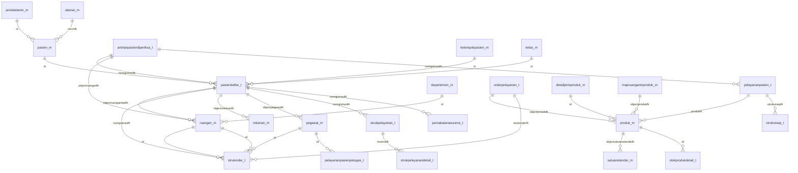

# LAPORAN ANALISA DATABASE, BACKEND, DAN FRONTEND

**Proyek:** SIMRS RSUD Malangbong (`denisyahid/simrs`)  
**Tanggal analisa:** 11 September 2026  
**Sumber data:**

- `backend/` — aplikasi Laravel (API, 269 file controller, 2.458 rute)
- `frontend-v2/` — aplikasi Vue 3 + TypeScript (1232 file memanggil API, 1227 di antaranya halaman)
- `kiosk/`, `e-reservasi/`, `viewer/` — aplikasi Angular; `eis/` — aplikasi Laravel
- `sql.txt` → `sql_mysql.sql` — dump struktur & contoh data database (537 tabel)

---

## 1. Ringkasan Eksekutif

| Aspek | Jumlah |
|---|---|
| Tabel database | **537** (368 berisi data, 169 tabel kosong/placeholder) |
| Kolom database | **7.217** |
| Baris contoh data | **15.874** (dump `LIMIT 100` per tabel) |
| Tabel yang dipakai kode backend | **442 dari 537** (82.3%) |
| File controller | **269** pada 39 folder modul |
| Rute API | **2458** rute (+11 rute closure) |
| Model Eloquent | **369** model |
| File frontend memanggil API | **1232** (di antaranya 1227 halaman pada `src/pages`) |
| Endpoint unik dipanggil frontend | **1821** |
| Relasi/JOIN antar tabel terdeteksi | **936 pasangan kolom** |
| Tabel dipakai kode tapi tidak ada di dump | **23 tabel** |

**Temuan utama**

1. Aplikasi memakai satu database operasional dengan **537 tabel**: 275 tabel master (`_m`), 205 tabel transaksi (`_t`), dan sisanya tabel pengaturan/temp/legacy.
2. Pusat data transaksi ada pada `pasiendaftar_t` (kunjungan pasien). Hampir semua transaksi klinis maupun billing menyimpan kolom `noregistrasifk`/`norec` yang menunjuk ke tabel ini, sehingga tabel tersebut adalah **tulang punggung relasi database**.
3. Relasi tidak dideklarasikan sebagai FOREIGN KEY di database — semuanya dijaga di level aplikasi (JOIN manual di controller). Dump MySQL hasil konversi juga tanpa FK.
4. Pola akses data campuran: **query builder + raw SQL** (`DB::table`, `DB::select`) dan **Eloquent model** (369 model). Tabel yang paling sering di-JOIN: `pasien_m`, `ruangan_m`, `pegawai_m`, `produk_m`.
5. **95 tabel pada dump tidak dipakai controller mana pun** (kandidat legacy), dan **23 tabel dipakai kode namun tidak ikut ter-dump** (mis. `papalergi_t`, `quisoner_m`, `ris_out`) sehingga struktur kolomnya belum diketahui — dump `sql.txt` tidak memuat seluruh tabel yang dipakai aplikasi.

---

## 2. Metodologi & Sumber Data

| Yang dianalisa | Cara |
|---|---|
| Struktur tabel & kolom | dump `sql_mysql.sql` (hasil konversi `sql.txt`, 537 `CREATE TABLE`) |
| Tabel yang dipakai controller | pemindaian `DB::table()`, `DB::select()`, raw SQL (`FROM`/`JOIN`), dan `Model::` pada 269 file controller |
| JOIN antar tabel | 7.657 klausa JOIN dari kode, dinormalisasi alias → nama tabel (936 pasangan kolom unik) |
| Rute API | parser `backend/routes/web.php` (2.458 definisi rute + 11 rute closure) |
| Pemanggilan frontend | pemindaian `useApi().get/post/put/delete()` pada 1.232 file frontend |
| Fungsi tabel | kurasi manual untuk tabel inti + inferensi pola nama (`_m`, `_t`, `_s`), modul pemakai, dan kolom |

> **Catatan:** dump `sql.txt` dibuat dengan `LIMIT 100` per tabel, jadi jumlah baris di laporan ini adalah jumlah **contoh data**, bukan jumlah data produksi.

---

## 3. Arsitektur Sistem

```
  ┌──────────────────────────┐        ┌───────────────────────────┐
  │  frontend-v2 (Vue 3/TS)  │        │  kiosk / e-reservasi /    │
  │  1.231 halaman modul     │        │  viewer (Angular)         │
  └────────────┬─────────────┘        └─────────────┬─────────────┘
               │  axios  baseURL .../service         │
               ▼                                     ▼
        ┌────────────────────────────────────────────────────────┐
        │  backend Laravel  routes/web.php                       │
        │  middleware jwt.auth → prefix 'service' → controller   │
        │  269 controller · 2.458 rute · 369 model Eloquent      │
        └────────────┬───────────────────────────────────────────┘
                     │  DB::table / DB::select / Eloquent
                     ▼
        ┌────────────────────────────────────────────────────────┐
        │  Database operasional: 537 tabel (master/transaksi)    │
        └────────────────────────────────────────────────────────┘
```

**Pola URL API.** Semua endpoint bisnis berada di bawah prefix `service` (middleware `jwt.auth`), contoh nyata: route `service/emr/get-emr` ↔ frontend memanggil `useApi().get('/emr/get-emr')`.

| Backend | Frontend (frontend-v2/src/pages/module) |
|---|---|
| `app/Http/Controllers/*` | `pages/module/<modul>/*.vue` |
| `app/Models/{Master,Transaksi,...}` | `composable/useApi.ts`, `stores/`, `models/` |
| `routes/web.php` | `router.ts` |

### 3.1 Cara membaca laporan ini

Untuk mengetahui “tabel apa yang dipakai sebuah fitur”, telusuri rantai berikut:

```
halaman .vue  →  useApi().get('/xxx')  →  routes/web.php  →  Controller::method  →  tabel
```

- **Bab 5** — daftar semua tabel beserta fungsi, relasi JOIN, dan controllernya.
- **Bab 6** — penjelasan detail tabel-tabel inti.
- **Bab 7** — peta JOIN antar tabel (pasangan kolom + jumlah kemunculan).
- **Bab 8** — dari sisi backend: tiap folder controller dan tabel yang dipakainya.
- **Bab 9** — dari sisi frontend: tiap folder halaman, endpoint, controller, dan tabelnya.

**Contoh penelusuran (alur simpan EMR):**

| Langkah | Bukti |
|---|---|
| Halaman | `frontend-v2/src/pages/module/emr/*.vue` memanggil `useApi().post('/emr/simpan-emr')` |
| Rute | `backend/routes/web.php`: `Route::post('emr/simpan-emr', 'saveEMR')` pada grup `Route::controller(EMRCtrl::class)` di dalam prefix `service` |
| Controller | `App\Http\Controllers\EMR\EMRCtrl::saveEMR()` |
| Tabel | `pasiendaftar_t` (kunjungan), `emrpasien_t` (dokumen EMR), `antrianpasiendiperiksa_t` (antrian/pelayanan) |
| JOIN | `antrianpasiendiperiksa_t.noregistrasifk ↔ pasiendaftar_t.norec`, lalu `pasien_m.id ↔ pasiendaftar_t.nocmfk` |

---

## 4. Konvensi Penamaan Tabel

| Pola | Arti | Jumlah | Contoh |
|---|---|---|---|
| `_m` | **Master** — data referensi yang tampil di dropdown & validasi | 275 | `agama_m`, `ruangan_m`, `produk_m` |
| `_t` | **Transaksi** — data operasional harian, jumlah baris paling banyak | 205 | `pasiendaftar_t`, `pelayananpasien_t` |
| `_s` | **Sistem/pengaturan** — konfigurasi pengguna, hak akses, modul | 9 | `loginuser_s`, `modulaplikasi_s` |
| `#_...` | **Tabel sementara** (temp table proses) | 10 | `#_jaspel_obat`, `#_noreg` |
| lainnya | Legacy/view/tabel khusus (tanpa pola) | 38 | `koordinat`, `ihs_transaction` |

**Pola kolom yang konsisten di hampir semua tabel**

| Kolom | Arti |
|---|---|
| `id` | Primary key teknis (integer) |
| `norec` | Nomor record bisnis (kunci yang dipakai aplikasi untuk relasi antar transaksi) |
| `kdprofile` | Kode profile/instansi (multi-profile) — ikut di hampir semua query |
| `statusenabled` | Penanda data aktif; di aplikasi dibandingkan dengan `true`/`false`, pada contoh data berisi `'1'`/`'0'` |
| `reportdisplay` / `namaexternal` | Nama yang ditampilkan pada laporan/cetakan |
| `created_at`, `updated_at` | Audit waktu pembuatan & perubahan |
| `object...fk` / `...fk` | Foreign key logis ke tabel master (mis. `objectruanganfk` → `ruangan_m.id`) |
| `kodeexternal`, `q...` | Kode integrasi eksternal & kolom bantu query |

---

## 5. Kamus Tabel per Domain

Setiap tabel dijelaskan: **fungsi**, kolom kunci, relasi JOIN yang terbukti dari kode, serta controller/modul yang memakainya. Domain ditentukan dari modul controller pemakai terbanyak, jika tidak ada dipakai pendekatan pola nama.

### 5.1 Domain: Sistem & Master Data (103 tabel)

_Pengelolaan pengguna, hak akses, menu, dan seluruh tabel master (referensi) rumah sakit._

| Tabel | Fungsi | Baris | Kolom kunci | Relasi JOIN utama | Controller pemakai |
|---|---|---|---|---|---|
| `agama_m` | Master agama (referensi dropdown). | 10 | `id`, `norec`, `kdprofile`, `kodeexternal` | `pasien_m`, `pegawai_m` | `DashboardRegistrasiCtrl`, `ProfilePasienCtrl`, `KiosKController` |
| `alergi_m` | Master jenis alergi pasien. | 100 | `id`, `norec`, `kdprofile`, `kodeexternal` | `papalergi_t` | `SATUSEHATCtrl`, `MasterAlergiCtrl` |
| `asalanggaran_m` | Tabel master/referensi: menyimpan pilihan data asalanggaran yang dipakai dropdown & validasi. Terkait modul Sistem & Master Data. | 3 | `id`, `norec`, `kdprofile`, `kodeexternal` | — | `MasterAsalAnggaranCtrl` |
| `asalsukucadang_m` | Tabel master/referensi: menyimpan pilihan data asalsukucadang yang dipakai dropdown & validasi. Terkait modul Sistem & Master Data. | 2 | `id`, `norec`, `kdprofile`, `kodeexternal` | — | `MasterAsalSukuCadangCtrl` |
| `asuransipasien_m` | Master peserta asuransi/asuransi pasien (polisi/penjamin) beserta masa berlaku. | 100 | `id`, `norec`, `objectgolonganasuransifk`, `objecthubunganpesertafk` | `pemakaianasuransi_t`, `kelas_m`, `golonganasuransi_m` | `InaCbgCtrl`, `LaporanRekamMedisCtrl`, `PiutangCtrl` |
| `bahanproduk_m` | Tabel master/referensi: menyimpan pilihan data bahanproduk yang dipakai dropdown & validasi. Terkait modul Sistem & Master Data, Aset / IPSRS. | 3 | `id`, `norec`, `objectdepartemenfk`, `objectkelompokprodukfk` | — | `AssetCtrl`, `TransferBarangCtrl`, `MasterBahanProdukCtrl` |
| `bahansample_m` | Tabel master/referensi: menyimpan pilihan data bahansample yang dipakai dropdown & validasi. Terkait modul Sistem & Master Data. | 2 | `id`, `norec`, `objectdepartemenfk`, `objectsatuankecilfk` | — | `MasterProdukCtrl` |
| `bankaccount_m` | Tabel master/referensi: menyimpan pilihan data bankaccount yang dipakai dropdown & validasi. Terkait modul Sistem & Master Data, Bendahara. | 13 | `id`, `norec`, `kdaccountfk`, `kdcarabayarfk` | `strukbuktipengeluarancarabayar_t` | `BendaharaPengeluaranCtrl`, `MasterBankCtrl` |
| `bentukproduk_m` | Tabel master/referensi: menyimpan pilihan data bentukproduk yang dipakai dropdown & validasi. Terkait modul Sistem & Master Data. | 16 | `id`, `norec`, `objectdepartemenfk`, `objectkelompokprodukfk` | — | `MasterBentukProdukCtrl`, `MasterProdukCtrl` |
| `berkaspasien_m` | Tabel master/referensi: menyimpan pilihan data berkaspasien yang dipakai dropdown & validasi. Terkait modul Sistem & Master Data, Rekam Medis Elektronik. | 10 | `id`, `kdprofile`, `kodeexternal`, `statusenabled` | — | `EMRCtrl`, `MasterBerkasPasienCtrl` |
| `bku_m` | Tabel master/referensi: menyimpan pilihan data bku yang dipakai dropdown & validasi. Terkait modul Sistem & Master Data. | 4 | `id`, `norec`, `kdprofile`, `kodeexternal` | `mapbkutokelompoktransaksi_m` | `MapBkutoKelompokTransaksiCtrl` |
| `detailkategorypegawai_m` | Tabel master/referensi: menyimpan pilihan data detailkategorypegawai yang dipakai dropdown & validasi. Terkait modul Sistem & Master Data. | 15 | `id`, `norec`, `objectkategorypegawaifk`, `kdprofile` | `kategorypegawai_m`, `pegawai_m` | `MasterDetailKategoryPegawaiCtrl`, `MasterPegawaiCtrl` |
| `detailkelompokpegawai_m` | Tabel master/referensi: menyimpan pilihan data detailkelompokpegawai yang dipakai dropdown & validasi. Terkait modul Sistem & Master Data. | 5 | `id`, `norec`, `objectkelompokpegawaifk`, `kdprofile` | `jenispegawai_m` | `MasterJenisPegawaiCtrl` |
| `diagnosakanker_m` | Tabel tanpa data pada dump; struktur kolom belum diketahui. | 0 | `id` | `jeniskelamin_m`, `kategorydiagnosa_m` | `MasterDiagnosaKankerCtrl` |
| `eselon_m` | Tabel master/referensi: menyimpan pilihan data eselon yang dipakai dropdown & validasi. Terkait modul Sistem & Master Data. | 2 | `id`, `norec`, `kdprofile`, `kodeexternal` | `pegawai_m` | `MasterPegawaiCtrl` |
| `generalproduk_m` | Tabel master/referensi: menyimpan pilihan data generalproduk yang dipakai dropdown & validasi. Terkait modul Sistem & Master Data. | 2 | `id`, `norec`, `objectdepartemenfk`, `objectgdetailjenisprodukfk` | — | `MasterProdukCtrl` |
| `golonganasuransi_m` | Tabel master/referensi: menyimpan pilihan data golonganasuransi yang dipakai dropdown & validasi. Terkait modul Sistem & Master Data. | 4 | `id`, `norec`, `kdprofile`, `kodeexternal` | `asuransipasien_m` | `MasterAsuransiPasienCtrl` |
| `golonganpegawai_m` | Tabel master/referensi: menyimpan pilihan data golonganpegawai yang dipakai dropdown & validasi. Terkait modul Sistem & Master Data. | 16 | `id`, `norec`, `kdprofile`, `kodeexternal` | `pegawai_m` | `MasterPegawaiCtrl` |
| `golonganproduk_m` | Master golongan produk (generik, paten). | 2 | `id`, `norec`, `objectdepartemenfk`, `objectkelompokprodukfk` | — | `MasterProdukCtrl` |
| `harganettoprodukbykelas_m` | Tabel master/referensi: menyimpan pilihan data harganettoprodukbykelas yang dipakai dropdown & validasi. Terkait modul Sistem & Master Data, Dashboard. | 100 | `id`, `norec`, `objectasalprodukfk`, `objectjenistariffk` | `mapruangantoproduk_m`, `suratkeputusan_m`, `komponenharga_m` | `AmbulanCtrl`, `DashboardGiziCtrl`, `DashboardLaboratoriumCtrl` |
| `hubungankeluarga_m` | Master hubungan keluarga/penanggung jawab. | 8 | `id`, `norec`, `kdprofile`, `kodeexternal` | `pasien_m`, `anggotakeluarga_t`, `kategorypegawai_m` | `AmbulanCtrl`, `DashboardApotikCtrl`, `DashboardRegistrasiCtrl` |
| `hubunganpesertaasuransi_m` | Tabel master/referensi: menyimpan pilihan data hubunganpesertaasuransi yang dipakai dropdown & validasi. Terkait modul Sistem & Master Data, Bridging / Integrasi Eksternal. | 3 | `id`, `norec`, `kdprofile`, `kodeexternal` | `asuransipasien_m` | `TelemedicineCtrl`, `MasterAsuransiPasienCtrl` |
| `indikatoripcn_m` | Tabel master/referensi: menyimpan pilihan data indikatoripcn yang dipakai dropdown & validasi. Terkait modul Sistem & Master Data, PPI. | 100 | `id`, `norec`, `kelompokipcnfk`, `departemenfk` | `kelompokipcn_m`, `departemen_m` | `PPICtrl`, `MasterPPICtrl` |
| `indikatorrensar_m` | Tabel master/referensi: menyimpan pilihan data indikatorrensar yang dipakai dropdown & validasi. Terkait modul Sistem & Master Data, Indikator Mutu. | 5 | `id`, `norec`, `objectsasaranstrategisfk`, `jenisindikatorfk` | `sasaranmutu_t`, `indikatorrensardetail_t`, `targetindikator_m` | `PMKPCtrl`, `MasterCapaianIndikatorCtrl`, `MasterIndikatorCtrl` |
| `indikatorrensardetail_t` | Tabel transaksi: mencatat indikatorrensardetail. Terkait modul Sistem & Master Data. | 3 | `norec`, `headfk`, `indikatorfk`, `jenisindikatorfk` | `indikatorrensar_m`, `jenisindikator_m` | `MasterCapaianIndikatorCtrl` |
| `jabatan_m` | Master jabatan pegawai. | 29 | `id`, `norec`, `objectjenisjabatanfk`, `objectkelompokjabatanfk` | `pegawai_m`, `riwayatjabatan_t` | `PenerimaanBarangCtrl`, `TransferBarangCtrl`, `RemunerasiCtrl` |
| `jadwalpraktek_m` | Tabel master/referensi: menyimpan pilihan data jadwalpraktek yang dipakai dropdown & validasi. Terkait modul Sistem & Master Data, Kiosk Mandiri. | 5 | `id`, `norec`, `kdprofile`, `kodeexternal` | `jadwaldokter_m`, `shiftkerja_m` | `KiosKController`, `MasterJadwalPraktekCtrl`, `MasterShiftKerjaCtrl` |
| `jenisalamat_m` | Tabel master/referensi: menyimpan pilihan data jenisalamat yang dipakai dropdown & validasi. Terkait modul Sistem & Master Data. | 6 | `id`, `norec`, `kdprofile`, `kodeexternal` | — | `MasterJenisAlamatCtrl` |
| `jenisindikator_m` | Tabel master/referensi: menyimpan pilihan data jenisindikator yang dipakai dropdown & validasi. Terkait modul Sistem & Master Data. | 4 | `id`, `norec`, `kdprofile`, `kodeexternal` | `indikatorrensardetail_t`, `indikatorrensar_m` | `MasterCapaianIndikatorCtrl`, `MasterIndikatorCtrl`, `MasterJenisIndikatorCtrl` |
| `jenisjabatan_m` | Tabel master/referensi: menyimpan pilihan data jenisjabatan yang dipakai dropdown & validasi. Terkait modul Sistem & Master Data, Logistik & Persediaan. | 10 | `id`, `norec`, `kdprofile`, `kodeexternal` | `pegawai_m`, `riwayatjabatan_t` | `TransferBarangCtrl`, `MasterJabatanCtrl`, `MasterJenisJabatanCtrl` |
| `jeniskasus_m` | Tabel master/referensi: menyimpan pilihan data jeniskasus yang dipakai dropdown & validasi. Terkait modul Sistem & Master Data. | 1 | `id`, `kdprofile`, `kdjeniskasus`, `statusenabled` | — | `MasterJenisKasusCtrl` |
| `jeniskomponenharga_m` | Tabel master/referensi: menyimpan pilihan data jeniskomponenharga yang dipakai dropdown & validasi. Terkait modul Sistem & Master Data. | 16 | `id`, `norec`, `objectdepartemenfk`, `objectjeniskomponenhargaheadfk` | `komponenharga_m` | `MasterJenisKomponenHargaCtrl`, `MasterKomponenHargaCtrl` |
| `jeniskondisipasien_m` | Tabel master/referensi: menyimpan pilihan data jeniskondisipasien yang dipakai dropdown & validasi. Terkait modul Sistem & Master Data. | 8 | `id`, `norec`, `kdprofile`, `kodeexternal` | `kondisipasien_m`, `statuskeluar_m` | `MasterJenisKondisiPasienCtrl`, `MasterKondisiPasienCtrl`, `MasterStatusKeluarCtrl` |
| `jenispaket_m` | Tabel master/referensi: menyimpan pilihan data jenispaket yang dipakai dropdown & validasi. Terkait modul Sistem & Master Data. | 5 | `id`, `norec`, `objectjenispaketheadfk`, `kdprofile` | — | `MasterPaketCtrl` |
| `jenispelayanan_m` | Tabel master/referensi: menyimpan pilihan data jenispelayanan yang dipakai dropdown & validasi. Terkait modul Sistem & Master Data, Registrasi & Pendaftaran. | 2 | `id`, `kodeinternal`, `kdprofile`, `statusenabled` | `harganettoprodukbykelasd_m`, `pasiendaftar_t`, `harganettoprodukbykelas_m` | `TelemedicineCtrl`, `DashboardTindakanCtrl`, `HumasCtrl` |
| `jenispendidikan_m` | Tabel master/referensi: menyimpan pilihan data jenispendidikan yang dipakai dropdown & validasi. Terkait modul Sistem & Master Data. | 2 | `id`, `norec`, `kdprofile`, `kodeexternal` | `pendidikan_m` | `MasterPendidikanCtrl` |
| `jenisperawatan_m` | Tabel master/referensi: menyimpan pilihan data jenisperawatan yang dipakai dropdown & validasi. Terkait modul Sistem & Master Data. | 5 | `id`, `norec`, `objectjenisperawatanheadfk`, `kdprofile` | — | `MasterJenisPerawatanCtrl` |
| `jenisperiksapenunjang_m` | Tabel master/referensi: menyimpan pilihan data jenisperiksapenunjang yang dipakai dropdown & validasi. Terkait modul Sistem & Master Data. | 2 | `id`, `norec`, `objectbahansamplefk`, `objectdepartemenfk` | — | `MasterProdukCtrl` |
| `jenispetugaspelaksana_m` | Tabel master/referensi: menyimpan pilihan data jenispetugaspelaksana yang dipakai dropdown & validasi. Terkait modul Sistem & Master Data, Dashboard. | 32 | `id`, `norec`, `objectkomponenhargafk`, `kdprofile` | `pelayananpasienpetugas_t`, `mapjenispetugasptojenispegawai_m` | `AmbulanCtrl`, `CathlabCtrl`, `DashboardCathlabCtrl` |
| `jenisrange_m` | Tabel master/referensi: menyimpan pilihan data jenisrange yang dipakai dropdown & validasi. Terkait modul Sistem & Master Data. | 6 | `id`, `norec`, `objectjenisrangeheadfk`, `kdprofile` | — | `MasterJenisRangeCtrl`, `MasterRangeCtrl` |
| `jenisrekanan_m` | Tabel master/referensi: menyimpan pilihan data jenisrekanan yang dipakai dropdown & validasi. Terkait modul Sistem & Master Data. | 12 | `id`, `norec`, `kdprofile`, `kodeexternal` | `rekanan_m` | `MasterMapping`, `MasterRekananCtrl` |
| `jenistarif_m` | Tabel master/referensi: menyimpan pilihan data jenistarif yang dipakai dropdown & validasi. Terkait modul Sistem & Master Data. | 9 | `id`, `norec`, `kdprofile`, `kodeexternal` | — | `MasterHargaNettoProdukByKelasCtrl`, `MasterJenisTarifCtrl`, `MasterKelompokPasienCtrl` |
| `kategorydiagnosa_m` | Tabel master/referensi: menyimpan pilihan data kategorydiagnosa yang dipakai dropdown & validasi. Terkait modul Sistem & Master Data. | 7 | `id`, `norec`, `kdprofile`, `kodeexternal` | `diagnosa_m`, `diagnosakanker_m`, `diagnosatindakan_m` | `MasterDiagnosaCtrl`, `MasterDiagnosaKankerCtrl`, `MasterDiagnosaTindakanCtrl` |
| `kategorypegawai_m` | Tabel master/referensi: menyimpan pilihan data kategorypegawai yang dipakai dropdown & validasi. Terkait modul Sistem & Master Data. | 11 | `id`, `norec`, `kdprofile`, `kodeexternal` | `pegawai_m`, `detailkategorypegawai_m`, `jeniskelamin_m` | `MasterDetailKategoryPegawaiCtrl`, `MasterPegawaiCtrl` |
| `kategoryproduk_m` | Master kategori produk. | 9 | `id`, `norec`, `objectdepartemenfk`, `objectkelompokprodukfk` | — | `MasterProdukCtrl` |
| `kelasrs_m` | Tabel master/referensi: menyimpan pilihan data kelasrs yang dipakai dropdown & validasi. Terkait modul Sistem & Master Data. | 4 | `id`, `kdprofile`, `statusenabled` | — | `MasterProfileCtrl` |
| `kelompokbarang_m` | Tabel master/referensi: menyimpan pilihan data kelompokbarang yang dipakai dropdown & validasi. Terkait modul Sistem & Master Data, IPSRS. | 7 | `id`, `norec`, `kdprofile`, `kodeexternal` | — | `DashboardIprcCtrl`, `MasterKelompokBarangCtrl` |
| `kelompokipcn_m` | Tabel master/referensi: menyimpan pilihan data kelompokipcn yang dipakai dropdown & validasi. Terkait modul Sistem & Master Data, PPI. | 60 | `id`, `norec`, `kdprofile`, `kodeexternal` | `indikatoripcn_m` | `PPICtrl`, `MasterPPICtrl` |
| `kelompokjabatan_m` | Tabel master/referensi: menyimpan pilihan data kelompokjabatan yang dipakai dropdown & validasi. Terkait modul Sistem & Master Data, Dashboard. | 22 | `id`, `norec`, `kdprofile`, `kodeexternal` | `pegawai_m` | `DashboardPegawaiCtrl`, `MasterJabatanCtrl`, `MasterKelompokJabatanCtrl` |
| `kelompokproduk_m` | Tabel master/referensi: menyimpan pilihan data kelompokproduk yang dipakai dropdown & validasi. Terkait modul Sistem & Master Data, Logistik & Persediaan. | 86 | `id`, `norec`, `objectdepartemenfk`, `objectjenistransaksifk` | `jenisproduk_m`, `jp`, `jenisdiet_m` | `BankDarahCtrl`, `DashboardIprcCtrl`, `LaporanRekamMedisCtrl` |
| `kelompokuser_s` | Tabel pendukung/pengaturan sistem untuk kelompokuser. Terkait modul Sistem & Master Data, Dashboard. | 52 | `id`, `norec`, `objecthistoryloginifk`, `objecthistoryloginsfk` | `ruangan_m`, `loginuser_s` | `AuthCtrl`, `DashboardIGDCtrl`, `DashboardRJCtrl` |
| `keluargapegawai_m` | Tabel tanpa data pada dump; struktur kolom belum diketahui. | 0 | `id` | — | `MasterPegawaiCtrl` |
| `levelproduk_m` | Tabel master/referensi: menyimpan pilihan data levelproduk yang dipakai dropdown & validasi. Terkait modul Sistem & Master Data. | 2 | `id`, `norec`, `objectdepartemenfk`, `objectkelompokprodukfk` | — | `MasterProdukCtrl` |
| `mapjenispetugasptojenispegawai_m` | Tabel master/referensi: menyimpan pilihan data mapjenispetugasptojenispegawai yang dipakai dropdown & validasi. Terkait modul Sistem & Master Data, Dashboard. | 49 | `id`, `norec`, `objectjenispegawaifk`, `objectjenispetugaspefk` | `jenispegawai_m`, `jenispetugaspelaksana_m` | `DashboardMasterDataCtrl`, `TindakanCtrl`, `MasterMapJenisPetugasToJenisPegawaiCtrl` |
| `maploginusertomodulaplikasi_s` | Tabel pendukung/pengaturan sistem untuk maploginusertomodulaplikasi. Terkait modul Sistem & Master Data, Dashboard. | 100 | `id`, `norec`, `objectmodulaplikasifk`, `objectloginuserfk` | `loginuser_s`, `modulaplikasi_s` | `DashboardMasterDataCtrl`, `MasterMapLoginUserToModulAplikasiCtrl` |
| `mapobjekmodulaplikasitomodulaplikasi_s` | Tabel pendukung/pengaturan sistem untuk mapobjekmodulaplikasitomodulaplikasi. Terkait modul Sistem & Master Data, Umum & Sinkronisasi. | 100 | `id`, `norec`, `kdprofile`, `kodeexternal` | `objekmodulaplikasi_s`, `modulaplikasi_s` | `SysAdminCtrl`, `MasterModulAplikasiCtrl` |
| `mappakettoproduk_m` | Tabel master/referensi: menyimpan pilihan data mappakettoproduk yang dipakai dropdown & validasi. Terkait modul Sistem & Master Data, Dashboard. | 100 | `id`, `norec`, `objectpaketfk`, `objectprodukfk` | `produk_m`, `paket_m` | `DashboardMasterDataCtrl`, `TindakanCtrl`, `MasterMapPaketToProdukCtrl` |
| `mapremunkelompok_t` | Tabel transaksi: mencatat mapremunkelompok. Terkait modul Sistem & Master Data, Remunerasi & Jasa Pelayanan. | 18 | `id`, `norec`, `objectpegawaifk`, `objectruanganfk` | `pegawai_m`, `ruangan_m` | `RemunerasiCtrl`, `MapKelompokPenghasilCtrl` |
| `mapruangantoakomodasi_t` | Tabel transaksi: mencatat mapruangantoakomodasi. Terkait modul Sistem & Master Data. | 51 | `id`, `norec`, `objectprodukfk`, `objectkamarfk` | `harganettoprodukbykelasd_m` | `MapAkomodasiCtrl` |
| `matauang_m` | Tabel master/referensi: menyimpan pilihan data matauang yang dipakai dropdown & validasi. Terkait modul Sistem & Master Data. | 2 | `id`, `norec`, `kdprofile`, `kodeexternal` | — | `MasterHargaNettoProdukByKelasCtrl` |
| `merkproduk_m` | Tabel master/referensi: menyimpan pilihan data merkproduk yang dipakai dropdown & validasi. Terkait modul Sistem & Master Data, Aset / IPSRS. | 14 | `id`, `norec`, `objectdepartemenfk`, `kdprofile` | `departemen_m` | `AssetCtrl`, `TransferBarangCtrl`, `MasterMerkProdukCtrl` |
| `modulaplikasi_s` | Tabel pendukung/pengaturan sistem untuk modulaplikasi. Terkait modul Sistem & Master Data, Umum & Sinkronisasi. | 93 | `id`, `norec`, `kdprofile`, `kodeexternal` | `mapobjekmodulaplikasitomodulaplikasi_s`, `maploginusertomodulaplikasi_s` | `SysAdminCtrl`, `MasterMapLoginUserToModulAplikasiCtrl`, `MasterModulAplikasiCtrl` |
| `negara_m` | Tabel master/referensi: menyimpan pilihan data negara yang dipakai dropdown & validasi. Terkait modul Sistem & Master Data, Bridging / Integrasi Eksternal. | 15 | `id`, `norec`, `kdprofile`, `kodeexternal` | `pasien_m`, `pegawai_m` | `AmbulanCtrl`, `BridgingSirsOnlineCtrl`, `TelemedicineCtrl` |
| `objekmodulaplikasi_s` | Tabel pendukung/pengaturan sistem untuk objekmodulaplikasi. Terkait modul Sistem & Master Data, Umum & Sinkronisasi. | 100 | `id`, `norec`, `kdprofile`, `kodeexternal` | `mapobjekmodulaplikasitomodulaplikasi_s` | `SysAdminCtrl`, `MasterModulAplikasiCtrl` |
| `paket_m` | Tabel master/referensi: menyimpan pilihan data paket yang dipakai dropdown & validasi. Terkait modul Sistem & Master Data, Rekam Medis Elektronik. | 13 | `id`, `norec`, `objectjenispaketfk`, `objectjenistransaksifk` | `mappakettoproduk_m` | `TindakanCtrl`, `MasterMapPaketToProdukCtrl`, `MasterPaketCtrl` |
| `paketobat_m` | Tabel master/referensi: menyimpan pilihan data paketobat yang dipakai dropdown & validasi. Terkait modul Sistem & Master Data, Farmasi. | 39 | `id`, `norec`, `objectpegawaifk`, `kdprofile` | `paketobatd_m` | `OrderResepCtrl`, `MasterPaketObatCtrl` |
| `paketobatd_m` | Tabel master/referensi: menyimpan pilihan data paketobatd yang dipakai dropdown & validasi. Terkait modul Sistem & Master Data, Farmasi. | 100 | `id`, `norec`, `objectpaketobatfk`, `produkfk` | `produk_m`, `satuanresep_m`, `paketobat_m` | `OrderResepCtrl`, `MasterPaketObatCtrl` |
| `pekerjaan_m` | Master pekerjaan pasien. | 100 | `id`, `norec`, `kdprofile`, `kodeexternal` | `pasien_m`, `keluhanpelanggan_m`, `kategorypegawai_m` | `TelemedicineCtrl`, `DashboardRegistrasiCtrl`, `ProfilePasienCtrl` |
| `pendidikan_m` | Master pendidikan terakhir. | 10 | `id`, `norec`, `objectjenispendidikanfk`, `kdprofile` | `pasien_m`, `pegawai_m`, `kategorypegawai_m` | `TelemedicineCtrl`, `DashboardPegawaiCtrl`, `DashboardRegistrasiCtrl` |
| `ppra_divisi` | Tabel tanpa data pada dump; struktur kolom belum diketahui. | 0 | `id` | `ppra_jenisoperasi` | `GeneralCtrl`, `MasterAstorBMCtrl` |
| `ppra_generik` | Tabel tanpa data pada dump; struktur kolom belum diketahui. | 0 | `id` | `produk_m`, `ppra_jenisoperasidetail`, `ppra_tindakandetail` | `LaporanPengunjungCtrl`, `MasterAstorBMCtrl`, `MasterDetailJenisProdukCtrl` |
| `ppra_jenisoperasi` | Tabel tanpa data pada dump; struktur kolom belum diketahui. | 0 | `id` | `ppra_transaksi`, `ppra_divisi`, `ppra_antibiotik` | `OrderResepCtrl`, `GeneralCtrl`, `LaporanPengunjungCtrl` |
| `ppra_jenisoperasidetail` | Tabel tanpa data pada dump; struktur kolom belum diketahui. | 0 | `id` | `ppra_generikdetail`, `produk_m`, `ppra_jenisoperasi` | `InputResepCtrl`, `MasterAstorBMCtrl` |
| `ppra_tindakan` | Tabel tanpa data pada dump; struktur kolom belum diketahui. | 0 | `id` | `ppra_transaksi`, `ppra_tindakandetail` | `OrderResepCtrl`, `GeneralCtrl`, `LaporanPengunjungCtrl` |
| `ppra_tindakandetail` | Tabel tanpa data pada dump; struktur kolom belum diketahui. | 0 | `id` | `ppra_generikdetail`, `produk_m`, `ppra_tindakan` | `InputResepCtrl`, `MasterAstorBMCtrl` |
| `produsenproduk_m` | Tabel master/referensi: menyimpan pilihan data produsenproduk yang dipakai dropdown & validasi. Terkait modul Sistem & Master Data, Aset / IPSRS. | 5 | `id`, `norec`, `objectdepartemenfk`, `objectnegarafk` | — | `AssetCtrl`, `TransferBarangCtrl`, `MasterProdukCtrl` |
| `range_m` | Tabel master/referensi: menyimpan pilihan data range yang dipakai dropdown & validasi. Terkait modul Sistem & Master Data. | 11 | `id`, `norec`, `objectjenisrangefk`, `objectsatuanstandarfk` | `persenhargajualproduk_m` | `MasterPersenHargaJualProduk`, `MasterRangeCtrl` |
| `rhesus_m` | Tabel master/referensi: menyimpan pilihan data rhesus yang dipakai dropdown & validasi. Terkait modul Sistem & Master Data. | 5 | `id`, `norec`, `kdprofile`, `kodeexternal` | — | `MasterProdukCtrl`, `MasterRhesusCtrl` |
| `riwayatpelatihan_t` | Riwayat pelatihan/diklat pegawai. | 0 | `id` | `pegawai_m` | `MasterPegawaiCtrl` |
| `riwayatpendidikan_t` | Riwayat pendidikan pegawai. | 0 | `id` | `pegawai_m`, `pendidikan_m` | `MasterPegawaiCtrl` |
| `rm_detail_obat_m` | Tabel master/referensi: menyimpan pilihan data rm detail obat yang dipakai dropdown & validasi. Terkait modul Sistem & Master Data. | 2 | `id`, `norec`, `kdprofile`, `kodeexternal` | — | `MasterProdukCtrl` |
| `rm_generik_m` | Tabel master/referensi: menyimpan pilihan data rm generik yang dipakai dropdown & validasi. Terkait modul Sistem & Master Data. | 7 | `id`, `norec`, `golongangenerikfk`, `kdprofile` | — | `MasterGenerikCtrl`, `MasterProdukCtrl` |
| `rm_jenisgenerik_m` | Tabel master/referensi: menyimpan pilihan data rm jenisgenerik yang dipakai dropdown & validasi. Terkait modul Sistem & Master Data. | 4 | `id`, `norec`, `kdprofile`, `kodeexternal` | — | `MasterJenisGenerikCtrl` |
| `rm_sediaan_m` | Tabel master/referensi: menyimpan pilihan data rm sediaan yang dipakai dropdown & validasi. Terkait modul Sistem & Master Data, Farmasi. | 36 | `id`, `norec`, `kdprofile`, `kodeexternal` | `produk_m` | `DashboardApotikCtrl`, `OrderResepCtrl`, `MasterSediaanCtrl` |
| `satuanbesar_m` | Tabel master/referensi: menyimpan pilihan data satuanbesar yang dipakai dropdown & validasi. Terkait modul Sistem & Master Data. | 49 | `id`, `norec`, `objectdepartemenfk`, `objectkelompokprodukfk` | `departemen_m`, `kelompokproduk_m` | `MasterSatuanBesarCtrl` |
| `satuankecil_m` | Tabel master/referensi: menyimpan pilihan data satuankecil yang dipakai dropdown & validasi. Terkait modul Sistem & Master Data. | 43 | `id`, `norec`, `objectdepartemenfk`, `objectkelompokprodukfk` | `departemen_m`, `kelompokproduk_m` | `MasterSatuanKecilCtrl` |
| `sdm_kedudukan_m` | Tabel master/referensi: menyimpan pilihan data sdm kedudukan yang dipakai dropdown & validasi. Terkait modul Sistem & Master Data. | 9 | `id`, `norec`, `kdprofile`, `kodeexternal` | `pegawai_m` | `MasterKedudukanPegawaiCtrl`, `MasterPegawaiCtrl` |
| `sdm_kelompokshift_m` | Tabel master/referensi: menyimpan pilihan data sdm kelompokshift yang dipakai dropdown & validasi. Terkait modul Sistem & Master Data. | 7 | `id`, `norec`, `kdprofile`, `kodeexternal` | `pegawai_m`, `shiftkerja_m` | `MasterKelompokShiftCtrl`, `MasterPegawaiCtrl`, `MasterShiftKerjaCtrl` |
| `shiftkerja_m` | Tabel master/referensi: menyimpan pilihan data shiftkerja yang dipakai dropdown & validasi. Terkait modul Sistem & Master Data. | 7 | `id`, `norec`, `objectjadwalpraktekfk`, `objectkelompokshiftfk` | `sdm_kelompokshift_m`, `jadwalpraktek_m` | `MasterShiftKerjaCtrl` |
| `sistemharganetto_m` | Tabel master/referensi: menyimpan pilihan data sistemharganetto yang dipakai dropdown & validasi. Terkait modul Sistem & Master Data. | 7 | `id`, `kdprofile`, `statusenabled`, `sistemharganetto` | — | `MasterPersenHargaJualProduk` |
| `slottingkiosk_m` | Pengaturan slot/loket kiosk per ruangan dan tanggal. | 100 | `id`, `norec`, `objectruanganfk`, `objectpegawaifk` | `ruangan_m` | `AntrianOnlineCtrl`, `KiosKController`, `LaporanPengunjungCtrl` |
| `slottingonline_m` | Tabel master/referensi: menyimpan pilihan data slottingonline yang dipakai dropdown & validasi. Terkait modul Sistem & Master Data. | 10 | `id`, `norec`, `objectruanganfk`, `kdprofile` | `ruangan_m` | `MasterSlottingOnlineCtrl` |
| `statusapotik_m` | Tabel master/referensi: menyimpan pilihan data statusapotik yang dipakai dropdown & validasi. Terkait modul Sistem & Master Data. | 10 | `id`, `norec`, `kdprofile`, `kodeexternal` | — | `MasterStatusApotikCtrl` |
| `statusbed_m` | Tabel master/referensi: menyimpan pilihan data statusbed yang dipakai dropdown & validasi. Terkait modul Sistem & Master Data, Bridging / Integrasi Eksternal. | 13 | `id`, `norec`, `kdprofile`, `kodeexternal` | `tempattidur_m` | `BridgingBPJSCtrl`, `SiranapCtrl`, `HumasCtrl` |
| `statuspegawai_m` | Tabel master/referensi: menyimpan pilihan data statuspegawai yang dipakai dropdown & validasi. Terkait modul Sistem & Master Data, Dashboard. | 11 | `id`, `norec`, `objectstatuspegawaiheadfk`, `kdprofile` | `pegawai_m` | `DashboardPegawaiCtrl`, `DokterCareIntegrasiCtrl`, `MasterPegawaiCtrl` |
| `statusperkawinan_m` | Master status perkawinan. | 5 | `id`, `norec`, `kdprofile`, `kodeexternal` | `pasien_m` | `TelemedicineCtrl`, `DashboardRegistrasiCtrl`, `ProfilePasienCtrl` |
| `statuspraktek_m` | Tabel master/referensi: menyimpan pilihan data statuspraktek yang dipakai dropdown & validasi. Terkait modul Sistem & Master Data. | 4 | `id`, `norec`, `kdprofile`, `kodeexternal` | — | `MasterJadwalDokterCtrl` |
| `statusproduk_m` | Tabel master/referensi: menyimpan pilihan data statusproduk yang dipakai dropdown & validasi. Terkait modul Sistem & Master Data. | 2 | `id`, `norec`, `objectdepartemenfk`, `objectkelompokprodukfk` | — | `MasterProdukCtrl` |
| `subkategory` | Tabel tanpa data pada dump; struktur kolom belum diketahui. | 0 | `id` | — | `MasterProdukCtrl` |
| `suku_m` | Tabel master/referensi: menyimpan pilihan data suku yang dipakai dropdown & validasi. Terkait modul Sistem & Master Data, Rekam Medis Elektronik. | 37 | `id`, `norec`, `kdprofile`, `kodeexternal` | `pasien_m` | `TelemedicineCtrl`, `ProfilePasienCtrl`, `KiosKController` |
| `targetindikator_m` | Tabel master/referensi: menyimpan pilihan data targetindikator yang dipakai dropdown & validasi. Terkait modul Sistem & Master Data. | 5 | `id`, `norec`, `objectkamusindikatorfk`, `indikatorrensarfk` | `indikatorrensar_m` | `MasterTargetIndikatorCtrl` |
| `typepegawai_m` | Tabel master/referensi: menyimpan pilihan data typepegawai yang dipakai dropdown & validasi. Terkait modul Sistem & Master Data. | 6 | `id`, `norec`, `kdprofile`, `kodeexternal` | — | `MasterPegawaiCtrl`, `MasterTipePegawaiCtrl` |
| `unitkerjapegawai_m` | Riwayat unit kerja pegawai. | 8 | `id`, `norec`, `objectjabatankepalafk`, `kdprofile` | `pegawai_m` | `RemunerasiCtrl`, `MasterPegawaiCtrl`, `MasterUnitKerjaPegawaiCtrl` |

### 5.2 Domain: Logistik & Persediaan (30 tabel)

_Stok barang, gudang, penerimaan, dan distribusi ke ruangan._

| Tabel | Fungsi | Baris | Kolom kunci | Relasi JOIN utama | Controller pemakai |
|---|---|---|---|---|---|
| `asalproduk_m` | Tabel master/referensi: menyimpan pilihan data asalproduk yang dipakai dropdown & validasi. Terkait modul Logistik & Persediaan, Farmasi. | 25 | `id`, `norec`, `objectdepartemenfk`, `objectkelompokprodukfk` | `stokprodukdetail_t`, `keteranganbelanja_t`, `orderpelayanan_t` | `AnggaranCtrl`, `AssetCtrl`, `BendaharaPenerimaanCtrl` |
| `closinged_t` | Tabel tanpa data pada dump; struktur kolom belum diketahui. | 0 | `id` | `produk_m`, `ruangan_m` | `PersediaanCtrl` |
| `closingpersediaan_t` | Tabel tanpa data pada dump; struktur kolom belum diketahui. | 0 | `id` | `produk_m`, `asalproduk_m` | `PersediaanCtrl` |
| `detailgolonganproduk_m` | Tabel master/referensi: menyimpan pilihan data detailgolonganproduk yang dipakai dropdown & validasi. Terkait modul Logistik & Persediaan, Sistem & Master Data. | 20 | `id`, `norec`, `objectdepartemenfk`, `objectkelompokprodukfk` | — | `OrderBarangCtrl`, `MasterProdukCtrl` |
| `detailjenisproduk_m` | Tabel master/referensi: menyimpan pilihan data detailjenisproduk yang dipakai dropdown & validasi. Terkait modul Logistik & Persediaan, Pelaporan. | 100 | `id`, `norec`, `objectaccountfk`, `objectdepartemenfk` | `produk_m`, `jenisproduk_m`, `chartofaccountmapjurnal_t` | `JurnalPelayananPasienCtrl`, `JurnalPenerimaanPersediaanCtrl`, `JurnalSetoranKasirCtrl` |
| `jenis_permintaan_m` | Tabel master/referensi: menyimpan pilihan data jenis permintaan yang dipakai dropdown & validasi. Terkait modul Logistik & Persediaan. | 2 | `id`, `norec`, `kdprofile`, `kodeexternal` | — | `OrderBarangCtrl` |
| `jenisaset_m` | Tabel tanpa data pada dump; struktur kolom belum diketahui. | 0 | `id` | — | `TransferBarangCtrl` |
| `jenisusulan_m` | Tabel master/referensi: menyimpan pilihan data jenisusulan yang dipakai dropdown & validasi. Terkait modul Logistik & Persediaan, Sistem & Master Data. | 6 | `id`, `norec`, `kdprofile`, `kodeexternal` | — | `DashboardIprcCtrl`, `PemesananBarangCtrl`, `PenerimaanBarangCtrl` |
| `kartustok_t` | Tabel transaksi: mencatat kartustok. Terkait modul Logistik & Persediaan, Farmasi. | 100 | `norec`, `produkfk`, `ruanganfk`, `nostrukterimafk` | `produk_m` | `BankDarahCtrl`, `DashboardLogistikCtrl`, `InputResepCtrl` |
| `kirimproduk_t` | Pengiriman produk ke unit/ruangan. | 100 | `norec`, `objectasalprodukfk`, `objectasalprodukkirimfk`, `objectkondisiprodukreturfk` | `strukkirim_t`, `produk_m`, `stokprodukdetail_t` | `BankDarahCtrl`, `DashboardGiziCtrl`, `DashboardLogistikCtrl` |
| `kondisiaset_m` | Tabel master/referensi: menyimpan pilihan data kondisiaset yang dipakai dropdown & validasi. Terkait modul Logistik & Persediaan. | 2 | `id`, `norec`, `kdprofile`, `kodeexternal` | — | `PercobaanDistribusiBarangCtrl`, `TransferBarangCtrl` |
| `konversisatuan_t` | Aturan konversi antar satuan produk. | 100 | `id`, `objekprodukfk`, `kdprofile`, `statusenabled` | `produk_m`, `satuanstandar_m` | `TelemedicineCtrl`, `BankDarahCtrl`, `DashboardLogistikCtrl` |
| `loginuser_s` | Tabel pendukung/pengaturan sistem untuk loginuser. Terkait modul Logistik & Persediaan, Sistem & Master Data. | 100 | `id`, `norec`, `objectkelompokuserfk`, `objectpegawaifk` | `pegawai_m`, `maploginusertoruangan_s`, `strukposting_t` | `JurnalSetoranKasirCtrl`, `AmbulanCtrl`, `AuthCtrl` |
| `maploginusertoruangan_s` | Tabel pendukung/pengaturan sistem untuk maploginusertoruangan. Terkait modul Logistik & Persediaan, Dashboard. | 100 | `id`, `norec`, `objectloginuserfk`, `objectruanganfk` | `ruangan_m`, `loginuser_s` | `AuthCtrl`, `BendaharaPenerimaanCtrl`, `BendaharaPengeluaranCtrl` |
| `mataanggaran_t` | Tabel tanpa data pada dump; struktur kolom belum diketahui. | 0 | `id` | — | `TransferBarangCtrl` |
| `orderpelayanan_t` | Order/permintaan pelayanan (tindakan, lab, radiologi) dari poliklinik ke unit penunjang. | 100 | `norec`, `objectaccountfk`, `objectasalprodukfk`, `objectbentukprodukdarahfk` | `strukorder_t`, `produk_m`, `satuanstandar_m` | `AmbulanCtrl`, `OrderAmbulanCtrl`, `OrderBedahCtrl` |
| `passwordautorisasi_s` | Tabel pendukung/pengaturan sistem untuk passwordautorisasi. Terkait modul Logistik & Persediaan. | 1 | `id`, `norec`, `kdprofile`, `kodeexternal` | — | `StokBarangCtrl` |
| `pengendali_m` | Tabel master/referensi: menyimpan pilihan data pengendali yang dipakai dropdown & validasi. Terkait modul Logistik & Persediaan. | 8 | `id`, `norec`, `kdprofile`, `kodeexternal` | — | `PemesananBarangCtrl`, `SuratPerintahKerjaCtrl` |
| `produk_m` | Master produk/barang & jasa (obat, BMHP, tarif layanan) beserta harga dan satuan. | 100 | `id`, `norec`, `objectaccountfk`, `objectbahanprodukfk` | `pelayananpasien_t`, `detailjenisproduk_m`, `satuanstandar_m` | `JurnalNonLayananCtrl`, `JurnalPelayananPasienCtrl`, `JurnalPenerimaanPersediaanCtrl` |
| `riwayatrealisasi_t` | Tabel tanpa data pada dump; struktur kolom belum diketahui. | 0 | `id` | `strukpelayanan_t`, `strukrealisasi_t` | `DashboardIprcCtrl`, `PemesananBarangCtrl`, `PenerimaanBarangCtrl` |
| `saldoprodukdetail_t` | Tabel tanpa data pada dump; struktur kolom belum diketahui. | 0 | `id` | `produk_m`, `asalproduk_m`, `strukpelayanan_t` | `MKKOCtrl`, `PersediaanCtrl` |
| `satuanstandar_m` | Master satuan standar barang (tablet, botol, ampul). | 100 | `id`, `norec`, `objectdepartemenfk`, `objectkelompokprodukfk` | `produk_m`, `orderpelayanan_t`, `strukpelayanandetail_t` | `JurnalNonLayananCtrl`, `AssetCtrl`, `BendaharaPengeluaranCtrl` |
| `status_barang_m` | Tabel tanpa data pada dump; struktur kolom belum diketahui. | 0 | `id` | `orderpelayanan_t`, `strukpraorderdetail_t` | `DashboardIprcCtrl`, `PemesananBarangCtrl`, `PurchasRequestCtrl` |
| `stokprodukdetail_t` | Kartu stok per batch produk (jumlah, tanggal kadaluarsa, gudang/ruangan) - inti persediaan. | 100 | `norec`, `objectasalprodukfk`, `objectlokasifk`, `objectprodukfk` | `produk_m`, `strukpelayanan_t`, `ruangan_m` | `AssetCtrl`, `IHSController`, `SATUSEHATCtrl` |
| `stokprodukdetailopname_t` | Tabel transaksi: mencatat stokprodukdetailopname. Terkait modul Logistik & Persediaan. | 100 | `norec`, `objectasalprodukfk`, `objectprodukfk`, `objectruanganfk` | `strukclosing_t`, `produk_m`, `strukpelayanan_t` | `PersediaanCtrl`, `StokBarangCtrl` |
| `strukkirim_t` | Tabel transaksi: mencatat strukkirim. Terkait modul Logistik & Persediaan, Pelaporan. | 100 | `norec`, `noorderfk`, `nostrukfk`, `nostruk_tfk` | `kirimproduk_t`, `ruangan_m`, `postingjurnaltransaksi_t` | `JurnalCtrl`, `AssetCtrl`, `BankDarahCtrl` |
| `strukpelayanandetail_t` | Tabel transaksi: mencatat strukpelayanandetail. Terkait modul Logistik & Persediaan, Pelaporan. | 100 | `norec`, `noclosingfk`, `nokirimfk`, `noorderfk` | `strukpelayanan_t`, `produk_m`, `postingjurnaltransaksi_t` | `BukuBesarCtrl`, `JurnalCtrl`, `JurnalNonLayananCtrl` |
| `strukpraorderdetail_t` | Tabel tanpa data pada dump; struktur kolom belum diketahui. | 0 | `id` | `produk_m`, `satuanstandar_m`, `asalproduk_m` | `DashboardIprcCtrl`, `PurchaseOrderCtrl` |
| `strukretur_t` | Tabel transaksi: mencatat strukretur. Terkait modul Logistik & Persediaan, Pelaporan. | 100 | `norec`, `objectkelompoktransaksifk`, `objectruanganfk`, `objectpegawaifk` | `pelayananpasienretur_t`, `strukresep_t`, `pegawai_m` | `DashboardObatAlkesCtrl`, `InputResepCtrl`, `LaporanPengunjungCtrl` |
| `strukreturdetail_t` | Tabel tanpa data pada dump; struktur kolom belum diketahui. | 0 | `id` | `strukpelayanandetail_t`, `strukretur_t`, `produk_m` | `LaporanPengunjungCtrl`, `DistribusiBarangCtrl`, `PenerimaanBarangCtrl` |

### 5.3 Domain: Rekam Medis Elektronik (30 tabel)

_Asesmen, CPPT, diagnosa, tindakan, resume medis, dan dokumen rekam medis._

| Tabel | Fungsi | Baris | Kolom kunci | Relasi JOIN utama | Controller pemakai |
|---|---|---|---|---|---|
| `FormulirSkemaPenyinaranRadioterapi` | Tabel tanpa data pada dump; struktur kolom belum diketahui. | 0 | `id` | — | `EMRCtrl` |
| `antrianpasienregistrasi_t` | Antrian pendaftaran pasien (loket/online/kiosk) beserta nomor antrian & status panggilan. | 100 | `norec`, `objectagamafk`, `objectasalrujukanfk`, `objectdesakelurahanfk` | `ruangan_m`, `pasiendaftar_t`, `pasien_m` | `AntrianCtrl`, `AntrianOnlineCtrl`, `TelemedicineCtrl` |
| `catatandokter_t` | Tabel transaksi: mencatat catatandokter. Terkait modul Rekam Medis Elektronik. | 44 | `norec`, `nocmfk`, `noregistrasifk`, `pegawaifk` | `pasien_m`, `pegawai_m` | `ProfilePasienCtrl` |
| `detaildiagnosamorfologipasien_t` | Tabel tanpa data pada dump; struktur kolom belum diketahui. | 0 | `id` | `diagnosamorfologipasien_t`, `diagnosamorfologi_m` | `InputDiagnosaCtrl` |
| `detaildiagnosapasien_t` | Tabel transaksi: mencatat detaildiagnosapasien. Terkait modul Rekam Medis Elektronik, Bridging / Integrasi Eksternal. | 100 | `norec`, `noregistrasifk`, `objectdiagnosafk`, `objectdiagnosapasienfk` | `diagnosa_m`, `diagnosapasien_t`, `antrianpasiendiperiksa_t` | `BridgingBPJSCtrl`, `BridgingPenunjangCtrl`, `BridgingSirsOnlineCtrl` |
| `detaildiagnosatindakanpasien_t` | Tabel transaksi: mencatat detaildiagnosatindakanpasien. Terkait modul Rekam Medis Elektronik, Bridging / Integrasi Eksternal. | 100 | `norec`, `objectdiagnosatindakanfk`, `objectdiagnosatindakanpasienfk`, `objectpegawaifk` | `diagnosatindakan_m`, `diagnosatindakanpasien_t`, `antrianpasiendiperiksa_t` | `BridgingBPJSCtrl`, `IHSController`, `InaCbgCtrl` |
| `diagnosakeperawatan_m` | Tabel master/referensi: menyimpan pilihan data diagnosakeperawatan yang dipakai dropdown & validasi. Terkait modul Rekam Medis Elektronik. | 42 | `id`, `norec`, `objectruanganfk`, `kdprofile` | — | `EMRCtrl` |
| `diagnosamorfologi_m` | Tabel master/referensi: menyimpan pilihan data diagnosamorfologi yang dipakai dropdown & validasi. Terkait modul Rekam Medis Elektronik. | 100 | `id`, `norec`, `kdprofile`, `kodeexternal` | `detaildiagnosamorfologipasien_t` | `InputDiagnosaCtrl` |
| `diagnosamorfologipasien_t` | Tabel tanpa data pada dump; struktur kolom belum diketahui. | 0 | `id` | `antrianpasiendiperiksa_t`, `detaildiagnosamorfologipasien_t` | `InputDiagnosaCtrl` |
| `diagnosasdki_m` | Tabel tanpa data pada dump; struktur kolom belum diketahui. | 0 | `id` | — | `EMRCtrl` |
| `diagnosatindakan_m` | Tabel master/referensi: menyimpan pilihan data diagnosatindakan yang dipakai dropdown & validasi. Terkait modul Rekam Medis Elektronik, Bridging / Integrasi Eksternal. | 100 | `id`, `norec`, `objectdiagnosatindakanfk`, `objectkategorydiagnosafk` | `detaildiagnosatindakanpasien_t`, `kategorydiagnosa_m` | `BridgingBPJSCtrl`, `IHSController`, `InaCbgCtrl` |
| `diagnosatindakanpasien_t` | Tabel transaksi: mencatat diagnosatindakanpasien. Terkait modul Rekam Medis Elektronik, Bridging / Integrasi Eksternal. | 100 | `norec`, `objectpasienfk`, `tglpendaftaran`, `kdprofile` | `antrianpasiendiperiksa_t`, `detaildiagnosatindakanpasien_t` | `BridgingBPJSCtrl`, `IHSController`, `InaCbgCtrl` |
| `emr_t` | Tabel transaksi: mencatat emr. Terkait modul Rekam Medis Elektronik, Sistem & Master Data. | 100 | `id`, `headfk`, `headbundlingfk`, `emrfk` | `mapruangantoemr_t` | `EMRCtrl`, `ProfilePasienCtrl`, `MasterEMRCtrl` |
| `emrdokumen_t` | Tabel transaksi: mencatat emrdokumen. Terkait modul Rekam Medis Elektronik, Radiologi. | 100 | `norec`, `noregistrasi`, `nocm`, `tglemr` | `pasiendaftar_t`, `strukorder_t` | `EMRCtrl`, `ProfilePasienCtrl`, `ReportEMRCtrl` |
| `emrodontogram_t` | Tabel transaksi: mencatat emrodontogram. Terkait modul Rekam Medis Elektronik. | 20 | `norec`, `id`, `noregistrasifk`, `nocm` | — | `EMRCtrl` |
| `emrpasien_t` | Tabel transaksi: mencatat emrpasien. Terkait modul Rekam Medis Elektronik, Bridging / Integrasi Eksternal. | 100 | `norec`, `emrfk`, `noregistrasifk`, `pegawaifk` | `emrpasiend_t`, `pasien_m`, `pasiendaftar_t` | `BSRECtrl`, `IHSController`, `InaCbgCtrl` |
| `faktorresiko_m` | Tabel master/referensi: menyimpan pilihan data faktorresiko yang dipakai dropdown & validasi. Terkait modul Rekam Medis Elektronik. | 51 | `id`, `norec`, `jenisfaktorresikofk`, `kdprofile` | — | `EMRCtrl` |
| `haisbundle_m` | Tabel master/referensi: menyimpan pilihan data haisbundle yang dipakai dropdown & validasi. Terkait modul Rekam Medis Elektronik. | 69 | `id`, `norec`, `kdprofile`, `kodeexternal` | — | `EMRCtrl` |
| `historikemoterapi_t` | Tabel tanpa data pada dump; struktur kolom belum diketahui. | 0 | `id` | `pegawai_m` | `ProfilePasienCtrl` |
| `implementasi_m` | Tabel master/referensi: menyimpan pilihan data implementasi yang dipakai dropdown & validasi. Terkait modul Rekam Medis Elektronik. | 70 | `id`, `norec`, `objectdiagnosakeperawatanfk`, `objectheadimplementasifk` | — | `EMRCtrl` |
| `intervensi_m` | Tabel master/referensi: menyimpan pilihan data intervensi yang dipakai dropdown & validasi. Terkait modul Rekam Medis Elektronik. | 76 | `id`, `norec`, `objectheadintervensifk`, `objectruanganfk` | — | `EMRCtrl` |
| `jenisdiagnosa_m` | Master tipe diagnosa (utama/sekunder/komplikasi). | 12 | `id`, `norec`, `kdprofile`, `kodeexternal` | `detaildiagnosapasien_t` | `BridgingSirsOnlineCtrl`, `TelemedicineCtrl`, `EMRCtrl` |
| `mapruangantoemr_t` | Tabel transaksi: mencatat mapruangantoemr. Terkait modul Rekam Medis Elektronik, Sistem & Master Data. | 76 | `id`, `norec`, `emrfk`, `objectdepartemenfk` | `emr_t`, `ruangan_m` | `EMRCtrl`, `MasterEMRCtrl` |
| `pasienperjanjian_t` | Tabel tanpa data pada dump; struktur kolom belum diketahui. | 0 | `id` | `pegawai_m`, `suratketerangan_t`, `pasien_m` | `TelemedicineCtrl`, `EMRCtrl`, `DaftarPasienPerjanjianCtrl` |
| `resumemedis_t` | Resume medis keluar rawat inap (ringkasan diagnosa, tindakan, kondisi pulang). | 0 | `id` | `diagnosa_m`, `pegawai_m` | `EMRCtrl` |
| `resumemedisdetail_t` | Tabel tanpa data pada dump; struktur kolom belum diketahui. | 0 | `id` | — | `EMRCtrl` |
| `riwayatkontrol_t` | Tabel transaksi: mencatat riwayatkontrol. Terkait modul Rekam Medis Elektronik, Dashboard. | 100 | `norec`, `nocmfk`, `objectpegawaifk`, `objectruanganfk` | `antrianpasienregistrasi_t`, `ruangan_m`, `pasiendaftar_t` | `DashboardRJCtrl`, `ProfilePasienCtrl`, `ReportEMRCtrl` |
| `siki_m` | Tabel tanpa data pada dump; struktur kolom belum diketahui. | 0 | `id` | — | `EMRCtrl` |
| `temp_tindakan_t` | Tabel tanpa data pada dump; struktur kolom belum diketahui. | 0 | `id` | — | `TindakanCtrl` |
| `tujuanperawatan_m` | Tabel master/referensi: menyimpan pilihan data tujuanperawatan yang dipakai dropdown & validasi. Terkait modul Rekam Medis Elektronik. | 42 | `id`, `norec`, `objectdiagnosakepfk`, `objectruanganfk` | — | `EMRCtrl` |

### 5.4 Domain: Bridging / Integrasi Eksternal (29 tabel)

_Integrasi BPJS (VClaim, Antrol), SATUSEHAT/IHS, SIRANAP, dsb._

| Tabel | Fungsi | Baris | Kolom kunci | Relasi JOIN utama | Controller pemakai |
|---|---|---|---|---|---|
| `bundleklaim_t` | Bundle berkas klaim BPJS (PDF base64) per registrasi - penyimpanan besar. | 100 | `norec`, `noregistrasi` | — | `InaCbgCtrl`, `EMRCtrl`, `GeneralCtrl` |
| `dializer_t` | Tabel tanpa data pada dump; struktur kolom belum diketahui. | 0 | `id` | — | `InaCbgCtrl` |
| `dokumenklaim_m` | Tabel master/referensi: menyimpan pilihan data dokumenklaim yang dipakai dropdown & validasi. Terkait modul Bridging / Integrasi Eksternal. | 100 | `id`, `norec`, `objectdepartemenfk`, `objectruanganfk` | `monitoringdokklaim_t` | `InaCbgCtrl` |
| `eecg_t` | Tabel tanpa data pada dump; struktur kolom belum diketahui. | 0 | `id` | `pasien_m` | `TelemedicineCtrl` |
| `emrd_t` | Tabel tanpa data pada dump; struktur kolom belum diketahui. | 0 | `id` | `emrpasiend_t` | `BSRECtrl`, `IHSController` |
| `emrpasiend_t` | Tabel tanpa data pada dump; struktur kolom belum diketahui. | 0 | `id` | `emrpasien_t`, `emrd_t`, `pegawai_m` | `BSRECtrl`, `IHSController`, `TelemedicineCtrl` |
| `ihs_transaction` | Log transaksi SATUSEHAT/IHS (payload & response FHIR). | 100 | `norec`, `id`, `date`, `kdprofile` | — | `IHSController`, `SATUSEHATCtrl` |
| `inacbg_status` | Tabel data inacbg. Terkait modul Bridging / Integrasi Eksternal, Pelaporan. | 12 | `kdprofile`, `inacbg_status`, `status`, `statusenabled` | `pasiendaftar_t` | `InaCbgCtrl`, `LaporanRekamMedisCtrl` |
| `kamar_m` | Tabel master/referensi: menyimpan pilihan data kamar yang dipakai dropdown & validasi. Terkait modul Bridging / Integrasi Eksternal, Dashboard. | 22 | `id`, `norec`, `objectkelasfk`, `objectruanganfk` | `kelas_m`, `ruangan_m`, `antrianpasiendiperiksa_t` | `AmbulanCtrl`, `AntrianCtrl`, `BridgingBPJSCtrl` |
| `kecamatan_m` | Tabel master/referensi: menyimpan pilihan data kecamatan yang dipakai dropdown & validasi. Terkait modul Bridging / Integrasi Eksternal, Dashboard. | 100 | `id`, `norec`, `objectkotakabupatenfk`, `objectpropinsifk` | `alamat_m`, `desakelurahan_m` | `BridgingPenunjangCtrl`, `BridgingSirsOnlineCtrl`, `TelemedicineCtrl` |
| `kelompokprodukbpjs_m` | Tabel master/referensi: menyimpan pilihan data kelompokprodukbpjs yang dipakai dropdown & validasi. Terkait modul Bridging / Integrasi Eksternal, Dashboard. | 19 | `id`, `norec`, `kdprofile`, `kodeexternal` | `produk_m` | `InaCbgCtrl`, `DashboardKasirCtrl`, `MasterProdukCtrl` |
| `kotakabupaten_m` | Tabel master/referensi: menyimpan pilihan data kotakabupaten yang dipakai dropdown & validasi. Terkait modul Bridging / Integrasi Eksternal, Dashboard. | 100 | `id`, `norec`, `objectpropinsifk`, `kdprofile` | `alamat_m`, `desakelurahan_m`, `propinsi_m` | `AntrianOnlineCtrl`, `BridgingPenunjangCtrl`, `BridgingSirsOnlineCtrl` |
| `lab_hasil` | Tabel tanpa data pada dump; struktur kolom belum diketahui. | 0 | `id` | `strukorder_t`, `pasien_m` | `InaCbgCtrl`, `TelemedicineCtrl`, `ProfilePasienCtrl` |
| `logginguser_t` | Tabel transaksi: mencatat logginguser. Terkait modul Bridging / Integrasi Eksternal, Ambulan. | 100 | `norec`, `objectloginuserfk`, `tanggal`, `kdprofile` | `sx`, `strukpelayanan_t` | `AmbulanCtrl`, `AntrianOnlineCtrl`, `BridgingBPJSCtrl` |
| `mappinghris_m` | Tabel master/referensi: menyimpan pilihan data mappinghris yang dipakai dropdown & validasi. Terkait modul Bridging / Integrasi Eksternal. | 1 | `id`, `kdprofile`, `statusenabled` | — | `HRISCtrl` |
| `monitoringdokklaim_t` | Tabel transaksi: mencatat monitoringdokklaim. Terkait modul Bridging / Integrasi Eksternal, Rekam Medis Elektronik. | 100 | `norec`, `nocmfk`, `noregistrasifk`, `documentklaimfk` | `dokumenklaim_m` | `InaCbgCtrl`, `EMRCtrl`, `ReportEMRCtrl` |
| `monitoringtaskid_t` | Tabel transaksi: mencatat monitoringtaskid. Terkait modul Bridging / Integrasi Eksternal, Pelaporan. | 100 | `norec`, `noregistrasifk`, `kdprofile`, `statusenabled` | `pasiendaftar_t` | `AntrianOnlineCtrl`, `LaporanPengunjungCtrl` |
| `order_bridge` | Tabel data order. Terkait modul Bridging / Integrasi Eksternal. | 3 | `norec` | `result_bridge` | `BridgingPenunjangCtrl`, `SATUSEHATCtrl` |
| `order_bridge_item` | Tabel data order bridge item. Terkait modul Bridging / Integrasi Eksternal. | 3 | `norec`, `orderbridgefk` | — | `BridgingPenunjangCtrl` |
| `pasien_m` | Master data induk pasien (identitas, demografi, nomor rekam medis/nocm, data IHS SATUSEHAT). | 100 | `id`, `norec`, `objectagamafk`, `objectgolongandarahfk` | `pasiendaftar_t`, `jeniskelamin_m`, `alamat_m` | `BukuBesarCtrl`, `JurnalCtrl`, `JurnalPelayananPasienCtrl` |
| `pasiendaftar_t` | Transaksi pendaftaran/pelayanan pasien per kunjungan (norec = nomor registrasi internal, penghubung hampir semua transaksi klinis & billing). | 100 | `norec`, `objectdokterpemeriksafk`, `objectpegawaifk`, `objecthubungankeluargaambilpasienfk` | `pasien_m`, `antrianpasiendiperiksa_t`, `kelompokpasien_m` | `BukuBesarCtrl`, `JurnalCtrl`, `JurnalPelayananPasienCtrl` |
| `pemakaianasuransi_t` | Catatan pemakaian asuransi/penjamin pada satu kunjungan pasien. | 100 | `norec`, `noregistrasifk`, `diagnosisfk`, `kelasfk` | `pasiendaftar_t`, `bpjsklaimtxt_t`, `asuransipasien_m` | `LaporanAkuntansiCtrl`, `AntrianCtrl`, `AntrianOnlineCtrl` |
| `persalinandetail_t` | Tabel transaksi: mencatat persalinandetail. Terkait modul Bridging / Integrasi Eksternal. | 100 | `norec`, `kodedelivery_method`, `kodeletak_janin`, `kodeshk_spesimen_ambil` | — | `InaCbgCtrl` |
| `propinsi_m` | Tabel master/referensi: menyimpan pilihan data propinsi yang dipakai dropdown & validasi. Terkait modul Bridging / Integrasi Eksternal, Sistem & Master Data. | 34 | `id`, `norec`, `kdprofile`, `kodeexternal` | `alamat_m`, `desakelurahan_m`, `kotakabupaten_m` | `AntrianOnlineCtrl`, `BridgingPenunjangCtrl`, `BridgingSirsOnlineCtrl` |
| `rencana_t` | Tabel tanpa data pada dump; struktur kolom belum diketahui. | 0 | `id` | `antrianpasiendiperiksa_t`, `pegawai_m`, `ruangan_m` | `IHSController`, `SATUSEHATCtrl`, `TelemedicineCtrl` |
| `result_bridge` | Tabel tanpa data pada dump; struktur kolom belum diketahui. | 0 | `id` | `order_bridge`, `strukorder_t`, `produk_m` | `SATUSEHATCtrl` |
| `ris_order` | Tabel tanpa data pada dump; struktur kolom belum diketahui. | 0 | `id` | `strukorder_t` | `BridgingPenunjangCtrl`, `NoAuthCtrl`, `SATUSEHATCtrl` |
| `settingdatafixed_m` | Tabel master/referensi: menyimpan pilihan data settingdatafixed yang dipakai dropdown & validasi. Terkait modul Bridging / Integrasi Eksternal, Sistem & Master Data. | 100 | `id`, `norec`, `kdprofile`, `kodeexternal` | — | `Controller`, `AuthCtrl`, `BridgingBPJSCtrl` |
| `ulasanklaim_t` | Tabel tanpa data pada dump; struktur kolom belum diketahui. | 0 | `id` | — | `InaCbgCtrl` |

### 5.5 Domain: Pelaporan (29 tabel)

_Laporan-laporan operasional & manajemen._

| Tabel | Fungsi | Baris | Kolom kunci | Relasi JOIN utama | Controller pemakai |
|---|---|---|---|---|---|
| `antrianpasiendiperiksa_t` | Antrian pasien menunggu/nanti diperiksa di poliklinik atau unit penunjang. | 100 | `norec`, `objectasalrujukanfk`, `objectkamarfk`, `objectkasuspenyakitfk` | `pasiendaftar_t`, `ruangan_m`, `pelayananpasien_t` | `JurnalCtrl`, `JurnalPelayananPasienCtrl`, `JurnalVerifTagihanCtrl` |
| `apgar_t` | Tabel tanpa data pada dump; struktur kolom belum diketahui. | 0 | `id` | `pasiendaftar_t` | `InaCbgCtrl`, `LaporanRekamMedisCtrl` |
| `asalrujukan_m` | Tabel master/referensi: menyimpan pilihan data asalrujukan yang dipakai dropdown & validasi. Terkait modul Pelaporan, Registrasi & Pendaftaran. | 20 | `id`, `norec`, `kdprofile`, `kodeexternal` | `antrianpasiendiperiksa_t`, `pasiendaftar_t` | `AmbulanCtrl`, `TelemedicineCtrl`, `CathlabCtrl` |
| `batalregistrasi_t` | Tabel tanpa data pada dump; struktur kolom belum diketahui. | 0 | `id` | `pasiendaftar_t` | `TelemedicineCtrl`, `HumasCtrl`, `LaboratoriumCtrl` |
| `chartofmkko_m` | Tabel master/referensi: menyimpan pilihan data chartofmkko yang dipakai dropdown & validasi. Terkait modul Pelaporan. | 100 | `id`, `kdprofile`, `kodeexternal`, `statusenabled` | `mkko_t` | `MKKOCtrl` |
| `closingborlostoi_t` | Tabel tanpa data pada dump; struktur kolom belum diketahui. | 0 | `id` | — | `MKKOCtrl` |
| `closingborlostoidetail_t` | Tabel transaksi: mencatat closingborlostoidetail. Terkait modul Pelaporan. | 100 | `norec`, `ruanganfk`, `tanggal`, `insertdate` | — | `MKKOCtrl` |
| `departemen_m` | Master departemen/instalasi tempat ruangan bernaung. | 73 | `id`, `norec`, `objectjenisperawatanfk`, `objectpegawaikepalafk` | `ruangan_m`, `chartofaccountmapjurnal_t`, `ruAs` | `JurnalPelayananPasienCtrl`, `JurnalPenerimaanPersediaanCtrl`, `JurnalSetoranKasirCtrl` |
| `diagnosa_m` | Master diagnosa (ICD-10) yang dipakai saat koding. | 100 | `id`, `norec`, `objectjeniskelaminfk`, `objectkategorydiagnosafk` | `detaildiagnosapasien_t`, `resumemedis_t`, `pasien_m` | `BridgingBPJSCtrl`, `BridgingPenunjangCtrl`, `BridgingSirsOnlineCtrl` |
| `diagnosapasien_t` | Diagnosa pasien per kunjungan (hasil koding dokter). | 100 | `norec`, `noregistrasifk`, `tglregistrasi`, `tglpendaftaran` | `antrianpasiendiperiksa_t`, `detaildiagnosapasien_t`, `strukorder_t` | `BridgingSirsOnlineCtrl`, `TelemedicineCtrl`, `DashboardApotikCtrl` |
| `jeniskelamin_m` | Master jenis kelamin. | 7 | `id`, `norec`, `kdprofile`, `kodeexternal` | `pasien_m`, `ps`, `antrianpasienregistrasi_t` | `AmbulanCtrl`, `AntrianCtrl`, `OrderBedahCtrl` |
| `jenislaporan_m` | Tabel master/referensi: menyimpan pilihan data jenislaporan yang dipakai dropdown & validasi. Terkait modul Pelaporan, Sistem & Master Data. | 30 | `id`, `kdprofile`, `kdexternal`, `statusenabled` | `mapproduktolaporanrl_m`, `kelompoklaporan_m` | `LaporanRekamMedisCtrl`, `MapKelompokLaporanCtrl`, `MasterJenisLaporanCtrl` |
| `jenisproduk_m` | Master jenis produk (obat, alkes, jasa). | 100 | `id`, `norec`, `objectaccountfk`, `objectdepartemenfk` | `detailjenisproduk_m`, `kelompokproduk_m`, `chartofaccountmapjurnal_t` | `JurnalPelayananPasienCtrl`, `JurnalPenerimaanPersediaanCtrl`, `JurnalSetoranKasirCtrl` |
| `kelompoklaporan_m` | Tabel master/referensi: menyimpan pilihan data kelompoklaporan yang dipakai dropdown & validasi. Terkait modul Pelaporan, Sistem & Master Data. | 100 | `id`, `norec`, `idjenislaporanfk`, `kdprofile` | `mapproduktolaporanrl_m`, `jenislaporan_m` | `LaporanRekamMedisCtrl`, `MapKelompokLaporanCtrl`, `MasterKelompokLaporanCtrl` |
| `kelompokpasien_m` | Master kelompok pasien (umum, BPJS, asuransi, perusahaan) - menentukan tarif & penjamin. | 6 | `id`, `norec`, `objectjenistariffk`, `kdprofile` | `pasiendaftar_t`, `antrianpasienregistrasi_t`, `chartofaccountmapjurnal_t` | `JurnalPelayananPasienCtrl`, `JurnalPenerimaanPersediaanCtrl`, `JurnalSetoranKasirCtrl` |
| `keteranganlahir_t` | Data kelahiran (bayi, ibu, penolong) untuk pencatatan vital statistik. | 100 | `norec`, `objekjeniskelaminfk`, `nocmfk`, `noregistrasifk` | `pasien_m`, `pasiendaftar_t`, `antrianpasiendiperiksa_t` | `LaporanKeteranganLahirCtrl` |
| `kondisipasien_m` | Tabel master/referensi: menyimpan pilihan data kondisipasien yang dipakai dropdown & validasi. Terkait modul Pelaporan, Sistem & Master Data. | 7 | `id`, `norec`, `objectjeniskondisipasienfk`, `kdprofile` | `pasiendaftar_t`, `jeniskondisipasien_m` | `DashboardRJCtrl`, `ProfilePasienCtrl`, `LaporanRekamMedisCtrl` |
| `mappingrlmorbiditas_m` | Tabel master/referensi: menyimpan pilihan data mappingrlmorbiditas yang dipakai dropdown & validasi. Terkait modul Pelaporan. | 100 | `id`, `kdprofile`, `kddiagnosa`, `statusenabled` | `dm` | `LaporanRekamMedisCtrl` |
| `mapproduktolaporanrl_m` | Tabel master/referensi: menyimpan pilihan data mapproduktolaporanrl yang dipakai dropdown & validasi. Terkait modul Pelaporan, Sistem & Master Data. | 100 | `norec`, `objectjenislaporanfk`, `objectkontenlaporanfk`, `produkfk` | `jenislaporan_m`, `kelompoklaporan_m`, `produk_m` | `LaporanRekamMedisCtrl`, `MapKelompokLaporanCtrl` |
| `mkko_detail_t` | Tabel tanpa data pada dump; struktur kolom belum diketahui. | 0 | `id` | — | `MKKOCtrl` |
| `mkko_t` | Tabel transaksi: mencatat mkko. Terkait modul Pelaporan. | 70 | `norec`, `objectaccountfk`, `tgl`, `kdprofile` | `chartofmkko_m` | `MKKOCtrl` |
| `pelayananpasien_t` | Realisasi pelayanan pasien (jasa/tindakan yang dikerjakan petugas) - sumber billing pelayanan. | 100 | `norec`, `noregistrasifk`, `kelasfk`, `keteranganpakaifk` | `antrianpasiendiperiksa_t`, `produk_m`, `strukresep_t` | `JurnalCtrl`, `JurnalPelayananPasienCtrl`, `LaporanAkuntansiCtrl` |
| `persalinan_t` | Tabel transaksi: mencatat persalinan. Terkait modul Pelaporan, Bridging / Integrasi Eksternal. | 100 | `norec`, `kodeonsetkontraksi` | `pasiendaftar_t` | `InaCbgCtrl`, `LaporanRekamMedisCtrl` |
| `registrasipelayananpasien_t` | Tabel tanpa data pada dump; struktur kolom belum diketahui. | 0 | `id` | `ruangan_m`, `pasiendaftar_t` | `HumasCtrl`, `LaporanRekamMedisCtrl`, `DaftarRegistrasiCtrl` |
| `ruangan_m` | Master ruangan/unit layanan (poliklinik, IGD, rawat inap, penunjang) - inti hampir semua modul. | 51 | `id`, `norec`, `objectdepartemenfk`, `objectkelasheadfk` | `antrianpasiendiperiksa_t`, `pasiendaftar_t`, `strukorder_t` | `JurnalCtrl`, `JurnalNonLayananCtrl`, `JurnalPelayananPasienCtrl` |
| `statuskeluar_m` | Tabel master/referensi: menyimpan pilihan data statuskeluar yang dipakai dropdown & validasi. Terkait modul Pelaporan, Sistem & Master Data. | 7 | `id`, `norec`, `objectjeniskondisipasienfk`, `kdprofile` | `pasiendaftar_t`, `jeniskondisipasien_m` | `DashboardRJCtrl`, `LaporanRekamMedisCtrl`, `MKKOCtrl` |
| `statuspengerjaan_m` | Tabel master/referensi: menyimpan pilihan data statuspengerjaan yang dipakai dropdown & validasi. Terkait modul Pelaporan, Antrian & Kiosk. | 7 | `id`, `kdprofile`, `statusenabled`, `statuspengerjaan` | `strukresep_t`, `antrianapotik_t` | `AntrianCtrl`, `DashboardApotikCtrl`, `MKKOCtrl` |
| `statuspulang_m` | Tabel master/referensi: menyimpan pilihan data statuspulang yang dipakai dropdown & validasi. Terkait modul Pelaporan, Sistem & Master Data. | 15 | `id`, `norec`, `kdprofile`, `kodeexternal` | `pasiendaftar_t` | `SATUSEHATCtrl`, `DashboardRJCtrl`, `ProfilePasienCtrl` |
| `strukresep_t` | Struk penyerahan obat (dasar billing obat & stok keluar). | 100 | `norec`, `pasienfk`, `penulisresepfk`, `ruanganfk` | `pelayananpasien_t`, `ruangan_m`, `antrianpasiendiperiksa_t` | `JurnalPelayananPasienCtrl`, `LaporanAkuntansiCtrl`, `AntrianCtrl` |

### 5.6 Domain: Indikator Mutu (23 tabel)

_Indikator mutu rumah sakit & pelaporan (PMKP/INM)._

| Tabel | Fungsi | Baris | Kolom kunci | Relasi JOIN utama | Controller pemakai |
|---|---|---|---|---|---|
| `cakupandata_m` | Tabel master/referensi: menyimpan pilihan data cakupandata yang dipakai dropdown & validasi. Terkait modul Indikator Mutu, Sistem & Master Data. | 2 | `id`, `norec`, `kdprofile`, `kodeexternal` | — | `PMKPCtrl`, `MasterIndikatorCtrl` |
| `dimensimutu_m` | Tabel master/referensi: menyimpan pilihan data dimensimutu yang dipakai dropdown & validasi. Terkait modul Indikator Mutu, Sistem & Master Data. | 11 | `id`, `norec`, `kdprofile`, `kodeexternal` | — | `PMKPCtrl`, `MasterIndikatorCtrl` |
| `frekuensidata_m` | Tabel master/referensi: menyimpan pilihan data frekuensidata yang dipakai dropdown & validasi. Terkait modul Indikator Mutu, Sistem & Master Data. | 5 | `id`, `norec`, `kdprofile`, `kodeexternal` | — | `PMKPCtrl`, `MasterIndikatorCtrl` |
| `identifikasirisiko_t` | Tabel transaksi: mencatat identifikasirisiko. Terkait modul Indikator Mutu. | 4 | `norec`, `departemenfk`, `kategoririsikofk`, `kainstalasifk` | — | `PMKPCtrl` |
| `identifikasirisikodetail_t` | Tabel transaksi: mencatat identifikasirisikodetail. Terkait modul Indikator Mutu. | 6 | `norec`, `identifikasirisikofk`, `tanggal`, `kdprofile` | — | `PMKPCtrl` |
| `insidenkeselamatan_m` | Tabel master/referensi: menyimpan pilihan data insidenkeselamatan yang dipakai dropdown & validasi. Terkait modul Indikator Mutu, Sistem & Master Data. | 59 | `id`, `norec`, `jeniskesalamatanfk`, `insidenkeselamatanfk` | `jeniskeselamatan_m`, `insidenkeselamatanpasien_t` | `PMKPCtrl`, `MasterIndikatorCtrl` |
| `insidenkeselamatanpasien_t` | Tabel transaksi: mencatat insidenkeselamatanpasien. Terkait modul Indikator Mutu. | 8 | `norec`, `departemenfk`, `keselamatanfk`, `pegawaifk` | `insidenkeselamatan_m` | `PMKPCtrl` |
| `jeniskeselamatan_m` | Tabel master/referensi: menyimpan pilihan data jeniskeselamatan yang dipakai dropdown & validasi. Terkait modul Indikator Mutu, Sistem & Master Data. | 5 | `id`, `norec`, `kdprofile`, `kodeexternal` | `insidenkeselamatan_m` | `PMKPCtrl`, `MasterIndikatorCtrl` |
| `kategoryindikator_m` | Tabel master/referensi: menyimpan pilihan data kategoryindikator yang dipakai dropdown & validasi. Terkait modul Indikator Mutu, Sistem & Master Data. | 5 | `id`, `norec`, `kdprofile`, `kodeexternal` | — | `PMKPCtrl`, `MasterIndikatorCtrl` |
| `kategoryrisiko_m` | Tabel master/referensi: menyimpan pilihan data kategoryrisiko yang dipakai dropdown & validasi. Terkait modul Indikator Mutu, Sistem & Master Data. | 6 | `id`, `norec`, `kdprofile`, `kodeexternal` | — | `PMKPCtrl`, `MasterIndikatorCtrl` |
| `keluhanpelanggan_m` | Tabel tanpa data pada dump; struktur kolom belum diketahui. | 0 | `id` | `penanganankeluhanpelanggan_t`, `pasien_m`, `pekerjaan_m` | `PMKPCtrl` |
| `laporaninsideninternal_t` | Tabel transaksi: mencatat laporaninsideninternal. Terkait modul Indikator Mutu. | 8 | `norec`, `ruanganfk`, `jeniskelaminfk`, `penanggungbiayapasienfk` | — | `PMKPCtrl` |
| `lembarkerjainvestigasi_t` | Tabel transaksi: mencatat lembarkerjainvestigasi. Terkait modul Indikator Mutu. | 6 | `norec`, `laporaninsidenfk`, `penanggungjawabfk`, `pegawaifk` | — | `PMKPCtrl` |
| `metologi_m` | Tabel master/referensi: menyimpan pilihan data metologi yang dipakai dropdown & validasi. Terkait modul Indikator Mutu, Sistem & Master Data. | 2 | `id`, `norec`, `kdprofile`, `kodeexternal` | — | `PMKPCtrl`, `MasterIndikatorCtrl` |
| `metologianalisisdata_m` | Tabel master/referensi: menyimpan pilihan data metologianalisisdata yang dipakai dropdown & validasi. Terkait modul Indikator Mutu, Sistem & Master Data. | 2 | `id`, `norec`, `kdprofile`, `kodeexternal` | — | `PMKPCtrl`, `MasterIndikatorCtrl` |
| `penanganankeluhanpelanggan_t` | Tabel tanpa data pada dump; struktur kolom belum diketahui. | 0 | `id` | `keluhanpelanggan_m`, `penanganankeluhanpelanggand_t` | `PMKPCtrl` |
| `penanganankeluhanpelanggand_t` | Tabel tanpa data pada dump; struktur kolom belum diketahui. | 0 | `id` | `penanganankeluhanpelanggan_t` | `PMKPCtrl` |
| `periodeanalis_m` | Tabel master/referensi: menyimpan pilihan data periodeanalis yang dipakai dropdown & validasi. Terkait modul Indikator Mutu, Sistem & Master Data. | 2 | `id`, `norec`, `kdprofile`, `kodeexternal` | — | `PMKPCtrl`, `MasterIndikatorCtrl` |
| `publikasidata_m` | Tabel master/referensi: menyimpan pilihan data publikasidata yang dipakai dropdown & validasi. Terkait modul Indikator Mutu, Sistem & Master Data. | 3 | `id`, `norec`, `kdprofile`, `kodeexternal` | — | `PMKPCtrl`, `MasterIndikatorCtrl` |
| `regrading_m` | Tabel master/referensi: menyimpan pilihan data regrading yang dipakai dropdown & validasi. Terkait modul Indikator Mutu, Sistem & Master Data. | 4 | `id`, `norec`, `kdprofile`, `kodeexternal` | — | `PMKPCtrl`, `MasterIndikatorCtrl` |
| `riskregister_t` | Tabel tanpa data pada dump; struktur kolom belum diketahui. | 0 | `id` | — | `PMKPCtrl` |
| `sasaranmutu_t` | Tabel tanpa data pada dump; struktur kolom belum diketahui. | 0 | `id` | `indikatorrensar_m` | `PMKPCtrl` |
| `waktulaporan_m` | Tabel master/referensi: menyimpan pilihan data waktulaporan yang dipakai dropdown & validasi. Terkait modul Indikator Mutu, Sistem & Master Data. | 3 | `id`, `norec`, `kdprofile`, `kodeexternal` | — | `PMKPCtrl`, `MasterIndikatorCtrl` |

### 5.7 Domain: Dashboard (22 tabel)

_Agregasi data untuk tampilan ringkasan tiap unit._

| Tabel | Fungsi | Baris | Kolom kunci | Relasi JOIN utama | Controller pemakai |
|---|---|---|---|---|---|
| `desakelurahan_m` | Tabel master/referensi: menyimpan pilihan data desakelurahan yang dipakai dropdown & validasi. Terkait modul Dashboard, Radiologi. | 100 | `id`, `norec`, `objectkecamatanfk`, `objectkotakabupatenfk` | `alamat_m`, `kecamatan_m`, `kotakabupaten_m` | `BridgingPenunjangCtrl`, `TelemedicineCtrl`, `DashboardRICtrl` |
| `evaluasi_pasien_t` | Tabel tanpa data pada dump; struktur kolom belum diketahui. | 0 | `id` | `pegawai_m` | `DashboardRJCtrl`, `ProfilePasienCtrl` |
| `golongandarah_m` | Master golongan darah. | 18 | `id`, `norec`, `kdprofile`, `kodeexternal` | `ps`, `pasien_m`, `strukpelayanandetail_t` | `BridgingPenunjangCtrl`, `TelemedicineCtrl`, `BankDarahCtrl` |
| `harganettoprodukbykelasd_m` | Harga netto produk per kelas (dasar perhitungan billing). | 100 | `id`, `norec`, `objectasalprodukfk`, `objectjenistariffk` | `kelas_m`, `produk_m`, `komponenharga_m` | `AmbulanCtrl`, `DashboardBedahCtrl`, `DashboardCathlabCtrl` |
| `intruksi_cppt_t` | Instruksi dokter dalam CPPT (order verbal/tertulis). | 100 | `norec`, `objectruanganfk`, `objectpegawaifk`, `objectppafk` | `pegawai_m`, `ruangan_m`, `pasiendaftar_t` | `DashboardRICtrl`, `DashboardRJCtrl`, `EMRCtrl` |
| `jadwaldokter_m` | Master jadwal praktik dokter per poliklinik. | 100 | `id`, `norec`, `objectpegawaifk`, `objectjadwalpraktekfk` | `ruangan_m`, `pegawai_m`, `jadwalpraktek_m` | `AmbulanCtrl`, `AntrianOnlineCtrl`, `DashboardBedahCtrl` |
| `jenisdiet_m` | Tabel master/referensi: menyimpan pilihan data jenisdiet yang dipakai dropdown & validasi. Terkait modul Dashboard, Sistem & Master Data. | 100 | `id`, `norec`, `objectkelompokprodukfk`, `kategorydietfk` | `orderpelayanan_t`, `kelompokproduk_m` | `DashboardGiziCtrl`, `ReportCtrl`, `MasterJenisDietCtrl` |
| `jenissurat_m` | Tabel master/referensi: menyimpan pilihan data jenissurat yang dipakai dropdown & validasi. Terkait modul Dashboard, Umum & Sinkronisasi. | 40 | `id`, `norec`, `kdprofile`, `kodeexternal` | — | `DashboardRICtrl`, `EMRCtrl`, `GeneralCtrl` |
| `jeniswaktu_m` | Tabel master/referensi: menyimpan pilihan data jeniswaktu yang dipakai dropdown & validasi. Terkait modul Dashboard, Sistem & Master Data. | 3 | `id`, `norec`, `objectdepartemenfk`, `objectkelompokprodukfk` | `orderpelayanan_t`, `kelompokproduk_m`, `departemen_m` | `DashboardGiziCtrl`, `ReportCtrl`, `MasterJenisWaktuCtrl` |
| `kategorydiet_m` | Tabel master/referensi: menyimpan pilihan data kategorydiet yang dipakai dropdown & validasi. Terkait modul Dashboard, Sistem & Master Data. | 11 | `id`, `norec`, `objectkelompokprodukfk`, `kdprofile` | `orderpelayanan_t`, `kelompokproduk_m` | `DashboardGiziCtrl`, `ReportCtrl`, `MasterKategoryDietCtrl` |
| `kebangsaan_m` | Master kebangsaan/warga negara. | 2 | `id`, `norec`, `kdprofile`, `kodeexternal` | `pasien_m`, `ps`, `antrianpasienregistrasi_t` | `AntrianCtrl`, `TelemedicineCtrl`, `DashboardGiziCtrl` |
| `kelas_m` | Master kelas perawatan (VIP, I, II, III) yang menentukan tarif kamar & tarif tindakan. | 20 | `id`, `norec`, `objectkelasheadfk`, `objectkelasfk` | `pasiendaftar_t`, `antrianpasiendiperiksa_t`, `harganettoprodukbykelasd_m` | `AmbulanCtrl`, `AntrianCtrl`, `BridgingBPJSCtrl` |
| `komponenharga_m` | Tabel master/referensi: menyimpan pilihan data komponenharga yang dipakai dropdown & validasi. Terkait modul Dashboard, Sistem & Master Data. | 40 | `id`, `norec`, `objectdepartemenfk`, `objectjeniskomponenhargafk` | `harganettoprodukbykelasd_m`, `harganettoprodukbykelas_m`, `pelayananpasiendetail_t` | `AmbulanCtrl`, `DashboardBedahCtrl`, `DashboardCathlabCtrl` |
| `listmaster_m` | Tabel master/referensi: menyimpan pilihan data listmaster yang dipakai dropdown & validasi. Terkait modul Dashboard, Sistem & Master Data. | 100 | `id`, `norec`, `kdprofile`, `kodeexternal` | `x` | `DashboardMasterDataCtrl`, `MasterListCtrl` |
| `mapkelompokusertoruangan_m` | Tabel tanpa data pada dump; struktur kolom belum diketahui. | 0 | `id` | `ruangan_m` | `DashboardRJCtrl` |
| `mapruangantoproduk_m` | Pemetaan ruangan dengan produk/layanan yang tersedia di ruangan tersebut. | 100 | `id`, `norec`, `objectprodukfk`, `objectruanganfk` | `produk_m`, `harganettoprodukbykelas_m`, `ruangan_m` | `AmbulanCtrl`, `OrderAmbulanCtrl`, `OrderBedahCtrl` |
| `pegawai_m` | Master pegawai/tenaga medis (dokter, perawat, administrasi) - dipakai untuk petugas pelayanan. | 100 | `id`, `norec`, `nosk_hasilfk`, `nostruk_ttujuanlastfk` | `strukorder_t`, `pasiendaftar_t`, `pelayananpasienpetugas_t` | `JurnalSetoranKasirCtrl`, `LaporanAkuntansiCtrl`, `AmbulanCtrl` |
| `pelayananpasiendetail_t` | Tabel transaksi: mencatat pelayananpasiendetail. Terkait modul Dashboard, Bendahara. | 100 | `norec`, `noregistrasifk`, `jenisobatfk`, `keteranganpakaifk` | `pelayananpasien_t`, `pelayananpasienobatkronis_t`, `komponenharga_m` | `AmbulanCtrl`, `BendaharaPenerimaanCtrl`, `CathlabCtrl` |
| `pelayananpasienpetugas_t` | Petugas yang mengerjakan satu pelayanan (untuk jaspel/remunerasi). | 100 | `norec`, `nomasukfk`, `objectasalprodukfk`, `objectjenispetugaspefk` | `pegawai_m`, `pelayananpasien_t`, `jenispetugaspelaksana_m` | `LaporanAkuntansiCtrl`, `AmbulanCtrl`, `OrderBedahCtrl` |
| `pelayananpasienretur_t` | Tabel transaksi: mencatat pelayananpasienretur. Terkait modul Dashboard, Pelaporan. | 100 | `norec`, `noregistrasifk`, `jenisobatfk`, `kelasfk` | `produk_m`, `strukretur_t`, `jeniskemasan_m` | `DashboardObatAlkesCtrl`, `InputResepCtrl`, `LaporanPengunjungCtrl` |
| `stokprodukkadaluarsa_t` | Tabel tanpa data pada dump; struktur kolom belum diketahui. | 0 | `id` | `produk_m`, `asalproduk_m`, `ruangan_m` | `DashboardLogistikCtrl`, `LaporanPengunjungCtrl` |
| `strukorder_t` | Struk order: tagihan atas order pelayanan pasien sebelum realisasi. | 100 | `norec`, `nocmfk`, `objectaccountfk`, `objectcarabayar_quofk` | `ruangan_m`, `pasiendaftar_t`, `orderpelayanan_t` | `AmbulanCtrl`, `OrderAmbulanCtrl`, `AntrianCtrl` |

### 5.8 Domain: Farmasi (18 tabel)

_Resep, order obat, produksi, dan penyerahan obat._

| Tabel | Fungsi | Baris | Kolom kunci | Relasi JOIN utama | Controller pemakai |
|---|---|---|---|---|---|
| `antrianapotik_t` | Antrian pengambilan obat di farmasi. | 100 | `norec`, `noantri`, `noregistrasi`, `tglresep` | `strukresep_t`, `pasiendaftar_t`, `statuspengerjaan_m` | `AntrianCtrl`, `DashboardApotikCtrl`, `InputResepCtrl` |
| `jenisracikan_m` | Tabel master/referensi: menyimpan pilihan data jenisracikan yang dipakai dropdown & validasi. Terkait modul Farmasi, Cetak & Laporan (Service). | 8 | `id`, `norec`, `kdprofile`, `kodeexternal` | `pelayananpasien_t`, `orderpelayanan_t`, `spd` | `TelemedicineCtrl`, `InputResepCtrl`, `OrderResepCtrl` |
| `jenistransaksi_m` | Tabel master/referensi: menyimpan pilihan data jenistransaksi yang dipakai dropdown & validasi. Terkait modul Farmasi, Sistem & Master Data. | 1 | `id`, `norec`, `objectprodukcitofk`, `objectprodukdepositfk` | `kelompokproduk_m` | `InputResepCtrl`, `MasterKelompokProdukCtrl`, `MasterPaketCtrl` |
| `mapdepotoruangan_t` | Tabel transaksi: mencatat mapdepotoruangan. Terkait modul Farmasi, Sistem & Master Data. | 1 | `id`, `objectdepofk`, `objectruanganfk`, `kdprofile` | `ruangan_m` | `InputResepCtrl`, `MasterMapDepoToRuanganCtrl` |
| `pelayananpasienobatkronis_t` | Tabel tanpa data pada dump; struktur kolom belum diketahui. | 0 | `id` | `produk_m`, `antrianpasiendiperiksa_t`, `strukresep_t` | `InputResepCtrl`, `TransaksiPelayananFarmasiCtrl`, `GeneralCtrl` |
| `permohonanalat_t` | Tabel tanpa data pada dump; struktur kolom belum diketahui. | 0 | `id` | — | `OrderResepCtrl` |
| `persenhargajualproduk_m` | Tabel master/referensi: menyimpan pilihan data persenhargajualproduk yang dipakai dropdown & validasi. Terkait modul Farmasi, Sistem & Master Data. | 81 | `id`, `norec`, `objectasalprodukfk`, `objectjenistransaksifk` | `kelas_m`, `kelompokpasien_m`, `range_m` | `InputResepCtrl`, `MasterPersenHargaJualProduk` |
| `perubahanjadwal_t` | Tabel tanpa data pada dump; struktur kolom belum diketahui. | 0 | `id` | `pasiendaftar_t`, `pegawai_m` | `PelayananObatBebasCtrl`, `BillingCtrl` |
| `ppra_generikdetail` | Tabel tanpa data pada dump; struktur kolom belum diketahui. | 0 | `id` | `produk_m`, `ppra_jenisoperasidetail`, `ppra_tindakandetail` | `InputResepCtrl` |
| `ppra_transaksi` | Tabel tanpa data pada dump; struktur kolom belum diketahui. | 0 | `id` | `strukorder_t`, `ppra_tindakan`, `ppra_jenisoperasi` | `OrderResepCtrl`, `LaporanPengunjungCtrl` |
| `produkformulaproduksi_m` | Tabel tanpa data pada dump; struktur kolom belum diketahui. | 0 | `id` | `produk_m`, `satuanstandar_m` | `ProduksiObatCtrl` |
| `routefarmasi` | Tabel data routefarmasi. Terkait modul Farmasi, Bridging / Integrasi Eksternal. | 14 | `id`, `norec`, `kdprofile`, `kodeexternal` | `pelayananpasien_t`, `orderpelayanan_t` | `IHSController`, `SATUSEHATCtrl`, `TelemedicineCtrl` |
| `satuanresep_m` | Tabel master/referensi: menyimpan pilihan data satuanresep yang dipakai dropdown & validasi. Terkait modul Farmasi, Cetak & Laporan (Service). | 70 | `id`, `norec`, `kdprofile`, `kodeexternal` | `pelayananpasien_t`, `orderpelayanan_t`, `stokprodukdetail_t` | `IHSController`, `SATUSEHATCtrl`, `TelemedicineCtrl` |
| `skriningfarmasi_t` | Tabel transaksi: mencatat skriningfarmasi. Terkait modul Farmasi. | 7 | `norec`, `objectruanganfk`, `strukresepfk`, `noresepfk` | — | `InputResepCtrl` |
| `stigma` | Tabel data stigma. Terkait modul Farmasi, Sistem & Master Data. | 28 | `id`, `norec`, `kdprofile`, `kodeexternal` | `paketobatd_m` | `TelemedicineCtrl`, `DashboardApotikCtrl`, `InputResepCtrl` |
| `strukreseppesanan_t` | Tabel tanpa data pada dump; struktur kolom belum diketahui. | 0 | `id` | `pegawai_m` | `PelayananObatBebasCtrl`, `ReportCtrl` |
| `strukreseppesanandetail_t` | Tabel tanpa data pada dump; struktur kolom belum diketahui. | 0 | `id` | `produk_m`, `jeniskemasan_m`, `satuanstandar_m` | `PelayananObatBebasCtrl` |
| `strukreturperawat_t` | Tabel transaksi: mencatat strukreturperawat. Terkait modul Farmasi. | 11 | `norec`, `strukresepfk`, `noregistrasifk`, `objectpegawaifk` | `strukresep_t`, `pelayananpasien_t`, `antrianpasiendiperiksa_t` | `InputResepCtrl` |

### 5.9 Domain: Remunerasi & Jasa Pelayanan (16 tabel)

_Perhitungan jasa pelayanan (jaspel) dan remunerasi pegawai._

| Tabel | Fungsi | Baris | Kolom kunci | Relasi JOIN utama | Controller pemakai |
|---|---|---|---|---|---|
| `bpjsklaimtxt_t` | Tabel transaksi: mencatat bpjsklaimtxt. Terkait modul Remunerasi & Jasa Pelayanan, Piutang. | 2 | `norec`, `admission_date`, `discharge_date`, `birth_date` | `pemakaianasuransi_t` | `PiutangCtrl`, `RemunerasiCtrl`, `ReportCtrl` |
| `detailjenispagu_t` | Tabel transaksi: mencatat detailjenispagu. Terkait modul Remunerasi & Jasa Pelayanan, Pelayanan Pasien. | 100 | `id`, `norec`, `ruanganfk`, `kdprofile` | `detailpegawaipagu_t`, `mapjenispagutopegawai_t`, `potonganremun_t` | `DokterCareIntegrasiCtrl`, `RemunerasiCtrl` |
| `detailkelompokpenghasil_t` | Tabel transaksi: mencatat detailkelompokpenghasil. Terkait modul Remunerasi & Jasa Pelayanan. | 2 | `norec`, `strukclosingfk`, `ruanganfk`, `tglpelayanan` | `pegawai_m` | `RemunerasiCtrl` |
| `detailpegawaipagu_t` | Tabel tanpa data pada dump; struktur kolom belum diketahui. | 0 | `id` | `strukclosing_t`, `detailjenispagu_t`, `pegawai_m` | `DokterCareIntegrasiCtrl`, `RemunerasiCtrl` |
| `jenispagu_t` | Tabel transaksi: mencatat jenispagu. Terkait modul Remunerasi & Jasa Pelayanan, Pelayanan Pasien. | 8 | `id`, `norec`, `kdprofile`, `kodeexternal` | `strukdetailpagu_t`, `mapjenispagutopegawai_t`, `detailpegawaipagu_t` | `DokterCareIntegrasiCtrl`, `PotonganRemunCtrl`, `RemunerasiCtrl` |
| `mapjenispagutopegawai_t` | Tabel transaksi: mencatat mapjenispagutopegawai. Terkait modul Remunerasi & Jasa Pelayanan, Sistem & Master Data. | 23 | `id`, `norec`, `jenispagufk`, `pegawaifk` | `pegawai_m`, `jenispagu_t`, `detailjenispagu_t` | `RemunerasiCtrl`, `MapJenisPaguToPegawaiCtrl` |
| `nilaikelompokjabatan_m` | Tabel master/referensi: menyimpan pilihan data nilaikelompokjabatan yang dipakai dropdown & validasi. Terkait modul Remunerasi & Jasa Pelayanan, Sistem & Master Data. | 100 | `id`, `norec`, `kelompokjabatanfk`, `kdprofile` | `pegawai_m` | `RemunerasiCtrl`, `MasterPegawaiCtrl` |
| `nonbpjsklaimtxt_t` | Tabel tanpa data pada dump; struktur kolom belum diketahui. | 0 | `id` | `pasiendaftar_t` | `RemunerasiCtrl` |
| `petugasdiklat_m` | Tabel tanpa data pada dump; struktur kolom belum diketahui. | 0 | `id` | `pegawai_m` | `RemunerasiCtrl` |
| `potonganremun_t` | Tabel transaksi: mencatat potonganremun. Terkait modul Remunerasi & Jasa Pelayanan. | 6 | `id`, `norec`, `objectpegawaifk`, `objectjenispagufk` | `pegawai_m`, `jenispagu_t`, `detailjenispagu_t` | `PotonganRemunCtrl`, `RemunerasiCtrl` |
| `remundetailpegawai_t` | Tabel tanpa data pada dump; struktur kolom belum diketahui. | 0 | `id` | `mapjenispagutopegawai_t` | `RemunerasiCtrl` |
| `remunerasidokter_t` | Tabel tanpa data pada dump; struktur kolom belum diketahui. | 0 | `id` | — | `RemunerasiCtrl`, `RemunerasiDokterCtrl` |
| `sdm_golongan_m` | Tabel master/referensi: menyimpan pilihan data sdm golongan yang dipakai dropdown & validasi. Terkait modul Remunerasi & Jasa Pelayanan, Sistem & Master Data. | 4 | `id`, `norec`, `kdprofile`, `kodeexternal` | `pegawai_m` | `RemunerasiCtrl`, `MasterPegawaiCtrl` |
| `strukclosing_t` | Tabel transaksi: mencatat strukclosing. Terkait modul Remunerasi & Jasa Pelayanan, Bendahara. | 100 | `norec`, `objectpegawaidiclosefk`, `objectkelompoktransaksifk`, `objectruangandiclosefk` | `detailpegawaipagu_t`, `strukhistori_t`, `kelompoktransaksi_m` | `JurnalSetoranKasirCtrl`, `BendaharaPenerimaanCtrl`, `BendaharaPengeluaranCtrl` |
| `strukdetailpagu_t` | Tabel tanpa data pada dump; struktur kolom belum diketahui. | 0 | `id` | `strukpagu_t`, `pelayananpasien_t`, `produk_m` | `DokterCareIntegrasiCtrl`, `RemunerasiCtrl` |
| `strukpagu_t` | Tabel transaksi: mencatat strukpagu. Terkait modul Remunerasi & Jasa Pelayanan. | 17 | `norec`, `strukclosingfk`, `nostrukpagu`, `tglstrukpagu` | `strukdetailpagu_t` | `RemunerasiCtrl` |

### 5.10 Domain: Akuntansi (15 tabel)

_Jurnal, buku besar, neraca saldo, arus kas, dan COA._

| Tabel | Fungsi | Baris | Kolom kunci | Relasi JOIN utama | Controller pemakai |
|---|---|---|---|---|---|
| `bank_m` | Tabel master/referensi: menyimpan pilihan data bank yang dipakai dropdown & validasi. Terkait modul Akuntansi. | 72 | `id`, `norec`, `objectcarabayarfk`, `objectjenisfk` | `chartofaccountmapjurnal_t` | `JurnalPelayananPasienCtrl`, `JurnalPenerimaanPersediaanCtrl`, `JurnalSetoranKasirCtrl` |
| `carabayar_m` | Master cara bayar (tunai, transfer, kartu, BPJS). | 13 | `id`, `norec`, `kdprofile`, `kodeexternal` | `strukbuktipenerimaancarabayar_t`, `chartofaccountmapjurnal_t`, `strukclosingkasir_t` | `JurnalPelayananPasienCtrl`, `JurnalPenerimaanPersediaanCtrl`, `JurnalSetoranKasirCtrl` |
| `chartofaccount_m` | Master Chart of Account (COA) - bagan akun akuntansi. | 100 | `id`, `norec`, `objectaccountheadfk`, `objectjenisaccountfk` | `chartofaccountmapjurnal_t`, `postingjurnaltransaksid_t`, `suratkeputusan_m` | `ArusKasCtrl`, `BukuBesarCtrl`, `JurnalCtrl` |
| `jenisaccount_m` | Tabel master/referensi: menyimpan pilihan data jenisaccount yang dipakai dropdown & validasi. Terkait modul Akuntansi. | 3 | `id`, `norec`, `kdprofile`, `kodeexternal` | — | `MasterCOACtrl` |
| `jenispelayananjurnal_m` | Tabel master/referensi: menyimpan pilihan data jenispelayananjurnal yang dipakai dropdown & validasi. Terkait modul Akuntansi. | 10 | `id`, `norec`, `kdprofile`, `kodeexternal` | `chartofaccountmapjurnal_t` | `JurnalPelayananPasienCtrl`, `JurnalPenerimaanPersediaanCtrl`, `JurnalSetoranKasirCtrl` |
| `kategoryaccount_m` | Tabel master/referensi: menyimpan pilihan data kategoryaccount yang dipakai dropdown & validasi. Terkait modul Akuntansi. | 5 | `id`, `norec`, `objectjenisaccountfk`, `kdprofile` | — | `MasterCOACtrl` |
| `postingjurnal_t` | Posting jurnal ke buku besar. | 0 | `id` | `postingjurnaltransaksi_t`, `postingjurnald_t` | `ArusKasCtrl`, `BukuBesarCtrl`, `JurnalCtrl` |
| `postingjurnald_t` | Tabel tanpa data pada dump; struktur kolom belum diketahui. | 0 | `id` | `chartofaccount_m`, `postingjurnal_t`, `postingsaldoawal_t` | `ArusKasCtrl`, `BukuBesarCtrl`, `JurnalCtrl` |
| `postingjurnaltransaksi_t` | Tabel tanpa data pada dump; struktur kolom belum diketahui. | 0 | `id` | `postingjurnaltransaksid_t`, `strukpelayanandetail_t`, `pelayananpasien_t` | `BukuBesarCtrl`, `JurnalCtrl`, `JurnalPelayananPasienCtrl` |
| `postingjurnaltransaksid_t` | Tabel transaksi: mencatat postingjurnaltransaksid. Terkait modul Akuntansi, Umum & Sinkronisasi. | 100 | `norec`, `objectaccountfk`, `kdprofile`, `hargasatuand` | `postingjurnaltransaksi_t`, `chartofaccount_m` | `BukuBesarCtrl`, `JurnalCtrl`, `JurnalPelayananPasienCtrl` |
| `postingsaldoawal_t` | Tabel tanpa data pada dump; struktur kolom belum diketahui. | 0 | `id` | `chartofaccount_m`, `postingjurnald_t` | `ArusKasCtrl`, `BukuBesarCtrl`, `MasterCOACtrl` |
| `rekanan_m` | Master rekanan/vendor (supplier, asuransi, perusahaan). | 100 | `id`, `norec`, `objectaccountfk`, `objectdesakelurahanfk` | `pasiendaftar_t`, `strukpelayanan_t`, `chartofaccountmapjurnal_t` | `BukuBesarCtrl`, `JurnalPelayananPasienCtrl`, `JurnalPenerimaanPersediaanCtrl` |
| `statusaccount_m` | Tabel master/referensi: menyimpan pilihan data statusaccount yang dipakai dropdown & validasi. Terkait modul Akuntansi. | 3 | `id`, `norec`, `objectjenisaccountfk`, `kdprofile` | — | `MasterCOACtrl` |
| `strukturaccount_m` | Tabel master/referensi: menyimpan pilihan data strukturaccount yang dipakai dropdown & validasi. Terkait modul Akuntansi. | 7 | `id`, `norec`, `objecthistoryloginifk`, `objecthistoryloginsfk` | — | `MasterCOACtrl` |
| `suratkeputusan_m` | Tabel master/referensi: menyimpan pilihan data suratkeputusan yang dipakai dropdown & validasi. Terkait modul Akuntansi, Rekam Medis Elektronik. | 11 | `id`, `norec`, `objectjenisprodukloanfk`, `objectdokumenfk` | `chartofaccount_m`, `harganettoprodukbykelas_m` | `ArusKasCtrl`, `JurnalCtrl`, `JurnalPelayananPasienCtrl` |

### 5.11 Domain: Anggaran & Perencanaan (15 tabel)

_Rencana kegiatan/anggaran (RKA) dan realisasinya._

| Tabel | Fungsi | Baris | Kolom kunci | Relasi JOIN utama | Controller pemakai |
|---|---|---|---|---|---|
| `alokasiketeranganbelanja_t` | Tabel transaksi: mencatat alokasiketeranganbelanja. Terkait modul Anggaran & Perencanaan, Cetak & Laporan (Service). | 100 | `norec`, `keteranganbelanjafk`, `kdprofile`, `statusenabled` | `keteranganbelanja_t` | `AnggaranCtrl`, `ReportCtrl` |
| `carabayarspj_m` | Tabel master/referensi: menyimpan pilihan data carabayarspj yang dipakai dropdown & validasi. Terkait modul Anggaran & Perencanaan. | 2 | `id`, `kdprofile`, `kodeexternal`, `statusenabled` | `strukrealisasi_t` | `AnggaranCtrl` |
| `jenisbelanja_m` | Tabel master/referensi: menyimpan pilihan data jenisbelanja yang dipakai dropdown & validasi. Terkait modul Anggaran & Perencanaan. | 8 | `id`, `norec`, `kdprofile`, `kodeexternal` | `kegiatananggaran_m` | `AnggaranCtrl` |
| `jenispajak_m` | Tabel master/referensi: menyimpan pilihan data jenispajak yang dipakai dropdown & validasi. Terkait modul Anggaran & Perencanaan. | 17 | `id`, `norec`, `objectjenispajakheadfk`, `kdprofile` | `panjar_t` | `AnggaranCtrl` |
| `kelompokanggaran_m` | Tabel master/referensi: menyimpan pilihan data kelompokanggaran yang dipakai dropdown & validasi. Terkait modul Anggaran & Perencanaan. | 5 | `id`, `norec`, `kdprofile`, `kodeexternal` | `kegiatananggaran_m` | `AnggaranCtrl` |
| `mataanggaranpermen_m` | Tabel master/referensi: menyimpan pilihan data mataanggaranpermen yang dipakai dropdown & validasi. Terkait modul Anggaran & Perencanaan, Cetak & Laporan (Service). | 100 | `id`, `mataanggaranpermenfk`, `kdprofile`, `kodeexternal` | `mataanggaran_m` | `AnggaranCtrl`, `ReportCtrl` |
| `panjar_t` | Tabel transaksi: mencatat panjar. Terkait modul Anggaran & Perencanaan, Cetak & Laporan (Service). | 12 | `norec`, `objectsubkegiatanfk`, `objectsubsubkegiatanfk`, `objectmataanggaranfk` | `pengembalianpanjar_t`, `mataanggaran_m`, `kegiatananggaran_m` | `AnggaranCtrl`, `ReportCtrl` |
| `pengembalianpanjar_t` | Tabel transaksi: mencatat pengembalianpanjar. Terkait modul Anggaran & Perencanaan, Cetak & Laporan (Service). | 1 | `norec`, `objectpanjarfk`, `objectsubkegiatanfk`, `objectsubsubkegiatanfk` | `panjar_t`, `kegiatananggaran_m`, `mataanggaran_m` | `AnggaranCtrl`, `ReportCtrl` |
| `realisasidetail_t` | Tabel transaksi: mencatat realisasidetail. Terkait modul Anggaran & Perencanaan, Cetak & Laporan (Service). | 16 | `norec`, `strukrealisasifk`, `keteranganbelanjafk`, `kdprofile` | `keteranganbelanja_t`, `strukrealisasi_t` | `AnggaranCtrl`, `ReportCtrl` |
| `running_number` | Tabel data running number. Terkait modul Anggaran & Perencanaan, Registrasi & Pendaftaran. | 42 | `id`, `kdprofile` | — | `AnggaranCtrl`, `PasienBaruCtrl` |
| `spd_t` | Tabel transaksi: mencatat spd. Terkait modul Anggaran & Perencanaan, Cetak & Laporan (Service). | 4 | `norec`, `objectasalprodukfk`, `tglspd`, `kdprofile` | `spp_t`, `asalproduk_m` | `AnggaranCtrl`, `ReportCtrl` |
| `spjtopanjar_t` | Tabel transaksi: mencatat spjtopanjar. Terkait modul Anggaran & Perencanaan, Cetak & Laporan (Service). | 2 | `norec`, `objectpanjarfk`, `objectspjfk`, `kdprofile` | `panjar_t`, `strukrealisasi_t` | `AnggaranCtrl`, `ReportCtrl` |
| `spp_t` | Tabel transaksi: mencatat spp. Terkait modul Anggaran & Perencanaan, Cetak & Laporan (Service). | 2 | `norec`, `objectspdfk`, `objectasalprodukfk`, `tglspp` | `spd_t`, `spm_t`, `asalproduk_m` | `AnggaranCtrl`, `ReportCtrl` |
| `strukrealisasi_t` | Tabel tanpa data pada dump; struktur kolom belum diketahui. | 0 | `id` | `mataanggaran_m`, `realisasidetail_t`, `pegawai_m` | `AnggaranCtrl`, `DashboardIprcCtrl`, `PemesananBarangCtrl` |
| `tahapanggaran_m` | Tabel master/referensi: menyimpan pilihan data tahapanggaran yang dipakai dropdown & validasi. Terkait modul Anggaran & Perencanaan, Cetak & Laporan (Service). | 6 | `id`, `kdprofile`, `statusenabled` | `keteranganbelanja_t`, `settinganggaran_t`, `kegiatananggaran_m` | `AnggaranCtrl`, `DashboardAnggaranCtrl`, `ReportCtrl` |

### 5.12 Domain: PPI (13 tabel)

_Pencegahan & pengendalian infeksi, surveilans._

| Tabel | Fungsi | Baris | Kolom kunci | Relasi JOIN utama | Controller pemakai |
|---|---|---|---|---|---|
| `cheklisapd_t` | Tabel transaksi: mencatat cheklisapd. Terkait modul PPI. | 25 | `norec`, `objectpegawaifk`, `objectruanganfk`, `tglinput` | `pegawai_m`, `ruangan_m` | `PPICtrl` |
| `edukasiipcln_t` | Tabel transaksi: mencatat edukasiipcln. Terkait modul PPI. | 61 | `id`, `norec`, `objectpegawaifk`, `objectruanganfk` | `pegawai_m`, `ruangan_m` | `PPICtrl` |
| `handhygiene_m` | Tabel master/referensi: menyimpan pilihan data handhygiene yang dipakai dropdown & validasi. Terkait modul PPI. | 3 | `id`, `norec`, `kdprofile`, `kodeexternal` | `kepatuhanhandhygiene_t` | `PPICtrl` |
| `indikasi_m` | Tabel master/referensi: menyimpan pilihan data indikasi yang dipakai dropdown & validasi. Terkait modul PPI. | 5 | `id`, `norec`, `kdprofile`, `kodeexternal` | `kepatuhanhandhygiene_t` | `PPICtrl` |
| `kepatuhanhandhygiene_t` | Tabel transaksi: mencatat kepatuhanhandhygiene. Terkait modul PPI. | 9 | `norec`, `objectruanganfk`, `objectindikasifk`, `objecthygienefk` | `ruangan_m`, `pegawai_m`, `jenispegawai_m` | `PPICtrl` |
| `riwayatpmkp_t` | Tabel transaksi: mencatat riwayatpmkp. Terkait modul PPI. | 7 | `norec`, `pegawaifk`, `tgl`, `kdprofile` | `pegawai_m` | `PPICtrl` |
| `surveilans_t` | Tabel transaksi: mencatat surveilans. Terkait modul PPI. | 14 | `norec`, `noregistrasifk`, `diagnosamasukfk`, `diagnosakeluarfk` | `pasiendaftar_t`, `antrianpasiendiperiksa_t` | `PPICtrl` |
| `surveilansantibiotik_t` | Tabel tanpa data pada dump; struktur kolom belum diketahui. | 0 | `id` | — | `PPICtrl` |
| `surveilansfaktorresiko_t` | Tabel transaksi: mencatat surveilansfaktorresiko. Terkait modul PPI. | 13 | `norec`, `nosurvailensfk`, `tglinput`, `kdprofile` | — | `PPICtrl` |
| `surveilansfrd_t` | Tabel tanpa data pada dump; struktur kolom belum diketahui. | 0 | `id` | — | `PPICtrl` |
| `surveilansoperasi_t` | Tabel tanpa data pada dump; struktur kolom belum diketahui. | 0 | `id` | — | `PPICtrl` |
| `suvervisiipcn_t` | Tabel transaksi: mencatat suvervisiipcn. Terkait modul PPI. | 11 | `norec`, `departemenfk`, `ruanganfk`, `petugasfk` | — | `PPICtrl` |
| `suvervisiipcndetail_t` | Tabel transaksi: mencatat suvervisiipcndetail. Terkait modul PPI. | 100 | `norec`, `suvervisipcnfk`, `indikatorfk`, `kdprofile` | — | `PPICtrl` |

### 5.13 Domain: Kasir & Billing (12 tabel)

_Struk pelayanan, tagihan pasien, pembayaran, dan piutang._

| Tabel | Fungsi | Baris | Kolom kunci | Relasi JOIN utama | Controller pemakai |
|---|---|---|---|---|---|
| `bpdcheckout_t` | Tabel tanpa data pada dump; struktur kolom belum diketahui. | 0 | `id` | — | `BillingCtrl` |
| `jenisakuisisi_m` | Tabel tanpa data pada dump; struktur kolom belum diketahui. | 0 | `id` | `strukorder_t` | `PelayananObatBebasCtrl`, `BillingCtrl` |
| `jenisterapi_m` | Tabel tanpa data pada dump; struktur kolom belum diketahui. | 0 | `id` | `strukorder_t` | `PelayananObatBebasCtrl`, `BillingCtrl` |
| `pelayananpasien_temp_t` | Tabel tanpa data pada dump; struktur kolom belum diketahui. | 0 | `id` | — | `BillingCtrl` |
| `pelayananpasiendetail_temp_t` | Tabel tanpa data pada dump; struktur kolom belum diketahui. | 0 | `id` | — | `BillingCtrl` |
| `pelayananpasientidakterklaim_t` | Tabel tanpa data pada dump; struktur kolom belum diketahui. | 0 | `id` | `antrianpasiendiperiksa_t` | `DaftarPasienPulangCtrl` |
| `plafonbpjs_m` | Tabel tanpa data pada dump; struktur kolom belum diketahui. | 0 | `id` | — | `VerifikasiTagihanCtrl` |
| `statuspiutang_m` | Tabel tanpa data pada dump; struktur kolom belum diketahui. | 0 | `id` | `pasiendaftar_t` | `DaftarPasienPulangCtrl`, `DaftarPenerimaanKasirCtrl`, `PiutangPasienCtrl` |
| `strukbuktipenerimaan_t` | Tabel transaksi: mencatat strukbuktipenerimaan. Terkait modul Kasir & Billing, Cetak & Laporan (Service). | 100 | `norec`, `noclosingfk`, `nosbk_returfk`, `nostrukfk` | `strukpelayanan_t`, `strukbuktipenerimaancarabayar_t`, `pegawai_m` | `BukuBesarCtrl`, `JurnalCtrl`, `JurnalPelayananPasienCtrl` |
| `strukbuktipenerimaancarabayar_t` | Tabel transaksi: mencatat strukbuktipenerimaancarabayar. Terkait modul Kasir & Billing, Akuntansi. | 100 | `norec`, `noclosingfk`, `nosbmfk`, `noverifikasifk` | `strukbuktipenerimaan_t`, `carabayar_m`, `postingjurnaltransaksi_t` | `JurnalCtrl`, `JurnalSetoranKasirCtrl`, `LaporanAkuntansiCtrl` |
| `strukpelayanan_t` | Struk pelayanan: tagihan jasa/tindakan pasien. | 100 | `norec`, `nocmfk`, `noclosingfk`, `nomasukfk` | `pasiendaftar_t`, `strukpelayanandetail_t`, `pelayananpasien_t` | `BukuBesarCtrl`, `JurnalCtrl`, `JurnalNonLayananCtrl` |
| `strukpelayananpenjamindetail_t` | Tabel transaksi: mencatat strukpelayananpenjamindetail. Terkait modul Kasir & Billing, Cetak & Laporan (Service). | 47 | `norec`, `nostrukfk`, `strukpelayananpenjaminfk`, `kelasawalfk` | `strukpelayananpenjamin_t` | `BillingCtrl`, `VerifikasiTagihanCtrl`, `ReportCtrl` |

### 5.14 Domain: Bendahara (10 tabel)

_Penerimaan & pengeluaran kas rumah sakit._

| Tabel | Fungsi | Baris | Kolom kunci | Relasi JOIN utama | Controller pemakai |
|---|---|---|---|---|---|
| `carasetor_m` | Tabel master/referensi: menyimpan pilihan data carasetor yang dipakai dropdown & validasi. Terkait modul Bendahara. | 7 | `id`, `norec`, `kdprofile`, `kodeexternal` | `strukclosingkasir_t` | `BendaharaPenerimaanCtrl`, `BendaharaPengeluaranCtrl` |
| `kelompoktransaksi_m` | Tabel master/referensi: menyimpan pilihan data kelompoktransaksi yang dipakai dropdown & validasi. Terkait modul Bendahara, Pelaporan. | 100 | `id`, `norec`, `coadebetfk`, `coakreditfk` | `strukclosing_t`, `strukpelayanan_t`, `mapbkutokelompoktransaksi_m` | `Controller`, `BendaharaPenerimaanCtrl`, `BendaharaPengeluaranCtrl` |
| `mapbkutokelompoktransaksi_m` | Tabel master/referensi: menyimpan pilihan data mapbkutokelompoktransaksi yang dipakai dropdown & validasi. Terkait modul Bendahara, Umum & Sinkronisasi. | 100 | `id`, `norec`, `kelompoktransaksifk`, `kdprofile` | `kelompoktransaksi_m`, `bku_m` | `BendaharaPenerimaanCtrl`, `BendaharaPengeluaranCtrl`, `GeneralCtrl` |
| `strukbuktipengeluaran_t` | Tabel tanpa data pada dump; struktur kolom belum diketahui. | 0 | `id` | `strukpelayanan_t`, `pegawai_m`, `strukclosing_t` | `BendaharaPenerimaanCtrl`, `BendaharaPengeluaranCtrl`, `DashboardKasirCtrl` |
| `strukbuktipengeluarancarabayar_t` | Tabel tanpa data pada dump; struktur kolom belum diketahui. | 0 | `id` | `strukbuktipengeluaran_t`, `carabayar_m`, `bankaccount_m` | `BendaharaPengeluaranCtrl`, `DaftarPengeluaranKasirCtrl` |
| `strukclosingkasir_t` | Tabel transaksi: mencatat strukclosingkasir. Terkait modul Bendahara. | 1 | `norec`, `carabayarfk`, `noclosingfk`, `objectcarasetorfk` | `carabayar_m`, `strukclosing_t`, `carasetor_m` | `BendaharaPenerimaanCtrl`, `BendaharaPengeluaranCtrl` |
| `strukcollecting_t` | Pengumpulan tagihan (collecting) sebelum finalisasi billing. | 12 | `norec`, `pegawaifk`, `rekananfk`, `nosbklastfk` | `strukbuktipengeluaran_t`, `rekanan_m`, `strukpelayanan_t` | `BendaharaPengeluaranCtrl`, `MKKOCtrl` |
| `strukcollectingdetail_t` | Tabel transaksi: mencatat strukcollectingdetail. Terkait modul Bendahara. | 26 | `norec`, `strukcollectingfk`, `nostrukterimafk`, `kdprofile` | `strukpelayanan_t` | `BendaharaPengeluaranCtrl` |
| `strukhistori_t` | Tabel transaksi: mencatat strukhistori. Terkait modul Bendahara, Pelaporan. | 1 | `norec`, `objectkelompoktransaksifk`, `objectruanganfk`, `jenisgajifk` | `strukclosing_t`, `pegawai_m`, `asalproduk_m` | `BendaharaPenerimaanCtrl`, `BendaharaPengeluaranCtrl`, `GeneralCtrl` |
| `strukverifikasi_t` | Tabel tanpa data pada dump; struktur kolom belum diketahui. | 0 | `id` | `strukpelayanandetail_t`, `ruangan_m` | `BendaharaPengeluaranCtrl`, `DashboardIprcCtrl`, `MKKOCtrl` |

### 5.15 Domain: Laboratorium (10 tabel)

_Permintaan, sampling, dan hasil pemeriksaan laboratorium._

| Tabel | Fungsi | Baris | Kolom kunci | Relasi JOIN utama | Controller pemakai |
|---|---|---|---|---|---|
| `hasillaboratorium_t` | Tabel transaksi: mencatat hasillaboratorium. Terkait modul Laboratorium, Bridging / Integrasi Eksternal. | 100 | `norec`, `pegawaifk`, `noregistrasifk`, `maphasilfk` | `pelayananpasien_t`, `antrianpasiendiperiksa_t`, `produk_m` | `SATUSEHATCtrl`, `TelemedicineCtrl`, `BankDarahCtrl` |
| `hasillabpcr_t` | Tabel transaksi: mencatat hasillabpcr. Terkait modul Laboratorium, Cetak & Laporan (Service). | 70 | `norec`, `objectruanganfk`, `jenisspesimenfk`, `metodeperiksafk` | `pegawai_m`, `metodepemeriksanpcr_m`, `spesimenpcr_m` | `LaboratoriumCtrl`, `ReportCtrl` |
| `hasilmikro_t` | Tabel transaksi: mencatat hasilmikro. Terkait modul Laboratorium, Cetak & Laporan (Service). | 4 | `norec`, `nocmfk`, `pelayananpasienfk`, `dokterpemeriksafk` | `pegawai_m`, `pelayananpasien_t` | `LaboratoriumCtrl`, `ReportCtrl` |
| `hasilpemeriksaanlab_t` | Tabel transaksi: mencatat hasilpemeriksaanlab. Terkait modul Laboratorium, Rekam Medis Elektronik. | 1 | `norec`, `pegawaifk`, `pelayananpasienfk`, `noregistrasifk` | `pelayananpasien_t`, `pegawai_m`, `antrianpasiendiperiksa_t` | `ProfilePasienCtrl`, `LaboratoriumCtrl` |
| `labbukti_t` | Tabel tanpa data pada dump; struktur kolom belum diketahui. | 0 | `id` | — | `LaboratoriumCtrl` |
| `metodepemeriksanpcr_m` | Tabel master/referensi: menyimpan pilihan data metodepemeriksanpcr yang dipakai dropdown & validasi. Terkait modul Laboratorium, Cetak & Laporan (Service). | 6 | `id`, `norec`, `kdprofile`, `kodeexternal` | `hasillabpcr_t` | `LaboratoriumCtrl`, `ReportCtrl` |
| `nilainormal_m` | Tabel master/referensi: menyimpan pilihan data nilainormal yang dipakai dropdown & validasi. Terkait modul Laboratorium. | 100 | `id`, `norec`, `objectjeniskelaminfk`, `kelompokumurfk` | — | `PendukungPemeriksaanCtrl` |
| `produkdetaillaboratorium_m` | Tabel master/referensi: menyimpan pilihan data produkdetaillaboratorium yang dipakai dropdown & validasi. Terkait modul Laboratorium. | 100 | `id`, `norec`, `metodepemeriksaanpenunjangfk`, `produkfk` | `produk_m`, `produkdetaillaboratoriumnilainormal_m`, `satuanstandar_m` | `LaboratoriumCtrl`, `PendukungPemeriksaanCtrl` |
| `produkdetaillaboratoriumnilainormal_m` | Tabel master/referensi: menyimpan pilihan data produkdetaillaboratoriumnilainormal yang dipakai dropdown & validasi. Terkait modul Laboratorium. | 100 | `id`, `norec`, `jeniskelaminfk`, `produkdetaillabfk` | `produkdetaillaboratorium_m`, `satuanstandar_m`, `jeniskelamin_m` | `LaboratoriumCtrl`, `PendukungPemeriksaanCtrl` |
| `spesimenpcr_m` | Tabel master/referensi: menyimpan pilihan data spesimenpcr yang dipakai dropdown & validasi. Terkait modul Laboratorium, Cetak & Laporan (Service). | 5 | `id`, `norec`, `kdprofile`, `kodeexternal` | `hasillabpcr_t` | `LaboratoriumCtrl`, `ReportCtrl` |

### 5.16 Domain: Aset / IPSRS (9 tabel)

_Registrasi, penyusutan, dan pemeliharaan aset._

| Tabel | Fungsi | Baris | Kolom kunci | Relasi JOIN utama | Controller pemakai |
|---|---|---|---|---|---|
| `fungsiproduk_m` | Tabel master/referensi: menyimpan pilihan data fungsiproduk yang dipakai dropdown & validasi. Terkait modul Aset / IPSRS, Logistik & Persediaan. | 2 | `id`, `norec`, `objectdepartemenfk`, `objectkelompokprodukfk` | — | `AssetCtrl`, `TransferBarangCtrl` |
| `jenissertifikat_m` | Tabel master/referensi: menyimpan pilihan data jenissertifikat yang dipakai dropdown & validasi. Terkait modul Aset / IPSRS, Logistik & Persediaan. | 2 | `id`, `norec`, `kdprofile`, `kodeexternal` | — | `AssetCtrl`, `TransferBarangCtrl` |
| `kelompokaset_m` | Tabel tanpa data pada dump; struktur kolom belum diketahui. | 0 | `id` | — | `AssetCtrl`, `TransferBarangCtrl` |
| `kirimprodukaset_t` | Tabel tanpa data pada dump; struktur kolom belum diketahui. | 0 | `id` | `strukkirim_t` | `AssetCtrl` |
| `penyusutanasset_t` | Tabel tanpa data pada dump; struktur kolom belum diketahui. | 0 | `id` | — | `AssetCtrl` |
| `registrasiaset_t` | Tabel tanpa data pada dump; struktur kolom belum diketahui. | 0 | `id` | `ruangan_m`, `strukpelayanan_t`, `strukpelayanandetail_t` | `AssetCtrl`, `ReportCtrl` |
| `strukplanning_t` | Tabel transaksi: mencatat strukplanning. Terkait modul Aset / IPSRS, IPSRS. | 11 | `norec`, `nocmfk`, `noregistrasifk`, `objectalamattujuanfk` | `pegawai_m`, `ruangan_m`, `jenispekerjaan_m` | `AssetCtrl`, `DashboardIprcCtrl` |
| `typeproduk_m` | Tabel master/referensi: menyimpan pilihan data typeproduk yang dipakai dropdown & validasi. Terkait modul Aset / IPSRS, Logistik & Persediaan. | 1 | `id`, `norec`, `objectdepartemenfk`, `objectkelompokprodukfk` | — | `AssetCtrl`, `TransferBarangCtrl`, `MasterProdukCtrl` |
| `warnaproduk_m` | Tabel master/referensi: menyimpan pilihan data warnaproduk yang dipakai dropdown & validasi. Terkait modul Aset / IPSRS, Logistik & Persediaan. | 2 | `id`, `norec`, `objectdepartemenfk`, `kdprofile` | — | `AssetCtrl`, `TransferBarangCtrl`, `MasterProdukCtrl` |

### 5.17 Domain: Cetak & Laporan (Service) (9 tabel)

_Endpoint cetak dokumen (PDF/Excel) dan laporan lintas modul._

| Tabel | Fungsi | Baris | Kolom kunci | Relasi JOIN utama | Controller pemakai |
|---|---|---|---|---|---|
| `alamat_m` | Master jenis/klasifikasi alamat; menyimpan alamat pasien per wilayah. | 100 | `id`, `norec`, `objectdesakelurahanfk`, `objecthubungankeluargafk` | `pasien_m`, `kotakabupaten_m`, `kecamatan_m` | `AmbulanCtrl`, `AntrianOnlineCtrl`, `BSRECtrl` |
| `jenisanggaran_m` | Tabel master/referensi: menyimpan pilihan data jenisanggaran yang dipakai dropdown & validasi. Terkait modul Cetak & Laporan (Service), Anggaran & Perencanaan. | 7 | `id`, `norec`, `kdprofile`, `kodeexternal` | `mataanggaran_m` | `AnggaranCtrl`, `ReportCtrl` |
| `jeniskemasan_m` | Tabel master/referensi: menyimpan pilihan data jeniskemasan yang dipakai dropdown & validasi. Terkait modul Cetak & Laporan (Service), Farmasi. | 2 | `id`, `norec`, `objectprodukfk`, `kdprofile` | `pelayananpasien_t`, `orderpelayanan_t`, `strukpelayanandetail_t` | `IHSController`, `SATUSEHATCtrl`, `TelemedicineCtrl` |
| `kegiatananggaran_m` | Master kegiatan anggaran. | 100 | `id`, `norec`, `objectjenisbelanjafk`, `objectpptkfk` | `keteranganbelanja_t`, `pegawai_m`, `panjar_t` | `AnggaranCtrl`, `DashboardAnggaranCtrl`, `ReportCtrl` |
| `keteranganbelanja_t` | Tabel transaksi: mencatat keteranganbelanja. Terkait modul Cetak & Laporan (Service), Anggaran & Perencanaan. | 100 | `norec`, `objectkegiatanfk`, `objectmataanggaranfk`, `objectasalprodukfk` | `kegiatananggaran_m`, `mataanggaran_m`, `asalproduk_m` | `AnggaranCtrl`, `DashboardAnggaranCtrl`, `ReportCtrl` |
| `mataanggaran_m` | Tabel master/referensi: menyimpan pilihan data mataanggaran yang dipakai dropdown & validasi. Terkait modul Cetak & Laporan (Service), Anggaran & Perencanaan. | 100 | `id`, `norec`, `objectjenisanggaranfk`, `mataanggaranpermenfk` | `keteranganbelanja_t`, `strukrealisasi_t`, `jenisanggaran_m` | `AnggaranCtrl`, `PemesananBarangCtrl`, `PenerimaanBarangCtrl` |
| `profile_m` | Profil/instansi (kdprofile) - konteks multi-tenant/profile pada hampir semua query. | 1 | `id`, `norec`, `objectaccountfk`, `objectdepartemenfk` | `pasiendaftar_t`, `departemen_m`, `ruangan_m` | `Controller`, `LaporanAkuntansiCtrl`, `AmbulanCtrl` |
| `settinganggaran_t` | Tabel transaksi: mencatat settinganggaran. Terkait modul Cetak & Laporan (Service), Anggaran & Perencanaan. | 25 | `norec`, `objectkepalabludfk`, `objecttahapaktivfk`, `kdprofile` | `pegawai_m`, `tahapanggaran_m` | `AnggaranCtrl`, `ReportCtrl` |
| `spm_t` | Tabel tanpa data pada dump; struktur kolom belum diketahui. | 0 | `id` | `spp_t`, `asalproduk_m` | `AnggaranCtrl`, `ReportCtrl` |

### 5.18 Domain: Piutang (6 tabel)

_Tagihan yang belum tertagih dan penagihannya._

| Tabel | Fungsi | Baris | Kolom kunci | Relasi JOIN utama | Controller pemakai |
|---|---|---|---|---|---|
| `bpjsgagalklaimtxt_t` | Tabel transaksi: mencatat bpjsgagalklaimtxt. Terkait modul Piutang, Cetak & Laporan (Service). | 68 | `norec`, `tglsep`, `kdprofile`, `kdinacbg` | `pemakaianasuransi_t` | `PiutangCtrl`, `ReportCtrl` |
| `monitoringklaim_t` | Tabel tanpa data pada dump; struktur kolom belum diketahui. | 0 | `id` | `pemakaianasuransi_t`, `x` | `BridgingBPJSCtrl`, `MKKOCtrl`, `PiutangCtrl` |
| `postinghutangpiutang_t` | Tabel transaksi: mencatat postinghutangpiutang. Terkait modul Piutang, Cetak & Laporan (Service). | 62 | `norec`, `nostrukfk`, `strukkwitansipiutangfk`, `kdprofile` | `strukpelayananpenjamin_t`, `strukposting_t`, `strukkwitansipiutang_t` | `LaporanAkuntansiCtrl`, `GeneralCtrl`, `MKKOCtrl` |
| `strukkwitansipiutang_t` | Tabel transaksi: mencatat strukkwitansipiutang. Terkait modul Piutang, Pelaporan. | 29 | `norec`, `objectrekananfk`, `tanggal`, `kdprofile` | `postinghutangpiutang_t` | `MKKOCtrl`, `PiutangCtrl`, `ReportCtrl` |
| `strukpelayananpenjamin_t` | Porsi biaya yang ditanggung penjamin/asuransi pada struk pelayanan. | 100 | `norec`, `nostrukfk`, `tanggallahir`, `tanggalpembayaransisa` | `strukpelayanan_t`, `postinghutangpiutang_t`, `strukbuktipenerimaan_t` | `LaporanAkuntansiCtrl`, `DashboardKasirCtrl`, `GeneralCtrl` |
| `strukposting_t` | Tabel tanpa data pada dump; struktur kolom belum diketahui. | 0 | `id` | `postinghutangpiutang_t`, `loginuser_s` | `GeneralCtrl`, `MKKOCtrl`, `PiutangCtrl` |

### 5.19 Domain: Umum & Sinkronisasi (6 tabel)

_Fungsi umum: menu, pencarian pasien/pegawai, utilitas lintas modul._

| Tabel | Fungsi | Baris | Kolom kunci | Relasi JOIN utama | Controller pemakai |
|---|---|---|---|---|---|
| `chartofaccountmapjurnal_t` | Pemetaan akun COA terhadap jenis jurnal transaksi. | 0 | `id` | `chartofaccount_m`, `rekanan_m`, `pelayananpasien_t` | `BukuBesarCtrl`, `JurnalPelayananPasienCtrl`, `JurnalPenerimaanPersediaanCtrl` |
| `hargaobat_t` | Tabel tanpa data pada dump; struktur kolom belum diketahui. | 0 | `id` | `pelayananpasien_t`, `strukpelayanandetail_t`, `stokprodukdetailpemakaian_t` | `GeneralCtrl` |
| `listnotif` | Tabel data listnotif. Terkait modul Umum & Sinkronisasi. | 100 | `norec`, `kelompokuserfk`, `ruangantujuanfk`, `ruanganasalfk` | — | `GeneralCtrl` |
| `ppra_antibiotik` | Tabel tanpa data pada dump; struktur kolom belum diketahui. | 0 | `id` | `ppra_jenisoperasi` | `GeneralCtrl` |
| `printer_m` | Tabel master/referensi: menyimpan pilihan data printer yang dipakai dropdown & validasi. Terkait modul Umum & Sinkronisasi. | 100 | `id`, `norec`, `kdprofile`, `kodeexternal` | — | `GeneralCtrl` |
| `stokprodukdetailpemakaian_t` | Tabel tanpa data pada dump; struktur kolom belum diketahui. | 0 | `id` | `strukclosing_t`, `ruangan_m`, `produk_m` | `GeneralCtrl` |

### 5.20 Domain: Jasa Pelayanan (5 tabel)

_Perhitungan & distribusi jaspel._

| Tabel | Fungsi | Baris | Kolom kunci | Relasi JOIN utama | Controller pemakai |
|---|---|---|---|---|---|
| `jaspel_ibsa_t` | Tabel tanpa data pada dump; struktur kolom belum diketahui. | 0 | `id` | `pelayananpasien_t` | `JasaPelayananCtrl` |
| `jaspel_layanan_t` | Tabel tanpa data pada dump; struktur kolom belum diketahui. | 0 | `id` | `pelayananpasien_t` | `JasaPelayananCtrl` |
| `jaspel_noreg_t` | Tabel tanpa data pada dump; struktur kolom belum diketahui. | 0 | `id` | `strukpelayanan_t`, `strukbuktipenerimaancarabayar_t` | `JasaPelayananCtrl` |
| `jaspel_obat_t` | Tabel tanpa data pada dump; struktur kolom belum diketahui. | 0 | `id` | `pelayananpasien_t` | `JasaPelayananCtrl` |
| `jenispegawai_m` | Master jenis pegawai (PNS, PPPK, kontrak). | 86 | `id`, `norec`, `objectdetailkelompokpegawaifk`, `kdprofile` | `pegawai_m`, `mapjenispetugasptojenispegawai_m`, `kepatuhanhandhygiene_t` | `DashboardPegawaiCtrl`, `EMRCtrl`, `ReportEMRCtrl` |

### 5.21 Domain: Radiologi (5 tabel)

_Permintaan & ekspertise hasil radiologi._

| Tabel | Fungsi | Baris | Kolom kunci | Relasi JOIN utama | Controller pemakai |
|---|---|---|---|---|---|
| `expertise_draft` | Tabel data expertise. Terkait modul Radiologi. | 100 | `id`, `norec_so_fk`, `objectpegawaifk`, `tanggal` | `pegawai_m` | `RadiologiCtrl` |
| `farmaka_m` | Tabel tanpa data pada dump; struktur kolom belum diketahui. | 0 | `id` | `strukorder_t` | `OrderBedahCtrl`, `PelayananObatBebasCtrl`, `BillingCtrl` |
| `hasilradiologi_t` | Hasil/bacaan radiologi (ekspertise). | 100 | `norec`, `pegawaifk`, `pelayananpasienfk`, `noregistrasifk` | `pelayananpasien_t`, `pegawai_m`, `antrianpasiendiperiksa_t` | `OrderAmbulanCtrl`, `BridgingBPJSCtrl`, `InaCbgCtrl` |
| `radionuklida_m` | Tabel tanpa data pada dump; struktur kolom belum diketahui. | 0 | `id` | `strukorder_t` | `OrderBedahCtrl`, `PelayananObatBebasCtrl`, `BillingCtrl` |
| `templateexpertiseecho_m` | Tabel master/referensi: menyimpan pilihan data templateexpertiseecho yang dipakai dropdown & validasi. Terkait modul Radiologi, Umum & Sinkronisasi. | 7 | `id`, `kdprofile`, `kodeexternal`, `statusenabled` | — | `GeneralCtrl`, `RadiologiCtrl` |

### 5.22 Domain: Registrasi & Pendaftaran (5 tabel)

_Pendaftaran pasien (rawat jalan, IGD, rawat inap), antrian, dan data identitas pasien._

| Tabel | Fungsi | Baris | Kolom kunci | Relasi JOIN utama | Controller pemakai |
|---|---|---|---|---|---|
| `kendalidokumen_t` | Tabel transaksi: mencatat kendalidokumen. Terkait modul Registrasi & Pendaftaran, Rekam Medis. | 1 | `norec`, `noregistrasifk`, `tglcari`, `tglkirim` | `pasiendaftar_t` | `RegistrasiPasienCtrl`, `RekamMedisCtrl` |
| `mapkelompokpasientopenjamin_m` | Tabel master/referensi: menyimpan pilihan data mapkelompokpasientopenjamin yang dipakai dropdown & validasi. Terkait modul Registrasi & Pendaftaran, Kiosk Mandiri. | 75 | `id`, `norec`, `objectkelompokpasienfk`, `kdprofile` | `rekanan_m`, `kelompokpasien_m` | `EMRCtrl`, `TagihanNonLayananCtrl`, `KiosKController` |
| `mappegawaitoruangan_m` | Tabel tanpa data pada dump; struktur kolom belum diketahui. | 0 | `id` | `pegawai_m` | `RegistrasiRuanganCtrl` |
| `mapruangantoadministrasi_t` | Tabel transaksi: mencatat mapruangantoadministrasi. Terkait modul Registrasi & Pendaftaran, Sistem & Master Data. | 51 | `id`, `norec`, `objectprodukfk`, `objectkamarfk` | `harganettoprodukbykelasd_m` | `RegistrasiRuanganCtrl`, `MapAdministrasiCtrl` |
| `mapruangantokelas_m` | Tabel master/referensi: menyimpan pilihan data mapruangantokelas yang dipakai dropdown & validasi. Terkait modul Registrasi & Pendaftaran, Sistem & Master Data. | 82 | `id`, `norec`, `objectkelasfk`, `objectruanganfk` | `kelas_m`, `ruangan_m` | `AntrianCtrl`, `DashboardMasterDataCtrl`, `HigeaCtrl` |

### 5.23 Domain: IPSRS (4 tabel)

_Pemeliharaan sarana & prasarana (dashboard)._

| Tabel | Fungsi | Baris | Kolom kunci | Relasi JOIN utama | Controller pemakai |
|---|---|---|---|---|---|
| `jenispekerjaan_m` | Tabel master/referensi: menyimpan pilihan data jenispekerjaan yang dipakai dropdown & validasi. Terkait modul IPSRS. | 32 | `id`, `norec`, `kdprofile`, `kodeexternal` | `strukplanning_t` | `DashboardIprcCtrl` |
| `statuspekerjaan_m` | Tabel master/referensi: menyimpan pilihan data statuspekerjaan yang dipakai dropdown & validasi. Terkait modul IPSRS. | 15 | `id`, `norec`, `kdprofile`, `kodeexternal` | `strukplanning_t` | `DashboardIprcCtrl` |
| `strukplanningdetail_t` | Tabel transaksi: mencatat strukplanningdetail. Terkait modul IPSRS. | 5 | `norec`, `pegawaifk`, `noplanningfk`, `asalprodukfk` | `pegawai_m` | `DashboardIprcCtrl` |
| `strukpraorder_t` | Tabel transaksi: mencatat strukpraorder. Terkait modul IPSRS, Logistik & Persediaan. | 1 | `norec`, `nocmfk`, `objectaccountfk`, `objectcarabayar_quofk` | — | `DashboardIprcCtrl`, `PurchaseOrderCtrl` |

### 5.24 Domain: Ambulan (3 tabel)

_Order & pemakaian ambulans._

| Tabel | Fungsi | Baris | Kolom kunci | Relasi JOIN utama | Controller pemakai |
|---|---|---|---|---|---|
| `keperluan_m` | Tabel master/referensi: menyimpan pilihan data keperluan yang dipakai dropdown & validasi. Terkait modul Ambulan. | 2 | `id`, `kdprofile`, `statusenabled` | `suratketerangan_t` | `AmbulanCtrl` |
| `suratketerangan_t` | Tabel tanpa data pada dump; struktur kolom belum diketahui. | 0 | `id` | `pegawai_m`, `pasiendaftar_t`, `keperluan_m` | `AmbulanCtrl`, `TelemedicineCtrl`, `DashboardRICtrl` |
| `suratpermohonanjenazah_t` | Tabel tanpa data pada dump; struktur kolom belum diketahui. | 0 | `id` | — | `AmbulanCtrl`, `JenazahCtrl` |

### 5.25 Domain: Bank Darah (3 tabel)

_Stok darah, permintaan & reaksi transfusi._

| Tabel | Fungsi | Baris | Kolom kunci | Relasi JOIN utama | Controller pemakai |
|---|---|---|---|---|---|
| `hasildarah_t` | Tabel transaksi: mencatat hasildarah. Terkait modul Bank Darah. | 5 | `norec`, `pelayananpasienfk`, `noregistrasifk`, `pegawaifk` | `pelayananpasien_t` | `BankDarahCtrl` |
| `hasildarahdetail_t` | Tabel transaksi: mencatat hasildarahdetail. Terkait modul Bank Darah. | 7 | `norec`, `pegawaifk`, `dokterfk`, `objecthasildarahfk` | `pegawai_m` | `BankDarahCtrl` |
| `suhu_m` | Tabel tanpa data pada dump; struktur kolom belum diketahui. | 0 | `id` | `strukpelayanandetail_t` | `BankDarahCtrl` |

### 5.26 Domain: Rawat Inap (3 tabel)

_Perawatan inap, tempat tidur, dan mutasi pasien._

| Tabel | Fungsi | Baris | Kolom kunci | Relasi JOIN utama | Controller pemakai |
|---|---|---|---|---|---|
| `aksesemr_t` | Tabel transaksi: mencatat aksesemr. Terkait modul Rawat Inap, Registrasi & Pendaftaran. | 100 | `norec`, `pegawaipemohonfk`, `pegawaipenerimafk`, `pasienfk` | `pasien_m` | `DashboardRadiologiCtrl`, `ProfilePasienCtrl`, `PulangPindahCtrl` |
| `penyebabkematian_m` | Tabel master/referensi: menyimpan pilihan data penyebabkematian yang dipakai dropdown & validasi. Terkait modul Rawat Inap, Cetak & Laporan (Service). | 6 | `id`, `norec`, `kdprofile`, `kodeexternal` | `pasiendaftar_t` | `PulangPindahCtrl`, `ReportCtrl` |
| `tempattidur_m` | Master tempat tidur (bed) per ruangan rawat inap beserta statusnya. | 100 | `id`, `norec`, `objectkamarfk`, `objectstatusbedfk` | `kamar_m`, `antrianpasiendiperiksa_t`, `statusbed_m` | `AntrianCtrl`, `OrderBedahCtrl`, `BridgingBPJSCtrl` |

### 5.27 Domain: Bedah Sentral (2 tabel)

_Jadwal dan order kamar operasi._

| Tabel | Fungsi | Baris | Kolom kunci | Relasi JOIN utama | Controller pemakai |
|---|---|---|---|---|---|
| `jenisoperasi_m` | Tabel master/referensi: menyimpan pilihan data jenisoperasi yang dipakai dropdown & validasi. Terkait modul Bedah Sentral, Bank Darah. | 100 | `id`, `norec`, `kdprofile`, `kodeexternal` | `strukorder_t` | `OrderBedahCtrl`, `BankDarahCtrl`, `DashboardBedahCtrl` |
| `kamaroperasi_m` | Tabel master/referensi: menyimpan pilihan data kamaroperasi yang dipakai dropdown & validasi. Terkait modul Bedah Sentral, Dashboard. | 10 | `id`, `norec`, `kdprofile`, `kodeexternal` | `strukorder_t` | `AntrianCtrl`, `OrderBedahCtrl`, `DashboardBedahCtrl` |

### 5.28 Domain: Reservasi (2 tabel)

_Reservasi/booking layanan (termasuk aplikasi mobile)._

| Tabel | Fungsi | Baris | Kolom kunci | Relasi JOIN utama | Controller pemakai |
|---|---|---|---|---|---|
| `anggotakeluarga_t` | Data anggota keluarga/penanggung jawab pasien. | 10 | `norec`, `nocmheadfk`, `nocmfk`, `hubungankeluargafk` | `pasien_m`, `hubungankeluarga_m` | `ReservasiMobileCtrl` |
| `slottinglibur_m` | Tabel tanpa data pada dump; struktur kolom belum diketahui. | 0 | `id` | — | `KiosKController`, `ReservasiMobileCtrl` |

### 5.29 Domain: Sterilisasi / CSSD (2 tabel)

_Sterilisasi alat dan pelacakan instrumen._

| Tabel | Fungsi | Baris | Kolom kunci | Relasi JOIN utama | Controller pemakai |
|---|---|---|---|---|---|
| `kelompokalat_m` | Tabel master/referensi: menyimpan pilihan data kelompokalat yang dipakai dropdown & validasi. Terkait modul Sterilisasi / CSSD. | 31 | `id`, `norec`, `kdprofile`, `kodeexternal` | — | `SterilisasiCtrl` |
| `kelompokalatdetail_t` | Tabel transaksi: mencatat kelompokalatdetail. Terkait modul Sterilisasi / CSSD. | 100 | `id`, `norec`, `objectkelompokalatfk`, `produkfk` | `produk_m` | `SterilisasiCtrl` |

### 5.30 Domain: Autentikasi (1 tabel)

_Login, token, dan sesi pengguna._

| Tabel | Fungsi | Baris | Kolom kunci | Relasi JOIN utama | Controller pemakai |
|---|---|---|---|---|---|
| `loginpasien_s` | Tabel pendukung/pengaturan sistem untuk loginpasien. Terkait modul Autentikasi. | 26 | `id`, `norec`, `nocmfk`, `kdprofile` | `pasien_m` | `AuthCtrl` |

### 5.31 Domain: Jenazah (1 tabel)

_Pemulasaran dan surat keterangan jenazah._

| Tabel | Fungsi | Baris | Kolom kunci | Relasi JOIN utama | Controller pemakai |
|---|---|---|---|---|---|
| `pengambilanjenazah_t` | Tabel transaksi: mencatat pengambilanjenazah. Terkait modul Jenazah. | 6 | `norec`, `objectpasiendaftarfk`, `objecthubunganfk`, `objectpegawaifk` | — | `JenazahCtrl` |

### 5.32 Domain: Kemoterapi (1 tabel)

_Penjadwalan & pemberian kemoterapi._

| Tabel | Fungsi | Baris | Kolom kunci | Relasi JOIN utama | Controller pemakai |
|---|---|---|---|---|---|
| `penjadwalan_t` | Tabel tanpa data pada dump; struktur kolom belum diketahui. | 0 | `id` | `ruangan_m`, `pasiendaftar_t`, `pegawai_m` | `PenjadwalanKemoterapiCtrl`, `RegistrasiRuanganCtrl` |

### 5.33 Domain: Tidak dipakai / belum terpetakan (95 tabel)

| Tabel | Fungsi | Baris | Kolom kunci | Relasi JOIN utama | Controller pemakai |
|---|---|---|---|---|---|
| `#_jaspel_harga_komponen_m` | Tabel kerja sementara (temp table) untuk proses internal; kosong pada dump sehingga struktur kolomnya belum diketahui. | 0 | `id` | — | — _tidak dipakai controller_ |
| `#_jaspel_ibsa` | Tabel kerja sementara (temp table) untuk proses internal; kosong pada dump sehingga struktur kolomnya belum diketahui. | 0 | `id` | — | — _tidak dipakai controller_ |
| `#_jaspel_layanan` | Tabel kerja sementara (temp table) untuk proses internal; kosong pada dump sehingga struktur kolomnya belum diketahui. | 0 | `id` | — | — _tidak dipakai controller_ |
| `#_jaspel_noreg` | Tabel kerja sementara (temp table) untuk proses internal; kosong pada dump sehingga struktur kolomnya belum diketahui. | 0 | `id` | — | — _tidak dipakai controller_ |
| `#_jaspel_obat` | Tabel kerja sementara (temp table) untuk proses internal; kosong pada dump sehingga struktur kolomnya belum diketahui. | 0 | `id` | — | — _tidak dipakai controller_ |
| `#_jaspel_susulan` | Tabel kerja sementara (temp table) untuk proses internal; kosong pada dump sehingga struktur kolomnya belum diketahui. | 0 | `id` | — | — _tidak dipakai controller_ |
| `#_jaspel_temp` | Tabel kerja sementara (temp table) untuk proses internal; kosong pada dump sehingga struktur kolomnya belum diketahui. | 0 | `id` | — | — _tidak dipakai controller_ |
| `#_noreg` | Tabel kerja sementara (temp table) untuk proses internal; kosong pada dump sehingga struktur kolomnya belum diketahui. | 0 | `id` | — | — _tidak dipakai controller_ |
| `#_tmp_noreg` | Tabel kerja sementara (temp table) untuk proses internal; kosong pada dump sehingga struktur kolomnya belum diketahui. | 0 | `id` | — | — _tidak dipakai controller_ |
| `#_tmp_noreg_aja` | Tabel kerja sementara (temp table) untuk proses internal; kosong pada dump sehingga struktur kolomnya belum diketahui. | 0 | `id` | — | — _tidak dipakai controller_ |
| `ICD_10` | Tabel tanpa data pada dump; struktur kolom belum diketahui. | 0 | `id` | — | — _tidak dipakai controller_ |
| `bpdlog_t` | Tabel tanpa data pada dump; struktur kolom belum diketahui. | 0 | `id` | — | — _tidak dipakai controller_ |
| `chartofaccountmapjurnal_t_copy1` | Tabel tanpa data pada dump; struktur kolom belum diketahui. | 0 | `id` | — | — _tidak dipakai controller_ |
| `chartofmkko_m_20240418` | Tabel data chartofmkko m. | 100 | `id`, `kdprofile`, `kodeexternal`, `statusenabled` | — | — _tidak dipakai controller_ |
| `cpptemr_t` | Catatan Perkembangan Pasien Terintegrasi (CPPT) - inti dokumentasi EMR. | 100 | `norec`, `emrpasienfk`, `emrfk`, `pegawaifk` | — | — _tidak dipakai controller_ |
| `diagnosabantuan_m` | Tabel master/referensi: menyimpan pilihan data diagnosabantuan yang dipakai dropdown & validasi. | 100 | `id`, `kdprofile`, `kddiagnosa`, `kdexternal` | — | — _tidak dipakai controller_ |
| `diagnosadtd_m` | Tabel master/referensi: menyimpan pilihan data diagnosadtd yang dipakai dropdown & validasi. | 100 | `id`, `kdprofile`, `kddiagnosa`, `statusenabled` | — | — _tidak dipakai controller_ |
| `diagnosaidrg_m` | Tabel master/referensi: menyimpan pilihan data diagnosaidrg yang dipakai dropdown & validasi. | 100 | `id`, `kdprofile`, `kodeexternal`, `statusenabled` | — | — _tidak dipakai controller_ |
| `emrpasienform_t` | Tabel tanpa data pada dump; struktur kolom belum diketahui. | 0 | `id` | — | — _tidak dipakai controller_ |
| `hasilmcu_m` | Tabel master/referensi: menyimpan pilihan data hasilmcu yang dipakai dropdown & validasi. | 5 | `id`, `norec`, `kdprofile`, `kodeexternal` | — | — _tidak dipakai controller_ |
| `hasilradiologilistgambar_t` | Tabel tanpa data pada dump; struktur kolom belum diketahui. | 0 | `id` | — | — _tidak dipakai controller_ |
| `icd_10_sisa` | Tabel tanpa data pada dump; struktur kolom belum diketahui. | 0 | `id` | — | — _tidak dipakai controller_ |
| `informasikiosk_m` | Tabel tanpa data pada dump; struktur kolom belum diketahui. | 0 | `id` | — | — _tidak dipakai controller_ |
| `jenisdarah_m` | Tabel master/referensi: menyimpan pilihan data jenisdarah yang dipakai dropdown & validasi. | 3 | `id`, `kdprofile`, `statusenabled` | — | — _tidak dipakai controller_ |
| `jenisdokumen_m` | Tabel tanpa data pada dump; struktur kolom belum diketahui. | 0 | `id` | — | — _tidak dipakai controller_ |
| `jenisjurnal_m` | Tabel master/referensi: menyimpan pilihan data jenisjurnal yang dipakai dropdown & validasi. | 8 | `id`, `norec`, `kdprofile`, `kodeexternal` | — | — _tidak dipakai controller_ |
| `jeniskeputusan_m` | Tabel master/referensi: menyimpan pilihan data jeniskeputusan yang dipakai dropdown & validasi. | 1 | `id`, `norec`, `objectjeniskeputusanheadfk`, `kdprofile` | — | — _tidak dipakai controller_ |
| `jenislimbahb3masuk_m` | Tabel tanpa data pada dump; struktur kolom belum diketahui. | 0 | `id` | — | — _tidak dipakai controller_ |
| `jenispelayananprofile_m` | Tabel tanpa data pada dump; struktur kolom belum diketahui. | 0 | `id` | — | — _tidak dipakai controller_ |
| `jenispengantarpasien_m` | Tabel tanpa data pada dump; struktur kolom belum diketahui. | 0 | `id` | — | — _tidak dipakai controller_ |
| `jenistempat_m` | Tabel tanpa data pada dump; struktur kolom belum diketahui. | 0 | `id` | — | — _tidak dipakai controller_ |
| `kamusindikator_m` | Tabel tanpa data pada dump; struktur kolom belum diketahui. | 0 | `id` | — | — _tidak dipakai controller_ |
| `kasuspenyakit_m` | Tabel tanpa data pada dump; struktur kolom belum diketahui. | 0 | `id` | — | — _tidak dipakai controller_ |
| `kategoripagu_t` | Tabel tanpa data pada dump; struktur kolom belum diketahui. | 0 | `id` | — | — _tidak dipakai controller_ |
| `kelompokpagu_t` | Tabel tanpa data pada dump; struktur kolom belum diketahui. | 0 | `id` | — | — _tidak dipakai controller_ |
| `kelompokpegawai_m` | Tabel tanpa data pada dump; struktur kolom belum diketahui. | 0 | `id` | — | — _tidak dipakai controller_ |
| `kelompokumur_m` | Tabel master/referensi: menyimpan pilihan data kelompokumur yang dipakai dropdown & validasi. | 100 | `id`, `norec`, `kdprofile`, `kodeexternal` | — | — _tidak dipakai controller_ |
| `kendalidokumenrekammedis_t` | Tabel tanpa data pada dump; struktur kolom belum diketahui. | 0 | `id` | — | — _tidak dipakai controller_ |
| `ketersediaantempattidur_t` | Tabel transaksi: mencatat ketersediaantempattidur. | 100 | `norec`, `tempattidurfk`, `statusbedfk`, `ruanganfk` | — | — _tidak dipakai controller_ |
| `kondisibarang_m` | Tabel tanpa data pada dump; struktur kolom belum diketahui. | 0 | `id` | — | — _tidak dipakai controller_ |
| `kondisiproduk_m` | Tabel master/referensi: menyimpan pilihan data kondisiproduk yang dipakai dropdown & validasi. | 5 | `id`, `norec`, `kdprofile`, `kodeexternal` | — | — _tidak dipakai controller_ |
| `koordinat` | Tabel data koordinat. | 100 | `id`, `namadesakelurahan`, `namakecamatan`, `namakotakabupaten` | — | — _tidak dipakai controller_ |
| `lab_hasil_teks` | Tabel data lab hasil teks. | 1 | `kode_test` | — | — _tidak dipakai controller_ |
| `lanjutanpengobatan_m` | Tabel master/referensi: menyimpan pilihan data lanjutanpengobatan yang dipakai dropdown & validasi. | 1 | `id`, `norec`, `kdprofile`, `kodeexternal` | — | — _tidak dipakai controller_ |
| `list_surkon_bpjs_t` | Tabel tanpa data pada dump; struktur kolom belum diketahui. | 0 | `id` | — | — _tidak dipakai controller_ |
| `log_eklaim_t` | Log integrasi E-Klaim BPJS (kirim/terima data klaim). | 100 | `norec`, `userfk`, `date`, `kdprofile` | — | — _tidak dipakai controller_ |
| `log_json` | Tabel tanpa data pada dump; struktur kolom belum diketahui. | 0 | `id` | — | — _tidak dipakai controller_ |
| `logacc_t` | Tabel transaksi: mencatat logacc. | 1 | `norec`, `tanggal`, `kdprofile`, `statusenabled` | — | — _tidak dipakai controller_ |
| `maphasillab_m` | Tabel master/referensi: menyimpan pilihan data maphasillab yang dipakai dropdown & validasi. | 1 | `id`, `norec`, `produkfk`, `satuanstandarfk` | — | — _tidak dipakai controller_ |
| `maphasillabdetail_m` | Tabel tanpa data pada dump; struktur kolom belum diketahui. | 0 | `id` | — | — _tidak dipakai controller_ |
| `mappegawaijabatantounitkerja_m` | Tabel tanpa data pada dump; struktur kolom belum diketahui. | 0 | `id` | — | — _tidak dipakai controller_ |
| `mappelayanangizi_m` | Tabel tanpa data pada dump; struktur kolom belum diketahui. | 0 | `id` | — | — _tidak dipakai controller_ |
| `mapping_jaspel_t` | Tabel tanpa data pada dump; struktur kolom belum diketahui. | 0 | `id` | — | — _tidak dipakai controller_ |
| `master_map_rad_sanata` | Tabel tanpa data pada dump; struktur kolom belum diketahui. | 0 | `id` | — | — _tidak dipakai controller_ |
| `metodedelivery_m` | Tabel tanpa data pada dump; struktur kolom belum diketahui. | 0 | `id` | — | — _tidak dipakai controller_ |
| `metodeharganetto_m` | Tabel master/referensi: menyimpan pilihan data metodeharganetto yang dipakai dropdown & validasi. | 3 | `id`, `kdprofile`, `statusenabled`, `metodeharganetto` | — | — _tidak dipakai controller_ |
| `metodepenyusutan_m` | Tabel tanpa data pada dump; struktur kolom belum diketahui. | 0 | `id` | — | — _tidak dipakai controller_ |
| `metodestokharganetto_m` | Tabel master/referensi: menyimpan pilihan data metodestokharganetto yang dipakai dropdown & validasi. | 5 | `id`, `kdprofile`, `statusenabled` | — | — _tidak dipakai controller_ |
| `nosuratketerangan_t` | Tabel transaksi: mencatat nosuratketerangan. | 100 | `norec`, `kdprofile`, `statusenabled` | — | — _tidak dipakai controller_ |
| `olah_hnpd_part2` | Tabel tanpa data pada dump; struktur kolom belum diketahui. | 0 | `id` | — | — _tidak dipakai controller_ |
| `olahhnpd` | Tabel tanpa data pada dump; struktur kolom belum diketahui. | 0 | `id` | — | — _tidak dipakai controller_ |
| `order_lab` | Tabel tanpa data pada dump; struktur kolom belum diketahui. | 0 | `id` | — | — _tidak dipakai controller_ |
| `paketfloorstok_m` | Tabel master/referensi: menyimpan pilihan data paketfloorstok yang dipakai dropdown & validasi. | 1 | `id`, `norec`, `objectpegawaifk`, `kdprofile` | — | — _tidak dipakai controller_ |
| `paketfloorstokd_m` | Tabel master/referensi: menyimpan pilihan data paketfloorstokd yang dipakai dropdown & validasi. | 2 | `id`, `norec`, `objectpaketfloorstokfk`, `produkfk` | — | — _tidak dipakai controller_ |
| `pasienbantu` | Tabel tanpa data pada dump; struktur kolom belum diketahui. | 0 | `id` | — | — _tidak dipakai controller_ |
| `pelayananprofile_m` | Tabel tanpa data pada dump; struktur kolom belum diketahui. | 0 | `id` | — | — _tidak dipakai controller_ |
| `pembatal_m` | Tabel master/referensi: menyimpan pilihan data pembatal yang dipakai dropdown & validasi. | 2 | `id`, `norec`, `kdprofile`, `kodeexternal` | — | — _tidak dipakai controller_ |
| `penanggungjawab_m` | Tabel master/referensi: menyimpan pilihan data penanggungjawab yang dipakai dropdown & validasi. | 10 | `id`, `norec`, `kdprofile`, `kodeexternal` | — | — _tidak dipakai controller_ |
| `penanggungjawabpasien_t` | Tabel tanpa data pada dump; struktur kolom belum diketahui. | 0 | `id` | — | — _tidak dipakai controller_ |
| `periodeaccount_t` | Tabel tanpa data pada dump; struktur kolom belum diketahui. | 0 | `id` | — | — _tidak dipakai controller_ |
| `periodepelaporan_m` | Tabel master/referensi: menyimpan pilihan data periodepelaporan yang dipakai dropdown & validasi. | 6 | `id`, `norec`, `kdprofile`, `kodeexternal` | — | — _tidak dipakai controller_ |
| `produksinonsteril_t` | Tabel tanpa data pada dump; struktur kolom belum diketahui. | 0 | `id` | — | — _tidak dipakai controller_ |
| `public.produk_m` | Tabel master/referensi: menyimpan pilihan data public produk yang dipakai dropdown & validasi. | 5 | `id`, `norec`, `objectaccountfk`, `objectbahanprodukfk` | — | — _tidak dipakai controller_ |
| `registrasiaset_told` | Tabel data registrasiaset told. | 100 | `norec`, `objectasalprodukfk`, `objectbahanprodukfk`, `objectdesakelurahanfk` | — | — _tidak dipakai controller_ |
| `remunstaging_t` | Tabel transaksi: mencatat remunstaging. | 1 | `noregistrasi`, `tglregistrasi`, `tgltransaksi`, `tglpost` | — | — _tidak dipakai controller_ |
| `rm_jenisobat_m` | Tabel tanpa data pada dump; struktur kolom belum diketahui. | 0 | `id` | — | — _tidak dipakai controller_ |
| `rm_lokasi_darah_m` | Tabel tanpa data pada dump; struktur kolom belum diketahui. | 0 | `id` | — | — _tidak dipakai controller_ |
| `rm_status_darah_m` | Tabel tanpa data pada dump; struktur kolom belum diketahui. | 0 | `id` | — | — _tidak dipakai controller_ |
| `rm_supplier_darah_m` | Tabel tanpa data pada dump; struktur kolom belum diketahui. | 0 | `id` | — | — _tidak dipakai controller_ |
| `satuanwaktukesling_m` | Tabel tanpa data pada dump; struktur kolom belum diketahui. | 0 | `id` | — | — _tidak dipakai controller_ |
| `seqmaster_t` | Tabel transaksi: mencatat seqmaster. | 100 | `norec`, `tgl`, `kdprofile` | — | — _tidak dipakai controller_ |
| `seqnumber_t` | Tabel transaksi: mencatat seqnumber. | 100 | `norec`, `tgljamseq`, `kdprofile` | — | — _tidak dipakai controller_ |
| `settingkiosk_t` | Tabel tanpa data pada dump; struktur kolom belum diketahui. | 0 | `id` | — | — _tidak dipakai controller_ |
| `statuskendalidokumen_m` | Tabel master/referensi: menyimpan pilihan data statuskendalidokumen yang dipakai dropdown & validasi. | 7 | `id`, `norec`, `kdprofile`, `kodeexternal` | — | — _tidak dipakai controller_ |
| `stokprodukdetailadjustment_t` | Tabel transaksi: mencatat stokprodukdetailadjustment. | 100 | `norec`, `objectasalprodukfk`, `objectprodukfk`, `objectruanganfk` | — | — _tidak dipakai controller_ |
| `strukbuktipenerimaancarabayar_t_BAK` | Tabel tanpa data pada dump; struktur kolom belum diketahui. | 0 | `id` | — | — _tidak dipakai controller_ |
| `strukbuktipenerimaancarabayar_t_bk` | Tabel tanpa data pada dump; struktur kolom belum diketahui. | 0 | `id` | — | — _tidak dipakai controller_ |
| `strukkonfirmasi_t` | Tabel tanpa data pada dump; struktur kolom belum diketahui. | 0 | `id` | — | — _tidak dipakai controller_ |
| `strukpelayanandnobatch_t` | Tabel tanpa data pada dump; struktur kolom belum diketahui. | 0 | `id` | — | — _tidak dipakai controller_ |
| `strukreturperawatdetail_t` | Tabel tanpa data pada dump; struktur kolom belum diketahui. | 0 | `id` | — | — _tidak dipakai controller_ |
| `subunitkerja_m` | Tabel tanpa data pada dump; struktur kolom belum diketahui. | 0 | `id` | — | — _tidak dipakai controller_ |
| `tandatangan_m` | Tabel master/referensi: menyimpan pilihan data tandatangan yang dipakai dropdown & validasi. | 1 | `id`, `pegawaifk`, `kdprofile`, `statusenabled` | — | — _tidak dipakai controller_ |
| `titlepasien_m` | Tabel master/referensi: menyimpan pilihan data titlepasien yang dipakai dropdown & validasi. | 6 | `id`, `norec`, `objectjeniskelaminfk`, `objectstatusperkawinanfk` | — | — _tidak dipakai controller_ |
| `unitlaporan_m` | Tabel tanpa data pada dump; struktur kolom belum diketahui. | 0 | `id` | — | — _tidak dipakai controller_ |
| `waktulogin_m` | Tabel tanpa data pada dump; struktur kolom belum diketahui. | 0 | `id` | — | — _tidak dipakai controller_ |

---

## 6. Detail Tabel Inti

Tabel dengan pemakaian terbanyak di kode aplikasi. Untuk setiap tabel: struktur kolom (contoh), relasi JOIN nyata, dan modul pemakai.

#### `ruangan_m`

- **Fungsi:** Master ruangan/unit layanan (poliklinik, IGD, rawat inap, penunjang) - inti hampir semua modul.
- **Kolom (51):** `id`, `kdprofile`, `statusenabled`, `kodeexternal`, `namaexternal`, `norec`, `reportdisplay`, `objectdepartemenfk`, `objectkelasheadfk`, `objectmodulaplikasifk`, `objectpegawaikepalafk`, `alamatemail`, `faksimile`, `fixedphone`, `jambuka`, `jamtutup`, `kdruangan`, `lokasiruangan`, `mobilephone`, `namaruangan`, `nocounter`, `noruangan`, `prefixnoantrian`, `qruangan` …
- **Baris contoh data:** 51
- **Dipakai modul:** Pelaporan (154 referensi), Dashboard (134 referensi), Bridging / Integrasi Eksternal (106 referensi), Umum & Sinkronisasi (63 referensi)
- **Controller (akses terbanyak):** `JurnalCtrl`, `JurnalNonLayananCtrl`, `JurnalPelayananPasienCtrl`, `JurnalPenerimaanPersediaanCtrl`, `JurnalSetoranKasirCtrl`, `JurnalVerifTagihanCtrl`
- **Relasi JOIN:**
  - `antrianpasiendiperiksa_t` (284 JOIN; antrianpasiendiperiksa_t.objectruanganasalfk ↔ ruangan_m.id; antrianpasiendiperiksa_t.objectruanganfk ↔ ruangan_m.ID)
  - `pasiendaftar_t` (204 JOIN; pasiendaftar_t.objectruanganasalfk ↔ ruangan_m.id; pasiendaftar_t.objectruanganlastfk ↔ ruangan_m.ID)
  - `strukorder_t` (139 JOIN; ruangan_m.ID ↔ strukorder_t.objectruanganfk; ruangan_m.id ↔ strukorder_t.objectruanganfk)
  - `departemen_m` (134 JOIN; departemen_m.ID ↔ ruangan_m.objectdepartemenfk; departemen_m.id ↔ ruangan_m.objectdepartemenfk)
  - `strukresep_t` (44 JOIN; ruangan_m.ID ↔ strukresep_t.ruanganfk; ruangan_m.id ↔ strukresep_t.objectruanganfk)
  - `stokprodukdetail_t` (35 JOIN; ruangan_m.id ↔ stokprodukdetail_t.objectruanganfk)

#### `pasiendaftar_t`

- **Fungsi:** Transaksi pendaftaran/pelayanan pasien per kunjungan (norec = nomor registrasi internal, penghubung hampir semua transaksi klinis & billing).
- **Kolom (138):** `norec`, `kdprofile`, `statusenabled`, `objectdokterpemeriksafk`, `objectpegawaifk`, `objecthubungankeluargaambilpasienfk`, `iskajianawal`, `isonsiteservice`, `isregistrasilengkap`, `jenispelayanan`, `objectkasuspenyakitlastfk`, `objectkelasfk`, `objectkelompokpasienlastfk`, `objectkondisipasienfk`, `namalengkapambilpasien`, `noregistrasi`, `nocmfk`, `noregistrasifk`, `objectpenyebabkematianfk`, `objectrekananfk`, `objectruanganlastfk`, `ruangannextschedule`, `statuskasuspenyakit`, `objectstatuskeluarfk` …
- **Baris contoh data:** 100
- **Dipakai modul:** Bridging / Integrasi Eksternal (139 referensi), Pelaporan (118 referensi), Dashboard (109 referensi), Rekam Medis Elektronik (95 referensi)
- **Controller (akses terbanyak):** `BukuBesarCtrl`, `JurnalCtrl`, `JurnalPelayananPasienCtrl`, `JurnalSetoranKasirCtrl`, `JurnalVerifTagihanCtrl`, `LaporanAkuntansiCtrl`
- **Relasi JOIN:**
  - `pasien_m` (433 JOIN; pasien_m.ID ↔ pasiendaftar_t.nocmfk; pasien_m.id ↔ pasiendaftar_t.nocmfk)
  - `antrianpasiendiperiksa_t` (371 JOIN; antrianpasiendiperiksa_t.norec ↔ pasiendaftar_t.noregistrasifk; antrianpasiendiperiksa_t.noregistrasifk ↔ pasiendaftar_t.norec)
  - `kelompokpasien_m` (211 JOIN; kelompokpasien_m.ID ↔ pasiendaftar_t.objectkelompokpasienlastfk; kelompokpasien_m.id ↔ pasiendaftar_t.objectkelompokpasienlastfk)
  - `ruangan_m` (204 JOIN; pasiendaftar_t.objectruanganasalfk ↔ ruangan_m.id; pasiendaftar_t.objectruanganlastfk ↔ ruangan_m.ID)
  - `strukorder_t` (90 JOIN; pasiendaftar_t.norec ↔ strukorder_t.noregistrasifk; pasiendaftar_t.noregistrasi ↔ strukorder_t.noregistrasi)
  - `rekanan_m` (74 JOIN; pasiendaftar_t.objectrekananfk ↔ rekanan_m.ID; pasiendaftar_t.objectrekananfk ↔ rekanan_m.id)

#### `pegawai_m`

- **Fungsi:** Master pegawai/tenaga medis (dokter, perawat, administrasi) - dipakai untuk petugas pelayanan.
- **Kolom (133):** `id`, `kdprofile`, `statusenabled`, `kodeexternal`, `namaexternal`, `norec`, `reportdisplay`, `nosk_hasilfk`, `nostruk_ttujuanlastfk`, `objectagamafk`, `objectdetailkategorypegawaifk`, `objectdokumensuratlamarfk`, `objecteselonfk`, `objectgolongandarahfk`, `objectjabatanfungsionalfk`, `objectjabatanlamarfk`, `objectjabatanstrukturalfk`, `objectjeniskelaminfk`, `objectjenispegawaifk`, `objectjenispegawailamarfk`, `objectkualifikasijurusanfk`, `objectnegarafk`, `objectptkpfk`, `objectpangkatfk` …
- **Baris contoh data:** 100
- **Dipakai modul:** Dashboard (80 referensi), Bridging / Integrasi Eksternal (78 referensi), Cetak & Laporan (Service) (60 referensi), Pelaporan (55 referensi)
- **Controller (akses terbanyak):** `JurnalSetoranKasirCtrl`, `LaporanAkuntansiCtrl`, `AmbulanCtrl`, `OrderAmbulanCtrl`, `AnggaranCtrl`, `AntrianCtrl`
- **Relasi JOIN:**
  - `strukorder_t` (75 JOIN; pegawai_m.ID ↔ strukorder_t.objectpegawaiorderfk; pegawai_m.id ↔ strukorder_t.dokteranakfk)
  - `pasiendaftar_t` (73 JOIN; pasiendaftar_t.nocmfk ↔ pegawai_m.id; pasiendaftar_t.objectdokterpemeriksafk ↔ pegawai_m.id)
  - `pelayananpasienpetugas_t` (62 JOIN; pegawai_m.ID ↔ pelayananpasienpetugas_t.objectpegawaifk; pegawai_m.id ↔ pelayananpasienpetugas_t.objectoperator1fk)
  - `antrianpasiendiperiksa_t` (42 JOIN; antrianpasiendiperiksa_t.objectpegawaifk ↔ pegawai_m.id; antrianpasiendiperiksa_t.residencefk ↔ pegawai_m.id)
  - `strukresep_t` (25 JOIN; pegawai_m.ID ↔ strukresep_t.penulisresepfk; pegawai_m.id ↔ strukresep_t.objectpegawaiorderfk)
  - `loginuser_s` (22 JOIN; loginuser_s.objectpegawaifk ↔ pegawai_m.ID; loginuser_s.objectpegawaifk ↔ pegawai_m.id)

#### `pasien_m`

- **Fungsi:** Master data induk pasien (identitas, demografi, nomor rekam medis/nocm, data IHS SATUSEHAT).
- **Kolom (82):** `id`, `kdprofile`, `statusenabled`, `kodeexternal`, `namaexternal`, `norec`, `reportdisplay`, `nocm`, `namapasien`, `tgllahir`, `objectagamafk`, `objectgolongandarahfk`, `objectjeniskelaminfk`, `objectpekerjaanfk`, `objectpendidikanfk`, `objectstatusperkawinanfk`, `objectkebangsaanfk`, `objectnegarafk`, `objectsukufk`, `qpasien`, `objecttitlefk`, `tgldaftar`, `tglmeninggal`, `namaibu` …
- **Baris contoh data:** 100
- **Dipakai modul:** Bridging / Integrasi Eksternal (102 referensi), Pelaporan (95 referensi), Dashboard (56 referensi), Registrasi & Pendaftaran (54 referensi)
- **Controller (akses terbanyak):** `BukuBesarCtrl`, `JurnalCtrl`, `JurnalPelayananPasienCtrl`, `JurnalSetoranKasirCtrl`, `JurnalVerifTagihanCtrl`, `LaporanAkuntansiCtrl`
- **Relasi JOIN:**
  - `pasiendaftar_t` (433 JOIN; pasien_m.ID ↔ pasiendaftar_t.nocmfk; pasien_m.id ↔ pasiendaftar_t.nocmfk)
  - `jeniskelamin_m` (132 JOIN; jeniskelamin_m.ID ↔ pasien_m.objectjeniskelaminfk; jeniskelamin_m.id ↔ pasien_m.objectjeniskelaminfk)
  - `alamat_m` (93 JOIN; alamat_m.nocmfk ↔ pasien_m.id)
  - `kebangsaan_m` (31 JOIN; kebangsaan_m.id ↔ pasien_m.objectkebangsaanfk)
  - `strukpelayanan_t` (25 JOIN; pasien_m.id ↔ strukpelayanan_t.nocmfk; pasien_m.nocm ↔ strukpelayanan_t.nostruk_intern)
  - `antrianpasienregistrasi_t` (18 JOIN; antrianpasienregistrasi_t.nocmfk ↔ pasien_m.id)

#### `produk_m`

- **Fungsi:** Master produk/barang & jasa (obat, BMHP, tarif layanan) beserta harga dan satuan.
- **Kolom (125):** `id`, `kdprofile`, `statusenabled`, `kodeexternal`, `namaexternal`, `norec`, `reportdisplay`, `objectaccountfk`, `objectbahanprodukfk`, `objectbentukprodukfk`, `objectdepartemenfk`, `objectdetailgolonganprodukfk`, `objectdetailjenisprodukfk`, `objectkategoryprodukfk`, `objectprodusenprodukfk`, `objectsatuanbesarfk`, `objectsatuankecilfk`, `objectsatuanstandarfk`, `objectstatusprodukfk`, `objecttypeprodukfk`, `objectunitlaporanfk`, `objectwarnaprodukfk`, `deskripsiproduk`, `isprodukintern` …
- **Baris contoh data:** 100
- **Dipakai modul:** Logistik & Persediaan (113 referensi), Pelaporan (90 referensi), Dashboard (52 referensi), Farmasi (45 referensi)
- **Controller (akses terbanyak):** `JurnalNonLayananCtrl`, `JurnalPelayananPasienCtrl`, `JurnalPenerimaanPersediaanCtrl`, `JurnalSetoranKasirCtrl`, `JurnalVerifTagihanCtrl`, `LaporanAkuntansiCtrl`
- **Relasi JOIN:**
  - `pelayananpasien_t` (178 JOIN; pelayananpasien_t.objectprodukfk ↔ produk_m.id; pelayananpasien_t.produkfk ↔ produk_m.ID)
  - `detailjenisproduk_m` (102 JOIN; detailjenisproduk_m.ID ↔ produk_m.objectdetailjenisprodukfk; detailjenisproduk_m.id ↔ produk_m.objectdetailjenisprodukfk)
  - `satuanstandar_m` (89 JOIN; produk_m.objectsatuanstandarfk ↔ satuanstandar_m.ID; produk_m.objectsatuanstandarfk ↔ satuanstandar_m.id)
  - `orderpelayanan_t` (74 JOIN; orderpelayanan_t.objectprodukfk ↔ produk_m.ID; orderpelayanan_t.objectprodukfk ↔ produk_m.id)
  - `stokprodukdetail_t` (56 JOIN; produk_m.ID ↔ stokprodukdetail_t.objectprodukfk; produk_m.id ↔ stokprodukdetail_t.objectprodukfk)
  - `mapruangantoproduk_m` (48 JOIN; mapruangantoproduk_m.objectprodukfk ↔ produk_m.id)

#### `antrianpasiendiperiksa_t`

- **Fungsi:** Antrian pasien menunggu/nanti diperiksa di poliklinik atau unit penunjang.
- **Kolom (54):** `norec`, `kdprofile`, `statusenabled`, `objectasalrujukanfk`, `objectkamarfk`, `objectkasuspenyakitfk`, `objectkelasfk`, `noantrian`, `nobed`, `nomasuk`, `noregistrasifk`, `objectpegawaifk`, `prefixnoantrian`, `objectruanganfk`, `statusantrian`, `statuskunjungan`, `statuspasien`, `statuspenyakit`, `objectstrukorderfk`, `objectstrukreturfk`, `tglregistrasi`, `tgldipanggildokter`, `tgldipanggilsuster`, `objectruanganasalfk` …
- **Baris contoh data:** 100
- **Dipakai modul:** Pelaporan (82 referensi), Bridging / Integrasi Eksternal (76 referensi), Dashboard (59 referensi), Rekam Medis Elektronik (55 referensi)
- **Controller (akses terbanyak):** `JurnalCtrl`, `JurnalPelayananPasienCtrl`, `JurnalVerifTagihanCtrl`, `LaporanAkuntansiCtrl`, `AmbulanCtrl`, `OrderAmbulanCtrl`
- **Relasi JOIN:**
  - `pasiendaftar_t` (371 JOIN; antrianpasiendiperiksa_t.norec ↔ pasiendaftar_t.noregistrasifk; antrianpasiendiperiksa_t.noregistrasifk ↔ pasiendaftar_t.norec)
  - `ruangan_m` (284 JOIN; antrianpasiendiperiksa_t.objectruanganasalfk ↔ ruangan_m.id; antrianpasiendiperiksa_t.objectruanganfk ↔ ruangan_m.ID)
  - `pelayananpasien_t` (186 JOIN; antrianpasiendiperiksa_t.norec ↔ pelayananpasien_t.noregistrasifk)
  - `kelas_m` (48 JOIN; antrianpasiendiperiksa_t.kelasrawatfk ↔ kelas_m.id; antrianpasiendiperiksa_t.objectkelasfk ↔ kelas_m.ID)
  - `pegawai_m` (42 JOIN; antrianpasiendiperiksa_t.objectpegawaifk ↔ pegawai_m.id; antrianpasiendiperiksa_t.residencefk ↔ pegawai_m.id)
  - `strukresep_t` (35 JOIN; antrianpasiendiperiksa_t.norec ↔ strukresep_t.pasienfk)

#### `stokprodukdetail_t`

- **Fungsi:** Kartu stok per batch produk (jumlah, tanggal kadaluarsa, gudang/ruangan) - inti persediaan.
- **Kolom (31):** `norec`, `kdprofile`, `statusenabled`, `objectasalprodukfk`, `hargadiscount`, `harganetto1`, `harganetto2`, `objectlokasifk`, `persendiscount`, `objectprodukfk`, `qtyproduk`, `qtyprodukonhand`, `qtyprodukoutext`, `qtyprodukoutint`, `objectruanganfk`, `nostrukterimafk`, `noverifikasifk`, `nobatch`, `nokantongkemasan`, `objectstrukpelayanandetail`, `tglkadaluarsa`, `tglpelayanan`, `tglproduksi`, `sort` …
- **Baris contoh data:** 100
- **Dipakai modul:** Logistik & Persediaan (193 referensi), Farmasi (127 referensi), Pelaporan (39 referensi), IPSRS (31 referensi)
- **Controller (akses terbanyak):** `AssetCtrl`, `IHSController`, `SATUSEHATCtrl`, `BankDarahCtrl`, `DashboardApotikCtrl`, `DashboardBedahCtrl`
- **Relasi JOIN:**
  - `produk_m` (56 JOIN; produk_m.ID ↔ stokprodukdetail_t.objectprodukfk; produk_m.id ↔ stokprodukdetail_t.objectprodukfk)
  - `strukpelayanan_t` (40 JOIN; stokprodukdetail_t.nostrukfk ↔ strukpelayanan_t.norec; stokprodukdetail_t.nostrukterimafk ↔ strukpelayanan_t.norec)
  - `ruangan_m` (35 JOIN; ruangan_m.id ↔ stokprodukdetail_t.objectruanganfk)
  - `asalproduk_m` (21 JOIN; asalproduk_m.ID ↔ stokprodukdetail_t.objectasalprodukfk; asalproduk_m.id ↔ stokprodukdetail_t.objectasalprodukfk)
  - `pelayananpasien_t` (7 JOIN; pelayananpasien_t.stokprodukdetailfk ↔ stokprodukdetail_t.norec; pelayananpasien_t.strukterimafk ↔ stokprodukdetail_t.nostrukfk)
  - `strukpelayanandetail_t` (5 JOIN; stokprodukdetail_t.norec ↔ strukpelayanandetail_t.stokprodukdetailfk; stokprodukdetail_t.nostrukterimafk ↔ strukpelayanandetail_t.nostrukfk)

#### `pelayananpasien_t`

- **Fungsi:** Realisasi pelayanan pasien (jasa/tindakan yang dikerjakan petugas) - sumber billing pelayanan.
- **Kolom (112):** `norec`, `kdprofile`, `statusenabled`, `noregistrasifk`, `tglregistrasi`, `aturanpakai`, `generik`, `hargadiscount`, `hargajual`, `hargasatuan`, `isdokumentasi`, `isdosis`, `isinformasi`, `isobat`, `ispasien`, `isroute`, `iswaktu`, `jumlah`, `kelasfk`, `kdkelompoktransaksi`, `keteranganlain`, `keteranganpakai2`, `keteranganpakaifk`, `nilainormal` …
- **Baris contoh data:** 100
- **Dipakai modul:** Pelaporan (52 referensi), Dashboard (40 referensi), Kasir & Billing (33 referensi), Bridging / Integrasi Eksternal (29 referensi)
- **Controller (akses terbanyak):** `JurnalCtrl`, `JurnalPelayananPasienCtrl`, `LaporanAkuntansiCtrl`, `AmbulanCtrl`, `OrderAmbulanCtrl`, `OrderBedahCtrl`
- **Relasi JOIN:**
  - `antrianpasiendiperiksa_t` (186 JOIN; antrianpasiendiperiksa_t.norec ↔ pelayananpasien_t.noregistrasifk)
  - `produk_m` (178 JOIN; pelayananpasien_t.objectprodukfk ↔ produk_m.id; pelayananpasien_t.produkfk ↔ produk_m.ID)
  - `strukresep_t` (74 JOIN; pelayananpasien_t.strukorderfk ↔ strukresep_t.norec; pelayananpasien_t.strukresepfk ↔ strukresep_t.norec)
  - `pelayananpasienpetugas_t` (46 JOIN; pelayananpasien_t.norec ↔ pelayananpasienpetugas_t.pelayananpasien)
  - `strukpelayanan_t` (46 JOIN; pelayananpasien_t.strukfk ↔ strukpelayanan_t.norec; pelayananpasien_t.strukterimafk ↔ strukpelayanan_t.norec)
  - `strukorder_t` (38 JOIN; pelayananpasien_t.strukorderfk ↔ strukorder_t.norec; pelayananpasien_t.strukresepfk ↔ strukorder_t.norec)

#### `strukorder_t`

- **Fungsi:** Struk order: tagihan atas order pelayanan pasien sebelum realisasi.
- **Kolom (208):** `norec`, `kdprofile`, `statusenabled`, `nocmfk`, `objectaccountfk`, `alamat`, `alamattempattujuan`, `objectcarabayar_quofk`, `cito`, `objectdiagnosafk`, `kddokter`, `isdelivered`, `ispickup`, `objectjenisdokumenfk`, `objectjenisorderfk`, `jenispermintaanfk`, `jumlahpanitia`, `jumlahpeserta`, `objectkelompoktransaksifk`, `keterangankeperluan`, `keteranganlainnya`, `keteranganlainnyaquo`, `keteranganorder`, `lamasewa` …
- **Baris contoh data:** 100
- **Dipakai modul:** Dashboard (78 referensi), Logistik & Persediaan (55 referensi), Bridging / Integrasi Eksternal (33 referensi), Laboratorium (30 referensi)
- **Controller (akses terbanyak):** `AmbulanCtrl`, `OrderAmbulanCtrl`, `AntrianCtrl`, `OrderBedahCtrl`, `AntrianOnlineCtrl`, `BridgingPenunjangCtrl`
- **Relasi JOIN:**
  - `ruangan_m` (139 JOIN; ruangan_m.ID ↔ strukorder_t.objectruanganfk; ruangan_m.id ↔ strukorder_t.objectruanganfk)
  - `pasiendaftar_t` (90 JOIN; pasiendaftar_t.norec ↔ strukorder_t.noregistrasifk; pasiendaftar_t.noregistrasi ↔ strukorder_t.noregistrasi)
  - `orderpelayanan_t` (77 JOIN; orderpelayanan_t.noorderfk ↔ strukorder_t.norec; orderpelayanan_t.strukorderfk ↔ strukorder_t.norec)
  - `pegawai_m` (75 JOIN; pegawai_m.ID ↔ strukorder_t.objectpegawaiorderfk; pegawai_m.id ↔ strukorder_t.dokteranakfk)
  - `pelayananpasien_t` (38 JOIN; pelayananpasien_t.strukorderfk ↔ strukorder_t.norec; pelayananpasien_t.strukresepfk ↔ strukorder_t.norec)
  - `antrianpasiendiperiksa_t` (20 JOIN; antrianpasiendiperiksa_t.norec ↔ strukorder_t.norec_apd; antrianpasiendiperiksa_t.objectstrukorderfk ↔ strukorder_t.norec)

#### `strukpelayanan_t`

- **Fungsi:** Struk pelayanan: tagihan jasa/tindakan pasien.
- **Kolom (119):** `norec`, `kdprofile`, `statusenabled`, `nocmfk`, `noclosingfk`, `nomasukfk`, `noorderfk`, `noplanningfk`, `noregistrasifk`, `nosbklastfk`, `nosbmlastfk`, `objectkamarlastfk`, `objectkelompoktransaksifk`, `objectpegawaipenerimafk`, `objectrekananfk`, `objectrekanansalesfk`, `objectruanganasalfk`, `objectruanganfk`, `alamatemailrekanan`, `alamatemailrekanansales`, `alamattempattujuan`, `isdelivered`, `ispickup`, `objectjenislimbahb3masukfk` …
- **Baris contoh data:** 100
- **Dipakai modul:** Kasir & Billing (50 referensi), Farmasi (37 referensi), Pelaporan (37 referensi), Logistik & Persediaan (37 referensi)
- **Controller (akses terbanyak):** `BukuBesarCtrl`, `JurnalCtrl`, `JurnalNonLayananCtrl`, `JurnalPelayananPasienCtrl`, `JurnalPenerimaanPersediaanCtrl`, `JurnalSetoranKasirCtrl`
- **Relasi JOIN:**
  - `pasiendaftar_t` (61 JOIN; pasiendaftar_t.norec ↔ strukpelayanan_t.noregistrasifk; pasiendaftar_t.nostruklastfk ↔ strukpelayanan_t.norec)
  - `strukpelayanandetail_t` (59 JOIN; strukpelayanan_t.norec ↔ strukpelayanandetail_t.nostrukfk)
  - `pelayananpasien_t` (46 JOIN; pelayananpasien_t.strukfk ↔ strukpelayanan_t.norec; pelayananpasien_t.strukterimafk ↔ strukpelayanan_t.norec)
  - `strukpelayananpenjamin_t` (44 JOIN; strukpelayanan_t.norec ↔ strukpelayananpenjamin_t.nostrukfk)
  - `strukbuktipenerimaan_t` (43 JOIN; strukbuktipenerimaan_t.norec ↔ strukpelayanan_t.nosbmlastfk; strukbuktipenerimaan_t.nostrukfk ↔ strukpelayanan_t.norec)
  - `stokprodukdetail_t` (40 JOIN; stokprodukdetail_t.nostrukfk ↔ strukpelayanan_t.norec; stokprodukdetail_t.nostrukterimafk ↔ strukpelayanan_t.norec)

#### `kelompokpasien_m`

- **Fungsi:** Master kelompok pasien (umum, BPJS, asuransi, perusahaan) - menentukan tarif & penjamin.
- **Kolom (14):** `id`, `kdprofile`, `statusenabled`, `kodeexternal`, `namaexternal`, `norec`, `reportdisplay`, `objectjenistariffk`, `kdkelompokpasien`, `kelompokpasien`, `qkelompokpasien`, `statusisisjp`, `created_at`, `updated_at`
- **Baris contoh data:** 6
- **Dipakai modul:** Pelaporan (36 referensi), Dashboard (28 referensi), Bridging / Integrasi Eksternal (27 referensi), Kasir & Billing (27 referensi)
- **Controller (akses terbanyak):** `JurnalPelayananPasienCtrl`, `JurnalPenerimaanPersediaanCtrl`, `JurnalSetoranKasirCtrl`, `JurnalVerifTagihanCtrl`, `MasterCOACtrl`, `AmbulanCtrl`
- **Relasi JOIN:**
  - `pasiendaftar_t` (211 JOIN; kelompokpasien_m.ID ↔ pasiendaftar_t.objectkelompokpasienlastfk; kelompokpasien_m.id ↔ pasiendaftar_t.objectkelompokpasienlastfk)
  - `antrianpasienregistrasi_t` (12 JOIN; antrianpasienregistrasi_t.objectkelompokpasienfk ↔ kelompokpasien_m.id)
  - `chartofaccountmapjurnal_t` (9 JOIN; chartofaccountmapjurnal_t.objectkelompokpasienfk ↔ kelompokpasien_m.id)
  - `pd` (5 JOIN; kelompokpasien_m.id ↔ pd.objectkelompokpasienlastfk)
  - `strukpelayanan_t` (5 JOIN; kelompokpasien_m.id ↔ strukpelayanan_t.objectkelompokpasienfk)
  - `mapkelompokpasientopenjamin_m` (2 JOIN; kelompokpasien_m.id ↔ mapkelompokpasientopenjamin_m.objectkelompokpasienfk)

#### `kelas_m`

- **Fungsi:** Master kelas perawatan (VIP, I, II, III) yang menentukan tarif kamar & tarif tindakan.
- **Kolom (19):** `id`, `kdprofile`, `statusenabled`, `kodeexternal`, `namaexternal`, `norec`, `reportdisplay`, `objectkelasheadfk`, `objectkelasfk`, `namakelas`, `nourut`, `qkelas`, `kodebios`, `kodesirs`, `kodebpjsnaikkelas`, `kodebpjs`, `namabpjs`, `created_at`, `updated_at`
- **Baris contoh data:** 20
- **Dipakai modul:** Dashboard (42 referensi), Kasir & Billing (31 referensi), Pelaporan (20 referensi), Registrasi & Pendaftaran (19 referensi)
- **Controller (akses terbanyak):** `AmbulanCtrl`, `AntrianCtrl`, `BridgingBPJSCtrl`, `BridgingPenunjangCtrl`, `InaCbgCtrl`, `SiranapCtrl`
- **Relasi JOIN:**
  - `pasiendaftar_t` (64 JOIN; kelas_m.id ↔ pasiendaftar_t.objectkelasfk)
  - `antrianpasiendiperiksa_t` (48 JOIN; antrianpasiendiperiksa_t.kelasrawatfk ↔ kelas_m.id; antrianpasiendiperiksa_t.objectkelasfk ↔ kelas_m.ID)
  - `harganettoprodukbykelasd_m` (19 JOIN; harganettoprodukbykelasd_m.objectkelasfk ↔ kelas_m.id)
  - `kamar_m` (18 JOIN; kamar_m.objectkelasfk ↔ kelas_m.ID; kamar_m.objectkelasfk ↔ kelas_m.id)
  - `apd` (6 JOIN; apd.kelasrawatfk ↔ kelas_m.id; apd.objectkelasfk ↔ kelas_m.id)
  - `mapruangantokelas_m` (6 JOIN; kelas_m.id ↔ mapruangantokelas_m.objectkelasfk)

#### `departemen_m`

- **Fungsi:** Master departemen/instalasi tempat ruangan bernaung.
- **Kolom (20):** `id`, `kdprofile`, `statusenabled`, `kodeexternal`, `namaexternal`, `norec`, `reportdisplay`, `objectjenisperawatanfk`, `objectpegawaikepalafk`, `alamatemail`, `faksimile`, `fixedphone`, `kddepartemen`, `mobilephone`, `namadepartemen`, `prefixnoantrian`, `qdepartemen`, `created_at`, `updated_at`, `ihs_id`
- **Baris contoh data:** 73
- **Dipakai modul:** Pelaporan (35 referensi), Sistem & Master Data (32 referensi), Dashboard (31 referensi), Bridging / Integrasi Eksternal (27 referensi)
- **Controller (akses terbanyak):** `JurnalPelayananPasienCtrl`, `JurnalPenerimaanPersediaanCtrl`, `JurnalSetoranKasirCtrl`, `JurnalVerifTagihanCtrl`, `MasterCOACtrl`, `AmbulanCtrl`
- **Relasi JOIN:**
  - `ruangan_m` (134 JOIN; departemen_m.ID ↔ ruangan_m.objectdepartemenfk; departemen_m.id ↔ ruangan_m.objectdepartemenfk)
  - `chartofaccountmapjurnal_t` (9 JOIN; chartofaccountmapjurnal_t.objectdepartemenfk ↔ departemen_m.id)
  - `ruAs` (7 JOIN; departemen_m.id ↔ ruAs.objectdepartemenfk)
  - `ru` (3 JOIN; departemen_m.id ↔ ru.objectdepartemenfk)
  - `profile_m` (2 JOIN; departemen_m.kdprofile ↔ profile_m.ID)
  - `indikatoripcn_m` (2 JOIN; departemen_m.id ↔ indikatoripcn_m.departemenfk)

#### `satuanstandar_m`

- **Fungsi:** Master satuan standar barang (tablet, botol, ampul).
- **Kolom (15):** `id`, `kdprofile`, `statusenabled`, `kodeexternal`, `namaexternal`, `norec`, `reportdisplay`, `objectdepartemenfk`, `objectkelompokprodukfk`, `qsatuanstandar`, `satuanstandar`, `kdheadsatuanstandard`, `qtykemasan`, `created_at`, `updated_at`
- **Baris contoh data:** 100
- **Dipakai modul:** Logistik & Persediaan (62 referensi), Farmasi (35 referensi), Pelaporan (31 referensi), Cetak & Laporan (Service) (12 referensi)
- **Controller (akses terbanyak):** `JurnalNonLayananCtrl`, `AssetCtrl`, `BendaharaPengeluaranCtrl`, `BridgingBPJSCtrl`, `IHSController`, `SATUSEHATCtrl`
- **Relasi JOIN:**
  - `produk_m` (89 JOIN; produk_m.objectsatuanstandarfk ↔ satuanstandar_m.ID; produk_m.objectsatuanstandarfk ↔ satuanstandar_m.id)
  - `orderpelayanan_t` (27 JOIN; orderpelayanan_t.objectsatuanstandarfk ↔ satuanstandar_m.id; orderpelayanan_t.satuanviewfk ↔ satuanstandar_m.id)
  - `strukpelayanandetail_t` (18 JOIN; satuanstandar_m.ID ↔ strukpelayanandetail_t.objectsatuanstandarfk; satuanstandar_m.id ↔ strukpelayanandetail_t.objectsatuanstandarfk)
  - `pelayananpasien_t` (10 JOIN; pelayananpasien_t.satuanviewfk ↔ satuanstandar_m.id)
  - `pelayananpasienobatkronis_t` (5 JOIN; pelayananpasienobatkronis_t.satuanviewfk ↔ satuanstandar_m.id)
  - `strukpraorderdetail_t` (5 JOIN; satuanstandar_m.id ↔ strukpraorderdetail_t.objectsatuanstandarfk)

#### `jeniskelamin_m`

- **Fungsi:** Master jenis kelamin.
- **Kolom (12):** `id`, `kdprofile`, `statusenabled`, `kodeexternal`, `namaexternal`, `norec`, `reportdisplay`, `jeniskelamin`, `kdjeniskelamin`, `qjeniskelamin`, `created_at`, `updated_at`
- **Baris contoh data:** 7
- **Dipakai modul:** Pelaporan (27 referensi), Dashboard (26 referensi), Cetak & Laporan (Service) (21 referensi), Sistem & Master Data (13 referensi)
- **Controller (akses terbanyak):** `AmbulanCtrl`, `AntrianCtrl`, `OrderBedahCtrl`, `AntrianOnlineCtrl`, `BridgingPenunjangCtrl`, `BridgingSirsOnlineCtrl`
- **Relasi JOIN:**
  - `pasien_m` (132 JOIN; jeniskelamin_m.ID ↔ pasien_m.objectjeniskelaminfk; jeniskelamin_m.id ↔ pasien_m.objectjeniskelaminfk)
  - `ps` (12 JOIN; jeniskelamin_m.id ↔ ps.objectjeniskelaminfk)
  - `antrianpasienregistrasi_t` (4 JOIN; antrianpasienregistrasi_t.objectjeniskelaminfk ↔ jeniskelamin_m.id)
  - `pegawai_m` (3 JOIN; jeniskelamin_m.id ↔ pegawai_m.objectjeniskelaminfk)
  - `keteranganlahir_t` (2 JOIN; jeniskelamin_m.id ↔ keteranganlahir_t.objekjeniskelaminfk)
  - `asuransipasien_m` (2 JOIN; asuransipasien_m.objectjeniskelaminfk ↔ jeniskelamin_m.id)

#### `rekanan_m`

- **Fungsi:** Master rekanan/vendor (supplier, asuransi, perusahaan).
- **Kolom (42):** `id`, `kdprofile`, `statusenabled`, `kodeexternal`, `namaexternal`, `norec`, `reportdisplay`, `objectaccountfk`, `objectdesakelurahanfk`, `objectjenisrekananfk`, `objectkecamatanfk`, `objectkotakabupatenfk`, `objectpegawaifk`, `objectpropinsifk`, `objectrekananheadfk`, `alamatlengkap`, `bankrekeningatasnama`, `bankrekeningnama`, `bankrekeningnomor`, `contactperson`, `desakelurahan`, `email`, `faksimile`, `kdrekanan` …
- **Baris contoh data:** 100
- **Dipakai modul:** Akuntansi (27 referensi), Cetak & Laporan (Service) (18 referensi), Sistem & Master Data (18 referensi), Logistik & Persediaan (15 referensi)
- **Controller (akses terbanyak):** `BukuBesarCtrl`, `JurnalPelayananPasienCtrl`, `JurnalPenerimaanPersediaanCtrl`, `JurnalSetoranKasirCtrl`, `JurnalVerifTagihanCtrl`, `LaporanAkuntansiCtrl`
- **Relasi JOIN:**
  - `pasiendaftar_t` (74 JOIN; pasiendaftar_t.objectrekananfk ↔ rekanan_m.ID; pasiendaftar_t.objectrekananfk ↔ rekanan_m.id)
  - `strukpelayanan_t` (17 JOIN; rekanan_m.ID ↔ strukpelayanan_t.objectrekananfk; rekanan_m.id ↔ strukpelayanan_t.objectrekananfk)
  - `chartofaccountmapjurnal_t` (14 JOIN; chartofaccountmapjurnal_t.objectrekananfk ↔ rekanan_m.id)
  - `strukpelayananpenjamin_t` (7 JOIN; rekanan_m.id ↔ strukpelayananpenjamin_t.kdrekananpenjamin)
  - `mapkelompokpasientopenjamin_m` (6 JOIN; mapkelompokpasientopenjamin_m.kdpenjaminpasien ↔ rekanan_m.id)
  - `orderpelayanan_t` (5 JOIN; orderpelayanan_t.objectrekananfk ↔ rekanan_m.id)

#### `orderpelayanan_t`

- **Fungsi:** Order/permintaan pelayanan (tindakan, lab, radiologi) dari poliklinik ke unit penunjang.
- **Kolom (141):** `norec`, `kdprofile`, `statusenabled`, `objectaccountfk`, `alamatpersonal`, `objectasalprodukfk`, `aturanpakai`, `objectbentukprodukdarahfk`, `bentukprodukfk`, `deskripsiprodukquo`, `frekuensiinuse`, `hargadiscount`, `hargadiscountquo`, `hargapph`, `hargappn`, `hargappnquo`, `hargasatuan`, `hargasatuanquo`, `hasilkonversi`, `iscito`, `isreadystok`, `objectjenisdietfk`, `objectjeniswaktufk`, `objectkamarfk` …
- **Baris contoh data:** 100
- **Dipakai modul:** Logistik & Persediaan (37 referensi), Dashboard (32 referensi), Bridging / Integrasi Eksternal (26 referensi), Laboratorium (11 referensi)
- **Controller (akses terbanyak):** `AmbulanCtrl`, `OrderAmbulanCtrl`, `OrderBedahCtrl`, `AntrianOnlineCtrl`, `BridgingPenunjangCtrl`, `IHSController`
- **Relasi JOIN:**
  - `strukorder_t` (77 JOIN; orderpelayanan_t.noorderfk ↔ strukorder_t.norec; orderpelayanan_t.strukorderfk ↔ strukorder_t.norec)
  - `produk_m` (74 JOIN; orderpelayanan_t.objectprodukfk ↔ produk_m.ID; orderpelayanan_t.objectprodukfk ↔ produk_m.id)
  - `satuanstandar_m` (27 JOIN; orderpelayanan_t.objectsatuanstandarfk ↔ satuanstandar_m.id; orderpelayanan_t.satuanviewfk ↔ satuanstandar_m.id)
  - `ruangan_m` (13 JOIN; orderpelayanan_t.objectruanganfk ↔ ruangan_m.id; orderpelayanan_t.objectruangantujuanfk ↔ ruangan_m.id)
  - `asalproduk_m` (8 JOIN; asalproduk_m.id ↔ orderpelayanan_t.objectasalprodukfk)
  - `jeniskemasan_m` (7 JOIN; jeniskemasan_m.id ↔ orderpelayanan_t.jeniskemasanfk)

#### `kegiatananggaran_m`

- **Fungsi:** Master kegiatan anggaran.
- **Kolom (23):** `id`, `kdprofile`, `statusenabled`, `kode`, `keterangan`, `kodeexternal`, `namaexternal`, `norec`, `reportdisplay`, `tahun`, `indikatormasuk`, `indikatorkeluaran`, `indikatorhasil`, `targetmasuk`, `targetkeluaran`, `targethasil`, `div`, `objectjenisbelanjafk`, `objectpptkfk`, `islock`, `islockrba`, `sort`, `objecttahapfk`
- **Baris contoh data:** 100
- **Dipakai modul:** Cetak & Laporan (Service) (89 referensi), Anggaran & Perencanaan (48 referensi), Dashboard (11 referensi)
- **Controller (akses terbanyak):** `AnggaranCtrl`, `DashboardAnggaranCtrl`, `ReportCtrl`
- **Relasi JOIN:**
  - `keteranganbelanja_t` (50 JOIN; kegiatananggaran_m.ID ↔ keteranganbelanja_t.objectkegiatanfk; kegiatananggaran_m.id ↔ keteranganbelanja_t.objectkegiatanfk)
  - `pegawai_m` (8 JOIN; kegiatananggaran_m.objectpptkfk ↔ pegawai_m.id)
  - `panjar_t` (3 JOIN; kegiatananggaran_m.ID ↔ panjar_t.objectsubsubkegiatanfk; kegiatananggaran_m.id ↔ panjar_t.objectsubkegiatanfk)
  - `jenisbelanja_m` (2 JOIN; jenisbelanja_m.id ↔ kegiatananggaran_m.objectjenisbelanjafk)
  - `pengembalianpanjar_t` (2 JOIN; kegiatananggaran_m.id ↔ pengembalianpanjar_t.objectsubkegiatanfk; kegiatananggaran_m.id ↔ pengembalianpanjar_t.objectsubsubkegiatanfk)
  - `kelompokanggaran_m` (1 JOIN; kegiatananggaran_m.div ↔ kelompokanggaran_m.id)

#### `detailjenisproduk_m`

- **Fungsi:** Tabel master/referensi: menyimpan pilihan data detailjenisproduk yang dipakai dropdown & validasi. Terkait modul Logistik & Persediaan, Pelaporan.
- **Kolom (17):** `id`, `kdprofile`, `statusenabled`, `kodeexternal`, `namaexternal`, `norec`, `reportdisplay`, `objectaccountfk`, `objectdepartemenfk`, `objectjenisprodukfk`, `detailjenisproduk`, `isregistrasiaset`, `kddetailjenisproduk`, `persenhargacito`, `qdetailjenisproduk`, `created_at`, `updated_at`
- **Baris contoh data:** 100
- **Dipakai modul:** Logistik & Persediaan (52 referensi), Pelaporan (30 referensi), Laboratorium (12 referensi), Akuntansi (7 referensi)
- **Controller (akses terbanyak):** `JurnalPelayananPasienCtrl`, `JurnalPenerimaanPersediaanCtrl`, `JurnalSetoranKasirCtrl`, `MasterCOACtrl`, `OrderAmbulanCtrl`, `AssetCtrl`
- **Relasi JOIN:**
  - `produk_m` (102 JOIN; detailjenisproduk_m.ID ↔ produk_m.objectdetailjenisprodukfk; detailjenisproduk_m.id ↔ produk_m.objectdetailjenisprodukfk)
  - `jenisproduk_m` (44 JOIN; detailjenisproduk_m.objectjenisprodukfk ↔ jenisproduk_m.ID; detailjenisproduk_m.objectjenisprodukfk ↔ jenisproduk_m.id)
  - `chartofaccountmapjurnal_t` (4 JOIN; chartofaccountmapjurnal_t.objectdetailjenisprodukfk ↔ detailjenisproduk_m.id)
  - `strukorder_t` (2 JOIN; detailjenisproduk_m.id ↔ strukorder_t.golongandarahfk)
  - `pr` (2 JOIN; detailjenisproduk_m.id ↔ pr.objectdetailjenisprodukfk)
  - `strukpelayanandetail_t` (1 JOIN; detailjenisproduk_m.id ↔ strukpelayanandetail_t.detailjenisprodukfk)

#### `strukresep_t`

- **Fungsi:** Struk penyerahan obat (dasar billing obat & stok keluar).
- **Kolom (35):** `norec`, `kdprofile`, `statusenabled`, `noresep`, `pasienfk`, `penulisresepfk`, `ruanganfk`, `status`, `orderfk`, `tglresep`, `namalengkapambilresep`, `namapemberi`, `tglambilresep`, `isreseppulang`, `cito`, `noregistrasi`, `created_at`, `updated_at`, `petugas`, `objecthubungankeluargafk`, `penerimafk`, `keterangan`, `isrutin`, `isbpl` …
- **Baris contoh data:** 100
- **Dipakai modul:** Pelaporan (28 referensi), Farmasi (27 referensi), Cetak & Laporan (Service) (18 referensi), Dashboard (16 referensi)
- **Controller (akses terbanyak):** `JurnalPelayananPasienCtrl`, `LaporanAkuntansiCtrl`, `AntrianCtrl`, `BridgingBPJSCtrl`, `IHSController`, `SATUSEHATCtrl`
- **Relasi JOIN:**
  - `pelayananpasien_t` (74 JOIN; pelayananpasien_t.strukorderfk ↔ strukresep_t.norec; pelayananpasien_t.strukresepfk ↔ strukresep_t.norec)
  - `ruangan_m` (44 JOIN; ruangan_m.ID ↔ strukresep_t.ruanganfk; ruangan_m.id ↔ strukresep_t.objectruanganfk)
  - `antrianpasiendiperiksa_t` (35 JOIN; antrianpasiendiperiksa_t.norec ↔ strukresep_t.pasienfk)
  - `pegawai_m` (25 JOIN; pegawai_m.ID ↔ strukresep_t.penulisresepfk; pegawai_m.id ↔ strukresep_t.objectpegawaiorderfk)
  - `pelayananpasienobatkronis_t` (16 JOIN; pelayananpasienobatkronis_t.strukresepfk ↔ strukresep_t.norec)
  - `strukorder_t` (12 JOIN; strukorder_t.norec ↔ strukresep_t.orderfk)

#### `chartofaccount_m`

- **Fungsi:** Master Chart of Account (COA) - bagan akun akuntansi.
- **Kolom (28):** `id`, `kdprofile`, `statusenabled`, `kodeexternal`, `namaexternal`, `norec`, `reportdisplay`, `objectaccountheadfk`, `objectjenisaccountfk`, `objectkategoryaccountfk`, `objectstatusaccountfk`, `objectstrukturaccountfk`, `kdaccount`, `kdaccounteffectadd`, `kdaccounteffectmin`, `namaaccount`, `noaccount`, `qaccount`, `saldoakhirdtahunberjalan`, `saldoakhirktahunberjalan`, `saldoawaldtahunberjalan`, `saldoawalktahunberjalan`, `saldonormaladd`, `saldonormaleffectadd` …
- **Baris contoh data:** 100
- **Dipakai modul:** Akuntansi (112 referensi), Umum & Sinkronisasi (21 referensi)
- **Controller (akses terbanyak):** `ArusKasCtrl`, `BukuBesarCtrl`, `JurnalCtrl`, `JurnalPelayananPasienCtrl`, `JurnalPenerimaanPersediaanCtrl`, `JurnalSetoranKasirCtrl`
- **Relasi JOIN:**
  - `chartofaccountmapjurnal_t` (38 JOIN; chartofaccount_m.id ↔ chartofaccountmapjurnal_t.objectcoadebetfk; chartofaccount_m.id ↔ chartofaccountmapjurnal_t.objectcoakreditfk)
  - `postingjurnaltransaksid_t` (31 JOIN; chartofaccount_m.ID ↔ postingjurnaltransaksid_t.objectaccountfk; chartofaccount_m.id ↔ postingjurnaltransaksid_t.objectaccountfk)
  - `suratkeputusan_m` (27 JOIN; chartofaccount_m.suratkeputusanfk ↔ suratkeputusan_m.id)
  - `postingjurnald_t` (19 JOIN; chartofaccount_m.id ↔ postingjurnald_t.objectaccountfk)
  - `postingsaldoawal_t` (13 JOIN; chartofaccount_m.id ↔ postingsaldoawal_t.objectaccountfk)
  - `kelompoktransaksi_m` (2 JOIN; chartofaccount_m.id ↔ kelompoktransaksi_m.coadebetfk; chartofaccount_m.id ↔ kelompoktransaksi_m.coakreditfk)

#### `profile_m`

- **Fungsi:** Profil/instansi (kdprofile) - konteks multi-tenant/profile pada hampir semua query.
- **Kolom (60):** `id`, `kdprofile`, `statusenabled`, `kodeexternal`, `namaexternal`, `norec`, `reportdisplay`, `objectaccountfk`, `objectdepartemenfk`, `objectdesakelurahanfk`, `objectjenisprofilefk`, `objectjenistariffk`, `objectkecamatanfk`, `objectkelaslevelfk`, `objectkotakabupatenfk`, `objectpegawaikepalafk`, `objectpemilikprofilefk`, `objectpropinsifk`, `objectsatuankerjafk`, `objectstatusakreditasilastfk`, `objectstatussuratijinlastfk`, `objecttahapanakreditasilastfk`, `alamatemail`, `alamatlengkap` …
- **Baris contoh data:** 1
- **Dipakai modul:** Cetak & Laporan (Service) (50 referensi), Bridging / Integrasi Eksternal (38 referensi), Dashboard (9 referensi), Registrasi & Pendaftaran (7 referensi)
- **Controller (akses terbanyak):** `Controller`, `LaporanAkuntansiCtrl`, `AmbulanCtrl`, `AuthCtrl`, `BSRECtrl`, `IHSController`
- **Relasi JOIN:**
  - `pasiendaftar_t` (5 JOIN; pasiendaftar_t.kdprofile ↔ profile_m.ID; pasiendaftar_t.kdprofile ↔ profile_m.id)
  - `departemen_m` (2 JOIN; departemen_m.kdprofile ↔ profile_m.ID)
  - `ruangan_m` (2 JOIN; profile_m.ID ↔ ruangan_m.kdprofile)
  - `produk_m` (2 JOIN; produk_m.kdprofile ↔ profile_m.ID)

#### `pelayananpasienpetugas_t`

- **Fungsi:** Petugas yang mengerjakan satu pelayanan (untuk jaspel/remunerasi).
- **Kolom (26):** `norec`, `kdprofile`, `statusenabled`, `nomasukfk`, `objectasalprodukfk`, `objectjenispetugaspefk`, `objectprodukfk`, `objectruanganfk`, `deskripsitugasfungsi`, `ispetugaspepjawab`, `pelayananpasien`, `tglpelayanan`, `objectpegawaifk`, `noregistrasi`, `created_at`, `updated_at`, `pegawaiverifikatorfk`, `radiograferfk`, `objectoperator1fk`, `objectoperator2fk`, `objectoperator3fk`, `objectoperator4fk`, `objectoperator5fk`, `objectpenataanastesifk` …
- **Baris contoh data:** 100
- **Dipakai modul:** Dashboard (21 referensi), Laboratorium (18 referensi), Kasir & Billing (14 referensi), Remunerasi & Jasa Pelayanan (12 referensi)
- **Controller (akses terbanyak):** `LaporanAkuntansiCtrl`, `AmbulanCtrl`, `OrderBedahCtrl`, `BridgingPenunjangCtrl`, `TelemedicineCtrl`, `CathlabCtrl`
- **Relasi JOIN:**
  - `pegawai_m` (62 JOIN; pegawai_m.ID ↔ pelayananpasienpetugas_t.objectpegawaifk; pegawai_m.id ↔ pelayananpasienpetugas_t.objectoperator1fk)
  - `pelayananpasien_t` (46 JOIN; pelayananpasien_t.norec ↔ pelayananpasienpetugas_t.pelayananpasien)
  - `jenispetugaspelaksana_m` (10 JOIN; jenispetugaspelaksana_m.id ↔ pelayananpasienpetugas_t.objectjenispetugaspefk)
  - `antrianpasiendiperiksa_t` (1 JOIN; antrianpasiendiperiksa_t.norec ↔ pelayananpasienpetugas_t.nomasukfk)
  - `pasiendaftar_t` (1 JOIN; pasiendaftar_t.noregistrasi ↔ pelayananpasienpetugas_t.noregistrasi)
  - `pp` (1 JOIN; pelayananpasienpetugas_t.pelayananpasien ↔ pp.norec)

#### `postingjurnaltransaksi_t`

- **Fungsi:** Tabel tanpa data pada dump; struktur kolom belum diketahui.
- **Kolom (1):** `id`
- **Baris contoh data:** 0
- **Dipakai modul:** Akuntansi (82 referensi), Umum & Sinkronisasi (41 referensi)
- **Controller (akses terbanyak):** `BukuBesarCtrl`, `JurnalCtrl`, `JurnalPelayananPasienCtrl`, `JurnalPenerimaanPersediaanCtrl`, `JurnalSetoranKasirCtrl`, `JurnalVerifTagihanCtrl`
- **Relasi JOIN:**
  - `postingjurnaltransaksid_t` (34 JOIN; postingjurnaltransaksi_t.norec ↔ postingjurnaltransaksid_t.norecrelated)
  - `strukpelayanandetail_t` (31 JOIN; postingjurnaltransaksi_t.norecrelated ↔ strukpelayanandetail_t.norec)
  - `pelayananpasien_t` (23 JOIN; pelayananpasien_t.norec ↔ postingjurnaltransaksi_t.norecrelated; pelayananpasien_t.strukfk ↔ postingjurnaltransaksi_t.norecrelated)
  - `postingjurnal_t` (21 JOIN; postingjurnal_t.norecrelated ↔ postingjurnaltransaksi_t.nojurnal_intern)
  - `strukbuktipenerimaancarabayar_t` (10 JOIN; postingjurnaltransaksi_t.norecrelated ↔ strukbuktipenerimaancarabayar_t.norec)
  - `strukkirim_t` (8 JOIN; postingjurnaltransaksi_t.norecrelated ↔ strukkirim_t.norec)

#### `asalproduk_m`

- **Fungsi:** Tabel master/referensi: menyimpan pilihan data asalproduk yang dipakai dropdown & validasi. Terkait modul Logistik & Persediaan, Farmasi.
- **Kolom (16):** `id`, `kdprofile`, `statusenabled`, `kodeexternal`, `namaexternal`, `norec`, `reportdisplay`, `objectdepartemenfk`, `objectkelompokprodukfk`, `asalproduk`, `kdasalproduk`, `qasalproduk`, `created_at`, `updated_at`, `isanggaran`, `kode`
- **Baris contoh data:** 25
- **Dipakai modul:** Logistik & Persediaan (52 referensi), Farmasi (19 referensi), Cetak & Laporan (Service) (17 referensi), Anggaran & Perencanaan (8 referensi)
- **Controller (akses terbanyak):** `AnggaranCtrl`, `AssetCtrl`, `BendaharaPenerimaanCtrl`, `BendaharaPengeluaranCtrl`, `TelemedicineCtrl`, `BankDarahCtrl`
- **Relasi JOIN:**
  - `stokprodukdetail_t` (21 JOIN; asalproduk_m.ID ↔ stokprodukdetail_t.objectasalprodukfk; asalproduk_m.id ↔ stokprodukdetail_t.objectasalprodukfk)
  - `keteranganbelanja_t` (17 JOIN; asalproduk_m.ID ↔ keteranganbelanja_t.objectasalprodukfk; asalproduk_m.id ↔ keteranganbelanja_t.objectasalprodukfk)
  - `orderpelayanan_t` (8 JOIN; asalproduk_m.id ↔ orderpelayanan_t.objectasalprodukfk)
  - `strukpelayanandetail_t` (7 JOIN; asalproduk_m.id ↔ strukpelayanandetail_t.objectasalprodukfk)
  - `saldoprodukdetail_t` (6 JOIN; asalproduk_m.ID ↔ saldoprodukdetail_t.objectasalprodukfk)
  - `strukpraorderdetail_t` (2 JOIN; asalproduk_m.id ↔ strukpraorderdetail_t.objectasalprodukfk)

#### `strukbuktipenerimaan_t`

- **Fungsi:** Tabel transaksi: mencatat strukbuktipenerimaan. Terkait modul Kasir & Billing, Cetak & Laporan (Service).
- **Kolom (46):** `norec`, `kdprofile`, `statusenabled`, `noclosingfk`, `nosbk_returfk`, `nostrukfk`, `noverifikasifk`, `objectkelompokpasienfk`, `objectkelompoktransaksifk`, `objectpegawaipjpembebasanfk`, `objectpegawaipembayarfk`, `objectpegawaipenerimafk`, `objectprodukpembayarantofk`, `objectruanganfk`, `kdpenjaminparekanan`, `keteranganlainnya`, `keteranganpembebasan`, `namapegawaipembayar`, `namapegawaipenerima`, `namaprodukpembayaranto`, `nosbm`, `nosbm_intern`, `nosbmbefore`, `nourutlogin` …
- **Baris contoh data:** 100
- **Dipakai modul:** Kasir & Billing (41 referensi), Cetak & Laporan (Service) (13 referensi), Akuntansi (10 referensi), Pelaporan (10 referensi)
- **Controller (akses terbanyak):** `BukuBesarCtrl`, `JurnalCtrl`, `JurnalPelayananPasienCtrl`, `JurnalSetoranKasirCtrl`, `LaporanAkuntansiCtrl`, `AmbulanCtrl`
- **Relasi JOIN:**
  - `strukpelayanan_t` (43 JOIN; strukbuktipenerimaan_t.norec ↔ strukpelayanan_t.nosbmlastfk; strukbuktipenerimaan_t.nostrukfk ↔ strukpelayanan_t.norec)
  - `strukbuktipenerimaancarabayar_t` (26 JOIN; strukbuktipenerimaan_t.norec ↔ strukbuktipenerimaancarabayar_t.nosbmfk)
  - `pegawai_m` (11 JOIN; pegawai_m.id ↔ strukbuktipenerimaan_t.objectpegawaipenerimafk)
  - `strukpelayananpenjamin_t` (10 JOIN; strukbuktipenerimaan_t.nostrukfk ↔ strukpelayananpenjamin_t.nostrukfk)
  - `strukclosing_t` (6 JOIN; strukbuktipenerimaan_t.noclosingfk ↔ strukclosing_t.norec)
  - `loginuser_s` (5 JOIN; loginuser_s.id ↔ strukbuktipenerimaan_t.objectpegawaipenerimafk; loginuser_s.objectpegawaifk ↔ strukbuktipenerimaan_t.objectpegawaipenerimafk)

#### `strukpelayanandetail_t`

- **Fungsi:** Tabel transaksi: mencatat strukpelayanandetail. Terkait modul Logistik & Persediaan, Pelaporan.
- **Kolom (119):** `norec`, `kdprofile`, `statusenabled`, `noclosingfk`, `nokirimfk`, `noorderfk`, `noplanningfk`, `noregisterasetfk`, `noresepfk`, `noreturfk`, `nosjpfk`, `nostrukfk`, `objectasalprodukasetfk`, `objectasalprodukfk`, `objectjenisdietfk`, `objectjeniskemasanfk`, `objectjenistariffk`, `objectjeniswaktufk`, `objectkamarfk`, `objectkasuspenyakitfk`, `objectkategorydietfk`, `objectkelasdijaminfk`, `objectkelasfk`, `objectkelaskamarfk` …
- **Baris contoh data:** 100
- **Dipakai modul:** Logistik & Persediaan (29 referensi), Pelaporan (25 referensi), Farmasi (14 referensi), Akuntansi (13 referensi)
- **Controller (akses terbanyak):** `BukuBesarCtrl`, `JurnalCtrl`, `JurnalNonLayananCtrl`, `JurnalPenerimaanPersediaanCtrl`, `LaporanAkuntansiCtrl`, `BendaharaPengeluaranCtrl`
- **Relasi JOIN:**
  - `strukpelayanan_t` (59 JOIN; strukpelayanan_t.norec ↔ strukpelayanandetail_t.nostrukfk)
  - `produk_m` (46 JOIN; produk_m.ID ↔ strukpelayanandetail_t.objectprodukfk; produk_m.id ↔ strukpelayanandetail_t.objectprodukfk)
  - `postingjurnaltransaksi_t` (31 JOIN; postingjurnaltransaksi_t.norecrelated ↔ strukpelayanandetail_t.norec)
  - `satuanstandar_m` (18 JOIN; satuanstandar_m.ID ↔ strukpelayanandetail_t.objectsatuanstandarfk; satuanstandar_m.id ↔ strukpelayanandetail_t.objectsatuanstandarfk)
  - `chartofaccountmapjurnal_t` (8 JOIN; chartofaccountmapjurnal_t.objectprodukfk ↔ strukpelayanandetail_t.objectprodukfk)
  - `asalproduk_m` (7 JOIN; asalproduk_m.id ↔ strukpelayanandetail_t.objectasalprodukfk)

#### `alamat_m`

- **Fungsi:** Master jenis/klasifikasi alamat; menyimpan alamat pasien per wilayah.
- **Kolom (50):** `id`, `kdprofile`, `statusenabled`, `kodeexternal`, `namaexternal`, `norec`, `reportdisplay`, `alamatemail`, `alamatlengkap`, `blackberry`, `objectdesakelurahanfk`, `facebook`, `faksimile1`, `faksimile2`, `fixedphone1`, `fixedphone2`, `objecthubungankeluargafk`, `isbillingaddress`, `isprimaryaddress`, `isshippingaddress`, `objectjenisalamatfk`, `kdalamat`, `objectkecamatanfk`, `keteranganlainnya` …
- **Baris contoh data:** 100
- **Dipakai modul:** Cetak & Laporan (Service) (27 referensi), Dashboard (16 referensi), Pelaporan (14 referensi), Bridging / Integrasi Eksternal (12 referensi)
- **Controller (akses terbanyak):** `AmbulanCtrl`, `AntrianOnlineCtrl`, `BSRECtrl`, `BridgingPenunjangCtrl`, `BridgingSirsOnlineCtrl`, `TelemedicineCtrl`
- **Relasi JOIN:**
  - `pasien_m` (93 JOIN; alamat_m.nocmfk ↔ pasien_m.id)
  - `kotakabupaten_m` (21 JOIN; alamat_m.objectkotakabupatenfk ↔ kotakabupaten_m.id)
  - `kecamatan_m` (20 JOIN; alamat_m.objectkecamatanfk ↔ kecamatan_m.id)
  - `desakelurahan_m` (16 JOIN; alamat_m.objectdesakelurahanfk ↔ desakelurahan_m.id)
  - `propinsi_m` (15 JOIN; alamat_m.objectpropinsifk ↔ propinsi_m.id)
  - `ps` (11 JOIN; alamat_m.nocmfk ↔ ps.id)

#### `antrianpasienregistrasi_t`

- **Fungsi:** Antrian pendaftaran pasien (loket/online/kiosk) beserta nomor antrian & status panggilan.
- **Kolom (65):** `norec`, `kdprofile`, `statusenabled`, `objectagamafk`, `alamatlengkap`, `objectasalrujukanfk`, `objectdesakelurahanfk`, `objectgolongandarahfk`, `isconfirm`, `objectjeniskelaminfk`, `objectkelompokpasienfk`, `kebangsaan`, `namaayah`, `namaibu`, `namapasien`, `namasuamiistri`, `negara`, `noaditional`, `noantrian`, `noasuransilain`, `nobpjs`, `noidentitas`, `noreservasi`, `notelepon` …
- **Baris contoh data:** 100
- **Dipakai modul:** Rekam Medis Elektronik (17 referensi), Reservasi (16 referensi), Antrian & Kiosk (15 referensi), Kiosk Mandiri (15 referensi)
- **Controller (akses terbanyak):** `AntrianCtrl`, `AntrianOnlineCtrl`, `TelemedicineCtrl`, `DashboardRJCtrl`, `DashboardRegistrasiCtrl`, `EMRCtrl`
- **Relasi JOIN:**
  - `ruangan_m` (20 JOIN; antrianpasienregistrasi_t.jenis ↔ ruangan_m.noruangan; antrianpasienregistrasi_t.objectruanganfk ↔ ruangan_m.id)
  - `pasiendaftar_t` (19 JOIN; antrianpasienregistrasi_t.nocmfk ↔ pasiendaftar_t.nocmfk; antrianpasienregistrasi_t.norec ↔ pasiendaftar_t.antrianpasienregistrasifk)
  - `pasien_m` (18 JOIN; antrianpasienregistrasi_t.nocmfk ↔ pasien_m.id)
  - `pegawai_m` (13 JOIN; antrianpasienregistrasi_t.objectpegawaifk ↔ pegawai_m.id)
  - `kelompokpasien_m` (12 JOIN; antrianpasienregistrasi_t.objectkelompokpasienfk ↔ kelompokpasien_m.id)
  - `riwayatkontrol_t` (8 JOIN; antrianpasienregistrasi_t.norec ↔ riwayatkontrol_t.antrianpasienregistrasifk)

#### `mataanggaran_m`

- **Fungsi:** Tabel master/referensi: menyimpan pilihan data mataanggaran yang dipakai dropdown & validasi. Terkait modul Cetak & Laporan (Service), Anggaran & Perencanaan.
- **Kolom (16):** `id`, `kdprofile`, `statusenabled`, `kodeexternal`, `namaexternal`, `norec`, `reportdisplay`, `kodemataanggaran`, `namamataanggaran`, `keterangan`, `objectjenisanggaranfk`, `mataanggaranpermenfk`, `islock`, `headfk`, `div`, `sort`
- **Baris contoh data:** 100
- **Dipakai modul:** Cetak & Laporan (Service) (51 referensi), Anggaran & Perencanaan (25 referensi), Logistik & Persediaan (5 referensi)
- **Controller (akses terbanyak):** `AnggaranCtrl`, `PemesananBarangCtrl`, `PenerimaanBarangCtrl`, `SuratPerintahKerjaCtrl`, `TransferBarangCtrl`, `ReportCtrl`
- **Relasi JOIN:**
  - `keteranganbelanja_t` (34 JOIN; keteranganbelanja_t.objectmataanggaranfk ↔ mataanggaran_m.ID; keteranganbelanja_t.objectmataanggaranfk ↔ mataanggaran_m.id)
  - `strukrealisasi_t` (9 JOIN; mataanggaran_m.ID ↔ strukrealisasi_t.objectmataanggaranfk; mataanggaran_m.id ↔ strukrealisasi_t.objectmataanggaranfk)
  - `jenisanggaran_m` (6 JOIN; jenisanggaran_m.id ↔ mataanggaran_m.objectjenisanggaranfk)
  - `mataanggaranpermen_m` (4 JOIN; mataanggaran_m.mataanggaranpermenfk ↔ mataanggaranpermen_m.id)
  - `panjar_t` (3 JOIN; mataanggaran_m.ID ↔ panjar_t.objectmataanggaranfk; mataanggaran_m.id ↔ panjar_t.objectmataanggaranfk)
  - `pengembalianpanjar_t` (1 JOIN; mataanggaran_m.id ↔ pengembalianpanjar_t.objectmataanggaranfk)

#### `strukkirim_t`

- **Fungsi:** Tabel transaksi: mencatat strukkirim. Terkait modul Logistik & Persediaan, Pelaporan.
- **Kolom (43):** `norec`, `kdprofile`, `statusenabled`, `noorderfk`, `nostrukfk`, `nostruk_tfk`, `objectpegawaipenerimafk`, `objectpegawaipengirimfk`, `objectruanganasalfk`, `objectruanganfk`, `objectruangantujuanfk`, `jenispermintaanfk`, `objectkelompoktransaksifk`, `keteranganlainnyakirim`, `keteranganlainnyaterima`, `namapenerima`, `nokirim`, `nokirim_intern`, `nourutlogin`, `nourutruangan`, `qtydetailjenisproduk`, `qtyproduk`, `tglkirim`, `totalbeamaterai` …
- **Baris contoh data:** 100
- **Dipakai modul:** Logistik & Persediaan (49 referensi), Pelaporan (8 referensi), Sterilisasi / CSSD (5 referensi), Dashboard (4 referensi)
- **Controller (akses terbanyak):** `JurnalCtrl`, `AssetCtrl`, `BankDarahCtrl`, `DashboardGiziCtrl`, `DashboardLogistikCtrl`, `InputResepCtrl`
- **Relasi JOIN:**
  - `kirimproduk_t` (19 JOIN; kirimproduk_t.nokirimfk ↔ strukkirim_t.norec; kirimproduk_t.strukresepfk ↔ strukkirim_t.norec)
  - `ruangan_m` (11 JOIN; ruangan_m.id ↔ strukkirim_t.objectruanganasalfk; ruangan_m.id ↔ strukkirim_t.objectruanganfk)
  - `postingjurnaltransaksi_t` (8 JOIN; postingjurnaltransaksi_t.norecrelated ↔ strukkirim_t.norec)
  - `kirimprodukaset_t` (1 JOIN; kirimprodukaset_t.nokirimfk ↔ strukkirim_t.norec)
  - `pegawai_m` (1 JOIN; pegawai_m.id ↔ strukkirim_t.objectpegawaipengirimfk)
  - `pelayananpasien_t` (1 JOIN; pelayananpasien_t.strukresepfk ↔ strukkirim_t.norec)

#### `kirimproduk_t`

- **Fungsi:** Pengiriman produk ke unit/ruangan.
- **Kolom (47):** `norec`, `kdprofile`, `statusenabled`, `objectasalprodukfk`, `objectasalprodukkirimfk`, `hargadiscount`, `harganetto`, `hargapph`, `hargappn`, `hargasatuan`, `hargatambahan`, `hasilkonversi`, `keteranganalasanretur`, `objectkondisiprodukreturfk`, `namakonfirmasi`, `nobatch`, `nokirimfk`, `nokonfirmasifk`, `noreturfk`, `nostrukterimafk`, `nostruk_tfk`, `noverifikasifk`, `persendiscount`, `objectprodukfk` …
- **Baris contoh data:** 100
- **Dipakai modul:** Logistik & Persediaan (47 referensi), Pelaporan (10 referensi), Sterilisasi / CSSD (6 referensi), Dashboard (5 referensi)
- **Controller (akses terbanyak):** `BankDarahCtrl`, `DashboardGiziCtrl`, `DashboardLogistikCtrl`, `InputResepCtrl`, `GeneralCtrl`, `DashboardIprcCtrl`
- **Relasi JOIN:**
  - `strukkirim_t` (19 JOIN; kirimproduk_t.nokirimfk ↔ strukkirim_t.norec; kirimproduk_t.strukresepfk ↔ strukkirim_t.norec)
  - `produk_m` (19 JOIN; kirimproduk_t.objectprodukfk ↔ produk_m.ID; kirimproduk_t.objectprodukfk ↔ produk_m.id)
  - `stokprodukdetail_t` (5 JOIN; kirimproduk_t.nostrukterimafk ↔ stokprodukdetail_t.nostrukfk; kirimproduk_t.stokprodukdetailfk ↔ stokprodukdetail_t.norec)
  - `satuanstandar_m` (4 JOIN; kirimproduk_t.objectsatuanstandarfk ↔ satuanstandar_m.id)
  - `strukpelayanan_t` (2 JOIN; kirimproduk_t.nokirimfk ↔ strukpelayanan_t.norec)
  - `saldoprodukdetail_t` (2 JOIN; kirimproduk_t.stokprodukdetailfk ↔ saldoprodukdetail_t.norec)

#### `postingjurnal_t`

- **Fungsi:** Posting jurnal ke buku besar.
- **Kolom (1):** `id`
- **Baris contoh data:** 0
- **Dipakai modul:** Akuntansi (48 referensi), Umum & Sinkronisasi (26 referensi)
- **Controller (akses terbanyak):** `ArusKasCtrl`, `BukuBesarCtrl`, `JurnalCtrl`, `JurnalPelayananPasienCtrl`, `JurnalPenerimaanPersediaanCtrl`, `JurnalSetoranKasirCtrl`
- **Relasi JOIN:**
  - `postingjurnaltransaksi_t` (21 JOIN; postingjurnal_t.norecrelated ↔ postingjurnaltransaksi_t.nojurnal_intern)
  - `postingjurnald_t` (12 JOIN; postingjurnal_t.norec ↔ postingjurnald_t.norecrelated)

#### `detaildiagnosapasien_t`

- **Fungsi:** Tabel transaksi: mencatat detaildiagnosapasien. Terkait modul Rekam Medis Elektronik, Bridging / Integrasi Eksternal.
- **Kolom (25):** `norec`, `kdprofile`, `statusenabled`, `noregistrasifk`, `tglregistrasi`, `objectdiagnosafk`, `objectdiagnosapasienfk`, `objectjenisdiagnosafk`, `tglinputdiagnosa`, `keterangan`, `objectpegawaifk`, `noregistrasi`, `iskasuslama`, `iskasusbaru`, `created_at`, `updated_at`, `ihs_id`, `objectjenisdiagnosarmfk`, `objectdiagnosarmfk`, `objectjenisdiagnosaklaimfk`, `objectdiagnosaklaimfk`, `iskematian`, `ismoi`, `ismasuk` …
- **Baris contoh data:** 100
- **Dipakai modul:** Rekam Medis Elektronik (24 referensi), Bridging / Integrasi Eksternal (20 referensi), Pelaporan (20 referensi), Dashboard (4 referensi)
- **Controller (akses terbanyak):** `BridgingBPJSCtrl`, `BridgingPenunjangCtrl`, `BridgingSirsOnlineCtrl`, `IHSController`, `InaCbgCtrl`, `SATUSEHATCtrl`
- **Relasi JOIN:**
  - `diagnosa_m` (46 JOIN; detaildiagnosapasien_t.objectdiagnosafk ↔ diagnosa_m.id; detaildiagnosapasien_t.objectdiagnosaklaimfk ↔ diagnosa_m.id)
  - `diagnosapasien_t` (27 JOIN; detaildiagnosapasien_t.objectdiagnosapasienfk ↔ diagnosapasien_t.norec)
  - `antrianpasiendiperiksa_t` (14 JOIN; antrianpasiendiperiksa_t.norec ↔ detaildiagnosapasien_t.noregistrasifk)
  - `jenisdiagnosa_m` (13 JOIN; detaildiagnosapasien_t.objectjenisdiagnosafk ↔ jenisdiagnosa_m.id; detaildiagnosapasien_t.objectjenisdiagnosaklaimfk ↔ jenisdiagnosa_m.id)
  - `pasiendaftar_t` (4 JOIN; detaildiagnosapasien_t.noregistrasi ↔ pasiendaftar_t.noregistrasi)
  - `ddiagnosapasien_t` (1 JOIN; ddiagnosapasien_t.norec ↔ detaildiagnosapasien_t.objectdiagnosapasienfk)

#### `tempattidur_m`

- **Fungsi:** Master tempat tidur (bed) per ruangan rawat inap beserta statusnya.
- **Kolom (13):** `id`, `kdprofile`, `statusenabled`, `kodeexternal`, `namaexternal`, `norec`, `reportdisplay`, `objectkamarfk`, `objectstatusbedfk`, `nomorbed`, `objectruangperawatankemenkesfk`, `created_at`, `updated_at`
- **Baris contoh data:** 100
- **Dipakai modul:** Rawat Inap (15 referensi), Registrasi & Pendaftaran (15 referensi), Dashboard (11 referensi), Pelaporan (5 referensi)
- **Controller (akses terbanyak):** `AntrianCtrl`, `OrderBedahCtrl`, `BridgingBPJSCtrl`, `SiranapCtrl`, `DashboardGiziCtrl`, `DashboardIGDCtrl`
- **Relasi JOIN:**
  - `kamar_m` (13 JOIN; kamar_m.ID ↔ tempattidur_m.objectkamarfk; kamar_m.id ↔ tempattidur_m.objectkamarfk)
  - `antrianpasiendiperiksa_t` (7 JOIN; antrianpasiendiperiksa_t.nobed ↔ tempattidur_m.id)
  - `statusbed_m` (7 JOIN; statusbed_m.ID ↔ tempattidur_m.objectstatusbedfk; statusbed_m.id ↔ tempattidur_m.objectstatusbedfk)
  - `apd` (2 JOIN; apd.nobed ↔ tempattidur_m.id)
  - `orderpelayanan_t` (1 JOIN; orderpelayanan_t.nobed ↔ tempattidur_m.id)

#### `diagnosa_m`

- **Fungsi:** Master diagnosa (ICD-10) yang dipakai saat koding.
- **Kolom (17):** `id`, `kdprofile`, `statusenabled`, `kodeexternal`, `namaexternal`, `norec`, `reportdisplay`, `objectjeniskelaminfk`, `objectkategorydiagnosafk`, `kddiagnosa`, `namadiagnosa`, `qdiagnosa`, `golongansebabpenyakit`, `dtd`, `terjemahan`, `created_at`, `updated_at`
- **Baris contoh data:** 100
- **Dipakai modul:** Pelaporan (20 referensi), Rekam Medis Elektronik (17 referensi), Bridging / Integrasi Eksternal (15 referensi), Dashboard (4 referensi)
- **Controller (akses terbanyak):** `BridgingBPJSCtrl`, `BridgingPenunjangCtrl`, `BridgingSirsOnlineCtrl`, `IHSController`, `InaCbgCtrl`, `SATUSEHATCtrl`
- **Relasi JOIN:**
  - `detaildiagnosapasien_t` (46 JOIN; detaildiagnosapasien_t.objectdiagnosafk ↔ diagnosa_m.id; detaildiagnosapasien_t.objectdiagnosaklaimfk ↔ diagnosa_m.id)
  - `resumemedis_t` (3 JOIN; diagnosa_m.id ↔ resumemedis_t.kddiagnosisawal; diagnosa_m.id ↔ resumemedis_t.kddiagnosismasuk)
  - `pasien_m` (1 JOIN; diagnosa_m.id ↔ pasien_m.objectpekerjaanfk)
  - `jeniskelamin_m` (1 JOIN; diagnosa_m.objectjeniskelaminfk ↔ jeniskelamin_m.id)
  - `kategorydiagnosa_m` (1 JOIN; diagnosa_m.objectkategorydiagnosafk ↔ kategorydiagnosa_m.id)

#### `pemakaianasuransi_t`

- **Fungsi:** Catatan pemakaian asuransi/penjamin pada satu kunjungan pasien.
- **Kolom (71):** `norec`, `kdprofile`, `statusenabled`, `noregistrasifk`, `diagnosisfk`, `norujukan`, `nosep`, `nokartu`, `tglsep`, `ppkpelayanan`, `jnspelayanan`, `klsrawathak_kode`, `klsrawathak_nama`, `kelasfk`, `klsrawatnaik_kode`, `klsrawatnaik_nama`, `pembiayaan_kode`, `pembiayaan_nama`, `nomr`, `asalrujukan`, `tglrujukan`, `ppkrujukan`, `kdprovider`, `nmprovider` …
- **Baris contoh data:** 100
- **Dipakai modul:** Bridging / Integrasi Eksternal (10 referensi), Pelaporan (10 referensi), Remunerasi & Jasa Pelayanan (10 referensi), Piutang (7 referensi)
- **Controller (akses terbanyak):** `LaporanAkuntansiCtrl`, `AntrianCtrl`, `AntrianOnlineCtrl`, `BridgingBPJSCtrl`, `InaCbgCtrl`, `DashboardApotikCtrl`
- **Relasi JOIN:**
  - `pasiendaftar_t` (50 JOIN; pasiendaftar_t.norec ↔ pemakaianasuransi_t.noregistrasifk)
  - `bpjsklaimtxt_t` (13 JOIN; bpjsklaimtxt_t.sep ↔ pemakaianasuransi_t.nosep)
  - `asuransipasien_m` (6 JOIN; asuransipasien_m.id ↔ pemakaianasuransi_t.objectasuransipasienfk)
  - `monitoringklaim_t` (6 JOIN; monitoringklaim_t.nosep ↔ pemakaianasuransi_t.nosep)
  - `pasien_m` (4 JOIN; pasien_m.nobpjs ↔ pemakaianasuransi_t.nokartu; pasien_m.nocm ↔ pemakaianasuransi_t.nomr)
  - `strukpelayanan_t` (4 JOIN; pemakaianasuransi_t.noregistrasifk ↔ strukpelayanan_t.noregistrasifk)

#### `loginuser_s`

- **Fungsi:** Tabel pendukung/pengaturan sistem untuk loginuser. Terkait modul Logistik & Persediaan, Sistem & Master Data.
- **Kolom (17):** `id`, `kdprofile`, `statusenabled`, `kodeexternal`, `namaexternal`, `norec`, `reportdisplay`, `katasandi`, `objectkelompokuserfk`, `namauser`, `objectpegawaifk`, `statuslogin`, `expired`, `access_token`, `passcode`, `created_at`, `updated_at`
- **Baris contoh data:** 100
- **Dipakai modul:** Logistik & Persediaan (10 referensi), Sistem & Master Data (7 referensi), Farmasi (6 referensi), Bridging / Integrasi Eksternal (5 referensi)
- **Controller (akses terbanyak):** `JurnalSetoranKasirCtrl`, `AmbulanCtrl`, `AuthCtrl`, `BendaharaPengeluaranCtrl`, `AntrianOnlineCtrl`, `BridgingBPJSCtrl`
- **Relasi JOIN:**
  - `pegawai_m` (22 JOIN; loginuser_s.objectpegawaifk ↔ pegawai_m.ID; loginuser_s.objectpegawaifk ↔ pegawai_m.id)
  - `maploginusertoruangan_s` (9 JOIN; loginuser_s.id ↔ maploginusertoruangan_s.objectloginuserfk)
  - `strukposting_t` (6 JOIN; loginuser_s.ID ↔ strukposting_t.kdhistorylogins; loginuser_s.id ↔ strukposting_t.kdhistorylogins)
  - `strukbuktipenerimaan_t` (5 JOIN; loginuser_s.id ↔ strukbuktipenerimaan_t.objectpegawaipenerimafk; loginuser_s.objectpegawaifk ↔ strukbuktipenerimaan_t.objectpegawaipenerimafk)
  - `strukbuktipengeluaran_t` (2 JOIN; loginuser_s.id ↔ strukbuktipengeluaran_t.objectpegawaipembayarfk)
  - `lg` (1 JOIN; lg.objectloginuserfk ↔ loginuser_s.id)

#### `keteranganbelanja_t`

- **Fungsi:** Tabel transaksi: mencatat keteranganbelanja. Terkait modul Cetak & Laporan (Service), Anggaran & Perencanaan.
- **Kolom (16):** `norec`, `kdprofile`, `statusenabled`, `objectkegiatanfk`, `objectmataanggaranfk`, `keteranganbelanja`, `nourut`, `jml`, `hargasatuan`, `subtotal`, `satuan`, `objectasalprodukfk`, `objecttahapfk`, `isperubahan`, `islock`, `password`
- **Baris contoh data:** 100
- **Dipakai modul:** Cetak & Laporan (Service) (32 referensi), Anggaran & Perencanaan (26 referensi), Dashboard (5 referensi)
- **Controller (akses terbanyak):** `AnggaranCtrl`, `DashboardAnggaranCtrl`, `ReportCtrl`
- **Relasi JOIN:**
  - `kegiatananggaran_m` (50 JOIN; kegiatananggaran_m.ID ↔ keteranganbelanja_t.objectkegiatanfk; kegiatananggaran_m.id ↔ keteranganbelanja_t.objectkegiatanfk)
  - `mataanggaran_m` (34 JOIN; keteranganbelanja_t.objectmataanggaranfk ↔ mataanggaran_m.ID; keteranganbelanja_t.objectmataanggaranfk ↔ mataanggaran_m.id)
  - `asalproduk_m` (17 JOIN; asalproduk_m.ID ↔ keteranganbelanja_t.objectasalprodukfk; asalproduk_m.id ↔ keteranganbelanja_t.objectasalprodukfk)
  - `alokasiketeranganbelanja_t` (9 JOIN; alokasiketeranganbelanja_t.keteranganbelanjafk ↔ keteranganbelanja_t.norec)
  - `realisasidetail_t` (9 JOIN; keteranganbelanja_t.norec ↔ realisasidetail_t.keteranganbelanjafk)
  - `tahapanggaran_m` (8 JOIN; keteranganbelanja_t.objecttahapfk ↔ tahapanggaran_m.id)

#### `jenisproduk_m`

- **Fungsi:** Master jenis produk (obat, alkes, jasa).
- **Kolom (17):** `id`, `kdprofile`, `statusenabled`, `kodeexternal`, `namaexternal`, `norec`, `reportdisplay`, `objectaccountfk`, `objectdepartemenfk`, `objectjenisprodukheadfk`, `objectkelompokprodukfk`, `jenisproduk`, `kdjenisproduk`, `qjenisproduk`, `umurasset`, `created_at`, `updated_at`
- **Baris contoh data:** 100
- **Dipakai modul:** Pelaporan (21 referensi), Logistik & Persediaan (17 referensi), Sistem & Master Data (10 referensi), Akuntansi (4 referensi)
- **Controller (akses terbanyak):** `JurnalPelayananPasienCtrl`, `JurnalPenerimaanPersediaanCtrl`, `JurnalSetoranKasirCtrl`, `AssetCtrl`, `ApotikOnlineCtrl`, `BridgingPenunjangCtrl`
- **Relasi JOIN:**
  - `detailjenisproduk_m` (44 JOIN; detailjenisproduk_m.objectjenisprodukfk ↔ jenisproduk_m.ID; detailjenisproduk_m.objectjenisprodukfk ↔ jenisproduk_m.id)
  - `kelompokproduk_m` (16 JOIN; jenisproduk_m.objectkelompokprodukfk ↔ kelompokproduk_m.id)
  - `chartofaccountmapjurnal_t` (3 JOIN; chartofaccountmapjurnal_t.objectjenisprodukfk ↔ jenisproduk_m.id)
  - `departemen_m` (2 JOIN; departemen_m.id ↔ jenisproduk_m.objectdepartemenfk)

---

## 7. Peta Koneksi / JOIN Antar Tabel

### 7.1 Pola relasi yang dipakai aplikasi

| Pola | Contoh | Arti |
|---|---|---|
| `norec` ↔ `...fk` | `antrianpasiendiperiksa_t.noregistrasifk` → `pasiendaftar_t.norec` | Kunci transaksi internal |
| `object<master>fk` | `pasiendaftar_t.objectruanganlastfk` → `ruangan_m.id` | FK ke tabel master |
| `<transaksi>fk` | `pelayananpasien_t.strukorderfk` → `strukorder_t.norec` | Relasi transaksi ke transaksi |
| `nocmfk` | `pasiendaftar_t.nocmfk` → `pasien_m.id` | Identitas pasien |
| Kolom denormalisasi | `pasiendaftar_t.objectkelompokpasienlastfk` | Nilai master yang “dibekukan” saat transaksi |

### 7.2 Pasangan tabel yang paling sering di-JOIN

| # | Tabel A | Kolom A | Tabel B | Kolom B | Jumlah JOIN | Contoh pemakaian |
|---|---|---|---|---|---|---|
| 1 | `pasien_m` | `id` | `pasiendaftar_t` | `nocmfk` | 415 | `BukuBesarCtrl::getDataBukuBesarPembantu` |
| 2 | `antrianpasiendiperiksa_t` | `noregistrasifk` | `pasiendaftar_t` | `norec` | 365 | `JurnalCtrl::BengkelJurnal` |
| 3 | `antrianpasiendiperiksa_t` | `objectruanganfk` | `ruangan_m` | `id` | 268 | `JurnalCtrl::BengkelJurnal` |
| 4 | `kelompokpasien_m` | `id` | `pasiendaftar_t` | `objectkelompokpasienlastfk` | 203 | `JurnalPelayananPasienCtrl::getDetailPelayananPasien` |
| 5 | `antrianpasiendiperiksa_t` | `norec` | `pelayananpasien_t` | `noregistrasifk` | 186 | `JurnalPelayananPasienCtrl::getDetailPelayananPasienByNoregistrasi` |
| 6 | `pasiendaftar_t` | `objectruanganlastfk` | `ruangan_m` | `id` | 178 | `JurnalCtrl::BengkelJurnal` |
| 7 | `pelayananpasien_t` | `produkfk` | `produk_m` | `id` | 172 | `JurnalPelayananPasienCtrl::getDetailPelayananPasienByNoregistrasi` |
| 8 | `jeniskelamin_m` | `id` | `pasien_m` | `objectjeniskelaminfk` | 124 | `AmbulanCtrl::getOrderAmbulan` |
| 9 | `departemen_m` | `id` | `ruangan_m` | `objectdepartemenfk` | 119 | `JurnalPelayananPasienCtrl::getDetailPelayananPasien` |
| 10 | `alamat_m` | `nocmfk` | `pasien_m` | `id` | 93 | `AmbulanCtrl::indentitasCetak` |
| 11 | `pasiendaftar_t` | `norec` | `strukorder_t` | `noregistrasifk` | 87 | `AmbulanCtrl::getOrderAmbulan` |
| 12 | `pelayananpasien_t` | `strukresepfk` | `strukresep_t` | `norec` | 73 | `JurnalPelayananPasienCtrl::getDetailPelayananPasienByNoregistrasi` |
| 13 | `orderpelayanan_t` | `objectprodukfk` | `produk_m` | `id` | 72 | `AmbulanCtrl::detailOrderAmbulan` |
| 14 | `ruangan_m` | `id` | `strukorder_t` | `objectruanganfk` | 71 | `OrderAmbulanCtrl::listRiwayatOrderAmbulan` |
| 15 | `pasiendaftar_t` | `objectrekananfk` | `rekanan_m` | `id` | 70 | `BukuBesarCtrl::getDataBukuBesarPembantu` |
| 16 | `detailjenisproduk_m` | `id` | `produk_m` | `objectdetailjenisprodukfk` | 69 | `JurnalPelayananPasienCtrl::getDetailPelayananPasienByNoregistrasi` |
| 17 | `ruangan_m` | `id` | `strukorder_t` | `objectruangantujuanfk` | 66 | `AmbulanCtrl::getOrderAmbulan` |
| 18 | `produk_m` | `objectsatuanstandarfk` | `satuanstandar_m` | `id` | 65 | `BridgingBPJSCtrl::getMRBundle` |
| 19 | `kelas_m` | `id` | `pasiendaftar_t` | `objectkelasfk` | 64 | `AmbulanCtrl::getOrderAmbulan` |
| 20 | `pegawai_m` | `id` | `strukorder_t` | `objectpegawaiorderfk` | 61 | `AmbulanCtrl::getOrderAmbulan` |
| 21 | `pasiendaftar_t` | `objectpegawaifk` | `pegawai_m` | `id` | 61 | `OrderBedahCtrl::autoFillBedah` |
| 22 | `strukpelayanan_t` | `norec` | `strukpelayanandetail_t` | `nostrukfk` | 59 | `BukuBesarCtrl::getDataBukuBesarPembantu` |
| 23 | `pasiendaftar_t` | `norec` | `strukpelayanan_t` | `noregistrasifk` | 53 | `BukuBesarCtrl::getDataBukuBesarPembantu` |
| 24 | `pasiendaftar_t` | `norec` | `pemakaianasuransi_t` | `noregistrasifk` | 50 | `LaporanAkuntansiCtrl::getDetailJurnalPendapatan` |
| 25 | `produk_m` | `id` | `stokprodukdetail_t` | `objectprodukfk` | 49 | `DashboardLaboratoriumCtrl::getLabDetail` |
| 26 | `mapruangantoproduk_m` | `objectprodukfk` | `produk_m` | `id` | 48 | `AmbulanCtrl::listHargaLayanan` |
| 27 | `orderpelayanan_t` | `strukorderfk` | `strukorder_t` | `norec` | 48 | `BridgingPenunjangCtrl::saveBridgingZeta` |
| 28 | `pegawai_m` | `id` | `pelayananpasienpetugas_t` | `objectpegawaifk` | 47 | `AmbulanCtrl::layananAmbulanperTindakan` |
| 29 | `pelayananpasien_t` | `norec` | `pelayananpasienpetugas_t` | `pelayananpasien` | 46 | `LaporanAkuntansiCtrl::getDetailJurnalPendapatan` |
| 30 | `kegiatananggaran_m` | `id` | `keteranganbelanja_t` | `objectkegiatanfk` | 46 | `AnggaranCtrl::getDataSettingAnggaran` |
| 31 | `pelayananpasien_t` | `strukfk` | `strukpelayanan_t` | `norec` | 45 | `GeneralCtrl::PostingJurnal_strukpelayanan_t_verifikasi_tarek` |
| 32 | `strukpelayanan_t` | `norec` | `strukpelayananpenjamin_t` | `nostrukfk` | 44 | `LaporanAkuntansiCtrl::getJurnalPelunasanPiutang` |
| 33 | `antrianpasiendiperiksa_t` | `objectkelasfk` | `kelas_m` | `id` | 44 | `AmbulanCtrl::DetailTindakanAmbulan` |
| 34 | `antrianpasiendiperiksa_t` | `objectpegawaifk` | `pegawai_m` | `id` | 41 | `AmbulanCtrl::layananAmbulanperTindakan` |
| 35 | `produk_m` | `id` | `strukpelayanandetail_t` | `objectprodukfk` | 39 | `JurnalNonLayananCtrl::getDetailNonLayanan` |
| 36 | `ruangan_m` | `id` | `strukresep_t` | `ruanganfk` | 37 | `JurnalPelayananPasienCtrl::getDetailPelayananPasienByNoregistrasi` |
| 37 | `pelayananpasien_t` | `strukorderfk` | `strukorder_t` | `norec` | 35 | `AmbulanCtrl::laporanOrderAmbulan` |
| 38 | `antrianpasiendiperiksa_t` | `norec` | `strukresep_t` | `pasienfk` | 35 | `AntrianCtrl::getListAntrianFarm` |
| 39 | `ruangan_m` | `id` | `stokprodukdetail_t` | `objectruanganfk` | 35 | `DashboardBedahCtrl::getBedahDetail` |
| 40 | `postingjurnaltransaksi_t` | `norec` | `postingjurnaltransaksid_t` | `norecrelated` | 34 | `BukuBesarCtrl::getDataBukuBesarPembantu` |
| 41 | `detailjenisproduk_m` | `ID` | `produk_m` | `objectdetailjenisprodukfk` | 33 | `LaporanPengunjungCtrl::laporanPsikotropika` |
| 42 | `detailjenisproduk_m` | `objectjenisprodukfk` | `jenisproduk_m` | `id` | 32 | `JurnalPenerimaanPersediaanCtrl::getDetailPenerimaanBarang` |
| 43 | `stokprodukdetail_t` | `nostrukterimafk` | `strukpelayanan_t` | `norec` | 32 | `DashboardApotikCtrl::getDetailOrder` |
| 44 | `postingjurnaltransaksi_t` | `norecrelated` | `strukpelayanandetail_t` | `norec` | 31 | `BukuBesarCtrl::getDataBukuBesarPembantu` |
| 45 | `kebangsaan_m` | `id` | `pasien_m` | `objectkebangsaanfk` | 31 | `AntrianCtrl::getListAntrian` |
| 46 | `keteranganbelanja_t` | `objectmataanggaranfk` | `mataanggaran_m` | `id` | 30 | `AnggaranCtrl::getDataSettingAnggaran` |
| 47 | `strukbuktipenerimaan_t` | `nostrukfk` | `strukpelayanan_t` | `norec` | 29 | `BukuBesarCtrl::getDataBukuBesarPembantu` |
| 48 | `orderpelayanan_t` | `noorderfk` | `strukorder_t` | `norec` | 29 | `OrderAmbulanCtrl::listRiwayatOrderAmbulan` |
| 49 | `chartofaccount_m` | `suratkeputusanfk` | `suratkeputusan_m` | `id` | 27 | `ArusKasCtrl::getDataArusKas` |
| 50 | `chartofaccount_m` | `id` | `postingjurnaltransaksid_t` | `objectaccountfk` | 27 | `BukuBesarCtrl::getDataBukuBesarPembantu` |
| 51 | `antrianpasiendiperiksa_t` | `norec` | `diagnosapasien_t` | `noregistrasifk` | 27 | `BridgingSirsOnlineCtrl::daftarPasienRS` |
| 52 | `detaildiagnosapasien_t` | `objectdiagnosapasienfk` | `diagnosapasien_t` | `norec` | 27 | `BridgingSirsOnlineCtrl::daftarPasienRS` |
| 53 | `strukbuktipenerimaan_t` | `norec` | `strukbuktipenerimaancarabayar_t` | `nosbmfk` | 26 | `JurnalCtrl::BengkelJurnal` |
| 54 | `pasien_m` | `id` | `strukpelayanan_t` | `nocmfk` | 24 | `JurnalSetoranKasirCtrl::getDetailSetoranKasir` |
| 55 | `detaildiagnosapasien_t` | `objectdiagnosafk` | `diagnosa_m` | `id` | 24 | `BridgingBPJSCtrl::getMRBundle` |
| 56 | `produk_m` | `objectsatuanstandarfk` | `satuanstandar_m` | `ID` | 24 | `LaporanPengunjungCtrl::laporanPsikotropika` |
| 57 | `orderpelayanan_t` | `objectsatuanstandarfk` | `satuanstandar_m` | `id` | 23 | `IHSController::MedicationRequest` |
| 58 | `postinghutangpiutang_t` | `nostrukfk` | `strukpelayananpenjamin_t` | `norec` | 22 | `LaporanAkuntansiCtrl::getJurnalPelunasanPiutang` |
| 59 | `postingjurnal_t` | `norecrelated` | `postingjurnaltransaksi_t` | `nojurnal_intern` | 21 | `JurnalCtrl::BengkelJurnal` |
| 60 | `pelayananpasien_t` | `norec` | `postingjurnaltransaksi_t` | `norecrelated` | 21 | `JurnalPelayananPasienCtrl::getDetailPelayananPasienByNoregistrasi` |

### 7.3 Diagram relasi inti



> Diagram di atas adalah relasi logis hasil analisa kode (JOIN), bukan FOREIGN KEY database — database tidak mendeklarasikan constraint apa pun.

---

## 8. Pemetaan Backend: Folder Controller → Tabel

Diurutkan sesuai folder di `backend/app/Http/Controllers/`.

### 8.1 `Akuntansi` — Akuntansi

_Jurnal, buku besar, neraca saldo, arus kas, dan COA._

**Tabel yang dipakai modul ini (41 tabel):** `chartofaccount_m`(112), `postingjurnaltransaksi_t`(82), `postingjurnaltransaksid_t`(50), `postingjurnal_t`(48), `ruangan_m`(36), `suratkeputusan_m`(27), `rekanan_m`(27), `strukpelayanan_t`(25), `postingjurnald_t`(21), `postingsaldoawal_t`(20), `pelayananpasien_t`(18), `chartofaccountmapjurnal_t`(17)

**11 controller, 55 method ber-query, 54 rute terkait.**

| Controller | Method | Tabel yang dipakai (jumlah referensi) | JOIN utama |
|---|---|---|---|
| `ArusKasCtrl` | `getDataArusKas` | `chartofaccount_m`(16), `suratkeputusan_m`(8), `postingjurnald_t`(4), `postingjurnal_t`(4), `postingsaldoawal_t`(4) | sk.id=mp.suratkeputusanfk; pjd.objectaccountfk= coa.id; pj.norec=pjd.norecrelated |
| `ArusKasCtrl` | `getDataArusKas_COA_SAK` | `chartofaccount_m`(12), `suratkeputusan_m`(6), `postingjurnald_t`(3), `postingjurnal_t`(3), `postingsaldoawal_t`(3) | sk.id=mp.suratkeputusanfk; pjd.objectaccountfk= coa.id; pj.norec=pjd.norecrelated |
| `BukuBesarCtrl` | `getDataBukuBesarRev2` | `chartofaccount_m`(4), `postingjurnal_t`(2), `postingjurnald_t`(2), `postingsaldoawal_t`(2) | pjd.norecrelated=pj.norec; coa.id=pjd.objectaccountfk; coa.id=psa.objectaccountfk |
| `BukuBesarCtrl` | `getDetailJurnalRev2018BukuBesar` | `postingjurnal_t`, `postingjurnald_t`, `chartofaccount_m` | pj.norec=pjd.norecrelated; coa.id=pjd.objectaccountfk |
| `BukuBesarCtrl` | `getRekananPaging` | `rekanan_m` | — |
| `BukuBesarCtrl` | `getDataBukuBesarPembantu` | `chartofaccount_m`(7), `chartofaccountmapjurnal_t`(5), `rekanan_m`(5), `postingjurnaltransaksi_t`(3), `postingjurnaltransaksid_t`(3), `strukpelayanan_t`(3), `pasiendaftar_t`(2), `pasien_m`(2) …+3 | coa.id=map.objectcoadebetfk; rkn.id=map.objectrekananfk; coa.id=map.objectcoakreditfk |
| `JurnalCtrl` | `getDetailJurnalRev2018` | `postingjurnaltransaksi_t`, `postingjurnaltransaksid_t`, `chartofaccount_m` | pj.norec=pjd.norecrelated; coa.id=pjd.objectaccountfk |
| `JurnalCtrl` | `getDetailJurnalPosting` | `postingjurnaltransaksi_t`, `postingjurnaltransaksid_t`, `chartofaccount_m` | pj.norec=pjd.norecrelated; coa.id=pjd.objectaccountfk |
| `JurnalCtrl` | `PostingJurnalRev2018` | `postingjurnal_t`(2), `postingjurnald_t` | — |
| `JurnalCtrl` | `UnPostingJurnalRev2018` | `postingjurnal_t`(2), `postingjurnald_t` | — |
| `JurnalCtrl` | `BengkelJurnal` | `postingjurnaltransaksi_t`(28), `postingjurnal_t`(16), `postingjurnaltransaksid_t`(13), `pelayananpasien_t`(7), `strukpelayanandetail_t`(5), `strukbuktipenerimaan_t`(4), `strukpelayanan_t`(3), `ruangan_m`(2) …+5 | pj.norec=pjd.norecrelated; pp.norec=pj.norecrelated; apd.norec=pp.noregistrasifk |
| `JurnalCtrl` | `HapusDoubleJurnal` | `postingjurnaltransaksi_t`(12), `postingjurnaltransaksid_t`(4), `strukpelayanan_t`(4), `postingjurnal_t`(4), `strukkirim_t`(2) | sp.norec=pjt.norecrelated; sp.norec=pjt.norecrelated; sp.norec=pjt.norecrelated and sp.tglstruk >'20 |
| `JurnalCtrl` | `getCoaSaeutik` | `chartofaccount_m`, `suratkeputusan_m` | suratkeputusan_m.id=chartofaccount_m.suratkeputusanfk |
| `JurnalCtrl` | `PostingJurnal_entry` | `postingjurnaltransaksi_t`(2), `postingjurnaltransaksid_t` | — |
| `JurnalCtrl` | `PostingHapusJurnal_entry` | `postingjurnaltransaksi_t`(3), `postingjurnaltransaksid_t` | — |
| `JurnalCtrl` | `getInputJurnalManualFromFileExcel` | `chartofaccount_m`, `postingjurnaltransaksi_t` | — |
| `JurnalNonLayananCtrl` | `getDetailNonLayanan` | `strukpelayanan_t`, `strukpelayanandetail_t`, `produk_m`, `ruangan_m`, `satuanstandar_m` | spd.nostrukfk=sp.norec; pr.id=spd.objectprodukfk; ru.id=spd.objectruanganfk |
| `JurnalPelayananPasienCtrl` | `getDetailPelayananPasien` | `pasiendaftar_t`, `pasien_m`, `ruangan_m`, `kelompokpasien_m`, `departemen_m`, `strukpelayanan_t`, `strukbuktipenerimaan_t` | pasien_m.id=pasiendaftar_t.nocmfk; ruangan_m.id=pasiendaftar_t.objectruanganlastfk; kelompokpasien_m.id=pasiendaftar_t.objectkelompokpasienlastfk |
| `JurnalPelayananPasienCtrl` | `getDataComboMapCoa` | `chartofaccountmapjurnal_t`, `jenispelayananjurnal_m`, `kelompokpasien_m`, `carabayar_m`, `chartofaccount_m`, `detailjenisproduk_m`, `suratkeputusan_m`, `departemen_m` …+1 | suratkeputusan_m.id=chartofaccount_m.suratkeputusanfk |
| `JurnalPelayananPasienCtrl` | `getDetailPelayananPasienByNoregistrasi` | `ruangan_m`(3), `pasiendaftar_t`, `antrianpasiendiperiksa_t`, `pelayananpasien_t`, `produk_m`, `detailjenisproduk_m`, `strukresep_t`, `postingjurnaltransaksi_t` …+2 | ru3.id=pd.objectruanganlastfk; pd.norec=apd.noregistrasifk; ru.id=apd.objectruanganfk |
| `JurnalPelayananPasienCtrl` | `getDetailMapCoaByproduk` | `chartofaccount_m`(2), `chartofaccountmapjurnal_t`, `jenispelayananjurnal_m`, `departemen_m`, `ruangan_m`, `produk_m`, `detailjenisproduk_m`, `jenisproduk_m` …+4 | coa.id=map.objectcoadebetfk; coa2.id=map.objectcoakreditfk; jpj.id=map.objectjenistrxfk |
| `JurnalPelayananPasienCtrl` | `PostingJurnal_PerDetailTransaksi` | `chartofaccount_m`(2), `postingjurnal_t`, `postingjurnaltransaksi_t`, `chartofaccountmapjurnal_t`, `jenispelayananjurnal_m`, `departemen_m`, `ruangan_m`, `produk_m` …+4 | coa.id=map.objectcoadebetfk; coa2.id=map.objectcoakreditfk; jpj.id=map.objectjenistrxfk |
| `JurnalPelayananPasienCtrl` | `saveUpdateMapCoa` | `chartofaccountmapjurnal_t` | — |
| `JurnalPelayananPasienCtrl` | `saveHapusMapCoa` | `chartofaccountmapjurnal_t` | — |
| `JurnalPelayananPasienCtrl` | `getDataJurnalUmumRev2019` | `postingjurnaltransaksi_t`, `postingjurnaltransaksid_t`, `chartofaccount_m`, `postingjurnal_t` | pjd.norecrelated=pj.norec; coa.id=pjd.objectaccountfk; posted.norecrelated=pj.nojurnal_intern |
| `JurnalPenerimaanPersediaanCtrl` | `getDetailPenerimaanBarang` | `strukpelayanan_t`, `strukpelayanandetail_t`, `produk_m`, `rekanan_m`, `ruangan_m`, `detailjenisproduk_m`, `jenisproduk_m`, `postingjurnaltransaksi_t` …+2 | spd.nostrukfk=sp.norec; pr.id=spd.objectprodukfk; rkn.id=sp.objectrekananfk |
| `JurnalPenerimaanPersediaanCtrl` | `getDetailMapCoaByprodukPersediaan` | `chartofaccount_m`(2), `chartofaccountmapjurnal_t`, `jenispelayananjurnal_m`, `departemen_m`, `ruangan_m`, `produk_m`, `detailjenisproduk_m`, `jenisproduk_m` …+4 | coa.id=map.objectcoadebetfk; coa2.id=map.objectcoakreditfk; jpj.id=map.objectjenistrxfk |
| `JurnalPenerimaanPersediaanCtrl` | `PostingJurnal_PerDetailTransaksi_PenerimaanSuplier` | `chartofaccount_m`(2), `postingjurnal_t`, `postingjurnaltransaksi_t`, `chartofaccountmapjurnal_t`, `jenispelayananjurnal_m`, `departemen_m`, `ruangan_m`, `produk_m` …+4 | coa.id=map.objectcoadebetfk; coa2.id=map.objectcoakreditfk; jpj.id=map.objectjenistrxfk |
| `JurnalSetoranKasirCtrl` | `getDetailSetoranKasir` | `strukclosing_t`, `strukbuktipenerimaan_t`, `strukbuktipenerimaancarabayar_t`, `strukpelayanan_t`, `pasien_m`, `loginuser_s`, `pegawai_m`, `postingjurnaltransaksi_t` …+3 | sbm.noclosingfk=sc.norec; sbm.norec=sbmc.nosbmfk; sp.norec=sbm.nostrukfk |
| `JurnalSetoranKasirCtrl` | `getDetailTerimaKasir` | `strukbuktipenerimaan_t`, `strukpelayanan_t`, `strukbuktipenerimaancarabayar_t`, `pasiendaftar_t`, `kelompokpasien_m`, `pasien_m`, `ruangan_m`, `carabayar_m` …+3 | sp.norec=sbm.nostrukfk; sbmc.nosbmfk=sbm.norec; pd.norec=sp.noregistrasifk |
| `JurnalSetoranKasirCtrl` | `getDetailMapCoaByCaraBayar` | `chartofaccount_m`(2), `chartofaccountmapjurnal_t`, `jenispelayananjurnal_m`, `departemen_m`, `ruangan_m`, `produk_m`, `detailjenisproduk_m`, `jenisproduk_m` …+4 | coa.id=map.objectcoadebetfk; coa2.id=map.objectcoakreditfk; jpj.id=map.objectjenistrxfk |
| `JurnalSetoranKasirCtrl` | `PostingJurnal_PerDetailTransaksi_Kwitansi` | `chartofaccount_m`(2), `postingjurnal_t`, `postingjurnaltransaksi_t`, `chartofaccountmapjurnal_t`, `jenispelayananjurnal_m`, `departemen_m`, `ruangan_m`, `produk_m` …+4 | coa.id=map.objectcoadebetfk; coa2.id=map.objectcoakreditfk; jpj.id=map.objectjenistrxfk |
| `JurnalVerifTagihanCtrl` | `getDetailVerifikasi` | `strukpelayanan_t`, `pasiendaftar_t`, `antrianpasiendiperiksa_t`, `ruangan_m`, `pasien_m`, `kelompokpasien_m`, `rekanan_m`, `postingjurnaltransaksi_t` …+2 | pd.norec=sp.noregistrasifk; apd.noregistrasifk=pd.norec and pd.objectruang; ru.id=pd.objectruanganlastfk |
| `JurnalVerifTagihanCtrl` | `getDetailMapCoaByKelompokPasienRekanan` | `chartofaccount_m`(2), `chartofaccountmapjurnal_t`, `jenispelayananjurnal_m`, `departemen_m`, `ruangan_m`, `produk_m`, `rekanan_m`, `kelompokpasien_m` …+2 | coa.id=map.objectcoadebetfk; coa2.id=map.objectcoakreditfk; jpj.id=map.objectjenistrxfk |
| `JurnalVerifTagihanCtrl` | `PostingJurnal_PerDetailTransaksi_verifikasi` | `chartofaccount_m`(2), `postingjurnal_t`, `postingjurnaltransaksi_t`, `chartofaccountmapjurnal_t`, `jenispelayananjurnal_m`, `departemen_m`, `ruangan_m`, `produk_m` …+4 | coa.id=map.objectcoadebetfk; coa2.id=map.objectcoakreditfk; jpj.id=map.objectjenistrxfk |
| `LaporanAkuntansiCtrl` | `getDataArusKasRevMar2023` | `chartofaccount_m`(6), `suratkeputusan_m`(3), `postingjurnald_t`(3), `postingjurnal_t`(3), `profile_m` | sk.id=mp.suratkeputusanfk; pjd.objectaccountfk= coa.id; pj.norec=pjd.norecrelated |
| `LaporanAkuntansiCtrl` | `getJurnalPendapatan` | `postingjurnaltransaksi_t`(7), `postingjurnaltransaksid_t`(5), `chartofaccount_m`(5), `ruangan_m`(4), `pelayananpasien_t`(2), `strukpelayanandetail_t`(2), `strukpelayanan_t`(2), `antrianpasiendiperiksa_t` …+1 | pj.norec=pjd.norecrelated; coa.id=pjd.objectaccountfk; pp.strukfk = pj.norecrelated |
| `LaporanAkuntansiCtrl` | `getJurnalPendapatanBelumverif` | `postingjurnaltransaksi_t`(2), `pelayananpasien_t`(2), `postingjurnaltransaksid_t`(2), `chartofaccount_m`(2), `antrianpasiendiperiksa_t`(2), `ruangan_m`(2), `strukresep_t` | pp.norec = pj.norecrelated; pjd.norecrelated=pj.norec; coa.id=pjd.objectaccountfk |
| `LaporanAkuntansiCtrl` | `getJurnalPelunasanPiutang` | `postingjurnaltransaksi_t`, `postingjurnaltransaksid_t`, `chartofaccount_m`, `strukbuktipenerimaancarabayar_t`, `strukbuktipenerimaan_t`, `strukpelayananpenjamin_t`, `postinghutangpiutang_t`, `strukpelayanan_t` …+1 | pjd.norecrelated= pj.norec; coa.id=pjd.objectaccountfk; sbmc.norec=pj.norecrelated |
| `LaporanAkuntansiCtrl` | `getdetailJurnalPelunasanPiutang` | `postingjurnaltransaksi_t`, `postingjurnaltransaksid_t`, `strukbuktipenerimaancarabayar_t`, `strukbuktipenerimaan_t`, `strukpelayananpenjamin_t`, `postinghutangpiutang_t`, `strukpelayanan_t`, `rekanan_m` …+2 | pjd.norecrelated= pj.norec; sbmc.norec=pj.norecrelated; sbm.norec=sbmc.nosbmfk |
| `LaporanAkuntansiCtrl` | `getDetailJurnalPendapatanbelumverif` | `postingjurnaltransaksid_t`(4), `pelayananpasien_t`(4), `chartofaccount_m`(4), `antrianpasiendiperiksa_t`(4), `pasiendaftar_t`(4), `pasien_m`(4), `rekanan_m`(4), `ruangan_m`(4) …+2 | pjd.norecrelated=pj.norec; pp.norec = pj.norecrelated; coa.id=pjd.objectaccountfk |
| `LaporanAkuntansiCtrl` | `getDetailJurnalPendapatan` | `postingjurnaltransaksi_t`(7), `postingjurnaltransaksid_t`(7), `chartofaccount_m`(7), `ruangan_m`(6), `strukpelayanan_t`(5), `pasiendaftar_t`(4), `pasien_m`(4), `rekanan_m`(4) …+8 | pj.norec=pjd.norecrelated; coa.id=pjd.objectaccountfk; sp.norec=pj.norecrelated |
| `LaporanAkuntansiCtrl` | `getDataArusKasRev_SAK` | `chartofaccount_m`(6), `suratkeputusan_m`(3), `postingjurnald_t`(3), `postingjurnal_t`(3), `profile_m` | sk.id=mp.suratkeputusanfk; pjd.objectaccountfk= coa.id; pj.norec=pjd.norecrelated |
| `MasterCOACtrl` | `getDaftarCoa` | `chartofaccount_m` | — |
| `MasterCOACtrl` | `SaveDataChartOfAccount` | `chartofaccount_m`(2) | — |
| `MasterCOACtrl` | `SaveHapusChartOfAccount` | `chartofaccount_m` | — |
| `MasterCOACtrl` | `getDataComboMasterAkun` | `jenisaccount_m`, `kategoryaccount_m`, `statusaccount_m`, `strukturaccount_m` | — |
| `MasterCOACtrl` | `getDaftarSaldoAwal` | `postingsaldoawal_t`(2), `chartofaccount_m`(2) | coa.id=psa.objectaccountfk; coa.id=psa.objectaccountfk |
| `MasterCOACtrl` | `SaveSaldoAwal` | `postingsaldoawal_t` | — |
| `MasterCOACtrl` | `SaveHapusSaldoAwal` | `postingsaldoawal_t` | — |
| `MasterCOACtrl` | `mappingjurnal` | `chartofaccount_m`(2), `chartofaccountmapjurnal_t`, `jenispelayananjurnal_m`, `departemen_m`, `ruangan_m`, `kelompokpasien_m`, `detailjenisproduk_m`, `produk_m` …+3 | jenispelayananjurnal_m.id=chartofaccountmapjurnal_t.objectjenistrxfk; chartofaccount_m.id=chartofaccountmapjurnal_t.objectcoadebetfk; chartofaccount_m.id=chartofaccountmapjurnal_t.objectcoakreditfk |
| `NeracaSaldoCtrl` | `getDataTrialBalancerevNeracalajur` | `chartofaccount_m`(3), `suratkeputusan_m`(3), `postingjurnald_t`(2), `postingjurnal_t`(2), `postingsaldoawal_t` | coa.id=pjd.objectaccountfk; pjd.norecrelated=pj.norec; sk.id=coa.suratkeputusanfk |
| `NeracaSaldoCtrl` | `getDataTrialBalance` | `chartofaccount_m`(2), `suratkeputusan_m`(2), `postingjurnald_t`, `postingjurnal_t`, `postingsaldoawal_t` | coa.id=pjd.objectaccountfk; pjd.norecrelated=pj.norec; sk.id=coa.suratkeputusanfk |
| `NeracaSaldoCtrl` | `SaveClosingJurnal` | `postingsaldoawal_t`(2) | — |
| `NeracaSaldoCtrl` | `SaveBatalClosingJurnal` | `postingsaldoawal_t` | — |


### 8.2 `Ambulan` — Ambulan

_Order & pemakaian ambulans._

**Tabel yang dipakai modul ini (38 tabel):** `pasiendaftar_t`(21), `ruangan_m`(19), `pegawai_m`(13), `produk_m`(13), `antrianpasiendiperiksa_t`(10), `strukorder_t`(8), `pasien_m`(8), `pelayananpasien_t`(8), `mapruangantoproduk_m`(7), `pelayananpasienpetugas_t`(7), `kelas_m`(6), `harganettoprodukbykelasd_m`(5)

**2 controller, 33 method ber-query, 21 rute terkait.**

| Controller | Method | Tabel yang dipakai (jumlah referensi) | JOIN utama |
|---|---|---|---|
| `AmbulanCtrl` | `ambulanDD` | `hubungankeluarga_m`, `jeniskelamin_m`, `keperluan_m`, `pegawai_m`, `ruangan_m` | — |
| `AmbulanCtrl` | `getOrderAmbulan` | `departemen_m`(2), `strukorder_t`, `pasiendaftar_t`, `pasien_m`, `ruangan_m`, `pegawai_m`, `jeniskelamin_m`, `kelompokpasien_m` …+1 | pasiendaftar_t.norec=strukorder_t.noregistrasifk; pasiendaftar_t.nocmfk=pasien_m.id; strukorder_t.objectruangantujuanfk=ruangan_m.id |
| `AmbulanCtrl` | `detailOrderAmbulan` | `orderpelayanan_t`(2), `harganettoprodukbykelasd_m`(2), `produk_m`, `pasiendaftar_t`, `strukorder_t` | produk_m.id=orderpelayanan_t.objectprodukfk |
| `AmbulanCtrl` | `getKomponenHargaLab` | `harganettoprodukbykelasd_m`, `produk_m`, `komponenharga_m`, `kelas_m` | produk_m.id=harganettoprodukbykelasd_m.objectprodukfk; komponenharga_m.id=harganettoprodukbykelasd_m.objectkomponenhargafk; kelas_m.id=harganettoprodukbykelasd_m.objectkelasfk |
| `AmbulanCtrl` | `getLayananAmbulance` | `mapruangantoproduk_m` | — |
| `AmbulanCtrl` | `ListDokterVerify` | `jadwaldokter_m` | — |
| `AmbulanCtrl` | `savePelayananAmbulan` | `antrianpasiendiperiksa_t`(3), `strukorder_t` | — |
| `AmbulanCtrl` | `laporanOrderAmbulan` | `pelayananpasien_t`, `strukorder_t`, `ruangan_m`, `pasiendaftar_t`, `pasien_m`, `suratketerangan_t`, `keperluan_m`, `strukbuktipenerimaan_t` | strukorder_t.norec=pelayananpasien_t.strukorderfk; ruangan_m.id=strukorder_t.objectruangantujuanfk; pasiendaftar_t.norec=strukorder_t.noregistrasifk |
| `AmbulanCtrl` | `DetailTindakanAmbulan` | `antrianpasiendiperiksa_t`(2), `pelayananpasien_t`, `pelayananpasienpetugas_t`, `kelas_m`, `produk_m`, `ruangan_m`, `pasiendaftar_t` | antrianpasiendiperiksa_t.norec=pelayananpasien_t.noregistrasifk; kelas_m.id=antrianpasiendiperiksa_t.objectkelasfk; produk_m.id=pelayananpasien_t.produkfk |
| `AmbulanCtrl` | `getPasienAmbulan` | `antrianpasiendiperiksa_t`, `pasiendaftar_t`, `jeniskelamin_m`, `kelompokpasien_m`, `rekanan_m`, `kelas_m`, `strukpelayanan_t`, `alamat_m` …+1 | pasiendaftar_t.norec=antrianpasiendiperiksa_t.noregistrasifk; jeniskelamin_m.id=ps.objectjeniskelaminfk; kelompokpasien_m.id=pasiendaftar_t.objectkelompokpasienlastfk |
| `AmbulanCtrl` | `layananAmbulanperTindakan` | `ruangan_m`(2), `pegawai_m`(2), `pasiendaftar_t`, `pelayananpasienpetugas_t`, `pelayananpasien_t`, `produk_m`, `antrianpasiendiperiksa_t` | ruangan_m.id=pasiendaftar_t.objectruanganlastfk; p3.objectpegawaifk = pg.id; tp.produkfk = pro.id |
| `AmbulanCtrl` | `indentitasCetak` | `ruangan_m`(2), `pasiendaftar_t`, `pasien_m`, `jeniskelamin_m`, `kelompokpasien_m`, `antrianpasiendiperiksa_t`, `pegawai_m`, `kelas_m` …+5 | pd.nocmfk = ps.id; ps.objectjeniskelaminfk = jk.id; pd.objectkelompokpasienlastfk = kp.id |
| `AmbulanCtrl` | `detailPetugasAmbulan` | `pelayananpasienpetugas_t`, `jenispetugaspelaksana_m`, `pegawai_m` | jenispetugaspelaksana_m.id=pelayananpasienpetugas_t.objectjenispetugaspefk; pegawai_m.id=pelayananpasienpetugas_t.objectpegawaifk |
| `AmbulanCtrl` | `savePetugasAmbulan` | `pegawai_m`, `pasiendaftar_t`, `pelayananpasienpetugas_t` | — |
| `AmbulanCtrl` | `deletePetugasPJ` | `pegawai_m`, `pasiendaftar_t`, `pelayananpasienpetugas_t` | — |
| `AmbulanCtrl` | `listPasienAmbulan` | `pasiendaftar_t`, `ruangan_m`, `kelas_m` | pasiendaftar_t.objectruanganlastfk=ruangan_m.id; kelas_m.id=pasiendaftar_t.objectkelasfk |
| `AmbulanCtrl` | `saveBatalMeninggal` | `pasien_m`, `pasiendaftar_t` | — |
| `AmbulanCtrl` | `savePermohonanPelayananJenazah` | `loginuser_s`, `pasiendaftar_t`, `ruangan_m`, `departemen_m`, `logginguser_t`, `suratpermohonanjenazah_t` | pasiendaftar_t.objectruanganlastfk=ruangan_m.id; departemen_m.id=ruangan_m.objectdepartemenfk |
| `AmbulanCtrl` | `HeaderPasienLab` | `pasiendaftar_t`(2) | — |
| `AmbulanCtrl` | `RiwayatPelayanan` | `pelayananpasien_t`, `pelayananpasienpetugas_t` | — |
| `AmbulanCtrl` | `hapusPelayananTindakan` | `pelayananpasien_t`, `pelayananpasiendetail_t`, `pelayananpasienpetugas_t` | — |
| `AmbulanCtrl` | `listHargaLayanan` | `mapruangantoproduk_m`(4), `produk_m`(4), `suratkeputusan_m`(3), `harganettoprodukbykelasd_m`(2), `harganettoprodukbykelas_m`(2), `komponenharga_m`(2) | mapruangantoproduk_m.objectprodukfk=harganettoprodukbykelas_m.objectprodukfk; produk_m.id=mapruangantoproduk_m.objectprodukfk; komponenharga_m.id=harganettoprodukbykelas_m.objectkomponenhargafk |
| `AmbulanCtrl` | `saveTransaksiAmbulan` | `antrianpasiendiperiksa_t`, `pasiendaftar_t` | — |
| `AmbulanCtrl` | `getSuratJalan` | `pegawai_m`(2), `suratketerangan_t`, `keperluan_m` | pegawai_m.id=suratketerangan_t.dokterfk; pegawai_m.id=suratketerangan_t.pegawaifk; keperluan_m.id=suratketerangan_t.keperluanfk |
| `AmbulanCtrl` | `simpanSuratJalan` | `suratketerangan_t` | — |
| `AmbulanCtrl` | `cetakLaporan` | `pelayananpasien_t`, `strukorder_t`, `ruangan_m`, `pasiendaftar_t`, `pasien_m`, `suratketerangan_t`, `keperluan_m`, `profile_m` | strukorder_t.norec=pelayananpasien_t.strukorderfk; ruangan_m.id=strukorder_t.objectruangantujuanfk; pasiendaftar_t.norec=strukorder_t.noregistrasifk |
| `OrderAmbulanCtrl` | `headerPasienOrder` | `pasiendaftar_t`(2) | — |
| `OrderAmbulanCtrl` | `listRuangJenazah` | `ruangan_m` | — |
| `OrderAmbulanCtrl` | `TindakanForAmbulance` | `detailjenisproduk_m`, `mapruangantoproduk_m`, `produk_m` | produk_m.id=mapruangantoproduk_m.objectprodukfk |
| `OrderAmbulanCtrl` | `listTindakan` | `mapruangantoproduk_m`, `produk_m` | produk_m.id=mapruangantoproduk_m.objectprodukfk |
| `OrderAmbulanCtrl` | `listRiwayatOrderAmbulan` | `ruangan_m`(4), `pelayananpasien_t`(2), `hasilradiologi_t`(2), `pasiendaftar_t`(2), `pasien_m`(2), `produk_m`(2), `pegawai_m`(2), `strukorder_t` …+2 | op.noorderfk = so.norec; pp.strukorderfk = so.norec and pp.produkfk=op.; hr.pelayananpasienfk = pp.norec |
| `OrderAmbulanCtrl` | `detailOrderAmbulan` | `ruangan_m`(2), `strukorder_t`, `orderpelayanan_t`, `pasiendaftar_t`, `pasien_m`, `produk_m`, `pegawai_m` | op.noorderfk = so.norec; pd.norec=so.noregistrasifk; ps.id=pd.nocmfk |
| `OrderAmbulanCtrl` | `hapusOrderAmbulance` | `strukorder_t` | — |


### 8.3 `Anggaran` — Anggaran & Perencanaan

_Rencana kegiatan/anggaran (RKA) dan realisasinya._

**Tabel yang dipakai modul ini (24 tabel):** `kegiatananggaran_m`(48), `mataanggaranpermen_m`(35), `keteranganbelanja_t`(26), `mataanggaran_m`(25), `spjtopanjar_t`(13), `strukrealisasi_t`(11), `tahapanggaran_m`(10), `running_number`(10), `asalproduk_m`(8), `panjar_t`(8), `realisasidetail_t`(7), `alokasiketeranganbelanja_t`(6)

**1 controller, 53 method ber-query, 53 rute terkait.**

| Controller | Method | Tabel yang dipakai (jumlah referensi) | JOIN utama |
|---|---|---|---|
| `AnggaranCtrl` | `getCombo` | `mataanggaranpermen_m`(10), `tahapanggaran_m`(2), `jenisbelanja_m`, `kelompokanggaran_m`, `asalproduk_m`, `jenisanggaran_m`, `kegiatananggaran_m`, `jenispajak_m` | map3.mataanggaranpermenfk = map2.id and map2.d; map4.mataanggaranpermenfk = map3.id and map3.d; map3.mataanggaranpermenfk = map2.id and map2.d |
| `AnggaranCtrl` | `getPenjagaanSettingAnggaran` | `settinganggaran_t` | — |
| `AnggaranCtrl` | `saveSettingAnggaran` | `settinganggaran_t` | — |
| `AnggaranCtrl` | `getDataSettingAnggaran` | `kegiatananggaran_m`(3), `keteranganbelanja_t`(2), `mataanggaran_m`, `settinganggaran_t`, `tahapanggaran_m`, `pegawai_m` | keteranganbelanja_t.objectkegiatanfk=kegiatananggaran_m.id; keteranganbelanja_t.objectmataanggaranfk=mataanggaran_m.id; keteranganbelanja_t.objectkegiatanfk=kegiatananggaran_m.id |
| `AnggaranCtrl` | `saveMataAnggaran` | `mataanggaran_m`(2) | — |
| `AnggaranCtrl` | `getMataAnggaran` | `mataanggaran_m`, `jenisanggaran_m` | ja.id = ma.objectjenisanggaranfk |
| `AnggaranCtrl` | `hapusMataAnggaran` | `mataanggaran_m` | — |
| `AnggaranCtrl` | `getMataAnggaranPermen` | `mataanggaranpermen_m`(20) | map.mataanggaranpermenfk = map4.id and map4.di; map4.mataanggaranpermenfk = map3.id and map3.d; map3.mataanggaranpermenfk = map2.id and map2.d |
| `AnggaranCtrl` | `saveMataAnggaranPermen` | `mataanggaranpermen_m`(2) | — |
| `AnggaranCtrl` | `hapusMataAnggaranPermen` | `mataanggaranpermen_m` | — |
| `AnggaranCtrl` | `getRBABelum` | `mataanggaran_m`(2), `mataanggaranpermen_m`(2), `keteranganbelanja_t`(2) | map.id=ma.mataanggaranpermenfk; kt.objectmataanggaranfk=ma.id; map.id=ma.mataanggaranpermenfk |
| `AnggaranCtrl` | `copyPermen` | `mataanggaran_m` | — |
| `AnggaranCtrl` | `saveKegiatanAnggaran` | `kegiatananggaran_m`(3) | — |
| `AnggaranCtrl` | `getKegiatanAnggaran` | `kegiatananggaran_m`(7), `keteranganbelanja_t`(2), `pegawai_m`, `kelompokanggaran_m`, `tahapanggaran_m`, `jenisbelanja_m` | dp.kode ilike dp2.kode \|\| '%'; ktb.objectkegiatanfk = dp.id; kb.objectkegiatanfk = dp.id |
| `AnggaranCtrl` | `getTotalAnggaranRcn` | `kegiatananggaran_m`, `keteranganbelanja_t` | ka.id=kt.objectkegiatanfk |
| `AnggaranCtrl` | `getJenisBelanja` | `jenisbelanja_m`, `kegiatananggaran_m` | ka.objectjenisbelanjafk = jb.id |
| `AnggaranCtrl` | `getPPTK` | `kegiatananggaran_m`, `pegawai_m` | pg.id = ka.objectpptkfk |
| `AnggaranCtrl` | `getTotalMataAnggaran` | `kegiatananggaran_m`(5), `keteranganbelanja_t`(3), `mataanggaran_m`(3), `alokasiketeranganbelanja_t`, `asalproduk_m`, `tahapanggaran_m`, `settinganggaran_t` | asalproduk_m.keteranganbelanjafk=keteranganbelanja_t.norec; mataanggaran_m.id=keteranganbelanja_t.objectmataanggaranfk; kt.objectmataanggaranfk=ma.id and kt.statusena |
| `AnggaranCtrl` | `getKeteranganBelanja` | `keteranganbelanja_t`, `asalproduk_m`, `mataanggaran_m` | ap.id=kt.objectasalprodukfk; ma.id=kt.objectmataanggaranfk |
| `AnggaranCtrl` | `saveKeteranganBelanja` | `kegiatananggaran_m`, `keteranganbelanja_t` | — |
| `AnggaranCtrl` | `deleteKegiatanAnggaran` | `keteranganbelanja_t`, `kegiatananggaran_m` | — |
| `AnggaranCtrl` | `deleteAnggaranKas` | `keteranganbelanja_t` | — |
| `AnggaranCtrl` | `getKegiatanAnggaranKas` | `kegiatananggaran_m`(6), `keteranganbelanja_t`(3), `alokasiketeranganbelanja_t`(3), `mataanggaran_m`(3), `tahapanggaran_m`(3) | ap.keteranganbelanjafk = kb.norec; ma.id = kb.objectmataanggaranfk; ka.id = kb.objectkegiatanfk |
| `AnggaranCtrl` | `saveAlokasiKeteranganBelanja` | `alokasiketeranganbelanja_t`(2) | — |
| `AnggaranCtrl` | `getDetailSubKegiatan` | `kegiatananggaran_m`(2), `keteranganbelanja_t`, `tahapanggaran_m` | kg.kode ilike km.kode \|\| '%' and kg.div = 4; kb.objectkegiatanfk = kg.id; ta.id = kb.objecttahapfk |
| `AnggaranCtrl` | `getLockRBA` | `kegiatananggaran_m`(2), `keteranganbelanja_t`, `tahapanggaran_m` | dp.kode ilike dp0.kode \|\| '%' and dp0.div = 3; kb.objectkegiatanfk = dp.id; ta.id = kb.objecttahapfk |
| `AnggaranCtrl` | `saveLockRBA` | `kegiatananggaran_m` | — |
| `AnggaranCtrl` | `saveSettingTahap` | `kegiatananggaran_m`(2), `keteranganbelanja_t` | — |
| `AnggaranCtrl` | `getTotalKeterangan` | `kegiatananggaran_m`(3), `keteranganbelanja_t`(3), `mataanggaran_m`(3), `realisasidetail_t` | ka.id = kb.objectkegiatanfk; ma.id = kb.objectmataanggaranfk; ka.id = kb.objectkegiatanfk |
| `AnggaranCtrl` | `getRincianBelanja` | `kegiatananggaran_m`(2), `keteranganbelanja_t`(2), `mataanggaran_m`(2), `realisasidetail_t` | ka.id = kb.objectkegiatanfk; ma.id = kb.objectmataanggaranfk; ka.id = kb.objectkegiatanfk |
| `AnggaranCtrl` | `saveRealisasiSPJ` | `spjtopanjar_t`(6), `running_number`(2), `panjar_t`(2), `mataanggaran_m`, `strukrealisasi_t`, `realisasidetail_t`, `pengembalianpanjar_t` | pp.objectpanjarfk = pj.norec |
| `AnggaranCtrl` | `saveRealisasiSPJVerif` | `spjtopanjar_t`(5), `panjar_t`(2), `strukrealisasi_t`, `pengembalianpanjar_t` | pp.objectpanjarfk = pj.norec |
| `AnggaranCtrl` | `savePanjar` | `running_number`(2), `panjar_t`, `mataanggaran_m` | — |
| `AnggaranCtrl` | `getDataPanjar` | `kegiatananggaran_m`(2), `jenispajak_m`(2), `panjar_t`, `mataanggaran_m`, `spjtopanjar_t`, `strukrealisasi_t`, `pengembalianpanjar_t` | ma.id = pj.objectmataanggaranfk; subkeg.id = pj.objectsubkegiatanfk; subsubkeg.id = pj.objectsubsubkegiatanfk |
| `AnggaranCtrl` | `saveSPJPanjar` | `spjtopanjar_t` | — |
| `AnggaranCtrl` | `getDataSPJ` | `strukrealisasi_t`(2), `kegiatananggaran_m`(2), `pegawai_m`(2), `asalproduk_m`, `rekanan_m`, `carabayarspj_m`, `mataanggaran_m`, `realisasidetail_t` …+1 | ap.id = sr.objectasalprodukfk; ka.id=sr.objectkegiatanfk; ka.kode ilike dp0.kode \|\| '%' and dp0.div = 3 |
| `AnggaranCtrl` | `deleteRincianBelanja` | `strukrealisasi_t`(2), `realisasidetail_t`(2) | sr.norec = rd.strukrealisasifk |
| `AnggaranCtrl` | `saveVerifSPJ` | `strukrealisasi_t` | — |
| `AnggaranCtrl` | `batalVerifSPJ` | `strukrealisasi_t` | — |
| `AnggaranCtrl` | `deleteSPJ` | `strukrealisasi_t`(2), `realisasidetail_t` | — |
| `AnggaranCtrl` | `hapusPanjar` | `panjar_t` | — |
| `AnggaranCtrl` | `getPengembalianPanjar` | `kegiatananggaran_m`(2), `pengembalianpanjar_t`, `mataanggaran_m` | ma.id = pj.objectmataanggaranfk; subkeg.id = pj.objectsubkegiatanfk; subsubkeg.id = pj.objectsubsubkegiatanfk |
| `AnggaranCtrl` | `savePengembalian` | `running_number`(2), `pengembalianpanjar_t` | — |
| `AnggaranCtrl` | `getDataPanjarSPJ` | `panjar_t` | — |
| `AnggaranCtrl` | `getComboSPP` | `asalproduk_m` | — |
| `AnggaranCtrl` | `saveSPD` | `spd_t` | — |
| `AnggaranCtrl` | `getDataSPD` | `spd_t`, `spp_t`, `asalproduk_m` | spp.objectspdfk = spd.norec and spp.statusenab; ap.id = spd.objectasalprodukfk and ap.statusen |
| `AnggaranCtrl` | `saveSPP` | `spd_t`(2), `running_number`(2), `spp_t` | — |
| `AnggaranCtrl` | `getDataSPP` | `spp_t`, `spd_t`, `asalproduk_m` | spd.norec = spp.objectspdfk and spd.statusenab; ap.id = spp.objectasalprodukfk and ap.statusen |
| `AnggaranCtrl` | `DeleteSPP` | `spp_t` | — |
| `AnggaranCtrl` | `getDataSPM` | `spm_t`, `spp_t`, `asalproduk_m` | spp.norec = spm.objectsppfk; ap.id = spm.objectasalprodukfk and ap.statusen |
| `AnggaranCtrl` | `saveSPM` | `running_number`(2), `spm_t`, `spp_t` | — |
| `AnggaranCtrl` | `deleteSPM` | `spm_t` | — |


### 8.4 `Antrian` — Antrian & Kiosk

_Antrian loket/poliklinik, pemanggilan, dan integrasi kiosk mandiri._

**Tabel yang dipakai modul ini (19 tabel):** `antrianpasienregistrasi_t`(15), `ruangan_m`(12), `pasiendaftar_t`(8), `pasien_m`(7), `antrianpasiendiperiksa_t`(6), `pegawai_m`(6), `pemakaianasuransi_t`(4), `kebangsaan_m`(4), `antrianapotik_t`(4), `strukorder_t`(3), `kamar_m`(2), `tempattidur_m`(2)

**1 controller, 16 method ber-query, 16 rute terkait.**

| Controller | Method | Tabel yang dipakai (jumlah referensi) | JOIN utama |
|---|---|---|---|
| `AntrianCtrl` | `getListAntrian` | `pemakaianasuransi_t`(4), `ruangan_m`(4), `kebangsaan_m`(4), `antrianpasienregistrasi_t`(2), `pasien_m`(2), `pasiendaftar_t`(2) | ps.id = apr.nocmfk; pa.nomr = ps.nocm; ru.noruangan = apr.jenis |
| `AntrianCtrl` | `updatePanggil` | `antrianpasienregistrasi_t`(4) | — |
| `AntrianCtrl` | `updateFinish` | `antrianpasienregistrasi_t`(2) | — |
| `AntrianCtrl` | `updateSkip` | `antrianpasienregistrasi_t` | — |
| `AntrianCtrl` | `updateSedang` | `antrianpasienregistrasi_t` | — |
| `AntrianCtrl` | `getViewer` | `antrianpasienregistrasi_t` | — |
| `AntrianCtrl` | `getSettingViewer` | `ruangan_m`(3) | — |
| `AntrianCtrl` | `getDipanggil` | `antrianpasiendiperiksa_t`, `pasiendaftar_t`, `pasien_m` | pasiendaftar_t.norec=antrianpasiendiperiksa_t.noregistrasifk; pasien_m.id=pasiendaftar_t.nocmfk |
| `AntrianCtrl` | `getListAntrianFarm` | `antrianapotik_t`(3), `ruangan_m`(2), `strukresep_t`, `antrianpasiendiperiksa_t`, `pasiendaftar_t`, `pasien_m`, `statuspengerjaan_m` | apd.norec = sr.pasienfk; pd.norec = apd.noregistrasifk; ps.id = pd.nocmfk |
| `AntrianCtrl` | `getViewerFar` | `antrianapotik_t`, `ruangan_m` | — |
| `AntrianCtrl` | `getListAntrianLab` | `antrianpasiendiperiksa_t`, `pasiendaftar_t` | pasiendaftar_t.norec=antrianpasiendiperiksa_t.noregistrasifk |
| `AntrianCtrl` | `getListAntrian_awal` | `antrianpasienregistrasi_t`(2) | — |
| `AntrianCtrl` | `getDetail` | `antrianpasienregistrasi_t` | — |
| `AntrianCtrl` | `getListCallerByRuangan` | `antrianpasienregistrasi_t`, `ruangan_m` | rm.id = apr.objectruanganfk |
| `AntrianCtrl` | `getViewerOK` | `pegawai_m`(6), `strukorder_t`(3), `pasiendaftar_t`(3), `pasien_m`(3), `antrianpasiendiperiksa_t`(3), `kamaroperasi_m`, `jeniskelamin_m`, `kelompokpasien_m` | pasiendaftar_t.norec=strukorder_t.noregistrasifk; pasien_m.id=pasiendaftar_t.nocmfk; antrianpasiendiperiksa_t.objectstrukorderfk=strukorder_t.norec |
| `AntrianCtrl` | `getTempatTidur` | `kamar_m`(2), `tempattidur_m`(2), `ruangan_m`, `mapruangantokelas_m`, `kelas_m` | tempattidur_m.objectkamarfk=kamar_m.id; mapruangantokelas_m.objectruanganfk=ruangan_m.id; tempattidur_m.objectkamarfk=kamar_m.id |


### 8.5 `Asset` — Aset / IPSRS

_Registrasi, penyusutan, dan pemeliharaan aset._

**Tabel yang dipakai modul ini (22 tabel):** `strukplanning_t`(11), `registrasiaset_t`(5), `ruangan_m`(3), `stokprodukdetail_t`(3), `detailjenisproduk_m`(2), `strukkirim_t`(2), `asalproduk_m`(1), `bahanproduk_m`(1), `fungsiproduk_m`(1), `jenisproduk_m`(1), `jenissertifikat_m`(1), `kelompokaset_m`(1)

**1 controller, 21 method ber-query, 18 rute terkait.**

| Controller | Method | Tabel yang dipakai (jumlah referensi) | JOIN utama |
|---|---|---|---|
| `AssetCtrl` | `getDataBarangRegisterAset` | `registrasiaset_t` | — |
| `AssetCtrl` | `getDataComboAset` | `asalproduk_m`, `bahanproduk_m`, `detailjenisproduk_m`, `fungsiproduk_m`, `jenisproduk_m`, `jenissertifikat_m`, `kelompokaset_m`, `merkproduk_m` …+5 | — |
| `AssetCtrl` | `getDropdownAsset` | `departemen_m`, `detailjenisproduk_m`, `ruangan_m` | — |
| `AssetCtrl` | `SaveDataJadwalAssetKalibrasi` | `strukplanning_t` | — |
| `AssetCtrl` | `getDaftarKalibrasi` | `strukplanning_t` | — |
| `AssetCtrl` | `getDaftarPemeliharaan` | `strukplanning_t` | — |
| `AssetCtrl` | `SaveDataJadwalAssetPemeliharaan` | `strukplanning_t` | — |
| `AssetCtrl` | `getJadwalKalibrasi` | `strukplanning_t` | — |
| `AssetCtrl` | `getJadwalPemeliharaan` | `strukplanning_t` | — |
| `AssetCtrl` | `pegwaiPart` | `pegawai_m` | — |
| `AssetCtrl` | `DeleteDataJadwalAssetPemeliharaan` | `strukplanning_t` | — |
| `AssetCtrl` | `SaveDataWorkList` | `strukplanning_t` | — |
| `AssetCtrl` | `SaveDataInspeksi` | `strukplanning_t` | — |
| `AssetCtrl` | `SaveDataStartDate` | `strukplanning_t` | — |
| `AssetCtrl` | `SaveDataDueDate` | `strukplanning_t` | — |
| `AssetCtrl` | `SimpanDetailRegisterAset` | `registrasiaset_t` | — |
| `AssetCtrl` | `getDetailBarangRegisterAset` | `registrasiaset_t` | — |
| `AssetCtrl` | `getDataPenyusutan` | `penyusutanasset_t` | — |
| `AssetCtrl` | `getDaftarHistoryAsset` | `ruangan_m`(2), `strukkirim_t`, `kirimprodukaset_t` | kpa.nokirimfk=sk.norec; ruasal.id=sk.objectruanganasalfk; rutujuan.id=sk.objectruangantujuanfk |
| `AssetCtrl` | `getDataProdukKirim` | `registrasiaset_t` | — |
| `AssetCtrl` | `saveKirimBarangAsset` | `stokprodukdetail_t`(3), `registrasiaset_t`, `strukkirim_t` | — |


### 8.6 `Auth` — Autentikasi

_Login, token, dan sesi pengguna._

**Tabel yang dipakai modul ini (10 tabel):** `pasien_m`(5), `profile_m`(4), `loginuser_s`(3), `ruangan_m`(2), `pegawai_m`(2), `loginpasien_s`(2), `settingdatafixed_m`(1), `maploginusertoruangan_s`(1), `departemen_m`(1), `kelompokuser_s`(1)

**1 controller, 5 method ber-query, 4 rute terkait.**

| Controller | Method | Tabel yang dipakai (jumlah referensi) | JOIN utama |
|---|---|---|---|
| `AuthCtrl` | `login` | `loginuser_s`(2), `ruangan_m`(2), `settingdatafixed_m`, `pegawai_m`, `maploginusertoruangan_s`, `departemen_m`, `profile_m`, `kelompokuser_s` | loginuser_s.id=maploginusertoruangan_s.objectloginuserfk; ruangan_m.id=maploginusertoruangan_s.objectruanganfk; departemen_m.id=ruangan_m.objectdepartemenfk |
| `AuthCtrl` | `loginPasien` | `pasien_m`(2), `profile_m` | — |
| `AuthCtrl` | `getSignature2` | `loginuser_s`, `pegawai_m` | — |
| `AuthCtrl` | `loginPasien2` | `pasien_m`(2), `loginpasien_s`, `profile_m` | loginpasien_s.nocmfk=pasien_m.id |
| `AuthCtrl` | `registasiPasien` | `pasien_m`, `profile_m`, `loginpasien_s` | — |


### 8.7 `BedahSentral` — Bedah Sentral

_Jadwal dan order kamar operasi._

**Tabel yang dipakai modul ini (19 tabel):** `pegawai_m`(22), `ruangan_m`(19), `pasiendaftar_t`(10), `produk_m`(9), `pasien_m`(7), `jenisoperasi_m`(5), `strukorder_t`(5), `orderpelayanan_t`(4), `jeniskelamin_m`(4), `pelayananpasien_t`(3), `antrianpasiendiperiksa_t`(3), `tempattidur_m`(3)

**1 controller, 12 method ber-query, 10 rute terkait.**

| Controller | Method | Tabel yang dipakai (jumlah referensi) | JOIN utama |
|---|---|---|---|
| `OrderBedahCtrl` | `headerPasienOrder` | `pasiendaftar_t`(2) | — |
| `OrderBedahCtrl` | `listDropdown` | `jenisoperasi_m`, `kamaroperasi_m`, `ruangan_m` | — |
| `OrderBedahCtrl` | `listDropdownNuklir` | `radionuklida_m`(2), `jenisoperasi_m`, `kamaroperasi_m`, `farmaka_m`, `ruangan_m` | — |
| `OrderBedahCtrl` | `listTindakanForOrder` | `detailjenisproduk_m`, `mapruangantoproduk_m`, `produk_m` | produk_m.id=mapruangantoproduk_m.objectprodukfk |
| `OrderBedahCtrl` | `listTindakan` | `mapruangantoproduk_m`, `produk_m` | produk_m.id=mapruangantoproduk_m.objectprodukfk |
| `OrderBedahCtrl` | `listRiwayatOrder` | `ruangan_m`(4), `pasiendaftar_t`(2), `pasien_m`(2), `produk_m`(2), `pegawai_m`(2), `strukorder_t`, `orderpelayanan_t`, `jenisoperasi_m` …+2 | op.noorderfk = so.norec; pd.norec=so.noregistrasifk; ps.id=pd.nocmfk |
| `OrderBedahCtrl` | `detailOrder` | `ruangan_m`(2), `strukorder_t`, `orderpelayanan_t`, `pasiendaftar_t`, `pasien_m`, `produk_m`, `pegawai_m` | op.noorderfk = so.norec; pd.norec=so.noregistrasifk; ps.id=pd.nocmfk |
| `OrderBedahCtrl` | `hapusOrderBedah` | `strukorder_t` | — |
| `OrderBedahCtrl` | `saveRegistrasi` | `tempattidur_m`(3), `ruangan_m`(3) | — |
| `OrderBedahCtrl` | `autoFillBedah` | `pasiendaftar_t`, `rekanan_m`, `pegawai_m` | pasiendaftar_t.objectrekananfk=rekanan_m.id; pegawai_m.id=pasiendaftar_t.objectpegawaifk |
| `OrderBedahCtrl` | `SuratPengantarRencanaOperasi` | `pegawai_m`(9), `ruangan_m`(4), `pasiendaftar_t`(2), `pasien_m`(2), `jeniskelamin_m`(2), `produk_m`(2), `strukorder_t`, `orderpelayanan_t` …+4 | op.noorderfk = so.norec; pd.norec = so.noregistrasifk; ps.id = pd.nocmfk |
| `OrderBedahCtrl` | `SuratPengantarRencanaOperasiKlaim` | `pegawai_m`(9), `ruangan_m`(4), `pasiendaftar_t`(2), `pasien_m`(2), `jeniskelamin_m`(2), `produk_m`(2), `strukorder_t`, `orderpelayanan_t` …+4 | op.noorderfk = so.norec; pd.norec = so.noregistrasifk; ps.id = pd.nocmfk |


### 8.8 `Bendahara` — Bendahara

_Penerimaan & pengeluaran kas rumah sakit._

**Tabel yang dipakai modul ini (27 tabel):** `ruangan_m`(27), `antrianpasiendiperiksa_t`(20), `pelayananpasien_t`(20), `kelompoktransaksi_m`(19), `strukbuktipengeluaran_t`(18), `mapbkutokelompoktransaksi_m`(14), `strukpelayanan_t`(13), `strukclosing_t`(10), `strukhistori_t`(10), `pelayananpasiendetail_t`(10), `strukcollecting_t`(10), `carabayar_m`(8)

**2 controller, 24 method ber-query, 23 rute terkait.**

| Controller | Method | Tabel yang dipakai (jumlah referensi) | JOIN utama |
|---|---|---|---|
| `BendaharaPenerimaanCtrl` | `getDaftarSBM` | `carabayar_m`(2), `strukbuktipenerimaan_t`, `strukpelayanan_t`, `strukclosingkasir_t`, `strukclosing_t`, `strukhistori_t`, `carasetor_m`, `pegawai_m` | strukbuktipenerimaan_t.nostrukfk=strukpelayanan_t.norec; sc.norec=sck.noclosingfk; cb.id=sck.carabayarfk |
| `BendaharaPenerimaanCtrl` | `getListPilihan` | `mapbkutokelompoktransaksi_m`(2), `kelompoktransaksi_m`(2), `asalproduk_m`, `carabayar_m`, `carasetor_m` | kelompoktransaksi_m.id=mapbkutokelompoktransaksi_m.kelompoktransaksifk; kelompoktransaksi_m.id=mapbkutokelompoktransaksi_m.kelompoktransaksifk |
| `BendaharaPenerimaanCtrl` | `simpanSetoran` | `strukbuktipenerimaan_t` | — |
| `BendaharaPenerimaanCtrl` | `daftarBKU` | `kelompoktransaksi_m`(6), `mapbkutokelompoktransaksi_m`(5), `strukhistori_t`(2), `strukclosing_t`(2), `strukbuktipenerimaan_t`, `strukbuktipengeluaran_t`, `strukclosingkasir_t`, `carabayar_m` | strukclosing_t.norec=strukhistori_t.noclosing; kelompoktransaksi_m.id=strukclosing_t.objectkelompoktransaksifk; ks. ID = bku.kelompoktransaksifk |
| `BendaharaPenerimaanCtrl` | `simpanBKU` | `maploginusertoruangan_s`, `strukbuktipenerimaan_t`, `strukbuktipengeluaran_t`, `strukclosing_t`, `strukhistori_t` | — |
| `BendaharaPenerimaanCtrl` | `batalSetoranKasir` | `strukclosing_t`(2), `strukbuktipenerimaan_t`, `strukhistori_t` | — |
| `BendaharaPenerimaanCtrl` | `getDataPendapatanBP` | `ruangan_m`(22), `antrianpasiendiperiksa_t`(20), `pelayananpasien_t`(20), `pelayananpasiendetail_t`(10) | pp.noregistrasifk = apd.norec; ru.id = apd.objectruanganfk; pp.noregistrasifk = apd.norec |
| `BendaharaPengeluaranCtrl` | `getDaftarTagihanSuplier` | `loginuser_s`, `pegawai_m`, `strukcollectingdetail_t`, `strukpelayanan_t`, `strukpelayanandetail_t`, `rekanan_m`, `strukbuktipengeluaran_t`, `strukverifikasi_t` …+2 | lu.objectpegawaifk=pg.id; spd.nostrukfk = sp.norec; rkn.id = sp.objectrekananfk |
| `BendaharaPengeluaranCtrl` | `getDetailTagihanSuplier` | `strukpelayanan_t`, `strukpelayanandetail_t`, `produk_m`, `asalproduk_m`, `satuanstandar_m`, `rekanan_m`, `strukbuktipengeluaran_t`, `strukverifikasi_t` …+1 | spd.nostrukfk = sp.norec; pro.id = spd.objectprodukfk; asp.id = spd.objectasalprodukfk |
| `BendaharaPengeluaranCtrl` | `getRiwayatPembayaran` | `strukbuktipengeluaran_t`, `strukpelayanan_t`, `strukpelayanandetail_t`, `rekanan_m`, `kelompoktransaksi_m`, `pegawai_m`, `ruangan_m` | sp.norec = sbk.nostrukfk; spd.nostrukfk = sp.norec; rkn.id = sp.objectrekananfk |
| `BendaharaPengeluaranCtrl` | `detailRekanan` | `rekanan_m` | — |
| `BendaharaPengeluaranCtrl` | `daftarBKUPengeluaran` | `kelompoktransaksi_m`(6), `mapbkutokelompoktransaksi_m`(5), `strukhistori_t`(2), `strukclosing_t`(2), `strukbuktipenerimaan_t`, `strukbuktipengeluaran_t`, `strukclosingkasir_t`, `carabayar_m` | strukclosing_t.norec=strukhistori_t.noclosing; kelompoktransaksi_m.id=strukclosing_t.objectkelompoktransaksifk; ks. ID = bku.kelompoktransaksifk |
| `BendaharaPengeluaranCtrl` | `saveBayarTagihanSuplier` | `strukbuktipengeluaran_t`(2), `strukpelayanan_t`(2), `strukbuktipengeluarancarabayar_t` | — |
| `BendaharaPengeluaranCtrl` | `simpanBKUBK` | `maploginusertoruangan_s`, `strukbuktipenerimaan_t`, `strukbuktipengeluaran_t`, `strukclosing_t`, `strukhistori_t` | — |
| `BendaharaPengeluaranCtrl` | `getListBK` | `mapbkutokelompoktransaksi_m`(2), `kelompoktransaksi_m`(2), `asalproduk_m`, `carabayar_m`, `carasetor_m` | kelompoktransaksi_m.id=mapbkutokelompoktransaksi_m.kelompoktransaksifk; kelompoktransaksi_m.id=mapbkutokelompoktransaksi_m.kelompoktransaksifk |
| `BendaharaPengeluaranCtrl` | `hapusBKU` | `strukhistori_t`(2), `strukclosing_t` | — |
| `BendaharaPengeluaranCtrl` | `saveCollectTagihan` | `strukcollecting_t`, `strukcollectingdetail_t` | — |
| `BendaharaPengeluaranCtrl` | `getDataPembayaran` | `strukbuktipengeluaran_t`(2), `strukbuktipengeluarancarabayar_t`(2), `rekanan_m`(2), `kelompoktransaksi_m`(2), `loginuser_s`(2), `pegawai_m`(2), `ruangan_m`(2), `carabayar_m`(2) …+4 | sbc.nosbkfk=sbk.norec; sp.norec = sbk.nostrukfk; spd.nostrukfk = sp.norec |
| `BendaharaPengeluaranCtrl` | `getRekapCollecting` | `strukbuktipengeluaran_t`(2), `strukcollecting_t`, `rekanan_m`, `pegawai_m`, `strukcollectingdetail_t`, `strukpelayanan_t` | sbk.norec = sc.nosbklastfk and sbk.objectkelom; rk.id = sc.rekananfk; pg.id = sc.pegawaifk |
| `BendaharaPengeluaranCtrl` | `getDetailTagihanCollecting` | `strukcollecting_t` | — |
| `BendaharaPengeluaranCtrl` | `savePembayaranCollecting` | `strukbuktipengeluaran_t`(2), `strukcollecting_t`(2), `strukbuktipengeluarancarabayar_t`, `strukpelayanan_t` | — |
| `BendaharaPengeluaranCtrl` | `getDetailPembayaranCollecting` | `strukbuktipengeluaran_t`, `pegawai_m` | pg.id = sbk.pegawaifk |
| `BendaharaPengeluaranCtrl` | `batalCollectSup` | `strukcollecting_t`, `strukpelayanan_t` | — |
| `BendaharaPengeluaranCtrl` | `saveBatalBayarSup` | `strukpelayanan_t`(3), `strukbuktipengeluaran_t`(2), `strukcollecting_t`(2), `strukcollectingdetail_t` | — |


### 8.9 `Bridging` — Bridging / Integrasi Eksternal

_Integrasi BPJS (VClaim, Antrol), SATUSEHAT/IHS, SIRANAP, dsb._

**Tabel yang dipakai modul ini (103 tabel):** `pasiendaftar_t`(139), `ruangan_m`(106), `pasien_m`(102), `pegawai_m`(78), `antrianpasiendiperiksa_t`(76), `produk_m`(42), `profile_m`(38), `strukorder_t`(33), `pelayananpasien_t`(29), `ihs_transaction`(29), `kelompokpasien_m`(27), `departemen_m`(27)

**15 controller, 177 method ber-query, 142 rute terkait.**

| Controller | Method | Tabel yang dipakai (jumlah referensi) | JOIN utama |
|---|---|---|---|
| `AntrianOnlineCtrl` | `tokenAntrean` | `loginuser_s` | — |
| `AntrianOnlineCtrl` | `statusAntrean` | `ruangan_m`(4), `antrianpasiendiperiksa_t`(2), `pasiendaftar_t`(2), `pegawai_m`(2), `slottingkiosk_m` | pasiendaftar_t.norec=antrianpasiendiperiksa_t.noregistrasifk; ruangan_m.id=antrianpasiendiperiksa_t.objectruanganfk; pegawai_m.id=pasiendaftar_t.objectpegawaifk |
| `AntrianOnlineCtrl` | `ambilAntrean` | `ruangan_m`(2), `pegawai_m`(2), `antrianpasienregistrasi_t`(2), `pasien_m`, `alamat_m` | ruangan_m.id=antrianpasienregistrasi_t.objectruanganfk |
| `AntrianOnlineCtrl` | `sisaAntrean` | `pasiendaftar_t`(3), `antrianpasiendiperiksa_t`(3), `pegawai_m`(3), `ruangan_m`(3) | pasiendaftar_t.norec=antrianpasiendiperiksa_t.noregistrasifk; pegawai_m.id=pasiendaftar_t.objectpegawaifk; ruangan_m.id=antrianpasiendiperiksa_t.objectruanganfk |
| `AntrianOnlineCtrl` | `batalAntrean` | `pasiendaftar_t`(2), `antrianpasienregistrasi_t`, `antrianpasiendiperiksa_t` | — |
| `AntrianOnlineCtrl` | `checkIn` | `antrianpasienregistrasi_t`(2) | — |
| `AntrianOnlineCtrl` | `pasienBaru` | `propinsi_m`, `kotakabupaten_m`, `jeniskelamin_m`, `pasien_m` | — |
| `AntrianOnlineCtrl` | `jadwalOperasiRS` | `ruangan_m`(2), `strukorder_t`, `orderpelayanan_t`, `produk_m`, `pasiendaftar_t`, `pasien_m` | op.noorderfk=so.norec; pr.id=so.jenisoperasifk; pd.norec = so.noregistrasifk |
| `AntrianOnlineCtrl` | `jadwalOperasiPasien` | `ruangan_m`(2), `strukorder_t`, `orderpelayanan_t`, `produk_m`, `pasiendaftar_t`, `pasien_m` | op.noorderfk=so.norec; pr.id = so.jenisoperasifk; pd.norec = so.noregistrasifk |
| `AntrianOnlineCtrl` | `GetJamKosong` | `ruangan_m`(2), `antrianpasienregistrasi_t`(2), `jadwaldokter_m` | jadwaldokter_m.objectruanganfk=ruangan_m.id |
| `AntrianOnlineCtrl` | `saveMonitoringTaksId` | `pasiendaftar_t`, `ruangan_m`, `monitoringtaskid_t` | ruangan_m.id=pasiendaftar_t.objectruanganlastfk |
| `AntrianOnlineCtrl` | `sendDataAntrean` | `ruangan_m`(3), `pasiendaftar_t`(2), `antrianpasiendiperiksa_t`(2), `pasien_m`, `slottingkiosk_m`, `pegawai_m`, `monitoringtaskid_t` | antrianpasiendiperiksa_t.noregistrasifk=pasiendaftar_t.norec; pasien_m.id=pasiendaftar_t.nocmfk; ruangan_m.id=pasiendaftar_t.objectruanganlastfk |
| `AntrianOnlineCtrl` | `sendTaskId` | `pasiendaftar_t`, `antrianpasienregistrasi_t` | antrianpasienregistrasi_t.norec=pasiendaftar_t.antrianpasienregistrasifk |
| `AntrianOnlineCtrl` | `getMonitoringWaktu` | `monitoringtaskid_t`, `pasiendaftar_t`, `ruangan_m`, `pasien_m`, `kelompokpasien_m`, `antrianpasienregistrasi_t`, `logginguser_t` | pd.norec = mt.noregistrasifk; rm.id = pd.objectruanganlastfk; ps.id = pd.nocmfk |
| `AntrianOnlineCtrl` | `ambilWaktudiKiosk` | `antrianpasienregistrasi_t` | — |
| `AntrianOnlineCtrl` | `getComboMonitoring` | `ruangan_m`, `pegawai_m` | — |
| `AntrianOnlineCtrl` | `getDataAntrean` | `pasiendaftar_t`, `antrianpasiendiperiksa_t`, `pasien_m`, `ruangan_m`, `pegawai_m`, `pemakaianasuransi_t` | apd.noregistrasifk = pd.norec; ps.id = pd.nocmfk; rm.id = pd.objectruanganlastfk |
| `AntrianOnlineCtrl` | `updateDataAntrean` | `monitoringtaskid_t` | — |
| `ApotikOnlineCtrl` | `getDaftarMappingObatBpjsToObatRs` | `produk_m`, `detailjenisproduk_m`, `jenisproduk_m` | detailjenisproduk_m.id=produk_m.objectdetailjenisprodukfk; jenisproduk_m.id=detailjenisproduk_m.objectjenisprodukfk |
| `ApotikOnlineCtrl` | `saveMappingObatBpjsObatRs` | `produk_m` | — |
| `ApotikOnlineCtrl` | `saveHapusMappingObatBpjs` | `produk_m` | — |
| `ApotikOnlineCtrl` | `getDaftarMappingRuangan` | `ruangan_m`, `departemen_m` | ruangan_m.objectdepartemenfk=departemen_m.id |
| `ApotikOnlineCtrl` | `saveMappingRuangan` | `ruangan_m` | — |
| `BSRECtrl` | `BSRECPPTRanap` | `profile_m`, `emrpasien_t`, `emrpasiend_t`, `emrd_t`, `antrianpasiendiperiksa_t`, `pegawai_m`, `pasien_m`, `alamat_m` | ep.noemr = epd.emrpasienfk; epd.emrdfk = ed.ID; pd.norec = ep.norec_apd |
| `BridgingBPJSCtrl` | `getSetting` | `settingdatafixed_m` | — |
| `BridgingBPJSCtrl` | `getListPemakaianAsuransi` | `pemakaianasuransi_t`, `pasiendaftar_t` | pasiendaftar_t.norec=pemakaianasuransi_t.noregistrasifk |
| `BridgingBPJSCtrl` | `saveMonitoringKlaim` | `monitoringklaim_t`(3) | — |
| `BridgingBPJSCtrl` | `getDaftarMappingDokterBpjsToDokterRs` | `pegawai_m` | — |
| `BridgingBPJSCtrl` | `saveMappingDokterBpjsDokterRs` | `pegawai_m` | — |
| `BridgingBPJSCtrl` | `saveHapusMappingDokterBpjsDokterRs` | `pegawai_m` | — |
| `BridgingBPJSCtrl` | `updateAplicaresBedAfter` | `tempattidur_m`, `statusbed_m`, `kamar_m`, `kelas_m`, `ruangan_m` | sb. ID = tt.objectstatusbedfk; kmr. ID = tt.objectkamarfk; kl. ID = kmr.objectkelasfk |
| `BridgingBPJSCtrl` | `getKamarRS` | `tempattidur_m`, `statusbed_m`, `kamar_m`, `kelas_m`, `ruangan_m` | sb. ID = tt.objectstatusbedfk; kmr. ID = tt.objectkamarfk; kl. ID = kmr.objectkelasfk |
| `BridgingBPJSCtrl` | `getMRBundle` | `pegawai_m`(3), `pasiendaftar_t`(3), `antrianpasiendiperiksa_t`(3), `pelayananpasien_t`(2), `pasien_m`(2), `ruangan_m`(2), `pemakaianasuransi_t`, `hasilradiologi_t` …+8 | hasilradiologi_t.pelayananpasienfk=pelayananpasien_t.norec; hasilradiologi_t.pegawaifk=pegawai_m.id; ps.id=pd.nocmfk |
| `BridgingBPJSCtrl` | `saveLogMRBundle` | `loginuser_s`, `logginguser_t` | — |
| `BridgingPenunjangCtrl` | `saveBridgingZeta` | `ris_order`(3), `strukorder_t`(3), `orderpelayanan_t`(2), `produk_m`, `detailjenisproduk_m`, `jenisproduk_m`, `pasien_m`, `jeniskelamin_m` …+7 | prd.id=op.objectprodukfk; djp.id=prd.objectdetailjenisprodukfk; jp.id=djp.objectjenisprodukfk |
| `BridgingPenunjangCtrl` | `getAccNumber` | `ris_order` | — |
| `BridgingPenunjangCtrl` | `saveBridgingVansLabOld` | `strukorder_t`(3), `order_bridge_item`(2), `order_bridge`(2), `orderpelayanan_t`(2), `pasiendaftar_t`(2), `ruangan_m`(2), `produk_m`, `pasien_m` …+13 | prd. ID = op.objectprodukfk; so.norec = op.strukorderfk; ps. ID = so.nocmfk |
| `BridgingPenunjangCtrl` | `updateRadiograferRIS` | `pelayananpasienpetugas_t`(4), `pelayananpasien_t`(2), `produk_m`(2), `pegawai_m`(2) | produk_m.id=pelayananpasien_t.produkfk; pelayananpasienpetugas_t.pelayananpasien=pelayananpasien_t.norec; pegawai_m.id=pelayananpasienpetugas_t.radiograferfk |
| `BridgingPenunjangCtrl` | `saveBridgingVansLab` | `ruangan_m`(3), `pegawai_m`(2), `pasiendaftar_t`, `pasien_m`, `strukorder_t`, `kelompokpasien_m`, `antrianpasiendiperiksa_t`, `orderpelayanan_t` …+5 | ps.id = pd.nocmfk; pd.norec = so.noregistrasifk; kp.id = pd.objectkelompokpasienlastfk |
| `BridgingPenunjangCtrl` | `saveValueEditBridgingVansLab` | `strukorder_t`(2), `pelayananpasien_t`, `pasiendaftar_t`, `orderpelayanan_t` | pasiendaftar_t.norec=strukorder_t.noregistrasifk |
| `BridgingPenunjangCtrl` | `editBridgingVansLab` | `strukorder_t`(3), `ruangan_m`(3), `pegawai_m`(2), `orderpelayanan_t`(2), `pelayananpasien_t`, `pelayananpasienpetugas_t`, `pasiendaftar_t`, `pasien_m` …+7 | orderpelayanan_t.strukorderfk=strukorder_t.norec; strukorder_t.norec=pelayananpasien_t.strukorderfk; pelayananpasienpetugas_t.pelayananpasien=pelayananpasien_t.norec |
| `BridgingPenunjangCtrl` | `deleteLabBriding` | `ruangan_m`(3), `pegawai_m`(2), `strukorder_t`(2), `pelayananpasien_t`, `pelayananpasienpetugas_t`, `pasiendaftar_t`, `pasien_m`, `kelompokpasien_m` …+7 | strukorder_t.norec=pelayananpasien_t.strukorderfk; pelayananpasienpetugas_t.pelayananpasien=pelayananpasien_t.norec; ps.id = pd.nocmfk |
| `BridgingPenunjangCtrl` | `saveBridgingPacs` | `ruangan_m`(3), `pegawai_m`(2), `orderpelayanan_t`, `produk_m`, `detailjenisproduk_m`, `jenisproduk_m`, `strukorder_t`, `pasien_m` …+13 | prd.id=op.objectprodukfk; djp.id=prd.objectdetailjenisprodukfk; jp.id=djp.objectjenisprodukfk |
| `BridgingPenunjangCtrl` | `saveSendBack` | `ris_order`(2) | — |
| `BridgingSirsOnlineCtrl` | `daftarPasienRS` | `pasiendaftar_t`, `ruangan_m`, `departemen_m`, `pasien_m`, `jeniskelamin_m`, `negara_m`, `alamat_m`, `propinsi_m` …+7 | rm.id = pd.objectruanganlastfk; dp.id = rm.objectdepartemenfk; pm.id = pd.nocmfk |
| `BridgingSirsOnlineCtrl` | `getDataPasienbyTglreg` | `pasiendaftar_t`, `ruangan_m`, `departemen_m`, `pasien_m`, `jeniskelamin_m`, `negara_m`, `alamat_m`, `propinsi_m` …+7 | rm.id = pd.objectruanganlastfk; dp.id = rm.objectdepartemenfk; pm.id = pd.nocmfk |
| `BridgingSirsOnlineCtrl` | `insertTemp` | `temp_kabkota` | — |
| `GithubCtrl` | _2 method, tidak ada akses tabel_ | _tidak menyentuh database (integrasi API eksternal / helper / kelas dasar)_ | — |
| `HRISCtrl` | `getDataCombo` | `maptablehristosimrs_m` | — |
| `HRISCtrl` | `getMasterHRIS` | `mappinghris_m` | — |
| `IHSController` | `Organization` | `departemen_m`(2), `ihs_transaction`, `profile_m` | pr.ID = kd.kdprofile |
| `IHSController` | `Location` | `ruangan_m`(2), `ihs_transaction`, `profile_m`, `departemen_m` | pr.ID = kd.kdprofile; dep.ID = kd.objectdepartemenfk |
| `IHSController` | `Encounter` | `pegawai_m`(2), `pasien_m`(2), `pasiendaftar_t`(2), `ihs_transaction`, `ruangan_m`, `profile_m` | ps.id=pd.nocmfk; ru .id=pd.objectruanganlastfk; pg .id=pd.objectpegawaifk |
| `IHSController` | `Condition` | `pasiendaftar_t`(3), `pasien_m`(2), `detaildiagnosapasien_t`(2), `ihs_transaction`, `antrianpasiendiperiksa_t`, `diagnosa_m` | ps.id=pd.nocmfk; apd.noregistrasifk=pd.norec; ddp.noregistrasifk=apd.norec |
| `IHSController` | `getList` | `ihs_transaction` | — |
| `IHSController` | `Practitioner` | `pegawai_m`(2) | — |
| `IHSController` | `updateIHSPasien` | `pasien_m` | — |
| `IHSController` | `Medication` | `produk_m`(2), `ihs_transaction`, `stokprodukdetail_t`, `profile_m` | pr.ID = kd.kdprofile; mbh.produkfk = kd.id; bh.ID = mbh.ihs_bahanzat |
| `IHSController` | `MedicationRequest` | `produk_m`(2), `orderpelayanan_t`(2), `pegawai_m`(2), `ihs_map_bahanzat`, `ihs_numerator_satuan`, `ihs_denom_satuan`, `ihs_bahanzat`, `ihs_transaction` …+8 | ihs_numerator_satuan.id=ihs_map_bahanzat.numerartorsatuanfk; ihs_denom_satuan.id=ihs_map_bahanzat.denomsatuanfk; ihs_bahanzat.id=ihs_map_bahanzat.ihs_bahanzat |
| `IHSController` | `MedicationDispense` | `pelayananpasien_t`(2), `ruangan_m`(2), `satuanstandar_m`(2), `pegawai_m`(2), `ihs_map_bahanzat`, `ihs_numerator_satuan`, `ihs_denom_satuan`, `ihs_bahanzat` …+11 | ihs_numerator_satuan.id=ihs_map_bahanzat.numerartorsatuanfk; ihs_denom_satuan.id=ihs_map_bahanzat.denomsatuanfk; ihs_bahanzat.id=ihs_map_bahanzat.ihs_bahanzat |
| `IHSController` | `MedicationDispenseObatBebas` | `strukpelayanandetail_t`(2), `ihs_map_bahanzat`, `ihs_numerator_satuan`, `ihs_denom_satuan`, `ihs_bahanzat`, `ihs_transaction`, `stokprodukdetail_t`, `profile_m` …+6 | ihs_numerator_satuan.id=ihs_map_bahanzat.numerartorsatuanfk; ihs_denom_satuan.id=ihs_map_bahanzat.denomsatuanfk; ihs_bahanzat.id=ihs_map_bahanzat.ihs_bahanzat |
| `IHSController` | `Observation` | `emrpasiend_t`(2), `pasien_m`(2), `profile_m`, `emrpasien_t`, `emrd_t`, `pegawai_m`, `pasiendaftar_t` | emrp.noemr = emrdp.emrpasienfk; emrd.id = emrdp.emrdfk; pg.id = emrdp.pegawaifk |
| `IHSController` | `Procedure` | `detaildiagnosatindakanpasien_t`(2), `profile_m`, `pasiendaftar_t`, `pasien_m`, `antrianpasiendiperiksa_t`, `ruangan_m`, `diagnosatindakanpasien_t`, `diagnosatindakan_m` …+1 | ps.id = pd.nocmfk; apd.noregistrasifk = pd.norec; ru.id = apd.objectruanganfk |
| `IHSController` | `Composition` | `rencana_t`(2), `ihs_transaction`, `profile_m`, `pasiendaftar_t`, `pasien_m`, `antrianpasiendiperiksa_t`, `ruangan_m`, `departemen_m` …+1 | ps.id = pd.nocmfk; apd.noregistrasifk = pd.norec; ru.id = apd.objectruanganfk |
| `InaCbgCtrl` | `dropDownINACBG` | `departemen_m`, `inacbg_status`, `kelompokpasien_m`, `ruangan_m` | — |
| `InaCbgCtrl` | `kunjungansebelumnyaINACBG` | `pasiendaftar_t`, `pemakaianasuransi_t` | pa.noregistrasifk = pd.norec |
| `InaCbgCtrl` | `saveBridgingINACBGKlaimPrint` | `monitoringdokklaim_t`, `pasien_m`, `pasiendaftar_t` | — |
| `InaCbgCtrl` | `saveBridgingINACBG` | `settingdatafixed_m` | — |
| `InaCbgCtrl` | `daftarPasienINACBGBackup` | `pasiendaftar_t`(10), `pasien_m`(10), `antrianpasiendiperiksa_t`(8), `ruangan_m`(5), `kelompokpasien_m`(4), `pelayananpasien_t`(3), `produk_m`(3), `kelompokprodukbpjs_m`(3) …+13 | pasien_m.id=pasiendaftar_t.nocmfk; ruangan_m.id=pasiendaftar_t.objectruanganlastfk; departemen_m.id=ruangan_m.objectdepartemenfk |
| `InaCbgCtrl` | `daftarPasienINACBG` | `pasiendaftar_t`(4), `pasien_m`(4), `ruangan_m`(4), `antrianpasiendiperiksa_t`(2), `settingdatafixed_m`, `dokumenklaim_m`, `monitoringdokklaim_t`, `departemen_m` …+3 | pasien_m.id=pasiendaftar_t.nocmfk; ruangan_m.id=pasiendaftar_t.objectruanganlastfk; departemen_m.id=ruangan_m.objectdepartemenfk |
| `InaCbgCtrl` | `daftarPasienINACBGCOB` | `pasiendaftar_t`(4), `pasien_m`(4), `ruangan_m`(4), `antrianpasiendiperiksa_t`(2), `settingdatafixed_m`, `dokumenklaim_m`, `monitoringdokklaim_t`, `departemen_m` …+3 | pasien_m.id=pasiendaftar_t.nocmfk; ruangan_m.id=pasiendaftar_t.objectruanganlastfk; departemen_m.id=ruangan_m.objectdepartemenfk |
| `InaCbgCtrl` | `daftarPasienINACBGDownload` | `dokumenklaim_m`(2), `settingdatafixed_m`, `pasiendaftar_t`, `monitoringdokklaim_t`, `pasien_m`, `ruangan_m`, `departemen_m`, `kelas_m` …+1 | pasien_m.id=pasiendaftar_t.nocmfk; ruangan_m.id=pasiendaftar_t.objectruanganlastfk; departemen_m.id=ruangan_m.objectdepartemenfk |
| `InaCbgCtrl` | `daftarPasienINACBGRM` | `antrianpasiendiperiksa_t`(6), `pasiendaftar_t`(5), `pasien_m`(5), `ruangan_m`(3), `kelompokpasien_m`(3), `pelayananpasien_t`(2), `produk_m`(2), `kelompokprodukbpjs_m`(2) …+11 | pasien_m.id=pasiendaftar_t.nocmfk; ruangan_m.id=pasiendaftar_t.objectruanganlastfk; kelas_m.id=pasiendaftar_t.objectkelasfk |
| `InaCbgCtrl` | `exportDaftarPasienINACBG` | `pasiendaftar_t`(5), `pasien_m`(5), `antrianpasiendiperiksa_t`(5), `kelompokpasien_m`(3), `pelayananpasien_t`(2), `produk_m`(2), `kelompokprodukbpjs_m`(2), `rekanan_m`(2) …+11 | pasien_m.id=pasiendaftar_t.nocmfk; ruangan_m.id=pasiendaftar_t.objectruanganlastfk; departemen_m.id=ruangan_m.objectdepartemenfk |
| `InaCbgCtrl` | `saveStatusBridgingINACBG` | `pegawai_m`(2), `pasiendaftar_t` | — |
| `InaCbgCtrl` | `saveGroupingINACBG` | `pelayananpasien_t`(3), `pasiendaftar_t` | — |
| `InaCbgCtrl` | `listDokterPaging` | `pegawai_m` | — |
| `InaCbgCtrl` | `getStatusBridgingINACBG` | `inacbg_status`, `pasiendaftar_t` | — |
| `InaCbgCtrl` | `getGroupingINACBG` | `pasiendaftar_t` | — |
| `InaCbgCtrl` | `saveDokumenINACBG` | `monitoringdokklaim_t`, `pasiendaftar_t` | — |
| `InaCbgCtrl` | `deleteDokumenMonitoring` | `monitoringdokklaim_t`(2), `pasiendaftar_t` | — |
| `InaCbgCtrl` | `bundleDokumen` | `monitoringdokklaim_t`, `dokumenklaim_m`, `pasiendaftar_t` | dokumenklaim_m.id=monitoringdokklaim_t.documentklaimfk |
| `InaCbgCtrl` | `collectDokumenINACBG` | `monitoringdokklaim_t`, `pasiendaftar_t`, `bundleklaim_t` | — |
| `InaCbgCtrl` | `verifDokumenINACBG` | `pasiendaftar_t` | — |
| `InaCbgCtrl` | `getFlafonINACBG` | `pasiendaftar_t`(5), `antrianpasiendiperiksa_t`(5), `pasien_m`(3), `kelompokpasien_m`(3), `pelayananpasien_t`(2), `produk_m`(2), `kelompokprodukbpjs_m`(2), `settingdatafixed_m` …+8 | pasien_m.id=pasiendaftar_t.nocmfk; ruangan_m.id=pasiendaftar_t.objectruanganlastfk; departemen_m.id=ruangan_m.objectdepartemenfk |
| `InaCbgCtrl` | `claimPRINT` | `bundleklaim_t`(2), `pemakaianasuransi_t`, `pasiendaftar_t` | pasiendaftar_t.norec=pemakaianasuransi_t.noregistrasifk |
| `InaCbgCtrl` | `savePemakaianAsuransi` | `asuransipasien_m`, `pasien_m`, `pemakaianasuransi_t` | — |
| `InaCbgCtrl` | `getDaftarKlaim` | `pasiendaftar_t`, `ulasanklaim_t`, `pasien_m`, `ruangan_m`, `departemen_m`, `jeniskelamin_m`, `kelas_m`, `inacbg_status` | pasien_m.id=pasiendaftar_t.nocmfk; ruangan_m.id=pasiendaftar_t.objectruanganlastfk; departemen_m.id=ruangan_m.objectdepartemenfk |
| `InaCbgCtrl` | `getDaftarKlaimHasilLab` | `strukorder_t`(2), `lab_hasil` | so.noorder = hl.no_order |
| `InaCbgCtrl` | `getDaftarKlaimHasilRad` | `hasilradiologi_t`, `pelayananpasien_t`, `antrianpasiendiperiksa_t`, `pasiendaftar_t`, `strukorder_t`, `pegawai_m`, `produk_m` | hasilradiologi_t.pelayananpasienfk=pelayananpasien_t.norec; antrianpasiendiperiksa_t.norec=pelayananpasien_t.noregistrasifk; pasiendaftar_t.norec=antrianpasiendiperiksa_t.noregistrasifk |
| `InaCbgCtrl` | `getDaftarKlaimEMR` | `emrpasien_t` | — |
| `InaCbgCtrl` | `lihatbundleDokumen` | `monitoringdokklaim_t`, `dokumenklaim_m` | dokumenklaim_m.id=monitoringdokklaim_t.documentklaimfk |
| `InaCbgCtrl` | `bundleDokumenRev` | `monitoringdokklaim_t`(3), `bundleklaim_t`(3), `dokumenklaim_m`, `pasiendaftar_t` | dokumenklaim_m.id=monitoringdokklaim_t.documentklaimfk |
| `InaCbgCtrl` | `bundleDokumenRevDownloadTest` | `bundleklaim_t`(2), `pasiendaftar_t`(2), `pemakaianasuransi_t` | pa.noregistrasifk = pd.norec |
| `InaCbgCtrl` | `bundleDokumenRevDownload` | `bundleklaim_t`(2), `monitoringdokklaim_t`, `dokumenklaim_m`, `pasiendaftar_t` | dokumenklaim_m.id=monitoringdokklaim_t.documentklaimfk |
| `InaCbgCtrl` | `bundleDokumenRevDownloadRAR` | `bundleklaim_t`(2), `pasiendaftar_t`(2), `pemakaianasuransi_t` | pa.noregistrasifk = pd.norec |
| `InaCbgCtrl` | `downloadBundleToZip` | `bundleklaim_t`(2), `pasiendaftar_t`, `pemakaianasuransi_t` | pa.noregistrasifk = pd.norec |
| `InaCbgCtrl` | `bundleDokumenRevDownloadV2` | `bundleklaim_t`(2), `monitoringdokklaim_t`, `dokumenklaim_m`, `pasiendaftar_t` | dokumenklaim_m.id=monitoringdokklaim_t.documentklaimfk |
| `InaCbgCtrl` | `savePersalinan` | `persalinan_t`, `persalinandetail_t` | — |
| `InaCbgCtrl` | `saveApgar` | `apgar_t` | — |
| `InaCbgCtrl` | `saveDializer` | `dializer_t` | — |
| `NoAuthCtrl` | `saveSendBack` | `ris_order` | — |
| `NoAuthCtrl` | `getTagihan` | `strukpelayanan_t`, `profile_m` | — |
| `NoAuthCtrl` | `updateBayar` | `profile_m`, `strukpelayanan_t` | — |
| `NoAuthCtrl` | `simpanPembayaranTagihanPasien` | `profile_m`, `strukpelayanan_t` | — |
| `NoAuthCtrl` | `scopeTotalTagihan` | `pelayananpasien_t` | — |
| `NoAuthCtrl` | `batalBayar` | `pasiendaftar_t`(2), `strukbuktipenerimaan_t`(2), `strukpelayanan_t`(2), `profile_m` | — |
| `SATUSEHATCtrl` | `getList` | `ihs_transaction` | — |
| `SATUSEHATCtrl` | `Organization` | `departemen_m`(2), `ihs_transaction`, `profile_m` | pr.ID = kd.kdprofile |
| `SATUSEHATCtrl` | `Location` | `ruangan_m`(2), `ihs_transaction`, `profile_m`, `departemen_m` | pr.ID = kd.kdprofile; dep.ID = kd.objectdepartemenfk |
| `SATUSEHATCtrl` | `Encounter` | `antrianpasiendiperiksa_t`(3), `pasien_m`(2), `pegawai_m`(2), `pasiendaftar_t`(2), `ihs_transaction`, `ruangan_m`, `profile_m`, `statuspulang_m` | apd.noregistrasifk = pd.norec; ps.ID = pd.nocmfk; ru.ID = apd.objectruanganfk |
| `SATUSEHATCtrl` | `Condition` | `pasiendaftar_t`(3), `pasien_m`(2), `detaildiagnosapasien_t`(2), `ihs_transaction`, `antrianpasiendiperiksa_t`, `diagnosa_m` | ps.id=pd.nocmfk; apd.noregistrasifk=pd.norec; ddp.noregistrasifk=apd.norec |
| `SATUSEHATCtrl` | `Practitioner` | `pegawai_m`(2) | — |
| `SATUSEHATCtrl` | `updateIHSPasien` | `pasien_m` | — |
| `SATUSEHATCtrl` | `Medication` | `produk_m`(2), `ihs_transaction`, `profile_m` | pr.ID = kd.kdprofile; mbh.produkfk = kd.id; bh.ID = mbh.ihs_bahanzat |
| `SATUSEHATCtrl` | `MedicationRequest` | `orderpelayanan_t`(2), `pegawai_m`(2), `profile_m`, `ihs_transaction`, `strukorder_t`, `produk_m`, `pasiendaftar_t`, `pasien_m` …+4 | op.strukorderfk = so.norec; pr.id=op.objectprodukfk; pd.norec=so.noregistrasifk |
| `SATUSEHATCtrl` | `MedicationDispense` | `pelayananpasien_t`(2), `ruangan_m`(2), `satuanstandar_m`(2), `pegawai_m`(2), `profile_m`, `ihs_transaction`, `strukresep_t`, `antrianpasiendiperiksa_t` …+7 | pp.strukresepfk = sr.norec; apd.norec = pp.noregistrasifk; ru.id = apd.objectruanganfk |
| `SATUSEHATCtrl` | `MedicationDispenseObatBebas` | `strukpelayanandetail_t`(2), `ihs_map_bahanzat`, `ihs_numerator_satuan`, `ihs_denom_satuan`, `ihs_bahanzat`, `profile_m`, `ihs_transaction`, `stokprodukdetail_t` …+6 | ihs_numerator_satuan.id=ihs_map_bahanzat.numerartorsatuanfk; ihs_denom_satuan.id=ihs_map_bahanzat.denomsatuanfk; ihs_bahanzat.id=ihs_map_bahanzat.ihs_bahanzat |
| `SATUSEHATCtrl` | `Observation` | `pasien_m`, `pegawai_m`, `profile_m`, `pasiendaftar_t` | — |
| `SATUSEHATCtrl` | `Procedure` | `detaildiagnosatindakanpasien_t`(2), `profile_m`, `pasiendaftar_t`, `pasien_m`, `antrianpasiendiperiksa_t`, `ruangan_m`, `diagnosatindakanpasien_t`, `diagnosatindakan_m` …+1 | ps.id = pd.nocmfk; apd.noregistrasifk = pd.norec; ru.id = apd.objectruanganfk |
| `SATUSEHATCtrl` | `Composition` | `pasiendaftar_t`(4), `antrianpasiendiperiksa_t`(3), `detaildiagnosapasien_t`(2), `profile_m`, `ihs_transaction`, `pasien_m`, `ruangan_m`, `departemen_m` …+2 | ps.id = pd.nocmfk; apd.noregistrasifk = pd.norec and apd.objectru; ru.id = apd.objectruanganfk |
| `SATUSEHATCtrl` | `Immunization` | `profile_m`, `pasiendaftar_t`, `pasien_m`, `pegawai_m`, `ruangan_m` | ps.ID = pd.nocmfk; pg.ID = pd.objectpegawaifk; ru.ID = pd.objectruanganlastfk |
| `SATUSEHATCtrl` | `ServiceRequest` | `orderpelayanan_t`(2), `pegawai_m`(2), `ruangan_m`(2), `profile_m`, `ihs_transaction`, `strukorder_t`, `pasiendaftar_t`, `produk_m` …+2 | op.strukorderfk = so.norec; so.noregistrasifk = pd.norec; pr.ID = op.objectprodukfk |
| `SATUSEHATCtrl` | `Specimen` | `orderpelayanan_t`(2), `pegawai_m`(2), `profile_m`, `ihs_transaction`, `strukorder_t`, `pasiendaftar_t`, `produk_m`, `pasien_m` …+1 | op.strukorderfk = so.norec; so.noregistrasifk = pd.norec; pr.ID = op.objectprodukfk |
| `SATUSEHATCtrl` | `ObservationRad` | `ris_order`(2), `profile_m`, `ihs_transaction`, `strukorder_t`, `orderpelayanan_t`, `pelayananpasien_t`, `hasilradiologi_t`, `pasiendaftar_t` …+3 | op.noorderfk = so.norec and (op.keteranganlain; pp.strukorderfk = so.norec and pp.produkfk=op.; hr.pelayananpasienfk = pp.norec |
| `SATUSEHATCtrl` | `ObservationLab` | `hasillaboratorium_t`(2), `profile_m`, `ihs_transaction`, `antrianpasiendiperiksa_t`, `strukorder_t`, `orderpelayanan_t`, `pasiendaftar_t`, `produk_m` …+2 | apd.norec = hh.noregistrasifk; st.norec = apd.objectstrukorderfk; op.strukorderfk = st.norec |
| `SATUSEHATCtrl` | `DiagnosticReport` | `hasillaboratorium_t`(2), `profile_m`, `ihs_transaction`, `antrianpasiendiperiksa_t`, `strukorder_t`, `orderpelayanan_t`, `pasiendaftar_t`, `produk_m` …+2 | apd.norec = hh.noregistrasifk; st.norec = apd.objectstrukorderfk; op.strukorderfk = st.norec |
| `SATUSEHATCtrl` | `ObservationLabDiagnos` | `result_bridge`(3), `ihs_transaction`(2), `profile_m`, `order_bridge`, `strukorder_t`, `orderpelayanan_t`, `pasiendaftar_t`, `pasien_m` …+2 | orz.order_number=res.his_reg_no; st.noorder = res.his_reg_no; op.strukorderfk = st.norec |
| `SATUSEHATCtrl` | `AllergyIntolerance` | `papalergi_t`(2), `profile_m`, `ihs_transaction`, `pasiendaftar_t`, `pasien_m`, `alergi_m`, `pegawai_m` | pd.norec = pap.objectpasienfk; pd.nocmfk = ps.id; al.id = pap.objectalergifk |
| `SATUSEHATCtrl` | `ClinicalImpression` | `pasiendaftar_t`(3), `pasien_m`(2), `profile_m`, `ihs_transaction`, `pegawai_m`, `antrianpasiendiperiksa_t`, `detaildiagnosapasien_t`, `diagnosa_m` | ps.id = pd.nocmfk; pg.id = pd.objectpegawaifk; ps.id=pd.nocmfk |
| `SATUSEHATCtrl` | `ObservationKesadaran` | `profile_m` | — |
| `SATUSEHATCtrl` | `ProcedureEdukasi` | `profile_m` | — |
| `SATUSEHATCtrl` | `ConditionSaatMeninggalkanRS` | `profile_m` | — |
| `SATUSEHATCtrl` | `EncounterList` | `pasiendaftar_t` | — |
| `SATUSEHATCtrl` | `getSetting` | `settingdatafixed_m` | — |
| `SATUSEHATCtrl` | `getListRegis` | `pasiendaftar_t`, `detaildiagnosapasien_t`, `diagnosa_m` | detaildiagnosapasien_t.noregistrasi=pasiendaftar_t.noregistrasi; detaildiagnosapasien_t.objectdiagnosafk=diagnosa_m.id |
| `SATUSEHATCtrl` | `getListRegisObservation` | `pasiendaftar_t` | — |
| `SiranapCtrl` | `getSetting` | `settingdatafixed_m` | — |
| `SiranapCtrl` | `getTTeuy` | `tempattidur_m`(2), `statusbed_m`(2), `kamar_m`(2), `kelas_m`(2), `ruangan_m`(2) | sb. ID = tt.objectstatusbedfk; kmr. ID = tt.objectkamarfk; kl. ID = kmr.objectkelasfk |
| `SiranapCtrl` | `masterKelas` | `kelas_m` | — |
| `SiranapCtrl` | `masterKamar` | `kamar_m`, `kelas_m`, `ruangan_m` | kelas_m.id=kamar_m.objectkelasfk; ruangan_m.id=kamar_m.objectruanganfk |
| `SiranapCtrl` | `mapKelas` | `kelas_m` | — |
| `SiranapCtrl` | `mapKamar` | `kamar_m` | — |
| `TelemedicineCtrl` | `getDetailPasien` | `pasiendaftar_t`(2), `pasien_m`, `antrianpasiendiperiksa_t`, `ruangan_m` | pasiendaftar_t.norec=antrianpasiendiperiksa_t.noregistrasifk; ruangan_m.id=antrianpasiendiperiksa_t.objectruanganfk |
| `TelemedicineCtrl` | `getPerawatan` | `pasien_m`, `pasiendaftar_t`, `ruangan_m`, `batalregistrasi_t`, `profile_m`, `antrianpasiendiperiksa_t`, `detaildiagnosapasien_t`, `diagnosapasien_t` …+1 | pasiendaftar_t.nocmfk=pasien_m.id; ruangan_m.id=pasiendaftar_t.objectruanganlastfk; batalregistrasi_t.pasiendaftarfk=pasiendaftar_t.norec |
| `TelemedicineCtrl` | `getObservasiKesehatan` | `pasien_m`, `pasiendaftar_t`, `antrianpasiendiperiksa_t` | pasiendaftar_t.nocmfk=pasien_m.id; antrianpasiendiperiksa_t.noregistrasifk=pasiendaftar_t.norec |
| `TelemedicineCtrl` | `getProsedur` | `pasien_m`, `pasiendaftar_t`, `antrianpasiendiperiksa_t` | pasiendaftar_t.nocmfk=pasien_m.id; antrianpasiendiperiksa_t.noregistrasifk=pasiendaftar_t.norec |
| `TelemedicineCtrl` | `getKesehatanUmum` | `emrpasiend_t`, `emrpasien_t` | emrpasien_t.noemr=emrpasiend_t.emrpasienfk |
| `TelemedicineCtrl` | `getAlergi2` | `emrpasiend_t`, `emrpasien_t` | emrpasien_t.noemr=emrpasiend_t.emrpasienfk |
| `TelemedicineCtrl` | `getPengobatan` | `pelayananpasien_t`, `satuanstandar_m` | satuanstandar_m.id=pelayananpasien_t.satuanviewfk |
| `TelemedicineCtrl` | `getPertemuanMendatang` | `antrianpasienregistrasi_t`, `pasien_m`, `ruangan_m`, `pegawai_m`, `kelompokpasien_m` | pasien_m.id=antrianpasienregistrasi_t.nocmfk; ruangan_m.id=antrianpasienregistrasi_t.objectruanganfk; pegawai_m.id=antrianpasienregistrasi_t.objectpegawaifk |
| `TelemedicineCtrl` | `getRadiologi` | `pelayananpasien_t`, `pasiendaftar_t`, `antrianpasiendiperiksa_t`, `pelayananpasienpetugas_t` | antrianpasiendiperiksa_t.noregistrasifk=pasiendaftar_t.norec; pelayananpasienpetugas_t.nomasukfk=antrianpasiendiperiksa_t.norec |
| `TelemedicineCtrl` | `getHasilLab` | `pasien_m`(3), `pasiendaftar_t`(2), `lab_hasil`, `hasillaboratorium_t`, `produk_m`, `antrianpasiendiperiksa_t`, `strukorder_t`, `pegawai_m` | pd.noregistrasi=res.no_registrasi; ps.id = pd.nocmfk; pr.id= res.produkfk |
| `TelemedicineCtrl` | `getECG` | `eecg_t`, `pasien_m` | pasien_m.nocm=eecg_t.customerid |
| `TelemedicineCtrl` | `getRencanaRekomen` | `rencana_t`, `antrianpasiendiperiksa_t`, `pasiendaftar_t`, `pasien_m`, `pegawai_m`, `ruangan_m` | antrianpasiendiperiksa_t.norec=rencana_t.noregistrasifk; pasiendaftar_t.norec=antrianpasiendiperiksa_t.noregistrasifk; pasiendaftar_t.nocmfk=pasien_m.id |
| `TelemedicineCtrl` | `getDaftarPasienDK` | `pasien_m`, `alamat_m` | alamat_m.nocmfk=pasien_m.id |
| `TelemedicineCtrl` | `getListNegara` | `negara_m` | — |
| `TelemedicineCtrl` | `getListKebangsaan` | `kebangsaan_m` | — |
| `TelemedicineCtrl` | `getAntrianPoli` | `ruangan_m`(2), `pasiendaftar_t`, `antrianpasiendiperiksa_t` | apd.noregistrasifk = pd.norec; ru.id = apd.objectruanganfk |
| `TelemedicineCtrl` | `getReffKontrol` | `pegawai_m`, `ruangan_m` | — |
| `TelemedicineCtrl` | `getSOAP` | `pasiendaftar_t`, `emrpasiend_t`, `pasien_m`, `ruangan_m`, `emrpasien_t` | pasiendaftar_t.nocmfk=pasien_m.id; ruangan_m.id=pasiendaftar_t.objectruanganlastfk; emrpasien_t.noemr=emrpasiend_t.emrpasienfk |
| `TelemedicineCtrl` | `sendPHR` | `pasien_m` | — |
| `TelemedicineCtrl` | `getFukuda` | `pasien_m` | — |
| `TelemedicineCtrl` | `listRegistrasi` | `antrianpasiendiperiksa_t`, `pasiendaftar_t`, `antrianpasienregistrasi_t`, `pasien_m`, `jeniskelamin_m`, `alamat_m`, `kelas_m`, `ruangan_m` …+3 | pd.norec = apd.noregistrasifk and pd.objectrua; apr.noreservasi=pd.statusschedule and apr.nocm; ps.id = pd.nocmfk |
| `TelemedicineCtrl` | `getDiagnosaIcd10Part` | `diagnosa_m` | — |
| `TelemedicineCtrl` | `getIcd9` | `diagnosatindakan_m` | — |
| `TelemedicineCtrl` | `saveDiagnosaPasien` | `detaildiagnosapasien_t`, `diagnosapasien_t`, `loginuser_s`, `pegawai_m` | lu.objectpegawaifk=pg.id |
| `TelemedicineCtrl` | `deleteDiagnosaPasien` | `detaildiagnosapasien_t`, `diagnosapasien_t` | — |
| `TelemedicineCtrl` | `saveDiagnosaTindakanPasien` | `detaildiagnosatindakanpasien_t`, `diagnosatindakanpasien_t`, `loginuser_s`, `pegawai_m` | lu.objectpegawaifk=pg.id |
| `TelemedicineCtrl` | `deleteDiagnosaTindakanPasien` | `detaildiagnosatindakanpasien_t`, `diagnosatindakanpasien_t` | — |
| `TelemedicineCtrl` | `getDiagnosaPasienByNoregICD9` | `pasiendaftar_t`, `pasien_m`, `antrianpasiendiperiksa_t`, `ruangan_m`, `diagnosatindakanpasien_t`, `detaildiagnosatindakanpasien_t`, `diagnosatindakan_m` | pasien_m.id=pasiendaftar_t.nocmfk; antrianpasiendiperiksa_t.noregistrasifk=pasiendaftar_t.norec; ruangan_m.id=antrianpasiendiperiksa_t.objectruanganfk |
| `TelemedicineCtrl` | `getDiagnosaPasienByNoreg` | `pasiendaftar_t`, `pasien_m`, `antrianpasiendiperiksa_t`, `ruangan_m`, `diagnosapasien_t`, `detaildiagnosapasien_t`, `diagnosa_m`, `jenisdiagnosa_m` | pasien_m.id=pasiendaftar_t.nocmfk; antrianpasiendiperiksa_t.noregistrasifk=pasiendaftar_t.norec; ruangan_m.id=antrianpasiendiperiksa_t.objectruanganfk |
| `TelemedicineCtrl` | `getPasienPerjanjian` | `pasienperjanjian_t`, `pasien_m`, `pegawai_m`, `ruangan_m`, `suratketerangan_t`, `pasiendaftar_t` | pasienperjanjian_t.objectpasienfk=pasien_m.id; pegawai_m.id=pasienperjanjian_t.objectdokterfk; ruangan_m.id=pasienperjanjian_t.objectruanganfk |
| `TelemedicineCtrl` | `getComboRegBaru` | `loginuser_s`, `pekerjaan_m`, `golongandarah_m`, `suku_m`, `pegawai_m`, `jeniskelamin_m`, `pendidikan_m`, `statusperkawinan_m` | pegawai_m.id=loginuser_s.objectpegawaifk |
| `TelemedicineCtrl` | `getComboAddress` | `kebangsaan_m`, `negara_m`, `kotakabupaten_m`, `propinsi_m`, `kecamatan_m` | — |
| `TelemedicineCtrl` | `getDesaKelurahanPaging` | `desakelurahan_m`, `kecamatan_m`, `kotakabupaten_m`, `propinsi_m` | desakelurahan_m.objectkecamatanfk=kecamatan_m.id; desakelurahan_m.objectkotakabupatenfk=kotakabupaten_m.id; desakelurahan_m.objectpropinsifk=propinsi_m.id |
| `TelemedicineCtrl` | `getDataComboNEW` | `ruangan_m`(2), `asalrujukan_m`(2), `kelompokpasien_m`, `kelas_m`, `kamar_m`, `hubunganpesertaasuransi_m`, `jenispelayanan_m`, `pekerjaan_m` …+1 | — |
| `TelemedicineCtrl` | `getDataComboResepEMR` | `stigma`, `maploginusertoruangan_s`, `ruangan_m`, `jeniskemasan_m`, `jenisracikan_m`, `asalproduk_m`, `konversisatuan_t`, `settingdatafixed_m` …+2 | — |
| `TilakaCtrl` | _4 method, tidak ada akses tabel_ | _tidak menyentuh database (integrasi API eksternal / helper / kelas dasar)_ | — |


### 8.10 `Cathlab` — Cathlab

_Tindakan kateterisasi jantung._

**Tabel yang dipakai modul ini (23 tabel):** `ruangan_m`(11), `pegawai_m`(10), `pasiendaftar_t`(9), `produk_m`(7), `pelayananpasienpetugas_t`(6), `pelayananpasien_t`(5), `antrianpasiendiperiksa_t`(4), `strukorder_t`(4), `pasien_m`(4), `kelas_m`(2), `hasilradiologi_t`(2), `mapruangantoproduk_m`(2)

**2 controller, 15 method ber-query, 13 rute terkait.**

| Controller | Method | Tabel yang dipakai (jumlah referensi) | JOIN utama |
|---|---|---|---|
| `CathlabCtrl` | `LayananRad` | `pelayananpasien_t`, `pelayananpasienpetugas_t`, `antrianpasiendiperiksa_t`, `kelas_m`, `produk_m`, `ruangan_m`, `departemen_m`, `pasiendaftar_t` | antrianpasiendiperiksa_t.norec=pelayananpasien_t.noregistrasifk; kelas_m.id=antrianpasiendiperiksa_t.objectkelasfk; produk_m.id=pelayananpasien_t.produkfk |
| `CathlabCtrl` | `hapusTindakanRad` | `pelayananpasien_t`, `pelayananpasiendetail_t`, `pelayananpasienpetugas_t`, `strukorder_t` | — |
| `CathlabCtrl` | `detailPetugasRad` | `pelayananpasienpetugas_t`, `jenispetugaspelaksana_m`, `pegawai_m` | jenispetugaspelaksana_m.id=pelayananpasienpetugas_t.objectjenispetugaspefk; pegawai_m.id=pelayananpasienpetugas_t.objectpegawaifk |
| `CathlabCtrl` | `savePetugasRad` | `pegawai_m`, `pasiendaftar_t`, `pelayananpasienpetugas_t` | — |
| `CathlabCtrl` | `deletePetugasRad` | `pegawai_m`, `pasiendaftar_t`, `pelayananpasienpetugas_t` | — |
| `CathlabCtrl` | `saveExpertise` | `hasilradiologi_t`(2), `pelayananpasien_t`, `pegawai_m` | pelayananpasien_t.norec=hasilradiologi_t.pelayananpasienfk; pegawai_m.id=hasilradiologi_t.pegawaifk |
| `CathlabCtrl` | `cetakLayananCathlab` | `pegawai_m`(2), `pelayananpasienpetugas_t`, `pelayananpasien_t`, `produk_m`, `antrianpasiendiperiksa_t`, `ruangan_m` | p3.objectpegawaifk = pg.id; tp.produkfk = pro.id; apdp.norec = tp.noregistrasifk |
| `CathlabCtrl` | `indentitasCetak` | `ruangan_m`(2), `pasiendaftar_t`, `pasien_m`, `jeniskelamin_m`, `kelompokpasien_m`, `antrianpasiendiperiksa_t`, `pegawai_m`, `kelas_m` …+4 | pd.nocmfk = ps.id; ps.objectjeniskelaminfk = jk.id; pd.objectkelompokpasienlastfk = kp.id |
| `OrderCathlabCtrl` | `headerPasienOrder` | `pasiendaftar_t`(2) | — |
| `OrderCathlabCtrl` | `listDropdown` | `ruangan_m` | — |
| `OrderCathlabCtrl` | `listTindakanForOrder` | `detailjenisproduk_m`, `mapruangantoproduk_m`, `produk_m` | produk_m.id=mapruangantoproduk_m.objectprodukfk |
| `OrderCathlabCtrl` | `listTindakan` | `mapruangantoproduk_m`, `produk_m` | produk_m.id=mapruangantoproduk_m.objectprodukfk |
| `OrderCathlabCtrl` | `listRiwayatOrder` | `ruangan_m`(4), `pasiendaftar_t`(2), `pasien_m`(2), `produk_m`(2), `pegawai_m`(2), `strukorder_t`, `orderpelayanan_t`, `pelayananpasien_t` …+1 | op.noorderfk = so.norec; pd.norec=so.noregistrasifk; ps.id=pd.nocmfk |
| `OrderCathlabCtrl` | `detailOrder` | `ruangan_m`(2), `strukorder_t`, `orderpelayanan_t`, `pasiendaftar_t`, `pasien_m`, `produk_m`, `pegawai_m` | op.noorderfk = so.norec; pd.norec=so.noregistrasifk; ps.id=pd.nocmfk |
| `OrderCathlabCtrl` | `hapusOrderRad` | `strukorder_t` | — |


### 8.11 `Controllers` — Controller Dasar

_Kelas dasar controller (Controller.php) dan helper bersama._

**Tabel yang dipakai modul ini (3 tabel):** `settingdatafixed_m`(2), `profile_m`(2), `kelompoktransaksi_m`(1)

**1 controller, 5 method ber-query, 0 rute terkait.**

| Controller | Method | Tabel yang dipakai (jumlah referensi) | JOIN utama |
|---|---|---|---|
| `Controller` | `settingFix` | `settingdatafixed_m` | — |
| `Controller` | `settingFixMultiple` | `settingdatafixed_m` | — |
| `Controller` | `kelompokTransaksi` | `kelompoktransaksi_m` | — |
| `Controller` | `profile` | `profile_m` | — |
| `Controller` | `static_profile` | `profile_m` | — |


### 8.12 `Darah` — Bank Darah

_Stok darah, permintaan & reaksi transfusi._

**Tabel yang dipakai modul ini (35 tabel):** `ruangan_m`(14), `stokprodukdetail_t`(13), `produk_m`(11), `strukpelayanan_t`(11), `pasiendaftar_t`(9), `strukpelayanandetail_t`(8), `strukorder_t`(7), `antrianpasiendiperiksa_t`(7), `pelayananpasien_t`(7), `kelas_m`(5), `detailjenisproduk_m`(5), `golongandarah_m`(5)

**2 controller, 26 method ber-query, 26 rute terkait.**

| Controller | Method | Tabel yang dipakai (jumlah referensi) | JOIN utama |
|---|---|---|---|
| `BankDarahCtrl` | `listPasienRegis` | `pasiendaftar_t`, `ruangan_m`, `kelas_m` | pasiendaftar_t.objectruanganlastfk=ruangan_m.id; kelas_m.id=pasiendaftar_t.objectkelasfk |
| `BankDarahCtrl` | `getOrderDarah` | `departemen_m`(2), `strukorder_t`, `pasiendaftar_t`, `jenisoperasi_m`, `pasien_m`, `ruangan_m`, `pegawai_m`, `jeniskelamin_m` …+3 | pasiendaftar_t.norec=strukorder_t.noregistrasifk; jenisoperasi_m.id=strukorder_t.jenisoperasifk; pasiendaftar_t.nocmfk=pasien_m.id |
| `BankDarahCtrl` | `getPelayanaDarah` | `mapruangantoproduk_m`, `produk_m`, `ruangan_m` | produk_m.id=mapruangantoproduk_m.objectprodukfk; ruangan_m.id=mapruangantoproduk_m.objectruanganfk |
| `BankDarahCtrl` | `savePelayananPasienDarah` | `antrianpasiendiperiksa_t`(2), `strukorder_t` | — |
| `BankDarahCtrl` | `getDarahVerif` | `pelayananpasien_t`, `produk_m` | produk_m.id=pelayananpasien_t.produkfk |
| `BankDarahCtrl` | `updateTindakanDarah` | `pelayananpasien_t`, `strukorder_t` | — |
| `BankDarahCtrl` | `getPenunjangPasien` | `ruangan_m`(2), `antrianpasiendiperiksa_t`, `pelayananpasien_t`, `pasiendaftar_t`, `departemen_m`, `pasien_m`, `jeniskelamin_m`, `kelompokpasien_m` …+6 | pasiendaftar_t.norec=antrianpasiendiperiksa_t.noregistrasifk; ruangan_m.id=antrianpasiendiperiksa_t.objectruanganfk; departemen_m.id=ruangan_m.objectdepartemenfk |
| `BankDarahCtrl` | `LayananLab` | `antrianpasiendiperiksa_t`(2), `pelayananpasien_t`, `pelayananpasienpetugas_t`, `kelas_m`, `produk_m`, `ruangan_m`, `pasiendaftar_t` | antrianpasiendiperiksa_t.norec=pelayananpasien_t.noregistrasifk; kelas_m.id=antrianpasiendiperiksa_t.objectkelasfk; produk_m.id=pelayananpasien_t.produkfk |
| `BankDarahCtrl` | `getCombo` | `asalproduk_m`, `detailjenisproduk_m`, `golongandarah_m`, `kelompokproduk_m`, `rekanan_m`, `ruangan_m` | — |
| `BankDarahCtrl` | `updateStokDarah` | `strukpelayanandetail_t`(2) | — |
| `BankDarahCtrl` | `savePenerimaanDarah` | `stokprodukdetail_t`(5), `strukpelayanan_t`(2), `strukpelayanandetail_t`(2), `orderpelayanan_t`, `produk_m` | sp.norec=spd.nostrukfk; pr.id = spd.objectprodukfk |
| `BankDarahCtrl` | `getDataProdukDetail` | `produk_m`, `konversisatuan_t`, `suhu_m` | — |
| `BankDarahCtrl` | `getStokProduk` | `stokprodukdetail_t`, `asalproduk_m` | asalproduk_m.id=stokprodukdetail_t.objectasalprodukfk |
| `BankDarahCtrl` | `suratPersetujuanUTd` | `pasiendaftar_t`, `antrianpasiendiperiksa_t`, `ruangan_m`, `departemen_m`, `kelompokpasien_m`, `kelas_m`, `golongandarah_m` | antrianpasiendiperiksa_t.noregistrasifk=pasiendaftar_t.norec; ruangan_m.id=antrianpasiendiperiksa_t.objectruanganfk; departemen_m.id=ruangan_m.objectdepartemenfk |
| `BankDarahCtrl` | `saveHasil` | `hasildarah_t`(3), `hasildarahdetail_t` | — |
| `BankDarahCtrl` | `getDaftarPenerimaanDarah` | `strukpelayanan_t`, `suhu_m`, `asalproduk_m`, `strukpelayanandetail_t`, `produk_m`, `satuanstandar_m` | suhu_m.id=strukpelayanandetail_t.objectsuhufk; asalproduk_m.id=strukpelayanandetail_t.objectasalprodukfk; pr.id=spd.objectprodukfk |
| `BankDarahCtrl` | `getHasilDarah` | `hasildarah_t`, `hasildarahdetail_t`, `pelayananpasien_t`, `produk_m`, `pegawai_m` | pelayananpasien_t.norec=hasildarah_t.pelayananpasienfk; produk_m.id=pelayananpasien_t.produkfk; pegawai_m.id=hasildarahdetail_t.pegawaifk |
| `BankDarahCtrl` | `getDetailPenerimaanDarah` | `strukpelayanan_t`(4), `suhu_m`(2), `strukpelayanandetail_t`(2), `ruangan_m`, `produk_m`, `detailjenisproduk_m`, `golongandarah_m`, `satuanstandar_m` …+5 | suhu_m.id=strukpelayanandetail_t.objectsuhufk; strukpelayanandetail_t.nostrukfk=strukpelayanan_t.norec; suhu_m.id=strukpelayanandetail_t.objectsuhufk |
| `BankDarahCtrl` | `DeletePenerimaanDarah` | `stokprodukdetail_t`(4), `strukpelayanan_t`(3), `kartustok_t`(2), `strukpelayanandetail_t`, `rekanan_m` | strukpelayanan_t.norec=strukpelayanandetail_t.nostrukfk; rekanan_m.id=strukpelayanan_t.objectrekananfk |
| `BankDarahCtrl` | `PengeluaranProduk` | `stokprodukdetail_t`(3), `strukresep_t`(2), `strukorder_t` | — |
| `BankDarahCtrl` | `getPasienOrderDarah` | `pasiendaftar_t`, `jeniskelamin_m`, `rekanan_m` | jeniskelamin_m.id=ps.objectjeniskelaminfk; rekanan_m.id=pasiendaftar_t.objectrekananfk |
| `BankDarahCtrl` | `getPengeluaranDarah` | `strukresep_t` | — |
| `OrderDarahCtrl` | `listDropdown` | `golongandarah_m`, `detailjenisproduk_m` | — |
| `OrderDarahCtrl` | `listRiwayatOrder` | `ruangan_m`(4), `pasiendaftar_t`(2), `pasien_m`(2), `produk_m`(2), `pegawai_m`(2), `strukorder_t`, `orderpelayanan_t`, `detailjenisproduk_m` …+2 | op.noorderfk = so.norec; pd.norec=so.noregistrasifk; ps.id=pd.nocmfk |
| `OrderDarahCtrl` | `hapusOrderDarah` | `strukorder_t` | — |
| `OrderDarahCtrl` | `hasilOrderDarah` | `orderpelayanan_t`, `strukorder_t`, `produk_m`, `pasiendaftar_t`, `ruangan_m` | orderpelayanan_t.noorderfk=strukorder_t.norec; produk_m.id=orderpelayanan_t.objectprodukfk; pasiendaftar_t.norec=strukorder_t.noregistrasifk |


### 8.13 `Dashboard` — Dashboard

_Agregasi data untuk tampilan ringkasan tiap unit._

**Tabel yang dipakai modul ini (104 tabel):** `ruangan_m`(134), `pasiendaftar_t`(109), `pegawai_m`(80), `strukorder_t`(78), `antrianpasiendiperiksa_t`(59), `pasien_m`(56), `produk_m`(52), `kelas_m`(42), `pelayananpasien_t`(40), `orderpelayanan_t`(32), `departemen_m`(31), `kelompokpasien_m`(28)

**20 controller, 230 method ber-query, 186 rute terkait.**

| Controller | Method | Tabel yang dipakai (jumlah referensi) | JOIN utama |
|---|---|---|---|
| `DashboardAnggaranCtrl` | `getDataAnggaran` | `kegiatananggaran_m`(11), `keteranganbelanja_t`(5), `pegawai_m`(5), `tahapanggaran_m` | ka.id=kb.objectkegiatanfk; pg.id = ka.objectpptkfk; ka.id=kb.objectkegiatanfk |
| `DashboardApotikCtrl` | `getDaftarOrder` | `ruangan_m`(5), `pasiendaftar_t`(3), `strukorder_t`(2), `antrianpasiendiperiksa_t`(2), `pasien_m`(2), `jeniskelamin_m`(2), `antrianapotik_t`(2), `pemakaianasuransi_t`(2) …+5 | antrianpasiendiperiksa_t.norec=strukresep_t.pasienfk; pasiendaftar_t.norec=antrianpasiendiperiksa_t.noregistrasifk; pasien_m.id=pasiendaftar_t.nocmfk |
| `DashboardApotikCtrl` | `getDetailOrder` | `ruangan_m`(4), `satuanstandar_m`(3), `strukorder_t`(2), `strukresep_t`(2), `pegawai_m`(2), `jeniskemasan_m`(2), `routefarmasi`(2), `produk_m`(2) …+8 | pegawai_m.id=strukresep_t.objectpegawaiorderfk; ruangan_m.id=strukresep_t.objectruangantujuanfk; pegawai_m.id=strukresep_t.penulisresepfk |
| `DashboardApotikCtrl` | `getDetailOrderOLD` | `strukorder_t`(2), `strukresep_t`(2), `asalproduk_m`, `stigma`, `stokprodukdetail_t`, `strukpelayanan_t` | strukpelayanan_t.norec=stokprodukdetail_t.nostrukterimafk |
| `DashboardApotikCtrl` | `getStokObat` | `stokprodukdetail_t` | — |
| `DashboardApotikCtrl` | `dataComboApotik` | `ruangan_m`(2), `hubungankeluarga_m` | — |
| `DashboardApotikCtrl` | `countAllbyRoom` | `ruangan_m`(2), `strukresep_t`, `antrianpasiendiperiksa_t`, `strukorder_t` | apd.norec = sr.pasienfk; rng.id = apd.objectruanganfk; rng.id = so.objectruanganfk |
| `DashboardApotikCtrl` | `countStatusPendingByDate` | `strukorder_t`, `strukresep_t` | — |
| `DashboardApotikCtrl` | `countStatusProduksiByDate` | `strukorder_t`, `strukresep_t` | — |
| `DashboardApotikCtrl` | `countStatusDoneByDate` | `strukorder_t`, `strukresep_t` | — |
| `DashboardApotikCtrl` | `countAllbyDate` | `strukorder_t`, `strukresep_t` | — |
| `DashboardApotikCtrl` | `batalVerifikasi` | `stokprodukdetail_t`(2), `pelayananpasien_t`(2), `produk_m`, `pasien_m`, `ruangan_m`, `antrianapotik_t`, `pelayananpasiendetail_t`, `pelayananpasienpetugas_t` …+2 | — |
| `DashboardApotikCtrl` | `saveStatusResepElektronik` | `antrianapotik_t`(2), `strukorder_t`(2), `strukresep_t`(2) | — |
| `DashboardApotikCtrl` | `cetakResepObat` | `pelayananpasien_t`(2), `rekanan_m`(2), `satuanresep_m`(2) | rekanan_m.id=pd.objectrekananfk; satuanresep_m.id=pelayananpasien_t.satuanresepfk; rekanan_m.id=pd.objectrekananfk |
| `DashboardBedahCtrl` | `listBedah` | `kamaroperasi_m`, `pegawai_m`, `ruangan_m` | — |
| `DashboardBedahCtrl` | `getOrderBedah` | `departemen_m`(2), `strukorder_t`, `pasiendaftar_t`, `jenisoperasi_m`, `pasien_m`, `ruangan_m`, `pegawai_m`, `jeniskelamin_m` …+2 | pasiendaftar_t.norec=strukorder_t.noregistrasifk; jenisoperasi_m.id=strukorder_t.jenisoperasifk; pasiendaftar_t.nocmfk=pasien_m.id |
| `DashboardBedahCtrl` | `getOperasiPasien` | `strukorder_t`(2), `antrianpasiendiperiksa_t`, `pelayananpasien_t`, `pasiendaftar_t`, `ruangan_m` | antrianpasiendiperiksa_t.noregistrasifk=pasiendaftar_t.norec; antrianpasiendiperiksa_t.objectruanganfk=ruangan_m.id |
| `DashboardBedahCtrl` | `getOperasiCathlab` | `antrianpasiendiperiksa_t`, `pasiendaftar_t`, `ruangan_m` | antrianpasiendiperiksa_t.noregistrasifk=pasiendaftar_t.norec; antrianpasiendiperiksa_t.objectruanganfk=ruangan_m.id |
| `DashboardBedahCtrl` | `getJadwalOperasi` | `strukorder_t`, `orderpelayanan_t`, `pasiendaftar_t`, `pasien_m`, `ruangan_m`, `jeniskelamin_m`, `kelompokpasien_m`, `kelas_m` | strukorder_t.norec=orderpelayanan_t.strukorderfk; pasiendaftar_t.norec=strukorder_t.noregistrasifk; pasiendaftar_t.nocmfk=pasien_m.id |
| `DashboardBedahCtrl` | `getOrderPelayananBedah` | `strukorder_t`(3), `harganettoprodukbykelasd_m`(2), `pasiendaftar_t` | — |
| `DashboardBedahCtrl` | `getKomponenHargaBedah` | `harganettoprodukbykelasd_m`, `produk_m`, `komponenharga_m`, `kelas_m` | produk_m.id=harganettoprodukbykelasd_m.objectprodukfk; komponenharga_m.id=harganettoprodukbykelasd_m.objectkomponenhargafk; kelas_m.id=harganettoprodukbykelasd_m.objectkelasfk |
| `DashboardBedahCtrl` | `getPelayanaBedah` | `mapruangantoproduk_m`, `produk_m`, `ruangan_m` | produk_m.id=mapruangantoproduk_m.objectprodukfk; ruangan_m.id=mapruangantoproduk_m.objectruanganfk |
| `DashboardBedahCtrl` | `savePelayananPasienBedah` | `antrianpasiendiperiksa_t`(3), `strukorder_t` | — |
| `DashboardBedahCtrl` | `savePelayananPasienBedahBaheula` | `antrianpasiendiperiksa_t`(2), `strukorder_t` | — |
| `DashboardBedahCtrl` | `getBedahVerif` | `pelayananpasien_t`, `produk_m` | produk_m.id=pelayananpasien_t.produkfk |
| `DashboardBedahCtrl` | `getpetugasVerif` | `pelayananpasien_t`, `produk_m` | produk_m.id=pelayananpasien_t.produkfk |
| `DashboardBedahCtrl` | `getBedahDetail` | `jadwaldokter_m`, `stokprodukdetail_t`, `ruangan_m` | stokprodukdetail_t.objectruanganfk=ruangan_m.id |
| `DashboardBedahCtrl` | `LapTindakanOperasi` | `pegawai_m`(5), `ruangan_m`(2), `departemen_m`(2), `strukorder_t`, `pelayananpasien_t`, `produk_m`, `pasiendaftar_t`, `pasien_m` …+5 | pelayananpasien_t.strukorderfk=strukorder_t.norec; produk_m.id=pelayananpasien_t.produkfk; pasiendaftar_t.norec=strukorder_t.noregistrasifk |
| `DashboardCathlabCtrl` | `getStrukOrderCathlab` | `pasiendaftar_t`(2), `departemen_m`(2), `strukorder_t`, `detaildiagnosapasien_t`, `ruangan_m`, `pegawai_m`, `jeniskelamin_m`, `kelompokpasien_m` …+2 | pasiendaftar_t.norec=strukorder_t.noregistrasifk; strukorder_t.objectruangantujuanfk=ruangan_m.id; pegawai_m.id=strukorder_t.objectpegawaiorderfk |
| `DashboardCathlabCtrl` | `getOrderPelayanan` | `orderpelayanan_t`(2), `harganettoprodukbykelasd_m`(2), `pasiendaftar_t`, `strukorder_t` | — |
| `DashboardCathlabCtrl` | `getKomponenHarga` | `harganettoprodukbykelasd_m`, `produk_m`, `komponenharga_m`, `kelas_m` | produk_m.id=harganettoprodukbykelasd_m.objectprodukfk; komponenharga_m.id=harganettoprodukbykelasd_m.objectkomponenhargafk; kelas_m.id=harganettoprodukbykelasd_m.objectkelasfk |
| `DashboardCathlabCtrl` | `getPelayanan` | `mapruangantoproduk_m`, `departemen_m` | departemen_m.id=ru.objectdepartemenfk |
| `DashboardCathlabCtrl` | `getDataDokter` | `pegawai_m`, `golongandarah_m`, `jeniskelamin_m`, `ruangan_m` | — |
| `DashboardCathlabCtrl` | `savePelayananPasien` | `antrianpasiendiperiksa_t`(2), `strukorder_t` | — |
| `DashboardCathlabCtrl` | `getDetailOrderVerify` | `pelayananpasien_t`, `produk_m` | produk_m.id=pelayananpasien_t.produkfk |
| `DashboardCathlabCtrl` | `chartOrderByRuangan` | `strukorder_t`, `ruangan_m`, `departemen_m` | ruangan_m.id=strukorder_t.objectruanganfk; departemen_m.id=ruangan_m.objectdepartemenfk |
| `DashboardCathlabCtrl` | `getRadDetail` | `jadwaldokter_m`, `stokprodukdetail_t`, `ruangan_m`, `departemen_m` | stokprodukdetail_t.objectruanganfk=ruangan_m.id; departemen_m.id=ruangan_m.objectdepartemenfk |
| `DashboardCathlabCtrl` | `HeaderPasienRad` | `pasiendaftar_t`(2) | — |
| `DashboardCathlabCtrl` | `getDaftarPasienPenunjang` | `antrianpasiendiperiksa_t`, `pelayananpasien_t`, `pasiendaftar_t`, `jeniskelamin_m`, `kelompokpasien_m`, `rekanan_m`, `kelas_m`, `strukpelayanan_t` …+4 | pasiendaftar_t.norec=antrianpasiendiperiksa_t.noregistrasifk; jeniskelamin_m.id=ps.objectjeniskelaminfk; kelompokpasien_m.id=pasiendaftar_t.objectkelompokpasienlastfk |
| `DashboardCathlabCtrl` | `UpdateJK` | `pasien_m` | — |
| `DashboardCathlabCtrl` | `UpdateGoldar` | `pasien_m` | — |
| `DashboardCathlabCtrl` | `detailPetugasRad` | `pelayananpasienpetugas_t`, `jenispetugaspelaksana_m`, `pegawai_m` | jenispetugaspelaksana_m.id=pelayananpasienpetugas_t.objectjenispetugaspefk; pegawai_m.id=pelayananpasienpetugas_t.objectpegawaifk |
| `DashboardCathlabCtrl` | `deleteJenisPetugasRad` | `pegawai_m`, `pasiendaftar_t`, `pelayananpasienpetugas_t` | — |
| `DashboardCathlabCtrl` | `savePetugasRad` | `pegawai_m`, `pasiendaftar_t`, `pelayananpasienpetugas_t` | — |
| `DashboardGiziCtrl` | `headerPasienGizi` | `pasiendaftar_t`(2) | — |
| `DashboardGiziCtrl` | `listOrderGizi` | `jenisdiet_m`(2), `ruangan_m`(2), `jeniswaktu_m`, `kategorydiet_m`, `kelas_m`, `kelompokpasien_m` | — |
| `DashboardGiziCtrl` | `getPasienInap` | `pasiendaftar_t`, `ruangan_m`, `pasien_m`, `kebangsaan_m`, `antrianpasiendiperiksa_t` | pasiendaftar_t.objectruanganlastfk=ruangan_m.id; pasiendaftar_t.nocmfk=pasien_m.id; kebangsaan_m.id=pasien_m.objectkebangsaanfk |
| `DashboardGiziCtrl` | `getHistoriOrder` | `strukorder_t`, `orderpelayanan_t`, `kategorydiet_m`, `jenisdiet_m`, `ruangan_m` | orderpelayanan_t.strukorderfk=strukorder_t.norec; kategorydiet_m.id=orderpelayanan_t.objectkategorydietfk; jenisdiet_m.id=orderpelayanan_t.jenisdietfk |
| `DashboardGiziCtrl` | `riwayatOrderGizi` | `orderpelayanan_t`, `ruangan_m`, `pasiendaftar_t`, `pasien_m`, `kategorydiet_m`, `jeniswaktu_m`, `strukorder_t`, `kelas_m` …+1 | ruangan_m.id=orderpelayanan_t.objectruanganfk; pasiendaftar_t.norec=orderpelayanan_t.noregistrasifk; pasien_m.id=orderpelayanan_t.nocmfk |
| `DashboardGiziCtrl` | `laporanDataGizi` | `kelas_m`(2), `orderpelayanan_t`, `ruangan_m`, `pasiendaftar_t`, `pasien_m`, `kategorydiet_m`, `jeniswaktu_m`, `strukorder_t` …+4 | ruangan_m.id=orderpelayanan_t.objectruanganfk; pasiendaftar_t.norec=orderpelayanan_t.noregistrasifk; pasien_m.id=orderpelayanan_t.nocmfk |
| `DashboardGiziCtrl` | `getDaftarOrderGizi` | `ruangan_m`(2), `orderpelayanan_t`, `pasiendaftar_t`, `pasien_m`, `strukorder_t`, `kategorydiet_m`, `pegawai_m` | pasiendaftar_t.norec=orderpelayanan_t.noregistrasifk; ruangan_m.id=orderpelayanan_t.objectruanganfk; pasien_m.id=orderpelayanan_t.nocmfk |
| `DashboardGiziCtrl` | `laporanOrderGiziOld` | `orderpelayanan_t`, `antrianpasiendiperiksa_t`, `tempattidur_m`, `pegawai_m` | antrianpasiendiperiksa_t.noregistrasifk=pd.norec; tempattidur_m.id=antrianpasiendiperiksa_t.nobed; pegawai_m.id=so.objectpegawaiorderfk |
| `DashboardGiziCtrl` | `laporanOrderGizi` | `orderpelayanan_t`, `jenisdiet_m`, `strukorder_t` | jenisdiet_m.id=orderpelayanan_t.jenisdietfk; orderpelayanan_t.strukorderfk=strukorder_t.norec |
| `DashboardGiziCtrl` | `verifikasiOrderGizi` | `orderpelayanan_t`, `pasiendaftar_t` | — |
| `DashboardGiziCtrl` | `simpanOrderGizi` | `antrianpasiendiperiksa_t`, `orderpelayanan_t`, `pasiendaftar_t`, `strukorder_t` | — |
| `DashboardGiziCtrl` | `simpanMultipleOrderGizi` | `antrianpasiendiperiksa_t`, `pasiendaftar_t` | — |
| `DashboardGiziCtrl` | `editMultipleOrderGizi` | `orderpelayanan_t`, `pasiendaftar_t`, `strukorder_t` | — |
| `DashboardGiziCtrl` | `editOrderGizi` | `orderpelayanan_t`, `pasiendaftar_t`, `strukorder_t` | — |
| `DashboardGiziCtrl` | `deleteOrderGizi` | `antrianpasiendiperiksa_t`, `orderpelayanan_t` | — |
| `DashboardGiziCtrl` | `multipleDeleteOrderGizi` | `orderpelayanan_t` | — |
| `DashboardGiziCtrl` | `saveKirimGizi` | `pasiendaftar_t`, `pasien_m`, `produk_m`, `antrianpasiendiperiksa_t`, `kirimproduk_t`, `orderpelayanan_t`, `strukkirim_t`, `pelayananpasien_t` …+2 | pasien_m.id=pasiendaftar_t.nocmfk |
| `DashboardGiziCtrl` | `riwayatKirimGizi` | `strukkirim_t`, `pegawai_m`, `kirimproduk_t`, `produk_m`, `satuanstandar_m`, `orderpelayanan_t`, `pasiendaftar_t`, `pasien_m` …+4 | pegawai_m.id=strukkirim_t.objectpegawaipengirimfk; pr.id=spd.objectprodukfk; ss.id=spd.objectsatuanstandarfk |
| `DashboardIGDCtrl` | `getIGD` | `ruangan_m` | — |
| `DashboardIGDCtrl` | `getIGDDetail` | `jadwaldokter_m`, `stokprodukdetail_t`, `ruangan_m` | stokprodukdetail_t.objectruanganfk=ruangan_m.id |
| `DashboardIGDCtrl` | `getIGDPasien` | `ruangan_m`(2), `antrianpasiendiperiksa_t`, `pasiendaftar_t`, `pasien_m`, `kebangsaan_m` | antrianpasiendiperiksa_t.noregistrasifk=pasiendaftar_t.norec; pasiendaftar_t.objectruanganlastfk=ruangan_m.id; antrianpasiendiperiksa_t.objectruanganfk=ruangan_m.id |
| `DashboardIGDCtrl` | `Ruangandropdown` | `departemen_m` | — |
| `DashboardIGDCtrl` | `HitungAntrianIGD` | `antrianpasiendiperiksa_t`, `ruangan_m` | ruangan_m.id=antrianpasiendiperiksa_t.objectruanganfk |
| `DashboardIGDCtrl` | `panggilPasienIGD` | `kelompokuser_s`, `antrianpasiendiperiksa_t` | — |
| `DashboardIGDCtrl` | `getRiwayatMutasiIGD` | `ruangan_m`(2), `pasiendaftar_t`, `kelas_m`, `kamar_m`, `antrianpasiendiperiksa_t`, `tempattidur_m` | kelas_m.id=pasiendaftar_t.objectkelasfk; kamar_m.objectkelasfk=kelas_m.id; pasiendaftar_t.norec=antrianpasiendiperiksa_t.noregistrasifk |
| `DashboardInventoriCtrl` | _1 method, tidak ada akses tabel_ | _tidak menyentuh database (integrasi API eksternal / helper / kelas dasar)_ | — |
| `DashboardKasirCtrl` | `listTagihanPasien` | `strukpelayanan_t` | — |
| `DashboardKasirCtrl` | `TagihanNonLayanan` | `strukpelayanan_t`(2), `loginuser_s`, `kelompoktransaksi_m` | strukpelayanan_t.objectkelompoktransaksifk=kelompoktransaksi_m.id |
| `DashboardKasirCtrl` | `daftarPiutang` | `strukpelayananpenjamin_t`, `strukpelayanan_t`, `pasien_m`, `pasiendaftar_t`, `ruangan_m`, `kelompokpasien_m` | strukpelayanan_t.norec=strukpelayananpenjamin_t.nostrukfk; pasien_m.id=strukpelayanan_t.nocmfk; strukpelayanan_t.noregistrasifk=pasiendaftar_t.norec |
| `DashboardKasirCtrl` | `daftarVerif` | `pasiendaftar_t`, `pasien_m`, `ruangan_m`, `antrianpasiendiperiksa_t` | pasien_m.id=pasiendaftar_t.nocmfk; ruangan_m.id=pasiendaftar_t.objectruanganlastfk; pasiendaftar_t.norec=antrianpasiendiperiksa_t.noregistrasifk |
| `DashboardKasirCtrl` | `daftarPasienPulang` | `pelayananpasien_t`(2), `strukpelayanan_t`(2), `pasiendaftar_t`(2), `pasien_m`, `ruangan_m`, `kelompokpasien_m`, `antrianpasiendiperiksa_t`, `produk_m` …+1 | pasien_m.id=pasiendaftar_t.nocmfk; ruangan_m.id=pasiendaftar_t.objectruanganlastfk; kelompokpasien_m.id=pasiendaftar_t.objectkelompokpasienlastfk |
| `DashboardKasirCtrl` | `countDashboardKasir` | `pasiendaftar_t`, `strukbuktipenerimaan_t` | — |
| `DashboardKasirCtrl` | `detailVerifikasi` | `strukpelayanan_t`, `pasiendaftar_t`, `strukbuktipenerimaan_t`, `pegawai_m`, `strukpelayananpenjamin_t` | strukpelayanan_t.noregistrasifk=pasiendaftar_t.norec; strukbuktipenerimaan_t.nostrukfk=strukpelayanan_t.norec; pegawai_m.id=strukbuktipenerimaan_t.objectpegawaipenerimafk |
| `DashboardKasirCtrl` | `batalVerifikasiTagihan` | `pasiendaftar_t`(2), `ruangan_m`, `pasien_m`, `pelayananpasien_t`, `pelayananpasiendetail_t`, `strukbuktipenerimaan_t`, `strukbuktipengeluaran_t`, `strukpelayanan_t` …+1 | pasien_m.id=pasiendaftar_t.nocmfk |
| `DashboardKasirCtrl` | `batalPiutang` | `pasiendaftar_t` | — |
| `DashboardKasirCtrl` | `getDataComboKasir` | `kelompokpasien_m`, `ruangan_m` | — |
| `DashboardKasirCtrl` | `riwayatOpenbill` | `logginguser_t`, `strukpelayanan_t`, `pasiendaftar_t`, `antrianpasiendiperiksa_t`, `pasien_m`, `ruangan_m` | strukpelayanan_t.norec=logginguser_t.noreff; pasiendaftar_t.norec=strukpelayanan_t.noregistrasifk; antrianpasiendiperiksa_t.noregistrasifk=pasiendaftar_t.norec |
| `DashboardLaboratoriumCtrl` | `listLab` | `maploginusertoruangan_s`, `golongandarah_m`, `jeniskelamin_m`, `pegawai_m` | — |
| `DashboardLaboratoriumCtrl` | `getStrukOrderLab` | `departemen_m`(2), `strukorder_t`, `pasiendaftar_t`, `pasien_m`, `ruangan_m`, `pegawai_m`, `jeniskelamin_m`, `kelompokpasien_m` …+2 | pasiendaftar_t.norec=strukorder_t.noregistrasifk; pasiendaftar_t.nocmfk=pasien_m.id; strukorder_t.objectruangantujuanfk=ruangan_m.id |
| `DashboardLaboratoriumCtrl` | `getOrderPelayananLab` | `produk_m`(4), `kelas_m`(4), `strukorder_t`(3), `orderpelayanan_t`(2), `ruangan_m`(2), `departemen_m`(2), `harganettoprodukbykelasd_m`(2), `komponenharga_m`(2) …+3 | orderpelayanan_t.strukorderfk=strukorder_t.norec; produk_m.id=orderpelayanan_t.objectprodukfk; kelas_m.id=harganettoprodukbykelasd_m.objectkelasfk |
| `DashboardLaboratoriumCtrl` | `getKomponenHargaLab` | `harganettoprodukbykelasd_m`, `produk_m`, `komponenharga_m`, `kelas_m` | produk_m.id=harganettoprodukbykelasd_m.objectprodukfk; komponenharga_m.id=harganettoprodukbykelasd_m.objectkomponenhargafk; kelas_m.id=harganettoprodukbykelasd_m.objectkelasfk |
| `DashboardLaboratoriumCtrl` | `getPelayananLab` | `produk_m`, `mapruangantoproduk_m`, `ruangan_m`, `departemen_m` | mapruangantoproduk_m.objectprodukfk=produk_m.id; ruangan_m.id=mapruangantoproduk_m.objectruanganfk; departemen_m.id=ruangan_m.objectdepartemenfk |
| `DashboardLaboratoriumCtrl` | `ListDokterVerify` | `jadwaldokter_m` | — |
| `DashboardLaboratoriumCtrl` | `savePelayananPasienLab` | `strukorder_t`(4), `antrianpasiendiperiksa_t`(3), `orderpelayanan_t`(2) | strukorder_t.norec=orderpelayanan_t.strukorderfk |
| `DashboardLaboratoriumCtrl` | `getOrderLab` | `pelayananpasien_t`, `produk_m`, `strukorder_t`, `ruangan_m` | produk_m.id=pelayananpasien_t.produkfk; strukorder_t.norec=pelayananpasien_t.strukorderfk; ruangan_m.id=strukorder_t.objectruangantujuanfk |
| `DashboardLaboratoriumCtrl` | `chartOrderLabByRuangan` | `ruangan_m`(2), `strukorder_t` | ruangan_m.id=strukorder_t.objectruanganfk; ruangan_m.id=strukorder_t.objectruangantujuanfk |
| `DashboardLaboratoriumCtrl` | `getLabDetail` | `ruangan_m`(2), `jadwaldokter_m`, `stokprodukdetail_t`, `produk_m`, `asalproduk_m` | ruangan_m.id=jadwaldokter_m.objectruanganfk; stokprodukdetail_t.objectruanganfk=ruangan_m.id; stokprodukdetail_t.objectprodukfk=produk_m.id |
| `DashboardLaboratoriumCtrl` | `getPenunjangPasien` | `antrianpasiendiperiksa_t`, `pelayananpasien_t`, `pasiendaftar_t`, `jeniskelamin_m`, `kelompokpasien_m`, `rekanan_m`, `kelas_m`, `strukpelayanan_t` …+5 | pasiendaftar_t.norec=antrianpasiendiperiksa_t.noregistrasifk; jeniskelamin_m.id=ps.objectjeniskelaminfk; kelompokpasien_m.id=pasiendaftar_t.objectkelompokpasienlastfk |
| `DashboardLaboratoriumCtrl` | `HeaderPasienLab` | `pasiendaftar_t`(2) | — |
| `DashboardLaboratoriumCtrl` | `RiwayatPelayanan` | `pelayananpasien_t`, `pelayananpasienpetugas_t`, `pegawai_m` | pegawai_m.id=pelayananpasienpetugas_t.objectpegawaifk |
| `DashboardLaboratoriumCtrl` | `hapusPelayananTindakan` | `pelayananpasien_t`, `pelayananpasiendetail_t`, `pelayananpasienpetugas_t` | — |
| `DashboardLaboratoriumCtrl` | `detailPetugasLab` | `pelayananpasienpetugas_t`, `jenispetugaspelaksana_m`, `pegawai_m` | jenispetugaspelaksana_m.id=pelayananpasienpetugas_t.objectjenispetugaspefk; pegawai_m.id=pelayananpasienpetugas_t.objectpegawaifk |
| `DashboardLaboratoriumCtrl` | `deleteJenisPetugasLab` | `pegawai_m`, `pasiendaftar_t`, `pelayananpasienpetugas_t` | — |
| `DashboardLaboratoriumCtrl` | `savePetugasPe` | `pegawai_m`, `pasiendaftar_t`, `pelayananpasienpetugas_t` | — |
| `DashboardLaboratoriumCtrl` | `UpdateJenisKelamin` | `pasien_m` | — |
| `DashboardLaboratoriumCtrl` | `UpdateGolonganDarah` | `pasien_m` | — |
| `DashboardLaboratoriumCtrl` | `listHargaLayanan` | `mapruangantoproduk_m`(4), `produk_m`(4), `suratkeputusan_m`(3), `harganettoprodukbykelasd_m`(2), `harganettoprodukbykelas_m`(2), `komponenharga_m`(2) | mapruangantoproduk_m.objectprodukfk=harganettoprodukbykelas_m.objectprodukfk; produk_m.id=mapruangantoproduk_m.objectprodukfk; komponenharga_m.id=harganettoprodukbykelas_m.objectkomponenhargafk |
| `DashboardLaboratoriumCtrl` | `BatalVerifLab` | `pelayananpasien_t`(3), `pelayananpasiendetail_t`, `pelayananpasienpetugas_t`, `strukorder_t` | — |
| `DashboardLaboratoriumCtrl` | `updatePegawaiOrderGeneral` | `strukorder_t` | — |
| `DashboardLogistikCtrl` | `getListRuangan` | `maploginusertoruangan_s`, `ruangan_m` | ruangan_m.id=maploginusertoruangan_s.objectruanganfk |
| `DashboardLogistikCtrl` | `getDaftarOrderBarang` | `strukorder_t`(2), `orderpelayanan_t`(2), `maploginusertoruangan_s`, `ruangan_m` | ruangan_m.id=maploginusertoruangan_s.objectruanganfk |
| `DashboardLogistikCtrl` | `getDaftarPenerimaanBarang` | `strukpelayanandetail_t`(2), `strukpelayanan_t`, `produk_m`, `satuanstandar_m` | strukpelayanandetail_t.nostrukfk=strukpelayanan_t.norec; pr.id=spd.objectprodukfk; ss.id=spd.objectsatuanstandarfk |
| `DashboardLogistikCtrl` | `chartCountRuanganByDate` | `strukorder_t` | — |
| `DashboardLogistikCtrl` | `stokProdukByRuangan` | `stokprodukdetail_t` | — |
| `DashboardLogistikCtrl` | `chartMedisNonMedis` | `kartustok_t`, `produk_m`, `detailjenisproduk_m` | pr.id= kt.produkfk and pr.kdprofile = kt.kdpro; djp.id=pr.objectdetailjenisprodukfk and djp.kd |
| `DashboardLogistikCtrl` | `getDaftarDistribusiBarang` | `maploginusertoruangan_s`, `strukkirim_t`, `kirimproduk_t` | — |
| `DashboardLogistikCtrl` | `BatalKirimBarang` | `kirimproduk_t`(2), `ruangan_m`(2), `stokprodukdetail_t`(2), `produk_m`, `strukkirim_t` | produk_m.id=kirimproduk_t.objectprodukfk |
| `DashboardLogistikCtrl` | `getBarangKadaluarsa` | `stokprodukkadaluarsa_t`(2), `produk_m`(2), `satuanstandar_m`(2), `detailjenisproduk_m`, `jenisproduk_m`, `ruangan_m` | produk_m.id=stokprodukkadaluarsa_t.objectprodukfk; detailjenisproduk_m.id=produk_m.objectdetailjenisprodukfk; jenisproduk_m.id=detailjenisproduk_m.objectjenisprodukfk |
| `DashboardLogistikCtrl` | `getDataComboKadaluarsa` | `konversisatuan_t`, `stokprodukdetail_t`, `produk_m`, `detailjenisproduk_m`, `jenisproduk_m`, `satuanstandar_m` | pr.id = spd.objectprodukfk and pr.kdprofile = ; djp.id = pr.objectdetailjenisprodukfk and djp.; jp.id = djp.objectjenisprodukfk and jp.kdprofi |
| `DashboardLogistikCtrl` | `saveBarangKadaluarsa` | `stokprodukdetail_t`(4), `produk_m`, `stokprodukkadaluarsa_t`, `ruangan_m` | produk_m.id=stokprodukdetail_t.objectprodukfk |
| `DashboardLogistikCtrl` | `getDaftarPenerimaanSuplier` | `strukpelayanan_t`, `strukpelayanandetail_t`, `produk_m`, `satuanstandar_m` | pr.id=spd.objectprodukfk and pr.kdprofile = sp; ss.id=spd.objectsatuanstandarfk and ss.kdprofi |
| `DashboardLogistikCtrl` | `getInformasiStok` | `stokprodukdetail_t`, `ruangan_m`, `strukpelayanan_t` | ruangan_m.id=stokprodukdetail_t.objectruanganfk; strukpelayanan_t.norec=stokprodukdetail_t.nostrukterimafk |
| `DashboardMasterDataCtrl` | `dashboardMasterData` | `mapjenispetugasptojenispegawai_m`, `mappakettoproduk_m`, `mapruangantokelas_m`, `mapruangantoproduk_m`, `maploginusertomodulaplikasi_s`, `maploginusertoruangan_s` | — |
| `DashboardMasterDataCtrl` | `DataMaster` | `listmaster_m`(2) | mas.tablename = x.table_name |
| `DashboardMasterDataCtrl` | `saveListMaster` | `listmaster_m` | — |
| `DashboardObatAlkesCtrl` | `getObat` | `stokprodukdetail_t` | — |
| `DashboardObatAlkesCtrl` | `getDaftarReturObat` | `strukretur_t`, `pelayananpasienretur_t`, `produk_m`, `jeniskemasan_m`, `satuanstandar_m` | pr.id=spd.produkfk; jkm.id=spd.jeniskemasanfk; ss.id=spd.satuanviewfk |
| `DashboardObatAlkesCtrl` | `cetakReturResep` | `pegawai_m`(4), `ruangan_m`(4), `strukretur_t`(2), `strukresep_t`(2), `pelayananpasienretur_t`(2), `produk_m`(2), `jeniskemasan_m`(2), `antrianpasiendiperiksa_t`(2) …+4 | strukresep_t.norec=strukretur_t.strukresepfk; pelayananpasienretur_t.strukreturfk=strukretur_t.norec; produk_m.id=pelayananpasienretur_t.produkfk |
| `DashboardPegawaiCtrl` | `dashboardPegawai` | `pegawai_m`(8), `statuspegawai_m`(2), `jeniskelamin_m`, `pendidikan_m`, `jenispegawai_m`, `departemen_m`, `kelompokjabatan_m` | jk.id= pg.objectjeniskelaminfk; pe.id= pg.objectpendidikanterakhirfk; jp.id= pg.objectjenispegawaifk |
| `DashboardPegawaiCtrl` | `DataPegawaiAktif` | `pegawai_m` | — |
| `DashboardPegawaiCtrl` | `getJumlah` | `pegawai_m`(4) | — |
| `DashboardPegawaiCtrl` | `getRuangKerja` | `ruangan_m` | — |
| `DashboardRICtrl` | `getRuanganRanap` | `maploginusertoruangan_s` | — |
| `DashboardRICtrl` | `getDropdown` | `ruangan_m` | — |
| `DashboardRICtrl` | `getRIPasien` | `pegawai_m`(3), `kelas_m`(2), `pasiendaftar_t`, `kamar_m`, `ruangan_m`, `pasien_m`, `kebangsaan_m`, `alamat_m` …+4 | kamar_m.id=apd.objectkamarfk; kelas_m.id=apd.kelasrawatfk; kelas_m.id=apd.objectkelasfk |
| `DashboardRICtrl` | `getRIPasienTotal` | `pasiendaftar_t`, `ruangan_m` | pasiendaftar_t.objectruanganlastfk=ruangan_m.id |
| `DashboardRICtrl` | `getDetailRI` | `ruangan_m`(3), `jadwaldokter_m`(2), `pasiendaftar_t`(2), `tempattidur_m`, `stokprodukdetail_t`, `kamar_m`, `kelas_m` | kamar_m.id=tempattidur_m.objectkamarfk; ruangan_m.id=kamar_m.objectruanganfk; kelas_m.id=kamar_m.objectkelasfk |
| `DashboardRICtrl` | `Ruangandropdown` | `departemen_m` | — |
| `DashboardRICtrl` | `BatalRawatInap` | `pasiendaftar_t`(3), `antrianpasiendiperiksa_t`(3), `ruangan_m`(3), `tempattidur_m`, `strukresep_t`, `pelayananpasien_t` | ruangan_m.id=pasiendaftar_t.objectruanganasalfk; ruangan_m.id=pasiendaftar_t.objectruanganlastfk; ruangan_m.id=antrianpasiendiperiksa_t.objectruanganfk |
| `DashboardRICtrl` | `getIntruksiCPPTDokterRanap` | `pegawai_m`(2), `intruksi_cppt_t`, `ruangan_m`, `pasiendaftar_t`, `pasien_m` | pegawai_m.id=intruksi_cppt_t.objectppafk; pegawai_m.id=intruksi_cppt_t.objectpegawaifk; ruangan_m.id=intruksi_cppt_t.objectruanganfk |
| `DashboardRICtrl` | `getIntruksiCPPTDokterRanapNew` | `pegawai_m`(2), `intruksi_cppt_t`, `ruangan_m`, `pasiendaftar_t`, `pasien_m` | pegawai_m.id=intruksi_cppt_t.objectppafk; pegawai_m.id=intruksi_cppt_t.objectpegawaifk; ruangan_m.id=intruksi_cppt_t.objectruanganfk |
| `DashboardRICtrl` | `SaveSuratKeteranganDokter` | `jenissurat_m`, `suratketerangan_t` | — |
| `DashboardRICtrl` | `SaveSuratKeteranganSakit` | `jenissurat_m`, `suratketerangan_t` | — |
| `DashboardRICtrl` | `getDataSuratKeterangan` | `suratketerangan_t` | — |
| `DashboardRICtrl` | `countPasien` | `pasiendaftar_t`, `antrianpasiendiperiksa_t`, `ruangan_m` | antrianpasiendiperiksa_t.noregistrasifk=pasiendaftar_t.norec; antrianpasiendiperiksa_t.objectruanganfk=ruangan_m.id |
| `DashboardRICtrl` | `countPasienTindakan` | `pasiendaftar_t`, `antrianpasiendiperiksa_t`, `ruangan_m`, `pelayananpasien_t`, `pelayananpasiendetail_t`, `pelayananpasienpetugas_t` | antrianpasiendiperiksa_t.noregistrasifk=pasiendaftar_t.norec; antrianpasiendiperiksa_t.objectruanganfk=ruangan_m.id; pelayananpasien_t.noregistrasifk=antrianpasiendiperiksa_t.norec |
| `DashboardRICtrl` | `countJasaPelayanan` | `pasiendaftar_t`, `antrianpasiendiperiksa_t`, `pelayananpasien_t`, `ruangan_m`, `pelayananpasiendetail_t`, `pelayananpasienpetugas_t` | antrianpasiendiperiksa_t.noregistrasifk=pasiendaftar_t.norec; pelayananpasien_t.noregistrasifk=antrianpasiendiperiksa_t.norec; antrianpasiendiperiksa_t.objectruanganfk=ruangan_m.id |
| `DashboardRICtrl` | `getRiwayatMutasiRanap` | `ruangan_m`(2), `pasiendaftar_t`, `kelas_m`, `kamar_m`, `antrianpasiendiperiksa_t`, `tempattidur_m` | kelas_m.id=pasiendaftar_t.objectkelasfk; kamar_m.objectkelasfk=kelas_m.id; pasiendaftar_t.norec=antrianpasiendiperiksa_t.noregistrasifk |
| `DashboardRJCtrl` | `getDD` | `maploginusertoruangan_s`(3), `ruangan_m`(2), `mapkelompokusertoruangan_m`, `kondisipasien_m`, `statuskeluar_m`, `statuspulang_m`, `kelompokuser_s` | ruangan_m.id=mapkelompokusertoruangan_m.objectruanganfk |
| `DashboardRJCtrl` | `getDDNurse` | `ruangan_m`(2), `mapkelompokusertoruangan_m`, `maploginusertoruangan_s`, `kondisipasien_m`, `statuskeluar_m`, `statuspulang_m` | ruangan_m.id=mapkelompokusertoruangan_m.objectruanganfk |
| `DashboardRJCtrl` | `getRJPasienNurse` | `pasiendaftar_t`(2), `antrianpasiendiperiksa_t`, `maploginusertoruangan_s`, `ruangan_m`, `pasien_m`, `antrianpasienregistrasi_t`, `riwayatkontrol_t` | antrianpasiendiperiksa_t.noregistrasifk=pasiendaftar_t.norec; antrianpasiendiperiksa_t.objectruanganfk=ruangan_m.id; pasien_m.id=pasiendaftar_t.nocmfk |
| `DashboardRJCtrl` | `getRawatJalanDetail` | `jadwaldokter_m`, `stokprodukdetail_t`, `ruangan_m` | stokprodukdetail_t.objectruanganfk=ruangan_m.id |
| `DashboardRJCtrl` | `getRJPasien` | `pasiendaftar_t`(2), `riwayatkontrol_t`(2), `ruangan_m`(2), `antrianpasiendiperiksa_t`, `maploginusertoruangan_s`, `strukorder_t`, `pasien_m`, `antrianpasienregistrasi_t` | antrianpasiendiperiksa_t.noregistrasifk=pasiendaftar_t.norec; antrianpasiendiperiksa_t.objectruanganfk=ruangan_m.id; ruangan_m.id=strukorder_t.objectruanganfk |
| `DashboardRJCtrl` | `getRJPasienReservasi` | `antrianpasienregistrasi_t`, `kelompokpasien_m`, `emrpasien_t` | kelompokpasien_m.id=antrianpasienregistrasi_t.objectkelompokpasienfk |
| `DashboardRJCtrl` | `Ruangandropdown` | `departemen_m` | — |
| `DashboardRJCtrl` | `HitungAntrian` | `antrianpasiendiperiksa_t`, `ruangan_m` | ruangan_m.id=antrianpasiendiperiksa_t.objectruanganfk |
| `DashboardRJCtrl` | `panggilPasien` | `pasiendaftar_t`(2), `kelompokuser_s`, `antrianpasiendiperiksa_t` | — |
| `DashboardRJCtrl` | `getDaftarKonsulFromOrder` | `pegawai_m`(2), `antrianpasiendiperiksa_t`, `pasiendaftar_t`, `pasien_m`, `kelas_m`, `ruangan_m` | pasiendaftar_t.norec=antrianpasiendiperiksa_t.noregistrasifk; pasien_m.id=pasiendaftar_t.nocmfk; kelas_m.id=pasiendaftar_t.objectkelasfk |
| `DashboardRJCtrl` | `getComboCount` | `maploginusertoruangan_s` | — |
| `DashboardRJCtrl` | `countPasien` | `pasiendaftar_t`, `antrianpasiendiperiksa_t`, `ruangan_m` | antrianpasiendiperiksa_t.noregistrasifk=pasiendaftar_t.norec; antrianpasiendiperiksa_t.objectruanganfk=ruangan_m.id |
| `DashboardRJCtrl` | `countPasienTindakan` | `pasiendaftar_t`, `antrianpasiendiperiksa_t`, `ruangan_m`, `pelayananpasien_t`, `pelayananpasiendetail_t`, `pelayananpasienpetugas_t` | antrianpasiendiperiksa_t.noregistrasifk=pasiendaftar_t.norec; antrianpasiendiperiksa_t.objectruanganfk=ruangan_m.id; pelayananpasien_t.noregistrasifk=antrianpasiendiperiksa_t.norec |
| `DashboardRJCtrl` | `countJasaPelayanan` | `pasiendaftar_t`, `antrianpasiendiperiksa_t`, `pelayananpasien_t`, `pelayananpasiendetail_t`, `pelayananpasienpetugas_t` | antrianpasiendiperiksa_t.noregistrasifk=pasiendaftar_t.norec; pelayananpasien_t.noregistrasifk=antrianpasiendiperiksa_t.norec; pelayananpasiendetail_t.pelayananpasien=pelayananpasien_t.norec |
| `DashboardRJCtrl` | `CountKonsul` | `pegawai_m`(2), `strukorder_t`, `antrianpasiendiperiksa_t` | pegawai_m.id=strukorder_t.objectpetugasfk; antrianpasiendiperiksa_t.objectstrukorderfk=strukorder_t.norec; pegawai_m.id=strukorder_t.objectpegawaiorderfk |
| `DashboardRJCtrl` | `getDetailKonsul` | `pegawai_m`(2), `antrianpasiendiperiksa_t`, `kelompokpasien_m` | pegawai_m.id=antrianpasiendiperiksa_t.objectpegawaifk; pegawai_m.id=so.objectpetugasfk; kelompokpasien_m.id=pd.objectkelompokpasienlastfk |
| `DashboardRJCtrl` | `saveMeninggalRJ` | `pasien_m`, `antrianpasiendiperiksa_t`, `pasiendaftar_t` | — |
| `DashboardRJCtrl` | `savePulangRJ` | `pasiendaftar_t` | — |
| `DashboardRJCtrl` | `getIntruksiCPPTDokter` | `intruksi_cppt_t`, `pegawai_m`, `ruangan_m`, `pasiendaftar_t`, `pasien_m` | pegawai_m.id=intruksi_cppt_t.objectppafk; ruangan_m.id=intruksi_cppt_t.objectruanganfk; pasiendaftar_t.norec=intruksi_cppt_t.norecpd |
| `DashboardRJCtrl` | `verifIntruksiCPPT` | `intruksi_cppt_t` | — |
| `DashboardRJCtrl` | `getEvaluasiFisio` | `evaluasi_pasien_t`, `pasien_m`, `pegawai_m` | evaluasi_pasien_t.objectpegawaifk=pegawai_m.id |
| `DashboardRadiologiCtrl` | `getStrukOrderRad` | `departemen_m`(2), `strukorder_t`, `pasiendaftar_t`, `pasien_m`, `ruangan_m`, `pegawai_m`, `jeniskelamin_m`, `kelompokpasien_m` …+1 | pasiendaftar_t.norec=strukorder_t.noregistrasifk; pasiendaftar_t.nocmfk=pasien_m.id; strukorder_t.objectruangantujuanfk=ruangan_m.id |
| `DashboardRadiologiCtrl` | `getOrderPelayananRad` | `produk_m`(4), `kelas_m`(4), `strukorder_t`(3), `orderpelayanan_t`(2), `ruangan_m`(2), `departemen_m`(2), `harganettoprodukbykelasd_m`(2), `komponenharga_m`(2) …+3 | orderpelayanan_t.strukorderfk=strukorder_t.norec; produk_m.id=orderpelayanan_t.objectprodukfk; kelas_m.id=harganettoprodukbykelasd_m.objectkelasfk |
| `DashboardRadiologiCtrl` | `unverifPelayananPasien` | `pelayananpasien_t`(3), `pelayananpasiendetail_t`, `pelayananpasienpetugas_t`, `strukorder_t` | — |
| `DashboardRadiologiCtrl` | `getKomponenHarga` | `harganettoprodukbykelasd_m`(2), `produk_m`(2), `komponenharga_m`(2), `kelas_m`(2) | produk_m.id=harganettoprodukbykelasd_m.objectprodukfk; komponenharga_m.id=harganettoprodukbykelasd_m.objectkomponenhargafk; kelas_m.id=harganettoprodukbykelasd_m.objectkelasfk |
| `DashboardRadiologiCtrl` | `getPelayananNuklirTerapi` | `mapruangantoproduk_m`, `produk_m`, `ruangan_m` | produk_m.id=mapruangantoproduk_m.objectprodukfk; ruangan_m.id=mapruangantoproduk_m.objectruanganfk |
| `DashboardRadiologiCtrl` | `getPelayananNuklirInVivo` | `mapruangantoproduk_m`, `produk_m`, `ruangan_m` | produk_m.id=mapruangantoproduk_m.objectprodukfk; ruangan_m.id=mapruangantoproduk_m.objectruanganfk |
| `DashboardRadiologiCtrl` | `getPelayanan` | `mapruangantoproduk_m`, `produk_m`, `ruangan_m` | produk_m.id=mapruangantoproduk_m.objectprodukfk; ruangan_m.id=mapruangantoproduk_m.objectruanganfk |
| `DashboardRadiologiCtrl` | `getOnlyDokter` | `pegawai_m` | — |
| `DashboardRadiologiCtrl` | `getOnlyDokterKemoterapi` | `pegawai_m` | — |
| `DashboardRadiologiCtrl` | `getDataDokter` | `pegawai_m`(2), `maploginusertoruangan_s`, `loginuser_s`, `golongandarah_m`, `jeniskelamin_m` | pegawai_m.id=loginuser_s.objectpegawaifk |
| `DashboardRadiologiCtrl` | `getDataDokterNuklir` | `pegawai_m`(2), `maploginusertoruangan_s`, `loginuser_s`, `golongandarah_m`, `jeniskelamin_m` | pegawai_m.id=loginuser_s.objectpegawaifk |
| `DashboardRadiologiCtrl` | `getPegawaiinVitro` | `pegawai_m` | — |
| `DashboardRadiologiCtrl` | `getPegawaiNuklirTerapi` | `pegawai_m` | — |
| `DashboardRadiologiCtrl` | `savePenjadwalan` | `strukorder_t`, `antrianpasiendiperiksa_t`, `pasiendaftar_t`, `pasien_m` | antrianpasiendiperiksa_t.norec=strukorder_t.norec_apd; pasiendaftar_t.norec=antrianpasiendiperiksa_t.noregistrasifk; pasien_m.id=pasiendaftar_t.nocmfk |
| `DashboardRadiologiCtrl` | `updateDataOrderPenjadwalan` | `strukorder_t`, `orderpelayanan_t` | — |
| `DashboardRadiologiCtrl` | `savePelayananPasien` | `antrianpasiendiperiksa_t`(2), `strukorder_t`(2), `orderpelayanan_t`(2), `pelayananpasien_t`, `pelayananpasiendetail_t`, `pelayananpasienpetugas_t` | — |
| `DashboardRadiologiCtrl` | `savePelayananPasienEdit` | `strukorder_t` | — |
| `DashboardRadiologiCtrl` | `savePelayananPasienEditReschedule` | `strukorder_t`(3), `antrianpasiendiperiksa_t`, `pasiendaftar_t`, `aksesemr_t` | — |
| `DashboardRadiologiCtrl` | `getDetailOrderVerify` | `pelayananpasien_t`, `produk_m` | produk_m.id=pelayananpasien_t.produkfk |
| `DashboardRadiologiCtrl` | `chartOrderByRuangan` | `strukorder_t`, `ruangan_m` | ruangan_m.id=strukorder_t.objectruanganfk |
| `DashboardRadiologiCtrl` | `getRadDetail` | `jadwaldokter_m`, `stokprodukdetail_t`, `ruangan_m` | stokprodukdetail_t.objectruanganfk=ruangan_m.id |
| `DashboardRadiologiCtrl` | `HeaderPasienRad` | `pasiendaftar_t`(2) | — |
| `DashboardRadiologiCtrl` | `getDaftarPasienPenunjang` | `pasiendaftar_t`, `pelayananpasien_t`, `strukpelayanan_t`, `alamat_m`, `golongandarah_m`, `ruangan_m`, `hasillaboratorium_t` | strukpelayanan_t.norec=pasiendaftar_t.nostruklastfk; alamat_m.nocmfk=ps.id; golongandarah_m.id=ps.objectgolongandarahfk |
| `DashboardRadiologiCtrl` | `UpdateJK` | `pasien_m` | — |
| `DashboardRadiologiCtrl` | `UpdateGoldar` | `pasien_m` | — |
| `DashboardRadiologiCtrl` | `detailPetugasRad` | `pelayananpasienpetugas_t`, `jenispetugaspelaksana_m`, `pegawai_m` | jenispetugaspelaksana_m.id=pelayananpasienpetugas_t.objectjenispetugaspefk; pegawai_m.id=pelayananpasienpetugas_t.objectpegawaifk |
| `DashboardRadiologiCtrl` | `deleteJenisPetugasRad` | `pegawai_m`, `pasiendaftar_t`, `pelayananpasienpetugas_t` | — |
| `DashboardRadiologiCtrl` | `savePetugasRad` | `pegawai_m`, `pasiendaftar_t`, `pelayananpasienpetugas_t` | — |
| `DashboardRegistrasiCtrl` | `getDropdown` | `jadwaldokter_m`, `departemen_m`, `kelompokpasien_m`, `ruangan_m` | — |
| `DashboardRegistrasiCtrl` | `dashboardRegis` | `antrianpasienregistrasi_t`, `pasiendaftar_t` | — |
| `DashboardRegistrasiCtrl` | `daftarReservasi` | `antrianpasienregistrasi_t`, `jeniskelamin_m`, `alamat_m`, `pemakaianasuransi_t` | jeniskelamin_m.id=ps.objectjeniskelaminfk; alamat_m.nocmfk=ps.id; pemakaianasuransi_t.norec=pd.noregistrasifk |
| `DashboardRegistrasiCtrl` | `hapusReservasi` | `antrianpasienregistrasi_t`(2), `pasien_m` | — |
| `DashboardRegistrasiCtrl` | `editReservasi` | `antrianpasienregistrasi_t` | — |
| `DashboardRegistrasiCtrl` | `cetakLabelPasien` | `pasiendaftar_t`(2), `pasien_m`, `jeniskelamin_m`, `alamat_m`, `ruangan_m`, `departemen_m`, `kelompokpasien_m`, `rekanan_m` …+2 | pasiendaftar_t.nocmfk=pasien_m.id; jeniskelamin_m.id=pasien_m.objectjeniskelaminfk; alamat_m.nocmfk=pasien_m.id |
| `DashboardRegistrasiCtrl` | `cetakIdentitasPasien` | `pasiendaftar_t`(2), `pasien_m`(2), `jeniskelamin_m`(2), `alamat_m`(2), `statusperkawinan_m`(2), `agama_m`(2), `kebangsaan_m`(2), `negara_m`(2) …+15 | pasiendaftar_t.nocmfk=pasien_m.filename; jeniskelamin_m.id=pasien_m.objectjeniskelaminfk; alamat_m.nocmfk=pasien_m.id |
| `DashboardRegistrasiCtrl` | `cetakLabelODC` | `pasiendaftar_t`, `pasien_m`, `jeniskelamin_m`, `alamat_m`, `ruangan_m`, `departemen_m`, `kelompokpasien_m`, `rekanan_m` …+2 | pasiendaftar_t.nocmfk=pasien_m.id; jeniskelamin_m.id=pasien_m.objectjeniskelaminfk; alamat_m.nocmfk=pasien_m.id |
| `DashboardRegistrasiCtrl` | `cetakKartuPasien` | `profile_m`, `pasiendaftar_t`, `pasien_m`, `jeniskelamin_m`, `alamat_m`, `desakelurahan_m`, `kecamatan_m`, `kotakabupaten_m` …+1 | pd.nocmfk = pm.id; jk.ID = pm.objectjeniskelaminfk and jk.kdprofi; alm.nocmfk = pm.id and alm.kdprofile = pm.kdpr |
| `DashboardRegistrasiCtrl` | `cetakKartuPasienWeb` | `profile_m`, `pasien_m` | — |
| `DashboardRegistrasiCtrl` | `cetakBuktiReservasiWeb` | `jeniskelamin_m`(2), `antrianpasienregistrasi_t`, `pasien_m`, `alamat_m`, `pekerjaan_m`, `pendidikan_m`, `ruangan_m`, `pegawai_m` …+1 | pasien_m.id=antrianpasienregistrasi_t.nocmfk; alamat_m.nocmfk=pasien_m.id; jeniskelamin_m.id=pasien_m.objectjeniskelaminfk |
| `DashboardRegistrasiCtrl` | `getDataSuratKeteranganDokterAsli` | `profile_m`, `pasiendaftar_t`, `pasien_m`, `jeniskelamin_m`, `alamat_m`, `ruangan_m`, `departemen_m`, `kelompokpasien_m` …+4 | pd.nocmfk = pm.id; jk.ID = pm.objectjeniskelaminfk and jk.kdprofi; alm.nocmfk = pm.id and alm.kdprofile = pm.kdpr |
| `DashboardRegistrasiCtrl` | `getDataSuratKeteranganKeluar` | `profile_m`, `pasiendaftar_t`, `pasien_m`, `jeniskelamin_m`, `alamat_m`, `ruangan_m`, `departemen_m`, `kelompokpasien_m` …+3 | pd.nocmfk = pm.id; jk.ID = pm.objectjeniskelaminfk and jk.kdprofi; alm.nocmfk = pm.id and alm.kdprofile = pm.kdpr |
| `DashboardRegistrasiCtrl` | `getDataBillingBpjs` | `profile_m`, `pasiendaftar_t`, `pasien_m`, `jeniskelamin_m`, `alamat_m`, `ruangan_m`, `departemen_m`, `kelompokpasien_m` …+1 | pd.nocmfk = pm.id; jk.ID = pm.objectjeniskelaminfk and jk.kdprofi; alm.nocmfk = pm.id and alm.kdprofile = pm.kdpr |
| `DashboardRegistrasiCtrl` | `saveBatalRegis` | `pelayananpasien_t`(3), `pasiendaftar_t`(2), `pelayananpasiendetail_t`(2), `antrianpasiendiperiksa_t`, `antrianpasienregistrasi_t` | — |
| `DashboardRegistrasiCtrl` | `SaveSuratRegisRanap` | `pasiendaftar_t`(2) | — |
| `DashboardRegistrasiCtrl` | `getAPD` | `antrianpasiendiperiksa_t` | — |
| `DashboardRegistrasiCtrl` | `getAPDRuangan` | `antrianpasiendiperiksa_t` | — |
| `DashboardRegistrasiCtrl` | `saveMergeNoRM` | `pasien_m`(2), `emrpasien_t`, `pasiendaftar_t` | — |
| `DashboardRencanaMutasiCtrl` | `getRuanganRanap` | `maploginusertoruangan_s` | — |
| `DashboardRencanaMutasiCtrl` | `getDropdown` | `ruangan_m`(2) | — |
| `DashboardRencanaMutasiCtrl` | `getDetailRencanaMutasi` | `strukorder_t`(3), `tempattidur_m`(2), `kamar_m`(2), `ruangan_m`(2), `kelas_m`(2) | kamar_m.id=tempattidur_m.objectkamarfk; ruangan_m.id=kamar_m.objectruanganfk; kelas_m.id=kamar_m.objectkelasfk |
| `DashboardRencanaMutasiCtrl` | `getRencanaMutasi` | `strukorder_t`, `orderpelayanan_t`, `pasien_m`, `ruangan_m`, `alamat_m`, `kotakabupaten_m`, `kecamatan_m`, `desakelurahan_m` …+1 | strukorder_t.norec=orderpelayanan_t.strukorderfk; strukorder_t.nocmfk=pasien_m.id; ruangan_m.id=strukorder_t.objectruangantujuanfk |
| `DashboardRencanaMutasiCtrl` | `getRencanaMutasiDitolak` | `strukorder_t`, `orderpelayanan_t`, `pasien_m`, `ruangan_m`, `kelas_m`, `kamar_m`, `tempattidur_m`, `alamat_m` …+3 | strukorder_t.norec=orderpelayanan_t.strukorderfk; strukorder_t.nocmfk=pasien_m.id; ruangan_m.id=strukorder_t.objectruangantujuanfk |
| `DashboardRencanaMutasiCtrl` | `SaveRencanaMutasi` | `kelompoktransaksi_m`, `pasiendaftar_t`, `strukorder_t` | — |
| `DashboardRencanaMutasiCtrl` | `SaveRencanaMutasiPindah` | `kelompoktransaksi_m`, `pasiendaftar_t`, `strukorder_t` | — |
| `DashboardRencanaMutasiCtrl` | `SaveRencanaMutasiMutasi` | `pasiendaftar_t`(2), `tempattidur_m`(2), `kelompoktransaksi_m`, `ruangan_m`, `strukorder_t` | pasiendaftar_t.objectruanganlastfk=ruangan_m.id |
| `DashboardRencanaMutasiCtrl` | `UpdateStatusRencanaMutasi` | `strukorder_t`(3), `orderpelayanan_t` | — |
| `DashboardRuanganCtrl` | `getRuangan` | `maploginusertoruangan_s` | — |
| `DashboardRuanganCtrl` | `getHeader` | `ruangan_m` | — |
| `DashboardRuanganCtrl` | `getKamar` | `ruangan_m` | — |
| `DashboardRuanganCtrl` | `getDokter` | `ruangan_m` | — |
| `DashboardRuanganCtrl` | `getStokProduk` | `ruangan_m` | — |
| `DashboardRuanganCtrl` | `getJumlah` | `jadwaldokter_m`, `kamar_m`, `pasiendaftar_t`, `stokprodukdetail_t` | — |
| `DashboardRuanganCtrl` | `getPasien` | `ruangan_m`, `pasiendaftar_t` | pasiendaftar_t.objectruanganlastfk=ruangan_m.id |
| `DashboardRuanganCtrl` | `Ruangandropdown` | `ruangan_m` | — |
| `DashboardTindakanCtrl` | `getTindakan` | `produk_m`, `harganettoprodukbykelas_m`, `kelas_m` | harganettoprodukbykelas_m.objectprodukfk=produk_m.id; harganettoprodukbykelas_m.objectkelasfk=kelas_m.id |
| `DashboardTindakanCtrl` | `komponenHarga` | `kelas_m`(2), `produk_m`(2), `jenispelayanan_m`(2), `harganettoprodukbykelas_m`, `harganettoprodukbykelasd_m`, `komponenharga_m` | harganettoprodukbykelasd_m.objectkelasfk=kelas_m.id; harganettoprodukbykelasd_m.objectprodukfk=produk_m.id; harganettoprodukbykelasd_m.objectjenispelayananfk=jenispelayanan_m.id |
| `DashboardTindakanCtrl` | `countTindakan` | `pelayananpasien_t`(3), `pasiendaftar_t`(2), `produk_m`(2), `kelas_m`(2), `pelayananpasienpetugas_t`, `pasien_m`, `pegawai_m`, `antrianpasiendiperiksa_t` …+1 | pelayananpasien_t.noregistrasi=pasiendaftar_t.noregistrasi; produk_m.id=pelayananpasien_t.produkfk; pasien_m.id=pasiendaftar_t.nocmfk |
| `DashboardTindakanCtrl` | `getNoorder` | `pelayananpasien_t`, `antrianpasiendiperiksa_t`, `kelas_m`, `produk_m`, `ruangan_m` | antrianpasiendiperiksa_t.norec=pelayananpasien_t.noregistrasifk; kelas_m.id=antrianpasiendiperiksa_t.objectkelasfk; produk_m.id=pelayananpasien_t.produkfk |


### 8.14 `EMR` — Rekam Medis Elektronik

_Asesmen, CPPT, diagnosa, tindakan, resume medis, dan dokumen rekam medis._

**Tabel yang dipakai modul ini (92 tabel):** `pasiendaftar_t`(95), `antrianpasiendiperiksa_t`(55), `ruangan_m`(53), `pasien_m`(51), `pegawai_m`(38), `detaildiagnosapasien_t`(24), `produk_m`(22), `strukorder_t`(19), `diagnosa_m`(17), `antrianpasienregistrasi_t`(17), `pelayananpasien_t`(16), `emr_t`(15)

**5 controller, 166 method ber-query, 170 rute terkait.**

| Controller | Method | Tabel yang dipakai (jumlah referensi) | JOIN utama |
|---|---|---|---|
| `EMRCtrl` | `getPasieBynocm` | `pasien_m` | — |
| `EMRCtrl` | `saveSuratKeterangan` | `emrpasien_t` | — |
| `EMRCtrl` | `saveEMR` | `pasiendaftar_t`(4), `emrpasien_t`, `antrianpasiendiperiksa_t` | — |
| `EMRCtrl` | `getOrderObatByNocmfk` | `orderpelayanan_t`, `strukorder_t`, `produk_m`, `pasiendaftar_t`, `detailjenisproduk_m` | strukorder_t.norec=orderpelayanan_t.strukorderfk; produk_m.id=orderpelayanan_t.objectprodukfk; pasiendaftar_t.norec=strukorder_t.noregistrasifk |
| `EMRCtrl` | `checkAsesmenCPPT` | `kelompokuser_s` | — |
| `EMRCtrl` | `checkAsesmenHemo` | `kelompokuser_s` | — |
| `EMRCtrl` | `getEMRCPPT` | `antrianpasiendiperiksa_t`, `ruangan_m`, `pasiendaftar_t` | ruangan_m.id=antrianpasiendiperiksa_t.objectruanganfk; pasiendaftar_t.norec=antrianpasiendiperiksa_t.noregistrasifk |
| `EMRCtrl` | `saveEMRCPPT` | `intruksi_cppt_t`(4), `antrianpasiendiperiksa_t`(3), `pegawai_m`, `jenispegawai_m`, `emrpasien_t`, `pasiendaftar_t` | pegawai_m.objectjenispegawaifk=jenispegawai_m.id |
| `EMRCtrl` | `getRiwayatEMR` | `emrpasien_t`, `pegawai_m` | pegawai_m.id=emrpasien_t.pegawaifk |
| `EMRCtrl` | `hapusEMR` | `emrpasien_t` | — |
| `EMRCtrl` | `menuEMR` | `emr_t`(2), `mapruangantoemr_t` | — |
| `EMRCtrl` | `getDataComboPegawai` | `pegawai_m` | — |
| `EMRCtrl` | `getDataComboDiagnosa` | `diagnosa_m` | — |
| `EMRCtrl` | `getDiagnosaPasienByNoregICD9` | `pasiendaftar_t`, `pasien_m`, `antrianpasiendiperiksa_t`, `ruangan_m`, `diagnosatindakanpasien_t`, `detaildiagnosatindakanpasien_t`, `diagnosatindakan_m` | pasien_m.id=pasiendaftar_t.nocmfk; antrianpasiendiperiksa_t.noregistrasifk=pasiendaftar_t.norec; ruangan_m.id=antrianpasiendiperiksa_t.objectruanganfk |
| `EMRCtrl` | `getDiagnosaPasienICD10` | `pasiendaftar_t`, `pasien_m`, `antrianpasiendiperiksa_t`, `ruangan_m`, `diagnosapasien_t`, `detaildiagnosapasien_t`, `diagnosa_m`, `jenisdiagnosa_m` | pasien_m.id=pasiendaftar_t.nocmfk; antrianpasiendiperiksa_t.noregistrasifk=pasiendaftar_t.norec; ruangan_m.id=antrianpasiendiperiksa_t.objectruanganfk |
| `EMRCtrl` | `getKasusDiagnosa` | `pasien_m`, `pasiendaftar_t`, `antrianpasiendiperiksa_t`, `diagnosapasien_t`, `detaildiagnosapasien_t` | ps.id = pd.nocmfk; app.noregistrasifk = pd.norec; dp.noregistrasifk = app.norec |
| `EMRCtrl` | `getDropdownDiagnosaKeper` | `emr_t` | — |
| `EMRCtrl` | `getMasterObat` | `produk_m`, `detailjenisproduk_m` | detailjenisproduk_m.id=produk_m.objectdetailjenisprodukfk |
| `EMRCtrl` | `getDokterDPJP` | `pasiendaftar_t` | — |
| `EMRCtrl` | `menuNavigasi` | `emr_t` | — |
| `EMRCtrl` | `menuEMRBundle` | `emr_t` | — |
| `EMRCtrl` | `menuEMRBundleDetail` | `emr_t` | — |
| `EMRCtrl` | `getDataBundleHais` | `haisbundle_m` | — |
| `EMRCtrl` | `getDataComboPartObat` | `produk_m` | — |
| `EMRCtrl` | `getFaktorRisiko` | `faktorresiko_m`(7) | — |
| `EMRCtrl` | `getComboBerkas` | `berkaspasien_m` | — |
| `EMRCtrl` | `saveBerkasPasienOld` | `emrdokumen_t`(2), `pasiendaftar_t`(2), `monitoringdokklaim_t` | — |
| `EMRCtrl` | `saveBerkasPasien` | `emrdokumen_t`(2), `pasiendaftar_t`(2), `monitoringdokklaim_t`, `bundleklaim_t` | — |
| `EMRCtrl` | `getBerkasPasien` | `emrdokumen_t`, `hasilradiologi_t` | — |
| `EMRCtrl` | `hapusBerkasPasien` | `emrdokumen_t` | — |
| `EMRCtrl` | `getAutoFillICD10` | `detaildiagnosapasien_t`, `diagnosa_m` | diagnosa_m.id=detaildiagnosapasien_t.objectdiagnosafk |
| `EMRCtrl` | `simpanPerjanjian` | `pasienperjanjian_t`(2), `jenissurat_m`, `pasien_m`, `suratketerangan_t`, `antrianpasiendiperiksa_t`, `antrianpasienregistrasi_t`, `mapkelompokpasientopenjamin_m` | — |
| `EMRCtrl` | `hapusOrderPerjanjian` | `pasienperjanjian_t` | — |
| `EMRCtrl` | `getPasienPerjanjian` | `pasienperjanjian_t`, `pasien_m`, `pegawai_m`, `ruangan_m`, `suratketerangan_t`, `pasiendaftar_t` | pasienperjanjian_t.objectpasienfk=pasien_m.id; pegawai_m.id=pasienperjanjian_t.objectdokterfk; ruangan_m.id=pasienperjanjian_t.objectruanganfk |
| `EMRCtrl` | `getIbu` | `pasien_m`(2), `pasiendaftar_t`(2) | ibu.nocm = ps.nocmfkibu; pd.nocmfk = ps.id; pdi.nocmfk = ibu.id |
| `EMRCtrl` | `getCollectionNameByForm` | `emr_t` | — |
| `EMRCtrl` | `saveOrderKonsul` | `strukorder_t` | — |
| `EMRCtrl` | `getOrderKonsul` | `ruangan_m`(2), `maploginusertoruangan_s`, `pasiendaftar_t`, `antrianpasiendiperiksa_t`, `pegawai_m` | antrianpasiendiperiksa_t.noregistrasifk=pasiendaftar_t.norec; ruangan_m.id=antrianpasiendiperiksa_t.objectruanganasalfk; ruangan_m.id=antrianpasiendiperiksa_t.objectruanganfk |
| `EMRCtrl` | `getHasilRadiologi` | `pelayananpasien_t`, `ruangan_m`, `hasilradiologi_t` | ruangan_m.id=apd.objectruanganfk; pelayananpasien_t.norec=hasilradiologi_t.pelayananpasienfk |
| `EMRCtrl` | `hapusOrderKonsul` | `antrianpasiendiperiksa_t` | — |
| `EMRCtrl` | `jawabOrderKonsul` | `strukorder_t` | — |
| `EMRCtrl` | `getResumeMedis` | `diagnosa_m`(3), `resumemedis_t`, `ruangan_m`, `pegawai_m` | ruangan_m.id=apd.objectruanganfk; pegawai_m.id=resumemedis_t.pegawaifk; diagnosa_m.id=resumemedis_t.kddiagnosismasuk |
| `EMRCtrl` | `saveResumeMedis` | `resumemedis_t`, `resumemedisdetail_t` | — |
| `EMRCtrl` | `hapusResumeMedis` | `resumemedis_t` | — |
| `EMRCtrl` | `listDiagnosaKeperawatan` | `diagnosakeperawatan_m` | — |
| `EMRCtrl` | `listDiagnosaSdki` | `diagnosasdki_m` | — |
| `EMRCtrl` | `listSiki` | `siki_m` | — |
| `EMRCtrl` | `listTujuanKeperawatan` | `tujuanperawatan_m` | — |
| `EMRCtrl` | `listIntervensiKeperawatan` | `intervensi_m` | — |
| `EMRCtrl` | `implementasiKeperawatan` | `implementasi_m` | — |
| `EMRCtrl` | `getResep` | `strukorder_t`, `pasiendaftar_t`, `orderpelayanan_t`, `produk_m` | pasiendaftar_t.norec=strukorder_t.noregistrasifk; orderpelayanan_t.noorderfk=strukorder_t.norec; orderpelayanan_t.objectprodukfk=produk_m.id |
| `EMRCtrl` | `getPetugasPe` | `strukorder_t`, `pasiendaftar_t` | pasiendaftar_t.norec=strukorder_t.noregistrasifk |
| `EMRCtrl` | `SaveTransaksiEMROdontogram` | `emrodontogram_t` | — |
| `EMRCtrl` | `getDataOdontogram` | `emrodontogram_t` | — |
| `EMRCtrl` | `saveEMRIGD` | `emrpasien_t` | — |
| `EMRCtrl` | `getSkemaPenyinaran` | `FormulirSkemaPenyinaranRadioterapi` | — |
| `EMRCtrl` | `hapusSkemaPenyinaran` | `FormulirSkemaPenyinaranRadioterapi` | — |
| `EMRCtrl` | `saveSkemaPenyinaran` | `FormulirSkemaPenyinaranRadioterapi`(2), `pasiendaftar_t` | — |
| `EMRCtrl` | `getEMRLab` | `strukorder_t` | — |
| `EMRCtrl` | `getEMRRadio` | `strukorder_t` | — |
| `EMRCtrl` | `getRuanganCustom` | `ruangan_m` | — |
| `EMRCtrl` | `getKelas` | `harganettoprodukbykelas_m`, `kelas_m` | harganettoprodukbykelas_m.objectkelasfk=kelas_m.id |
| `EMRCtrl` | `getUserRuangan` | `maploginusertoruangan_s`, `ruangan_m`, `loginuser_s`, `pegawai_m` | ruangan_m.id=maploginusertoruangan_s.objectruanganfk; loginuser_s.id=maploginusertoruangan_s.objectloginuserfk; pegawai_m.id=loginuser_s.objectpegawaifk |
| `EMRCtrl` | `checkAsmed` | `pasiendaftar_t`, `antrianpasiendiperiksa_t`, `ruangan_m` | antrianpasiendiperiksa_t.noregistrasifk=pasiendaftar_t.norec; ruangan_m.id=antrianpasiendiperiksa_t.objectruanganfk |
| `EMRCtrl` | `getOrderLab` | `strukorder_t`, `pelayananpasien_t`, `ruangan_m` | ruangan_m.id=strukorder_t.objectruangantujuanfk |
| `EMRCtrl` | `getDetailHasilLab` | `resdt` | resdt.ONO=rh.ONO |
| `EMRCtrl` | `getOrderRadiologi` | `strukorder_t`, `pelayananpasien_t`, `ruangan_m`, `produk_m` | ruangan_m.id=strukorder_t.objectruangantujuanfk; produk_m.id=pelayananpasien_t.produkfk |
| `EMRCtrl` | `getDetailHasilRadiologi` | `ris_out` | ri.no_rontgen=ris_out.no_rontgen |
| `EMRCtrl` | `getOrderBedah` | `strukorder_t` | — |
| `EMRCtrl` | `getDepartemenMasukPasien` | `antrianpasiendiperiksa_t`, `ruangan_m` | ruangan_m.id=antrianpasiendiperiksa_t.objectruanganfk |
| `EMRCtrl` | `getMenuProfilePasien` | `emr_t`(2), `mapruangantoemr_t`(2) | mapruangantoemr_t.emrfk=emr_t.id; mapruangantoemr_t.emrfk=emr_t.id |
| `InputDiagnosaCtrl` | `headerPasien` | `pasiendaftar_t`(2) | — |
| `InputDiagnosaCtrl` | `listTindakan` | `mapruangantoproduk_m`, `produk_m` | produk_m.id=mapruangantoproduk_m.objectprodukfk |
| `InputDiagnosaCtrl` | `listDropdownDiagnosa` | `jenisdiagnosa_m` | — |
| `InputDiagnosaCtrl` | `listDianosaX` | `diagnosa_m` | — |
| `InputDiagnosaCtrl` | `listDianosaIX` | `diagnosatindakan_m` | — |
| `InputDiagnosaCtrl` | `listDianosaO` | `diagnosamorfologi_m` | — |
| `InputDiagnosaCtrl` | `saveDiagnosaPasien` | `antrianpasiendiperiksa_t`, `detaildiagnosapasien_t`, `diagnosapasien_t` | — |
| `InputDiagnosaCtrl` | `saveDiagnosaPasienRM` | `antrianpasiendiperiksa_t`(2), `diagnosapasien_t`(2), `detaildiagnosapasien_t`(2), `pasiendaftar_t`, `pasien_m` | pasien_m.id=pasiendaftar_t.nocmfk; antrianpasiendiperiksa_t.noregistrasifk=pasiendaftar_t.norec; diagnosapasien_t.noregistrasifk=antrianpasiendiperiksa_t.norec |
| `InputDiagnosaCtrl` | `saveDiagnosaPasienKlaim` | `diagnosa_m`(3), `detaildiagnosapasien_t`(2), `antrianpasiendiperiksa_t`, `diagnosapasien_t` | — |
| `InputDiagnosaCtrl` | `saveDiagnosaPasienKlaimPrimary` | `detaildiagnosapasien_t`(7) | — |
| `InputDiagnosaCtrl` | `saveMOI` | `pasiendaftar_t` | — |
| `InputDiagnosaCtrl` | `saveMoreDiagnosaPasien` | `pasiendaftar_t`, `pasien_m`, `antrianpasiendiperiksa_t`, `detaildiagnosapasien_t`, `diagnosapasien_t` | pasien_m.id=pasiendaftar_t.nocmfk |
| `InputDiagnosaCtrl` | `saveMoreDiagnosaTindakanPasien` | `antrianpasiendiperiksa_t`, `detaildiagnosatindakanpasien_t`, `diagnosatindakanpasien_t` | — |
| `InputDiagnosaCtrl` | `saveDiagnosaTindakanPasien` | `antrianpasiendiperiksa_t`, `detaildiagnosatindakanpasien_t`, `diagnosatindakanpasien_t` | — |
| `InputDiagnosaCtrl` | `saveDiagnosaTindakanPasienRM` | `antrianpasiendiperiksa_t`, `detaildiagnosatindakanpasien_t`, `diagnosatindakanpasien_t` | — |
| `InputDiagnosaCtrl` | `saveDiagnosaTindakanPasienKlaim` | `diagnosatindakan_m`(3), `detaildiagnosatindakanpasien_t`(2), `antrianpasiendiperiksa_t`, `diagnosatindakanpasien_t` | — |
| `InputDiagnosaCtrl` | `saveDiagnosaMorfologiPasienRM` | `antrianpasiendiperiksa_t`, `detaildiagnosamorfologipasien_t`, `diagnosamorfologipasien_t` | — |
| `InputDiagnosaCtrl` | `riwayatDiagnosaIX` | `pasiendaftar_t`, `pasien_m`, `antrianpasiendiperiksa_t`, `ruangan_m`, `diagnosatindakanpasien_t`, `detaildiagnosatindakanpasien_t`, `diagnosatindakan_m` | pasien_m.id=pasiendaftar_t.nocmfk; antrianpasiendiperiksa_t.noregistrasifk=pasiendaftar_t.norec; ruangan_m.id=antrianpasiendiperiksa_t.objectruanganfk |
| `InputDiagnosaCtrl` | `riwayatDiagnosaO` | `pasiendaftar_t`, `pasien_m`, `antrianpasiendiperiksa_t`, `ruangan_m`, `diagnosamorfologipasien_t`, `detaildiagnosamorfologipasien_t`, `diagnosamorfologi_m` | pasien_m.id=pasiendaftar_t.nocmfk; antrianpasiendiperiksa_t.noregistrasifk=pasiendaftar_t.norec; ruangan_m.id=antrianpasiendiperiksa_t.objectruanganfk |
| `InputDiagnosaCtrl` | `riwayatDiagnosaIXRM` | `pasiendaftar_t`, `pasien_m`, `antrianpasiendiperiksa_t`, `ruangan_m`, `diagnosatindakanpasien_t`, `detaildiagnosatindakanpasien_t`, `diagnosatindakan_m` | pasien_m.id=pasiendaftar_t.nocmfk; antrianpasiendiperiksa_t.noregistrasifk=pasiendaftar_t.norec; ruangan_m.id=antrianpasiendiperiksa_t.objectruanganfk |
| `InputDiagnosaCtrl` | `riwayatDiagnosaIXKlaim` | `pasiendaftar_t`, `pasien_m`, `antrianpasiendiperiksa_t`, `ruangan_m`, `diagnosatindakanpasien_t`, `detaildiagnosatindakanpasien_t`, `diagnosatindakan_m` | pasien_m.id=pasiendaftar_t.nocmfk; antrianpasiendiperiksa_t.noregistrasifk=pasiendaftar_t.norec; ruangan_m.id=antrianpasiendiperiksa_t.objectruanganfk |
| `InputDiagnosaCtrl` | `riwayatDiagnosaIXKlaimINA` | `pasiendaftar_t`, `pasien_m`, `antrianpasiendiperiksa_t`, `ruangan_m`, `diagnosatindakanpasien_t`, `detaildiagnosatindakanpasien_t`, `diagnosatindakan_m` | pasien_m.id=pasiendaftar_t.nocmfk; antrianpasiendiperiksa_t.noregistrasifk=pasiendaftar_t.norec; ruangan_m.id=antrianpasiendiperiksa_t.objectruanganfk |
| `InputDiagnosaCtrl` | `riwayatDiagnosaX` | `pasiendaftar_t`, `pasien_m`, `antrianpasiendiperiksa_t`, `ruangan_m`, `diagnosapasien_t`, `detaildiagnosapasien_t`, `diagnosa_m`, `jenisdiagnosa_m` | pasien_m.id=pasiendaftar_t.nocmfk; antrianpasiendiperiksa_t.noregistrasifk=pasiendaftar_t.norec; ruangan_m.id=antrianpasiendiperiksa_t.objectruanganfk |
| `InputDiagnosaCtrl` | `riwayatMOI` | `pasiendaftar_t` | — |
| `InputDiagnosaCtrl` | `riwayatDiagnosaXRM` | `pasiendaftar_t`, `pasien_m`, `antrianpasiendiperiksa_t`, `ruangan_m`, `diagnosapasien_t`, `detaildiagnosapasien_t`, `diagnosa_m`, `jenisdiagnosa_m` | pasien_m.id=pasiendaftar_t.nocmfk; antrianpasiendiperiksa_t.noregistrasifk=pasiendaftar_t.norec; ruangan_m.id=antrianpasiendiperiksa_t.objectruanganfk |
| `InputDiagnosaCtrl` | `riwayatDiagnosaXKlaim` | `pasiendaftar_t`, `pasien_m`, `antrianpasiendiperiksa_t`, `ruangan_m`, `diagnosapasien_t`, `detaildiagnosapasien_t`, `diagnosa_m`, `jenisdiagnosa_m` | pasien_m.id=pasiendaftar_t.nocmfk; antrianpasiendiperiksa_t.noregistrasifk=pasiendaftar_t.norec; ruangan_m.id=antrianpasiendiperiksa_t.objectruanganfk |
| `InputDiagnosaCtrl` | `riwayatDiagnosaXKlaimINA` | `pasiendaftar_t`, `pasien_m`, `antrianpasiendiperiksa_t`, `ruangan_m`, `diagnosapasien_t`, `detaildiagnosapasien_t`, `diagnosa_m`, `jenisdiagnosa_m` | pasien_m.id=pasiendaftar_t.nocmfk; antrianpasiendiperiksa_t.noregistrasifk=pasiendaftar_t.norec; ruangan_m.id=antrianpasiendiperiksa_t.objectruanganfk |
| `InputDiagnosaCtrl` | `deleteDiagnosaPasienX` | `detaildiagnosapasien_t`, `diagnosapasien_t` | — |
| `InputDiagnosaCtrl` | `deleteDiagnosaPasienO` | `detaildiagnosamorfologipasien_t`, `diagnosamorfologipasien_t` | — |
| `InputDiagnosaCtrl` | `deleteDiagnosaPasienIX` | `detaildiagnosatindakanpasien_t`, `diagnosatindakanpasien_t` | — |
| `InputDiagnosaCtrl` | `riwayatDiagnosaXCppt` | `diagnosapasien_t` | — |
| `InputDiagnosaCtrl` | `riwayatDiagnosaIXCppt` | `diagnosatindakanpasien_t` | — |
| `ProfilePasienCtrl` | `headerPasien` | `pasiendaftar_t`(4), `pasien_m`(3), `alamat_m`(3), `ruangan_m`(3), `kelas_m`(3), `antrianpasiendiperiksa_t`(2), `kelompokpasien_m`(2), `desakelurahan_m`(2) …+17 | alamat_m.nocmfk=pasien_m.id; pasien_m.objectagamafk=agama_m.id; pasiendaftar_t.nocmfk=pasien_m.id |
| `ProfilePasienCtrl` | `getRiwyatPasien` | `pasiendaftar_t`, `pasien_m`, `agama_m`, `kelompokpasien_m`, `pekerjaan_m`, `pendidikan_m`, `suku_m`, `catatandokter_t` …+2 | pasiendaftar_t.nocmfk=pasien_m.id; pasien_m.objectagamafk=agama_m.id; kelompokpasien_m.id=pasiendaftar_t.objectkelompokpasienlastfk |
| `ProfilePasienCtrl` | `detailPelayanan` | `ruangan_m`(7), `pasiendaftar_t`(6), `strukorder_t`(5), `pegawai_m`(4), `antrianpasiendiperiksa_t`(4), `produk_m`(4), `orderpelayanan_t`(3), `pelayananpasien_t`(2) …+12 | statuspulang_m.id=pasiendaftar_t.objectstatuspulangfk; kondisipasien_m.id=pasiendaftar_t.objectkondisipasienfk; pasiendaftar_t.norec=strukorder_t.noregistrasifk |
| `ProfilePasienCtrl` | `listPasienRJ` | `antrianpasiendiperiksa_t`, `pasiendaftar_t`, `ruangan_m`, `pasien_m`, `kelompokpasien_m` | antrianpasiendiperiksa_t.noregistrasifk=pasiendaftar_t.norec; antrianpasiendiperiksa_t.objectruanganfk=ruangan_m.id; pasiendaftar_t.nocmfk=pasien_m.id |
| `ProfilePasienCtrl` | `suratKeterangan` | `emr_t` | — |
| `ProfilePasienCtrl` | `setOK` | `emr_t` | — |
| `ProfilePasienCtrl` | `setRanap` | `emr_t` | — |
| `ProfilePasienCtrl` | `setRujukan` | `emr_t` | — |
| `ProfilePasienCtrl` | `formAdmisi` | `emr_t` | — |
| `ProfilePasienCtrl` | `getTotalBilling` | `pelayananpasien_t` | — |
| `ProfilePasienCtrl` | `infoPasien` | `pasien_m`, `agama_m`, `pekerjaan_m`, `pendidikan_m`, `suku_m` | pasien_m.objectagamafk=agama_m.id; pasien_m.objectpekerjaanfk=pekerjaan_m.id; pasien_m.objectpendidikanfk=pendidikan_m.id |
| `ProfilePasienCtrl` | `simpanAlergiPasien` | `pasien_m` | — |
| `ProfilePasienCtrl` | `updateSuratKontrol` | `antrianpasienregistrasi_t` | — |
| `ProfilePasienCtrl` | `changeClosing` | `pasiendaftar_t` | — |
| `ProfilePasienCtrl` | `saveCatatanDokter` | `catatandokter_t`, `loginuser_s` | — |
| `ProfilePasienCtrl` | `saveHistoriKemo` | `historikemoterapi_t`, `loginuser_s` | — |
| `ProfilePasienCtrl` | `getHistoriKemo` | `historikemoterapi_t`, `pegawai_m` | pegawai_m.id=historikemoterapi_t.pegawaifk |
| `ProfilePasienCtrl` | `getCatatanDokter` | `catatandokter_t`, `pegawai_m` | pegawai_m.id=catatandokter_t.pegawaifk |
| `ProfilePasienCtrl` | `hasilLab` | `pasiendaftar_t`(2), `lab_hasil`, `hasillaboratorium_t`, `produk_m`, `antrianpasiendiperiksa_t`, `strukorder_t`, `pasien_m`, `pegawai_m` | pd.noregistrasi=res.no_registrasi; pr.id= res.produkfk; apd.norec= res.noregistrasifk |
| `ProfilePasienCtrl` | `getHasilLab` | `hasilradiologi_t`, `orderpelayanan_t`, `antrianpasiendiperiksa_t`, `strukorder_t`, `produk_m`, `pasiendaftar_t`, `ruangan_m` | antrianpasiendiperiksa_t.norec=hasilradiologi_t.noregistrasifk; orderpelayanan_t.noorderfk=strukorder_t.norec; produk_m.id=orderpelayanan_t.objectprodukfk |
| `ProfilePasienCtrl` | `hasilLabPA` | `hasilpemeriksaanlab_t`, `pelayananpasien_t`, `antrianpasiendiperiksa_t`, `pasiendaftar_t`, `produk_m` | pelayananpasien_t.norec=hasilpemeriksaanlab_t.pelayananpasienfk; antrianpasiendiperiksa_t.norec=hasilpemeriksaanlab_t.noregistrasifk; pasiendaftar_t.norec=antrianpasiendiperiksa_t.noregistrasifk |
| `ProfilePasienCtrl` | `bukaEMR` | `aksesemr_t` | — |
| `ProfilePasienCtrl` | `showAksesEMR` | `aksesemr_t` | — |
| `ProfilePasienCtrl` | `kunciEMR` | `pasien_m` | — |
| `ProfilePasienCtrl` | `getRiyawatKontrol` | `pasiendaftar_t`(2), `pasien_m`(2), `antrianpasienregistrasi_t`, `riwayatkontrol_t`, `pegawai_m`, `ruangan_m`, `jeniskelamin_m`, `kebangsaan_m` …+1 | antrianpasienregistrasi_t.norec=riwayatkontrol_t.antrianpasienregistrasifk; pasiendaftar_t.antrianpasienregistrasifk=antrianpasienregistrasi_t.norec; pasien_m.id=antrianpasienregistrasi_t.nocmfk |
| `ProfilePasienCtrl` | `getRiyawatKontrolTerakhir` | `riwayatkontrol_t`, `pasiendaftar_t`, `pegawai_m`, `ruangan_m`, `pasien_m`, `jeniskelamin_m`, `antrianpasienregistrasi_t` | pasiendaftar_t.nocmfk=riwayatkontrol_t.nocmfk; pegawai_m.id=riwayatkontrol_t.objectpegawaifk; ruangan_m.id=riwayatkontrol_t.objectruanganfk |
| `ProfilePasienCtrl` | `saveRiwayatKontrol` | `antrianpasienregistrasi_t`(5), `pasien_m`(3), `ruangan_m`(3), `riwayatkontrol_t`(2), `pasiendaftar_t`, `kebangsaan_m`, `kelompokpasien_m` | antrianpasienregistrasi_t.norec=riwayatkontrol_t.antrianpasienregistrasifk; pasiendaftar_t.antrianpasienregistrasifk=antrianpasienregistrasi_t.norec; pasien_m.id=antrianpasienregistrasi_t.nocmfk |
| `ProfilePasienCtrl` | `saveRiwayatKontrolWeb` | `antrianpasienregistrasi_t`(4), `pasien_m`(2), `riwayatkontrol_t`, `pasiendaftar_t`, `ruangan_m`, `kebangsaan_m`, `kelompokpasien_m` | antrianpasienregistrasi_t.norec=riwayatkontrol_t.antrianpasienregistrasifk; pasiendaftar_t.antrianpasienregistrasifk=antrianpasienregistrasi_t.norec; pasien_m.id=antrianpasienregistrasi_t.nocmfk |
| `ProfilePasienCtrl` | `deleteRiwayatKontrol` | `antrianpasienregistrasi_t`(2), `pasien_m`, `ruangan_m`, `riwayatkontrol_t` | — |
| `ProfilePasienCtrl` | `getPoliKasir` | `maploginusertoruangan_s` | — |
| `ProfilePasienCtrl` | `getPoli` | `ruangan_m` | — |
| `ProfilePasienCtrl` | `getDokter` | `pegawai_m` | — |
| `ReportEMRCtrl` | `getDiagnosaPasienICD9` | `pasiendaftar_t`, `pasien_m`, `antrianpasiendiperiksa_t`, `ruangan_m`, `diagnosatindakanpasien_t`, `detaildiagnosatindakanpasien_t`, `diagnosatindakan_m` | pasien_m.id=pasiendaftar_t.nocmfk; antrianpasiendiperiksa_t.noregistrasifk=pasiendaftar_t.norec; ruangan_m.id=antrianpasiendiperiksa_t.objectruanganfk |
| `ReportEMRCtrl` | `getDiagnosaPasienICD10` | `pasiendaftar_t`, `pasien_m`, `antrianpasiendiperiksa_t`, `ruangan_m`, `diagnosapasien_t`, `detaildiagnosapasien_t`, `diagnosa_m`, `jenisdiagnosa_m` | pasien_m.id=pasiendaftar_t.nocmfk; antrianpasiendiperiksa_t.noregistrasifk=pasiendaftar_t.norec; ruangan_m.id=antrianpasiendiperiksa_t.objectruanganfk |
| `ReportEMRCtrl` | `cetakCPPT` | `pasiendaftar_t` | — |
| `ReportEMRCtrl` | `cetakCPPTKlaim` | `monitoringdokklaim_t`(2), `pasiendaftar_t`(2), `pasien_m`, `jeniskelamin_m`, `ruangan_m` | jeniskelamin_m.id=pasien_m.objectjeniskelaminfk; pasiendaftar_t.nocmfk=pasien_m.id; pasiendaftar_t.objectruanganlastfk=ruangan_m.id |
| `ReportEMRCtrl` | `cetakEMR` | `pegawai_m`(10), `pasiendaftar_t`(8), `emrdokumen_t`(6), `pasien_m`(5), `pemakaianasuransi_t`(2), `antrianpasiendiperiksa_t` | pegawai_m.id=pasiendaftar_t.objectpegawaifk; pegawai_m.id=pasiendaftar_t.objectpegawaifk; antrianpasiendiperiksa_t.noregistrasifk=pasiendaftar_t.norec |
| `ReportEMRCtrl` | `cetakEMR2` | `pasien_m`(3), `pasiendaftar_t`(3) | — |
| `ReportEMRCtrl` | `cetakEMRDetail` | `pegawai_m`(2) | — |
| `ReportEMRCtrl` | `cetakRencanaKontrol` | `pasiendaftar_t`(4), `pegawai_m`(2), `ruangan_m`(2), `antrianpasienregistrasi_t`, `riwayatkontrol_t`, `pasien_m`, `jeniskelamin_m`, `kebangsaan_m` …+1 | antrianpasienregistrasi_t.norec=riwayatkontrol_t.antrianpasienregistrasifk; pasiendaftar_t.nocmfk=antrianpasienregistrasi_t.nocmfk; pasiendaftar_t.antrianpasienregistrasifk=antrianpasienregistrasi_t.norec |
| `ReportEMRCtrl` | `cetakRencanaKontrolPoli` | `pasiendaftar_t`(4), `pegawai_m`(2), `ruangan_m`(2), `antrianpasienregistrasi_t`, `riwayatkontrol_t`, `pasien_m`, `jeniskelamin_m`, `kebangsaan_m` …+1 | antrianpasienregistrasi_t.norec=riwayatkontrol_t.antrianpasienregistrasifk; pasiendaftar_t.nocmfk=antrianpasienregistrasi_t.nocmfk; pasiendaftar_t.antrianpasienregistrasifk=antrianpasienregistrasi_t.norec |
| `ReportEMRCtrl` | `cetakSuratKontrol` | `pegawai_m`(2), `profile_m`, `suratketerangan_t`, `pasiendaftar_t`, `pasien_m`, `jeniskelamin_m`, `pekerjaan_m`, `alamat_m` …+1 | pd.norec = sk.pasiendaftarfk; pm.id = pd.nocmfk; pm.objectjeniskelaminfk = jk.id |
| `ReportEMRCtrl` | `cetakSPRI` | `profile_m` | — |
| `ReportEMRCtrl` | `cetakResumeMedis` | `profile_m` | — |
| `ReportEMRCtrl` | `cetakRujukan` | `profile_m` | — |
| `ReportEMRCtrl` | `getResep` | `produk_m`(2), `ruangan_m`(2), `pelayananpasien_t`, `orderpelayanan_t`, `antrianpasiendiperiksa_t`, `strukorder_t` | antrianpasiendiperiksa_t.norec=pelayananpasien_t.noregistrasifk; produk_m.id=pelayananpasien_t.produkfk; ruangan_m.id=antrianpasiendiperiksa_t.objectruanganfk |
| `ReportEMRCtrl` | `generateAllRingkasan` | `pasiendaftar_t`, `antrianpasiendiperiksa_t`, `ruangan_m` | antrianpasiendiperiksa_t.noregistrasifk=pasiendaftar_t.norec; ruangan_m.id=antrianpasiendiperiksa_t.objectruanganfk |
| `ReportEMRCtrl` | `saveForRingkasan` | `pasiendaftar_t`(6), `emrpasien_t` | — |
| `TindakanCtrl` | `headerPasien` | `pasiendaftar_t`(2) | — |
| `TindakanCtrl` | `listTindakan` | `mapruangantoproduk_m`(2), `suratkeputusan_m`(2), `produk_m`(2), `harganettoprodukbykelas_m` | produk_m.id=mapruangantoproduk_m.objectprodukfk; mapruangantoproduk_m.objectprodukfk=harganettoprodukbykelas_m.objectprodukfk; produk_m.id=mapruangantoproduk_m.objectprodukfk |
| `TindakanCtrl` | `listRegistrasi` | `pasiendaftar_t`, `antrianpasiendiperiksa_t` | antrianpasiendiperiksa_t.noregistrasifk=pasiendaftar_t.norec |
| `TindakanCtrl` | `listJenisPetugasPE` | `jenispetugaspelaksana_m`(2) | — |
| `TindakanCtrl` | `listMapJenisPetugasPE` | `mapjenispetugasptojenispegawai_m`, `jenispegawai_m`, `pegawai_m`, `jenispetugaspelaksana_m` | jenispegawai_m.id=mapjenispetugasptojenispegawai_m.objectjenispegawaifk; pegawai_m.objectjenispegawaifk=jenispegawai_m.id; jenispetugaspelaksana_m.id=mapjenispetugasptojenispegawai_m.objectjenispetugaspefk |
| `TindakanCtrl` | `listMapPetugasAll` | `pegawai_m` | — |
| `TindakanCtrl` | `listTindakanKomponen` | `mapruangantoproduk_m`(4), `produk_m`(4), `suratkeputusan_m`(3), `harganettoprodukbykelasd_m`(2), `harganettoprodukbykelas_m`(2), `komponenharga_m`(2) | mapruangantoproduk_m.objectprodukfk=harganettoprodukbykelas_m.objectprodukfk; produk_m.id=mapruangantoproduk_m.objectprodukfk; komponenharga_m.id=harganettoprodukbykelas_m.objectkomponenhargafk |
| `TindakanCtrl` | `saveTindakan` | `antrianpasiendiperiksa_t`(4), `pelayananpasien_t`(3), `pelayananpasiendetail_t`(3), `pelayananpasienlimit_t`, `pelayananpasienpetugas_t` | — |
| `TindakanCtrl` | `saveTindakanOperasi` | `antrianpasiendiperiksa_t`(3), `pelayananpasien_t`(3), `pelayananpasiendetail_t`(3), `pelayananpasienlimit_t`, `pelayananpasienpetugas_t` | — |
| `TindakanCtrl` | `listPaket` | `paket_m`, `mappakettoproduk_m`, `produk_m` | prd.id =maps.objectprodukfk |
| `TindakanCtrl` | `getTempTindakan` | `temp_tindakan_t` | — |
| `TindakanCtrl` | `saveTempTindakan` | `temp_tindakan_t` | — |
| `TindakanCtrl` | `updateTempTindakan` | `temp_tindakan_t` | — |
| `TindakanCtrl` | `guessPelaksana` | `pelayananpasien_t` | — |
| `TindakanCtrl` | `listPetugas` | `pegawai_m` | — |


### 8.15 `Farmasi` — Farmasi

_Resep, order obat, produksi, dan penyerahan obat._

**Tabel yang dipakai modul ini (68 tabel):** `stokprodukdetail_t`(127), `produk_m`(45), `ruangan_m`(41), `strukpelayanan_t`(37), `satuanstandar_m`(35), `strukresep_t`(27), `pasiendaftar_t`(25), `pelayananpasien_t`(25), `strukorder_t`(20), `asalproduk_m`(19), `pasien_m`(18), `antrianpasiendiperiksa_t`(16)

**7 controller, 83 method ber-query, 82 rute terkait.**

| Controller | Method | Tabel yang dipakai (jumlah referensi) | JOIN utama |
|---|---|---|---|
| `DaftarPasienFarmasiCtrl` | `getDataGrid` | `pasiendaftar_t`, `jeniskelamin_m`, `rekanan_m` | jeniskelamin_m.id=ps.objectjeniskelaminfk; rekanan_m.id=pasiendaftar_t.objectrekananfk |
| `DaftarPasienFarmasiCtrl` | `getDataPermohonan` | `loginuser_s`, `pasiendaftar_t`, `maploginusertoruangan_s`, `jeniskelamin_m`, `rekanan_m` | maploginusertoruangan_s.objectloginuserfk=loginuser_s.id; jeniskelamin_m.id=ps.objectjeniskelaminfk; rekanan_m.id=pasiendaftar_t.objectrekananfk |
| `DaftarPasienFarmasiCtrl` | `getDataRanap` | `pasiendaftar_t`, `kelas_m`, `kamar_m`, `antrianpasiendiperiksa_t`, `ruangan_m`, `tempattidur_m` | kelas_m.id=pasiendaftar_t.objectkelasfk; kamar_m.objectkelasfk=kelas_m.id; pasiendaftar_t.norec=antrianpasiendiperiksa_t.noregistrasifk |
| `DaftarPasienFarmasiCtrl` | `getCombo` | `kelompokpasien_m` | — |
| `DaftarPasienFarmasiCtrl` | `getDaftarResep` | `strukresep_t`, `pegawai_m`, `jeniskelamin_m`, `rekanan_m` | pegawai_m.id=strukresep_t.penulisresepfk; jeniskelamin_m.id=ps.objectjeniskelaminfk; rekanan_m.id=pd.objectrekananfk |
| `DaftarPasienFarmasiCtrl` | `listRuangan` | `ruangan_m` | — |
| `DaftarPasienFarmasiCtrl` | `getRuanganDepo` | `ruangan_m` | — |
| `InputResepCtrl` | `getHeader` | `ruangan_m`(2), `pasiendaftar_t`, `riwayatkontrol_t`, `antrianpasiendiperiksa_t`, `pasien_m`, `kelompokpasien_m`, `departemen_m`, `kelas_m` …+1 | antrianpasiendiperiksa_t.noregistrasifk=pasiendaftar_t.norec; pasien_m.id=pasiendaftar_t.nocmfk; kelompokpasien_m.id=pasiendaftar_t.objectkelompokpasienlastfk |
| `InputResepCtrl` | `ruanganToDepo` | `ruangan_m`, `mapdepofarmasitoruangan_s` | ruangan_m.id=mapdepofarmasitoruangan_s.headruanganfk |
| `InputResepCtrl` | `getCombo` | `ruangan_m`(4), `mapdepotoruangan_t`(2), `maploginusertoruangan_s`, `asalproduk_m`, `jeniskemasan_m`, `jenisracikan_m`, `pegawai_m`, `routefarmasi` …+3 | ruangan_m.id=mapdepotoruangan_t.objectruanganfk; ruangan_m.id=mapdepotoruangan_t.objectdepofk |
| `InputResepCtrl` | `getComboOrder` | `ruangan_m`(3), `mapdepotoruangan_t`(2), `maploginusertoruangan_s`, `asalproduk_m`, `jeniskemasan_m`, `jenisracikan_m`, `pegawai_m`, `routefarmasi` …+2 | ruangan_m.id=mapdepotoruangan_t.objectruanganfk; ruangan_m.id=mapdepotoruangan_t.objectdepofk |
| `InputResepCtrl` | `getProduk` | `konversisatuan_t`, `produk_m` | — |
| `InputResepCtrl` | `getProdukDetail` | `stokprodukdetail_t`(6), `strukpelayanan_t`(5), `asalproduk_m`(3), `jenistransaksi_m`, `persenhargajualproduk_m`, `produk_m`, `antrianpasiendiperiksa_t`, `pasiendaftar_t` …+1 | pd.norec=apd.noregistrasifk and apd.kdprofile ; ps.id=pd.nocmfk and pd.kdprofile =ps.kdprofile; sk.norec=spd.nostrukterimafk |
| `InputResepCtrl` | `getProdukDetailCeklis` | `stokprodukdetail_t`(7), `ruangan_m`(4), `strukpelayanan_t`(3), `produk_m`(3), `satuanstandar_m`(2), `jenistransaksi_m`, `persenhargajualproduk_m`, `loginuser_s` …+9 | pd.norec=apd.noregistrasifk and apd.kdprofile ; ps.id=pd.nocmfk and pd.kdprofile =ps.kdprofile; sk.norec = spd.nostrukterimafk |
| `InputResepCtrl` | `getProdukDetailCeklis2` | `stokprodukdetail_t`(6), `ruangan_m`(4), `produk_m`(3), `strukpelayanan_t`(2), `satuanstandar_m`(2), `jenistransaksi_m`, `persenhargajualproduk_m`, `loginuser_s` …+9 | pd.norec=apd.noregistrasifk and apd.kdprofile ; ps.id=pd.nocmfk and pd.kdprofile =ps.kdprofile; sk.norec = spd.nostrukterimafk |
| `InputResepCtrl` | `getProdukDetailAntibiotikProfilaksis` | `stokprodukdetail_t`(5), `produk_m`(4), `ruangan_m`(3), `strukpelayanan_t`(2), `satuanstandar_m`(2), `jenistransaksi_m`, `persenhargajualproduk_m`, `antrianpasiendiperiksa_t` …+6 | pd.norec=apd.noregistrasifk and apd.kdprofile ; ps.id=pd.nocmfk and pd.kdprofile =ps.kdprofile; pgd.objectgenerikfk = pjod.objectgenerikfk |
| `InputResepCtrl` | `getProdukDetailAntibiotik` | `stokprodukdetail_t`(5), `produk_m`(4), `ruangan_m`(3), `strukpelayanan_t`(2), `satuanstandar_m`(2), `jenistransaksi_m`, `persenhargajualproduk_m`, `antrianpasiendiperiksa_t` …+6 | pd.norec=apd.noregistrasifk and apd.kdprofile ; ps.id=pd.nocmfk and pd.kdprofile =ps.kdprofile; pgd.objectgenerikfk = ptd.objectgenerikfk |
| `InputResepCtrl` | `simpanResep` | `stokprodukdetail_t`(7), `antrianapotik_t`(4), `strukresep_t`(4), `pelayananpasien_t`(3), `strukorder_t`(3), `kartustok_t`, `pelayananpasiendetail_t`, `pelayananpasienpetugas_t` …+1 | pr.id = pp.produkfk; sr.norec=pp.strukresepfk |
| `InputResepCtrl` | `getDetailResep` | `strukresep_t`, `asalproduk_m` | — |
| `InputResepCtrl` | `getDetailOrder` | `strukorder_t`(2), `pelayananpasien_t`(2), `antrianpasiendiperiksa_t`(2), `pasiendaftar_t`(2), `produk_m`(2), `pasien_m`(2), `asalproduk_m`, `stigma` …+2 | antrianpasiendiperiksa_t.norec=pelayananpasien_t.noregistrasifk; pasiendaftar_t.norec=antrianpasiendiperiksa_t.noregistrasifk; produk_m.id=pelayananpasien_t.produkfk |
| `InputResepCtrl` | `SimpanReturPelayananObat` | `stokprodukdetail_t`(3), `pelayananpasien_t` | — |
| `InputResepCtrl` | `SimpanReturResepDibayar` | `stokprodukdetail_t`(3) | — |
| `InputResepCtrl` | `cetakKwitansi` | `strukretur_t`(2), `strukresep_t`(2), `pasiendaftar_t`, `jeniskelamin_m`, `rekanan_m`, `strukorder_t`, `pelayananpasienretur_t`, `produk_m` …+1 | jeniskelamin_m.id=ps.objectjeniskelaminfk; rekanan_m.id=pasiendaftar_t.objectrekananfk; strukorder_t.noregistrasifk=pasiendaftar_t.norec |
| `InputResepCtrl` | `dropdownObat` | `stokprodukdetail_t`(2), `konversisatuan_t`, `produk_m` | — |
| `InputResepCtrl` | `getStokProduk` | `stokprodukdetail_t`, `ruangan_m`, `produk_m` | ruangan_m.id=stokprodukdetail_t.objectruanganfk; produk_m.id=stokprodukdetail_t.objectprodukfk |
| `InputResepCtrl` | `simpanResepKronis` | `stokprodukdetail_t`(3), `pelayananpasienobatkronis_t`(2) | — |
| `InputResepCtrl` | `chekPeriodeObat` | `pelayananpasien_t`(2), `antrianpasiendiperiksa_t`(2), `pasiendaftar_t`(2), `produk_m`(2), `pasien_m`(2) | antrianpasiendiperiksa_t.norec=pelayananpasien_t.noregistrasifk; pasiendaftar_t.norec=antrianpasiendiperiksa_t.noregistrasifk; produk_m.id=pelayananpasien_t.produkfk |
| `InputResepCtrl` | `getComboRuang` | `ruangan_m` | — |
| `InputResepCtrl` | `getSkriningFarmasi` | `skriningfarmasi_t` | — |
| `InputResepCtrl` | `saveSkriningFarmasi` | `skriningfarmasi_t` | — |
| `InputResepCtrl` | `getDetailResepRetur` | `strukresep_t`, `pasiendaftar_t`, `asalproduk_m` | apd.noregistrasifk=pasiendaftar_t.norec |
| `InputResepCtrl` | `SimpanReturPelayananObatRanap` | `stokprodukdetail_t`(4), `pelayananpasien_t` | — |
| `InputResepCtrl` | `SimpanReturResepDibayarRanap` | `stokprodukdetail_t`(3) | — |
| `InputResepCtrl` | `fetchDetailReturPerawat` | `strukreturperawat_t`, `strukresep_t`, `pegawai_m`, `pelayananpasien_t`, `produk_m`, `satuanstandar_m`, `antrianpasiendiperiksa_t`, `pasiendaftar_t` …+1 | strukresep_t.norec=strukreturperawat_t.strukresepfk; pegawai_m.id=strukreturperawat_t.objectpegawaifk; pelayananpasien_t.norec=strukreturperawat_t.pelayananpasienfk |
| `InputResepCtrl` | `verificationReturPerawat` | `stokprodukdetail_t`(4), `strukreturperawat_t`(2), `pelayananpasien_t`(2), `antrianpasiendiperiksa_t`, `strukresep_t`, `produk_m`, `pasiendaftar_t`, `pasien_m` | antrianpasiendiperiksa_t.norec=strukreturperawat_t.objectnorecapdfk; pelayananpasien_t.norec=strukreturperawat_t.pelayananpasienfk; strukresep_t.norec=strukreturperawat_t.strukresepfk |
| `OrderResepCtrl` | `simpanOrderResep` | `ruangan_m`(2), `antrianpasiendiperiksa_t`, `pasien_m`, `produk_m`, `orderpelayanan_t`, `strukorder_t` | — |
| `OrderResepCtrl` | `getHistoryPpra` | `ppra_transaksi` | — |
| `OrderResepCtrl` | `riwayatOrderResep` | `satuanstandar_m`(4), `stokprodukdetail_t`(4), `strukorder_t`(2), `strukresep_t`(2), `satuanresep_m`(2), `routefarmasi`(2), `pelayananpasien_t`, `jenisracikan_m` …+10 | jenisracikan_m.id=pelayananpasien_t.jenisracikanfk; satuanstandar_m.id=pelayananpasien_t.satuanviewfk; stokprodukdetail_t.norec=pelayananpasien_t.stokprodukdetailfk |
| `OrderResepCtrl` | `saveAlatKuao` | `permohonanalat_t` | — |
| `OrderResepCtrl` | `UpdateAlatKuao` | `permohonanalat_t` | — |
| `OrderResepCtrl` | `SetNoAntrianFarmasi` | `antrianapotik_t`(2), `strukorder_t`, `orderpelayanan_t` | orderpelayanan_t.strukorderfk=strukorder_t.norec |
| `OrderResepCtrl` | `riwayatResepPulang` | `strukresep_t`(2), `satuanstandar_m`(2), `pelayananpasien_t`, `pasien_m`, `jenisracikan_m`, `satuanresep_m`, `routefarmasi` | pasien_m.id=pd.nocmfk; jenisracikan_m.id=pelayananpasien_t.jenisracikanfk; satuanstandar_m.id=pelayananpasien_t.satuanviewfk |
| `OrderResepCtrl` | `hapusOrderResep` | `strukorder_t`(2), `ppra_transaksi` | — |
| `OrderResepCtrl` | `getOrderResepNow` | `strukorder_t`, `pasiendaftar_t`, `orderpelayanan_t`, `produk_m` | pasiendaftar_t.norec=strukorder_t.noregistrasifk; orderpelayanan_t.strukorderfk=strukorder_t.norec; produk_m.id=orderpelayanan_t.objectprodukfk |
| `OrderResepCtrl` | `resepVerif` | `satuanstandar_m`(4), `stokprodukdetail_t`(4), `strukresep_t`(3), `strukorder_t`(2), `pelayananpasien_t`(2), `satuanresep_m`(2), `routefarmasi`(2), `jenisracikan_m` …+7 | jenisracikan_m.id=pelayananpasien_t.jenisracikanfk; satuanstandar_m.id=pelayananpasien_t.satuanviewfk; satuanstandar_m.id=produk_m.objectsatuanstandarfk |
| `OrderResepCtrl` | `resepRutin` | `satuanstandar_m`(4), `strukorder_t`(2), `strukresep_t`(2), `jenisracikan_m`(2), `satuanresep_m`(2), `routefarmasi`(2), `stokprodukdetail_t`(2), `pelayananpasien_t` …+7 | jenisracikan_m.id=pelayananpasien_t.jenisracikanfk; satuanstandar_m.id=pelayananpasien_t.satuanviewfk; satuanstandar_m.id=produk_m.objectsatuanstandarfk |
| `OrderResepCtrl` | `getDataPaketObat` | `paketobat_m`, `paketobatd_m`, `produk_m`, `satuanstandar_m`, `satuanresep_m` | pro.id = pkd.produkfk; ss.id = pro.objectsatuanstandarfk; sn.id = pkd.satuanresepfk |
| `OrderResepCtrl` | `returResep` | `pelayananpasien_t`, `antrianpasiendiperiksa_t`, `produk_m`, `ruangan_m`, `satuanresep_m`, `strukresep_t` | antrianpasiendiperiksa_t.norec=pelayananpasien_t.noregistrasifk; produk_m.id=pelayananpasien_t.produkfk; ruangan_m.id=antrianpasiendiperiksa_t.objectruanganfk |
| `PelayananObatBebasCtrl` | `getDaftarPenjualanBebas` | `strukpelayanan_t`, `strukpelayanandetail_t`, `produk_m`, `jeniskemasan_m`, `satuanstandar_m` | pr.id=spd.objectprodukfk; jkm.id=spd.objectjeniskemasanfk; ss.id=spd.objectsatuanstandarfk |
| `PelayananObatBebasCtrl` | `getDaftarResepPesanan` | `strukreseppesanan_t`, `strukreseppesanandetail_t`, `produk_m`, `jeniskemasan_m`, `satuanstandar_m` | pr.id=spd.objectprodukfk; jkm.id=spd.objectjeniskemasanfk; ss.id=spd.objectsatuanstandarfk |
| `PelayananObatBebasCtrl` | `getDaftarResepBebas` | `strukresepbebaskemo_t`, `strukresepbebaskemodetail_t`, `produk_m`, `jeniskemasan_m`, `satuanstandar_m` | pr.id=spd.objectprodukfk; jkm.id=spd.objectjeniskemasanfk; ss.id=spd.objectsatuanstandarfk |
| `PelayananObatBebasCtrl` | `getDaftarFloorStock` | `ruangan_m`(2), `pegawai_m`(2), `departemen_m`(2), `strukorder_t`, `pasiendaftar_t`, `antrianpasiendiperiksa_t`, `pasien_m`, `jeniskelamin_m` …+8 | pd.norec = so.noregistrasifk; apd.noregistrasifk = pd.norec; pd.nocmfk = pas.id |
| `PelayananObatBebasCtrl` | `getDaftarFloorStockHistory` | `perubahanjadwal_t`, `pasiendaftar_t`, `pasien_m`, `pegawai_m` | pd.norec = pj.noregistrasifk; ps.id = pd.nocmfk; pg.id = pj.objectpegawaifk |
| `PelayananObatBebasCtrl` | `getPasienPJ` | `pasien_m` | — |
| `PelayananObatBebasCtrl` | `getPasien` | `pasien_m` | — |
| `PelayananObatBebasCtrl` | `saveInputTagihanObat` | `stokprodukdetail_t`(12), `strukpelayanandetail_t`(4), `produk_m`, `ruangan_m`, `kartustok_t`, `strukpelayanan_t` | produk_m.id=strukpelayanandetail_t.objectprodukfk |
| `PelayananObatBebasCtrl` | `saveInputPesanan` | `strukreseppesanan_t`, `strukreseppesanandetail_t` | — |
| `PelayananObatBebasCtrl` | `getDetailResepBebas` | `strukpelayanan_t`(3), `stokprodukdetail_t`(2), `asalproduk_m`, `pegawai_m`, `satuanresep_m`, `stigma` | pegawai_m.id=strukpelayanan_t.objectpegawaipenanggungjawabfk; satuanresep_m.id=stokprodukdetail_t.satuanresepfk; stokprodukdetail_t.norec=stokprodukdetail_t.stokprodukdetailfk |
| `PelayananObatBebasCtrl` | `getDetailResepPesanan` | `strukreseppesanan_t`(2), `asalproduk_m`, `stokprodukdetail_t`, `pegawai_m`, `satuanresep_m`, `strukpelayanan_t`, `stigma` | pegawai_m.id=strukreseppesanan_t.objectpegawaipenanggungjawabfk; satuanresep_m.id=stokprodukdetail_t.satuanresepfk; strukpelayanan_t.norec=stokprodukdetail_t.nostrukterimafk |
| `PelayananObatBebasCtrl` | `stokMerger` | `stokprodukdetail_t`(4) | — |
| `PelayananObatBebasCtrl` | `deleteResepOB` | `stokprodukdetail_t`(3), `strukpelayanan_t`(3), `strukpelayanandetail_t` | strukpelayanan_t.norec=stokprodukdetail_t.nostrukfk |
| `PelayananObatBebasCtrl` | `saveReturTagihanObat` | `stokprodukdetail_t`(3), `loginuser_s`, `strukpelayanan_t`, `strukpelayanandetail_t` | — |
| `ProduksiObatCtrl` | `getDataMasterBarangProduksi` | `produkformulaproduksi_m`(2), `produk_m`(2), `satuanstandar_m`(2) | produk_m.id=produkformulaproduksi_m.objectprodukhasilfk; satuanstandar_m.id=produk_m.objectsatuanstandarfk; pr.id = pfp.objectprodukasalfk |
| `ProduksiObatCtrl` | `saveMasterProdukFormulaProduksi` | `produkformulaproduksi_m`(3) | — |
| `ProduksiObatCtrl` | `DeleteMasterProduksi` | `produkformulaproduksi_m` | — |
| `ProduksiObatCtrl` | `comboProduksiObat` | `maploginusertoruangan_s`, `loginuser_s`, `produk_m`, `konversisatuan_t` | — |
| `ProduksiObatCtrl` | `getDetailMasterProduksi` | `produkformulaproduksi_m`, `asalproduk_m`, `stokprodukdetail_t`, `strukpelayanan_t` | sk.norec=spd.nostrukterimafk |
| `ProduksiObatCtrl` | `saveProduksiObatNonSteril` | `stokprodukdetail_t`(3), `ruangan_m` | — |
| `ProduksiObatCtrl` | `getDaftarProduksiObat` | `strukpelayanan_t`, `strukpelayanandetail_t`, `produk_m`, `satuanstandar_m` | pr.id=spd.objectprodukfk; ss.id=spd.objectsatuanstandarfk |
| `ProduksiObatCtrl` | `hapusObatProduksi` | `strukpelayanan_t` | — |
| `TransaksiPelayananFarmasiCtrl` | `transaksiPelayananFarmasi` | `satuanstandar_m`(2), `pasiendaftar_t`, `pelayananpasien_t`, `jeniskelamin_m`, `rekanan_m`, `jenisracikan_m`, `satuanresep_m` | jeniskelamin_m.id=ps.objectjeniskelaminfk; rekanan_m.id=pasiendaftar_t.objectrekananfk; jenisracikan_m.id=pelayananpasien_t.jenisracikanfk |
| `TransaksiPelayananFarmasiCtrl` | `transaksiPelayananFarmasiModal` | `pasiendaftar_t` | — |
| `TransaksiPelayananFarmasiCtrl` | `transaksiPelayananFarmasiHapus` | `strukresep_t`(2), `stokprodukdetail_t`(2), `pelayananpasien_t`(2), `antrianapotik_t`, `kartustok_t`, `pelayananpasiendetail_t`, `pelayananpasienpetugas_t`, `strukorder_t` | — |
| `TransaksiPelayananFarmasiCtrl` | `transaksiPelayananFarmasiKronis` | `satuanstandar_m`(2), `pelayananpasienobatkronis_t`, `jenisracikan_m` | jenisracikan_m.id=pelayananpasienobatkronis_t.jenisobatfk; satuanstandar_m.id=pelayananpasienobatkronis_t.satuanviewfk; satuanstandar_m.id=pr.objectsatuanstandarfk |
| `TransaksiPelayananFarmasiCtrl` | `transaksiPelayananFarmasiHapusKronis` | `strukresep_t`(2), `stokprodukdetail_t`(2), `pelayananpasienobatkronis_t`(2), `produk_m`, `antrianapotik_t`, `kartustok_t`, `strukorder_t` | — |
| `TransaksiPelayananFarmasiCtrl` | `saveStockSplit` | `pelayananpasien_t`, `pelayananpasienobatkronis_t` | — |
| `_PelayananObatBebasCtrl` | `getDaftarPenjualanBebas` | `strukpelayanan_t`, `strukpelayanandetail_t`, `produk_m`, `jeniskemasan_m`, `satuanstandar_m` | pr.id=spd.objectprodukfk; jkm.id=spd.objectjeniskemasanfk; ss.id=spd.objectsatuanstandarfk |
| `_PelayananObatBebasCtrl` | `getPasien` | `pasien_m` | — |
| `_PelayananObatBebasCtrl` | `saveInputTagihanObat` | `stokprodukdetail_t`(13), `strukpelayanandetail_t`(3), `produk_m`, `ruangan_m`, `kartustok_t`, `strukpelayanan_t` | produk_m.id=strukpelayanandetail_t.objectprodukfk |
| `_PelayananObatBebasCtrl` | `getDetailResepBebas` | `strukpelayanan_t`(3), `asalproduk_m`, `stokprodukdetail_t`, `satuanresep_m`, `stigma` | satuanresep_m.id=stokprodukdetail_t.satuanresepfk; strukpelayanan_t.norec=stokprodukdetail_t.nostrukterimafk |
| `_PelayananObatBebasCtrl` | `stokMerger` | `stokprodukdetail_t`(4) | — |
| `_PelayananObatBebasCtrl` | `deleteResepOB` | `stokprodukdetail_t`(3), `strukpelayanan_t`(3), `strukpelayanandetail_t` | strukpelayanan_t.norec=stokprodukdetail_t.nostrukfk |
| `_PelayananObatBebasCtrl` | `saveReturTagihanObat` | `stokprodukdetail_t`(3), `loginuser_s`, `strukpelayanan_t`, `strukpelayanandetail_t` | — |


### 8.16 `General` — Umum & Sinkronisasi

_Fungsi umum: menu, pencarian pasien/pegawai, utilitas lintas modul._

**Tabel yang dipakai modul ini (49 tabel):** `ruangan_m`(63), `postingjurnaltransaksi_t`(41), `chartofaccountmapjurnal_t`(33), `pasiendaftar_t`(29), `produk_m`(26), `postingjurnal_t`(26), `pasien_m`(24), `chartofaccount_m`(21), `pelayananpasien_t`(19), `antrianpasiendiperiksa_t`(19), `strukpelayanan_t`(16), `strukresep_t`(15)

**2 controller, 34 method ber-query, 32 rute terkait.**

| Controller | Method | Tabel yang dipakai (jumlah referensi) | JOIN utama |
|---|---|---|---|
| `GeneralCtrl` | `pasienRegistrasiSearching` | `pasiendaftar_t`, `pasien_m`, `ruangan_m` | pasien_m.id=pasiendaftar_t.nocmfk; ruangan_m.id=pasiendaftar_t.objectruanganlastfk |
| `GeneralCtrl` | `listDokterPaging` | `pegawai_m` | — |
| `GeneralCtrl` | `jenisoperasi` | `ppra_jenisoperasi` | — |
| `GeneralCtrl` | `jenisksm` | `ppra_divisi` | — |
| `GeneralCtrl` | `jenistindakan` | `ppra_tindakan` | — |
| `GeneralCtrl` | `operasiDetail` | `ppra_jenisoperasi`, `ppra_divisi`, `ppra_antibiotik` | ppra_jenisoperasi.objectdivisifk=ppra_divisi.id; ppra_jenisoperasi.objectantibiotikfk=ppra_antibiotik.id |
| `GeneralCtrl` | `headerPasien` | `pasiendaftar_t`(2) | — |
| `GeneralCtrl` | `headerPasienFirst` | `pasiendaftar_t` | — |
| `GeneralCtrl` | `showFileGeneral` | `bundleklaim_t`(2) | — |
| `GeneralCtrl` | `getTemplateExpertice` | `templateexpertiseecho_m` | — |
| `GeneralCtrl` | `SaveSuratKeteranganKematian` | `loginuser_s`, `jenissurat_m`, `suratketerangan_t` | — |
| `GeneralCtrl` | `SaveSuratKeteranganMeninggal` | `loginuser_s`, `jenissurat_m`, `suratketerangan_t` | — |
| `GeneralCtrl` | `getDataKdProfile` | `profile_m`(2), `pasien_m`, `loginuser_s` | — |
| `GeneralCtrl` | `masterPrinter` | `printer_m` | — |
| `GeneralCtrl` | `savePrinter` | `printer_m` | — |
| `GeneralCtrl` | `deletePrinter` | `printer_m` | — |
| `GeneralCtrl` | `getLogUser` | `logginguser_t` | — |
| `GeneralCtrl` | `storeNotif` | `listnotif`(2) | — |
| `GeneralCtrl` | `PostingJurnal_pelayananpasien_t` | `ruangan_m`(11), `produk_m`(5), `chartofaccountmapjurnal_t`(5), `postingjurnaltransaksi_t`(5), `postingjurnal_t`(3), `pelayananpasien_t`(3), `antrianpasiendiperiksa_t`(3), `pasiendaftar_t`(3) …+6 | apd.norec=pp.noregistrasifk; pd.norec=apd.noregistrasifk; ps.id = pd.nocmfk |
| `GeneralCtrl` | `PostingJurnal_pembayaran_tagihan` | `chartofaccount_m`(4), `strukbuktipenerimaancarabayar_t`(3), `strukbuktipenerimaan_t`(3), `postingjurnaltransaksi_t`(3), `postingjurnal_t`(2), `strukpelayanan_t`(2), `pasien_m`(2), `pasiendaftar_t`(2) …+2 | sbm.norec=sbmc.nosbmfk; pjt.norecrelated=sbmc.norec; sbm.norec=sbmc.nosbmfk |
| `GeneralCtrl` | `PostingJurnal_strukpelayanan_t_verifikasi_tarek` | `chartofaccount_m`(6), `postingjurnaltransaksi_t`(4), `pasiendaftar_t`(4), `pasien_m`(4), `postingjurnal_t`(3), `strukpelayanan_t`(3), `pelayananpasien_t`(3), `antrianpasiendiperiksa_t`(3) …+8 | sbm.norec=sbmc.nosbmfk; pjt.norecrelated=sbmc.norec; spp.nostrukfk=sp.norec |
| `GeneralCtrl` | `PostingJurnal_terimabarang` | `postingjurnal_t`(2), `strukpelayanan_t`(2), `strukpelayanandetail_t`(2), `produk_m`(2), `rekanan_m`(2), `ruangan_m`(2), `chartofaccountmapjurnal_t`(2), `postingjurnaltransaksi_t`(2) | spd.nostrukfk=sp.norec; pr.id=spd.objectprodukfk; rkn.id=sp.objectrekananfk |
| `GeneralCtrl` | `PostingJurnal_bebanpelayananpasien` | `ruangan_m`(20), `produk_m`(8), `hargaobat_t`(8), `chartofaccountmapjurnal_t`(8), `postingjurnaltransaksi_t`(8), `pelayananpasien_t`(6), `antrianpasiendiperiksa_t`(6), `pasiendaftar_t`(6) …+8 | apd.norec=pp.noregistrasifk; pd.norec=apd.noregistrasifk; ps.id = pd.nocmfk |
| `GeneralCtrl` | `PostingJurnal_pelayananpasien_tob` | `postingjurnal_t`(3), `strukpelayanandetail_t`(3), `strukpelayanan_t`(3), `ruangan_m`(3), `produk_m`(3), `chartofaccountmapjurnal_t`(3), `postingjurnaltransaksi_t`(3), `hargaobat_t`(2) | sp.norec=spd.nostrukfk; ru.id=sp.objectruanganfk; pr.id=spd.objectprodukfk |
| `GeneralCtrl` | `PostingJurnal_penerimaan_piutang` | `rekanan_m`(2), `chartofaccount_m`(2), `postingjurnal_t`, `postinghutangpiutang_t`, `strukpelayananpenjamin_t`, `strukbuktipenerimaan_t`, `strukpelayanan_t`, `pasiendaftar_t` …+4 | spp.norec=php.nostrukfk; sbm.nostrukfk=spp.nostrukfk; sp.norec = spp.nostrukfk |
| `GeneralCtrl` | `PostingJurnal_pelayananpasien_t_NoRegistrasi` | `ruangan_m`(18), `pelayananpasien_t`(6), `antrianpasiendiperiksa_t`(6), `pasiendaftar_t`(6), `pasien_m`(6), `produk_m`(6), `strukresep_t`(6), `chartofaccountmapjurnal_t`(6) …+3 | apd.norec=pp.noregistrasifk; pd.norec=apd.noregistrasifk; ps.id = pd.nocmfk |
| `GeneralCtrl` | `PostingJurnal_Pemakaiandeposit` | `chartofaccount_m`(6), `chartofaccountmapjurnal_t`(3), `postingjurnal_t`(3), `strukpelayanan_t`(2), `pasiendaftar_t`(2), `postingjurnaltransaksi_t`(2), `strukbuktipenerimaan_t`, `pelayananpasien_t` …+5 | chartofaccount_m.id=chartofaccountmapjurnal_t.objectcoadebetfk; chartofaccount_m.id=chartofaccountmapjurnal_t.objectcoakreditfk; chartofaccount_m.id=chartofaccountmapjurnal_t.objectcoadebetfk |
| `GeneralCtrl` | `PostingJurnal_amprahanForDaftar` | `ruangan_m`(3), `postingjurnal_t`, `strukkirim_t`, `kirimproduk_t`, `postingjurnaltransaksi_t`, `chartofaccount_m` | kp.nokirimfk = sk.norec; ru.id = sk.objectruanganasalfk; ru1.id = sk.objectruangantujuanfk |
| `GeneralCtrl` | `PostingHapusJurnal_BatalKirim` | `postingjurnaltransaksi_t`(2), `postingjurnaltransaksid_t` | — |
| `GeneralCtrl` | `UpdatePostingJurnal_BatalKirimPerItem` | `postingjurnaltransaksi_t`(3), `ruangan_m`(2), `postingjurnaltransaksid_t`(2), `strukkirim_t`, `kirimproduk_t` | kp.nokirimfk = sk.norec; ru.id = sk.objectruanganasalfk; ru1.id = sk.objectruangantujuanfk |
| `GeneralCtrl` | `PostingJurnal_cashflow_statement` | `mapbkutokelompoktransaksi_m`(3), `kelompoktransaksi_m`(2), `chartofaccount_m`(2), `postingjurnal_t`, `strukhistori_t`, `strukclosing_t`, `strukbuktipenerimaan_t`, `strukbuktipengeluaran_t` …+1 | sc.norec = sh.noclosing; spp.noclosingfk = sc.norec; sbk.noclosingfk = sc.norec |
| `GeneralCtrl` | `getStatusClosePeriksa` | `pasiendaftar_t` | — |
| `GeneralCtrl` | `getPenjunjangClosing` | `strukorder_t` | — |
| `SysAdminCtrl` | `listMenu` | `objekmodulaplikasi_s`, `mapobjekmodulaplikasitomodulaplikasi_s`, `modulaplikasi_s` | mapobjekmodulaplikasitomodulaplikasi_s.objekmodulaplikasiid=objekmodulaplikasi_s.id; modulaplikasi_s.id=mapobjekmodulaplikasitomodulaplikasi_s.modulaplikasiid |


### 8.17 `Higea` — Higea / Kesling

_Kesehatan lingkungan dan sanitasi._

**Tabel yang dipakai modul ini (7 tabel):** `kelas_m`(3), `ruangan_m`(2), `loginuser_s`(1), `pegawai_m`(1), `mapruangantokelas_m`(1), `kamar_m`(1), `tempattidur_m`(1)

**3 controller, 6 method ber-query, 6 rute terkait.**

| Controller | Method | Tabel yang dipakai (jumlah referensi) | JOIN utama |
|---|---|---|---|
| `BaseHigeaCtrl` | _2 method, tidak ada akses tabel_ | _tidak menyentuh database (integrasi API eksternal / helper / kelas dasar)_ | — |
| `HigeaCtrl` | `getAccessToken` | `loginuser_s` | — |
| `HigeaCtrl` | `getDoctor` | `pegawai_m` | — |
| `HigeaCtrl` | `getRuangan` | `ruangan_m` | — |
| `HigeaCtrl` | `getKelas` | `kelas_m`(2), `mapruangantokelas_m` | kelas_m.id=mapruangantokelas_m.objectkelasfk |
| `HigeaCtrl` | `getKamarByKelas` | `kamar_m`, `ruangan_m`, `kelas_m` | ruangan_m.id=kamar_m.objectruanganfk; kelas_m.id=kamar_m.objectkelasfk |
| `HigeaCtrl` | `getBed` | `tempattidur_m` | — |
| `ServerResponse` | _0 method, tidak ada akses tabel_ | _tidak menyentuh database (integrasi API eksternal / helper / kelas dasar)_ | — |


### 8.18 `Humas` — Humas & Informasi

_Informasi rumah sakit, ketersediaan tempat tidur, pengaduan._

**Tabel yang dipakai modul ini (20 tabel):** `ruangan_m`(7), `kelas_m`(5), `tempattidur_m`(3), `statusbed_m`(3), `kamar_m`(3), `pasiendaftar_t`(3), `pasien_m`(2), `produk_m`(2), `strukorder_t`(1), `antrianpasiendiperiksa_t`(1), `registrasipelayananpasien_t`(1), `jeniskelamin_m`(1)

**1 controller, 5 method ber-query, 6 rute terkait.**

| Controller | Method | Tabel yang dipakai (jumlah referensi) | JOIN utama |
|---|---|---|---|
| `HumasCtrl` | `infoBed` | `tempattidur_m`(2), `statusbed_m`(2), `kamar_m`(2), `kelas_m`(2), `ruangan_m`(2), `strukorder_t` | sb.ID = tt.objectstatusbedfk; kmr.ID = tt.objectkamarfk; kls.ID = kmr.objectkelasfk |
| `HumasCtrl` | `getDetailBed` | `ruangan_m`(2), `pasiendaftar_t`(2), `tempattidur_m`, `kamar_m`, `statusbed_m`, `kelas_m`, `antrianpasiendiperiksa_t`, `registrasipelayananpasien_t` …+3 | kmr.ID = tt.objectkamarfk; sb.ID = tt.objectstatusbedfk; ru.ID = kmr.objectruanganfk |
| `HumasCtrl` | `getInfoLayanan` | `produk_m`, `kelas_m`, `jenispelayanan_m`, `ruangan_m` | kelas_m.id=hrpk.objectkelasfk; jenispelayanan_m.id=hrpk.objectjenispelayananfk; ruangan_m.id=mprtp.objectruanganfk |
| `HumasCtrl` | `getPilihan` | `kebangsaan_m`, `kelas_m`, `produk_m`, `rekanan_m`, `ruangan_m` | — |
| `HumasCtrl` | `getDaftarRegistrasiPasien` | `pasiendaftar_t`, `pasien_m`, `kelompokpasien_m`, `ruangan_m`, `departemen_m`, `strukpelayanan_t`, `strukbuktipenerimaan_t` | pasien_m.id=pasiendaftar_t.nocmfk; kelompokpasien_m.id=pasiendaftar_t.objectkelompokpasienlastfk; ruangan_m.id=pasiendaftar_t.objectruanganlastfk |


### 8.19 `IGD` — IGD

_Pelayanan gawat darurat._

**Tabel yang dipakai modul ini (5 tabel):** `emrpasien_t`(2), `maploginusertoruangan_s`(1), `loginuser_s`(1), `pegawai_m`(1), `ruangan_m`(1)

**1 controller, 3 method ber-query, 3 rute terkait.**

| Controller | Method | Tabel yang dipakai (jumlah referensi) | JOIN utama |
|---|---|---|---|
| `IGDCtrl` | `dataPasienLama` | `emrpasien_t` | — |
| `IGDCtrl` | `UpdateTriage` | `emrpasien_t` | — |
| `IGDCtrl` | `getDokterIGD` | `maploginusertoruangan_s`, `loginuser_s`, `pegawai_m`, `ruangan_m` | maploginusertoruangan_s.objectloginuserfk=loginuser_s.id; pegawai_m.id=loginuser_s.objectpegawaifk; maploginusertoruangan_s.objectruanganfk=ruangan_m.id |


### 8.20 `Indikator` — Indikator Mutu

_Indikator mutu rumah sakit & pelaporan (PMKP/INM)._

**Tabel yang dipakai modul ini (38 tabel):** `pasiendaftar_t`(9), `ruangan_m`(7), `jeniskelamin_m`(6), `pasien_m`(5), `laporaninsideninternal_t`(4), `insidenkeselamatanpasien_t`(4), `alamat_m`(4), `pegawai_m`(4), `indikatorrensar_m`(3), `jeniskeselamatan_m`(3), `insidenkeselamatan_m`(3), `lembarkerjainvestigasi_t`(3)

**1 controller, 28 method ber-query, 26 rute terkait.**

| Controller | Method | Tabel yang dipakai (jumlah referensi) | JOIN utama |
|---|---|---|---|
| `PMKPCtrl` | `getDaftarIndikator` | `indikatorrensar_m`(2) | — |
| `PMKPCtrl` | `GetDaftarLaporanInsidenInternal` | `laporaninsideninternal_t` | — |
| `PMKPCtrl` | `saveLaporanInsidenInternal` | `laporaninsideninternal_t` | — |
| `PMKPCtrl` | `deleteLaporanInsidenInternal` | `laporaninsideninternal_t` | — |
| `PMKPCtrl` | `getDataCombo` | `ruangan_m`(3), `jeniskeselamatan_m`(2), `insidenkeselamatan_m`(2), `departemen_m`, `dimensimutu_m`, `frekuensidata_m`, `waktulaporan_m`, `periodeanalis_m` …+7 | insidenkeselamatan_m.jeniskesalamatanfk=jeniskeselamatan_m.id |
| `PMKPCtrl` | `GetDaftarLembarInvestigasiSederhana` | `lembarkerjainvestigasi_t` | — |
| `PMKPCtrl` | `saveLembarKerjaInvestigasi` | `lembarkerjainvestigasi_t` | — |
| `PMKPCtrl` | `hapusDataLembarInvestigasi` | `lembarkerjainvestigasi_t` | — |
| `PMKPCtrl` | `getLaporanSensusKeselamatanPasienBulanan` | `insidenkeselamatanpasien_t`, `insidenkeselamatan_m`, `jeniskeselamatan_m` | insidenkeselamatan_m.id=insidenkeselamatanpasien_t.keselamatanfk; jeniskeselamatan_m.id=insidenkeselamatan_m.jeniskesalamatanfk |
| `PMKPCtrl` | `saveInsidenKeselamatan` | `insidenkeselamatanpasien_t` | — |
| `PMKPCtrl` | `GetDaftarInsidenKeselamatanPasien` | `insidenkeselamatanpasien_t` | — |
| `PMKPCtrl` | `hapusInsidenKeselamatanPasien` | `insidenkeselamatanpasien_t` | — |
| `PMKPCtrl` | `GetDaftarLaporanIdentifikasiRisiko` | `identifikasirisiko_t`, `identifikasirisikodetail_t` | — |
| `PMKPCtrl` | `saveIdentifikasiRisiko` | `identifikasirisiko_t`, `identifikasirisikodetail_t` | — |
| `PMKPCtrl` | `hapusIdentifikasiResiko` | `identifikasirisiko_t`, `identifikasirisikodetail_t` | — |
| `PMKPCtrl` | `getLaporanKematianPasienIgd` | `pasiendaftar_t` | — |
| `PMKPCtrl` | `getDataLaporanDokterPelayananPoliklinik` | `pasiendaftar_t`, `antrianpasiendiperiksa_t`, `pelayananpasien_t`, `pelayananpasienpetugas_t`, `pasien_m`, `jeniskelamin_m`, `alamat_m`, `pegawai_m` …+2 | apd.noregistrasifk = pd.norec; pp.noregistrasifk = apd.norec; ppp.pelayananpasien = pp.norec |
| `PMKPCtrl` | `getDataLaporanDokterPelayananRanap` | `pasiendaftar_t`, `antrianpasiendiperiksa_t`, `pelayananpasien_t`, `pelayananpasienpetugas_t`, `pasien_m`, `jeniskelamin_m`, `alamat_m`, `pegawai_m` …+2 | apd.noregistrasifk = pd.norec; pp.noregistrasifk = apd.norec; ppp.pelayananpasien = pp.norec |
| `PMKPCtrl` | `getDataLaporanDokterPenanggungJawabRanap` | `pasiendaftar_t`, `antrianpasiendiperiksa_t`, `pasien_m`, `jeniskelamin_m`, `alamat_m`, `pegawai_m`, `ruangan_m`, `kelompokpasien_m` | apd.noregistrasifk = pd.norec; pm.id = pd.nocmfk; jk.id = pm.objectjeniskelaminfk |
| `PMKPCtrl` | `getLaporanJamVisiteDokter` | `pasiendaftar_t` | — |
| `PMKPCtrl` | `getLaporanKematianPasienRanap` | `pasiendaftar_t` | — |
| `PMKPCtrl` | `getLaporanPasienPulangPaksa` | `pasiendaftar_t` | — |
| `PMKPCtrl` | `saveRiskRegister` | `riskregister_t` | — |
| `PMKPCtrl` | `getLaporanLamaHariPerawatanPasien` | `pasiendaftar_t` | — |
| `PMKPCtrl` | `getDataRekapSasaranMutu` | `sasaranmutu_t`, `indikatorrensar_m`, `analisasasaranmutu_t`, `departemen_m` | ir.id = sm.indikatorfk; dept.id = ass.departemenfk |
| `PMKPCtrl` | `getLaporanLamaHariPerawatanPasienGangguanJiwa` | `pasiendaftar_t` | — |
| `PMKPCtrl` | `getDaftarPenanganKeluhan` | `jeniskelamin_m`(2), `keluhanpelanggan_m`, `penanganankeluhanpelanggan_t`, `penanganankeluhanpelanggand_t`, `pasien_m`, `alamat_m`, `pekerjaan_m`, `ruangan_m` …+1 | penanganankeluhanpelanggan_t.keluhanpelangganfk=keluhanpelanggan_m.id; penanganankeluhanpelanggand_t.penanganankeluhanfk=penanganankeluhanpelanggan_t.norec; pasien_m.nocm=keluhanpelanggan_m.norm |
| `PMKPCtrl` | `cetakInsidenInternal` | `laporaninsideninternal_t`, `pasien_m`, `profile_m`, `jeniskelamin_m` | pasien_m.objectjeniskelaminfk=jeniskelamin_m.id |


### 8.21 `Iprs` — IPSRS

_Pemeliharaan sarana & prasarana (dashboard)._

**Tabel yang dipakai modul ini (22 tabel):** `stokprodukdetail_t`(31), `ruangan_m`(8), `produk_m`(6), `pegawai_m`(5), `strukpraorder_t`(5), `strukplanning_t`(5), `jenispekerjaan_m`(4), `kirimproduk_t`(4), `strukpraorderdetail_t`(3), `strukkirim_t`(3), `statuspekerjaan_m`(2), `satuanstandar_m`(2)

**1 controller, 16 method ber-query, 16 rute terkait.**

| Controller | Method | Tabel yang dipakai (jumlah referensi) | JOIN utama |
|---|---|---|---|
| `DashboardIprcCtrl` | `combo` | `jenispekerjaan_m`(2), `jenisusulan_m`, `kelompokbarang_m`, `kelompokproduk_m`, `ruangan_m`, `statuspekerjaan_m` | — |
| `DashboardIprcCtrl` | `getPegawaiPenangungJawab` | `pegawai_m` | — |
| `DashboardIprcCtrl` | `saveRencanaUsulanPermintaanNew` | `riwayatrealisasi_t`, `strukpraorder_t`, `strukpraorderdetail_t`, `strukrealisasi_t` | — |
| `DashboardIprcCtrl` | `getDaftarRencanaUsulanPermintaan` | `strukpraorder_t`, `strukpraorderdetail_t`, `produk_m`, `satuanstandar_m` | produk_m.id=strukpraorderdetail_t.objectprodukfk; satuanstandar_m.id=strukpraorderdetail_t.objectsatuanstandarfk |
| `DashboardIprcCtrl` | `hapusDataRUPB` | `strukpraorder_t` | — |
| `DashboardIprcCtrl` | `getDetailRUPB` | `strukpraorder_t`, `strukpraorderdetail_t`, `produk_m`, `satuanstandar_m`, `asalproduk_m`, `status_barang_m` | pr.id=spd.objectprodukfk; ss.id=spd.objectsatuanstandarfk; ap.id=spd.objectasalprodukfk |
| `DashboardIprcCtrl` | `saveVerifikasiPengelolaUrusan` | `strukpraorder_t`, `strukverifikasi_t` | — |
| `DashboardIprcCtrl` | `getDaftarIPSRS` | `pegawai_m`(4), `ruangan_m`(2), `jenispekerjaan_m`(2), `strukplanning_t`, `strukplanningdetail_t`, `statuspekerjaan_m` | ruangan_m.id=strukplanning_t.objectruanganfk; pegawai_m.id=strukplanning_t.objectpegawaipjawabfk; pegawai_m.id=strukplanning_t.objectpegawaipjawabevaluasifk |
| `DashboardIprcCtrl` | `SavePermohonan` | `strukplanning_t` | — |
| `DashboardIprcCtrl` | `SavePengerjaanPermohonan` | `strukplanning_t`, `strukplanningdetail_t` | — |
| `DashboardIprcCtrl` | `HapusPermohonanIPSRS` | `strukplanning_t` | — |
| `DashboardIprcCtrl` | `dropdownProduk` | `stokprodukdetail_t`(2), `konversisatuan_t`, `produk_m` | — |
| `DashboardIprcCtrl` | `saveKirimBarangRuangan` | `stokprodukdetail_t`(28), `ruangan_m`(5), `kirimproduk_t`(4), `strukkirim_t`(3), `produk_m` | — |
| `DashboardIprcCtrl` | `CekProdukKirim` | `stokprodukdetail_t`, `produk_m` | produk_m.id=stokprodukdetail_t.objectprodukfk |
| `DashboardIprcCtrl` | `getDaftarPemeliharaan` | `strukplanning_t` | — |
| `DashboardIprcCtrl` | `getDataProduk` | `produk_m`, `konversisatuan_t` | — |


### 8.22 `JasaPelayanan` — Jasa Pelayanan

_Perhitungan & distribusi jaspel._

**Tabel yang dipakai modul ini (26 tabel):** `pegawai_m`(14), `ruangan_m`(8), `jenispegawai_m`(8), `departemen_m`(6), `kelompokpasien_m`(5), `produk_m`(5), `kebangsaan_m`(4), `jaspel_noreg_t`(4), `pasiendaftar_t`(4), `pasien_m`(4), `pemakaianasuransi_t`(4), `strukpelayanan_t`(4)

**1 controller, 7 method ber-query, 7 rute terkait.**

| Controller | Method | Tabel yang dipakai (jumlah referensi) | JOIN utama |
|---|---|---|---|
| `JasaPelayananCtrl` | `getComboIdx` | `carabayar_m`, `departemen_m`, `kebangsaan_m`, `kelompokpasien_m`, `ruangan_m` | — |
| `JasaPelayananCtrl` | `getPaguNoreg` | `jaspel_noreg_t`(2), `pasiendaftar_t`, `pasien_m`, `ruangan_m`, `departemen_m`, `kelompokpasien_m`, `rekanan_m`, `pemakaianasuransi_t` …+5 | ps.ID = pd.nocmfk; r.ID = pd.objectruanganlastfk; dprt.ID = r.objectdepartemenfk |
| `JasaPelayananCtrl` | `getPaguLayanan` | `pegawai_m`(3), `jenispegawai_m`(3), `produk_m`(2), `harganettoprodukbykelasd_m`(2), `ruangan_m`(2), `departemen_m`(2), `pelayananpasien_t`, `antrianpasiendiperiksa_t` …+10 | apd.norec = pp.noregistrasifk; pd.norec = apd.noregistrasifk; sp.norec = pp.strukfk AND sp.statusenabled = t |
| `JasaPelayananCtrl` | `getPaguIbsa` | `pegawai_m`(7), `produk_m`(2), `harganettoprodukbykelasd_m`(2), `pelayananpasienpetugas_t`(2), `ruangan_m`(2), `jenispegawai_m`(2), `pelayananpasien_t`, `antrianpasiendiperiksa_t` …+10 | apd.norec = pp.noregistrasifk; pd.norec = apd.noregistrasifk; sp.norec = pp.strukfk and sp.statusenabled = t |
| `JasaPelayananCtrl` | `getPaguObat` | `pegawai_m`(3), `jenispegawai_m`(3), `ruangan_m`(2), `pelayananpasien_t`, `antrianpasiendiperiksa_t`, `pasiendaftar_t`, `strukpelayanan_t`, `strukresep_t` …+9 | apd.norec = pp.noregistrasifk; pd.norec = apd.noregistrasifk; sp.norec = pp.strukfk and sp.statusenabled = t |
| `JasaPelayananCtrl` | `updateStatusJaspel` | `jaspel_noreg_t`, `jaspel_layanan_t`, `jaspel_ibsa_t`, `jaspel_obat_t` | — |
| `JasaPelayananCtrl` | `updateStatusJaspelAll` | `jaspel_noreg_t`, `jaspel_layanan_t`, `jaspel_ibsa_t`, `jaspel_obat_t` | — |


### 8.23 `Jenazah` — Jenazah

_Pemulasaran dan surat keterangan jenazah._

**Tabel yang dipakai modul ini (40 tabel):** `ruangan_m`(22), `pasiendaftar_t`(20), `produk_m`(13), `antrianpasiendiperiksa_t`(12), `pegawai_m`(11), `strukorder_t`(9), `pelayananpasien_t`(9), `pasien_m`(8), `mapruangantoproduk_m`(7), `pelayananpasienpetugas_t`(7), `kelas_m`(6), `harganettoprodukbykelasd_m`(5)

**2 controller, 35 method ber-query, 21 rute terkait.**

| Controller | Method | Tabel yang dipakai (jumlah referensi) | JOIN utama |
|---|---|---|---|
| `JenazahCtrl` | `jenazahDD` | `hubungankeluarga_m`, `jeniskelamin_m`, `pegawai_m`, `ruangan_m` | — |
| `JenazahCtrl` | `getOrderPJ` | `departemen_m`(2), `strukorder_t`, `pasiendaftar_t`, `pasien_m`, `ruangan_m`, `pegawai_m`, `jeniskelamin_m`, `kelompokpasien_m` …+1 | pasiendaftar_t.norec=strukorder_t.noregistrasifk; pasiendaftar_t.nocmfk=pasien_m.id; strukorder_t.objectruangantujuanfk=ruangan_m.id |
| `JenazahCtrl` | `detailOrderPJ` | `orderpelayanan_t`(2), `harganettoprodukbykelasd_m`(2), `produk_m`, `pasiendaftar_t`, `strukorder_t` | produk_m.id=orderpelayanan_t.objectprodukfk |
| `JenazahCtrl` | `getKomponenHargaLab` | `harganettoprodukbykelasd_m`, `produk_m`, `komponenharga_m`, `kelas_m` | produk_m.id=harganettoprodukbykelasd_m.objectprodukfk; komponenharga_m.id=harganettoprodukbykelasd_m.objectkomponenhargafk; kelas_m.id=harganettoprodukbykelasd_m.objectkelasfk |
| `JenazahCtrl` | `getPelayananLab` | `mapruangantoproduk_m` | — |
| `JenazahCtrl` | `ListDokterVerify` | `jadwaldokter_m` | — |
| `JenazahCtrl` | `savePelayananJenazah` | `antrianpasiendiperiksa_t`(3), `strukorder_t` | — |
| `JenazahCtrl` | `DetailTindakanJenazah` | `antrianpasiendiperiksa_t`(2), `pelayananpasien_t`, `pelayananpasienpetugas_t`, `kelas_m`, `produk_m`, `ruangan_m`, `pasiendaftar_t` | antrianpasiendiperiksa_t.norec=pelayananpasien_t.noregistrasifk; kelas_m.id=antrianpasiendiperiksa_t.objectkelasfk; produk_m.id=pelayananpasien_t.produkfk |
| `JenazahCtrl` | `simpanNonLayanan` | `antrianpasiendiperiksa_t`(3), `strukorder_t`, `strukpelayanan_t`, `strukpelayanandetail_t` | — |
| `JenazahCtrl` | `laporanPemlusaranJenazah` | `ruangan_m`(2), `pelayananpasien_t`, `strukorder_t`, `strukpelayanan_t`, `strukbuktipenerimaan_t`, `strukbuktipenerimaancarabayar_t`, `carabayar_m`, `pasiendaftar_t` …+1 | strukorder_t.norec=pelayananpasien_t.strukorderfk; strukpelayanan_t.norec=pelayananpasien_t.strukfk; strukbuktipenerimaan_t.nostrukfk=strukpelayanan_t.norec |
| `JenazahCtrl` | `cetakLaporan` | `carabayar_m`(2), `ruangan_m`(2), `pelayananpasien_t`, `strukorder_t`, `strukpelayanan_t`, `strukbuktipenerimaan_t`, `strukbuktipenerimaancarabayar_t`, `pasiendaftar_t` …+2 | strukorder_t.norec=pelayananpasien_t.strukorderfk; strukpelayanan_t.norec=pelayananpasien_t.strukfk; strukbuktipenerimaan_t.nostrukfk=strukpelayanan_t.norec |
| `JenazahCtrl` | `getOrderLab` | `pelayananpasien_t` | — |
| `JenazahCtrl` | `getLabDetail` | `jadwaldokter_m`, `stokprodukdetail_t`, `ruangan_m` | stokprodukdetail_t.objectruanganfk=ruangan_m.id |
| `JenazahCtrl` | `getPasienForensikMedikolegal` | `antrianpasiendiperiksa_t`, `pasiendaftar_t`, `jeniskelamin_m`, `kelompokpasien_m`, `rekanan_m`, `kelas_m`, `strukpelayanan_t`, `alamat_m` …+1 | pasiendaftar_t.norec=antrianpasiendiperiksa_t.noregistrasifk; jeniskelamin_m.id=ps.objectjeniskelaminfk; kelompokpasien_m.id=pasiendaftar_t.objectkelompokpasienlastfk |
| `JenazahCtrl` | `layananJenazahperTindakan` | `ruangan_m`(2), `pegawai_m`(2), `pasiendaftar_t`, `pelayananpasienpetugas_t`, `pelayananpasien_t`, `produk_m`, `antrianpasiendiperiksa_t` | ruangan_m.id=pasiendaftar_t.objectruanganlastfk; p3.objectpegawaifk = pg.id; tp.produkfk = pro.id |
| `JenazahCtrl` | `indentitasCetak` | `ruangan_m`(2), `pasiendaftar_t`, `pasien_m`, `jeniskelamin_m`, `kelompokpasien_m`, `antrianpasiendiperiksa_t`, `pegawai_m`, `kelas_m` …+5 | pd.nocmfk = ps.id; ps.objectjeniskelaminfk = jk.id; pd.objectkelompokpasienlastfk = kp.id |
| `JenazahCtrl` | `savePengambilanJenazah` | `pengambilanjenazah_t` | — |
| `JenazahCtrl` | `detailPetugasPJ` | `pelayananpasienpetugas_t`, `jenispetugaspelaksana_m`, `pegawai_m` | jenispetugaspelaksana_m.id=pelayananpasienpetugas_t.objectjenispetugaspefk; pegawai_m.id=pelayananpasienpetugas_t.objectpegawaifk |
| `JenazahCtrl` | `savePetugasPJ` | `pegawai_m`, `pasiendaftar_t`, `pelayananpasienpetugas_t` | — |
| `JenazahCtrl` | `deletePetugasPJ` | `pegawai_m`, `pasiendaftar_t`, `pelayananpasienpetugas_t` | — |
| `JenazahCtrl` | `listPasienMeninggal` | `pasiendaftar_t`, `ruangan_m`, `kelas_m` | pasiendaftar_t.objectruanganlastfk=ruangan_m.id; kelas_m.id=pasiendaftar_t.objectkelasfk |
| `JenazahCtrl` | `saveBatalMeninggal` | `pasien_m`, `pasiendaftar_t` | — |
| `JenazahCtrl` | `savePermohonanPelayananJenazah` | `loginuser_s`, `pasiendaftar_t`, `ruangan_m`, `departemen_m`, `logginguser_t`, `suratpermohonanjenazah_t` | pasiendaftar_t.objectruanganlastfk=ruangan_m.id; departemen_m.id=ruangan_m.objectdepartemenfk |
| `JenazahCtrl` | `HeaderPasienLab` | `pasiendaftar_t`(2) | — |
| `JenazahCtrl` | `RiwayatPelayanan` | `pelayananpasien_t`, `pelayananpasienpetugas_t` | — |
| `JenazahCtrl` | `hapusPelayananTindakan` | `pelayananpasien_t`, `pelayananpasiendetail_t`, `pelayananpasienpetugas_t` | — |
| `JenazahCtrl` | `listHargaLayanan` | `mapruangantoproduk_m`(4), `produk_m`(4), `suratkeputusan_m`(3), `harganettoprodukbykelasd_m`(2), `harganettoprodukbykelas_m`(2), `komponenharga_m`(2) | mapruangantoproduk_m.objectprodukfk=harganettoprodukbykelas_m.objectprodukfk; produk_m.id=mapruangantoproduk_m.objectprodukfk; komponenharga_m.id=harganettoprodukbykelas_m.objectkomponenhargafk |
| `JenazahCtrl` | `getCombo` | `carabayar_m` | — |
| `OrderJenazahCtrl` | `headerPasienOrder` | `pasiendaftar_t`(2) | — |
| `OrderJenazahCtrl` | `listRuangJenazah` | `ruangan_m` | — |
| `OrderJenazahCtrl` | `TindakanForJenazah` | `detailjenisproduk_m`, `mapruangantoproduk_m`, `produk_m` | produk_m.id=mapruangantoproduk_m.objectprodukfk |
| `OrderJenazahCtrl` | `listTindakan` | `mapruangantoproduk_m`, `produk_m` | produk_m.id=mapruangantoproduk_m.objectprodukfk |
| `OrderJenazahCtrl` | `listRiwayatOrderJenazah` | `ruangan_m`(4), `pelayananpasien_t`(2), `hasilradiologi_t`(2), `pasiendaftar_t`(2), `pasien_m`(2), `produk_m`(2), `pegawai_m`(2), `strukorder_t` …+2 | op.noorderfk = so.norec; pp.strukorderfk = so.norec and pp.produkfk=op.; hr.pelayananpasienfk = pp.norec |
| `OrderJenazahCtrl` | `detailOrderJenazah` | `ruangan_m`(2), `strukorder_t`, `orderpelayanan_t`, `pasiendaftar_t`, `pasien_m`, `produk_m`, `pegawai_m` | op.noorderfk = so.norec; pd.norec=so.noregistrasifk; ps.id=pd.nocmfk |
| `OrderJenazahCtrl` | `hapusOrderRad` | `strukorder_t` | — |


### 8.24 `Kasir` — Kasir & Billing

_Struk pelayanan, tagihan pasien, pembayaran, dan piutang._

**Tabel yang dipakai modul ini (47 tabel):** `pasiendaftar_t`(70), `ruangan_m`(52), `strukpelayanan_t`(50), `strukbuktipenerimaan_t`(41), `antrianpasiendiperiksa_t`(36), `pelayananpasien_t`(33), `kelas_m`(31), `pegawai_m`(29), `kelompokpasien_m`(27), `pasien_m`(25), `departemen_m`(23), `produk_m`(22)

**11 controller, 90 method ber-query, 69 rute terkait.**

| Controller | Method | Tabel yang dipakai (jumlah referensi) | JOIN utama |
|---|---|---|---|
| `BillingCtrl` | `billingPasien` | `antrianpasiendiperiksa_t`(4), `pelayananpasien_t`(3), `pasiendaftar_t`(3), `strukbuktipenerimaan_t`(3), `kelas_m`, `produk_m`, `ruangan_m`, `strukbuktipengeluaran_t` …+1 | antrianpasiendiperiksa_t.norec=pelayananpasien_t.noregistrasifk; kelas_m.id=antrianpasiendiperiksa_t.objectkelasfk; produk_m.id=pelayananpasien_t.produkfk |
| `BillingCtrl` | `billingPasienKoding` | `pelayananpasien_t`, `antrianpasiendiperiksa_t`, `kelas_m`, `produk_m`, `ruangan_m`, `pasiendaftar_t` | antrianpasiendiperiksa_t.norec=pelayananpasien_t.noregistrasifk; kelas_m.id=antrianpasiendiperiksa_t.objectkelasfk; produk_m.id=pelayananpasien_t.produkfk |
| `BillingCtrl` | `cetakBillingCasemix` | `pasiendaftar_t`(3), `ruangan_m`(3), `strukbuktipenerimaan_t`(3), `kelas_m`(2), `departemen_m`(2), `antrianpasiendiperiksa_t`(2), `pelayananpasien_t`, `pelayananpasienpetugas_t` …+8 | pasien_m.id=pasiendaftar_t.nocmfk; ruangan_m.id=pasiendaftar_t.objectruanganlastfk; kelas_m.id=pasiendaftar_t.objectkelasfk |
| `BillingCtrl` | `cetakBillingCasemixKlaim` | `pasiendaftar_t`(3), `ruangan_m`(3), `strukbuktipenerimaan_t`(3), `kelas_m`(2), `departemen_m`(2), `antrianpasiendiperiksa_t`(2), `pelayananpasien_t`, `pelayananpasienpetugas_t` …+8 | pasien_m.id=pasiendaftar_t.nocmfk; ruangan_m.id=pasiendaftar_t.objectruanganlastfk; kelas_m.id=pasiendaftar_t.objectkelasfk |
| `BillingCtrl` | `cetakBillingCasemixKlaimRanap` | `pasiendaftar_t`(3), `ruangan_m`(3), `strukbuktipenerimaan_t`(3), `kelas_m`(2), `antrianpasiendiperiksa_t`(2), `pelayananpasien_t`, `pelayananpasienpetugas_t`, `strukpelayananpenjamindetail_t` …+8 | pasien_m.id=pasiendaftar_t.nocmfk; ruangan_m.id=pasiendaftar_t.objectruanganlastfk; kelas_m.id=pasiendaftar_t.objectkelasfk |
| `BillingCtrl` | `cetakBilling` | `pasiendaftar_t`(3), `kelas_m`(3), `strukbuktipenerimaan_t`(3), `ruangan_m`(2), `departemen_m`(2), `antrianpasiendiperiksa_t`(2), `pelayananpasien_t`, `pelayananpasienpetugas_t` …+7 | pasien_m.id=pasiendaftar_t.nocmfk; ruangan_m.id=pasiendaftar_t.objectruanganlastfk; kelas_m.id=pasiendaftar_t.objectkelasfk |
| `BillingCtrl` | `hapusTindakan` | `pelayananpasien_t`, `pelayananpasiendetail_t`, `pelayananpasienpetugas_t` | — |
| `BillingCtrl` | `detailPetugasTindakan` | `pelayananpasienpetugas_t`, `jenispetugaspelaksana_m`, `pegawai_m` | jenispetugaspelaksana_m.id=pelayananpasienpetugas_t.objectjenispetugaspefk; pegawai_m.id=pelayananpasienpetugas_t.objectpegawaifk |
| `BillingCtrl` | `saveJenisPetugasTindakan` | `pegawai_m`, `pasiendaftar_t`, `pelayananpasienpetugas_t` | — |
| `BillingCtrl` | `deleteJenisPetugasTindakan` | `pegawai_m`, `pasiendaftar_t`, `pelayananpasienpetugas_t` | — |
| `BillingCtrl` | `updateTglTindakan` | `pasiendaftar_t`, `pelayananpasien_t` | — |
| `BillingCtrl` | `detailKomponenTindakan` | `pelayananpasiendetail_t`, `komponenharga_m` | komponenharga_m.id=pelayananpasiendetail_t.komponenhargafk |
| `BillingCtrl` | `updateDiskon` | `pelayananpasiendetail_t`(2), `pasiendaftar_t`, `pelayananpasien_t` | — |
| `BillingCtrl` | `cetakBuktiLayananJasa` | `pelayananpasiendetail_t`(3), `pegawai_m`(2), `pelayananpasienpetugas_t`, `pelayananpasien_t`, `produk_m`, `antrianpasiendiperiksa_t`, `ruangan_m` | p3.objectpegawaifk = pg.id; tp.produkfk = pro.id; apdp.norec = tp.noregistrasifk |
| `BillingCtrl` | `cetakBuktiLayananPerTindakan` | `pegawai_m`(2), `pelayananpasienpetugas_t`, `pelayananpasien_t`, `produk_m`, `antrianpasiendiperiksa_t`, `ruangan_m` | p3.objectpegawaifk = pg.id; tp.produkfk = pro.id; apdp.norec = tp.noregistrasifk |
| `BillingCtrl` | `cetakFormNuklir` | `ruangan_m`(2), `pegawai_m`(2), `departemen_m`(2), `strukorder_t`, `pasiendaftar_t`, `antrianpasiendiperiksa_t`, `pasien_m`, `jeniskelamin_m` …+8 | pd.norec = so.noregistrasifk; apd.noregistrasifk = pd.norec; pd.nocmfk = pas.id |
| `BillingCtrl` | `cetakFormJadwal` | `ruangan_m`(2), `pegawai_m`(2), `departemen_m`(2), `strukorder_t`, `pasiendaftar_t`, `antrianpasiendiperiksa_t`, `pasien_m`, `jeniskelamin_m` …+9 | pd.norec = so.noregistrasifk; apd.noregistrasifk = pd.norec; pd.nocmfk = pas.id |
| `BillingCtrl` | `indentitasCetak` | `ruangan_m`(2), `pasiendaftar_t`, `pasien_m`, `jeniskelamin_m`, `kelompokpasien_m`, `antrianpasiendiperiksa_t`, `pegawai_m`, `kelas_m` …+4 | pd.nocmfk = ps.id; ps.objectjeniskelaminfk = jk.id; pd.objectkelompokpasienlastfk = kp.id |
| `BillingCtrl` | `cetakBuktiLayananRuangan` | `pegawai_m`(2), `pelayananpasienpetugas_t`, `pelayananpasien_t`, `produk_m`, `antrianpasiendiperiksa_t`, `ruangan_m` | p3.objectpegawaifk = pg.id; tp.produkfk = pro.id; apdp.norec = tp.noregistrasifk |
| `BillingCtrl` | `detailKonversiHarga` | `pasiendaftar_t`(2), `ruangan_m` | ruangan_m.id=apd.objectruanganfk |
| `BillingCtrl` | `detailKonversiHargaDropdown` | `kelas_m`, `kelompokpasien_m` | — |
| `BillingCtrl` | `konversiharga` | `pelayananpasien_temp_t`(2), `pelayananpasiendetail_temp_t`(2) | — |
| `BillingCtrl` | `detailHasilKonversiHargaLayanan` | `pasiendaftar_t`(2), `ruangan_m` | ruangan_m.id=apd.objectruanganfk |
| `BillingCtrl` | `simpankonversiharga` | `antrianpasiendiperiksa_t`, `pelayananpasiendetail_t`, `pelayananpasien_t` | — |
| `BillingCtrl` | `getDataBPD` | `bpdcheckout_t`(2) | — |
| `DaftarPasienAktifKasirCtrl` | `daftarPasienAktif` | `pasiendaftar_t`, `pasien_m`, `ruangan_m`, `kelompokpasien_m` | pasien_m.id=pasiendaftar_t.nocmfk; ruangan_m.id=pasiendaftar_t.objectruanganlastfk; kelompokpasien_m.id=pasiendaftar_t.objectkelompokpasienlastfk |
| `DaftarPasienAktifKasirCtrl` | `detailDeposit` | `strukpelayanan_t`(2), `pasiendaftar_t`(2), `pegawai_m`(2), `strukbuktipenerimaan_t`, `strukbuktipengeluaran_t` | strukpelayanan_t.noregistrasifk=pasiendaftar_t.norec; strukbuktipengeluaran_t.nostrukfk=strukpelayanan_t.norec; pegawai_m.id=strukbuktipengeluaran_t.objectpegawaipenerimafk |
| `DaftarPasienPulangCtrl` | `daftarPasienPulang` | `pasiendaftar_t`(3), `ruangan_m`(3), `pegawai_m`(3), `antrianpasiendiperiksa_t`(3), `pelayananpasien_t`(2), `kelas_m`(2), `produk_m`(2), `strukresep_t`(2) …+5 | pasien_m.id=pasiendaftar_t.nocmfk; ruangan_m.id=pasiendaftar_t.objectruanganlastfk; kelompokpasien_m.id=pasiendaftar_t.objectkelompokpasienlastfk |
| `DaftarPasienPulangCtrl` | `getKelompok` | `kelompokpasien_m` | — |
| `DaftarPasienPulangCtrl` | `getProdukIdDeposit` | `settingdatafixed_m` | — |
| `DaftarPasienPulangCtrl` | `verifikasiTagihan` | `pasiendaftar_t`(2), `antrianpasiendiperiksa_t`(2), `pasien_m`(2), `kelas_m`(2), `kelompokpasien_m`(2), `ruangan_m`(2), `pelayananpasien_t`, `pelayananpasientidakterklaim_t` | apd.noregistrasifk=pd.norec; pp.noregistrasifk=apd.norec; ps.id=pd.nocmfk |
| `DaftarPasienPulangCtrl` | `detailTagihanVerifikasi` | `pasiendaftar_t`(2), `ruangan_m` | ruangan_m.id=apd.objectruanganfk |
| `DaftarPasienPulangCtrl` | `getKelompokPasienPerjanjian` | `settingdatafixed_m` | — |
| `DaftarPasienPulangCtrl` | `checkPasienActive` | `pasiendaftar_t`, `pasien_m` | pasien_m.id=pasiendaftar_t.nocmfk |
| `DaftarPenerimaanKasirCtrl` | `daftarPenerimaan` | `strukpelayanan_t`(4), `strukbuktipenerimaan_t`(3), `pasien_m`(3), `kelompokpasien_m`(3), `pasiendaftar_t`(2), `strukbuktipenerimaancarabayar_t`(2), `carabayar_m`(2), `kelompoktransaksi_m` …+8 | strukbuktipenerimaan_t.nostrukfk=strukpelayanan_t.norec; kt.id = sp.objectkelompoktransaksifk; ps.id = sp.nocmfk |
| `DaftarPenerimaanKasirCtrl` | `cetakKwitansiRajalWNA` | `strukbuktipenerimaan_t`(3), `ruangan_m`(2), `kelas_m`(2), `departemen_m`(2), `antrianpasiendiperiksa_t`(2), `pasiendaftar_t`, `pelayananpasien_t`, `pelayananpasienpetugas_t` …+5 | pasien_m.id=pasiendaftar_t.nocmfk; ruangan_m.id=pasiendaftar_t.objectruanganlastfk; kelas_m.id=pasiendaftar_t.objectkelasfk |
| `DaftarPenerimaanKasirCtrl` | `cetakKwitansiRanapWNA` | `strukbuktipenerimaan_t`(3), `ruangan_m`(2), `kelas_m`(2), `departemen_m`(2), `antrianpasiendiperiksa_t`(2), `pasiendaftar_t`, `pelayananpasien_t`, `pelayananpasienpetugas_t` …+5 | pasien_m.id=pasiendaftar_t.nocmfk; ruangan_m.id=pasiendaftar_t.objectruanganlastfk; kelas_m.id=pasiendaftar_t.objectkelasfk |
| `DaftarPenerimaanKasirCtrl` | `daftarPenerimaanDropdown` | `ruangan_m`(2), `carabayar_m`, `departemen_m`, `kelompoktransaksi_m`, `pegawai_m` | — |
| `DaftarPenerimaanKasirCtrl` | `saveUbahCaraBayar` | `strukbuktipenerimaancarabayar_t` | — |
| `DaftarPenerimaanKasirCtrl` | `saveBatalBayar` | `pasiendaftar_t`(2), `strukbuktipenerimaan_t`(2), `strukpelayanan_t`, `strukpelayananpenjamin_t` | — |
| `DaftarPenerimaanKasirCtrl` | `cetakKwitansi` | `strukbuktipenerimaan_t`(2), `strukbuktipenerimaancarabayar_t`(2), `strukpelayanan_t`(2), `pasiendaftar_t`(2), `pasien_m`(2), `alamat_m`(2), `pegawai_m`(2), `strukpelayanandetail_t` …+2 | strukpelayanan_t.objectprodukfk=produk_m.id; sbmcr.nosbmfk = sbp.norec; sp.norec = sbp.nostrukfk |
| `DaftarPengeluaranKasirCtrl` | `daftarPengeluaran` | `carabayar_m`(2), `strukbuktipengeluaran_t`, `strukpelayanan_t`, `strukbuktipengeluarancarabayar_t`, `kelompoktransaksi_m` | strukbuktipengeluaran_t.nostrukfk=strukpelayanan_t.norec; strukbuktipengeluarancarabayar_t.nosbkfk=strukbuktipengeluaran_t.norec; carabayar_m.id=strukbuktipengeluarancarabayar_t.carabayarfk |
| `DaftarPengeluaranKasirCtrl` | `daftarpengeluaranDropdown` | `carabayar_m`, `departemen_m`, `kelompoktransaksi_m`, `pegawai_m`, `ruangan_m` | — |
| `DaftarPengeluaranKasirCtrl` | `saveUbahCaraBayar` | `strukbuktipengeluarancarabayar_t` | — |
| `DaftarPengeluaranKasirCtrl` | `saveBatalBayar` | `strukbuktipengeluaran_t`(2), `pasiendaftar_t`, `strukpelayanan_t` | — |
| `DaftarPengeluaranKasirCtrl` | `cetakKwitansi` | `strukbuktipengeluaran_t`(2), `strukpelayanan_t`(2), `pasiendaftar_t`(2), `pasien_m`(2), `pegawai_m`(2) | sp.norec = sbp.nostrukfk; pd.norec = sp.noregistrasifk; ps.id = sp.nocmfk |
| `DaftarTagihanNonLayananCtrl` | `daftarTagihanNonLayanan` | `strukpelayanan_t`, `kelompoktransaksi_m`, `pasien_m`, `kelompokpasien_m`, `rekanan_m` | kelompoktransaksi_m.id=strukpelayanan_t.objectkelompoktransaksifk; pasien_m.id=strukpelayanan_t.nocmfk; kelompokpasien_m.id=strukpelayanan_t.objectkelompokpasienfk |
| `DaftarTagihanNonLayananCtrl` | `nomialTagihan` | `strukbuktipenerimaan_t`, `strukpelayanan_t` | — |
| `DaftarTagihanNonLayananCtrl` | `hapusNonLayanan` | `strukpelayanan_t` | — |
| `PembayaranTagihanCtrl` | `dataPembayaranPasien` | `carabayar_m`, `ruangan_m`, `pasiendaftar_t`, `pelayananpasien_t`, `strukbuktipenerimaan_t`, `strukpelayanan_t` | — |
| `PembayaranTagihanCtrl` | `simpanVerifikasiTagihan` | `pelayananpasien_t`(2), `pasiendaftar_t`, `pelayananpasiendetail_t` | — |
| `PembayaranTagihanCtrl` | `ubahCaraBayar` | `pasiendaftar_t`, `pelayananpasien_t`, `strukbuktipenerimaan_t`, `strukbuktipenerimaancarabayar_t`, `strukpelayanan_t` | — |
| `PembayaranTagihanCtrl` | `simpanPembayaranTagihanPasien` | `pasiendaftar_t`(2), `pelayananpasien_t`, `strukbuktipenerimaan_t`, `strukpelayanan_t` | — |
| `PembayaranTagihanCtrl` | `simpanPembayaranDeposit` | `pasiendaftar_t` | — |
| `PembayaranTagihanCtrl` | `simpanPengembalianDeposit` | `pasiendaftar_t`, `strukpelayanan_t` | — |
| `PembayaranTagihanCtrl` | `simpanPembayaranTagihanNonLayanan` | `strukpelayanan_t` | — |
| `PembayaranTagihanCtrl` | `simpanCicilanPasien` | `strukpelayanan_t`, `strukpelayananpenjamin_t` | — |
| `PembayaranTagihanCtrl` | `getDetailTagihanPasien` | `strukpelayanan_t` | — |
| `PembayaranTagihanCtrl` | `caraBayar` | `carabayar_m` | — |
| `PembayaranTagihanCtrl` | `simpanCicilanPasienCollect` | `strukpelayanan_t`(2), `strukpelayananpenjamin_t`(2), `pasiendaftar_t` | — |
| `PiutangPasienCtrl` | `daftarPiutangPasien` | `pasiendaftar_t`, `antrianpasiendiperiksa_t`, `pelayananpasien_t`, `pasien_m`, `jeniskelamin_m`, `statuspiutang_m`, `ruangan_m`, `departemen_m` …+3 | pasiendaftar_t.norec=antrianpasiendiperiksa_t.noregistrasifk; antrianpasiendiperiksa_t.norec=pelayananpasien_t.noregistrasifk; pasien_m.id=pasiendaftar_t.nocmfk |
| `PiutangPasienCtrl` | `daftarPiutang` | `strukpelayananpenjamin_t`, `strukpelayanan_t`, `pasien_m`, `pasiendaftar_t`, `ruangan_m`, `kelompokpasien_m` | strukpelayanan_t.norec=strukpelayananpenjamin_t.nostrukfk; pasien_m.id=strukpelayanan_t.nocmfk; strukpelayanan_t.noregistrasifk=pasiendaftar_t.norec |
| `PiutangPasienCtrl` | `simpanUpdateRekananPD` | `pasiendaftar_t` | — |
| `PiutangPasienCtrl` | `verifyPiutangPasien` | `strukpelayananpenjamin_t` | — |
| `PiutangPasienCtrl` | `cancelVerifyPiutangPasien` | `strukpelayananpenjamin_t` | — |
| `PiutangPasienCtrl` | `editRekanan` | `pasiendaftar_t` | — |
| `PiutangPasienCtrl` | `loadListData` | `kelompokpasien_m`, `rekanan_m` | — |
| `PiutangPasienCtrl` | `detailPiutangPasien` | `strukbuktipenerimaan_t`, `strukpelayananpenjamin_t` | — |
| `TagihanNonLayananCtrl` | `tagihanNonLayanan` | `strukpelayanan_t`, `strukpelayanandetail_t`, `produk_m` | strukpelayanandetail_t.objectprodukfk=produk_m.id |
| `TagihanNonLayananCtrl` | `dropdownTagihanNonLayanan` | `kelompokpasien_m`, `kelompoktransaksi_m` | — |
| `TagihanNonLayananCtrl` | `listPelayananNonKelas` | `produk_m` | — |
| `TagihanNonLayananCtrl` | `listPenjaminByKelompokPasien` | `mapkelompokpasientopenjamin_m`, `rekanan_m` | rekanan_m.id=mapkelompokpasientopenjamin_m.kdpenjaminpasien |
| `TagihanNonLayananCtrl` | `simpanNonLayanan` | `strukpelayanan_t`, `strukpelayanandetail_t` | — |
| `TagihanPasienCtrl` | `DaftarTagihanLunas` | `strukpelayanan_t`(2), `ruangan_m`, `departemen_m`, `kelompokpasien_m`, `kelas_m` | ruangan_m.id=pd.objectruanganlastfk; departemen_m.id=ruangan_m.objectdepartemenfk; kelompokpasien_m.id=pd.objectkelompokpasienlastfk |
| `TagihanPasienCtrl` | `DaftarTagihanBelumLunas` | `strukpelayanan_t`(2), `ruangan_m`, `departemen_m`, `kelompokpasien_m`, `kelas_m` | ruangan_m.id=pd.objectruanganlastfk; departemen_m.id=ruangan_m.objectdepartemenfk; kelompokpasien_m.id=pd.objectkelompokpasienlastfk |
| `TagihanPasienCtrl` | `getDaftarDepositPasien` | `strukpelayanan_t`(3), `pasiendaftar_t`(3), `pegawai_m`(3), `strukbuktipenerimaan_t`(2), `pasien_m`, `strukbuktipengeluaran_t` | strukpelayanan_t.noregistrasifk=pasiendaftar_t.norec; pasien_m.id=pasiendaftar_t.nocmfk; strukbuktipengeluaran_t.nostrukfk=strukpelayanan_t.norec |
| `TagihanPasienCtrl` | `detailTagihanPasien` | `strukpelayanan_t`, `ruangan_m`, `departemen_m`, `kelompokpasien_m`, `kelas_m` | ruangan_m.id=pd.objectruanganlastfk; departemen_m.id=ruangan_m.objectdepartemenfk; kelompokpasien_m.id=pd.objectkelompokpasienlastfk |
| `TagihanPasienCtrl` | `detailBayaran` | `strukpelayanan_t` | — |
| `TagihanPasienCtrl` | `closePemeriksaanPD` | `pasiendaftar_t` | — |
| `TagihanPasienCtrl` | `deleteDeposit` | `strukpelayanan_t`, `strukbuktipenerimaan_t` | — |
| `TagihanPasienCtrl` | `listTindakanBelumVerifikasi` | `pelayananpasien_t`, `antrianpasiendiperiksa_t`, `kelas_m`, `produk_m`, `ruangan_m` | antrianpasiendiperiksa_t.norec=pelayananpasien_t.noregistrasifk; kelas_m.id=antrianpasiendiperiksa_t.objectkelasfk; produk_m.id=pelayananpasien_t.produkfk |
| `TagihanPasienCtrl` | `listTindakanPasien` | `pelayananpasien_t`, `antrianpasiendiperiksa_t`, `kelas_m`, `produk_m`, `ruangan_m` | antrianpasiendiperiksa_t.norec=pelayananpasien_t.noregistrasifk; kelas_m.id=antrianpasiendiperiksa_t.objectkelasfk; produk_m.id=pelayananpasien_t.produkfk |
| `VerifikasiTagihanCtrl` | `dataTagihan` | `strukbuktipenerimaan_t`(3), `antrianpasiendiperiksa_t`(3), `strukpelayanan_t`(3), `kelas_m`(2), `produk_m`(2), `ruangan_m`(2), `pelayananpasien_t`, `pelayananpasienobatkronis_t` …+5 | antrianpasiendiperiksa_t.norec=pelayananpasienobatkronis_t.noregistrasifk; kelas_m.id=antrianpasiendiperiksa_t.objectkelasfk; produk_m.id=pelayananpasienobatkronis_t.produkfk |
| `VerifikasiTagihanCtrl` | `simpanVerifikasiTagihan` | `pelayananpasien_t`(2), `ruangan_m`, `pasiendaftar_t`, `strukpelayanan_t`, `pelayananpasiendetail_t` | — |
| `VerifikasiTagihanCtrl` | `verifTagihanNol` | `ruangan_m`, `pasiendaftar_t`, `pelayananpasien_t`, `strukpelayanan_t` | — |
| `VerifikasiTagihanCtrl` | `listKelas` | `kelas_m` | — |
| `VerifikasiTagihanCtrl` | `listKoding` | `plafonbpjs_m` | — |
| `VerifikasiTagihanCtrl` | `getPlafon` | `plafonbpjs_m` | — |
| `VerifikasiTagihanCtrl` | `getMultiPenjamin` | `strukpelayananpenjamindetail_t`, `strukpelayananpenjamin_t`, `pasiendaftar_t`, `kelompokpasien_m` | strukpelayananpenjamindetail_t.strukpelayananpenjaminfk=strukpelayananpenjamin_t.norec; pasiendaftar_t.nostruklastfk=strukpelayananpenjamin_t.nostrukfk; pasiendaftar_t.objectkelompokpasienlastfk=kelompokpasien_m.id |
| `VerifikasiTagihanCtrl` | `updateTanggalPulang` | `pasiendaftar_t` | — |


### 8.25 `Kemoterapi` — Kemoterapi

_Penjadwalan & pemberian kemoterapi._

**Tabel yang dipakai modul ini (8 tabel):** `ruangan_m`(8), `pasiendaftar_t`(4), `pasien_m`(4), `penjadwalan_t`(3), `pegawai_m`(3), `jeniskelamin_m`(2), `kelompokpasien_m`(2), `kelas_m`(2)

**1 controller, 5 method ber-query, 5 rute terkait.**

| Controller | Method | Tabel yang dipakai (jumlah referensi) | JOIN utama |
|---|---|---|---|
| `PenjadwalanKemoterapiCtrl` | `listDropdown` | `ruangan_m` | — |
| `PenjadwalanKemoterapiCtrl` | `savePenjadwalan` | `ruangan_m`(2), `pasiendaftar_t`, `pasien_m` | ruangan_m.id=pasiendaftar_t.objectruanganasalfk; pasien_m.id=pasiendaftar_t.nocmfk |
| `PenjadwalanKemoterapiCtrl` | `verifikasiPenjadwalan` | `pasiendaftar_t`, `ruangan_m`, `pasien_m`, `penjadwalan_t` | ruangan_m.id=pasiendaftar_t.objectruanganasalfk; pasien_m.id=pasiendaftar_t.nocmfk |
| `PenjadwalanKemoterapiCtrl` | `getPenjadwalan` | `ruangan_m`(2), `penjadwalan_t`, `pasiendaftar_t`, `pasien_m`, `jeniskelamin_m`, `pegawai_m`, `kelompokpasien_m`, `kelas_m` | pasiendaftar_t.norec=penjadwalan_t.norec_pd; pasiendaftar_t.nocmfk=pasien_m.id; jeniskelamin_m.id=pasien_m.objectjeniskelaminfk |
| `PenjadwalanKemoterapiCtrl` | `getDetailPenjadwalan` | `pegawai_m`(2), `ruangan_m`(2), `penjadwalan_t`, `pasiendaftar_t`, `pasien_m`, `jeniskelamin_m`, `kelompokpasien_m`, `kelas_m` | pasiendaftar_t.norec=penjadwalan_t.norec_pd; pasiendaftar_t.nocmfk=pasien_m.id; jeniskelamin_m.id=pasien_m.objectjeniskelaminfk |


### 8.26 `Kiosk` — Kiosk Mandiri

_Registrasi & antrian mandiri pasien lewat mesin kiosk._

**Tabel yang dipakai modul ini (34 tabel):** `ruangan_m`(20), `antrianpasienregistrasi_t`(15), `slottingkiosk_m`(10), `pasien_m`(6), `pegawai_m`(6), `kelas_m`(5), `jadwaldokter_m`(5), `pasiendaftar_t`(4), `tempattidur_m`(4), `mapkelompokpasientopenjamin_m`(3), `antrianpasiendiperiksa_t`(2), `jeniskelamin_m`(2)

**1 controller, 32 method ber-query, 42 rute terkait.**

| Controller | Method | Tabel yang dipakai (jumlah referensi) | JOIN utama |
|---|---|---|---|
| `KiosKController` | `saveAntrianTouchscreen` | `antrianpasienregistrasi_t`(4), `pasiendaftar_t`, `ruangan_m`, `antrianpasiendiperiksa_t`, `pasien_m`, `mapkelompokpasientopenjamin_m` | pasiendaftar_t.objectruanganlastfk=ruangan_m.id |
| `KiosKController` | `saveAntrianTouchscreenKanker` | `antrianpasienregistrasi_t`(3), `pasiendaftar_t`, `ruangan_m`, `antrianpasiendiperiksa_t`, `pasien_m`, `mapkelompokpasientopenjamin_m` | pasiendaftar_t.objectruanganlastfk=ruangan_m.id |
| `KiosKController` | `saveAntrianTouchscreenNew` | `antrianpasienregistrasi_t`(2) | — |
| `KiosKController` | `getRuanganByKodeInternal` | `ruangan_m` | — |
| `KiosKController` | `getDiagnosaByKode` | `diagnosa_m` | — |
| `KiosKController` | `getDataCombo` | `ruangan_m`, `kelas_m` | — |
| `KiosKController` | `getDaftarTarif` | `produk_m`, `mapruangantoproduk_m`, `harganettoprodukbykelas_m`, `kelas_m`, `jenispelayanan_m`, `ruangan_m` | mprtp.objectprodukfk = pr.id; hrpk.objectprodukfk = pr.id; kls.id=hrpk.objectkelasfk |
| `KiosKController` | `getDataViewBed` | `tempattidur_m` | — |
| `KiosKController` | `getComboDokterKios` | `pegawai_m` | — |
| `KiosKController` | `getComboRuanganKios` | `slottingkiosk_m`(2), `ruangan_m`, `antrianpasienregistrasi_t` | — |
| `KiosKController` | `getSlottingKios` | `ruangan_m`, `slottingkiosk_m` | slottingkiosk_m.objectruanganfk=ruangan_m.id |
| `KiosKController` | `saveSlottingKios` | `slottingkiosk_m`(4), `ruangan_m` | — |
| `KiosKController` | `getComboDokterByRuanganKiosV2` | `antrianpasienregistrasi_t`, `jadwaldokter_m`, `pegawai_m` | pg.id = jd.objectpegawaifk |
| `KiosKController` | `getComboDokterByRuanganKiosV2Semua` | `antrianpasienregistrasi_t`, `jadwaldokter_m`, `ruangan_m` | ru.id = jd.objectruanganfk |
| `KiosKController` | `getComboDokterByRuanganKiosV2SemuaWeb` | `antrianpasienregistrasi_t`, `jadwaldokter_m`, `ruangan_m` | ru.id = jd.objectruanganfk |
| `KiosKController` | `getComboDokterByRuanganKiosV2SemuaRuangan` | `antrianpasienregistrasi_t`, `jadwaldokter_m`, `ruangan_m`, `pegawai_m` | ru.id = jd.objectruanganfk; pg.id = jd.objectpegawaifk |
| `KiosKController` | `deleteSlotting` | `slottingkiosk_m`(2) | — |
| `KiosKController` | `getSlottingKosong` | `antrianpasienregistrasi_t`, `slottingkiosk_m` | — |
| `KiosKController` | `getDokterInternal` | `pegawai_m` | — |
| `KiosKController` | `getComboKios2` | `ruangan_m`(2), `pegawai_m` | — |
| `KiosKController` | `getJadwalDokter` | `jadwaldokter_m`, `ruangan_m`, `jadwalpraktek_m`, `slottinglibur_m` | ruangan_m.id=jadwaldokter_m.objectruanganfk; jadwalpraktek_m.id=jadwaldokter_m.objectjadwalpraktekfk |
| `KiosKController` | `getPasienByNoka` | `pasien_m` | — |
| `KiosKController` | `getQuisonerMaster` | `quisonerd_m`, `quisoner_m` | — |
| `KiosKController` | `getQuisonerTransaksiDetail` | `quisonerd_t` | — |
| `KiosKController` | `getDataRuangan` | `ruangan_m` | — |
| `KiosKController` | `getComboRegBaru` | `loginuser_s`, `pekerjaan_m`, `golongandarah_m`, `suku_m`, `pegawai_m`, `jeniskelamin_m`, `statusperkawinan_m`, `agama_m` …+1 | pegawai_m.id=loginuser_s.objectpegawaifk |
| `KiosKController` | `getPasienByNoCmTglLahir` | `pasien_m` | — |
| `KiosKController` | `getPenjaminByKelompokPasien` | `mapkelompokpasientopenjamin_m`, `kelompokpasien_m`, `rekanan_m` | kelompokpasien_m.id=mapkelompokpasientopenjamin_m.objectkelompokpasienfk; rekanan_m.id=mapkelompokpasientopenjamin_m.kdpenjaminpasien |
| `KiosKController` | `getRuanganBPJSInternal` | `ruangan_m` | — |
| `KiosKController` | `getDataPasien` | `pasien_m`(2), `pasiendaftar_t`(2), `ruangan_m`(2), `jeniskelamin_m`, `alamat_m`, `kelompokpasien_m` | jeniskelamin_m.id=pasien_m.objectjeniskelaminfk; alamat_m.nocmfk=pasien_m.id; apd.objectruanganfk=ruangan_m.id |
| `KiosKController` | `getKetersediaanTempatTidurView` | `kelas_m`(3), `kamar_m`(2), `tempattidur_m`(2), `statusbed_m`(2), `ruangan_m`(2) | tt.objectkamarfk = kmr.; sb.ID = tt.objectstatusbedfk; kls.ID = kmr.objectkelasfk |
| `KiosKController` | `viewBed` | `tempattidur_m` | — |


### 8.27 `Laboratorium` — Laboratorium

_Permintaan, sampling, dan hasil pemeriksaan laboratorium._

**Tabel yang dipakai modul ini (42 tabel):** `pegawai_m`(42), `pasiendaftar_t`(33), `ruangan_m`(31), `strukorder_t`(30), `pelayananpasien_t`(26), `pelayananpasienpetugas_t`(18), `produk_m`(18), `pasien_m`(16), `antrianpasiendiperiksa_t`(14), `detailjenisproduk_m`(12), `orderpelayanan_t`(11), `satuanstandar_m`(7)

**3 controller, 67 method ber-query, 64 rute terkait.**

| Controller | Method | Tabel yang dipakai (jumlah referensi) | JOIN utama |
|---|---|---|---|
| `LaboratoriumCtrl` | `dokterLab` | `pegawai_m` | — |
| `LaboratoriumCtrl` | `LayananLab` | `orderpelayanan_t`(2), `antrianpasiendiperiksa_t`(2), `strukorder_t`(2), `pelayananpasien_t`, `pelayananpasienpetugas_t`, `kelas_m`, `produk_m`, `ruangan_m` …+1 | antrianpasiendiperiksa_t.norec=pelayananpasien_t.noregistrasifk; kelas_m.id=antrianpasiendiperiksa_t.objectkelasfk; produk_m.id=pelayananpasien_t.produkfk |
| `LaboratoriumCtrl` | `getHasilLabManual` | `pegawai_m`(2), `pasien_m`, `jeniskelamin_m`, `pelayananpasien_t`, `produk_m`, `detailjenisproduk_m`, `produkdetaillaboratorium_m`, `produkdetaillaboratoriumnilainormal_m` …+3 | jeniskelamin_m.id=pasien_m.objectjeniskelaminfk; prd.id = pp.produkfk; djp.id = prd.objectdetailjenisprodukfk |
| `LaboratoriumCtrl` | `getHasilLabPABridgingKlaim` | `monitoringdokklaim_t`(2), `pasiendaftar_t`(2), `strukorder_t`, `bundleklaim_t` | pasiendaftar_t.norec=strukorder_t.noregistrasifk |
| `LaboratoriumCtrl` | `getHasilLabPABridgingKlaim2` | `strukorder_t`, `pasiendaftar_t` | pasiendaftar_t.norec=strukorder_t.noregistrasifk |
| `LaboratoriumCtrl` | `getHasilLabBridging` | `resdt` | resdt.ONO=rh.ONO |
| `LaboratoriumCtrl` | `saveHasilLabManual` | `hasillaboratorium_t`(2) | — |
| `LaboratoriumCtrl` | `getHasilPemeriksaanLab` | `hasilpemeriksaanlab_t`, `pegawai_m` | pegawai_m.id=hasilpemeriksaanlab_t.pegawaifk |
| `LaboratoriumCtrl` | `saveHasilLabPA` | `hasilpemeriksaanlab_t` | — |
| `LaboratoriumCtrl` | `hapusTIndakanLabVerif` | `orderpelayanan_t` | — |
| `LaboratoriumCtrl` | `hapusTindakanLab` | `pelayananpasien_t`, `pelayananpasiendetail_t`, `pelayananpasienpetugas_t`, `strukorder_t`, `orderpelayanan_t` | — |
| `LaboratoriumCtrl` | `hapusTindakanLabAll` | `pelayananpasien_t`(2), `strukorder_t`(2), `pelayananpasiendetail_t`, `pelayananpasienpetugas_t`, `orderpelayanan_t` | — |
| `LaboratoriumCtrl` | `detailPetugasLab` | `pelayananpasienpetugas_t`, `jenispetugaspelaksana_m`, `pegawai_m` | jenispetugaspelaksana_m.id=pelayananpasienpetugas_t.objectjenispetugaspefk; pegawai_m.id=pelayananpasienpetugas_t.objectpegawaifk |
| `LaboratoriumCtrl` | `savePetugasLab` | `pegawai_m`, `pasiendaftar_t`, `pelayananpasienpetugas_t` | — |
| `LaboratoriumCtrl` | `deletePetugasLab` | `pegawai_m`, `pasiendaftar_t`, `pelayananpasienpetugas_t` | — |
| `LaboratoriumCtrl` | `cetakbukti` | `labbukti_t` | — |
| `LaboratoriumCtrl` | `LayananLabPerTindakan` | `ruangan_m`(2), `pegawai_m`(2), `pasiendaftar_t`, `pelayananpasienpetugas_t`, `pelayananpasien_t`, `produk_m`, `antrianpasiendiperiksa_t` | ruangan_m.id=pasiendaftar_t.objectruanganlastfk; p3.objectpegawaifk = pg.id; tp.produkfk = pro.id |
| `LaboratoriumCtrl` | `indentitasCetak` | `ruangan_m`(2), `pasiendaftar_t`, `pasien_m`, `jeniskelamin_m`, `kelompokpasien_m`, `antrianpasiendiperiksa_t`, `pegawai_m`, `kelas_m` …+5 | pd.nocmfk = ps.id; ps.objectjeniskelaminfk = jk.id; pd.objectkelompokpasienlastfk = kp.id |
| `LaboratoriumCtrl` | `cetakHasilLab` | `pegawai_m`(2), `strukorder_t`, `resdt`, `pelayananpasien_t`, `pelayananpasienpetugas_t`, `ruangan_m` | resdt.ONO=rh.ONO; pelayananpasien_t.strukorderfk=strukorder_t.norec; pelayananpasienpetugas_t.pelayananpasien=pelayananpasien_t.norec |
| `LaboratoriumCtrl` | `cetakHasilLabManual` | `pegawai_m`(4), `hasillaboratorium_t`(2), `pelayananpasien_t`(2), `pasien_m`, `strukorder_t`, `jeniskelamin_m`, `pasiendaftar_t`, `pelayananpasienpetugas_t` …+6 | jeniskelamin_m.id=pasien_m.objectjeniskelaminfk; pasiendaftar_t.nocmfk=pasien_m.id; pelayananpasien_t.strukorderfk=strukorder_t.norec |
| `LaboratoriumCtrl` | `cetakHasilLabManualKlaim` | `pegawai_m`(4), `pasiendaftar_t`(3), `pelayananpasien_t`(2), `antrianpasiendiperiksa_t`(2), `pasien_m`, `strukorder_t`, `jeniskelamin_m`, `pelayananpasienpetugas_t` …+7 | jeniskelamin_m.id=pasien_m.objectjeniskelaminfk; pasiendaftar_t.nocmfk=pasien_m.id; pelayananpasien_t.strukorderfk=strukorder_t.norec |
| `LaboratoriumCtrl` | `cetakHasilLab2` | `pegawai_m`(2), `strukorder_t`, `resdt`, `pelayananpasien_t`, `pelayananpasienpetugas_t`, `ruangan_m` | resdt.ONO=rh.ONO; pelayananpasien_t.strukorderfk=strukorder_t.norec; pelayananpasienpetugas_t.pelayananpasien=pelayananpasien_t.norec |
| `LaboratoriumCtrl` | `cetakHasilLab2Klaim` | `strukorder_t`(2), `pasiendaftar_t`(2), `ruangan_m`(2), `pegawai_m`(2), `resdt`(2), `pelayananpasien_t`, `pelayananpasienpetugas_t` | pasiendaftar_t.norec=strukorder_t.noregistrasifk; pelayananpasien_t.strukorderfk=strukorder_t.norec; pelayananpasienpetugas_t.pelayananpasien=pelayananpasien_t.norec |
| `LaboratoriumCtrl` | `cetakHasilLab2KlaimMikro` | `strukorder_t`(2), `pasiendaftar_t`(2), `pegawai_m`(2), `pelayananpasien_t`, `pelayananpasienpetugas_t`, `ruangan_m`, `resdt` | pasiendaftar_t.norec=strukorder_t.noregistrasifk; pelayananpasien_t.strukorderfk=strukorder_t.norec; pelayananpasienpetugas_t.pelayananpasien=pelayananpasien_t.norec |
| `LaboratoriumCtrl` | `cetakHasilLabCulture` | `pegawai_m`(2), `strukorder_t`, `resdt`, `pelayananpasienpetugas_t`, `ruangan_m` | resdt.ONO=rh.ONO; pelayananpasienpetugas_t.pelayananpasien=pp.norec; ruangan_m.id=strukorder_t.objectruanganfk |
| `LaboratoriumCtrl` | `listPasienLab` | `pasiendaftar_t`, `ruangan_m`, `kelas_m`, `kebangsaan_m` | pasiendaftar_t.objectruanganlastfk=ruangan_m.id; kelas_m.id=pasiendaftar_t.objectkelasfk; kebangsaan_m.id=ps.objectkebangsaanfk |
| `LaboratoriumCtrl` | `saveTransaksi` | `antrianpasiendiperiksa_t`, `pasiendaftar_t` | — |
| `LaboratoriumCtrl` | `cetakEkspertiseEcho` | `pegawai_m`(2), `hasilpemeriksaanlab_t`, `pelayananpasien_t`, `antrianpasiendiperiksa_t`, `pasiendaftar_t`, `pasien_m`, `ruangan_m`, `alamat_m` …+2 | pelayananpasien_t.norec=hasilpemeriksaanlab_t.pelayananpasienfk; antrianpasiendiperiksa_t.norec=pelayananpasien_t.noregistrasifk; pasiendaftar_t.norec=antrianpasiendiperiksa_t.noregistrasifk |
| `LaboratoriumCtrl` | `hasilLab` | `lab_hasil`, `strukorder_t`, `ruangan_m` | strukorder_t.noorder=lab_hasil.no_order; ruangan_m.id=strukorder_t.objectruanganfk |
| `LaboratoriumCtrl` | `sourceHasilLab` | `lab_hasil`, `strukorder_t`, `ruangan_m` | strukorder_t.noorder=lab_hasil.no_order; ruangan_m.id=strukorder_t.objectruanganfk |
| `LaboratoriumCtrl` | `saveHasilLabPCR` | `hasillabpcr_t` | — |
| `LaboratoriumCtrl` | `getHasilPemeriksaanPcr` | `pegawai_m`(3), `hasillabpcr_t`, `ruangan_m`, `metodepemeriksanpcr_m`, `spesimenpcr_m` | pegawai_m.id=hasillabpcr_t.petugasfk; pegawai_m.id=hasillabpcr_t.petugasverifikatorfk; pegawai_m.id=hasillabpcr_t.petuggasapprovalfk |
| `LaboratoriumCtrl` | `saveHasilLabMikro` | `hasilmikro_t` | — |
| `LaboratoriumCtrl` | `getHasilPemeriksaanMikro` | `pegawai_m`(2), `hasilmikro_t` | pegawai_m.id=hasilmikro_t.pemeriksakultur; pegawai_m.id=hasilmikro_t.dokterpemeriksafk |
| `LaboratoriumCtrl` | `getLaporanGlucotest` | `ruangan_m`(2), `pasiendaftar_t`, `antrianpasiendiperiksa_t`, `pelayananpasien_t`, `pasien_m`, `jeniskelamin_m`, `produk_m`, `detailjenisproduk_m` …+3 | antrianpasiendiperiksa_t.noregistrasifk=pasiendaftar_t.norec; pelayananpasien_t.noregistrasifk=antrianpasiendiperiksa_t.norec; pasien_m.id=pasiendaftar_t.nocmfk |
| `LaboratoriumCtrl` | `buktiMikro` | `labbukti_t` | — |
| `LaboratoriumCtrl` | `laporanJenisPemeriksaan` | `pelayananpasien_t`, `antrianpasiendiperiksa_t`, `produk_m` | antrianpasiendiperiksa_t.norec=pelayananpasien_t.noregistrasifk; produk_m.id=pelayananpasien_t.produkfk |
| `LaboratoriumCtrl` | `laporanDataRujukan` | `pelayananpasien_t`, `pelayananpasienpetugas_t`, `pegawai_m`, `antrianpasiendiperiksa_t`, `pasiendaftar_t`, `pasien_m`, `produk_m`, `ruangan_m` …+3 | pelayananpasien_t.norec=pelayananpasienpetugas_t.pelayananpasien; pegawai_m.id=pelayananpasienpetugas_t.objectpegawaifk; antrianpasiendiperiksa_t.norec=pelayananpasien_t.noregistrasifk |
| `LaboratoriumCtrl` | `laporanTransaksiOrderLaboratorium` | `pelayananpasien_t`(2), `orderpelayanan_t`(2), `pasiendaftar_t`(2), `pelayananpasienpetugas_t`(2), `pegawai_m`(2), `kelompokpasien_m`(2), `pasien_m`(2), `kebangsaan_m`(2) …+2 | strukorder_t.norec=pelayananpasien_t.strukorderfk; orderpelayanan_t.noorderfk=strukorder_t.norec; pasiendaftar_t.norec=apd.noregistrasifk |
| `LaboratoriumCtrl` | `laporanKunjungan` | `antrianpasiendiperiksa_t`, `pasiendaftar_t`, `pasien_m`, `kelompokpasien_m`, `kebangsaan_m` | antrianpasiendiperiksa_t.noregistrasifk=pasiendaftar_t.norec; pasiendaftar_t.nocmfk=pasien_m.id; pasiendaftar_t.objectkelompokpasienlastfk=kelompokpasien_m.id |
| `LaboratoriumCtrl` | `transaksiLaboratorium` | `pelayananpasien_t`, `antrianpasiendiperiksa_t`, `produk_m`, `pasiendaftar_t`, `kelompokpasien_m` | pelayananpasien_t.noregistrasifk=antrianpasiendiperiksa_t.norec; pelayananpasien_t.produkfk=produk_m.id; antrianpasiendiperiksa_t.noregistrasifk=pasiendaftar_t.norec |
| `OrderLaboratoriumCtrl` | `headerPasienOrder` | `pasiendaftar_t`(2) | — |
| `OrderLaboratoriumCtrl` | `listDropdown` | `ruangan_m` | — |
| `OrderLaboratoriumCtrl` | `listTindakanForOrder` | `detailjenisproduk_m`, `mapruangantoproduk_m`, `produk_m` | produk_m.id=mapruangantoproduk_m.objectprodukfk |
| `OrderLaboratoriumCtrl` | `listTindakan` | `mapruangantoproduk_m`, `produk_m` | produk_m.id=mapruangantoproduk_m.objectprodukfk |
| `OrderLaboratoriumCtrl` | `simpanOrderLab` | `pasien_m`, `ruangan_m`, `produk_m`, `departemen_m`, `orderpelayanan_t`, `pasiendaftar_t`, `pelayananpasien_t`, `strukorder_t` | departemen_m.id=ruangan_m.objectdepartemenfk |
| `OrderLaboratoriumCtrl` | `orderMerge` | `strukorder_t`(2), `pelayananpasien_t` | — |
| `OrderLaboratoriumCtrl` | `simpanOrderLabSusulan` | `pasiendaftar_t` | — |
| `OrderLaboratoriumCtrl` | `riwayatOrderLIS` | `pasien_m` | — |
| `OrderLaboratoriumCtrl` | `listRiwayatOrder` | `ruangan_m`(4), `pasiendaftar_t`(2), `pasien_m`(2), `produk_m`(2), `pegawai_m`(2), `strukorder_t`, `orderpelayanan_t`, `pelayananpasien_t` …+1 | op.noorderfk = so.norec; pd.norec=so.noregistrasifk; ps.id=pd.nocmfk |
| `OrderLaboratoriumCtrl` | `hapusOrderLab` | `strukorder_t` | — |
| `OrderLaboratoriumCtrl` | `hapusAmprahLab` | `pelayananpasien_t`, `strukorder_t` | — |
| `OrderLaboratoriumCtrl` | `detailOrder` | `ruangan_m`(2), `strukorder_t`, `orderpelayanan_t`, `pasiendaftar_t`, `pasien_m`, `produk_m`, `pegawai_m` | op.noorderfk = so.norec; pd.norec=so.noregistrasifk; ps.id=pd.nocmfk |
| `OrderLaboratoriumCtrl` | `saveBerkasLab` | `strukorder_t` | — |
| `OrderLaboratoriumCtrl` | `updateFilterProd` | `settingdatafixed_m` | — |
| `OrderLaboratoriumCtrl` | `simpanOrderLabPA` | `pasien_m`, `ruangan_m`, `produk_m`, `departemen_m`, `orderpelayanan_t`, `pasiendaftar_t`, `pelayananpasien_t`, `strukorder_t` | departemen_m.id=ruangan_m.objectdepartemenfk |
| `PendukungPemeriksaanCtrl` | `getJenisPemeriksaan` | `detailjenisproduk_m` | — |
| `PendukungPemeriksaanCtrl` | `LoadPendukung` | `mapruangantoproduk_m`, `ruangan_m`, `departemen_m`, `produk_m`, `jenisproduk_m` | ruangan_m.id=mapruangantoproduk_m.objectruanganfk; ruangan_m.objectdepartemenfk=departemen_m.id; produk_m.id=mapruangantoproduk_m.objectprodukfk |
| `PendukungPemeriksaanCtrl` | `saveJenisPemeriksaan` | `detailjenisproduk_m`(2) | — |
| `PendukungPemeriksaanCtrl` | `deleteJenisPemeriksaan` | `detailjenisproduk_m` | — |
| `PendukungPemeriksaanCtrl` | `getSatuanHasil` | `satuanstandar_m` | — |
| `PendukungPemeriksaanCtrl` | `saveSatuanHasil` | `satuanstandar_m`(2) | — |
| `PendukungPemeriksaanCtrl` | `deleteSatuanHasil` | `satuanstandar_m` | — |
| `PendukungPemeriksaanCtrl` | `getNilaiNormal` | `nilainormal_m` | — |
| `PendukungPemeriksaanCtrl` | `getMapHasilLab` | `produkdetaillaboratorium_m`, `produk_m`, `produkdetaillaboratoriumnilainormal_m`, `jeniskelamin_m` | produk_m.id=produkdetaillaboratorium_m.produkfk; jk.id =maps.jeniskelaminfk |
| `PendukungPemeriksaanCtrl` | `getLayananDD` | `mapruangantoproduk_m` | — |
| `PendukungPemeriksaanCtrl` | `saveDetailPemeriksaan` | `produkdetaillaboratorium_m` | — |


### 8.28 `Laporan` — Pelaporan

_Laporan-laporan operasional & manajemen._

**Tabel yang dipakai modul ini (101 tabel):** `ruangan_m`(154), `pasiendaftar_t`(118), `pasien_m`(95), `produk_m`(90), `antrianpasiendiperiksa_t`(82), `pegawai_m`(55), `pelayananpasien_t`(52), `stokprodukdetail_t`(39), `strukpelayanan_t`(37), `kelompokpasien_m`(36), `departemen_m`(35), `satuanstandar_m`(31)

**7 controller, 124 method ber-query, 115 rute terkait.**

| Controller | Method | Tabel yang dipakai (jumlah referensi) | JOIN utama |
|---|---|---|---|
| `LaporanFarmasiCtrl` | `getLaporanPenjualanObatDetail` | `strukpelayanan_t`(7), `ruangan_m`(6), `strukpelayanandetail_t`(6), `pegawai_m`(4), `departemen_m`(3), `strukresep_t`(2), `pelayananpasien_t`(2), `antrianpasiendiperiksa_t`(2) …+13 | pp.strukresepfk = sr.norec; apd.norec = sr.pasienfk; pd.norec=apd.noregistrasifk |
| `LaporanFarmasiCtrl` | `getLaporanPengeluaranObat` | `pegawai_m`(6), `ruangan_m`(3), `strukpelayanan_t`(3), `pasien_m`(2), `jeniskelamin_m`(2), `strukpelayanandetail_t`(2), `strukbuktipenerimaan_t`(2), `loginuser_s`(2) …+5 | pp.strukresepfk = sr.norec; apd.norec=sr.pasienfk; pd.norec=apd.noregistrasifk |
| `LaporanKeteranganLahirCtrl` | `getLaporanLahir` | `pasien_m`(2), `keteranganlahir_t`, `pasiendaftar_t`, `jeniskelamin_m` | keteranganlahir_t.nocmfk=pasien_m.id; pasiendaftar_t.nocmfk=pasien_m.id; pasien_m.nocm=pasien_m.nocmfkibu |
| `LaporanKeteranganLahirCtrl` | `getPasienSKL` | `pasien_m`, `jeniskelamin_m` | jeniskelamin_m.id=pasien_m.objectjeniskelaminfk |
| `LaporanKeteranganLahirCtrl` | `getAllSKLahir` | `pasien_m`(2), `keteranganlahir_t`, `pasiendaftar_t`, `jeniskelamin_m` | keteranganlahir_t.nocmfk=pasien_m.id; pasiendaftar_t.nocmfk=pasien_m.id; pasien_m.nocm=pasien_m.nocmfkibu |
| `LaporanKeteranganLahirCtrl` | `editLaporanLahir` | `keteranganlahir_t` | — |
| `LaporanKeteranganLahirCtrl` | `createLaporanLahir` | `pasien_m` | — |
| `LaporanKeteranganLahirCtrl` | `deleteLaporanLahir` | `keteranganlahir_t` | — |
| `LaporanKeteranganLahirCtrl` | `cetakKelahiran` | `pasien_m`(3), `alamat_m`(3), `keteranganlahir_t`(2), `pasiendaftar_t`(2), `antrianpasiendiperiksa_t`, `pegawai_m`, `jeniskelamin_m`, `profile_m` | pasien_m.id=keteranganlahir_t.nocmfk; keteranganlahir_t.normIbu=pasien_m.nocm; pasiendaftar_t.nocmfk=keteranganlahir_t.nocmfk |
| `LaporanKeteranganLahirCtrl` | `cetakKelahiranKlaim` | `pasien_m`(4), `alamat_m`(4), `keteranganlahir_t`(3), `pasiendaftar_t`(2), `antrianpasiendiperiksa_t`, `pegawai_m`, `jeniskelamin_m`, `profile_m` | pasien_m.id=keteranganlahir_t.nocmfk; keteranganlahir_t.normIbu=pasien_m.nocm; pasiendaftar_t.nocmfk=keteranganlahir_t.nocmfk |
| `LaporanKeteranganLahirCtrl` | `getPasienIstri` | `pasien_m`, `jeniskelamin_m` | jeniskelamin_m.id=pasien_m.objectjeniskelaminfk |
| `LaporanKeteranganLahirCtrl` | `getJenisKelamin` | `jeniskelamin_m` | — |
| `LaporanKeteranganLahirCtrl` | `checkIsBaby` | `pasien_m` | — |
| `LaporanPengunjungCtrl` | `getLaporanPengunjungPemeriksaan` | `antrianpasiendiperiksa_t`, `pasiendaftar_t`, `ruangan_m`, `loginuser_s`, `pegawai_m`, `kelompokpasien_m`, `pelayananpasien_t` | pasiendaftar_t.norec=antrianpasiendiperiksa_t.noregistrasifk; ruangan_m.id=antrianpasiendiperiksa_t.objectruanganfk; loginuser_s.id=lg.objectloginuserfk |
| `LaporanPengunjungCtrl` | `getLaporanPengunjung` | `antrianpasiendiperiksa_t`(2), `pasiendaftar_t`, `pasien_m`, `ruangan_m`, `kelompokpasien_m`, `departemen_m`, `statuspiutang_m`, `pegawai_m` …+6 | pasien_m.id=pasiendaftar_t.nocmfk; ruangan_m.id=pasiendaftar_t.objectruanganlastfk; kelompokpasien_m.id=pasiendaftar_t.objectkelompokpasienlastfk |
| `LaporanPengunjungCtrl` | `getLaporanPengunjungTindakan` | `pasiendaftar_t` | — |
| `LaporanPengunjungCtrl` | `getLaporanPenyerahanObat` | `ruangan_m`(2), `strukresep_t`, `antrianapotik_t`, `strukorder_t`, `antrianpasiendiperiksa_t`, `pasiendaftar_t`, `pasien_m`, `jeniskelamin_m` …+2 | antrianapotik_t.noresep=strukresep_t.noresep; strukorder_t.norec=strukresep_t.orderfk; antrianpasiendiperiksa_t.norec=strukresep_t.pasienfk |
| `LaporanPengunjungCtrl` | `getDaftarReturPenerimaanSuplierDetail` | `strukretur_t` | — |
| `LaporanPengunjungCtrl` | `getDaftarReturObatDetail` | `ruangan_m`(2), `strukretur_t`, `strukresep_t`, `antrianpasiendiperiksa_t`, `strukpelayanan_t`, `pasiendaftar_t`, `pelayananpasienretur_t`, `produk_m` …+4 | strukresep_t.norec=strukretur_t.strukresepfk; antrianpasiendiperiksa_t.norec=strukresep_t.pasienfk; strukpelayanan_t.norec=strukretur_t.strukresepfk |
| `LaporanPengunjungCtrl` | `getLaporanAntrianKuotaPoli` | `slottingkiosk_m`(2), `ruangan_m`(2), `antrianpasienregistrasi_t`, `logginguser_t` | ruangan_m.id=slottingkiosk_m.objectruanganfk; ruangan_m.id=antrianpasienregistrasi_t.objectruanganfk; slottingkiosk_m.objectruanganfk=ruangan_m.id |
| `LaporanPengunjungCtrl` | `getRuanganPoli` | `ruangan_m` | — |
| `LaporanPengunjungCtrl` | `informasiAntrianPasienAntrol` | `monitoringtaskid_t`, `pasiendaftar_t`, `ruangan_m`, `pasien_m`, `rekanan_m`, `antrianpasienregistrasi_t` | pd.norec = mt.noregistrasifk; rm.id = pd.objectruanganlastfk; ps.id = pd.nocmfk |
| `LaporanPengunjungCtrl` | `LaporanObatPerResep` | `ruangan_m`(3), `stokprodukdetail_t`(2), `produk_m`(2), `detailjenisproduk_m`(2), `pegawai_m`(2), `strukresep_t`, `strukpelayanan_t`, `pelayananpasien_t` …+5 | pelayananpasien_t.strukresepfk=strukresep_t.norec; stokprodukdetail_t.norec=pelayananpasien_t.stokprodukdetailfk; antrianpasiendiperiksa_t.norec=strukresep_t.pasienfk |
| `LaporanPengunjungCtrl` | `LaporanPersentaseMikroba` | `pasiendaftar_t`(2), `ruangan_m`(2), `strukorder_t`, `orderpelayanan_t`, `produk_m` | ruangan_m.id=pasiendaftar_t.objectruanganlastfk; ruangan_m.id=pasiendaftar_t.objectruanganlastfk; strukorder_t.noregistrasifk=pasiendaftar_t.norec |
| `LaporanPengunjungCtrl` | `LaporanKuantitasAntiMikroba` | `pasiendaftar_t`(3), `ppra_transaksi`(2), `produk_m`(2), `strukorder_t`(2), `ruangan_m`(2), `pasien_m`, `ppra_generik`, `ppra_tindakan` …+1 | pasiendaftar_t.norec=ppra_transaksi.noregistrasifk; pasien_m.id=pasiendaftar_t.nocmfk; produk_m.id=ppra_transaksi.objectprodukfk |
| `LaporanPengunjungCtrl` | `LaporanObatPasien` | `pegawai_m`(2), `ruangan_m`(2), `strukresep_t`, `strukpelayanan_t`, `pelayananpasien_t`, `antrianpasiendiperiksa_t`, `pasiendaftar_t`, `pasien_m` …+2 | pelayananpasien_t.strukresepfk=strukresep_t.norec; antrianpasiendiperiksa_t.norec=strukresep_t.pasienfk; pasiendaftar_t.norec=antrianpasiendiperiksa_t.noregistrasifk |
| `LaporanPengunjungCtrl` | `LaporanPelayananResep` | `strukresep_t`(2), `pelayananpasien_t`(2), `strukorder_t`(2), `ruangan_m`(2), `antrianpasiendiperiksa_t`(2), `pasiendaftar_t`(2), `kelompokpasien_m`(2), `jeniskemasan_m` …+1 | pp.strukresepfk = sr.norec; jk.id = pp.jeniskemasanfk; so.norec = sr.orderfk |
| `LaporanPengunjungCtrl` | `LaporanPerencanaanBHMP` | `stokprodukdetail_t`(5), `kirimproduk_t`(2), `produk_m`, `strukkirim_t`, `satuanstandar_m` | kirimproduk_t.nokirimfk=strukkirim_t.norec; kirimproduk_t.objectprodukfk=produk_m.id; kirimproduk_t.stokprodukdetailfk=stokprodukdetail_t.norec |
| `LaporanPengunjungCtrl` | `LaporanPasienRawatInap` | `kelas_m`(2), `pasiendaftar_t`, `kamar_m`, `ruangan_m`, `pasien_m`, `kebangsaan_m`, `tempattidur_m`, `alamat_m` …+1 | kelas_m.id=pasiendaftar_t.objectkelasfk; kamar_m.id=apd.objectkamarfk; kelas_m.id=apd.kelasrawatfk |
| `LaporanPengunjungCtrl` | `LaporanPerencanaanObat` | `stokprodukdetail_t`(3), `kirimproduk_t`(2), `produk_m`, `strukkirim_t`, `satuanstandar_m` | kirimproduk_t.nokirimfk=strukkirim_t.norec; kirimproduk_t.objectprodukfk=produk_m.id; kirimproduk_t.stokprodukdetailfk=stokprodukdetail_t.norec |
| `LaporanPengunjungCtrl` | `LaporanPerencanaanFarmasi` | `stokprodukdetail_t`(2), `produk_m`(2), `pelayananpasien_t`, `kirimproduk_t`, `strukresep_t`, `strukkirim_t` | pelayananpasien_t.strukresepfk=strukkirim_t.norec; kirimproduk_t.nokirimfk=strukkirim_t.norec; produk_m.id=kirimproduk_t.objectprodukfk |
| `LaporanPengunjungCtrl` | `LaporanPerencanaanBHMPPart2` | `stokprodukdetail_t`(5), `pelayananpasien_t`(2), `produk_m`, `strukresep_t`, `satuanstandar_m` | pelayananpasien_t.strukresepfk=strukresep_t.norec; pelayananpasien_t.produkfk=produk_m.id; pelayananpasien_t.stokprodukdetailfk=stokprodukdetail_t.norec |
| `LaporanPengunjungCtrl` | `LaporanPerencanaanObatPart2` | `stokprodukdetail_t`(3), `pelayananpasien_t`, `produk_m`, `strukresep_t`, `satuanstandar_m` | pelayananpasien_t.strukresepfk=strukresep_t.norec; stokprodukdetail_t.objectprodukfk=produk_m.id; satuanstandar_m.id=produk_m.objectsatuanstandarfk |
| `LaporanPengunjungCtrl` | `LaporanPerencanaanAMHPPart2` | `stokprodukdetail_t`(5), `pelayananpasien_t`(2), `produk_m`, `strukresep_t`, `satuanstandar_m` | pelayananpasien_t.strukresepfk=strukresep_t.norec; pelayananpasien_t.produkfk=produk_m.id; pelayananpasien_t.stokprodukdetailfk=stokprodukdetail_t.norec |
| `LaporanPengunjungCtrl` | `LaporanKadaluarsaBMHP` | `stokprodukdetail_t`, `produk_m`, `ruangan_m`, `satuanstandar_m` | produk_m.id=stokprodukdetail_t.objectprodukfk; ruangan_m.id=stokprodukdetail_t.objectruanganfk; satuanstandar_m.id=produk_m.objectsatuanstandarfk |
| `LaporanPengunjungCtrl` | `LaporanKadaluarsaObat` | `stokprodukdetail_t`, `produk_m`, `ruangan_m`, `satuanstandar_m` | produk_m.id=stokprodukdetail_t.objectprodukfk; ruangan_m.id=stokprodukdetail_t.objectruanganfk; satuanstandar_m.id=produk_m.objectsatuanstandarfk |
| `LaporanPengunjungCtrl` | `LaporanKadaluarsaSatelit` | `stokprodukdetail_t`, `produk_m`, `ruangan_m`, `satuanstandar_m` | produk_m.id=stokprodukdetail_t.objectprodukfk; ruangan_m.id=stokprodukdetail_t.objectruanganfk; satuanstandar_m.id=produk_m.objectsatuanstandarfk |
| `LaporanPengunjungCtrl` | `LaporanKadaluarsaObatPart2` | `stokprodukdetail_t`, `produk_m`, `ruangan_m`, `satuanstandar_m` | produk_m.id=stokprodukdetail_t.objectprodukfk; ruangan_m.id=stokprodukdetail_t.objectruanganfk; satuanstandar_m.id=produk_m.objectsatuanstandarfk |
| `LaporanPengunjungCtrl` | `LaporanKadaluarsaBMHPPart2` | `stokprodukdetail_t`, `produk_m`, `ruangan_m`, `satuanstandar_m` | produk_m.id=stokprodukdetail_t.objectprodukfk; ruangan_m.id=stokprodukdetail_t.objectruanganfk; satuanstandar_m.id=produk_m.objectsatuanstandarfk |
| `LaporanPengunjungCtrl` | `laporanPsikotropika` | `produk_m`(7), `detailjenisproduk_m`(7), `satuanstandar_m`(7), `jenisproduk_m`(6), `strukpelayanan_t`(2), `strukpelayanandetail_t`(2), `strukretur_t`(2), `strukreturdetail_t` …+7 | spd.nostrukfk = sp.norec; pr.ID = spd.objectprodukfk; djp.ID = pr.objectdetailjenisprodukfk |
| `LaporanPengunjungCtrl` | `kartustokpertamaPsikotropika` | `kartustok_t` | — |
| `LaporanPengunjungCtrl` | `laporanPsikotropikaProduk` | `produk_m` | — |
| `LaporanPengunjungCtrl` | `laporanNarkotik` | `produk_m`(7), `detailjenisproduk_m`(7), `satuanstandar_m`(7), `jenisproduk_m`(6), `strukpelayanan_t`(2), `strukpelayanandetail_t`(2), `strukretur_t`(2), `strukreturdetail_t` …+7 | spd.nostrukfk = sp.norec; pr.ID = spd.objectprodukfk; djp.ID = pr.objectdetailjenisprodukfk |
| `LaporanPengunjungCtrl` | `kartustokpertamaNarkotik` | `kartustok_t` | — |
| `LaporanPengunjungCtrl` | `laporanNarkotikProduk` | `produk_m` | — |
| `LaporanPengunjungCtrl` | `LaporanPenerimaan` | `strukpelayanan_t`, `strukpelayanandetail_t`, `produk_m`, `detailjenisproduk_m`, `satuanstandar_m` | strukpelayanandetail_t.nostrukfk=strukpelayanan_t.norec; produk_m.id=strukpelayanandetail_t.objectprodukfk; detailjenisproduk_m.id=produk_m.objectdetailjenisprodukfk |
| `LaporanPengunjungCtrl` | `LaporanDistribusi` | `ruangan_m`(2), `strukkirim_t`, `kirimproduk_t`, `produk_m`, `satuanstandar_m` | kirimproduk_t.nokirimfk=strukkirim_t.norec; produk_m.id=kirimproduk_t.objectprodukfk; satuanstandar_m.id=produk_m.objectsatuanstandarfk |
| `LaporanPengunjungCtrl` | `LaporanKirimKadaluarsa` | `strukkirim_t`, `kirimproduk_t`, `produk_m`, `satuanstandar_m`, `stokprodukdetail_t` | kirimproduk_t.nokirimfk=strukkirim_t.norec; produk_m.id=kirimproduk_t.objectprodukfk; satuanstandar_m.id=produk_m.objectsatuanstandarfk |
| `LaporanPengunjungCtrl` | `LaporanPenerimaanPinjam` | `strukpelayanan_t`, `strukpelayanandetail_t`, `produk_m`, `detailjenisproduk_m`, `satuanstandar_m`, `rekanan_m` | strukpelayanandetail_t.nostrukfk=strukpelayanan_t.norec; produk_m.id=strukpelayanandetail_t.objectprodukfk; detailjenisproduk_m.id=produk_m.objectdetailjenisprodukfk |
| `LaporanRadiologiCtrl` | `getTimeRespon` | `pelayananpasien_t`, `pelayananpasienpetugas_t`, `antrianpasiendiperiksa_t`, `kelas_m`, `produk_m`, `ruangan_m` | antrianpasiendiperiksa_t.norec=pelayananpasien_t.noregistrasifk; kelas_m.id=antrianpasiendiperiksa_t.objectkelasfk; produk_m.id=pelayananpasien_t.produkfk |
| `LaporanRekamMedisCtrl` | `getDataRL31RawatInapNew` | `ruangan_m`(4), `pasiendaftar_t`(3), `tempattidur_m`, `kamar_m`, `statuskeluar_m`, `kondisipasien_m` | kmr.id = tt.objectkamarfk; ru.id = kmr.objectruanganfk; ru.id = pd.objectruanganlastfk |
| `LaporanRekamMedisCtrl` | `getDataRL31RawatInap` | `ruangan_m`(2), `kelompoklaporan_m`(2), `antrianpasiendiperiksa_t`, `pasiendaftar_t`, `asalrujukan_m`, `pasien_m`, `departemen_m`, `mapproduktolaporanrl_m` …+4 | pasiendaftar_t.norec=antrianpasiendiperiksa_t.noregistrasifk; asalrujukan_m.id=antrianpasiendiperiksa_t.objectasalrujukanfk; pasien_m.id=pasiendaftar_t.nocmfk |
| `LaporanRekamMedisCtrl` | `getComboMappingRL` | `ruangan_m`(2), `carabayar_m`, `jenislaporan_m`, `kelompoklaporan_m` | — |
| `LaporanRekamMedisCtrl` | `getProdukMapLaporanRL` | `produk_m`, `detailjenisproduk_m`, `jenisproduk_m`, `kelompokproduk_m` | detailjenisproduk_m.id=produk_m.objectdetailjenisprodukfk; jenisproduk_m.id=detailjenisproduk_m.objectjenisprodukfk; kelompokproduk_m.id=jenisproduk_m.objectkelompokprodukfk |
| `LaporanRekamMedisCtrl` | `getLaporanRL4aRawatInap` | `pasiendaftar_t`, `antrianpasiendiperiksa_t`, `pasien_m`, `jeniskelamin_m`, `ruangan_m`, `departemen_m` | antrianpasiendiperiksa_t.noregistrasifk=pasiendaftar_t.norec; pasien_m.id=pasiendaftar_t.nocmfk; pasien_m.objectjeniskelaminfk=jeniskelamin_m.id |
| `LaporanRekamMedisCtrl` | `getLaporanRL4bRawatJalan` | `pasiendaftar_t`, `antrianpasiendiperiksa_t`, `pasien_m`, `jeniskelamin_m`, `ruangan_m`, `departemen_m`, `mappingrlmorbiditas_m` | antrianpasiendiperiksa_t.noregistrasifk=pasiendaftar_t.norec; pasien_m.id=pasiendaftar_t.nocmfk; pasien_m.objectjeniskelaminfk=jeniskelamin_m.id |
| `LaporanRekamMedisCtrl` | `getLaporanRL32RawatDarurat` | `kelompoklaporan_m`(2), `pasiendaftar_t`, `pasien_m`, `antrianpasiendiperiksa_t`, `ruangan_m`, `departemen_m`, `pelayananpasien_t`, `mapproduktolaporanrl_m` …+4 | pasien_m.id=pasiendaftar_t.nocmfk; antrianpasiendiperiksa_t.noregistrasifk=pasiendaftar_t.norec; ruangan_m.id=antrianpasiendiperiksa_t.objectruanganfk |
| `LaporanRekamMedisCtrl` | `getKegiatanKesehatanGigidanMulut` | `kelompoklaporan_m`(2), `pasiendaftar_t`, `antrianpasiendiperiksa_t`, `pelayananpasien_t`, `ruangan_m`, `produk_m`, `detailjenisproduk_m`, `jenisproduk_m` …+4 | apd.noregistrasifk = pd.norec; pp.noregistrasifk = apd.norec; ru.id = apd.objectruanganfk |
| `LaporanRekamMedisCtrl` | `getLaporanRL34Kebidanan` | `kelompoklaporan_m`(2), `pasiendaftar_t`, `antrianpasiendiperiksa_t`, `ruangan_m`, `departemen_m`, `pelayananpasien_t`, `produk_m`, `mapproduktolaporanrl_m` …+3 | antrianpasiendiperiksa_t.noregistrasifk=pasiendaftar_t.norec; ruangan_m.id=antrianpasiendiperiksa_t.objectruanganfk; departemen_m.id=ruangan_m.objectdepartemenfk |
| `LaporanRekamMedisCtrl` | `getLaporanRL35Perinatologi` | `kelompoklaporan_m`(2), `pasiendaftar_t`, `antrianpasiendiperiksa_t`, `ruangan_m`, `departemen_m`, `pelayananpasien_t`, `produk_m`, `mapproduktolaporanrl_m` …+5 | antrianpasiendiperiksa_t.noregistrasifk=pasiendaftar_t.norec; ruangan_m.id=antrianpasiendiperiksa_t.objectruanganfk; departemen_m.id=ruangan_m.objectdepartemenfk |
| `LaporanRekamMedisCtrl` | `getLaporanRL36Pembedahan` | `kelompoklaporan_m`(2), `antrianpasiendiperiksa_t`, `ruangan_m`, `departemen_m`, `pelayananpasien_t`, `produk_m`, `mapproduktolaporanrl_m`, `jenislaporan_m` …+3 | ruangan_m.id=antrianpasiendiperiksa_t.objectruanganfk; departemen_m.id=ruangan_m.objectdepartemenfk; pelayananpasien_t.noregistrasifk=antrianpasiendiperiksa_t.norec |
| `LaporanRekamMedisCtrl` | `getLaporanRL37Radiologi` | `kelompoklaporan_m`(2), `antrianpasiendiperiksa_t`, `ruangan_m`, `departemen_m`, `pelayananpasien_t`, `produk_m`, `mapproduktolaporanrl_m`, `jenislaporan_m` | ruangan_m.id=antrianpasiendiperiksa_t.objectruanganfk; departemen_m.id=ruangan_m.objectdepartemenfk; pelayananpasien_t.noregistrasifk=antrianpasiendiperiksa_t.norec |
| `LaporanRekamMedisCtrl` | `getPemeriksaanLab` | `kelompoklaporan_m`(2), `pasiendaftar_t`, `ruangan_m`, `departemen_m`, `produk_m`, `mapproduktolaporanrl_m`, `jenislaporan_m` | ruangan_m.id=apd.objectruanganfk; departemen_m.id=ruangan_m.objectdepartemenfk; produk_m.id=pp.produkfk |
| `LaporanRekamMedisCtrl` | `getPelayananRehab` | `kelompoklaporan_m`(2), `pasiendaftar_t`, `antrianpasiendiperiksa_t`, `pelayananpasien_t`, `ruangan_m`, `produk_m`, `detailjenisproduk_m`, `mapproduktolaporanrl_m` …+4 | apd.noregistrasifk = pd.norec; pp.noregistrasifk = apd.norec; ru.id = apd.objectruanganfk |
| `LaporanRekamMedisCtrl` | `getLaporanRL310Khusus` | `kelompoklaporan_m`(2), `pasiendaftar_t`, `antrianpasiendiperiksa_t`, `pelayananpasien_t`, `ruangan_m`, `produk_m`, `detailjenisproduk_m`, `jenisproduk_m` …+4 | apd.noregistrasifk = pd.norec; pp.noregistrasifk = apd.norec; ru.id = apd.objectruanganfk |
| `LaporanRekamMedisCtrl` | `getLaporanRL311KesehatanJiwa` | `kelompoklaporan_m`(2), `pasiendaftar_t`, `pasien_m`, `antrianpasiendiperiksa_t`, `pelayananpasien_t`, `ruangan_m`, `produk_m`, `detailjenisproduk_m` …+5 | pm.id = pd.nocmfk; apd.noregistrasifk = pd.norec; pp.noregistrasifk = apd.norec |
| `LaporanRekamMedisCtrl` | `getLaporanRL316KeluargaBerencana` | `kelompoklaporan_m`(2), `pasiendaftar_t`, `ruangan_m`, `departemen_m`, `produk_m`, `mapproduktolaporanrl_m`, `jenislaporan_m` | ruangan_m.id=apd.objectruanganfk; departemen_m.id=ruangan_m.objectdepartemenfk; produk_m.id=pp.produkfk |
| `LaporanRekamMedisCtrl` | `getRL314Rujukan` | `kelompoklaporan_m`(2), `antrianpasiendiperiksa_t`, `pasiendaftar_t`, `pelayananpasien_t`, `ruangan_m`, `mapproduktolaporanrl_m`, `jenislaporan_m`, `asalrujukan_m` …+6 | pasiendaftar_t.norec=antrianpasiendiperiksa_t.noregistrasifk; pelayananpasien_t.noregistrasifk=antrianpasiendiperiksa_t.norec; ruangan_m.id=pasiendaftar_t.objectruanganlastfk |
| `LaporanRekamMedisCtrl` | `getRL35Kunjungan` | `kelompoklaporan_m`(2), `antrianpasiendiperiksa_t`, `pasiendaftar_t`, `pelayananpasien_t`, `ruangan_m`, `mapproduktolaporanrl_m`, `jenislaporan_m`, `asalrujukan_m` …+6 | pasiendaftar_t.norec=antrianpasiendiperiksa_t.noregistrasifk; pelayananpasien_t.noregistrasifk=antrianpasiendiperiksa_t.norec; ruangan_m.id=pasiendaftar_t.objectruanganlastfk |
| `LaporanRekamMedisCtrl` | `getRL315CaraBayar` | `ruangan_m`(2), `pasiendaftar_t`, `pasien_m`, `antrianpasiendiperiksa_t`, `strukbuktipenerimaan_t`, `strukbuktipenerimaancarabayar_t`, `kelompokpasien_m`, `departemen_m` …+4 | pasien_m.id=pasiendaftar_t.nocmfk; pasiendaftar_t.norec=antrianpasiendiperiksa_t.noregistrasifk; strukbuktipenerimaan_t.norec=pasiendaftar_t.nosbmlastfk |
| `LaporanRekamMedisCtrl` | `getPengadaanObat` | `produk_m`(5), `stokprodukdetail_t`(5) | spd.objectprodukfk = pr.id; spd.objectprodukfk = pr.id; spd.objectprodukfk = pr.id |
| `LaporanRekamMedisCtrl` | `getPelayananResep` | `produk_m`(5), `pelayananpasien_t`(5), `strukresep_t`(5), `strukorder_t`(5), `ruangan_m`(5) | pp.produkfk = pr.id; sr.norec = pp.strukresepfk; so.norec = sr.orderfk |
| `LaporanRekamMedisCtrl` | `getDataLaporanRL51Kujungan` | `pasiendaftar_t` | — |
| `LaporanRekamMedisCtrl` | `getDataLaporanRL52KunjuanRawatJalan` | `pasiendaftar_t` | — |
| `LaporanRekamMedisCtrl` | `getIndexPenyakit` | `detaildiagnosapasien_t`(3), `diagnosa_m`(3), `ruangan_m`(2), `kelas_m`(2), `diagnosapasien_t`(2), `pasiendaftar_t`, `pasien_m`, `kelompokpasien_m` …+16 | ps.id = pd.nocmfk; ru.id = pd.objectruanganlastfk; kls.id = pd.objectkelasfk |
| `LaporanRekamMedisCtrl` | `getPenyakitTerbanyak` | `pasiendaftar_t`, `pasien_m`, `antrianpasiendiperiksa_t`, `ruangan_m`, `diagnosapasien_t`, `detaildiagnosapasien_t`, `diagnosa_m`, `pegawai_m` | ps.id = pd.nocmfk; apd.noregistrasifk = pd.norec; ru.id = apd.objectruanganfk |
| `LaporanRekamMedisCtrl` | `getPasienByTindakan` | `pasiendaftar_t`, `pasien_m`, `antrianpasiendiperiksa_t`, `ruangan_m`, `diagnosatindakanpasien_t`, `detaildiagnosatindakanpasien_t`, `diagnosatindakan_m`, `pegawai_m` | ps.id = pd.nocmfk; apd.noregistrasifk = pd.norec; ru.id = apd.objectruanganfk |
| `LaporanRekamMedisCtrl` | `getSensusRajal` | `pasiendaftar_t`, `pasien_m`, `antrianpasiendiperiksa_t`, `ruangan_m`, `pelayananpasien_t`, `produk_m`, `pegawai_m`, `jeniskelamin_m` …+1 | ps.id = pd.nocmfk; apd.noregistrasifk = pd.norec; ru.id = apd.objectruanganfk |
| `LaporanRekamMedisCtrl` | `getRegisRajal` | `ruangan_m`(2), `kelas_m`(2), `diagnosapasien_t`(2), `detaildiagnosapasien_t`(2), `diagnosa_m`(2), `pasiendaftar_t`, `pasien_m`, `kelompokpasien_m` …+13 | ps.id = pd.nocmfk; ru.id = pd.objectruanganlastfk; kls.id = pd.objectkelasfk |
| `LaporanRekamMedisCtrl` | `getRegisRanap` | `antrianpasiendiperiksa_t`(3), `ruangan_m`(3), `detaildiagnosapasien_t`(2), `diagnosa_m`(2), `pasiendaftar_t`, `pasien_m`, `pegawai_m`, `jeniskelamin_m` …+7 | ru.id = apd.objectruanganfk; ru.id = apd.objectruanganfk; apd.noregistrasifk = pd.norec |
| `LaporanRekamMedisCtrl` | `getRegisVKIGD` | `pasiendaftar_t`(3), `pegawai_m`(3), `antrianpasiendiperiksa_t`(2), `ruangan_m`(2), `diagnosapasien_t`, `detaildiagnosapasien_t`, `diagnosa_m`, `diagnosatindakanpasien_t` …+12 | apd.noregistrasifk = pd.norec; dpt.noregistrasifk = apd.norec; ddp.objectdiagnosapasienfk = dpt.norec |
| `LaporanRekamMedisCtrl` | `getRegisIGD` | `pasiendaftar_t`(3), `pegawai_m`(3), `antrianpasiendiperiksa_t`(2), `ruangan_m`(2), `diagnosapasien_t`, `detaildiagnosapasien_t`, `diagnosa_m`, `diagnosatindakanpasien_t` …+12 | apd.noregistrasifk = pd.norec; dpt.noregistrasifk = apd.norec; ddp.objectdiagnosapasienfk = dpt.norec |
| `LaporanRekamMedisCtrl` | `getPasienPindahRuangan` | `ruangan_m`(2), `kamar_m`(2), `pasiendaftar_t`, `pasien_m`, `antrianpasiendiperiksa_t`, `pegawai_m`, `jeniskelamin_m`, `kelompokpasien_m` | ps.id = pd.nocmfk; apd.noregistrasifk = pd.norec; ru.id = apd.objectruanganasalfk and ru.objectd |
| `LaporanRekamMedisCtrl` | `getDataLaporanRL53PenyakitaRawatInap` | `antrianpasiendiperiksa_t`, `diagnosapasien_t`, `detaildiagnosapasien_t`, `diagnosa_m`, `pasiendaftar_t`, `pasien_m`, `jeniskelamin_m`, `ruangan_m` …+1 | diagnosapasien_t.noregistrasifk=antrianpasiendiperiksa_t.norec; detaildiagnosapasien_t.objectdiagnosapasienfk=diagnosapasien_t.norec; detaildiagnosapasien_t.objectdiagnosafk=diagnosa_m.id |
| `LaporanRekamMedisCtrl` | `getDataLaporanRL54PenyakitaRawatJalan` | `antrianpasiendiperiksa_t` | — |
| `LaporanRekamMedisCtrl` | `getDataRekapPengunjung` | `pasiendaftar_t` | — |
| `LaporanRekamMedisCtrl` | `getIndexRanap` | `pasiendaftar_t`(5), `antrianpasiendiperiksa_t`(4), `detaildiagnosapasien_t`(2), `diagnosa_m`(2), `pegawai_m`(2), `diagnosapasien_t`, `diagnosatindakanpasien_t`, `detaildiagnosatindakanpasien_t` …+12 | apd.noregistrasifk = pd.norec; dp.noregistrasifk = apd.norec; ddp.objectdiagnosapasienfk = dp.norec |
| `LaporanRekamMedisCtrl` | `getLaporanRL41PenyakitRanap` | `pasiendaftar_t`, `pasien_m`, `antrianpasiendiperiksa_t`, `ruangan_m`, `diagnosapasien_t`, `detaildiagnosapasien_t`, `diagnosa_m`, `pegawai_m` | ps.id = pd.nocmfk; apd.noregistrasifk = pd.norec; ru.id = apd.objectruanganfk |
| `LaporanRekamMedisCtrl` | `getLaporanRL42PenyakitRanap` | `pasiendaftar_t`, `pasien_m`, `antrianpasiendiperiksa_t`, `ruangan_m`, `diagnosapasien_t`, `detaildiagnosapasien_t`, `diagnosa_m`, `pegawai_m` | ps.id = pd.nocmfk; apd.noregistrasifk = pd.norec; ru.id = apd.objectruanganfk |
| `LaporanRekamMedisCtrl` | `getLaporanRL43KematianRanap` | `pasiendaftar_t`, `pasien_m`, `antrianpasiendiperiksa_t`, `ruangan_m`, `diagnosapasien_t`, `detaildiagnosapasien_t`, `diagnosa_m`, `pegawai_m` | ps.id = pd.nocmfk; apd.noregistrasifk = pd.norec; ru.id = apd.objectruanganfk |
| `LaporanRekamMedisCtrl` | `getLaporanRL51PenyakitRawatJalan` | `pasiendaftar_t`, `pasien_m`, `antrianpasiendiperiksa_t`, `ruangan_m`, `diagnosapasien_t`, `detaildiagnosapasien_t`, `diagnosa_m`, `pegawai_m` | ps.id = pd.nocmfk; apd.noregistrasifk = pd.norec; ru.id = apd.objectruanganfk |
| `LaporanRekamMedisCtrl` | `getDataLaporanRL5210PenyakitRawatJalan` | `pasiendaftar_t`, `pasien_m`, `antrianpasiendiperiksa_t`, `ruangan_m`, `diagnosapasien_t`, `detaildiagnosapasien_t`, `diagnosa_m`, `pegawai_m` | ps.id = pd.nocmfk; apd.noregistrasifk = pd.norec; ru.id = apd.objectruanganfk |
| `LaporanRekamMedisCtrl` | `getDataLaporanRL5310PenyakitRawatJalan` | `pasiendaftar_t`, `pasien_m`, `antrianpasiendiperiksa_t`, `ruangan_m`, `ddiagnosapasien_t`, `detaildiagnosapasien_t`, `diagnosa_m`, `pegawai_m` | ps.id = pd.nocmfk; apd.noregistrasifk = pd.norec; ru.id = apd.objectruanganfk |
| `LaporanRekamMedisCtrl` | `getLapSensusRanap` | `ruangan_m`(24), `pasiendaftar_t`(12), `antrianpasiendiperiksa_t`(12), `registrasipelayananpasien_t`(12), `pasien_m`(10), `kelompokpasien_m`(10), `kelas_m`(9), `batalregistrasi_t`(7) …+2 | apd.noregistrasifk = pd.norec; rpp.noregistrasifk = pd.norec; ts.tgl_filter = dp.tanggal_masuk |
| `LaporanTindakanPasienCtrl` | `getPelayananTindakan` | `pelayananpasien_t`, `pelayananpasienpetugas_t`, `pegawai_m`, `jenispetugaspelaksana_m`, `antrianpasiendiperiksa_t`, `pasiendaftar_t`, `pasien_m`, `produk_m` …+1 | pp.norec=ppp.pelayananpasien; ppp.objectpegawaifk=pg.id; ppp.objectjenispetugaspefk=jpp.id |
| `LaporanTindakanPasienCtrl` | `getBatalAmprah` | `pasien_m`, `pasiendaftar_t`, `antrianpasiendiperiksa_t`, `strukorder_t` | pd.nocmfk = ps.id; apd.noregistrasifk = pd.norec; so.noregistrasifk = pd.norec |
| `LaporanTindakanPasienCtrl` | `getTimeRespon` | `pegawai_m`(2), `strukorder_t`, `orderpelayanan_t`, `produk_m`, `ruangan_m`, `pasien_m` | strukorder_t.norec=orderpelayanan_t.noorderfk; pegawai_m.id=strukorder_t.objectpegawaiorderfk; produk_m.id=orderpelayanan_t.objectprodukfk |
| `LaporanTindakanPasienCtrl` | `pilihanSearch` | `ruangan_m`(2), `mapruangantoproduk_m`, `produk_m` | mapruangantoproduk_m.objectprodukfk=produk_m.id; mapruangantoproduk_m.objectruanganfk=ruangan_m.id |
| `MKKOCtrl` | `saveBORLOS` | `closingborlostoi_t`(3), `ruangan_m`(3), `pasiendaftar_t`(3), `tempattidur_m`, `kamar_m`, `statuskeluar_m`, `kondisipasien_m` | kmr.id = tt.objectkamarfk; ru.id = kmr.objectruanganfk; ru.ID = pd.objectruanganlastfk |
| `MKKOCtrl` | `getBORLOS` | `closingborlostoi_t`, `closingborlostoidetail_t` | — |
| `MKKOCtrl` | `persentaseInpatien` | `pasiendaftar_t`(2), `pasien_m`(2), `ruangan_m`(2), `pegawai_m` | pd.nocmfk = ps.id; ru.ID = pd.objectruanganlastfk; pd.nocmfk = ps.id |
| `MKKOCtrl` | `getTargetMKKO` | `chartofmkko_m`(14), `mkko_t`(7) | pjd.objectaccountfk= coa.id; pjd.objectaccountfk= coa.id; pjd.objectaccountfk= coa.id |
| `MKKOCtrl` | `laporanTindakanOperasi` | `pasiendaftar_t`(2), `pasien_m`(2), `pelayananpasien_t`, `strukorder_t`, `antrianpasiendiperiksa_t`, `ruangan_m`, `produk_m` | pelayananpasien_t.noregistrasifk=antrianpasiendiperiksa_t.norec; antrianpasiendiperiksa_t.noregistrasifk=pasiendaftar_t.norec; pasien_m.id=pasiendaftar_t.nocmfk |
| `MKKOCtrl` | `jmlPegawai` | `pegawai_m`, `jenispegawai_m` | jp.ID = pg.objectjenispegawaifk |
| `MKKOCtrl` | `saveMKKOTarget` | `mkko_t`(2) | — |
| `MKKOCtrl` | `jmlPengunjungQuery` | `pasiendaftar_t`, `pasien_m`, `jenispelayanan_m`, `ruangan_m`, `departemen_m`, `kelompokpasien_m` | ps.ID = pd.nocmfk; jp.ID = pd.jenispelayanan; ru.ID = pd.objectruanganlastfk |
| `MKKOCtrl` | `jmlPendapatanQuery` | `produk_m`(5), `pasiendaftar_t`(5), `pasien_m`(5), `ruangan_m`(4), `departemen_m`(4), `pelayananpasien_t`(3), `antrianpasiendiperiksa_t`(3), `pemakaianasuransi_t`(3) …+6 | prd.id = pp.produkfk; apd.norec = pp.noregistrasifk; pd.norec = apd.noregistrasifk |
| `MKKOCtrl` | `jmlPendapatanBAHV` | `produk_m`(5), `pasiendaftar_t`(5), `pasien_m`(5), `ruangan_m`(4), `departemen_m`(4), `pelayananpasien_t`(3), `antrianpasiendiperiksa_t`(3), `pemakaianasuransi_t`(3) …+6 | prd.id = pp.produkfk; apd.norec = pp.noregistrasifk; pd.norec = apd.noregistrasifk |
| `MKKOCtrl` | `laporanBebanUsaha` | `produk_m`(3), `strukresep_t`(2), `pelayananpasien_t`(2), `pelayananpasiendetail_t`(2), `antrianpasiendiperiksa_t`(2), `pasiendaftar_t`(2), `pasien_m`(2), `ruangan_m`(2) …+8 | sc.norec = sh.noclosing; spp.noclosingfk = sc.norec; sbk.noclosingfk = sc.norec |
| `MKKOCtrl` | `jmlPendapatanKeuangan` | `strukhistori_t`, `strukclosing_t`, `strukbuktipenerimaan_t`, `strukbuktipengeluaran_t`, `kelompoktransaksi_m`, `asalproduk_m` | sc.norec = sh.noclosing; spp.noclosingfk = sc.norec; sbk.noclosingfk = sc.norec |
| `MKKOCtrl` | `LapCashflow` | `kelompoktransaksi_m`(2), `strukhistori_t`, `strukclosing_t`, `strukbuktipenerimaan_t`, `strukpelayanan_t`, `strukbuktipenerimaancarabayar_t` | sc.norec = sh.noclosing; kt.ID = sc.objectkelompoktransaksifk; sbm.nostrukfk = sp.norec |
| `MKKOCtrl` | `lapBalanceSheet` | `strukpelayanan_t`(3), `kelompoktransaksi_m`(3), `pasiendaftar_t`(2), `pasien_m`(2), `produk_m`(2), `strukbuktipenerimaan_t`, `strukpelayanandetail_t`, `saldoprodukdetail_t` …+1 | pd.norec = sp.noregistrasifk; pd.nocmfk =ps.id; kt.id = sp.objectkelompoktransaksifk |
| `MKKOCtrl` | `waktuRadiologi` | `pegawai_m`(2), `strukorder_t`, `orderpelayanan_t`, `produk_m`, `ruangan_m`, `pasien_m`, `pelayananpasien_t`, `pelayananpasienpetugas_t` …+1 | so.norec = op.noorderfk; pg.id = so.objectpegawaiorderfk; prd.id = op.objectprodukfk |
| `MKKOCtrl` | `waktuLaboratorium` | `strukorder_t`(2), `pasien_m`(2), `pelayananpasien_t`, `pasiendaftar_t`, `hasillaboratorium_t`, `pegawai_m`, `lab_hasil` | so.norec = pp.strukorderfk; pd.noregistrasi = pp.noregistrasi; ps.id = pd.nocmfk |
| `MKKOCtrl` | `waktuIGD` | `antrianpasiendiperiksa_t`, `pasiendaftar_t`, `pasien_m`, `ruangan_m` | pd.norec = apd.noregistrasifk; ps.id = pd.nocmfk; ru.id = apd.objectruanganasalfk |
| `MKKOCtrl` | `waktuPelayanan` | `pasiendaftar_t`, `pasien_m`, `strukresep_t`, `ruangan_m`, `statuspengerjaan_m` | ps.id = pd.nocmfk; sr.noregistrasi = pd.noregistrasi; ru.id = pd.objectruanganasalfk |
| `MKKOCtrl` | `waktuRanap` | `ruangan_m`(2), `antrianpasiendiperiksa_t`, `pasiendaftar_t`, `pasien_m` | pd.norec = apd.noregistrasifk; ps.id = pd.nocmfk; ru.id = apd.objectruanganasalfk |
| `MKKOCtrl` | `lapReceivable` | `postinghutangpiutang_t`, `strukpelayananpenjamin_t`, `strukpelayanan_t`, `pasiendaftar_t`, `rekanan_m`, `strukposting_t`, `loginuser_s`, `pegawai_m` …+2 | spp.norec = php.nostrukfk; spy.norec = spp.nostrukfk; pd.norec = spy.noregistrasifk |
| `MKKOCtrl` | `lapInventory` | `strukpelayanan_t`, `strukpelayanandetail_t`, `rekanan_m`, `strukbuktipengeluaran_t`, `strukverifikasi_t`, `ruangan_m`, `strukcollecting_t` | spd.nostrukfk = sp.norec; rkn.ID = sp.objectrekananfk; sbk.norec = sp.nosbklastfk AND sbk.objectkelom |
| `MKKOCtrl` | `saveBORLOSPerRuangan` | `ruangan_m`(4), `closingborlostoidetail_t`(3), `pasiendaftar_t`(3), `tempattidur_m`, `kamar_m`, `statuskeluar_m`, `kondisipasien_m` | kmr.id = tt.objectkamarfk; ru.id = kmr.objectruanganfk; ru.ID = pd.objectruanganlastfk |
| `MKKOCtrl` | `getPenjualan` | `strukpelayanan_t`(3), `strukpelayanandetail_t`(3), `produk_m`(2), `detailjenisproduk_m`(2), `jenisproduk_m`(2), `stokprodukdetail_t`(2), `pelayananpasien_t` | prd.ID = pp.produkfk; prd.objectdetailjenisprodukfk = djp.id; djp.objectjenisprodukfk = jp.id |
| `MKKOCtrl` | `apiOperasional` | `pasien_m`(6), `ruangan_m`(5), `pasiendaftar_t`(4), `strukorder_t`(3), `pegawai_m`(3), `pelayananpasien_t`(2), `antrianpasiendiperiksa_t`(2), `strukresep_t` …+7 | ps.id = pd.nocmfk; sr.noregistrasi = pd.noregistrasi; ru.id = pd.objectruanganasalfk |
| `MKKOCtrl` | `postBOR` | `mkko_t`(2), `mkko_detail_t` | — |
| `MKKOCtrl` | `apiPOST` | `mkko_t` | — |


### 8.29 `Logistik` — Logistik & Persediaan

_Stok barang, gudang, penerimaan, dan distribusi ke ruangan._

**Tabel yang dipakai modul ini (64 tabel):** `stokprodukdetail_t`(193), `produk_m`(113), `satuanstandar_m`(62), `ruangan_m`(60), `strukorder_t`(55), `asalproduk_m`(52), `detailjenisproduk_m`(52), `strukkirim_t`(49), `kirimproduk_t`(47), `strukpelayanan_t`(37), `orderpelayanan_t`(37), `strukpelayanandetail_t`(29)

**14 controller, 134 method ber-query, 114 rute terkait.**

| Controller | Method | Tabel yang dipakai (jumlah referensi) | JOIN utama |
|---|---|---|---|
| `DistribusiBarangCtrl` | `getProduk` | `konversisatuan_t`, `produk_m` | — |
| `DistribusiBarangCtrl` | `getCombo` | `ruangan_m`(2), `maploginusertoruangan_s`, `konversisatuan_t`, `satuanresep_m` | ruangan_m.id=maploginusertoruangan_s.objectruanganfk |
| `DistribusiBarangCtrl` | `checkStok` | `stokprodukdetail_t` | — |
| `DistribusiBarangCtrl` | `getInformasiStok` | `stokprodukdetail_t`, `ruangan_m`, `strukpelayanan_t` | ru.id=spd.objectruanganfk; sk.norec=spd.nostrukterimafk |
| `DistribusiBarangCtrl` | `getPenarikanBarang` | `strukkirim_t`(2), `kirimproduk_t`(2), `maploginusertoruangan_s` | — |
| `DistribusiBarangCtrl` | `savePenarikanBarang` | `stokprodukdetail_t`(11), `kirimproduk_t`(5), `ruangan_m`(2), `strukkirim_t`(2), `strukorder_t`(2), `produk_m`, `orderpelayanan_t` | — |
| `DistribusiBarangCtrl` | `saveKirimBarangRuangan` | `stokprodukdetail_t`(11), `kirimproduk_t`(5), `ruangan_m`(2), `strukkirim_t`(2), `strukorder_t`(2), `produk_m`, `orderpelayanan_t` | — |
| `DistribusiBarangCtrl` | `batalVerifDanKirimBarang` | `stokprodukdetail_t`(8), `strukkirim_t`(4), `kirimproduk_t`(3), `ruangan_m`(2), `strukorder_t`(2), `produk_m`, `orderpelayanan_t` | produk_m.id=kirimproduk_t.objectprodukfk |
| `DistribusiBarangCtrl` | `getDetailKirimBarang` | `strukkirim_t`(2), `asalproduk_m`, `stokprodukdetail_t`, `strukpelayanan_t` | sk.norec=spd.nostrukterimafk |
| `DistribusiBarangCtrl` | `cetakBuktiTarik` | `strukkirim_t`(4), `asalproduk_m` | — |
| `DistribusiBarangCtrl` | `cetakBuktiKirim` | `strukkirim_t`(2), `strukorder_t`(2), `asalproduk_m` | — |
| `DistribusiBarangCtrl` | `getDetailOrderBarangForKirim` | `strukorder_t`(3), `produk_m`(2), `satuanstandar_m`(2), `asalproduk_m`, `kirimproduk_t`, `orderpelayanan_t`, `stokprodukdetail_t` | strukorder_t.norec=sk.noorderfk; produk_m.id=kirimproduk_t.objectprodukfk; satuanstandar_m.id=kirimproduk_t.objectsatuanstandarfk |
| `DistribusiBarangCtrl` | `getDaftarDistribusiBarang` | `strukkirim_t`(2), `kirimproduk_t`(2), `maploginusertoruangan_s` | — |
| `DistribusiBarangCtrl` | `getReturDistribusiBarang` | `maploginusertoruangan_s`, `strukkirim_t`, `kirimproduk_t` | — |
| `DistribusiBarangCtrl` | `SaveReturDistribusi` | `kirimproduk_t`, `strukkirim_t`, `strukretur_t`, `strukreturdetail_t` | — |
| `DistribusiBarangCtrl` | `getDetailKirimBarangNew` | `strukkirim_t`(2), `asalproduk_m`, `stokprodukdetail_t` | — |
| `DistribusiBarangCtrl` | `saveKirimOrderBarangVersiLama` | `stokprodukdetail_t`(4), `ruangan_m`(2), `orderpelayanan_t`, `strukorder_t` | — |
| `DistribusiBarangCtrl` | `getDetailKirimOrderBarang` | `ruangan_m`(2), `stokprodukdetail_t`(2), `strukorder_t`, `orderpelayanan_t`, `pegawai_m`, `produk_m`, `satuanstandar_m` | ruangan_m.id=strukorder_t.objectruanganfk; ruangan_m.id=strukorder_t.objectruangantujuanfk; pegawai_m.id=strukorder_t.objectpegawaiorderfk |
| `DistribusiBarangCtrl` | `saveKirimFloorStok` | `stokprodukdetail_t`(9), `kirimproduk_t`(4), `strukkirim_t`(2), `strukorder_t`(2), `produk_m`, `ruangan_m`, `orderpelayanan_t` | — |
| `DistribusiBarangCtrl` | `getDaftarFloorStok` | `strukkirim_t`(2), `kirimproduk_t`(2), `maploginusertoruangan_s` | — |
| `KartuStokCtrl` | `getDataGrid` | `kartustok_t`, `produk_m`, `stokprodukdetail_t`, `ruangan_m` | stokprodukdetail_t.objectprodukfk=produk_m.id; stokprodukdetail_t.objectruanganfk=ruangan_m.id |
| `KartuStokCtrl` | `getPenggunaanObatAlkes` | `ruangan_m`, `strukresep_t`, `strukkirim_t` | — |
| `KartuStokCtrl` | `getPenggunaanAlkesFloorStok` | `kartustok_t`(4), `strukkirim_t`(2), `kirimproduk_t`(2), `ruangan_m`, `strukresep_t` | sk.norec = ks2.nokirimfk |
| `KartuStokCtrl` | `listProduk` | `produk_m` | — |
| `KartuStokCtrl` | `getCombo` | `maploginusertoruangan_s`, `ruangan_m`, `loginuser_s`, `produk_m` | ruangan_m.id=maploginusertoruangan_s.objectruanganfk; loginuser_s.id=maploginusertoruangan_s.objectloginuserfk |
| `KartuStokCtrl` | `getRuangan` | `ruangan_m` | — |
| `KartuStokCtrl` | `getProduk` | `produk_m` | — |
| `KartuStokCtrl` | `getFastMoving` | `pelayananpasien_t`, `produk_m` | produk_m.id=pelayananpasien_t.produkfk |
| `KartuStokCtrl` | `getSlowMoving` | `pelayananpasien_t`, `produk_m` | produk_m.id=pelayananpasien_t.produkfk |
| `MonitoringBarangCtrl` | `getCombo` | `jenisproduk_m`, `kelompokproduk_m` | — |
| `MonitoringBarangCtrl` | `getProduk` | `konversisatuan_t`, `produk_m` | — |
| `MonitoringBarangCtrl` | `getDataFastMoving` | `produk_m`(2), `detailjenisproduk_m`(2), `jenisproduk_m`(2), `kelompokproduk_m`(2), `antrianpasiendiperiksa_t`(2), `strukresep_t`(2), `ruangan_m`(2), `pelayananpasien_t` …+1 | prd.id = pp.produkfk; djp.id = prd.objectdetailjenisprodukfk; jp.id = djp.objectjenisprodukfk |
| `MonitoringBarangCtrl` | `getDataSlowMoving` | `produk_m`(2), `detailjenisproduk_m`(2), `jenisproduk_m`(2), `kelompokproduk_m`(2), `pelayananpasien_t` | djp.id = prd.objectdetailjenisprodukfk; jp.id = djp.objectjenisprodukfk; kp.id = jp.objectkelompokprodukfk |
| `MonitoringBarangCtrl` | `getDataDeadMoving` | `produk_m`(2), `detailjenisproduk_m`(2), `jenisproduk_m`(2), `kelompokproduk_m`(2), `pelayananpasien_t` | djp.id = prd.objectdetailjenisprodukfk; jp.id = djp.objectjenisprodukfk; kp.id = jp.objectkelompokprodukfk |
| `OrderBarangCtrl` | `getProduk` | `konversisatuan_t`, `produk_m` | — |
| `OrderBarangCtrl` | `dropdownList` | `ruangan_m`(2), `detailgolonganproduk_m`, `satuanresep_m`, `detailjenisproduk_m` | — |
| `OrderBarangCtrl` | `getInformasiStok` | `stokprodukdetail_t`, `ruangan_m`, `strukpelayanan_t` | ru.id=spd.objectruanganfk; sk.norec=spd.nostrukterimafk |
| `OrderBarangCtrl` | `getDaftarOrderBarang` | `strukorder_t`(2), `orderpelayanan_t`(2), `maploginusertoruangan_s`, `ruangan_m`, `strukkirim_t` | ruangan_m.id=maploginusertoruangan_s.objectruanganfk; strukorder_t.norec=strukkirim_t.noorderfk |
| `OrderBarangCtrl` | `getDetailOrderBarang` | `asalproduk_m`(2), `strukorder_t`(2), `produk_m`, `satuanstandar_m`, `stokprodukdetail_t`, `strukpelayanan_t` | produk_m.id=op.objectprodukfk; satuanstandar_m.id=op.objectsatuanstandarfk; sk.norec=spd.nostrukterimafk |
| `OrderBarangCtrl` | `saveOrderBarang` | `jenis_permintaan_m`, `orderpelayanan_t`, `strukorder_t` | — |
| `OrderBarangCtrl` | `hapusOrderBarang` | `strukorder_t` | — |
| `OrderBarangCtrl` | `batalKirimBarang` | `kirimproduk_t`(2), `stokprodukdetail_t`(2), `strukkirim_t`, `strukorder_t` | — |
| `PemesananBarangCtrl` | `ComboSPBB` | `loginuser_s`, `pegawai_m`, `jenisusulan_m`, `mataanggaran_m`, `asalproduk_m`, `rekanan_m`, `pengendali_m`, `produk_m` …+1 | — |
| `PemesananBarangCtrl` | `savePemesananBarang` | `orderpelayanan_t`(2), `strukorder_t`(2), `riwayatrealisasi_t`, `strukrealisasi_t` | — |
| `PemesananBarangCtrl` | `getDaftarSPPB` | `strukorder_t`, `orderpelayanan_t`, `produk_m`, `satuanstandar_m` | pr.id=spd.objectprodukfk; ss.id=spd.objectsatuanstandarfk |
| `PemesananBarangCtrl` | `getDetailDataSPPB` | `strukorder_t`, `orderpelayanan_t`, `produk_m`, `satuanstandar_m`, `asalproduk_m`, `rekanan_m`, `status_barang_m` | pr.id=spd.objectprodukfk; ss.id=spd.objectsatuanstandarfk; ap.id=spd.objectasalprodukfk |
| `PemesananBarangCtrl` | `getRekananDetail` | `rekanan_m` | — |
| `PenerimaanBarangCtrl` | `getDataCombo` | `rekanan_m`(2), `loginuser_s`, `kelompokproduk_m`, `maploginusertoruangan_s`, `pegawai_m`, `jenisusulan_m`, `asalproduk_m`, `jabatan_m` …+1 | — |
| `PenerimaanBarangCtrl` | `getJabatan` | `jabatan_m` | — |
| `PenerimaanBarangCtrl` | `getDataProdukDetail` | `produk_m`, `konversisatuan_t` | — |
| `PenerimaanBarangCtrl` | `getHargaTerakhir` | `stokprodukdetail_t`, `produk_m`, `satuanstandar_m` | produk_m.id=stokprodukdetail_t.objectprodukfk; satuanstandar_m.id=produk_m.objectsatuanstandarfk |
| `PenerimaanBarangCtrl` | `savePenerimaanBarangSuplier` | `stokprodukdetail_t`(5), `strukpelayanan_t`(2), `strukpelayanandetail_t`(2), `kartustok_t`, `orderpelayanan_t`, `strukrealisasi_t`, `produk_m` | sp.norec=spd.nostrukfk; pr.id = spd.objectprodukfk |
| `PenerimaanBarangCtrl` | `editHeaderPenerimaanSuplier` | `strukpelayanan_t` | — |
| `PenerimaanBarangCtrl` | `DeletePenerimaanBarangSupplier` | `stokprodukdetail_t`(4), `strukpelayanan_t`(3), `kartustok_t`(2), `strukpelayanandetail_t`, `rekanan_m`, `orderpelayanan_t` | strukpelayanan_t.norec=strukpelayanandetail_t.nostrukfk; rekanan_m.id=strukpelayanan_t.objectrekananfk |
| `PenerimaanBarangCtrl` | `getDataProdukLogitik` | `rekanan_m`, `produk_m`, `konversisatuan_t` | — |
| `PenerimaanBarangCtrl` | `getDaftarPenerimaanSuplier` | `strukpelayanan_t`, `asalproduk_m`, `strukpelayanandetail_t`, `produk_m`, `satuanstandar_m` | asalproduk_m.id=strukpelayanandetail_t.objectasalprodukfk; pr.id=spd.objectprodukfk; ss.id=spd.objectsatuanstandarfk |
| `PenerimaanBarangCtrl` | `getDetailPenerimaanBarang` | `strukpelayanan_t`(3), `kirimproduk_t`, `strukkirim_t`, `pelayananpasien_t`, `strukresep_t`, `strukpelayanandetail_t` | sk.norec=kp.nokirimfk; sr.norec=pp.strukresepfk; sp.norec = spd.nostrukfk |
| `PenerimaanBarangCtrl` | `cetakBuktiPenerimaanBarang` | `pegawai_m`(5), `jabatan_m`(3), `strukpelayanan_t`(2), `strukpelayanandetail_t`(2), `asalproduk_m`(2), `rekanan_m`(2), `jeniskemasan_m`(2), `satuanstandar_m`(2) …+5 | strukpelayanandetail_t.nostrukfk=strukpelayanan_t.norec; pegawai_m.id=strukpelayanan_t.objectpegawaipenanggungjawabfk; asalproduk_m.id=strukpelayanandetail_t.objectasalprodukfk |
| `PenerimaanBarangCtrl` | `SaveReturPenerimaan` | `stokprodukdetail_t`(4), `strukpelayanandetail_t`, `strukretur_t`, `strukreturdetail_t` | — |
| `PenerimaanBarangCtrl` | `getRekanan` | `rekanan_m` | — |
| `PenerimaanBarangCtrl` | `getDaftarRetur` | `kirimproduk_t`(2), `strukreturdetail_t`(2), `strukpelayanan_t`, `asalproduk_m`, `stokprodukdetail_t`, `strukpelayanandetail_t`, `produk_m`, `satuanstandar_m` | asalproduk_m.id=strukpelayanandetail_t.objectasalprodukfk; stokprodukdetail_t.objectstrukpelayanandetail=strukpelayanandetail_t.norec; kirimproduk_t.stokprodukdetailfk=stokprodukdetail_t.norec |
| `PercobaanDistribusiBarangCtrl` | `getProduk` | `konversisatuan_t`, `produk_m` | — |
| `PercobaanDistribusiBarangCtrl` | `getCombo` | `ruangan_m`(2), `maploginusertoruangan_s`, `konversisatuan_t`, `kondisiaset_m`, `satuanresep_m` | ruangan_m.id=maploginusertoruangan_s.objectruanganfk |
| `PercobaanDistribusiBarangCtrl` | `getInformasiStok` | `stokprodukdetail_t`, `ruangan_m`, `strukpelayanan_t` | ru.id=spd.objectruanganfk; sk.norec=spd.nostrukterimafk |
| `PercobaanDistribusiBarangCtrl` | `saveKirimOrderBarang` | `stokprodukdetail_t`(6), `ruangan_m`(4), `orderpelayanan_t`(2), `produk_m`, `strukorder_t` | produk_m.id=orderpelayanan_t.objectprodukfk; ruangan_m.id=orderpelayanan_t.objectruanganfk; ruangan_m.id=orderpelayanan_t.objectruangantujuanfk |
| `PercobaanDistribusiBarangCtrl` | `saveKirimBarangRuangan` | `stokprodukdetail_t`(24), `ruangan_m`(5), `kirimproduk_t`(4), `strukkirim_t`(3), `produk_m`(2), `strukorder_t` | produk_m.id=kirimproduk_t.objectprodukfk |
| `PercobaanDistribusiBarangCtrl` | `getDetailKirimBarang` | `strukkirim_t`(2), `asalproduk_m`, `stokprodukdetail_t` | — |
| `PercobaanDistribusiBarangCtrl` | `cetakBuktiKirim` | `strukkirim_t`(2), `strukorder_t`(2), `asalproduk_m`, `stokprodukdetail_t`, `strukpelayanan_t` | sk.norec=spd.nostrukterimafk |
| `PercobaanDistribusiBarangCtrl` | `getDetailOrderBarangForKirim` | `strukorder_t`(2), `asalproduk_m`, `stokprodukdetail_t` | — |
| `PercobaanDistribusiBarangCtrl` | `getDaftarDistribusiBarang` | `maploginusertoruangan_s`, `strukkirim_t`, `kirimproduk_t` | — |
| `PercobaanDistribusiBarangCtrl` | `getReturDistribusiBarang` | `maploginusertoruangan_s`, `strukkirim_t`, `kirimproduk_t` | — |
| `PercobaanDistribusiBarangCtrl` | `SaveReturDistribusi` | `stokprodukdetail_t`(6), `kirimproduk_t`(3), `strukkirim_t`, `strukretur_t`, `strukreturdetail_t` | — |
| `PercobaanDistribusiBarangCtrl` | `getDetailKirimOrderBarang` | `ruangan_m`(2), `stokprodukdetail_t`(2), `strukorder_t`, `orderpelayanan_t`, `pegawai_m`, `produk_m`, `satuanstandar_m` | ruangan_m.id=strukorder_t.objectruanganfk; ruangan_m.id=strukorder_t.objectruangantujuanfk; pegawai_m.id=strukorder_t.objectpegawaiorderfk |
| `PersediaanCtrl` | `saveSaldoProdukDetail` | `saldoprodukdetail_t`(2), `stokprodukdetail_t` | — |
| `PersediaanCtrl` | `getRuanganPersediaan` | `ruangan_m` | — |
| `PersediaanCtrl` | `getDataSaldoRuanganDetail` | `saldoprodukdetail_t`, `produk_m`, `satuanstandar_m`, `detailjenisproduk_m` | pr.id = spd.objectprodukfk; ss.id = pr.objectsatuanstandarfk; djp.id = pr.objectdetailjenisprodukfk |
| `PersediaanCtrl` | `getDropdownPersediaan` | `detailjenisproduk_m`, `jenisproduk_m` | — |
| `PersediaanCtrl` | `getLaporanPersediaan_v4_2` | `produk_m`(14), `satuanstandar_m`(14), `detailjenisproduk_m`(11), `asalproduk_m`(7), `strukpelayanandetail_t`(7), `ruangan_m`(5), `strukpelayanan_t`(4), `strukretur_t`(2) …+15 | pr.id = cp.produkfk; djp.id = pr.objectdetailjenisprodukfk; ss.id = pr.objectsatuanstandarfk |
| `PersediaanCtrl` | `getLaporanPersediaan_v5` | `produk_m`(9), `detailjenisproduk_m`(9), `asalproduk_m`(6), `stokprodukdetail_t`(3), `satuanstandar_m`(2), `closingpersediaan_t`, `saldoprodukdetail_t`, `strukpelayanan_t` …+6 | djp.ID = pr.objectdetailjenisprodukfk; spd.objectprodukfk = pr.id; ss.ID = pr.objectsatuanstandarfk |
| `PersediaanCtrl` | `getLaporanPersediaan_v5_2` | `produk_m`(10), `detailjenisproduk_m`(10), `asalproduk_m`(9), `satuanstandar_m`(4), `saldoprodukdetail_t`(4), `stokprodukdetail_t`(3), `jenisproduk_m`(2), `ruangan_m`(2) …+7 | djp.ID = pr.objectdetailjenisprodukfk; spd.objectprodukfk = pr.id; ap.ID = spd.objectasalprodukfk |
| `PersediaanCtrl` | `getLaporanPersediaan_new` | `produk_m`(6), `detailjenisproduk_m`(6), `satuanstandar_m`(6), `asalproduk_m`(6), `stokprodukdetail_t`(4), `strukpelayanan_t`(2), `strukpelayanandetail_t`(2), `strukkirim_t`(2) …+4 | pr.ID = spd.objectprodukfk; djp.ID = pr.objectdetailjenisprodukfk; ss.ID = pr.objectsatuanstandarfk |
| `PurchasRequestCtrl` | `getDaftarPermintaanBarangRuangan` | `maploginusertoruangan_s`, `strukorder_t`, `orderpelayanan_t`, `produk_m`, `satuanstandar_m` | pr.id=spd.objectprodukfk; ss.id=spd.objectsatuanstandarfk |
| `PurchasRequestCtrl` | `getDataProdukLogistik` | `produk_m`, `konversisatuan_t` | — |
| `PurchasRequestCtrl` | `getHargaTerakhir` | `stokprodukdetail_t`, `produk_m`, `satuanstandar_m`, `strukpelayanandetail_t` | produk_m.id=stokprodukdetail_t.objectprodukfk; satuanstandar_m.id=produk_m.objectsatuanstandarfk; strukpelayanandetail_t.nostrukfk=stokprodukdetail_t.nostrukterimafk |
| `PurchasRequestCtrl` | `saveUsulanPermintaan` | `strukorder_t`(2), `orderpelayanan_t`, `riwayatrealisasi_t`, `strukrealisasi_t`, `ruangan_m` | — |
| `PurchasRequestCtrl` | `getDataDetailPO` | `strukorder_t`, `orderpelayanan_t`, `produk_m`, `satuanstandar_m`, `asalproduk_m`, `rekanan_m`, `status_barang_m` | pr.id=spd.objectprodukfk; ss.id=spd.objectsatuanstandarfk; ap.id=spd.objectasalprodukfk |
| `PurchasRequestCtrl` | `batalPO` | `orderpelayanan_t`, `strukorder_t` | — |
| `PurchasRequestCtrl` | `getDataVerifRequestPurchaseRequest` | `strukorder_t` | — |
| `PurchaseOrderCtrl` | `getDaftarUsulanPermintaanRuangan` | `maploginusertoruangan_s`, `strukorder_t`, `orderpelayanan_t`, `produk_m`, `satuanstandar_m` | produk_m.id=orderpelayanan_t.objectprodukfk; satuanstandar_m.id=orderpelayanan_t.objectsatuanstandarfk |
| `PurchaseOrderCtrl` | `getDaftarUsulanPermintaan` | `maploginusertoruangan_s`, `strukorder_t`, `orderpelayanan_t`, `produk_m`, `satuanstandar_m` | produk_m.id=orderpelayanan_t.objectprodukfk; satuanstandar_m.id=orderpelayanan_t.objectsatuanstandarfk |
| `PurchaseOrderCtrl` | `getDataProdukLogistik` | `produk_m`, `konversisatuan_t` | — |
| `PurchaseOrderCtrl` | `getHargaTerakhir` | `stokprodukdetail_t`, `produk_m`, `satuanstandar_m`, `strukpelayanandetail_t` | produk_m.id=stokprodukdetail_t.objectprodukfk; satuanstandar_m.id=produk_m.objectsatuanstandarfk; strukpelayanandetail_t.nostrukfk=stokprodukdetail_t.nostrukterimafk |
| `PurchaseOrderCtrl` | `saveUsulanPermintaan` | `orderpelayanan_t`, `riwayatrealisasi_t`, `strukorder_t`, `strukrealisasi_t` | — |
| `PurchaseOrderCtrl` | `getDataDetailPurchaseRequest` | `strukorder_t`, `orderpelayanan_t`, `produk_m`, `satuanstandar_m`, `asalproduk_m`, `rekanan_m`, `status_barang_m` | pr.id=spd.objectprodukfk; ss.id=spd.objectsatuanstandarfk; ap.id=spd.objectasalprodukfk |
| `PurchaseOrderCtrl` | `getDataDetailPerencanaan` | `strukpraorder_t`, `strukpraorderdetail_t`, `produk_m`, `satuanstandar_m` | pr.id=spd.objectprodukfk; ss.id=spd.objectsatuanstandarfk |
| `PurchaseOrderCtrl` | `batalPO` | `orderpelayanan_t`, `strukorder_t` | — |
| `PurchaseOrderCtrl` | `batalVerif` | `strukorder_t` | — |
| `PurchaseOrderCtrl` | `getDaftarRencanaUsulanPermintaan` | `maploginusertoruangan_s`, `strukpraorder_t`, `strukpraorderdetail_t`, `produk_m`, `satuanstandar_m` | pr.id=spd.objectprodukfk; ss.id=spd.objectsatuanstandarfk |
| `PurchaseOrderCtrl` | `saveRencanaUsulanPermintaan` | `loginuser_s`, `riwayatrealisasi_t`, `strukpraorder_t`, `strukpraorderdetail_t`, `strukrealisasi_t` | — |
| `PurchaseOrderCtrl` | `getDaftarPermintaanBarangRuangan` | `maploginusertoruangan_s`, `strukorder_t`, `orderpelayanan_t`, `produk_m`, `satuanstandar_m` | pr.id=spd.objectprodukfk; ss.id=spd.objectsatuanstandarfk |
| `PurchaseOrderCtrl` | `getDetailRUPB` | `strukpraorder_t`, `strukpraorderdetail_t`, `produk_m`, `satuanstandar_m`, `asalproduk_m`, `status_barang_m` | pr.id=spd.objectprodukfk; ss.id=spd.objectsatuanstandarfk; ap.id=spd.objectasalprodukfk |
| `PurchaseOrderCtrl` | `saveUsulanPermintaan2` | `strukorder_t`(2), `orderpelayanan_t`, `riwayatrealisasi_t`, `strukrealisasi_t` | — |
| `PurchaseOrderCtrl` | `saveBatalUsulanPermintaanBarang` | `strukpraorder_t` | — |
| `PurchaseOrderCtrl` | `getDataDetailPO` | `strukorder_t`, `orderpelayanan_t`, `produk_m`, `satuanstandar_m`, `asalproduk_m`, `rekanan_m`, `status_barang_m` | pr.id=spd.objectprodukfk; ss.id=spd.objectsatuanstandarfk; ap.id=spd.objectasalprodukfk |
| `StokBarangCtrl` | `getStokProduck` | `pelayananpasien_t`, `produk_m` | produk_m.id=pelayananpasien_t.produkfk |
| `StokBarangCtrl` | `itemDropdown` | `kelompokproduk_m`, `ruangan_m` | — |
| `StokBarangCtrl` | `getProduk` | `produk_m` | — |
| `StokBarangCtrl` | `getDaftarStokOpname` | `strukclosing_t`, `stokprodukdetailopname_t`, `strukpelayanan_t`, `strukpelayanandetail_t`, `produk_m`, `detailjenisproduk_m`, `satuanstandar_m`, `ruangan_m` | spd.noclosingfk = sc.norec; sp.norec = spd.nostrukterimafk; spdt.noclosingfk = sc.norec |
| `StokBarangCtrl` | `getStokRuanganSO` | `produk_m`, `stokprodukdetail_t`, `detailjenisproduk_m`, `jenisproduk_m`, `satuanstandar_m` | produk_m.id=stokprodukdetail_t.objectprodukfk; detailjenisproduk_m.id=produk_m.objectdetailjenisprodukfk; jenisproduk_m.id=detailjenisproduk_m.objectjenisprodukfk |
| `StokBarangCtrl` | `getStokRuanganSOByEd` | `produk_m`, `stokprodukdetail_t`, `detailjenisproduk_m`, `jenisproduk_m`, `satuanstandar_m` | produk_m.id=stokprodukdetail_t.objectprodukfk; detailjenisproduk_m.id=produk_m.objectdetailjenisprodukfk; jenisproduk_m.id=detailjenisproduk_m.objectjenisprodukfk |
| `StokBarangCtrl` | `saveStockOpname` | `stokprodukdetail_t`(15), `loginuser_s`, `stokprodukdetailopname_t`, `produk_m` | — |
| `StokBarangCtrl` | `getDaftarSO` | `strukclosing_t`, `stokprodukdetailopname_t`, `strukpelayanan_t`, `strukpelayanandetail_t`, `produk_m`, `detailjenisproduk_m`, `satuanstandar_m`, `ruangan_m` …+1 | spd.noclosingfk = sc.norec; sp.norec = spd.nostrukterimafk; spdt.noclosingfk = sc.norec |
| `StokBarangCtrl` | `passwordCheck` | `passwordautorisasi_s` | — |
| `StokBarangCtrl` | `saveStockOpnameByEd` | `stokprodukdetail_t`(16), `produk_m`(3), `loginuser_s`, `stokprodukdetailopname_t` | — |
| `StokRuanganCtrl` | `getDataGrid` | `stokprodukdetail_t`, `kartustok_t` | — |
| `StokRuanganCtrl` | `getDataGridOrder` | `stokprodukdetail_t`(10), `produk_m`(2), `satuanstandar_m`(2), `ruangan_m`, `pelayananpasien_t`, `kirimproduk_t`, `strukresep_t`, `strukkirim_t` | kirimproduk_t.strukresepfk=strukkirim_t.norec; stokprodukdetail_t.objectprodukfk=produk_m.id; satuanstandar_m.id=produk_m.objectsatuanstandarfk |
| `StokRuanganCtrl` | `getDataHargaJual` | `stokprodukdetail_t`(3), `strukpelayanan_t`(2), `produk_m`, `satuanstandar_m` | produk_m.id=stokprodukdetail_t.objectprodukfk; satuanstandar_m.id=produk_m.objectsatuanstandarfk; sk.norec = spd.nostrukterimafk |
| `StokRuanganCtrl` | `getDataGridRekap` | `stokprodukdetail_t` | — |
| `StokRuanganCtrl` | `updateED` | `stokprodukdetail_t` | — |
| `StokRuanganCtrl` | `getDaftarPemakaianStokRuangan` | `maploginusertoruangan_s`, `strukpelayanan_t`, `strukpelayanandetail_t`, `produk_m`, `satuanstandar_m` | produk_m.id=strukpelayanandetail_t.objectprodukfk; satuanstandar_m.id=strukpelayanandetail_t.objectsatuanstandarfk |
| `StokRuanganCtrl` | `savePemakaianStokRuangan` | `stokprodukdetail_t`(5), `strukpelayanandetail_t`(2), `strukpelayanan_t`, `produk_m` | pr.id = spd.objectprodukfk |
| `StokRuanganCtrl` | `getCombo` | `ruangan_m`, `asalproduk_m`, `detailjenisproduk_m` | — |
| `StokRuanganCtrl` | `hapusPemakaianStokRuangan` | `stokprodukdetail_t`(4), `produk_m`(2), `strukpelayanan_t`(2), `strukpelayanandetail_t`(2) | produk_m.id=strukpelayanandetail_t.objectprodukfk; sp.norec=spd.nostrukfk; pr.id=spd.objectprodukfk |
| `StokRuanganCtrl` | `getPemakaianStokRuanganByNorec` | `strukpelayanan_t`(2) | — |
| `StokRuanganCtrl` | `saveAdjustmentStok` | `stokprodukdetail_t`(3) | — |
| `StokRuanganCtrl` | `getDataGridSR` | `stokprodukdetail_t` | — |
| `SuratPerintahKerjaCtrl` | `getComboSuratPerintah` | `ruangan_m`(2), `maploginusertoruangan_s`, `loginuser_s`, `jenisusulan_m`, `pengendali_m`, `rekanan_m`, `mataanggaran_m` | loginuser_s.id=maploginusertoruangan_s.objectloginuserfk; ruangan_m.id=maploginusertoruangan_s.objectruanganfk |
| `SuratPerintahKerjaCtrl` | `getDataProdukLogistik` | `produk_m`, `konversisatuan_t` | — |
| `SuratPerintahKerjaCtrl` | `getDaftarSPK` | `maploginusertoruangan_s`, `strukorder_t`, `orderpelayanan_t`, `produk_m`, `satuanstandar_m` | produk_m.id=orderpelayanan_t.objectprodukfk; satuanstandar_m.id=orderpelayanan_t.objectsatuanstandarfk |
| `SuratPerintahKerjaCtrl` | `SaveSPK` | `orderpelayanan_t`, `strukorder_t` | — |
| `SuratPerintahKerjaCtrl` | `getDetailDataSPk` | `strukorder_t`, `mataanggaran_m`, `orderpelayanan_t`, `produk_m`, `satuanstandar_m`, `asalproduk_m`, `rekanan_m`, `status_barang_m` | mataanggaran_m.id=strukorder_t.objectmataanggaranfk; pr.id=spd.objectprodukfk; ss.id=spd.objectsatuanstandarfk |
| `SuratPerintahKerjaCtrl` | `DeleteSPK` | `orderpelayanan_t`, `strukorder_t` | — |
| `TransferBarangCtrl` | `getComboLogistik` | `loginuser_s`(3), `jenisproduk_m`(3), `kelompokproduk_m`(3), `ruangan_m`(2), `detailjenisproduk_m`(2), `jenisjabatan_m`(2), `asalproduk_m`, `jenisusulan_m` …+22 | lu.objectpegawaifk=pg.id; lu.id = mlur.objectloginuserfk; ru.id = mlur.objectruanganfk |
| `TransferBarangCtrl` | `saveKirimBarangRuangan` | `stokprodukdetail_t`(4), `ruangan_m`(2), `orderpelayanan_t`(2), `strukorder_t` | — |


### 8.30 `Pelayanan` — Pelayanan Pasien

_Order & realisasi pelayanan (tindakan, lab, radiologi, obat) pasien._

**Tabel yang dipakai modul ini (21 tabel):** `pegawai_m`(10), `ruangan_m`(5), `pasien_m`(4), `jeniskelamin_m`(3), `antrianpasienregistrasi_t`(2), `strukorder_t`(2), `detailpegawaipagu_t`(2), `strukdetailpagu_t`(2), `pelayananpasien_t`(2), `produk_m`(2), `detailjenispagu_t`(2), `jenispagu_t`(2)

**1 controller, 6 method ber-query, 6 rute terkait.**

| Controller | Method | Tabel yang dipakai (jumlah referensi) | JOIN utama |
|---|---|---|---|
| `DokterCareIntegrasiCtrl` | `profileDokter` | `pegawai_m`, `statuspegawai_m`, `jenispegawai_m`, `negara_m` | sp.id=pg.objectstatuspegawaifk; jp.id=pg.objectjenispegawaifk; ngr.id=pg.objectnegarafk --limit 100 |
| `DokterCareIntegrasiCtrl` | `jadwalDokter` | `jadwaldokter_m`, `pegawai_m` | pg.id=jd.objectpegawaifk |
| `DokterCareIntegrasiCtrl` | `rekapHarianReservasi` | `antrianpasienregistrasi_t`(2), `pegawai_m`(2), `pasien_m`, `jeniskelamin_m`, `ruangan_m` | pg.id=apr.objectpegawaifk; ps.id=apr.nocmfk; jk.id=ps.objectjeniskelaminfk |
| `DokterCareIntegrasiCtrl` | `rekapHarianPasienOperasi` | `strukorder_t`(2), `pegawai_m`(2), `ruangan_m`(2), `pasien_m`, `jenisoperasi_m` | pg.id=so.objectpegawaiorderfk; ps.id=so.nocmfk; ru.id=so.objectruanganfk |
| `DokterCareIntegrasiCtrl` | `rekapHarianRemun` | `detailpegawaipagu_t`(2), `pegawai_m`(2), `strukdetailpagu_t`(2), `pelayananpasien_t`(2), `produk_m`(2), `detailjenispagu_t`(2), `jenispagu_t`(2) | pg.id=dpp.pegawaiid; sdp.norec=dpp.norec_sdp; pp.norec=sdp.pelayananpasienfk |
| `DokterCareIntegrasiCtrl` | `rekapHarianPasienDokter` | `pasiendaftar_t`(2), `pasien_m`(2), `pegawai_m`(2), `jeniskelamin_m`(2), `ruangan_m`(2), `departemen_m`(2), `kelompokpasien_m`(2), `asalrujukan_m`(2) | ps.id=pd.nocmfk; pg.id=pd.objectpegawaifk; jk.id=ps.objectjeniskelaminfk |


### 8.31 `Piutang` — Piutang

_Tagihan yang belum tertagih dan penagihannya._

**Tabel yang dipakai modul ini (23 tabel):** `strukpelayananpenjamin_t`(16), `pasiendaftar_t`(15), `strukpelayanan_t`(14), `postinghutangpiutang_t`(13), `strukposting_t`(12), `rekanan_m`(11), `pasien_m`(9), `kelompokpasien_m`(8), `pemakaianasuransi_t`(7), `ruangan_m`(6), `monitoringklaim_t`(6), `kelas_m`(5)

**1 controller, 20 method ber-query, 19 rute terkait.**

| Controller | Method | Tabel yang dipakai (jumlah referensi) | JOIN utama |
|---|---|---|---|
| `PiutangCtrl` | `daftarPiutang` | `strukpelayananpenjamin_t`, `strukpelayanan_t`, `pasien_m`, `pasiendaftar_t`, `ruangan_m`, `kelompokpasien_m` | strukpelayanan_t.norec=strukpelayananpenjamin_t.nostrukfk; pasien_m.id=strukpelayanan_t.nocmfk; strukpelayanan_t.noregistrasifk=pasiendaftar_t.norec |
| `PiutangCtrl` | `daftarPiutangNonLayanan` | `strukpelayananpenjamin_t`, `strukpelayanan_t`, `kelompokpasien_m` | strukpelayanan_t.norec=strukpelayananpenjamin_t.nostrukfk; kelompokpasien_m.id=strukpelayanan_t.objectkelompokpasienfk |
| `PiutangCtrl` | `daftarCollectedPiutang` | `postinghutangpiutang_t`, `strukpelayananpenjamin_t`, `strukpelayanan_t`, `pasiendaftar_t`, `strukposting_t`, `loginuser_s`, `pegawai_m` | strukpelayananpenjamin_t.norec=postinghutangpiutang_t.nostrukfk; strukpelayanan_t.norec=strukpelayananpenjamin_t.nostrukfk; pasiendaftar_t.norec=strukpelayanan_t.noregistrasifk |
| `PiutangCtrl` | `collectingPiutang` | `strukpelayananpenjamin_t`, `strukposting_t` | — |
| `PiutangCtrl` | `collectedPiutang` | `strukpelayananpenjamin_t`, `strukpelayanan_t`, `pelayananpasien_t`, `antrianpasiendiperiksa_t`, `pasiendaftar_t`, `pasien_m`, `postinghutangpiutang_t`, `strukposting_t` …+6 | strukpelayanan_t.norec=strukpelayananpenjamin_t.nostrukfk; pelayananpasien_t.strukfk=strukpelayanan_t.norec; antrianpasiendiperiksa_t.norec=pelayananpasien_t.noregistrasifk |
| `PiutangCtrl` | `detailPiutangPasienCollecting` | `strukbuktipenerimaan_t`, `strukpelayananpenjamin_t`, `postinghutangpiutang_t` | — |
| `PiutangCtrl` | `batalCollectingPiutang` | `postinghutangpiutang_t`, `strukposting_t` | — |
| `PiutangCtrl` | `saveDataKwitansiPiutang` | `postinghutangpiutang_t`, `strukkwitansipiutang_t` | — |
| `PiutangCtrl` | `daftarKartuPiutang` | `postinghutangpiutang_t`, `strukpelayananpenjamin_t`, `strukpelayanan_t`, `pasiendaftar_t`, `rekanan_m`, `strukposting_t`, `ruangan_m`, `pasien_m` | strukpelayananpenjamin_t.norec=postinghutangpiutang_t.nostrukfk; strukpelayanan_t.norec=strukpelayananpenjamin_t.nostrukfk; pasiendaftar_t.norec=strukpelayanan_t.noregistrasifk |
| `PiutangCtrl` | `getMonitoringKlaimApi` | `monitoringklaim_t`(4), `pemakaianasuransi_t`(4), `rekanan_m`(4), `strukpelayanan_t`(2), `strukpelayananpenjamin_t`(2), `pasiendaftar_t`(2), `pasien_m`(2), `ruangan_m`(2) …+6 | pa.nosep = bpjs.nosep; sp.noregistrasifk = pa.noregistrasifk AND sp.k; sp.norec = spp.nostrukfk |
| `PiutangCtrl` | `daftarKartuPiutangPerusahaanPeriode` | `postinghutangpiutang_t`, `strukpelayananpenjamin_t`, `strukpelayanan_t`, `pasiendaftar_t`, `strukposting_t`, `loginuser_s`, `pegawai_m` | strukpelayananpenjamin_t.norec=postinghutangpiutang_t.nostrukfk; strukpelayanan_t.norec=strukpelayananpenjamin_t.nostrukfk; pasiendaftar_t.norec=strukpelayanan_t.noregistrasifk |
| `PiutangCtrl` | `daftarPembayaranPiutangPeriode` | `postinghutangpiutang_t`(3), `strukpelayananpenjamin_t`(3), `strukbuktipenerimaan_t`(3), `strukpelayanan_t`(3), `pasiendaftar_t`(3), `rekanan_m`(3), `strukposting_t`(3), `loginuser_s` | strukpelayananpenjamin_t.norec=postinghutangpiutang_t.nostrukfk; strukbuktipenerimaan_t.nostrukfk=strukpelayananpenjamin_t.nostrukfk; strukpelayanan_t.norec=strukpelayananpenjamin_t.nostrukfk |
| `PiutangCtrl` | `RekapKlainDiagnosaTXT` | `bpjsklaimtxt_t`(2), `diagnosa_m`(2) | x.diaglist[1]=diag.kddiagnosa; x.diaglist[1]=diag.kddiagnosa |
| `PiutangCtrl` | `simpanBpjsKlaim` | `bpjsklaimtxt_t` | — |
| `PiutangCtrl` | `CollectingFromTxtInaCbgs` | `kelas_m`(2), `bpjsklaimtxt_t`, `pemakaianasuransi_t`, `pasiendaftar_t`, `pasien_m`, `asuransipasien_m`, `rekanan_m`, `kelompokpasien_m` …+2 | pemakaianasuransi_t.nosep=bpjsklaimtxt_t.sep; pasiendaftar_t.norec=pemakaianasuransi_t.noregistrasifk; pasien_m.id=pasiendaftar_t.nocmfk |
| `PiutangCtrl` | `collectedPiutangApi` | `monitoringklaim_t`, `pemakaianasuransi_t`, `pasiendaftar_t`, `strukpelayanan_t`, `strukpelayananpenjamin_t`, `pasien_m`, `postinghutangpiutang_t`, `strukposting_t` …+4 | monitoringklaim_t.nosep=pemakaianasuransi_t.nosep; pasiendaftar_t.norec=pemakaianasuransi_t.noregistrasifk; pasiendaftar_t.norec=strukpelayanan_t.noregistrasifk |
| `PiutangCtrl` | `getChecklistKlaim` | `pemakaianasuransi_t`, `asuransipasien_m`, `monitoringklaim_t`, `pasiendaftar_t`, `ruangan_m`, `kelas_m` | ap.id=pa.objectasuransipasienfk; pa.nosep=bpjs.nosep; pd.norec=pa.noregistrasifk |
| `PiutangCtrl` | `simpanGagalHitungBpjsKlaim` | `bpjsgagalklaimtxt_t` | — |
| `PiutangCtrl` | `umurPiutang` | `strukpelayananpenjamin_t`, `strukpelayanan_t`, `pasien_m`, `pasiendaftar_t`, `ruangan_m`, `kelompokpasien_m` | strukpelayanan_t.norec=strukpelayananpenjamin_t.nostrukfk; pasien_m.id=strukpelayanan_t.nocmfk; strukpelayanan_t.noregistrasifk=pasiendaftar_t.norec |
| `PiutangCtrl` | `gagalKlaimBpjs` | `bpjsgagalklaimtxt_t`, `antrianpasiendiperiksa_t`, `pasiendaftar_t`, `pasien_m` | antrianpasiendiperiksa_t.norec=pa.noregistrasifk; pasiendaftar_t.norec=antrianpasiendiperiksa_t.noregistrasifk; pasien_m.id=pasiendaftar_t.nocmfk |


### 8.32 `Ppi` — PPI

_Pencegahan & pengendalian infeksi, surveilans._

**Tabel yang dipakai modul ini (25 tabel):** `ruangan_m`(6), `pegawai_m`(5), `surveilans_t`(4), `kepatuhanhandhygiene_t`(4), `edukasiipcln_t`(3), `riwayatpmkp_t`(3), `pasiendaftar_t`(2), `antrianpasiendiperiksa_t`(2), `pasien_m`(2), `batalregistrasi_t`(2), `jenispegawai_m`(2), `cheklisapd_t`(2)

**1 controller, 17 method ber-query, 17 rute terkait.**

| Controller | Method | Tabel yang dipakai (jumlah referensi) | JOIN utama |
|---|---|---|---|
| `PPICtrl` | `saveEdukasiIpcln` | `edukasiipcln_t`(2) | — |
| `PPICtrl` | `getDataSurveilans` | `surveilans_t`, `pasiendaftar_t`, `antrianpasiendiperiksa_t`, `pasien_m`, `ruangan_m`, `jeniskelamin_m`, `kelompokpasien_m`, `batalregistrasi_t` | pasiendaftar_t.norec=surveilans_t.noregistrasifk; antrianpasiendiperiksa_t.norec=surveilans_t.norec_apd; pasien_m.id=pasiendaftar_t.nocmfk |
| `PPICtrl` | `getDataKepatuhanHandHygieneIPCN` | `kepatuhanhandhygiene_t`, `ruangan_m`, `pegawai_m`, `jenispegawai_m` | ru.id = kh.objectruanganfk; pg.id = kh.objectpegawaifk; jp.id = kh.objectjenispegawaifk |
| `PPICtrl` | `getDataKepatuhanHandHygiene` | `kepatuhanhandhygiene_t`, `ruangan_m`, `indikasi_m`, `handhygiene_m`, `pegawai_m`, `jenispegawai_m` | ruangan_m.id=kepatuhanhandhygiene_t.objectruanganfk; indikasi_m.id=kepatuhanhandhygiene_t.objectindikasifk; handhygiene_m.id=kepatuhanhandhygiene_t.objecthygienefk |
| `PPICtrl` | `saveDataKepatuhanHandHygiene` | `kepatuhanhandhygiene_t` | — |
| `PPICtrl` | `saveBatalKepatuhanHandHygiene` | `kepatuhanhandhygiene_t` | — |
| `PPICtrl` | `getRiwayat` | `riwayatpmkp_t`, `pegawai_m` | pegawai_m.id=riwayatpmkp_t.pegawaifk |
| `PPICtrl` | `saveRiwayat` | `riwayatpmkp_t` | — |
| `PPICtrl` | `getindikatoripcn` | `indikatoripcn_m`, `kelompokipcn_m`, `departemen_m` | kelompokipcn_m.id=indikatoripcn_m.kelompokipcnfk; departemen_m.id=indikatoripcn_m.departemenfk |
| `PPICtrl` | `saveSuvervisiIPCN` | `suvervisiipcn_t`, `suvervisiipcndetail_t` | — |
| `PPICtrl` | `saveCheklisApd` | `cheklisapd_t` | — |
| `PPICtrl` | `getDataCheklisApd` | `cheklisapd_t`, `pegawai_m`, `ruangan_m` | pegawai_m.id=cheklisapd_t.objectpegawaifk; ruangan_m.id=cheklisapd_t.objectruanganfk |
| `PPICtrl` | `saveDataSurveilans` | `surveilansantibiotik_t`(2), `surveilans_t`, `surveilansfaktorresiko_t`, `surveilansfrd_t`, `surveilansoperasi_t` | — |
| `PPICtrl` | `getHistorySurveilans` | `surveilans_t`, `pasiendaftar_t`, `antrianpasiendiperiksa_t`, `pasien_m`, `ruangan_m`, `batalregistrasi_t` | pasiendaftar_t.norec=surveilans_t.noregistrasifk; antrianpasiendiperiksa_t.norec=surveilans_t.norec_apd; pasien_m.id=pasiendaftar_t.nocmfk |
| `PPICtrl` | `hapusDataSurveilans` | `surveilans_t` | — |
| `PPICtrl` | `hapusRiwayat` | `riwayatpmkp_t` | — |
| `PPICtrl` | `getDataIPCLN` | `edukasiipcln_t`, `pegawai_m`, `ruangan_m` | pegawai_m.id=edukasiipcln_t.objectpegawaifk; ruangan_m.id=edukasiipcln_t.objectruanganfk |


### 8.33 `Radiologi` — Radiologi

_Permintaan & ekspertise hasil radiologi._

**Tabel yang dipakai modul ini (35 tabel):** `pegawai_m`(31), `ruangan_m`(25), `pasiendaftar_t`(22), `produk_m`(20), `strukorder_t`(18), `pelayananpasien_t`(17), `hasilradiologi_t`(15), `antrianpasiendiperiksa_t`(14), `pasien_m`(13), `pelayananpasienpetugas_t`(9), `jeniskelamin_m`(8), `kelompokpasien_m`(8)

**2 controller, 32 method ber-query, 28 rute terkait.**

| Controller | Method | Tabel yang dipakai (jumlah referensi) | JOIN utama |
|---|---|---|---|
| `OrderRadiologiCtrl` | `headerPasienOrder` | `pasiendaftar_t`(2) | — |
| `OrderRadiologiCtrl` | `listDropdown` | `ruangan_m` | — |
| `OrderRadiologiCtrl` | `listTindakanForOrder` | `detailjenisproduk_m`, `mapruangantoproduk_m`, `produk_m` | produk_m.id=mapruangantoproduk_m.objectprodukfk |
| `OrderRadiologiCtrl` | `listTindakan` | `mapruangantoproduk_m`, `produk_m` | produk_m.id=mapruangantoproduk_m.objectprodukfk |
| `OrderRadiologiCtrl` | `listRiwayatOrder` | `ruangan_m`(4), `pegawai_m`(4), `pelayananpasien_t`(2), `pelayananpasienpetugas_t`(2), `hasilradiologi_t`(2), `pasiendaftar_t`(2), `pasien_m`(2), `produk_m`(2) …+5 | op.noorderfk = so.norec; pp.strukorderfk = so.norec and pp.produkfk=op.; ppp.pelayananpasien = pp.norec |
| `OrderRadiologiCtrl` | `detailOrder` | `ruangan_m`(2), `strukorder_t`, `orderpelayanan_t`, `pasiendaftar_t`, `pasien_m`, `produk_m`, `pegawai_m` | op.noorderfk = so.norec; pd.norec=so.noregistrasifk; ps.id=pd.nocmfk |
| `OrderRadiologiCtrl` | `hapusOrderRad` | `strukorder_t` | — |
| `RadiologiCtrl` | `LayananRad` | `pelayananpasien_t`, `pelayananpasienpetugas_t`, `hasilradiologi_t`, `antrianpasiendiperiksa_t`, `kelas_m`, `produk_m`, `ruangan_m`, `pegawai_m` …+1 | hasilradiologi_t.pelayananpasienfk=pelayananpasien_t.norec; antrianpasiendiperiksa_t.norec=pelayananpasien_t.noregistrasifk; kelas_m.id=antrianpasiendiperiksa_t.objectkelasfk |
| `RadiologiCtrl` | `HasilPacs` | `ris_out` | ri.no_rontgen=ris_out.no_rontgen |
| `RadiologiCtrl` | `hapusTindakanRad` | `pelayananpasien_t`, `pelayananpasiendetail_t`, `pelayananpasienpetugas_t`, `strukorder_t` | — |
| `RadiologiCtrl` | `hapusExpertise` | `antrianpasiendiperiksa_t`(2), `hasilradiologi_t`(2), `pelayananpasien_t` | pelayananpasien_t.noregistrasifk=antrianpasiendiperiksa_t.norec |
| `RadiologiCtrl` | `detailPetugasRad` | `pelayananpasienpetugas_t`, `jenispetugaspelaksana_m`, `pegawai_m` | jenispetugaspelaksana_m.id=pelayananpasienpetugas_t.objectjenispetugaspefk; pegawai_m.id=pelayananpasienpetugas_t.objectpegawaifk |
| `RadiologiCtrl` | `savePetugasRad` | `pegawai_m`, `pasiendaftar_t`, `pelayananpasienpetugas_t` | — |
| `RadiologiCtrl` | `deletePetugasRad` | `pegawai_m`, `pasiendaftar_t`, `pelayananpasienpetugas_t` | — |
| `RadiologiCtrl` | `saveExpertise` | `hasilradiologi_t`(4), `pelayananpasien_t`(3), `pegawai_m`(2), `pasien_m`, `pasiendaftar_t`, `antrianpasiendiperiksa_t`, `pelayananpasienpetugas_t`, `expertise_draft` …+1 | pasiendaftar_t.nocmfk=pasien_m.id; pelayananpasien_t.norec=hasilradiologi_t.pelayananpasienfk; pegawai_m.id=hasilradiologi_t.pegawaifk |
| `RadiologiCtrl` | `saveExpertiseBerkas` | `hasilradiologi_t`(2), `pelayananpasien_t`, `pegawai_m` | pelayananpasien_t.norec=hasilradiologi_t.pelayananpasienfk; pegawai_m.id=hasilradiologi_t.pegawaifk |
| `RadiologiCtrl` | `cetakLayananRadiologi` | `pegawai_m`(2), `pelayananpasienpetugas_t`, `pelayananpasien_t`, `produk_m`, `antrianpasiendiperiksa_t`, `ruangan_m`, `strukorder_t` | p3.objectpegawaifk = pg.id; tp.produkfk = pro.id; apdp.norec = tp.noregistrasifk |
| `RadiologiCtrl` | `indentitasCetak` | `ruangan_m`(2), `pasiendaftar_t`, `pasien_m`, `jeniskelamin_m`, `kelompokpasien_m`, `antrianpasiendiperiksa_t`, `pegawai_m`, `kelas_m` …+4 | pd.nocmfk = ps.id; ps.objectjeniskelaminfk = jk.id; pd.objectkelompokpasienlastfk = kp.id |
| `RadiologiCtrl` | `getExpertise` | `expertise_draft`, `hasilradiologi_t`, `emrdokumen_t`, `strukorder_t`, `pegawai_m` | pegawai_m.id=expertise_draft.objectpegawaifk |
| `RadiologiCtrl` | `cetakExpertiseManual` | `kelompokpasien_m`(2), `pegawai_m`(2), `hasilradiologi_t`, `pelayananpasien_t`, `antrianpasiendiperiksa_t`, `strukorder_t`, `pasiendaftar_t`, `pasien_m` …+10 | pp.norec = so.pelayananpasienfk; apd.norec = pp.noregistrasifk; sod.norec_apd = apd.norec |
| `RadiologiCtrl` | `cetakEkspertiseEcho` | `pegawai_m`(2), `produk_m`(2), `ris_out`, `strukorder_t`, `pasiendaftar_t`, `pasien_m`, `orderpelayanan_t`, `ruangan_m` …+8 | ri.no_rontgen=ris_out.no_rontgen; so.noregistrasi = pd.noregistrasi; pd.nocmfk = ps.ID |
| `RadiologiCtrl` | `cetakExpertiseManualKlaim` | `kelompokpasien_m`(2), `pegawai_m`(2), `hasilradiologi_t`, `antrianpasiendiperiksa_t`, `strukorder_t`, `pasiendaftar_t`, `pasien_m`, `ruangan_m` …+10 | apd.norec = so.noregistrasifk; sod.norec_apd = apd.norec; pd.norec = apd.noregistrasifk |
| `RadiologiCtrl` | `cetakEkspertiseEchoKlaim` | `strukorder_t`(2), `pegawai_m`(2), `produk_m`(2), `pasiendaftar_t`(2), `pasien_m`, `orderpelayanan_t`, `ruangan_m`, `jeniskelamin_m` …+8 | pasiendaftar_t.norec=strukorder_t.noregistrasifk; strukorder_t.noregistrasi=pasiendaftar_t.noregistrasi; pasiendaftar_t.nocmfk=pasien_m.id |
| `RadiologiCtrl` | `cetakEkspertiseEchoKlaimInvivo` | `strukorder_t`(2), `pegawai_m`(2), `produk_m`(2), `pasiendaftar_t`(2), `ris_out`, `pasien_m`, `orderpelayanan_t`, `ruangan_m` …+8 | pasiendaftar_t.norec=strukorder_t.noregistrasifk; ri.no_rontgen=ris_out.no_rontgen; so.noregistrasi = pd.noregistrasi |
| `RadiologiCtrl` | `listRegisRadiologi` | `ruangan_m`(2), `pasiendaftar_t`, `pelayananpasien_t`, `antrianpasiendiperiksa_t`, `kelas_m`, `kebangsaan_m`, `produk_m`, `strukorder_t` | pasiendaftar_t.objectruanganlastfk=ruangan_m.id; kelas_m.id=pasiendaftar_t.objectkelasfk; kebangsaan_m.id=ps.objectkebangsaanfk |
| `RadiologiCtrl` | `saveTransaksiRad` | `antrianpasiendiperiksa_t`, `pasiendaftar_t` | — |
| `RadiologiCtrl` | `getLaporanTindakanRadiologi` | `ruangan_m`(4), `pegawai_m`(3), `pasiendaftar_t`, `antrianpasiendiperiksa_t`, `pelayananpasien_t`, `pasien_m`, `jeniskelamin_m`, `kelompokpasien_m` …+4 | antrianpasiendiperiksa_t.noregistrasifk=pasiendaftar_t.norec; pelayananpasien_t.noregistrasifk=antrianpasiendiperiksa_t.norec; pasien_m.id=pasiendaftar_t.nocmfk |
| `RadiologiCtrl` | `getLaporanRekapTindakanRadiologi` | `hasilradiologi_t`, `pegawai_m`, `pelayananpasien_t`, `produk_m`, `detailjenisproduk_m` | pg1.id = hr.pegawaifk; pp.norec=hr.pelayananpasienfk; pr.id =pp.produkfk |
| `RadiologiCtrl` | `saveDraftExpertise` | `expertise_draft`(2) | — |
| `RadiologiCtrl` | `laporanTransaksiRadiologi` | `pelayananpasien_t`, `antrianpasiendiperiksa_t`, `strukorder_t`, `pasiendaftar_t`, `produk_m`, `detailjenisproduk_m`, `kelompokpasien_m`, `pasien_m` …+2 | antrianpasiendiperiksa_t.norec=pelayananpasien_t.noregistrasifk; strukorder_t.norec=pelayananpasien_t.strukorderfk; pasiendaftar_t.norec=antrianpasiendiperiksa_t.noregistrasifk |
| `RadiologiCtrl` | `laporanKunjunganRadiologi` | `ruangan_m`(2), `pasien_m`, `pasiendaftar_t`, `antrianpasiendiperiksa_t`, `strukorder_t`, `pelayananpasien_t`, `produk_m`, `jeniskelamin_m` …+2 | pasiendaftar_t.nocmfk=pasien_m.id; antrianpasiendiperiksa_t.noregistrasifk=pasiendaftar_t.norec; strukorder_t.norec_apd=antrianpasiendiperiksa_t.norec |
| `RadiologiCtrl` | `saveTemplate` | `templateexpertiseecho_m`(4) | — |


### 8.34 `RawatInap` — Rawat Inap

_Perawatan inap, tempat tidur, dan mutasi pasien._

**Tabel yang dipakai modul ini (15 tabel):** `antrianpasiendiperiksa_t`(18), `pasiendaftar_t`(17), `tempattidur_m`(15), `aksesemr_t`(7), `ruangan_m`(4), `kelas_m`(3), `kamar_m`(2), `hubungankeluarga_m`(1), `kondisipasien_m`(1), `penyebabkematian_m`(1), `statuskeluar_m`(1), `statuspulang_m`(1)

**1 controller, 13 method ber-query, 13 rute terkait.**

| Controller | Method | Tabel yang dipakai (jumlah referensi) | JOIN utama |
|---|---|---|---|
| `PulangPindahCtrl` | `dataPasien` | `pasiendaftar_t`(2) | — |
| `PulangPindahCtrl` | `dropDownPulang` | `ruangan_m`(2), `hubungankeluarga_m`, `kamar_m`, `kelas_m`, `kondisipasien_m`, `penyebabkematian_m`, `statuskeluar_m`, `statuspulang_m` | — |
| `PulangPindahCtrl` | `riwayatAPD` | `pasiendaftar_t`, `antrianpasiendiperiksa_t`, `ruangan_m` | pasiendaftar_t.norec=antrianpasiendiperiksa_t.noregistrasifk; ruangan_m.id=antrianpasiendiperiksa_t.objectruanganfk |
| `PulangPindahCtrl` | `savePindah` | `antrianpasiendiperiksa_t`(4), `tempattidur_m`(3), `pasiendaftar_t`(3) | — |
| `PulangPindahCtrl` | `savePulang` | `aksesemr_t`(2), `antrianpasiendiperiksa_t`(2), `pasiendaftar_t`(2), `tempattidur_m` | — |
| `PulangPindahCtrl` | `saveRujuk` | `aksesemr_t`(2), `pasiendaftar_t`(2), `tempattidur_m`, `antrianpasiendiperiksa_t` | — |
| `PulangPindahCtrl` | `saveMeninggal` | `aksesemr_t`(2), `tempattidur_m`, `pasien_m`, `antrianpasiendiperiksa_t`, `pasiendaftar_t` | — |
| `PulangPindahCtrl` | `RanapKelasByRuangan` | `mapruangantokelas_m`, `kelas_m` | kelas_m.id=mapruangantokelas_m.objectkelasfk |
| `PulangPindahCtrl` | `RanapKamarByKelas` | `tempattidur_m`(2), `kamar_m`, `ruangan_m`, `kelas_m` | ruangan_m.id=kamar_m.objectruanganfk; kelas_m.id=kamar_m.objectkelasfk |
| `PulangPindahCtrl` | `saveBatalPindah` | `antrianpasiendiperiksa_t`(4), `tempattidur_m`(3), `pasiendaftar_t`(2), `pelayananpasien_t` | pasiendaftar_t.norec=antrianpasiendiperiksa_t.noregistrasifk; tempattidur_m.id=antrianpasiendiperiksa_t.nobed |
| `PulangPindahCtrl` | `saveBatalPulang` | `antrianpasiendiperiksa_t`(2), `pasiendaftar_t`(2), `tempattidur_m`, `aksesemr_t` | — |
| `PulangPindahCtrl` | `updateRencanaMutasi` | `pasiendaftar_t` | — |
| `PulangPindahCtrl` | `savePindahBed` | `tempattidur_m`(3), `antrianpasiendiperiksa_t`(3), `pasiendaftar_t` | — |


### 8.35 `Registrasi` — Registrasi & Pendaftaran

_Pendaftaran pasien (rawat jalan, IGD, rawat inap), antrian, dan data identitas pasien._

**Tabel yang dipakai modul ini (62 tabel):** `pasiendaftar_t`(83), `ruangan_m`(61), `pasien_m`(54), `antrianpasiendiperiksa_t`(52), `kelompokpasien_m`(26), `kelas_m`(19), `tempattidur_m`(15), `pegawai_m`(14), `antrianpasienregistrasi_t`(13), `jeniskelamin_m`(10), `alamat_m`(10), `asalrujukan_m`(7)

**10 controller, 102 method ber-query, 93 rute terkait.**

| Controller | Method | Tabel yang dipakai (jumlah referensi) | JOIN utama |
|---|---|---|---|
| `DaftarPasienPerjanjianCtrl` | `index` | `pegawai_m`(2), `antrianpasienregistrasi_t`, `pasienperjanjian_t`, `suratketerangan_t`, `pasien_m`, `ruangan_m`, `kelompokpasien_m`, `pasiendaftar_t` | pasienperjanjian_t.norec=antrianpasienregistrasi_t.perjanjianfk; suratketerangan_t.norec=pasienperjanjian_t.objectsuratfk; pasien_m.id=antrianpasienregistrasi_t.nocmfk |
| `DaftarPasienPerjanjianCtrl` | `updateTglReservasi` | `antrianpasienregistrasi_t` | — |
| `DaftarPasienPerjanjianCtrl` | `deleteReservasi` | `antrianpasienregistrasi_t` | — |
| `DaftarRegistrasiCtrl` | `listRegistrasi` | `pasiendaftar_t`, `pasien_m`, `ruangan_m`, `kelompokpasien_m`, `kelas_m` | pasien_m.id=pasiendaftar_t.nocmfk; ruangan_m.id=pasiendaftar_t.objectruanganlastfk; kelompokpasien_m.id=pasiendaftar_t.objectkelompokpasienlastfk |
| `DaftarRegistrasiCtrl` | `listRegistrasiDropdown` | `departemen_m`, `kelompokpasien_m`, `ruangan_m` | — |
| `DaftarRegistrasiCtrl` | `batalRegistrasi` | `antrianpasiendiperiksa_t`, `pasiendaftar_t` | — |
| `DaftarRegistrasiCtrl` | `ubahDokter` | `antrianpasiendiperiksa_t`(2), `pasiendaftar_t`(2), `pelayananpasienpetugas_t`(2), `pelayananpasien_t`, `produk_m`, `detailjenisproduk_m`, `jenisproduk_m`, `ruangan_m` | apd.noregistrasifk =pd.norec; apd.norec =pp.noregistrasifk; prd.id=pp.produkfk |
| `DaftarRegistrasiCtrl` | `ubahDokterAPD` | `pasiendaftar_t`(2), `antrianpasiendiperiksa_t` | — |
| `DaftarRegistrasiCtrl` | `ubahDokterDPJP` | `antrianpasiendiperiksa_t`, `pasiendaftar_t` | — |
| `DaftarRegistrasiCtrl` | `tetapkanPerawat` | `pasiendaftar_t` | — |
| `DaftarRegistrasiCtrl` | `detailRegistrasi` | `pasiendaftar_t`, `antrianpasiendiperiksa_t`, `pasien_m`, `ruangan_m`, `kelompokpasien_m` | antrianpasiendiperiksa_t.noregistrasifk=pasiendaftar_t.norec; pasien_m.id=pasiendaftar_t.nocmfk; ruangan_m.id=pasiendaftar_t.objectruanganlastfk |
| `DaftarRegistrasiCtrl` | `detailRegistrasiPasien` | `kelas_m`(2), `pasiendaftar_t`, `antrianpasiendiperiksa_t`, `departemen_m`, `kamar_m`, `pasien_m`, `tempattidur_m`, `rekanan_m` …+1 | pasiendaftar_t.norec=antrianpasiendiperiksa_t.noregistrasifk; departemen_m.id=ru.objectdepartemenfk; kamar_m.id=antrianpasiendiperiksa_t.objectkamarfk |
| `DaftarRegistrasiCtrl` | `getDataComboDetailRegis` | `kelas_m`, `pegawai_m`, `ruangan_m` | — |
| `DaftarRegistrasiCtrl` | `simpanKonsul` | `antrianpasiendiperiksa_t`(2), `pasiendaftar_t` | — |
| `DaftarRegistrasiCtrl` | `hapusAPD` | `antrianpasiendiperiksa_t`(3), `pasiendaftar_t`(2), `tempattidur_m` | antrianpasiendiperiksa_t.noregistrasifk=pasiendaftar_t.norec |
| `DaftarRegistrasiCtrl` | `ubahTanggalDetailRegis` | `registrasipelayananpasien_t`(4), `antrianpasiendiperiksa_t`(4), `pasiendaftar_t`(3) | — |
| `DaftarRegistrasiCtrl` | `getDaftarPasienMeninggal2` | `pasiendaftar_t` | — |
| `DaftarRegistrasiCtrl` | `getDaftarKonsulFromOrder` | `pegawai_m`(2), `maploginusertoruangan_s`, `strukorder_t`, `kelompokpasien_m` | pegawai_m.id=apd.objectpegawaifk; pegawai_m.id=strukorder_t.objectpetugasfk; kelompokpasien_m.id=pd.objectkelompokpasienlastfk |
| `DaftarRegistrasiCtrl` | `getOrderKonsul` | `ruangan_m`(3), `pegawai_m`(2), `maploginusertoruangan_s`, `strukorder_t`, `antrianpasiendiperiksa_t`, `kelompoktransaksi_m` | ruangan_m.id=maploginusertoruangan_s.objectruanganfk; ruangan_m.id=strukorder_t.objectruanganfk; ruangan_m.id=strukorder_t.objectruangantujuanfk |
| `DaftarRegistrasiCtrl` | `saveKonsulFromOrder` | `antrianpasiendiperiksa_t`(2), `pasiendaftar_t` | — |
| `DaftarRegistrasiCtrl` | `updateDokterAntrian` | `antrianpasiendiperiksa_t`(2), `pasiendaftar_t` | — |
| `DaftarRegistrasiCtrl` | `ubahKelas` | `pasiendaftar_t`(2), `antrianpasiendiperiksa_t`(2), `kelas_m`(2), `ruangan_m`, `pasien_m` | pasiendaftar_t.norec=antrianpasiendiperiksa_t.noregistrasifk; ruangan_m.id=pasiendaftar_t.objectruanganasalfk; pasien_m.id=pasiendaftar_t.nocmfk |
| `MutasiPasienCtrl` | `headMutasi` | `pasiendaftar_t`(2), `asalrujukan_m`, `jenispelayanan_m`, `kelas_m`, `kelompokpasien_m`, `ruangan_m` | — |
| `MutasiPasienCtrl` | `dokterMutasi` | `pegawai_m` | — |
| `MutasiPasienCtrl` | `listKelasMutasi` | `mapruangantokelas_m`, `kelas_m` | kelas_m.id=mapruangantokelas_m.objectkelasfk |
| `MutasiPasienCtrl` | `listKamarMutasi` | `kamar_m`, `tempattidur_m`, `ruangan_m`, `kelas_m` | ruangan_m.id=kamar_m.objectruanganfk; kelas_m.id=kamar_m.objectkelasfk |
| `MutasiPasienCtrl` | `listPenjaminMutasi` | `mapkelompokpasientopenjamin_m`, `rekanan_m` | rekanan_m.id=mapkelompokpasientopenjamin_m.kdpenjaminpasien |
| `MutasiPasienCtrl` | `saveMutasi` | `pasiendaftar_t`(4), `ruangan_m`(3), `tempattidur_m`(2), `antrianpasiendiperiksa_t`(2), `pasien_m` | pasiendaftar_t.objectruanganlastfk=ruangan_m.id; ruangan_m.id=pasiendaftar_t.objectruanganlastfk; ruangan_m.id=pasiendaftar_t.objectruanganasalfk |
| `MutasiPasienCtrl` | `editMutasi` | `pasiendaftar_t`(3), `tempattidur_m`(3), `antrianpasiendiperiksa_t`(3), `ruangan_m`(2), `pasien_m` | ruangan_m.id=pasiendaftar_t.objectruanganasalfk; pasien_m.id=pasiendaftar_t.nocmfk |
| `PasienBaruCtrl` | `listDesaKelurahanPaging` | `desakelurahan_m`, `kecamatan_m`, `kotakabupaten_m`, `propinsi_m` | desakelurahan_m.objectkecamatanfk=kecamatan_m.id; desakelurahan_m.objectkotakabupatenfk=kotakabupaten_m.id; desakelurahan_m.objectpropinsifk=propinsi_m.id |
| `PasienBaruCtrl` | `listKecamatanPaging` | `kecamatan_m` | — |
| `PasienBaruCtrl` | `listDropdown` | `agama_m`, `golongandarah_m`, `hubungankeluarga_m`, `jeniskelamin_m`, `kebangsaan_m`, `negara_m`, `pekerjaan_m`, `pendidikan_m` …+3 | — |
| `PasienBaruCtrl` | `listDesaNew` | `desakelurahan_m`, `kecamatan_m`, `kotakabupaten_m`, `propinsi_m` | kecamatan_m.id=desakelurahan_m.objectkecamatanfk; kotakabupaten_m.id=desakelurahan_m.objectkotakabupatenfk; propinsi_m.id=desakelurahan_m.objectpropinsifk |
| `PasienBaruCtrl` | `listProvinsiNew` | `propinsi_m` | — |
| `PasienBaruCtrl` | `listKabupatenNew` | `kotakabupaten_m` | — |
| `PasienBaruCtrl` | `listKecamatanNew` | `kecamatan_m` | — |
| `PasienBaruCtrl` | `listKotaKab` | `kotakabupaten_m` | — |
| `PasienBaruCtrl` | `listKecamatan` | `kecamatan_m` | — |
| `PasienBaruCtrl` | `listDesa` | `desakelurahan_m` | — |
| `PasienBaruCtrl` | `savePasien` | `pasien_m`(4), `running_number`(2), `alamat_m`, `pasiendaftar_t`, `antrianpasienregistrasi_t`, `emrpasien_t` | — |
| `PasienBaruCtrl` | `savePasienPJ` | `pasien_m` | — |
| `PasienBaruCtrl` | `savePasienKartu` | `pasien_m` | — |
| `PasienBaruCtrl` | `pasienByID` | `pasien_m` | — |
| `PasienBaruCtrl` | `deletePasien` | `pasien_m` | — |
| `PasienBaruCtrl` | `riwayatRegistrasi` | `pasien_m`, `pasiendaftar_t`, `ruangan_m`, `kelompokpasien_m`, `profile_m` | pasiendaftar_t.nocmfk=pasien_m.id; ruangan_m.id=pasiendaftar_t.objectruanganlastfk; kelompokpasien_m.id=pasiendaftar_t.objectkelompokpasienlastfk |
| `PasienBaruCtrl` | `savePasienBayi` | `pasien_m`(2), `running_number`(2), `alamat_m` | — |
| `PasienBaruCtrl` | `savePasienFoto` | `pasien_m` | — |
| `PasienCtrl` | `listPasienGrid` | `pasien_m`, `alamat_m`, `jeniskelamin_m`, `emrpasien_t` | alamat_m.nocmfk=pasien_m.id; jeniskelamin_m.id=pasien_m.objectjeniskelaminfk |
| `PasienCtrl` | `CountDaftar` | `pasien_m`(2), `alamat_m`(2), `pasiendaftar_t`(2), `antrianpasienregistrasi_t`(2), `pemakaianasuransi_t`(2), `ruangan_m`(2), `pegawai_m`(2), `kelompokpasien_m`(2) …+2 | alm.nocmfk = ps.id; ps.id = pd.nocmfk; apr.norec = pd.antrianpasienregistrasifk |
| `PasienCtrl` | `batalMeninggal` | `pasien_m`, `pasiendaftar_t` | — |
| `PasienLamaCtrl` | `pasienLama` | `pasien_m`, `alamat_m` | alamat_m.nocmfk=pasien_m.id |
| `PasienLamaCtrl` | `deletePasien` | `pasien_m` | — |
| `PasienLamaCtrl` | `cekPulangpasien` | `pasiendaftar_t` | — |
| `PasienLamaCtrl` | `cekPiutangpasien` | `pasien_m`(2), `pasiendaftar_t`(2) | pasiendaftar_t.nocmfk=pasien_m.id; pasiendaftar_t.nocmfk=pasien_m.id |
| `PasienLamaCtrl` | `dropdown` | `kelompokuser_s` | — |
| `PemakaianAsuransiCtrl` | `pemakaianAsuransi` | `ruangan_m`(2), `kelompokpasien_m`(2), `jenispelayanan_m`(2), `pasien_m`, `pasiendaftar_t`, `asalrujukan_m`, `kelas_m`, `pemakaianasuransi_t` | ruangan_m.id=pasiendaftar_t.objectruanganlastfk; kelompokpasien_m.id=pasiendaftar_t.objectkelompokpasienlastfk; jenispelayanan_m.id=pasiendaftar_t.jenispelayanan |
| `PemakaianAsuransiCtrl` | `cetakSEP` | `pasiendaftar_t` | — |
| `PemakaianAsuransiCtrl` | `cetakSEPKlaim` | `pasiendaftar_t` | — |
| `PemakaianAsuransiCtrl` | `savePemakaianAsuransi` | `asuransipasien_m`(3), `kelas_m`(2), `pemakaianasuransi_t`(2), `diagnosa_m`, `pasien_m` | — |
| `RegistrasiPasienCtrl` | `getPembatalanPasien` | `pasiendaftar_t`, `pasien_m`, `ruangan_m` | pasien_m.id=pasiendaftar_t.nocmfk; ruangan_m.id=pasiendaftar_t.objectruanganlastfk |
| `RegistrasiPasienCtrl` | `getPasienMeninggal` | `pasiendaftar_t`, `pasien_m`, `jeniskelamin_m` | pasien_m.id=pasiendaftar_t.nocmfk; jeniskelamin_m.id=pasien_m.objectjeniskelaminfk |
| `RegistrasiPasienCtrl` | `getLaporanPasienDaftar` | `pasiendaftar_t`, `antrianpasiendiperiksa_t`, `pasien_m`, `jeniskelamin_m`, `ruangan_m`, `pekerjaan_m`, `detaildiagnosapasien_t`, `diagnosa_m` …+1 | antrianpasiendiperiksa_t.noregistrasifk=pasiendaftar_t.norec; pasien_m.id=pasiendaftar_t.nocmfk; jeniskelamin_m.id=pasien_m.objectjeniskelaminfk |
| `RegistrasiPasienCtrl` | `getKelompok` | `kelompokpasien_m` | — |
| `RegistrasiPasienCtrl` | `getDepartemen` | `departemen_m` | — |
| `RegistrasiPasienCtrl` | `getTopTenDiagnosa` | `antrianpasiendiperiksa_t`, `diagnosapasien_t`, `detaildiagnosapasien_t`, `diagnosa_m`, `pasiendaftar_t`, `pasien_m`, `jeniskelamin_m`, `alamat_m` …+4 | diagnosapasien_t.noregistrasifk=antrianpasiendiperiksa_t.norec; detaildiagnosapasien_t.objectdiagnosapasienfk=diagnosapasien_t.norec; detaildiagnosapasien_t.objectdiagnosafk=diagnosa_m.id |
| `RegistrasiPasienCtrl` | `getLaporanTracer` | `pasiendaftar_t`, `pasien_m`, `kendalidokumen_t` | pasien_m.id=pasiendaftar_t.nocmfk; kendalidokumen_t.noregistrasifk=pasiendaftar_t.norec |
| `RegistrasiPasienCtrl` | `getSudahPeriksa` | `pasiendaftar_t`(2), `emrpasien_t`, `antrianpasiendiperiksa_t`, `pelayananpasien_t` | pasiendaftar_t.norec=emrpasien_t.noregistrasifk; antrianpasiendiperiksa_t.noregistrasifk=pasiendaftar_t.norec; pelayananpasien_t.noregistrasifk=antrianpasiendiperiksa_t.norec |
| `RegistrasiPasienCtrl` | `getDataKdProfile` | `profile_m`(2), `pasien_m`, `loginuser_s` | — |
| `RegistrasiPasienCtrl` | `getLaporanDemoRIKelompok` | `antrianpasiendiperiksa_t`, `pasiendaftar_t`, `ruangan_m`, `kelompokpasien_m`, `pasien_m` | pasiendaftar_t.norec=antrianpasiendiperiksa_t.noregistrasifk; ruangan_m.id=antrianpasiendiperiksa_t.objectruanganfk; kelompokpasien_m.id=pasiendaftar_t.objectkelompokpasienlastfk |
| `RegistrasiPasienCtrl` | `getLaporanDemoRIPendidikan` | `antrianpasiendiperiksa_t`, `pasiendaftar_t`, `ruangan_m`, `kelompokpasien_m`, `pasien_m`, `pendidikan_m` | pasiendaftar_t.norec=antrianpasiendiperiksa_t.noregistrasifk; ruangan_m.id=antrianpasiendiperiksa_t.objectruanganfk; kelompokpasien_m.id=pasiendaftar_t.objectkelompokpasienlastfk |
| `RegistrasiPasienCtrl` | `getLaporanDemoRIDaerah` | `antrianpasiendiperiksa_t`, `pasiendaftar_t`, `ruangan_m`, `kelompokpasien_m`, `pasien_m`, `alamat_m`, `kotakabupaten_m` | pd.norec=apd.noregistrasifk; ru.id=apd.objectruanganfk; kp.id=pd.objectkelompokpasienlastfk |
| `RegistrasiPasienCtrl` | `getLaporanDemoRIPekerjaan` | `antrianpasiendiperiksa_t`, `pasiendaftar_t`, `ruangan_m`, `kelompokpasien_m`, `pasien_m`, `pekerjaan_m` | pd.norec=apd.noregistrasifk; ru.id=apd.objectruanganfk; kp.id=pd.objectkelompokpasienlastfk |
| `RegistrasiPasienCtrl` | `getLaporanDemoRIUsia` | `antrianpasiendiperiksa_t`, `pasiendaftar_t`, `ruangan_m`, `kelompokpasien_m`, `pasien_m` | pd.norec=apd.noregistrasifk; ru.id=apd.objectruanganfk; kp.id=pd.objectkelompokpasienlastfk |
| `RegistrasiPasienCtrl` | `getLaporanDemoRIAgama` | `antrianpasiendiperiksa_t`, `pasiendaftar_t`, `ruangan_m`, `kelompokpasien_m`, `pasien_m`, `agama_m` | pd.norec=apd.noregistrasifk; ru.id=apd.objectruanganfk; kp.id=pd.objectkelompokpasienlastfk |
| `RegistrasiPasienCtrl` | `getLaporanDemoRIItem` | `pasiendaftar_t`(8), `ruangan_m`(8) | ru.id = ps.objectruanganlastfk; ru.id = ps.objectruanganlastfk; ru.id = ps.objectruanganlastfk |
| `RegistrasiPasienCtrl` | `cetakTracer` | `pasiendaftar_t`, `pasien_m`, `ruangan_m`, `pegawai_m`, `kelompokpasien_m` | pasiendaftar_t.nocmfk=pasien_m.id; ruangan_m.id=pasiendaftar_t.objectruanganlastfk; pegawai_m.id=pasiendaftar_t.objectpegawaifk |
| `RegistrasiPasienCtrl` | `simpanUpdateRekananPD` | `pasiendaftar_t` | — |
| `RegistrasiRuanganCtrl` | `pasienRegistrasi` | `ruangan_m`(2), `asalrujukan_m`(2), `kelompokpasien_m`(2), `jenispelayanan_m`(2), `pasien_m`, `pasiendaftar_t`, `alamat_m`, `jeniskelamin_m` …+2 | alamat_m.nocmfk=pasien_m.id; jeniskelamin_m.id=pasien_m.objectjeniskelaminfk; antrianpasiendiperiksa_t.noregistrasifk=pasiendaftar_t.norec |
| `RegistrasiRuanganCtrl` | `pasienRegistrasiRev` | `pasien_m`, `pasiendaftar_t`, `alamat_m`, `jeniskelamin_m`, `antrianpasiendiperiksa_t`, `ruangan_m`, `asalrujukan_m`, `kelompokpasien_m` …+1 | alamat_m.nocmfk=pasien_m.id; jeniskelamin_m.id=pasien_m.objectjeniskelaminfk; antrianpasiendiperiksa_t.noregistrasifk=pasiendaftar_t.norec |
| `RegistrasiRuanganCtrl` | `listRuanganRJRI` | `ruangan_m` | — |
| `RegistrasiRuanganCtrl` | `listKelompokPasienAll` | `kelas_m`, `kelompokpasien_m` | — |
| `RegistrasiRuanganCtrl` | `asalRujukanPasien` | `asalrujukan_m`, `jenispelayanan_m` | — |
| `RegistrasiRuanganCtrl` | `listRuanganRJ` | `ruangan_m` | — |
| `RegistrasiRuanganCtrl` | `listRuanganRJSemua` | `ruangan_m` | — |
| `RegistrasiRuanganCtrl` | `listDokterPagingKontrol` | `pegawai_m` | — |
| `RegistrasiRuanganCtrl` | `listDokterPagingWeb` | `pegawai_m`, `mappegawaitoruangan_m` | pegawai_m.id=mappegawaitoruangan_m.objectpegawaifk |
| `RegistrasiRuanganCtrl` | `listKelasByRuangan` | `mapruangantokelas_m`, `kelas_m` | kelas_m.id=mapruangantokelas_m.objectkelasfk |
| `RegistrasiRuanganCtrl` | `listKamarByKelas` | `kamar_m`, `tempattidur_m`, `ruangan_m`, `kelas_m` | ruangan_m.id=kamar_m.objectruanganfk; kelas_m.id=kamar_m.objectkelasfk |
| `RegistrasiRuanganCtrl` | `listKelasDetailRegis` | `kelas_m`(2), `kamar_m`, `mapruangantokelas_m`, `ruangan_m` | ruangan_m.id=kamar_m.objectruanganfk; kelas_m.id=kamar_m.objectkelasfk; kelas_m.id=mapruangantokelas_m.objectkelasfk |
| `RegistrasiRuanganCtrl` | `listPenjaminByKelompokPasien` | `mapkelompokpasientopenjamin_m`, `rekanan_m` | rekanan_m.id=mapkelompokpasientopenjamin_m.kdpenjaminpasien |
| `RegistrasiRuanganCtrl` | `getAsalRujukanID` | `asalrujukan_m` | — |
| `RegistrasiRuanganCtrl` | `saveRegistrasi` | `pasiendaftar_t`(5), `antrianpasienregistrasi_t`(5), `tempattidur_m`(3), `ruangan_m`(3), `antrianpasiendiperiksa_t`(3), `aksesemr_t`(2), `pegawai_m`, `penjadwalan_t` …+2 | pasiendaftar_t.objectruanganlastfk=ruangan_m.id; penjadwalan_t.nocmfk=pasiendaftar_t.nocmfk |
| `RegistrasiRuanganCtrl` | `editJenisPembayaran` | `pasiendaftar_t`(2), `pasien_m`, `kelompokpasien_m`, `mapkelompokpasientopenjamin_m` | pasien_m.id=pasiendaftar_t.nocmfk; kelompokpasien_m.id=pasiendaftar_t.objectkelompokpasienlastfk |
| `RegistrasiRuanganCtrl` | `saveRegistrasiNuklir` | `ruangan_m`(4), `tempattidur_m`(3), `antrianpasiendiperiksa_t`(3), `pasiendaftar_t`(3), `pasien_m`(2), `aksesemr_t`(2), `antrianpasienregistrasi_t`(2), `mapkelompokpasientopenjamin_m` | — |
| `RegistrasiRuanganCtrl` | `saveOrderPenunjangNuklir` | `antrianpasiendiperiksa_t`(3), `ruangan_m`(2), `pasiendaftar_t`, `pasien_m` | — |
| `RegistrasiRuanganCtrl` | `listRuanganByLoginUser` | `maploginusertoruangan_s`, `loginuser_s`, `ruangan_m` | loginuser_s.id=maploginusertoruangan_s.objectloginuserfk; ruangan_m.id=maploginusertoruangan_s.objectruanganfk |
| `RegistrasiRuanganCtrl` | `checkIsExsist` | `pasiendaftar_t`, `ruangan_m` | pasiendaftar_t.objectruanganlastfk=ruangan_m.id |
| `RegistrasiRuanganCtrl` | `checkIsExsistReservasi` | `pasien_m` | — |
| `RegistrasiRuanganCtrl` | `saveAdministrasi` | `mapruangantoadministrasi_t`(5), `antrianpasiendiperiksa_t`(2), `pasiendaftar_t`(2), `harganettoprodukbykelas_m`(2), `harganettoprodukbykelasd_m`(2), `pasien_m`, `pelayananpasien_t`, `produk_m` …+1 | apd.noregistrasifk=pd.norec; pp.noregistrasifk=apd.norec; pr.id=pp.produkfk |
| `ReportPasienController` | `cetakGelangPasien` | `pasiendaftar_t`, `pasien_m`, `jeniskelamin_m`, `profile_m` | pd.nocmfk = pm.id; jk.ID = pm.objectjeniskelaminfk and jk.kdprofi; pr.ID = pd.kdprofile and pd.kdprofile = pr.kdp |
| `ReportPasienController` | `cetakLembarRawatInap` | `antrianpasiendiperiksa_t`(2), `pasiendaftar_t`, `detaildiagnosapasien_t`, `detaildiagnosatindakanpasien_t`, `pasien_m`, `ruangan_m`, `kelas_m`, `departemen_m` …+5 | pasien_m.id=pasiendaftar_t.nocmfk; ruangan_m.id=pasiendaftar_t.objectruanganlastfk; kelas_m.id=pasiendaftar_t.objectkelasfk |
| `ReportPasienController` | `getDataKdProfile` | `profile_m`(2), `pasien_m`, `loginuser_s` | — |


### 8.36 `RekamMedis` — Rekam Medis

_Berkas, kodefikasi, dan pelaporan rekam medis._

**Tabel yang dipakai modul ini (6 tabel):** `ruangan_m`(4), `kelompokpasien_m`(3), `pasiendaftar_t`(2), `pasien_m`(2), `departemen_m`(1), `kendalidokumen_t`(1)

**1 controller, 4 method ber-query, 4 rute terkait.**

| Controller | Method | Tabel yang dipakai (jumlah referensi) | JOIN utama |
|---|---|---|---|
| `RekamMedisCtrl` | `getDropdown` | `ruangan_m`, `kelompokpasien_m`, `departemen_m` | — |
| `RekamMedisCtrl` | `getRuanganBydepartemenId` | `ruangan_m` | — |
| `RekamMedisCtrl` | `getDaftarKendaliDokumenRM` | `pasiendaftar_t`(2), `pasien_m`(2), `ruangan_m`(2), `kelompokpasien_m`(2) | pasien_m.id=pasiendaftar_t.nocmfk; ruangan_m.id=pasiendaftar_t.objectruanganlastfk; kelompokpasien_m.id=pasiendaftar_t.objectkelompokpasienlastfk |
| `RekamMedisCtrl` | `updateStatusKendaliDokumenRM` | `kendalidokumen_t` | — |


### 8.37 `Remunerasi` — Remunerasi & Jasa Pelayanan

_Perhitungan jasa pelayanan (jaspel) dan remunerasi pegawai._

**Tabel yang dipakai modul ini (36 tabel):** `pegawai_m`(35), `ruangan_m`(29), `pelayananpasien_t`(26), `pasiendaftar_t`(24), `antrianpasiendiperiksa_t`(23), `produk_m`(21), `strukpelayanan_t`(18), `strukdetailpagu_t`(17), `strukpagu_t`(15), `jenispagu_t`(14), `strukclosing_t`(14), `kelompokpasien_m`(12)

**3 controller, 37 method ber-query, 37 rute terkait.**

| Controller | Method | Tabel yang dipakai (jumlah referensi) | JOIN utama |
|---|---|---|---|
| `PotonganRemunCtrl` | `getData` | `potonganremun_t`, `pegawai_m`, `jenispagu_t` | pegawai_m.id=potonganremun_t.objectpegawaifk; jenispagu_t.id=potonganremun_t.objectjenispagufk |
| `PotonganRemunCtrl` | `savePotonganRemun` | `potonganremun_t`(2) | — |
| `PotonganRemunCtrl` | `deletePotongan` | `potonganremun_t` | — |
| `RemunerasiCtrl` | `getComboIdx` | `sdm_golongan_m`, `jabatan_m`, `jenispagu_t`, `kelompokpasien_m`, `pegawai_m`, `pendidikan_m`, `ruangan_m`, `unitkerjapegawai_m` | — |
| `RemunerasiCtrl` | `getRuangan` | `ruangan_m` | — |
| `RemunerasiCtrl` | `paguRemunerasi` | `pelayananpasien_t`(10), `pasiendaftar_t`(9), `pegawai_m`(9), `antrianpasiendiperiksa_t`(8), `kelompokpasien_m`(8), `produk_m`(8), `ruangan_m`(8), `strukpelayanan_t`(8) …+8 | pelayananpasienpetugas_t.pelayananpasien=pelayananpasien_t.norec; antrianpasiendiperiksa_t.norec=pelayananpasien_t.noregistrasifk; pasiendaftar_t.norec=antrianpasiendiperiksa_t.noregistrasifk |
| `RemunerasiCtrl` | `getDaftarRemunPegawai` | `detailpegawaipagu_t`(2), `pegawai_m`(2), `ruangan_m`(2), `strukclosing_t`(2), `pendidikan_m`, `sdm_golongan_m`, `jabatan_m`, `petugasdiklat_m` …+1 | pg.id=dpp.pegawaiid; pdd.id=pg.objectpendidikanterakhirfk; gol.id=pg.objectgolonganfk |
| `RemunerasiCtrl` | `getDaftarPerhitunganIndexPegawai` | `pegawai_m`, `pendidikan_m`, `sdm_golongan_m`, `jabatan_m`, `ruangan_m`, `unitkerjapegawai_m`, `petugasdiklat_m` | pendidikan_m.id=pegawai_m.objectpendidikanterakhirfk; sdm_golongan_m.id=pegawai_m.objectgolonganfk; jabatan_m.id=pegawai_m.objectjabatanfungsionalfk |
| `RemunerasiCtrl` | `updateIndexPegawai` | `pegawai_m` | — |
| `RemunerasiCtrl` | `rekapRemunerasiTemp` | `remunerasidokter_t`(2) | — |
| `RemunerasiCtrl` | `dropdownRemunTemp` | `remunerasidokter_t` | — |
| `RemunerasiCtrl` | `saveRemunerasiJP1` | `strukdetailpagu_t`(2), `strukpagu_t`(2) | — |
| `RemunerasiCtrl` | `getDaftarJP1Rev2` | `strukdetailpagu_t`, `strukpagu_t`, `ruangan_m`, `jenispagu_t` | sp.norec=sdp.strukpagufk; ru.id=sdp.ruanganfk; jp.id=sdp.jenispagufk |
| `RemunerasiCtrl` | `updateStatusBayar` | `strukpagu_t` | — |
| `RemunerasiCtrl` | `saveClosingDireksi` | `jenispagu_t`(2), `strukclosing_t`(2), `mapjenispagutopegawai_t`, `loginuser_s`, `strukdetailpagu_t`, `strukpagu_t`, `pegawai_m`, `detailjenispagu_t` …+1 | strukdetailpagu_t.jenispagufk=jenispagu_t.id; strukpagu_t.norec=strukdetailpagu_t.strukpagufk; pegawai_m.id=mapjenispagutopegawai_t.pegawaifk |
| `RemunerasiCtrl` | `saveClosingJPL` | `pegawai_m`(2), `mapjenispagutopegawai_t`, `mapremunkelompok_t`, `strukdetailpagu_t`, `strukpagu_t`, `pelayananpasien_t`, `produk_m`, `strukorder_t` | pegawai_m.id=mapjenispagutopegawai_t.pegawaifk; pegawai_m.id=mapremunkelompok_t.objectpegawaifk; sp.norec=sdp.strukpagufk |
| `RemunerasiCtrl` | `saveClosingStruktural` | `jenispagu_t`(2), `mapjenispagutopegawai_t`, `strukdetailpagu_t`, `strukpagu_t`, `pegawai_m`, `detailjenispagu_t` | strukdetailpagu_t.jenispagufk=jenispagu_t.id; strukpagu_t.norec=strukdetailpagu_t.strukpagufk; pegawai_m.id=mapjenispagutopegawai_t.pegawaifk |
| `RemunerasiCtrl` | `saveClosingJPTL` | `jenispagu_t`(3), `strukdetailpagu_t`(2), `mapjenispagutopegawai_t`(2), `strukpagu_t`(2), `pegawai_m`(2), `detailjenispagu_t`(2), `pelayananpasien_t` | strukpagu_t.norec=strukdetailpagu_t.strukpagufk; pelayananpasien_t.norec=strukdetailpagu_t.pelayananpasienfk; pegawai_m.id=mapjenispagutopegawai_t.pegawaifk |
| `RemunerasiCtrl` | `saveClosingGabungan` | `jenispagu_t`, `strukdetailpagu_t`, `strukpagu_t`, `pegawai_m`, `mapjenispagutopegawai_t` | strukdetailpagu_t.jenispagufk=jenispagu_t.id; strukpagu_t.norec=strukdetailpagu_t.strukpagufk |
| `RemunerasiCtrl` | `saveClosingPotongan` | `detailpegawaipagu_t`(3), `pegawai_m`(3), `nilaikelompokjabatan_m`(2), `strukclosing_t`(2), `potonganremun_t`, `jenispagu_t`, `detailjenispagu_t` | nn.id=pg2.objectkelompokjabatanfk; dpp.strukclosingfk=sc.norec; jp.id = pot.objectjenispagufk |
| `RemunerasiCtrl` | `getPegawaiByJenisPagu` | `mapjenispagutopegawai_t`, `detailjenispagu_t`, `jenispagu_t`, `remundetailpegawai_t`, `ruangan_m` | jenispagu_t.id=mapjenispagutopegawai_t.jenispagufk; remundetailpegawai_t.idpegawai=mapjenispagutopegawai_t.pegawaifk |
| `RemunerasiCtrl` | `getDataDetailLaporanRemunerasi` | `strukdetailpagu_t`, `ruangan_m`, `strukpagu_t` | ru.id=sdp.ruanganfk; sp.norec =sdp.strukpagufk |
| `RemunerasiCtrl` | `getDataRekapLaporanRemunerasi` | `strukdetailpagu_t`, `ruangan_m`, `strukpagu_t`, `pegawai_m` | ru.id=sdp.ruanganfk; sp.norec =sdp.strukpagufk; pg.id=sdp.dokterid |
| `RemunerasiCtrl` | `getDataDetailLaporanRemunerasiDokter` | `strukdetailpagu_t`, `pelayananpasien_t`, `antrianpasiendiperiksa_t`, `pasiendaftar_t`, `produk_m`, `pasien_m`, `ruangan_m` | pp.norec=sdp.pelayananpasienfk; apd.norec=pp.noregistrasifk; pd.norec=apd.noregistrasifk |
| `RemunerasiCtrl` | `getDataDetailLaporanRemunerasiParamedis` | `strukdetailpagu_t`, `pelayananpasien_t`, `antrianpasiendiperiksa_t`, `pasiendaftar_t`, `produk_m`, `pasien_m`, `ruangan_m` | pp.norec=sdp.pelayananpasienfk; apd.norec=pp.noregistrasifk; pd.norec=apd.noregistrasifk |
| `RemunerasiCtrl` | `getDaftarRemunKelompok` | `detailpegawaipagu_t`, `pegawai_m`, `strukclosing_t` | pegawai_m.id=detailpegawaipagu_t.pegawaiid; strukclosing_t.norec=detailpegawaipagu_t.strukclosingfk |
| `RemunerasiCtrl` | `getRincianPendapatan` | `pelayananpasien_t`(3), `pelayananpasienpetugas_t`(3), `antrianpasiendiperiksa_t`(3), `pasiendaftar_t`(3), `strukpelayanan_t`(3), `strukpelayananpenjamin_t`(2), `pemakaianasuransi_t`(2), `bpjsklaimtxt_t`(2) …+2 | ppp.pelayananpasien=pp.norec; apd.norec=pp.noregistrasifk; pd.norec=apd.noregistrasifk |
| `RemunerasiCtrl` | `getLapPagu` | `pelayananpasien_t`(3), `antrianpasiendiperiksa_t`(3), `pasiendaftar_t`(3), `pasien_m`(3), `kelompokpasien_m`(3), `pegawai_m`(3), `produk_m`(3), `ruangan_m`(3) …+9 | ppp.pelayananpasien=pp.norec; apd.norec=pp.noregistrasifk; pd.norec=apd.noregistrasifk |
| `RemunerasiCtrl` | `getDafarDetailJenisPaguRemun` | `detailpegawaipagu_t`, `detailjenispagu_t`, `strukclosing_t`, `jenispagu_t` | detailjenispagu_t.id=detailpegawaipagu_t.djpid; strukclosing_t.norec=detailpegawaipagu_t.strukclosingfk; jenispagu_t.id=detailpegawaipagu_t.jpid |
| `RemunerasiCtrl` | `GetDetailRemunPegawai` | `strukclosing_t`(4), `detailpegawaipagu_t`(4), `detailjenispagu_t`(4), `strukdetailpagu_t`(3), `antrianpasiendiperiksa_t`(3), `pasiendaftar_t`(3), `produk_m`(3), `pasien_m`(3) …+2 | detailpegawaipagu_t.strukclosingfk=strukclosing_t.norec; detailjenispagu_t.id=detailpegawaipagu_t.djpid; detailpegawaipagu_t.strukclosingfk=strukclosing_t.norec |
| `RemunerasiCtrl` | `getRincianRemunDetailPegawai` | `pelayananpasien_t`(4), `antrianpasiendiperiksa_t`(4), `pasiendaftar_t`(4), `pegawai_m`(4), `produk_m`(4), `ruangan_m`(4), `strukpelayanan_t`(4), `pelayananpasienpetugas_t`(2) …+7 | ppp.pelayananpasien=pp.norec; apd.norec=pp.noregistrasifk; pd.norec=apd.noregistrasifk |
| `RemunerasiCtrl` | `saveDetailKelompok` | `detailkelompokpenghasil_t`, `strukclosing_t` | — |
| `RemunerasiCtrl` | `getDataDetailKelompok` | `detailkelompokpenghasil_t`, `pegawai_m`, `strukclosing_t` | pegawai_m.id=detailkelompokpenghasil_t.pegawaiid |
| `RemunerasiDokterCtrl` | `getCombo` | `remunerasidokter_t`(2) | — |
| `RemunerasiDokterCtrl` | `getData` | `remunerasidokter_t` | — |
| `RemunerasiDokterCtrl` | `getTotalLayanan` | `remunerasidokter_t`(4) | — |
| `RemunerasiDokterCtrl` | `getDataTindakan` | `remunerasidokter_t` | — |


### 8.38 `Report` — Cetak & Laporan (Service)

_Endpoint cetak dokumen (PDF/Excel) dan laporan lintas modul._

**Tabel yang dipakai modul ini (88 tabel):** `kegiatananggaran_m`(89), `pasiendaftar_t`(67), `pegawai_m`(60), `pasien_m`(53), `mataanggaran_m`(51), `profile_m`(50), `ruangan_m`(48), `antrianpasiendiperiksa_t`(33), `keteranganbelanja_t`(32), `pelayananpasien_t`(29), `alamat_m`(27), `kelompokpasien_m`(27)

**1 controller, 83 method ber-query, 81 rute terkait.**

| Controller | Method | Tabel yang dipakai (jumlah referensi) | JOIN utama |
|---|---|---|---|
| `ReportCtrl` | `cetakResep` | `pelayananpasien_t`(2), `ruangan_m`(2), `profile_m`, `antrianpasiendiperiksa_t`, `pasiendaftar_t`, `antrianapotik_t`, `pasien_m`, `alamat_m` …+3 | pp.noregistrasifk = apdp.norec and pp.kdprofil; apdp.noregistrasifk = pd.norec and pd.kdprofil; aa.noregistrasi = pd.noregistrasi |
| `ReportCtrl` | `cetakResepObatBebas` | `strukpelayanan_t`, `pasien_m`, `pegawai_m`, `ruangan_m`, `strukbuktipenerimaan_t`, `strukpelayanandetail_t`, `produk_m`, `detailjenisproduk_m` …+2 | strukpelayanan_t.nocmfk=pasien_m.id; pegawai_m.id=strukpelayanan_t.objectpegawaipenanggungjawabfk; ruangan_m.id=strukpelayanan_t.objectruanganfk |
| `ReportCtrl` | `orderResep` | `strukorder_t`(2), `pasiendaftar_t`, `pasien_m`, `jeniskelamin_m`, `pegawai_m`, `ruangan_m`, `kelompokpasien_m`, `rekanan_m` …+6 | pasiendaftar_t.norec=strukorder_t.noregistrasifk; pasien_m.id=strukorder_t.nocmfk; jeniskelamin_m.id=pasien_m.objectjeniskelaminfk |
| `ReportCtrl` | `cetakCopyResep` | `pegawai_m`(3), `strukorder_t`(2), `produk_m`(2), `jeniskemasan_m`(2), `pasien_m`(2), `jeniskelamin_m`(2), `ruangan_m`(2), `pasiendaftar_t`(2) …+6 | pelayananpasien_t.strukorderfk=strukresep_t.norec; produk_m.id=pelayananpasien_t.objectprodukfk; jeniskemasan_m.id=pelayananpasien_t.jeniskemasanfk |
| `ReportCtrl` | `apotikRekapLabelKecilObatBebas` | `strukpelayanan_t`(2), `jeniskemasan_m`(2), `jenisracikan_m`, `profile_m` | jenisracikan_m.id=spd.jenisracikanfk; jeniskemasan_m.id=spd.objectjeniskemasanfk; jeniskemasan_m.id=spd.objectjeniskemasanfk |
| `ReportCtrl` | `apotikRekapLabelKecilObatPesanan` | `strukreseppesanan_t`(2), `jeniskemasan_m`(2), `jenisracikan_m`, `profile_m` | jenisracikan_m.id=spd.jenisracikanfk; jeniskemasan_m.id=spd.objectjeniskemasanfk; jeniskemasan_m.id=spd.objectjeniskemasanfk |
| `ReportCtrl` | `apotikRekapLabelKecil` | `strukresep_t`(3), `antrianpasiendiperiksa_t`(3), `pelayananpasien_t`(3), `produk_m`(3), `pasiendaftar_t`(3), `pasien_m`(3), `ruangan_m`(3), `alamat_m`(3) …+5 | antrianpasiendiperiksa_t.norec=strukresep_t.pasienfk; pelayananpasien_t.strukresepfk=strukresep_t.norec; produk_m.id=pelayananpasien_t.produkfk |
| `ReportCtrl` | `apotikCetakNama` | `profile_m`, `strukresep_t`, `antrianpasiendiperiksa_t`, `pasiendaftar_t`, `pasien_m`, `jeniskelamin_m`, `antrianapotik_t`, `ruangan_m` …+1 | apd.norec=sr.pasienfk and apd.kdprofile =sr.kd; pd.norec=apd.noregistrasifk and apd.kdprofile ; ps.id=pd.nocmfk and pd.kdprofile =ps.kdprofile |
| `ReportCtrl` | `cetakAntrianKiosk` | `antrianpasienregistrasi_t`(3), `pasien_m`(2), `ruangan_m`(2), `pegawai_m`(2), `pasiendaftar_t`, `alamat_m`, `kebangsaan_m`, `jeniskelamin_m` …+3 | pasiendaftar_t.nocmfk=pasien_m.id; alamat_m.nocmfk=pasien_m.id; pasien_m.objectkebangsaanfk=kebangsaan_m.id |
| `ReportCtrl` | `cetakBuktiPendaftaran` | `pasiendaftar_t`, `alamat_m`, `jeniskelamin_m`, `ruangan_m`, `pegawai_m`, `kelompokpasien_m`, `kebangsaan_m`, `antrianpasienregistrasi_t` …+1 | alamat_m.nocmfk=ps.id; ps.objectjeniskelaminfk=jeniskelamin_m.id; pasiendaftar_t.objectruanganlastfk=ruangan_m.id |
| `ReportCtrl` | `cetakSuratKeteranganSehat` | `pegawai_m`(2), `profile_m`, `suratketerangan_t`, `pasiendaftar_t`, `pasien_m`, `jeniskelamin_m`, `pekerjaan_m`, `alamat_m` …+2 | pd.norec = sk.pasiendaftarfk and pd.kdprofile ; pm.id = pd.nocmfk and pm.kdprofile = pd.kdprof; pm.objectjeniskelaminfk = jk.id and jk.kdprofi |
| `ReportCtrl` | `cetakLembarRawatInap` | `antrianpasiendiperiksa_t`(2), `pasiendaftar_t`, `detaildiagnosapasien_t`, `detaildiagnosatindakanpasien_t`, `pasien_m`, `ruangan_m`, `kelas_m`, `departemen_m` …+5 | pasien_m.id=pasiendaftar_t.nocmfk; ruangan_m.id=pasiendaftar_t.objectruanganlastfk; kelas_m.id=pasiendaftar_t.objectkelasfk |
| `ReportCtrl` | `cetakGelangPasien` | `pasiendaftar_t`, `pasien_m` | pasien_m.id=pasiendaftar_t.nocmfk |
| `ReportCtrl` | `cetakSuratKematian` | `pasiendaftar_t`, `pasien_m`, `antrianpasiendiperiksa_t`, `suratketerangan_t`, `jeniskelamin_m`, `kebangsaan_m`, `ruangan_m`, `pegawai_m` …+2 | pasien_m.id=pasiendaftar_t.nocmfk; antrianpasiendiperiksa_t.noregistrasifk=pasiendaftar_t.norec; suratketerangan_t.pasiendaftarfk=pasiendaftar_t.norec |
| `ReportCtrl` | `cetakSuratMeninggal` | `pasiendaftar_t`, `pasien_m`, `antrianpasiendiperiksa_t`, `suratketerangan_t`, `jeniskelamin_m`, `kebangsaan_m`, `ruangan_m`, `pegawai_m` …+1 | pasien_m.id=pasiendaftar_t.nocmfk; antrianpasiendiperiksa_t.noregistrasifk=pasiendaftar_t.norec; suratketerangan_t.pasiendaftarfk=pasiendaftar_t.norec |
| `ReportCtrl` | `cetakOrder` | `strukorder_t`(2), `pasien_m`(2), `ruangan_m`(2), `produk_m`(2), `pasiendaftar_t`(2), `pelayananpasien_t`, `pegawai_m`, `alamat_m` …+3 | pelayananpasien_t.strukorderfk=strukorder_t.norec; ruangan_m.id=strukorder_t.objectruanganfk; produk_m.id=pelayananpasien_t.produkfk |
| `ReportCtrl` | `cetakLabel` | `strukorder_t`, `orderpelayanan_t`, `ruangan_m`, `produk_m`, `pasiendaftar_t`, `pasien_m`, `pegawai_m`, `alamat_m` …+3 | orderpelayanan_t.strukorderfk=strukorder_t.norec; ruangan_m.id=strukorder_t.objectruanganfk; produk_m.id=orderpelayanan_t.objectprodukfk |
| `ReportCtrl` | `getDataKdProfile` | `profile_m`(2), `pasien_m`, `loginuser_s` | — |
| `ReportCtrl` | `cetakLabelTindakan` | `pelayananpasien_t`, `antrianpasiendiperiksa_t`, `pasiendaftar_t`, `pasien_m`, `ruangan_m`, `produk_m`, `pegawai_m` | antrianpasiendiperiksa_t.norec=pelayananpasien_t.noregistrasifk; pasiendaftar_t.norec=antrianpasiendiperiksa_t.noregistrasifk; pasien_m.id=pasiendaftar_t.nocmfk |
| `ReportCtrl` | `getDataWaktuMinum` | `pelayananpasien_t`(2), `strukresep_t`(2) | sr.norec = pp.strukresepfk; sr.norec = pp.strukresepfk |
| `ReportCtrl` | `apotikRekapLabel` | `profile_m`, `strukresep_t`, `antrianpasiendiperiksa_t`, `pelayananpasien_t`, `produk_m`, `pasiendaftar_t`, `pasien_m`, `satuanstandar_m` …+1 | apd.norec=sr.pasienfk; pp.strukresepfk=sr.norec; pr.id=pp.produkfk |
| `ReportCtrl` | `apotikCetakAntrian` | `profile_m`, `strukresep_t`, `antrianpasiendiperiksa_t`, `pasiendaftar_t`, `pasien_m`, `jeniskelamin_m`, `antrianapotik_t`, `ruangan_m` …+1 | apd.norec=sr.pasienfk and apd.kdprofile =sr.kd; pd.norec=apd.noregistrasifk and apd.kdprofile ; ps.id=pd.nocmfk and pd.kdprofile =ps.kdprofile |
| `ReportCtrl` | `cetakSuratKeteranganSakit` | `pegawai_m`(2), `profile_m`, `suratketerangan_t`, `pasiendaftar_t`, `pasien_m`, `jeniskelamin_m`, `pekerjaan_m`, `alamat_m` …+3 | pd.norec = sk.pasiendaftarfk and pd.kdprofile ; pm.id = pd.nocmfk and pm.kdprofile = pd.kdprof; pm.objectjeniskelaminfk = jk.id and jk.kdprofi |
| `ReportCtrl` | `getDataLaporanPenerimaanHarianPDF` | `strukpelayanan_t`(4), `pasiendaftar_t`(4), `pasien_m`(4), `strukbuktipenerimaan_t`(3), `pegawai_m`(2), `kelompoktransaksi_m`(2), `kelompokpasien_m`(2), `strukbuktipenerimaancarabayar_t`(2) …+12 | strukpelayanan_t.noregistrasifk=pasiendaftar_t.norec; pasien_m.id=pasiendaftar_t.nocmfk; strukbuktipenerimaan_t.nostrukfk=strukpelayanan_t.norec |
| `ReportCtrl` | `getDataLaporanObatBebas` | `profile_m`, `strukpelayanan_t`, `kelompoktransaksi_m`, `pasien_m`, `kelompokpasien_m`, `rekanan_m`, `strukbuktipenerimaan_t`, `strukbuktipenerimaancarabayar_t` …+1 | kt.id = sp.objectkelompoktransaksifk; ps.id = sp.nocmfk; kp.id = sp.objectkelompokpasienfk |
| `ReportCtrl` | `getDataLaporanPasienLost` | `pasiendaftar_t`(2), `pasien_m`(2), `strukpelayanan_t`, `strukbuktipenerimaan_t`, `pegawai_m`, `antrianpasiendiperiksa_t`, `pelayananpasien_t`, `jeniskelamin_m` …+2 | strukpelayanan_t.noregistrasifk=pasiendaftar_t.norec; pasien_m.id=pasiendaftar_t.nocmfk; strukbuktipenerimaan_t.nostrukfk=strukpelayanan_t.norec |
| `ReportCtrl` | `getDataLaporanPenerimaanSemuaKasirPDF` | `ruangan_m`(2), `profile_m`, `strukbuktipenerimaan_t`, `strukpelayanan_t`, `pasiendaftar_t`, `pasien_m`, `kelompokpasien_m`, `pegawai_m` …+2 | sbm.nostrukfk = sp.norec; sp.noregistrasifk = pd.norec; ps.id = sp.nocmfk |
| `ReportCtrl` | `getDataLaporanPenerimaanSemuaKasirPerunitPDF` | `strukbuktipenerimaan_t`, `strukpelayanan_t`, `pasiendaftar_t`, `pasien_m`, `ruangan_m`, `kelompokpasien_m`, `loginuser_s`, `pegawai_m` …+1 | strukbuktipenerimaan_t.nostrukfk=strukpelayanan_t.norec; strukpelayanan_t.noregistrasifk=pasiendaftar_t.norec; pasien_m.id=strukpelayanan_t.nocmfk |
| `ReportCtrl` | `getTotalKlaim` | `pasiendaftar_t`, `antrianpasiendiperiksa_t`, `pelayananpasien_t`, `strukpelayanan_t`, `strukpelayananpenjamin_t` | apd.noregistrasifk=pd.norec and apd.kdprofile ; pp.noregistrasifk =apd.norec and pp.kdprofile ; sp.norec= pp.strukfk and sp.kdprofile = pp.kdp |
| `ReportCtrl` | `getTotolBayar` | `pasiendaftar_t`, `antrianpasiendiperiksa_t`, `pelayananpasien_t`, `strukpelayanan_t`, `strukbuktipenerimaan_t` | apd.noregistrasifk=pd.norec and apd.kdprofile ; pp.noregistrasifk =apd.norec and pp.kdprofile ; sp.norec= pp.strukfk and sp.kdprofile = pp.kdp |
| `ReportCtrl` | `cetakBillbpjs` | `pasiendaftar_t`(2), `pelayananpasien_t`, `pelayananpasienobatkronis_t`, `alamat_m`, `profile_m` | alamat_m.nocmfk=ps.id |
| `ReportCtrl` | `cetakBillbpjsKlaim` | `pasiendaftar_t`(2), `pelayananpasien_t`, `pelayananpasienobatkronis_t`, `alamat_m` | alamat_m.nocmfk=ps.id |
| `ReportCtrl` | `cetakBillbpjsKlaim2` | `pasiendaftar_t`(2), `pelayananpasien_t`, `alamat_m`, `profile_m` | alamat_m.nocmfk=ps.id |
| `ReportCtrl` | `cetakBillbpjsNon` | `strukpelayanan_t`(2), `profile_m` | — |
| `ReportCtrl` | `cetakBillVA` | `pasiendaftar_t`(2), `pelayananpasien_t`, `alamat_m`, `profile_m` | alamat_m.nocmfk=ps.id |
| `ReportCtrl` | `cetakBillCaraBayar` | `pasiendaftar_t`(3), `strukpelayananpenjamindetail_t`, `antrianpasiendiperiksa_t`, `pelayananpasien_t`, `pasien_m`, `ruangan_m`, `kelas_m`, `departemen_m` …+4 | antrianpasiendiperiksa_t.noregistrasifk=pasiendaftar_t.norec; pelayananpasien_t.noregistrasifk=antrianpasiendiperiksa_t.norec; pasien_m.id=pasiendaftar_t.nocmfk |
| `ReportCtrl` | `cetakBillCaraBayarNon` | `strukpelayanan_t`(2), `profile_m` | — |
| `ReportCtrl` | `cetakKwitansi` | `pasiendaftar_t`, `antrianpasiendiperiksa_t`, `pelayananpasien_t`, `pasien_m`, `profile_m` | antrianpasiendiperiksa_t.noregistrasifk=pasiendaftar_t.norec; pelayananpasien_t.noregistrasifk=antrianpasiendiperiksa_t.norec; pasien_m.id=pasiendaftar_t.nocmfk |
| `ReportCtrl` | `getLaporanPenyerahanObat` | `ruangan_m`(2), `strukresep_t`, `antrianapotik_t`, `strukorder_t`, `antrianpasiendiperiksa_t`, `pasiendaftar_t`, `pasien_m`, `jeniskelamin_m` …+2 | antrianapotik_t.noresep=strukresep_t.noresep; strukorder_t.norec=strukresep_t.orderfk; antrianpasiendiperiksa_t.norec=strukresep_t.pasienfk |
| `ReportCtrl` | `suratPendaftaranRanap` | `pasiendaftar_t`(2), `profile_m`, `ruangan_m`, `pasien_m`, `alamat_m`, `propinsi_m`, `kotakabupaten_m`, `kecamatan_m` …+1 | pasiendaftar_t.objectruanganlastfk=ruangan_m.id; pasiendaftar_t.nocmfk=pasien_m.id; alamat_m.nocmfk=pasien_m.id |
| `ReportCtrl` | `suratKeluarMasuk` | `profile_m`, `pasiendaftar_t`, `antrianpasiendiperiksa_t`, `kelompokpasien_m`, `pasien_m`, `pegawai_m`, `rekanan_m`, `alamat_m` …+5 | pasiendaftar_t.norec=antrianpasiendiperiksa_t.noregistrasifk; pasiendaftar_t.objectkelompokpasienlastfk=kelompokpasien_m.id; pasiendaftar_t.nocmfk=pasien_m.id |
| `ReportCtrl` | `buktiPembayaran` | `profile_m` | — |
| `ReportCtrl` | `cetakResumMedis` | `profile_m` | — |
| `ReportCtrl` | `cetakLabelRacikanResep` | `strukresep_t`, `antrianpasiendiperiksa_t`, `pelayananpasien_t`, `produk_m`, `pasiendaftar_t`, `pasien_m`, `satuanstandar_m`, `satuanresep_m` …+2 | antrianpasiendiperiksa_t.norec=strukresep_t.pasienfk; pelayananpasien_t.strukresepfk=strukresep_t.norec; produk_m.id=pelayananpasien_t.produkfk |
| `ReportCtrl` | `cetakLabelGizi` | `orderpelayanan_t`, `ruangan_m`, `pasiendaftar_t`, `pasien_m`, `strukorder_t`, `kelas_m`, `kategorydiet_m`, `jeniswaktu_m` …+2 | ruangan_m.id=orderpelayanan_t.objectruanganfk; pasiendaftar_t.norec=orderpelayanan_t.noregistrasifk; pasien_m.id=orderpelayanan_t.nocmfk |
| `ReportCtrl` | `cetakMultipleLabelGizi` | `orderpelayanan_t`, `ruangan_m`, `pasiendaftar_t`, `pasien_m`, `strukorder_t`, `kelas_m`, `kategorydiet_m`, `jeniswaktu_m` …+2 | ruangan_m.id=orderpelayanan_t.objectruanganfk; pasiendaftar_t.norec=orderpelayanan_t.noregistrasifk; pasien_m.id=orderpelayanan_t.nocmfk |
| `ReportCtrl` | `cetakResepObat23` | `ruangan_m`(4), `pelayananpasienobatkronis_t`(2), `antrianpasiendiperiksa_t`(2), `pasiendaftar_t`(2), `pasien_m`(2), `alamat_m`(2), `produk_m`(2), `strukresep_t`(2) …+9 | pp.noregistrasifk = apdp.norec; apdp.noregistrasifk = pd.norec; pd.nocmfk = ps.id |
| `ReportCtrl` | `cetakKwitansiObat23` | `ruangan_m`(4), `pelayananpasienobatkronis_t`(2), `antrianpasiendiperiksa_t`(2), `pasiendaftar_t`(2), `pasien_m`(2), `alamat_m`(2), `produk_m`(2), `strukresep_t`(2) …+8 | pp.noregistrasifk = apdp.norec; apdp.noregistrasifk = pd.norec; pd.nocmfk = ps.id |
| `ReportCtrl` | `labelCustom` | `strukresep_t`, `profile_m`, `pasiendaftar_t`, `pasien_m`, `alamat_m`, `ruangan_m` | apd.noregistrasifk=pasiendaftar_t.norec; pasien_m.id=pasiendaftar_t.nocmfk; alamat_m.nocmfk=pasien_m.id |
| `ReportCtrl` | `cetakRekapExpertise` | `pegawai_m`(2), `hasilradiologi_t`, `pelayananpasien_t`, `produk_m`, `detailjenisproduk_m` | pegawai_m.id=hasilradiologi_t.pegawaifk; pelayananpasien_t.norec=hasilradiologi_t.pelayananpasienfk; produk_m.id=pelayananpasien_t.produkfk |
| `ReportCtrl` | `cetakSKS` | `pegawai_m` | — |
| `ReportCtrl` | `cetakSKJiwa` | `pegawai_m` | — |
| `ReportCtrl` | `cetakSKNapza` | `pegawai_m` | — |
| `ReportCtrl` | `cetakHasilAntigen` | `pegawai_m`(5), `produk_m`(2), `hasillabpcr_t`, `pelayananpasien_t`, `antrianpasiendiperiksa_t`, `pasiendaftar_t`, `pasien_m`, `jeniskelamin_m` …+5 | pelayananpasien_t.norec=hasillabpcr_t.pelayananpasienfk; produk_m.id=pelayananpasien_t.produkfk; antrianpasiendiperiksa_t.norec=pelayananpasien_t.noregistrasifk |
| `ReportCtrl` | `cetakHasilMikro` | `pegawai_m`(3), `hasilmikro_t`, `pelayananpasien_t`, `antrianpasiendiperiksa_t`, `pasiendaftar_t`, `pasien_m`, `jeniskelamin_m`, `strukorder_t` …+3 | pelayananpasien_t.norec=hasilmikro_t.pelayananpasienfk; antrianpasiendiperiksa_t.norec=pelayananpasien_t.noregistrasifk; pasiendaftar_t.norec=antrianpasiendiperiksa_t.noregistrasifk |
| `ReportCtrl` | `cetakKwintansiTagihan` | `strukpelayananpenjamin_t`, `strukpelayanan_t`, `pelayananpasien_t`, `antrianpasiendiperiksa_t`, `pasiendaftar_t`, `ruangan_m`, `departemen_m`, `pasien_m` …+4 | strukpelayanan_t.norec=strukpelayananpenjamin_t.nostrukfk; pelayananpasien_t.strukfk=strukpelayanan_t.norec; antrianpasiendiperiksa_t.norec=pelayananpasien_t.noregistrasifk |
| `ReportCtrl` | `cetakRekapitulasiTagihanAsuransi` | `strukpelayananpenjamin_t`, `strukpelayanan_t`, `pelayananpasien_t`, `antrianpasiendiperiksa_t`, `pasiendaftar_t`, `pemakaianasuransi_t`, `bpjsklaimtxt_t`, `bpjsgagalklaimtxt_t` …+6 | strukpelayanan_t.norec=strukpelayananpenjamin_t.nostrukfk; pelayananpasien_t.strukfk=strukpelayanan_t.norec; antrianpasiendiperiksa_t.norec=pelayananpasien_t.noregistrasifk |
| `ReportCtrl` | `cetakKwitansiPiutang` | `strukkwitansipiutang_t` | — |
| `ReportCtrl` | `cetakSurat` | `strukpelayananpenjamin_t`, `strukpelayanan_t`, `pelayananpasien_t`, `antrianpasiendiperiksa_t`, `pasiendaftar_t`, `ruangan_m`, `departemen_m`, `pasien_m` …+4 | strukpelayanan_t.norec=strukpelayananpenjamin_t.nostrukfk; pelayananpasien_t.strukfk=strukpelayanan_t.norec; antrianpasiendiperiksa_t.norec=pelayananpasien_t.noregistrasifk |
| `ReportCtrl` | `cetakTagihan` | `strukpelayananpenjamin_t`, `strukpelayanan_t`, `pelayananpasien_t`, `antrianpasiendiperiksa_t`, `pasiendaftar_t`, `pemakaianasuransi_t`, `bpjsklaimtxt_t`, `bpjsgagalklaimtxt_t` …+6 | strukpelayanan_t.norec=strukpelayananpenjamin_t.nostrukfk; pelayananpasien_t.strukfk=strukpelayanan_t.norec; antrianpasiendiperiksa_t.norec=pelayananpasien_t.noregistrasifk |
| `ReportCtrl` | `getLapKasir` | `strukbuktipenerimaan_t`, `strukpelayanan_t`, `departemen_m` | strukpelayanan_t.norec=strukbuktipenerimaan_t.nostrukfk; departemen_m.id=ru.objectdepartemenfk |
| `ReportCtrl` | `cetakKartuPiutangPerusahaan` | `postinghutangpiutang_t`, `strukpelayananpenjamin_t`, `strukpelayanan_t`, `pasiendaftar_t`, `rekanan_m`, `strukposting_t` | strukpelayananpenjamin_t.norec=postinghutangpiutang_t.nostrukfk; strukpelayanan_t.norec=strukpelayananpenjamin_t.nostrukfk; pasiendaftar_t.norec=strukpelayanan_t.noregistrasifk |
| `ReportCtrl` | `laporanPembayaranPiutangPerusahaan` | `postinghutangpiutang_t`, `strukpelayananpenjamin_t`, `strukbuktipenerimaan_t`, `strukpelayanan_t`, `pasiendaftar_t`, `rekanan_m`, `strukposting_t`, `loginuser_s` | strukpelayananpenjamin_t.norec=postinghutangpiutang_t.nostrukfk; strukbuktipenerimaan_t.nostrukfk=strukpelayananpenjamin_t.nostrukfk; strukpelayanan_t.norec=strukpelayananpenjamin_t.nostrukfk |
| `ReportCtrl` | `rekapPembayaranPiutangPerusahaan` | `postinghutangpiutang_t`(2), `strukpelayananpenjamin_t`(2), `strukbuktipenerimaan_t`(2), `strukpelayanan_t`(2), `strukposting_t`(2), `pasiendaftar_t`(2), `rekanan_m`(2) | strukpelayananpenjamin_t.norec=postinghutangpiutang_t.nostrukfk; strukbuktipenerimaan_t.nostrukfk=strukpelayananpenjamin_t.nostrukfk; strukpelayanan_t.norec=strukpelayananpenjamin_t.nostrukfk |
| `ReportCtrl` | `cetakLabelBarang` | `ruangan_m`(2), `profile_m`, `registrasiaset_t`, `strukpelayanan_t`, `strukpelayanandetail_t`, `produk_m`, `detailjenisproduk_m`, `jenisproduk_m` …+4 | sp.norec = ra.nostrukterimafk; spd.norec = ra.nostrukterimadetailfk; pr.id = ra.objectprodukfk |
| `ReportCtrl` | `CetakRBADetail` | `kegiatananggaran_m`(17), `mataanggaran_m`(13), `asalproduk_m`(5), `keteranganbelanja_t`(5), `tahapanggaran_m`(2), `profile_m`, `settinganggaran_t`, `pegawai_m` | pg.id = sa.objectkepalabludfk; dp.kode ilike dp3.kode \|\| '%' and dp3.div = 2; dp3.kode ilike dp2.kode \|\| '%' and dp2.div = 1 |
| `ReportCtrl` | `CetakRekapSumberDanaAnggaranSebelum` | `kegiatananggaran_m`(18), `keteranganbelanja_t`(6), `asalproduk_m`(6), `profile_m`, `settinganggaran_t`, `pegawai_m`, `tahapanggaran_m` | pg.id = sa.objectkepalabludfk; km.kode ilike kms.kode \|\| '%' and kms.div = 3; km.kode ilike kmss.kode \|\| '%' and kmss.div =  |
| `ReportCtrl` | `CetakPerJenisAnggaran` | `kegiatananggaran_m`(12), `mataanggaran_m`(8), `keteranganbelanja_t`(4), `jenisanggaran_m`(4), `profile_m`, `settinganggaran_t`, `pegawai_m`, `tahapanggaran_m` | pg.id = sa.objectkepalabludfk; km.kode ilike kms.kode \|\| '%' and kms.div = 3; km.kode ilike kmss.kode \|\| '%' and kmss.div =  |
| `ReportCtrl` | `CetakRekapTotalAnggaran` | `mataanggaran_m`(12), `kegiatananggaran_m`(3), `keteranganbelanja_t`(3), `profile_m`, `settinganggaran_t`, `pegawai_m`, `tahapanggaran_m`, `jenisanggaran_m` | pg.id = sa.objectkepalabludfk; kt.objectkegiatanfk = km.id; mm.id = kt.objectmataanggaranfk |
| `ReportCtrl` | `CetakAngkasJadwal` | `kegiatananggaran_m`(6), `mataanggaran_m`(2), `keteranganbelanja_t`(2), `alokasiketeranganbelanja_t`(2), `settinganggaran_t`, `pegawai_m`, `tahapanggaran_m`, `asalproduk_m` | pg.id = sa.objectkepalabludfk; ma.id=kb.objectmataanggaranfk; ka.id=kb.objectkegiatanfk |
| `ReportCtrl` | `CetakKas` | `kegiatananggaran_m`(6), `mataanggaran_m`(3), `keteranganbelanja_t`(3), `asalproduk_m`(3), `alokasiketeranganbelanja_t`(3), `profile_m`, `settinganggaran_t`, `pegawai_m` …+1 | pg.id = sa.objectkepalabludfk; ma.ID = kb.objectmataanggaranfk; ka.ID = kb.objectkegiatanfk |
| `ReportCtrl` | `CetakKonsolidasiPermen` | `mataanggaranpermen_m`(4), `kegiatananggaran_m`(3), `profile_m`, `tahapanggaran_m`, `settinganggaran_t`, `pegawai_m`, `mataanggaran_m`, `keteranganbelanja_t` …+1 | pg.id = sa.objectkepalabludfk; ma.id=kb.objectmataanggaranfk; ka.id=kb.objectkegiatanfk |
| `ReportCtrl` | `CetakSPJMonevRBA` | `kegiatananggaran_m`(9), `mataanggaran_m`(3), `profile_m`, `keteranganbelanja_t`, `strukrealisasi_t`, `panjar_t`, `pengembalianpanjar_t`, `spjtopanjar_t` …+2 | ka.ID = kb.objectkegiatanfk; ma.ID = kb.objectmataanggaranfk; ka.ID = sr.objectkegiatanfk |
| `ReportCtrl` | `CetakSPJMonev` | `mataanggaranpermen_m`(4), `kegiatananggaran_m`(3), `mataanggaran_m`(3), `strukrealisasi_t`(2), `profile_m`, `keteranganbelanja_t`, `panjar_t`, `settinganggaran_t` …+1 | ma.id=kb.objectmataanggaranfk; ka.id=kb.objectkegiatanfk; ma.id=sr.objectmataanggaranfk::int2 |
| `ReportCtrl` | `getCetakSPJ` | `kegiatananggaran_m`(12), `strukrealisasi_t`(6), `realisasidetail_t`(6), `keteranganbelanja_t`(6), `mataanggaran_m`(6), `pegawai_m`(6), `asalproduk_m`, `rekanan_m` …+1 | rd.strukrealisasifk =sr.norec; kb.norec = rd.keteranganbelanjafk; km.id = kb.objectkegiatanfk |
| `ReportCtrl` | `getCetakPengantarSPP` | `profile_m`, `spp_t`, `spd_t`, `settinganggaran_t`, `pegawai_m` | sd.norec = sp.objectspdfk; pg.id = sa.objectkepalabludfk |
| `ReportCtrl` | `getCetakRingkasanSPP` | `spp_t`, `spd_t`, `settinganggaran_t`, `pegawai_m` | sd.norec = sp.objectspdfk; pg.id = sa.objectkepalabludfk |
| `ReportCtrl` | `getCetakRincianSPP` | `spp_t`, `spd_t`, `mataanggaranpermen_m`, `settinganggaran_t`, `pegawai_m` | sd.norec = sp.objectspdfk; pg.id = sa.objectkepalabludfk |
| `ReportCtrl` | `getCetakPengantarSPM` | `spm_t` | — |
| `ReportCtrl` | `getCetakPertanggungjawabanSPM` | `spm_t` | — |
| `ReportCtrl` | `getCetakRincianSPM` | `spm_t`(2), `spp_t`, `spd_t` | spp.norec = spm.objectsppfk; spd.norec = spp.objectspdfk and spd.statusenab |
| `ReportCtrl` | `penerimaanKasirIGD` | `profile_m` | — |
| `ReportCtrl` | `liatViewLap` | `antrianpasiendiperiksa_t`, `pasiendaftar_t`, `kamar_m`, `pasien_m`, `jeniskelamin_m`, `pegawai_m`, `profile_m` | pasiendaftar_t.norec=antrianpasiendiperiksa_t.noregistrasifk; kamar_m.id=antrianpasiendiperiksa_t.objectkamarfk; pasien_m.id=pasiendaftar_t.nocmfk |


### 8.39 `Reservasi` — Reservasi

_Reservasi/booking layanan (termasuk aplikasi mobile)._

**Tabel yang dipakai modul ini (30 tabel):** `antrianpasienregistrasi_t`(16), `ruangan_m`(15), `pasien_m`(13), `jeniskelamin_m`(9), `pegawai_m`(9), `pasiendaftar_t`(7), `antrianpasiendiperiksa_t`(6), `kelompokpasien_m`(5), `jadwaldokter_m`(5), `alamat_m`(5), `kelas_m`(5), `strukbuktipenerimaan_t`(5)

**1 controller, 31 method ber-query, 54 rute terkait.**

| Controller | Method | Tabel yang dipakai (jumlah referensi) | JOIN utama |
|---|---|---|---|
| `ReservasiMobileCtrl` | `getComboReservasi` | `ruangan_m`, `jeniskelamin_m`, `pegawai_m`, `kelompokpasien_m`, `slottinglibur_m`, `agama_m`, `kebangsaan_m` | — |
| `ReservasiMobileCtrl` | `getRuanganRajal` | `ruangan_m` | — |
| `ReservasiMobileCtrl` | `getDokterByRuang` | `jadwaldokter_m`, `ruangan_m`, `pegawai_m`, `slottinglibur_m` | jadwaldokter_m.objectruanganfk=ruangan_m.id; jadwaldokter_m.objectpegawaifk=pegawai_m.id |
| `ReservasiMobileCtrl` | `getSlottingByRuanganDokter` | `pegawai_m`(2), `antrianpasienregistrasi_t`, `jadwaldokter_m`, `ruangan_m` | jadwaldokter_m.objectruanganfk=ruangan_m.id; jadwaldokter_m.objectpegawaifk=pegawai_m.id |
| `ReservasiMobileCtrl` | `saveReservasi` | `antrianpasienregistrasi_t`(3), `jadwaldokter_m`, `alamat_m`, `pasien_m`, `pegawai_m`, `ruangan_m` | — |
| `ReservasiMobileCtrl` | `getHistoryReservasi` | `jeniskelamin_m`(2), `antrianpasienregistrasi_t`, `pasien_m`, `alamat_m`, `pekerjaan_m`, `pendidikan_m`, `ruangan_m`, `pegawai_m` …+1 | pasien_m.id=antrianpasienregistrasi_t.nocmfk; alamat_m.nocmfk=pasien_m.id; jeniskelamin_m.id=pasien_m.objectjeniskelaminfk |
| `ReservasiMobileCtrl` | `getHistoryEReservasi` | `jeniskelamin_m`(2), `antrianpasienregistrasi_t`, `pasien_m`, `alamat_m`, `pekerjaan_m`, `pendidikan_m`, `ruangan_m`, `pegawai_m` …+1 | pasien_m.id=antrianpasienregistrasi_t.nocmfk; alamat_m.nocmfk=pasien_m.id; jeniskelamin_m.id=pasien_m.objectjeniskelaminfk |
| `ReservasiMobileCtrl` | `deleteReservasi` | `antrianpasienregistrasi_t` | — |
| `ReservasiMobileCtrl` | `getPasienByNoka` | `pasien_m` | — |
| `ReservasiMobileCtrl` | `getDaftarRiwayatRegistrasi` | `pasien_m`, `pasiendaftar_t`, `ruangan_m`, `kelompokpasien_m`, `kelas_m` | pasiendaftar_t.nocmfk=pasien_m.id; ruangan_m.id=pasiendaftar_t.objectruanganlastfk; kelompokpasien_m.id=pasiendaftar_t.objectkelompokpasienlastfk |
| `ReservasiMobileCtrl` | `billingPasien` | `strukbuktipenerimaan_t`(2), `pelayananpasien_t`, `pelayananpasienpetugas_t`, `antrianpasiendiperiksa_t`, `kelas_m`, `produk_m`, `ruangan_m`, `pasiendaftar_t` …+2 | antrianpasiendiperiksa_t.norec=pelayananpasien_t.noregistrasifk; kelas_m.id=antrianpasiendiperiksa_t.objectkelasfk; produk_m.id=pelayananpasien_t.produkfk |
| `ReservasiMobileCtrl` | `infoBed` | `tempattidur_m`(2), `statusbed_m`(2), `kamar_m`(2), `kelas_m`(2), `ruangan_m`(2) | sb. ID = tt.objectstatusbedfk; kmr. ID = tt.objectkamarfk; kls. ID = kmr.objectkelasfk |
| `ReservasiMobileCtrl` | `jadwalDokter` | `jadwaldokter_m` | — |
| `ReservasiMobileCtrl` | `getPasienByNoCmTglLahir` | `pasien_m` | — |
| `ReservasiMobileCtrl` | `getPasienByNoRegistrasi` | `pasiendaftar_t` | — |
| `ReservasiMobileCtrl` | `getTagihanEbilling` | `strukbuktipenerimaan_t`(2), `pasiendaftar_t`, `antrianpasiendiperiksa_t`, `kelas_m`, `strukpelayanan_t` | antrianpasiendiperiksa_t.noregistrasifk=pasiendaftar_t.norec; kelas_m.id=antrianpasiendiperiksa_t.objectkelasfk |
| `ReservasiMobileCtrl` | `getTotalKlaim` | `pasiendaftar_t`, `antrianpasiendiperiksa_t`, `pelayananpasien_t`, `strukpelayanan_t`, `strukpelayananpenjamin_t` | apd.noregistrasifk=pd.norec; pp.noregistrasifk =apd.norec; sp.norec= pp.strukfk |
| `ReservasiMobileCtrl` | `getTotolBayar` | `pasiendaftar_t`, `antrianpasiendiperiksa_t`, `pelayananpasien_t`, `strukpelayanan_t`, `strukbuktipenerimaan_t` | apd.noregistrasifk=pd.norec; pp.noregistrasifk =apd.norec; sp.norec= pp.strukfk |
| `ReservasiMobileCtrl` | `getHistoryReservasiMobile` | `jeniskelamin_m`(2), `antrianpasienregistrasi_t`, `pasien_m`, `alamat_m`, `pekerjaan_m`, `pendidikan_m`, `ruangan_m`, `pegawai_m` …+1 | pasien_m.id=antrianpasienregistrasi_t.nocmfk; alamat_m.nocmfk=pasien_m.id; jeniskelamin_m.id=pasien_m.objectjeniskelaminfk |
| `ReservasiMobileCtrl` | `updateJadwalReservasi` | `antrianpasienregistrasi_t`(3), `jadwaldokter_m` | — |
| `ReservasiMobileCtrl` | `batalReservasi` | `antrianpasienregistrasi_t`(2) | — |
| `ReservasiMobileCtrl` | `UpdateStatConfirm` | `antrianpasienregistrasi_t`(2), `pasiendaftar_t` | — |
| `ReservasiMobileCtrl` | `cekPasienByNik` | `pasien_m` | — |
| `ReservasiMobileCtrl` | `akunRegister` | `pasien_m` | — |
| `ReservasiMobileCtrl` | `savePasienKeluarga` | `pasien_m`, `hubungankeluarga_m`, `anggotakeluarga_t` | — |
| `ReservasiMobileCtrl` | `getPasienAnggotaKeluarga` | `anggotakeluarga_t`, `pasien_m`, `hubungankeluarga_m`, `jeniskelamin_m` | pasien_m.id=anggotakeluarga_t.nocmfk; hubungankeluarga_m.id=anggotakeluarga_t.hubungankeluargafk; jeniskelamin_m.id=pasien_m.objectjeniskelaminfk |
| `ReservasiMobileCtrl` | `getHubunganKeluarga` | `hubungankeluarga_m` | — |
| `ReservasiMobileCtrl` | `saveCheckinPasien` | `antrianpasienregistrasi_t`, `mapkelompokpasientopenjamin_m`, `pasien_m`, `pegawai_m`, `ruangan_m`, `rekanan_m` | pasien_m.id=antrianpasienregistrasi_t.nocmfk; pegawai_m.id=antrianpasienregistrasi_t.objectpegawaifk; ruangan_m.id=antrianpasienregistrasi_t.objectruanganfk |
| `ReservasiMobileCtrl` | `antrianPoli` | `antrianpasiendiperiksa_t`, `ruangan_m` | ruangan_m.id=antrianpasiendiperiksa_t.objectruanganfk |
| `ReservasiMobileCtrl` | `antrianRadiologi` | `pelayananpasien_t`, `antrianpasiendiperiksa_t`, `ruangan_m` | antrianpasiendiperiksa_t.norec=pelayananpasien_t.noregistrasifk; ruangan_m.id=antrianpasiendiperiksa_t.objectruanganfk |
| `ReservasiMobileCtrl` | `getDataPasienOnlyRm` | `pasien_m`, `jeniskelamin_m`, `alamat_m` | jeniskelamin_m.id=pasien_m.objectjeniskelaminfk; alamat_m.nocmfk=pasien_m.id |


### 8.40 `Sterilisasi` — Sterilisasi / CSSD

_Sterilisasi alat dan pelacakan instrumen._

**Tabel yang dipakai modul ini (16 tabel):** `stokprodukdetail_t`(26), `ruangan_m`(7), `produk_m`(7), `satuanstandar_m`(6), `kirimproduk_t`(6), `strukkirim_t`(5), `strukpelayanan_t`(4), `kelompokalat_m`(4), `strukorder_t`(3), `strukpelayanandetail_t`(3), `kelompokalatdetail_t`(3), `detailjenisproduk_m`(2)

**1 controller, 11 method ber-query, 16 rute terkait.**

| Controller | Method | Tabel yang dipakai (jumlah referensi) | JOIN utama |
|---|---|---|---|
| `SterilisasiCtrl` | `getComboSteril` | `asalproduk_m`, `ruangan_m`, `detailjenisproduk_m` | — |
| `SterilisasiCtrl` | `getDataStokInsSteril` | `stokprodukdetail_t` | — |
| `SterilisasiCtrl` | `getDaftarOrderAlatSteril` | `strukorder_t`(2), `orderpelayanan_t`(2), `produk_m`(2), `satuanstandar_m`(2) | pr.id=spd.objectprodukfk; ss.id=spd.objectsatuanstandarfk; pr.id=spd.objectprodukfk |
| `SterilisasiCtrl` | `getProdukCssd` | `konversisatuan_t`, `produk_m`, `detailjenisproduk_m`, `jenisproduk_m`, `satuanstandar_m`, `stokprodukdetail_t` | detailjenisproduk_m.id=produk_m.objectdetailjenisprodukfk; jenisproduk_m.id=detailjenisproduk_m.objectjenisprodukfk; satuanstandar_m.id=produk_m.objectsatuanstandarfk |
| `SterilisasiCtrl` | `getInformasiStok` | `stokprodukdetail_t`, `ruangan_m`, `strukpelayanan_t` | ru.id=spd.objectruanganfk; sk.norec=spd.nostrukterimafk |
| `SterilisasiCtrl` | `saveRegistrasiBarangSteril` | `stokprodukdetail_t`(4), `strukpelayanan_t`(3), `strukpelayanandetail_t`(3) | sp.norec=spd.nostrukfk |
| `SterilisasiCtrl` | `saveKelompokAlat` | `kelompokalat_m`(2), `kelompokalatdetail_t`(2) | — |
| `SterilisasiCtrl` | `getDataKelompokAlat` | `kelompokalat_m`, `kelompokalatdetail_t`, `produk_m`, `satuanstandar_m` | pro.id = pkd.produkfk; ss.id = pro.objectsatuanstandarfk |
| `SterilisasiCtrl` | `deleteKelompokAlat` | `kelompokalat_m` | — |
| `SterilisasiCtrl` | `getDaftarDistribusiBarangSteril` | `strukkirim_t`(2), `kirimproduk_t`(2), `produk_m`(2), `satuanstandar_m`(2) | pr.id=spd.objectprodukfk; ss.id=spd.objectsatuanstandarfk; pr.id=spd.objectprodukfk |
| `SterilisasiCtrl` | `saveKirimBarangRuangan` | `stokprodukdetail_t`(19), `ruangan_m`(5), `kirimproduk_t`(4), `strukkirim_t`(3), `produk_m`, `strukorder_t` | — |


### 8.41 `Sysadmin` — Sistem & Master Data

_Pengelolaan pengguna, hak akses, menu, dan seluruh tabel master (referensi) rumah sakit._

**Tabel yang dipakai modul ini (188 tabel):** `produk_m`(36), `ruangan_m`(32), `departemen_m`(32), `pegawai_m`(24), `kelompokproduk_m`(23), `rekanan_m`(18), `slottingkiosk_m`(18), `kelas_m`(17), `ppra_generik`(15), `jeniskelamin_m`(13), `kelompokpasien_m`(11), `mapruangantoproduk_m`(11)

**125 controller, 510 method ber-query, 487 rute terkait.**

| Controller | Method | Tabel yang dipakai (jumlah referensi) | JOIN utama |
|---|---|---|---|
| `MapAdministrasiCtrl` | `getListCombo` | `jenispelayanan_m`, `kelompokpasien_m`, `ruangan_m` | — |
| `MapAdministrasiCtrl` | `getProdukAdmin` | `mapruangantoproduk_m`, `produk_m` | produk_m.id=mapruangantoproduk_m.objectprodukfk |
| `MapAdministrasiCtrl` | `getTindakanKomponen` | `mapruangantoproduk_m`(4), `produk_m`(4), `suratkeputusan_m`(3), `harganettoprodukbykelasd_m`(2), `harganettoprodukbykelas_m`(2), `komponenharga_m`(2) | mapruangantoproduk_m.objectprodukfk=harganettoprodukbykelas_m.objectprodukfk; produk_m.id=mapruangantoproduk_m.objectprodukfk; komponenharga_m.id=harganettoprodukbykelas_m.objectkomponenhargafk |
| `MapAdministrasiCtrl` | `saveMapAdmin` | `mapruangantoadministrasi_t` | — |
| `MapAdministrasiCtrl` | `getMapAdministrasi` | `mapruangantoadministrasi_t` | — |
| `MapAdministrasiCtrl` | `deletMapping` | `mapruangantoadministrasi_t` | — |
| `MapAkomodasiCtrl` | `getListComboakomodasi` | `jenispelayanan_m`, `kelompokpasien_m`, `ruangan_m` | — |
| `MapAkomodasiCtrl` | `getProdukakomodasi` | `mapruangantoproduk_m`, `produk_m` | produk_m.id=mapruangantoproduk_m.objectprodukfk |
| `MapAkomodasiCtrl` | `saveMapAkomodasi` | `mapruangantoakomodasi_t` | — |
| `MapAkomodasiCtrl` | `getMapAkomodasi` | `mapruangantoakomodasi_t` | — |
| `MapAkomodasiCtrl` | `deletMappingAkomodasi` | `mapruangantoakomodasi_t` | — |
| `MapAkomodasiCtrl` | `saveAkomodasiAuto` | `mapruangantoakomodasi_t`(4), `produk_m`(3), `pasiendaftar_t`(3), `antrianpasiendiperiksa_t`(3), `ruangan_m`(3), `harganettoprodukbykelas_m`(2), `harganettoprodukbykelasd_m`(2), `pasien_m` …+1 | apd.noregistrasifk=pd.norec; ru_pd.id=apd.objectruanganfk; ps.id=pd.nocmfk |
| `MapBkutoKelompokTransaksiCtrl` | `masterMapBkU` | `mapbkutokelompoktransaksi_m`, `kelompoktransaksi_m`, `bku_m` | mapbkutokelompoktransaksi_m.kelompoktransaksifk=kelompoktransaksi_m.id; mapbkutokelompoktransaksi_m.idbku=bku_m.id |
| `MapBkutoKelompokTransaksiCtrl` | `saveMapBKU` | `mapbkutokelompoktransaksi_m` | — |
| `MapBkutoKelompokTransaksiCtrl` | `deleteMapRuanganToProduk` | `mapruangantoproduk_m` | — |
| `MapBkutoKelompokTransaksiCtrl` | `dropDownBKU` | `bku_m`, `kelompoktransaksi_m` | — |
| `MapJenisPaguToPegawaiCtrl` | `saveMapPaguToPegawai` | `mapjenispagutopegawai_t` | — |
| `MapJenisPaguToPegawaiCtrl` | `getMappingPaguToPegawai` | `mapjenispagutopegawai_t`, `pegawai_m` | pegawai_m.id=mapjenispagutopegawai_t.pegawaifk |
| `MapKelompokLaporanCtrl` | `getCombo` | `jenislaporan_m`, `kelompoklaporan_m` | — |
| `MapKelompokLaporanCtrl` | `getMapLaporanRL` | `mapproduktolaporanrl_m`, `jenislaporan_m`, `kelompoklaporan_m` | jenislaporan_m.id=mapproduktolaporanrl_m.objectjenislaporanfk; kelompoklaporan_m.id=mapproduktolaporanrl_m.objectkontenlaporanfk |
| `MapKelompokLaporanCtrl` | `SaveMappingRl` | `mapproduktolaporanrl_m` | — |
| `MapKelompokLaporanCtrl` | `deleteMap` | `mapproduktolaporanrl_m` | — |
| `MapKelompokPenghasilCtrl` | `saveMapRemunKelompok` | `mapremunkelompok_t` | — |
| `MapKelompokPenghasilCtrl` | `getMapRemunKelompok` | `mapremunkelompok_t`, `pegawai_m`, `ruangan_m` | pegawai_m.id=mapremunkelompok_t.objectpegawaifk; ruangan_m.id=mapremunkelompok_t.objectruanganfk |
| `MapKelompokPenghasilCtrl` | `deleteMapRemunKelompok` | `mapremunkelompok_t` | — |
| `MapKelompokPenghasilCtrl` | `getDataByDate` | `mapremunkelompok_t` | — |
| `MapProdukPacsCtrl` | `getProdukRad` | `mapruangantoproduk_m`, `produk_m`, `ruangan_m` | mapruangantoproduk_m.objectprodukfk=produk_m.id; mapruangantoproduk_m.objectruanganfk=ruangan_m.id |
| `MapProdukPacsCtrl` | `saveMapPacs` | `produk_m` | — |
| `MapProdukPacsCtrl` | `getMapping` | `produk_m` | — |
| `MasterAgamaCtrl` | `masterAgama` | `agama_m` | — |
| `MasterAgamaCtrl` | `saveAgama` | `agama_m` | — |
| `MasterAgamaCtrl` | `deleteAgama` | `agama_m` | — |
| `MasterAlergiCtrl` | `index` | `alergi_m` | — |
| `MasterAlergiCtrl` | `store` | `alergi_m`(2) | — |
| `MasterAlergiCtrl` | `delete` | `alergi_m` | — |
| `MasterAsalAnggaranCtrl` | `index` | `asalanggaran_m` | — |
| `MasterAsalAnggaranCtrl` | `store` | `asalanggaran_m`(2) | — |
| `MasterAsalAnggaranCtrl` | `delete` | `asalanggaran_m` | — |
| `MasterAsalProdukCtrl` | `masterAsalProduk` | `asalproduk_m` | — |
| `MasterAsalProdukCtrl` | `masterAsalProdukdropdown` | `departemen_m`, `kelompokproduk_m` | — |
| `MasterAsalProdukCtrl` | `saveAsalProduk` | `asalproduk_m` | — |
| `MasterAsalProdukCtrl` | `deleteAsalProduk` | `asalproduk_m` | — |
| `MasterAsalRujukanCtrl` | `masterAsalRujukan` | `asalrujukan_m` | — |
| `MasterAsalRujukanCtrl` | `saveAsalRujukan` | `asalrujukan_m` | — |
| `MasterAsalRujukanCtrl` | `deleteAsalRujukan` | `asalrujukan_m` | — |
| `MasterAsalSukuCadangCtrl` | `index` | `asalsukucadang_m` | — |
| `MasterAsalSukuCadangCtrl` | `store` | `asalsukucadang_m`(2) | — |
| `MasterAsalSukuCadangCtrl` | `delete` | `asalsukucadang_m` | — |
| `MasterAstorBMCtrl` | `masterDataGenerik` | `ppra_generik` | — |
| `MasterAstorBMCtrl` | `ListOperasiProfilaksis` | `ppra_jenisoperasi` | — |
| `MasterAstorBMCtrl` | `ListTindakanEmpiris` | `ppra_tindakan` | — |
| `MasterAstorBMCtrl` | `masterDivisiPPRA` | `ppra_divisi` | — |
| `MasterAstorBMCtrl` | `masterPPRAGenerik` | `ppra_generik` | — |
| `MasterAstorBMCtrl` | `saveMasterGenerik` | `ppra_generik` | — |
| `MasterAstorBMCtrl` | `deleteMasterGenerik` | `ppra_generik` | — |
| `MasterAstorBMCtrl` | `masterPPRADivisi` | `ppra_divisi` | — |
| `MasterAstorBMCtrl` | `saveMasterPPRAGenerik` | `ppra_divisi` | — |
| `MasterAstorBMCtrl` | `deleteMasterPPRADivisi` | `ppra_divisi` | — |
| `MasterAstorBMCtrl` | `masterOperasiProfilaksis` | `ppra_jenisoperasi` | — |
| `MasterAstorBMCtrl` | `saveMasterOperasiProfilaksis` | `ppra_jenisoperasi` | — |
| `MasterAstorBMCtrl` | `deleteMasterOperasiProfilaksis` | `ppra_jenisoperasi` | — |
| `MasterAstorBMCtrl` | `masterDataProfilaksis` | `ppra_jenisoperasidetail`, `ppra_jenisoperasi`, `ppra_generik` | ppra_jenisoperasi.id=ppra_jenisoperasidetail.objectjenisoperasifk; ppra_generik.id=ppra_jenisoperasidetail.objectgenerikfk |
| `MasterAstorBMCtrl` | `saveMasterDataOperasiProfilaksis` | `ppra_jenisoperasidetail` | — |
| `MasterAstorBMCtrl` | `deleteMasterDataOperasiProfilaksis` | `ppra_jenisoperasidetail` | — |
| `MasterAstorBMCtrl` | `masterTindakanEmpiris` | `ppra_tindakan` | — |
| `MasterAstorBMCtrl` | `saveMasterTindakanEmpiris` | `ppra_tindakan` | — |
| `MasterAstorBMCtrl` | `deleteMasterTindakanEmpiris` | `ppra_tindakan` | — |
| `MasterAstorBMCtrl` | `masterDataEmpiris` | `ppra_tindakandetail`, `ppra_tindakan`, `ppra_generik` | ppra_tindakan.id=ppra_tindakandetail.objecttindakanfk; ppra_generik.id=ppra_tindakandetail.objectgenerikfk |
| `MasterAstorBMCtrl` | `saveMasterDataTindakanEmpiris` | `ppra_tindakandetail` | — |
| `MasterAstorBMCtrl` | `deleteMasterDataTindakanEmpiris` | `ppra_tindakandetail` | — |
| `MasterAsuransiPasienCtrl` | `index` | `asuransipasien_m`, `golonganasuransi_m`, `hubunganpesertaasuransi_m`, `jeniskelamin_m`, `pegawai_m`, `pasien_m`, `kelas_m` | asuransipasien_m.objectgolonganasuransifk=golonganasuransi_m.id; asuransipasien_m.objecthubunganpesertafk=hubunganpesertaasuransi_m.id; asuransipasien_m.objectjeniskelaminfk=jeniskelamin_m.id |
| `MasterAsuransiPasienCtrl` | `store` | `asuransipasien_m`(2) | — |
| `MasterAsuransiPasienCtrl` | `asuransiPasienByID` | `asuransipasien_m`, `golonganasuransi_m`, `hubunganpesertaasuransi_m`, `jeniskelamin_m`, `pegawai_m`, `pasien_m`, `kelas_m` | asuransipasien_m.objectgolonganasuransifk=golonganasuransi_m.id; asuransipasien_m.objecthubunganpesertafk=hubunganpesertaasuransi_m.id; asuransipasien_m.objectjeniskelaminfk=jeniskelamin_m.id |
| `MasterAsuransiPasienCtrl` | `dropdownItem` | `golonganasuransi_m`, `hubunganpesertaasuransi_m`, `jeniskelamin_m`, `pegawai_m` | — |
| `MasterAsuransiPasienCtrl` | `delete` | `asuransipasien_m` | — |
| `MasterBahanProdukCtrl` | `index` | `bahanproduk_m` | — |
| `MasterBahanProdukCtrl` | `store` | `bahanproduk_m`(2) | — |
| `MasterBahanProdukCtrl` | `dropdownItem` | `departemen_m`, `kelompokproduk_m` | — |
| `MasterBahanProdukCtrl` | `delete` | `bahanproduk_m` | — |
| `MasterBankCtrl` | `masterBank` | `bankaccount_m` | — |
| `MasterBankCtrl` | `saveBankAkun` | `bankaccount_m`(2) | — |
| `MasterBankCtrl` | `rkDD` | `rekanan_m` | — |
| `MasterBankCtrl` | `deleteBankAkun` | `bankaccount_m` | — |
| `MasterBentukProdukCtrl` | `index` | `bentukproduk_m` | — |
| `MasterBentukProdukCtrl` | `store` | `bentukproduk_m`(2) | — |
| `MasterBentukProdukCtrl` | `dropdownItem` | `departemen_m`, `kelompokproduk_m` | — |
| `MasterBentukProdukCtrl` | `delete` | `bentukproduk_m` | — |
| `MasterBerkasPasienCtrl` | `getAllBerkasPasien` | `berkaspasien_m` | — |
| `MasterBerkasPasienCtrl` | `saveBerkasPasien` | `berkaspasien_m` | — |
| `MasterBerkasPasienCtrl` | `deleteBerkasPasien` | `berkaspasien_m` | — |
| `MasterCapaianIndikatorCtrl` | `getCapaianIndikator` | `indikatorrensardetail_t`, `indikatorrensar_m`, `jenisindikator_m` | indikatorrensar_m.id=indikatorrensardetail_t.indikatorfk; jenisindikator_m.id=indikatorrensardetail_t.jenisindikatorfk |
| `MasterCapaianIndikatorCtrl` | `saveIndikatorRensar` | `indikatorrensardetail_t` | — |
| `MasterCapaianIndikatorCtrl` | `getDataCombo` | `indikatorrensar_m`, `jenisindikator_m` | — |
| `MasterCapaianIndikatorCtrl` | `delete` | `indikatorrensardetail_t` | — |
| `MasterDepartemenCtrl` | `masterDepartemen` | `departemen_m` | — |
| `MasterDepartemenCtrl` | `saveDepartemen` | `departemen_m` | — |
| `MasterDepartemenCtrl` | `deleteDepartemen` | `departemen_m` | — |
| `MasterDepartemenCtrl` | `updatesaveDepartemen` | `departemen_m` | — |
| `MasterDetailJenisProdukCtrl` | `masterDetailJenisProduk` | `detailjenisproduk_m`, `jenisproduk_m`, `departemen_m` | detailjenisproduk_m.objectjenisprodukfk=jenisproduk_m.id; jenisproduk_m.objectdepartemenfk=departemen_m.id |
| `MasterDetailJenisProdukCtrl` | `masterPPRAGenerik` | `ppra_generik` | — |
| `MasterDetailJenisProdukCtrl` | `masterDetailJenisProdukdropdown` | `departemen_m`, `jenisproduk_m` | — |
| `MasterDetailJenisProdukCtrl` | `saveDetailJenisProduk` | `detailjenisproduk_m` | — |
| `MasterDetailJenisProdukCtrl` | `saveMasterGenerik` | `ppra_generik` | — |
| `MasterDetailJenisProdukCtrl` | `deleteDetailJenisProduk` | `detailjenisproduk_m` | — |
| `MasterDetailJenisProdukCtrl` | `deleteMasterGenerik` | `ppra_generik` | — |
| `MasterDetailKategoryPegawaiCtrl` | `masterDetailKategoriPegawai` | `detailkategorypegawai_m`, `kategorypegawai_m` | detailkategorypegawai_m.objectkategorypegawaifk=kategorypegawai_m.id |
| `MasterDetailKategoryPegawaiCtrl` | `masterDetailKategoryPegawaidropdown` | `kategorypegawai_m` | — |
| `MasterDetailKategoryPegawaiCtrl` | `saveDetailKategoryPegawai` | `detailkategorypegawai_m` | — |
| `MasterDetailKategoryPegawaiCtrl` | `deleteDetailKategoryPegawai` | `detailkategorypegawai_m` | — |
| `MasterDiagnosaCtrl` | `index` | `diagnosa_m`, `jeniskelamin_m`, `kategorydiagnosa_m` | diagnosa_m.objectjeniskelaminfk=jeniskelamin_m.id; diagnosa_m.objectkategorydiagnosafk=kategorydiagnosa_m.id |
| `MasterDiagnosaCtrl` | `store` | `diagnosa_m`(2) | — |
| `MasterDiagnosaCtrl` | `dropdownItem` | `jeniskelamin_m`, `kategorydiagnosa_m` | — |
| `MasterDiagnosaCtrl` | `delete` | `diagnosa_m` | — |
| `MasterDiagnosaKankerCtrl` | `index` | `diagnosakanker_m`, `jeniskelamin_m`, `kategorydiagnosa_m` | diagnosakanker_m.objectjeniskelaminfk=jeniskelamin_m.id; diagnosakanker_m.objectkategorydiagnosafk=kategorydiagnosa_m.id |
| `MasterDiagnosaKankerCtrl` | `store` | `diagnosakanker_m`(2) | — |
| `MasterDiagnosaKankerCtrl` | `dropdownItem` | `jeniskelamin_m`, `kategorydiagnosa_m` | — |
| `MasterDiagnosaKankerCtrl` | `delete` | `diagnosakanker_m` | — |
| `MasterDiagnosaTindakanCtrl` | `index` | `diagnosatindakan_m`, `kategorydiagnosa_m` | diagnosatindakan_m.objectkategorydiagnosafk=kategorydiagnosa_m.id |
| `MasterDiagnosaTindakanCtrl` | `store` | `diagnosatindakan_m`(2) | — |
| `MasterDiagnosaTindakanCtrl` | `kategoriDiagnosa` | `kategorydiagnosa_m` | — |
| `MasterDiagnosaTindakanCtrl` | `delete` | `diagnosatindakan_m` | — |
| `MasterEMRCtrl` | `index` | `emr_t` | — |
| `MasterEMRCtrl` | `save` | `emr_t`(3) | — |
| `MasterEMRCtrl` | `delete` | `emr_t` | — |
| `MasterEMRCtrl` | `nourut` | `emr_t`(3) | — |
| `MasterEMRCtrl` | `saveMap` | `mapruangantoemr_t` | — |
| `MasterEMRCtrl` | `getMap` | `mapruangantoemr_t`, `emr_t`, `ruangan_m` | mapruangantoemr_t.emrfk=emr_t.id; mapruangantoemr_t.objectruanganfk=ruangan_m.id |
| `MasterGenerikCtrl` | `index` | `rm_generik_m` | — |
| `MasterGenerikCtrl` | `store` | `rm_generik_m` | — |
| `MasterGenerikCtrl` | `dropdown` | `ppra_generik` | — |
| `MasterGenerikCtrl` | `delete` | `rm_generik_m` | — |
| `MasterGolonganDarahCtrl` | `masterGolonganDarah` | `golongandarah_m` | — |
| `MasterGolonganDarahCtrl` | `saveGolonganDarah` | `golongandarah_m` | — |
| `MasterGolonganDarahCtrl` | `deleteGolonganDarah` | `golongandarah_m` | — |
| `MasterHargaNettoProdukByKelasCtrl` | `masterHargaNettoProdukByKelas` | `harganettoprodukbykelas_m`, `kelas_m`, `produk_m`, `jenispelayanan_m` | harganettoprodukbykelas_m.objectkelasfk=kelas_m.id; harganettoprodukbykelas_m.objectprodukfk=produk_m.id; harganettoprodukbykelas_m.objectjenispelayananfk=jenispelayanan_m.id |
| `MasterHargaNettoProdukByKelasCtrl` | `masterHargaNettoProdukByKelasdropdown` | `asalproduk_m`, `jenispelayanan_m`, `jenistarif_m`, `kelas_m`, `komponenharga_m`, `matauang_m`, `rekanan_m`, `suratkeputusan_m` | — |
| `MasterHargaNettoProdukByKelasCtrl` | `saveKomponenHarga` | `harganettoprodukbykelasd_m` | — |
| `MasterHargaNettoProdukByKelasCtrl` | `saveHargaNettoProdukByKelas` | `harganettoprodukbykelas_m`, `harganettoprodukbykelasd_m` | — |
| `MasterHargaNettoProdukByKelasCtrl` | `deleteHargaNettoProdukByKelas` | `harganettoprodukbykelas_m` | — |
| `MasterHargaNettoProdukByKelasCtrl` | `getDetailHargaNetoProduk` | `harganettoprodukbykelas_m`, `kelas_m`, `produk_m`, `jenispelayanan_m` | harganettoprodukbykelas_m.objectkelasfk=kelas_m.id; harganettoprodukbykelas_m.objectprodukfk=produk_m.id; harganettoprodukbykelas_m.objectjenispelayananfk=jenispelayanan_m.id |
| `MasterHargaNettoProdukByKelasCtrl` | `masterHargaNettoProdukByKelasEdit` | `kelas_m`(2), `produk_m`(2), `jenispelayanan_m`(2), `harganettoprodukbykelas_m`, `harganettoprodukbykelasd_m`, `komponenharga_m` | harganettoprodukbykelasd_m.objectkelasfk=kelas_m.id; harganettoprodukbykelasd_m.objectprodukfk=produk_m.id; harganettoprodukbykelasd_m.objectjenispelayananfk=jenispelayanan_m.id |
| `MasterHargaNettoProdukByKelasCtrl` | `importTarif` | `harganettoprodukbykelas_m`, `harganettoprodukbykelasd_m`, `kelas_m`, `komponenharga_m`, `produk_m`, `suratkeputusan_m` | — |
| `MasterHargaNettoProdukByKelasCtrl` | `masterHargaNettoProdukByKelasdropdownImport` | `jenispelayanan_m`, `kelas_m`, `rekanan_m` | — |
| `MasterHubunganKeluargaCtrl` | `index` | `hubungankeluarga_m` | — |
| `MasterHubunganKeluargaCtrl` | `store` | `hubungankeluarga_m`(2) | — |
| `MasterHubunganKeluargaCtrl` | `delete` | `hubungankeluarga_m` | — |
| `MasterIndikatorCtrl` | `getIndikatorRensar_M` | `indikatorrensar_m` | — |
| `MasterIndikatorCtrl` | `saveIndikatorRensar_M` | `indikatorrensar_m`(2) | — |
| `MasterIndikatorCtrl` | `getDataCombo` | `jeniskeselamatan_m`(3), `ruangan_m`(2), `insidenkeselamatan_m`(2), `departemen_m`, `dimensimutu_m`, `frekuensidata_m`, `waktulaporan_m`, `periodeanalis_m` …+8 | insidenkeselamatan_m.jeniskesalamatanfk=jeniskeselamatan_m.id |
| `MasterIndikatorCtrl` | `delete` | `indikatorrensar_m` | — |
| `MasterJabatanCtrl` | `masterJabatan` | `jabatan_m` | — |
| `MasterJabatanCtrl` | `masterJabatandropdown` | `jenisjabatan_m`, `kelompokjabatan_m` | — |
| `MasterJabatanCtrl` | `saveJabatan` | `jabatan_m` | — |
| `MasterJabatanCtrl` | `deleteJabatan` | `jabatan_m` | — |
| `MasterJadwalDokterCtrl` | `masterJadwalDokter` | `jadwaldokter_m`, `ruangan_m` | jadwaldokter_m.objectruanganfk=ruangan_m.id |
| `MasterJadwalDokterCtrl` | `masterJadwalDokterdropdown` | `statuspraktek_m`, `pegawai_m`, `ruangan_m` | — |
| `MasterJadwalDokterCtrl` | `updateBulkJadwalDokter` | `jadwaldokter_m`(2), `slottingkiosk_m`(2) | — |
| `MasterJadwalDokterCtrl` | `saveBulkJadwalDokter` | `slottingkiosk_m`(6), `jadwaldokter_m`(3) | — |
| `MasterJadwalDokterCtrl` | `saveJadwalDokter` | `slottingkiosk_m`(6), `jadwaldokter_m` | — |
| `MasterJadwalDokterCtrl` | `deleteJadwalDokter` | `slottingkiosk_m`(4), `jadwaldokter_m` | — |
| `MasterJadwalPraktekCtrl` | `index` | `jadwalpraktek_m` | — |
| `MasterJadwalPraktekCtrl` | `store` | `jadwalpraktek_m`(2) | — |
| `MasterJadwalPraktekCtrl` | `delete` | `jadwalpraktek_m` | — |
| `MasterJenisAlamatCtrl` | `index` | `jenisalamat_m` | — |
| `MasterJenisAlamatCtrl` | `store` | `jenisalamat_m`(2) | — |
| `MasterJenisAlamatCtrl` | `delete` | `jenisalamat_m` | — |
| `MasterJenisDietCtrl` | `masterJenisDiet` | `jenisdiet_m`, `kelompokproduk_m` | jenisdiet_m.objectkelompokprodukfk=kelompokproduk_m.id |
| `MasterJenisDietCtrl` | `saveJenisDiet` | `jenisdiet_m`(2) | — |
| `MasterJenisDietCtrl` | `KelompokDrop` | `kelompokproduk_m` | — |
| `MasterJenisDietCtrl` | `deleteJenisDiet` | `jenisdiet_m` | — |
| `MasterJenisGenerikCtrl` | `index` | `rm_jenisgenerik_m` | — |
| `MasterJenisGenerikCtrl` | `store` | `ppra_generik`(2) | — |
| `MasterJenisGenerikCtrl` | `delete` | `ppra_generik` | — |
| `MasterJenisIndikatorCtrl` | `index` | `jenisindikator_m` | — |
| `MasterJenisIndikatorCtrl` | `store` | `jenisindikator_m`(2) | — |
| `MasterJenisIndikatorCtrl` | `delete` | `jenisindikator_m` | — |
| `MasterJenisJabatanCtrl` | `masterJenisJabatan` | `jenisjabatan_m` | — |
| `MasterJenisJabatanCtrl` | `deleteJenisJabatan` | `jenisjabatan_m` | — |
| `MasterJenisKasusCtrl` | `index` | `jeniskasus_m` | — |
| `MasterJenisKasusCtrl` | `store` | `jeniskasus_m`(2) | — |
| `MasterJenisKasusCtrl` | `delete` | `jeniskasus_m` | — |
| `MasterJenisKelaminCtrl` | `masterJenisKelamin` | `jeniskelamin_m` | — |
| `MasterJenisKelaminCtrl` | `saveJenisKelamin` | `jeniskelamin_m` | — |
| `MasterJenisKelaminCtrl` | `deleteJenisKelamin` | `jeniskelamin_m` | — |
| `MasterJenisKemasanCtrl` | `index` | `jeniskemasan_m`, `produk_m` | jeniskemasan_m.objectprodukfk=produk_m.id |
| `MasterJenisKemasanCtrl` | `store` | `jeniskemasan_m`(2) | — |
| `MasterJenisKemasanCtrl` | `delete` | `jeniskemasan_m` | — |
| `MasterJenisKomponenHargaCtrl` | `index` | `jeniskomponenharga_m` | — |
| `MasterJenisKomponenHargaCtrl` | `store` | `jeniskomponenharga_m`(2) | — |
| `MasterJenisKomponenHargaCtrl` | `dropdownItem` | `departemen_m` | — |
| `MasterJenisKomponenHargaCtrl` | `delete` | `jeniskomponenharga_m` | — |
| `MasterJenisKondisiPasienCtrl` | `index` | `jeniskondisipasien_m` | — |
| `MasterJenisKondisiPasienCtrl` | `store` | `jeniskondisipasien_m`(2) | — |
| `MasterJenisKondisiPasienCtrl` | `delete` | `jeniskondisipasien_m` | — |
| `MasterJenisLaporanCtrl` | `masterJenisLaporan` | `jenislaporan_m` | — |
| `MasterJenisLaporanCtrl` | `saveJenisLaporan` | `jenislaporan_m` | — |
| `MasterJenisLaporanCtrl` | `deleteJenisLaporan` | `jenislaporan_m` | — |
| `MasterJenisPegawaiCtrl` | `masterJenisPegawai` | `jenispegawai_m`, `detailkelompokpegawai_m` | jenispegawai_m.objectdetailkelompokpegawaifk=detailkelompokpegawai_m.id |
| `MasterJenisPegawaiCtrl` | `masterJenisPegawaidropdown` | `detailkelompokpegawai_m` | — |
| `MasterJenisPegawaiCtrl` | `saveJenisPegawai` | `jenispegawai_m` | — |
| `MasterJenisPegawaiCtrl` | `deleteJenisPegawai` | `jenispegawai_m` | — |
| `MasterJenisPerawatanCtrl` | `index` | `jenisperawatan_m` | — |
| `MasterJenisPerawatanCtrl` | `store` | `jenisperawatan_m`(2) | — |
| `MasterJenisPerawatanCtrl` | `delete` | `jenisperawatan_m` | — |
| `MasterJenisPetugasPelaksanaCtrl` | `masterJenisPetugasPelaksana` | `jenispetugaspelaksana_m` | — |
| `MasterJenisPetugasPelaksanaCtrl` | `deleteJenisPetugasPelaksana` | `jenispetugaspelaksana_m` | — |
| `MasterJenisProdukCtrl` | `masterJenisProduk` | `jenisproduk_m`, `kelompokproduk_m`, `departemen_m` | jenisproduk_m.objectkelompokprodukfk=kelompokproduk_m.id; jenisproduk_m.objectdepartemenfk=departemen_m.id |
| `MasterJenisProdukCtrl` | `masterJenisProdukdropdown` | `departemen_m`, `kelompokproduk_m`, `jenisproduk_m` | — |
| `MasterJenisProdukCtrl` | `saveJenisProduk` | `jenisproduk_m` | — |
| `MasterJenisProdukCtrl` | `deleteJenisProduk` | `jenisproduk_m` | — |
| `MasterJenisRacikanCtrl` | `index` | `jenisracikan_m` | — |
| `MasterJenisRacikanCtrl` | `store` | `jenisracikan_m`(2) | — |
| `MasterJenisRacikanCtrl` | `delete` | `jenisracikan_m` | — |
| `MasterJenisRangeCtrl` | `index` | `jenisrange_m` | — |
| `MasterJenisRangeCtrl` | `store` | `jenisrange_m`(2) | — |
| `MasterJenisRangeCtrl` | `delete` | `jenisrange_m` | — |
| `MasterJenisTarifCtrl` | `index` | `jenistarif_m` | — |
| `MasterJenisTarifCtrl` | `store` | `jenistarif_m`(2) | — |
| `MasterJenisTarifCtrl` | `delete` | `jenistarif_m` | — |
| `MasterJenisUsulanCtrl` | `index` | `jenisusulan_m` | — |
| `MasterJenisUsulanCtrl` | `store` | `jenisusulan_m`(2) | — |
| `MasterJenisUsulanCtrl` | `delete` | `jenisusulan_m` | — |
| `MasterJenisWaktuCtrl` | `masterJenisWaktu` | `jeniswaktu_m`, `kelompokproduk_m`, `departemen_m` | jeniswaktu_m.objectkelompokprodukfk=kelompokproduk_m.id; jeniswaktu_m.objectdepartemenfk=departemen_m.id |
| `MasterJenisWaktuCtrl` | `saveJenisWaktu` | `jeniswaktu_m`(2) | — |
| `MasterJenisWaktuCtrl` | `DropdownKP` | `departemen_m`, `kelompokproduk_m` | — |
| `MasterJenisWaktuCtrl` | `deleteJenisWaktu` | `jeniswaktu_m` | — |
| `MasterKamarCtrl` | `index` | `kamar_m` | — |
| `MasterKamarCtrl` | `store` | `kamar_m`(2) | — |
| `MasterKamarCtrl` | `delete` | `kamar_m` | — |
| `MasterKamarCtrl` | `dropdownItem` | `kelas_m`, `ruangan_m` | — |
| `MasterKategoriDiagnosaCtrl` | `index` | `kategorydiagnosa_m` | — |
| `MasterKategoriDiagnosaCtrl` | `store` | `kategorydiagnosa_m`(2) | — |
| `MasterKategoriDiagnosaCtrl` | `delete` | `kategorydiagnosa_m` | — |
| `MasterKategoryDietCtrl` | `masterKategoryDiet` | `kategorydiet_m`, `kelompokproduk_m` | kategorydiet_m.objectkelompokprodukfk=kelompokproduk_m.id |
| `MasterKategoryDietCtrl` | `saveKategoryDiet` | `kategorydiet_m`(2) | — |
| `MasterKategoryDietCtrl` | `ListKP` | `kelompokproduk_m` | — |
| `MasterKategoryDietCtrl` | `deleteKategoryDiet` | `kategorydiet_m` | — |
| `MasterKecamatanCtrl` | `masterKecamatan` | `kecamatan_m` | — |
| `MasterKecamatanCtrl` | `masterKecamatandropdown` | `propinsi_m`, `kotakabupaten_m` | — |
| `MasterKecamatanCtrl` | `saveKecamatan` | `kecamatan_m` | — |
| `MasterKecamatanCtrl` | `deleteKecamatan` | `kecamatan_m` | — |
| `MasterKedudukanPegawaiCtrl` | `index` | `sdm_kedudukan_m` | — |
| `MasterKedudukanPegawaiCtrl` | `store` | `sdm_kedudukan_m`(2) | — |
| `MasterKedudukanPegawaiCtrl` | `delete` | `sdm_kedudukan_m` | — |
| `MasterKelasCtrl` | `masterKelas` | `kelas_m` | — |
| `MasterKelasCtrl` | `saveKelas` | `kelas_m` | — |
| `MasterKelasCtrl` | `deleteKelas` | `kelas_m` | — |
| `MasterKelompokBarangCtrl` | `masterKelompokBarang` | `kelompokproduk_m` | — |
| `MasterKelompokBarangCtrl` | `saveKelompokBarang` | `kelompokbarang_m`(2) | — |
| `MasterKelompokBarangCtrl` | `deleteKelompokBarang` | `kelompokbarang_m` | — |
| `MasterKelompokJabatanCtrl` | `masterKelompokJabatan` | `kelompokjabatan_m` | — |
| `MasterKelompokJabatanCtrl` | `deleteKelompokJabatan` | `kelompokjabatan_m` | — |
| `MasterKelompokLaporanCtrl` | `index` | `kelompoklaporan_m`, `jenislaporan_m` | jenislaporan_m.id=kelompoklaporan_m.idjenislaporanfk |
| `MasterKelompokLaporanCtrl` | `store` | `kelompoklaporan_m`(2) | — |
| `MasterKelompokLaporanCtrl` | `delete` | `kelompoklaporan_m` | — |
| `MasterKelompokLaporanCtrl` | `getJenisLaporan` | `jenislaporan_m` | — |
| `MasterKelompokPasienCtrl` | `masterKelompokPasien` | `kelompokpasien_m` | — |
| `MasterKelompokPasienCtrl` | `masterKelompokPasiendropdown` | `jenistarif_m` | — |
| `MasterKelompokPasienCtrl` | `saveKelompokPasien` | `kelompokpasien_m` | — |
| `MasterKelompokPasienCtrl` | `deleteKelompokPasien` | `kelompokpasien_m` | — |
| `MasterKelompokProdukCtrl` | `masterKelompokProduk` | `kelompokproduk_m`, `departemen_m`, `jenistransaksi_m` | kelompokproduk_m.objectdepartemenfk=departemen_m.id; kelompokproduk_m.objectdepartemenfk=jenistransaksi_m.id |
| `MasterKelompokProdukCtrl` | `masterKelompokProdukdropdown` | `departemen_m`, `jenistransaksi_m` | — |
| `MasterKelompokProdukCtrl` | `saveKelompokProduk` | `kelompokproduk_m`(2) | — |
| `MasterKelompokProdukCtrl` | `deleteKelompokProduk` | `kelompokproduk_m` | — |
| `MasterKelompokShiftCtrl` | `index` | `sdm_kelompokshift_m` | — |
| `MasterKelompokShiftCtrl` | `store` | `sdm_kelompokshift_m`(2) | — |
| `MasterKelompokShiftCtrl` | `delete` | `sdm_kelompokshift_m` | — |
| `MasterKelompokTransaksiCtrl` | `masterKelompokTransaksi` | `kelompoktransaksi_m` | — |
| `MasterKelompokTransaksiCtrl` | `savekelompoktransaksi` | `kelompoktransaksi_m` | — |
| `MasterKelompokTransaksiCtrl` | `deleteKelompokTransaksi` | `kelompoktransaksi_m` | — |
| `MasterKelompokUserCtrl` | `masterKelompokUser` | `kelompokuser_s` | — |
| `MasterKelompokUserCtrl` | `saveKelompokUser` | `kelompokuser_s` | — |
| `MasterKelompokUserCtrl` | `deleteKelompokUser` | `kelompokuser_s` | — |
| `MasterKomponenHargaCtrl` | `index` | `komponenharga_m`, `departemen_m`, `jeniskomponenharga_m`, `produk_m` | komponenharga_m.objectdepartemenfk=departemen_m.id; komponenharga_m.objectjeniskomponenhargafk=jeniskomponenharga_m.id; komponenharga_m.objectprodukpkfk=produk_m.id |
| `MasterKomponenHargaCtrl` | `store` | `komponenharga_m`(2) | — |
| `MasterKomponenHargaCtrl` | `dropdownItem` | `departemen_m`, `jeniskomponenharga_m`, `produk_m` | — |
| `MasterKomponenHargaCtrl` | `delete` | `komponenharga_m` | — |
| `MasterKondisiPasienCtrl` | `index` | `kondisipasien_m`, `jeniskondisipasien_m` | kondisipasien_m.objectjeniskondisipasienfk=jeniskondisipasien_m.id |
| `MasterKondisiPasienCtrl` | `store` | `kondisipasien_m`(2) | — |
| `MasterKondisiPasienCtrl` | `delete` | `kondisipasien_m` | — |
| `MasterKondisiPasienCtrl` | `jenisKondisiPasien` | `jeniskondisipasien_m` | — |
| `MasterKonversiSatuanCtrl` | `index` | `produk_m` | — |
| `MasterKonversiSatuanCtrl` | `getProduk` | `produk_m` | — |
| `MasterKonversiSatuanCtrl` | `listSatuanStandar` | `satuanstandar_m` | — |
| `MasterKonversiSatuanCtrl` | `store` | `konversisatuan_t` | — |
| `MasterKonversiSatuanCtrl` | `getDataKonversiSatuan` | `konversisatuan_t`, `produk_m` | produk_m.id=konversisatuan_t.objekprodukfk |
| `MasterKonversiSatuanCtrl` | `delete` | `konversisatuan_t` | — |
| `MasterKotaKabupatenCtrl` | `masterKotaKabupaten` | `kotakabupaten_m`, `propinsi_m` | kotakabupaten_m.objectpropinsifk=propinsi_m.id |
| `MasterKotaKabupatenCtrl` | `masterKotaKabupatendropdown` | `propinsi_m` | — |
| `MasterKotaKabupatenCtrl` | `saveKotaKabupaten` | `kotakabupaten_m` | — |
| `MasterKotaKabupatenCtrl` | `deleteKotaKabupaten` | `kotakabupaten_m` | — |
| `MasterListCtrl` | `masterList` | `listmaster_m` | — |
| `MasterListCtrl` | `saveList` | `listmaster_m` | — |
| `MasterListCtrl` | `deleteList` | `listmaster_m` | — |
| `MasterMapDepoToRuanganCtrl` | `masterMapDepoToRuangan` | `mapdepotoruangan_t`, `ruangan_m` | mapdepotoruangan_t.objectdepofk=ruangan_m.id |
| `MasterMapDepoToRuanganCtrl` | `saveMapDepoToRuangan` | `mapdepotoruangan_t` | — |
| `MasterMapDepoToRuanganCtrl` | `deleteMapDepoToRuangan` | `mapdepotoruangan_t` | — |
| `MasterMapDepoToRuanganCtrl` | `masterMapDepoToRuangandropdown` | `ruangan_m`(2) | — |
| `MasterMapJenisPetugasToJenisPegawaiCtrl` | `masterMapJenisPetugasToJenisPegawai` | `mapjenispetugasptojenispegawai_m`, `jenispetugaspelaksana_m`, `jenispegawai_m` | mapjenispetugasptojenispegawai_m.objectjenispetugaspefk=jenispetugaspelaksana_m.id; mapjenispetugasptojenispegawai_m.objectjenispegawaifk=jenispegawai_m.id |
| `MasterMapJenisPetugasToJenisPegawaiCtrl` | `saveMapJenisPetugasToJenisPegawai` | `mapjenispetugasptojenispegawai_m` | — |
| `MasterMapJenisPetugasToJenisPegawaiCtrl` | `deleteMapJenisPetugasToJenisPegawai` | `mapjenispetugasptojenispegawai_m` | — |
| `MasterMapJenisPetugasToJenisPegawaiCtrl` | `MasterMapJenisPetugasToJenisPegawaiDropdown` | `jenispegawai_m`, `jenispetugaspelaksana_m` | — |
| `MasterMapKelompokCtrl` | `masterMapKelompok` | `mapkelompokpasientopenjamin_m`, `kelompokpasien_m`, `rekanan_m` | mapkelompokpasientopenjamin_m.objectkelompokpasienfk=kelompokpasien_m.id; mapkelompokpasientopenjamin_m.kdpenjaminpasien=rekanan_m.id |
| `MasterMapKelompokCtrl` | `saveMapKelompok` | `mapkelompokpasientopenjamin_m` | — |
| `MasterMapKelompokCtrl` | `deleteRekanan` | `rekanan_m` | — |
| `MasterMapKelompokCtrl` | `masterMapKelompokdropdown` | `rekanan_m`, `kelompokpasien_m` | — |
| `MasterMapKelompokCtrl` | `rekananByID` | `rekanan_m` | — |
| `MasterMapLoginUserToModulAplikasiCtrl` | `masterMapLoginUserToModulAplikasi` | `maploginusertomodulaplikasi_s`, `loginuser_s`, `modulaplikasi_s` | maploginusertomodulaplikasi_s.objectloginuserfk=loginuser_s.id; maploginusertomodulaplikasi_s.objectmodulaplikasifk=modulaplikasi_s.id |
| `MasterMapLoginUserToModulAplikasiCtrl` | `saveMapLoginUserToModulAplikasi` | `maploginusertomodulaplikasi_s` | — |
| `MasterMapLoginUserToModulAplikasiCtrl` | `deleteMapLoginUserToModulAplikasi` | `maploginusertomodulaplikasi_s` | — |
| `MasterMapLoginUserToModulAplikasiCtrl` | `masterMapLoginUserToModulAplikasidropdown` | `loginuser_s`, `modulaplikasi_s` | — |
| `MasterMapLoginUserToRuanganCtrl` | `masterMapLoginUserToRuangan` | `maploginusertoruangan_s`, `loginuser_s`, `ruangan_m` | maploginusertoruangan_s.objectloginuserfk=loginuser_s.id; maploginusertoruangan_s.objectruanganfk=ruangan_m.id |
| `MasterMapLoginUserToRuanganCtrl` | `saveMapLoginUserToRuangan` | `maploginusertoruangan_s` | — |
| `MasterMapLoginUserToRuanganCtrl` | `deleteMapLoginUserToRuangan` | `maploginusertoruangan_s` | — |
| `MasterMapLoginUserToRuanganCtrl` | `masterMapLoginUserToRuangandropdown` | `ruangan_m`, `loginuser_s` | — |
| `MasterMapPaketToProdukCtrl` | `masterMapPaketToProduk` | `mappakettoproduk_m`, `paket_m`, `produk_m` | mappakettoproduk_m.objectpaketfk=paket_m.id; mappakettoproduk_m.objectprodukfk=produk_m.id |
| `MasterMapPaketToProdukCtrl` | `saveMapPaketToProduk` | `mappakettoproduk_m`(3) | — |
| `MasterMapPaketToProdukCtrl` | `saveMapPaketToProdukTemporary` | `mappakettoproduk_m` | — |
| `MasterMapPaketToProdukCtrl` | `getMapPaketToProdukStatusPending` | `mappakettoproduk_m`, `produk_m` | mappakettoproduk_m.objectprodukfk=produk_m.id |
| `MasterMapPaketToProdukCtrl` | `getMapPaketToProdukByID` | `mappakettoproduk_m`, `produk_m` | mappakettoproduk_m.objectprodukfk=produk_m.id |
| `MasterMapPaketToProdukCtrl` | `deleteMapPaketToProduk` | `mappakettoproduk_m` | — |
| `MasterMapPaketToProdukCtrl` | `masterMapPaketToProdukdropdown` | `produk_m`, `harganettoprodukbykelas_m`, `kebangsaan_m`, `paket_m` | harganettoprodukbykelas_m.objectprodukfk=produk_m.id; kebangsaan_m.id=harganettoprodukbykelas_m.objectkebangsaanfk |
| `MasterMapRuanganToKelasCtrl` | `masterMapRuanganToKelas` | `mapruangantokelas_m`, `kelas_m`, `ruangan_m` | mapruangantokelas_m.objectkelasfk=kelas_m.id; mapruangantokelas_m.objectruanganfk=ruangan_m.id |
| `MasterMapRuanganToKelasCtrl` | `saveMapRuanganToKelas` | `mapruangantokelas_m` | — |
| `MasterMapRuanganToKelasCtrl` | `deleteMapRuanganToKelas` | `mapruangantokelas_m` | — |
| `MasterMapRuanganToKelasCtrl` | `masterMapRuanganToKelasdropdown` | `kelas_m`, `ruangan_m` | — |
| `MasterMapRuanganToKelasCtrl` | `listRuangan` | `ruangan_m` | — |
| `MasterMapRuanganToProdukCtrl` | `masterMapRuanganToProduk` | `mapruangantoproduk_m`, `produk_m`, `ruangan_m` | mapruangantoproduk_m.objectprodukfk=produk_m.id; mapruangantoproduk_m.objectruanganfk=ruangan_m.id |
| `MasterMapRuanganToProdukCtrl` | `saveMapRuanganToProduk` | `mapruangantoproduk_m` | — |
| `MasterMapRuanganToProdukCtrl` | `deleteMapRuanganToProduk` | `mapruangantoproduk_m` | — |
| `MasterMapRuanganToProdukCtrl` | `masterMapRuanganToProdukdropdown` | `ruangan_m` | — |
| `MasterMapRuanganToProdukCtrl` | `listRuangan` | `ruangan_m` | — |
| `MasterMapRuanganToProdukCtrl` | `masterMapRuanganToProdukdropdownProduk` | `produk_m` | — |
| `MasterMapping` | `masterMapping` | `rekanan_m` | — |
| `MasterMapping` | `saveRekanan` | `rekanan_m` | — |
| `MasterMapping` | `deleteRekanan` | `rekanan_m` | — |
| `MasterMapping` | `masterRekanandropdown` | `jenisrekanan_m`, `rekanan_m`, `kelompokpasien_m` | — |
| `MasterMapping` | `rekananByID` | `rekanan_m` | — |
| `MasterMerkProdukCtrl` | `index` | `merkproduk_m`, `departemen_m` | merkproduk_m.objectdepartemenfk=departemen_m.id |
| `MasterMerkProdukCtrl` | `store` | `merkproduk_m`(2) | — |
| `MasterMerkProdukCtrl` | `dropdownItem` | `departemen_m` | — |
| `MasterMerkProdukCtrl` | `delete` | `merkproduk_m` | — |
| `MasterModulAplikasiCtrl` | `masterModulAplikasi` | `modulaplikasi_s` | — |
| `MasterModulAplikasiCtrl` | `masterObjekModulAplikasi` | `objekmodulaplikasi_s` | — |
| `MasterModulAplikasiCtrl` | `saveModulAplikasi` | `modulaplikasi_s` | — |
| `MasterModulAplikasiCtrl` | `saveObjekModulAplikasi` | `objekmodulaplikasi_s` | — |
| `MasterModulAplikasiCtrl` | `deleteModulAplikasi` | `modulaplikasi_s` | — |
| `MasterModulAplikasiCtrl` | `deleteObjekModulAplikasi` | `objekmodulaplikasi_s` | — |
| `MasterModulAplikasiCtrl` | `masterModulAplikasiHead` | `modulaplikasi_s` | — |
| `MasterModulAplikasiCtrl` | `masterMenuObjek` | `objekmodulaplikasi_s`, `mapobjekmodulaplikasitomodulaplikasi_s`, `modulaplikasi_s` | mapobjekmodulaplikasitomodulaplikasi_s.objekmodulaplikasiid=objekmodulaplikasi_s.id; modulaplikasi_s.id=mapobjekmodulaplikasitomodulaplikasi_s.modulaplikasiid |
| `MasterModulAplikasiCtrl` | `saveObjekModulAplikasiMap` | `mapobjekmodulaplikasitomodulaplikasi_s`, `objekmodulaplikasi_s` | — |
| `MasterModulAplikasiCtrl` | `hapusObjekModulAplikasiMap` | `mapobjekmodulaplikasitomodulaplikasi_s`, `objekmodulaplikasi_s` | — |
| `MasterModulAplikasiCtrl` | `lastNourutObjekModul` | `objekmodulaplikasi_s` | — |
| `MasterNegaraCtrl` | `masterNegara` | `negara_m` | — |
| `MasterNegaraCtrl` | `saveNegara` | `negara_m` | — |
| `MasterNegaraCtrl` | `deleteNegara` | `negara_m` | — |
| `MasterPPICtrl` | `masterIndikator` | `kelompokipcn_m` | — |
| `MasterPPICtrl` | `saveKelompokIPCN` | `kelompokipcn_m`(2) | — |
| `MasterPPICtrl` | `deleteKelompokIPCN` | `kelompokipcn_m` | — |
| `MasterPPICtrl` | `getindikatoripcn` | `indikatoripcn_m`, `kelompokipcn_m`, `departemen_m` | kelompokipcn_m.id=indikatoripcn_m.kelompokipcnfk; departemen_m.id=indikatoripcn_m.departemenfk |
| `MasterPPICtrl` | `saveIndikatorIPCN` | `indikatoripcn_m`(2) | — |
| `MasterPaketCtrl` | `masterPaket` | `paket_m` | — |
| `MasterPaketCtrl` | `masterPaketdropdown` | `jenispaket_m`, `jenistransaksi_m` | — |
| `MasterPaketCtrl` | `savePaket` | `paket_m` | — |
| `MasterPaketCtrl` | `deletePaket` | `paket_m` | — |
| `MasterPaketObatCtrl` | `masterPaketObat` | `paketobat_m`(2), `paketobatd_m`, `produk_m`, `satuanstandar_m`, `satuanresep_m`, `stigma` | po.id = pkd.objectpaketobatfk; pro.id = pkd.produkfk; ss.id = pro.objectsatuanstandarfk |
| `MasterPaketObatCtrl` | `savePaketObat` | `paketobatd_m`(3), `paketobat_m`(2) | — |
| `MasterPaketObatCtrl` | `updatePaketObat` | `paketobatd_m`(3), `paketobat_m` | — |
| `MasterPaketObatCtrl` | `deletePaketObat` | `paketobat_m`, `paketobatd_m` | — |
| `MasterPegawaiCtrl` | `masterPegawai` | `pegawai_m` | — |
| `MasterPegawaiCtrl` | `masterPegawaiD3` | `pegawai_m` | — |
| `MasterPegawaiCtrl` | `getDetailPegawai` | `pegawai_m`(6), `jabatan_m`(3), `pendidikan_m`(3), `statusperkawinanpegawai_m`(2), `jeniskelamin_m`(2), `keluargapegawai_m`, `riwayatpendidikan_t`, `riwayatpelatihan_t` …+18 | agama_m.id=pegawai_m.objectagamafk; detailkategorypegawai_m.id=pegawai_m.objectdetailkategorypegawaifk ; golongandarah_m.id=pegawai_m.objectgolongandarahfk |
| `MasterPegawaiCtrl` | `savePegawai` | `pegawai_m`, `keluargapegawai_m`, `riwayatpendidikan_t` | — |
| `MasterPegawaiCtrl` | `deletePegawai` | `pegawai_m` | — |
| `MasterPegawaiCtrl` | `masterPegawaidropdown` | `agama_m`, `departemen_m`, `detailkategorypegawai_m`, `eselon_m`, `sdm_golongan_m`, `hubungankeluarga_m`, `jabatan_m`, `jeniskelamin_m` …+11 | — |
| `MasterPegawaiCtrl` | `pegawaiByID` | `pegawai_m` | — |
| `MasterPegawaiCtrl` | `masterPegawaiSatset` | `pegawai_m`, `jenispegawai_m` | pegawai_m.objectjenispegawaifk=jenispegawai_m.id |
| `MasterPegawaiCtrl` | `updatePegawai` | `pegawai_m` | — |
| `MasterPegawaiCtrl` | `jadwalKerja` | `pegawai_m`(2), `jadwaldokter_m`, `loginuser_s`, `ruangan_m`, `kelompokuser_s` | pegawai_m.id=jadwaldokter_m.objectpegawaifk; ruangan_m.id=jadwaldokter_m.objectruanganfk; ruangan_m.objectkelompokuserfk=kelompokuser_s.id |
| `MasterPekerjaanCtrl` | `masterPekerjaan` | `pekerjaan_m` | — |
| `MasterPekerjaanCtrl` | `savePekerjaan` | `pekerjaan_m` | — |
| `MasterPekerjaanCtrl` | `deletePekerjaan` | `pekerjaan_m` | — |
| `MasterPendidikanCtrl` | `masterPendidikan` | `pendidikan_m`, `jenispendidikan_m` | pendidikan_m.objectjenispendidikanfk=jenispendidikan_m.id |
| `MasterPendidikanCtrl` | `masterPendidikandropdown` | `jenispendidikan_m` | — |
| `MasterPendidikanCtrl` | `savePendidikan` | `pendidikan_m` | — |
| `MasterPendidikanCtrl` | `deletePendidikan` | `pendidikan_m` | — |
| `MasterPersenHargaJualProduk` | `getData` | `persenhargajualproduk_m`, `kelas_m`, `kelompokpasien_m`, `range_m` | kelas_m.id=persenhargajualproduk_m.objectkelasfk; kelompokpasien_m.id=persenhargajualproduk_m.objectkelompokpasienfk; range_m.id=persenhargajualproduk_m.objectrangefk |
| `MasterPersenHargaJualProduk` | `getComboPersenHargaJual` | `range_m`, `kelas_m`, `kelompokpasien_m`, `sistemharganetto_m` | — |
| `MasterPersenHargaJualProduk` | `getDataSistemHarga` | `sistemharganetto_m` | — |
| `MasterPersenHargaJualProduk` | `getRangePersen` | `range_m` | — |
| `MasterPersenHargaJualProduk` | `simpanData` | `persenhargajualproduk_m`(2) | — |
| `MasterPersenHargaJualProduk` | `delete` | `persenhargajualproduk_m` | — |
| `MasterPersenHargaJualProduk` | `getDataJenisTransaksi` | `jenistransaksi_m` | — |
| `MasterPersenHargaJualProduk` | `simpanJenisTransaksi` | `jenistransaksi_m` | — |
| `MasterProdukCtrl` | `masterProduk` | `loginuser_s`, `produk_m`, `kelompokuser_s` | kelompokuser_s.id=kelompokuser_s.id |
| `MasterProdukCtrl` | `saveProduk` | `produk_m`, `ruangan_m` | — |
| `MasterProdukCtrl` | `deleteProduk` | `produk_m` | — |
| `MasterProdukCtrl` | `masterProdukdropdown` | `ppra_generik`(2), `bahanproduk_m`, `bahansample_m`, `bentukproduk_m`, `departemen_m`, `detailgolonganproduk_m`, `detailjenisproduk_m`, `rm_detail_obat_m` …+20 | — |
| `MasterProdukCtrl` | `produkByID` | `produk_m` | — |
| `MasterProdukCtrl` | `listJenisProduk` | `kelompokproduk_m`, `jenisproduk_m` | kelompokproduk_m.id=jenisproduk_m.objectkelompokprodukfk |
| `MasterProdukCtrl` | `listDetailJenisProduk` | `jenisproduk_m`, `detailjenisproduk_m` | jenisproduk_m.id=detailjenisproduk_m.objectjenisprodukfk |
| `MasterProdukCtrl` | `getCombo` | `jenisproduk_m`, `detailjenisproduk_m` | — |
| `MasterProdukCtrl` | `masterProdukSatset` | `produk_m`, `detailjenisproduk_m` | produk_m.objectdetailjenisprodukfk=detailjenisproduk_m.id |
| `MasterProdukCtrl` | `updateProduk` | `produk_m` | — |
| `MasterProdusenProdukCtrl` | `index` | `produsenproduk_m` | — |
| `MasterProdusenProdukCtrl` | `store` | `produsenproduk_m`(2) | — |
| `MasterProdusenProdukCtrl` | `dropdownItem` | `departemen_m`, `negara_m` | — |
| `MasterProdusenProdukCtrl` | `delete` | `produsenproduk_m` | — |
| `MasterProfileCtrl` | `index` | `profile_m` | — |
| `MasterProfileCtrl` | `saveProfile` | `profile_m` | — |
| `MasterProfileCtrl` | `dropDown` | `kelasrs_m` | — |
| `MasterProvinsiCtrl` | `masterProvinsi` | `propinsi_m` | — |
| `MasterProvinsiCtrl` | `saveProvinsi` | `propinsi_m` | — |
| `MasterProvinsiCtrl` | `deleteProvinsi` | `propinsi_m` | — |
| `MasterRangeCtrl` | `index` | `range_m` | — |
| `MasterRangeCtrl` | `store` | `range_m`(2) | — |
| `MasterRangeCtrl` | `dropdown` | `jenisrange_m` | — |
| `MasterRangeCtrl` | `delete` | `range_m` | — |
| `MasterRekananCtrl` | `masterRekanan` | `rekanan_m`, `jenisrekanan_m` | rekanan_m.objectjenisrekananfk=jenisrekanan_m.id |
| `MasterRekananCtrl` | `saveRekanan` | `rekanan_m` | — |
| `MasterRekananCtrl` | `deleteRekanan` | `rekanan_m` | — |
| `MasterRekananCtrl` | `masterRekanandropdown` | `jenisrekanan_m`, `pegawai_m`, `propinsi_m`, `rekanan_m`, `kelompokpasien_m` | — |
| `MasterRekananCtrl` | `rekananByID` | `rekanan_m` | — |
| `MasterRhesusCtrl` | `index` | `rhesus_m` | — |
| `MasterRhesusCtrl` | `store` | `rhesus_m`(2) | — |
| `MasterRhesusCtrl` | `delete` | `rhesus_m` | — |
| `MasterRouteFarmasiCtrl` | `masterRouteFarmasi` | `routefarmasi` | — |
| `MasterRouteFarmasiCtrl` | `saveRouteFarmasi` | `routefarmasi` | — |
| `MasterRouteFarmasiCtrl` | `deleteRouteFarmasi` | `routefarmasi` | — |
| `MasterRuanganCtrl` | `masterRuangan` | `ruangan_m`, `departemen_m` | ruangan_m.objectdepartemenfk=departemen_m.id |
| `MasterRuanganCtrl` | `masterRuangandropdown` | `departemen_m` | — |
| `MasterRuanganCtrl` | `saveRuangan` | `ruangan_m` | — |
| `MasterRuanganCtrl` | `deleteRuangan` | `ruangan_m` | — |
| `MasterRuanganCtrl` | `updateRuangan` | `ruangan_m` | — |
| `MasterSatuanBesarCtrl` | `index` | `satuanbesar_m`, `departemen_m`, `kelompokproduk_m` | satuanbesar_m.objectdepartemenfk=departemen_m.id; satuanbesar_m.objectkelompokprodukfk=kelompokproduk_m.id |
| `MasterSatuanBesarCtrl` | `store` | `satuanbesar_m`(2) | — |
| `MasterSatuanBesarCtrl` | `dropdownItem` | `departemen_m`, `kelompokproduk_m` | — |
| `MasterSatuanBesarCtrl` | `delete` | `satuanbesar_m` | — |
| `MasterSatuanKecilCtrl` | `index` | `satuankecil_m`, `departemen_m`, `kelompokproduk_m` | satuankecil_m.objectdepartemenfk=departemen_m.id; satuankecil_m.objectkelompokprodukfk=kelompokproduk_m.id |
| `MasterSatuanKecilCtrl` | `store` | `satuankecil_m`(2) | — |
| `MasterSatuanKecilCtrl` | `dropdownItem` | `departemen_m`, `kelompokproduk_m` | — |
| `MasterSatuanKecilCtrl` | `delete` | `satuankecil_m` | — |
| `MasterSatuanResepCtrl` | `masterSatuanResep` | `satuanresep_m` | — |
| `MasterSatuanResepCtrl` | `saveSatuanResep` | `satuanresep_m` | — |
| `MasterSatuanResepCtrl` | `deleteSatuanResep` | `satuanresep_m` | — |
| `MasterSatuanStandarCtrl` | `MasterSatuanStandar` | `satuanstandar_m` | — |
| `MasterSatuanStandarCtrl` | `masterSatuanStandardropdown` | `departemen_m`, `kelompokproduk_m` | — |
| `MasterSatuanStandarCtrl` | `saveSatuanStandar` | `satuanstandar_m` | — |
| `MasterSatuanStandarCtrl` | `deleteSatuanStandar` | `satuanstandar_m` | — |
| `MasterSediaanCtrl` | `index` | `rm_sediaan_m` | — |
| `MasterSediaanCtrl` | `store` | `rm_sediaan_m`(2) | — |
| `MasterSediaanCtrl` | `delete` | `rm_sediaan_m` | — |
| `MasterShiftKerjaCtrl` | `index` | `shiftkerja_m`, `sdm_kelompokshift_m`, `jadwalpraktek_m` | shiftkerja_m.objectkelompokshiftfk=sdm_kelompokshift_m.id; shiftkerja_m.objectjadwalpraktekfk=jadwalpraktek_m.id |
| `MasterShiftKerjaCtrl` | `store` | `shiftkerja_m`(2) | — |
| `MasterShiftKerjaCtrl` | `dropdownItem` | `jadwalpraktek_m`, `sdm_kelompokshift_m` | — |
| `MasterShiftKerjaCtrl` | `delete` | `shiftkerja_m` | — |
| `MasterSignaCtrl` | `masterSigna` | `stigma` | — |
| `MasterSignaCtrl` | `saveSigna` | `stigma` | — |
| `MasterSignaCtrl` | `deleteSigna` | `stigma` | — |
| `MasterSlottingOnlineCtrl` | `masterSlottingOnline` | `slottingonline_m`, `ruangan_m` | slottingonline_m.objectruanganfk=ruangan_m.id |
| `MasterSlottingOnlineCtrl` | `masterSlottingOnlinedropdown` | `ruangan_m` | — |
| `MasterSlottingOnlineCtrl` | `saveSlottingOnline` | `slottingonline_m` | — |
| `MasterSlottingOnlineCtrl` | `deleteSlottingOnline` | `slottingonline_m` | — |
| `MasterStatusApotikCtrl` | `index` | `statusapotik_m` | — |
| `MasterStatusApotikCtrl` | `store` | `statusapotik_m`(2) | — |
| `MasterStatusApotikCtrl` | `delete` | `statusapotik_m` | — |
| `MasterStatusBedCtrl` | `index` | `statusbed_m` | — |
| `MasterStatusBedCtrl` | `store` | `statusbed_m`(2) | — |
| `MasterStatusBedCtrl` | `delete` | `statusbed_m` | — |
| `MasterStatusKeluarCtrl` | `index` | `statuskeluar_m`, `jeniskondisipasien_m` | statuskeluar_m.objectjeniskondisipasienfk=jeniskondisipasien_m.id |
| `MasterStatusKeluarCtrl` | `store` | `statuskeluar_m`(2) | — |
| `MasterStatusKeluarCtrl` | `jenisKondisiPasien` | `jeniskondisipasien_m` | — |
| `MasterStatusKeluarCtrl` | `delete` | `statuskeluar_m` | — |
| `MasterStatusPegawaiCtrl` | `index` | `statuspegawai_m` | — |
| `MasterStatusPegawaiCtrl` | `store` | `statuspegawai_m`(2) | — |
| `MasterStatusPegawaiCtrl` | `delete` | `statuspegawai_m` | — |
| `MasterStatusPerkawinanCtrl` | `masterStatusPerkawinan` | `statusperkawinan_m` | — |
| `MasterStatusPerkawinanCtrl` | `saveStatusPerkawinan` | `statusperkawinan_m` | — |
| `MasterStatusPulangCtrl` | `index` | `statuspulang_m` | — |
| `MasterStatusPulangCtrl` | `store` | `statuspulang_m`(2) | — |
| `MasterStatusPulangCtrl` | `delete` | `statuspulang_m` | — |
| `MasterSukuCtrl` | `masterSuku` | `suku_m` | — |
| `MasterSukuCtrl` | `saveSuku` | `suku_m` | — |
| `MasterSukuCtrl` | `deleteSuku` | `suku_m` | — |
| `MasterTambahLoginUserCtrl` | `masterTambahLoginUser` | `loginuser_s`, `kelompokuser_s`, `pegawai_m` | loginuser_s.objectkelompokuserfk=kelompokuser_s.id; loginuser_s.objectpegawaifk=pegawai_m.id |
| `MasterTambahLoginUserCtrl` | `masterTambahLoginUserDropdown` | `pegawai_m` | — |
| `MasterTandaTanganCtrl` | _4 method, tidak ada akses tabel_ | _tidak menyentuh database (integrasi API eksternal / helper / kelas dasar)_ | — |
| `MasterTargetIndikatorCtrl` | `getTargetIndikator` | `targetindikator_m`, `indikatorrensar_m`, `jenisindikator_m` | targetindikator_m.indikatorrensarfk=indikatorrensar_m.id; jenisindikator_m.id=indikatorrensar_m.jenisindikatorfk |
| `MasterTargetIndikatorCtrl` | `saveTargetIndikator` | `targetindikator_m`(2) | — |
| `MasterTargetIndikatorCtrl` | `getDataCombo` | `indikatorrensar_m`, `jenisindikator_m` | — |
| `MasterTargetIndikatorCtrl` | `delete` | `targetindikator_m` | — |
| `MasterTempatTidurCtrl` | `index` | `tempattidur_m`, `statusbed_m` | tempattidur_m.objectstatusbedfk=statusbed_m.id |
| `MasterTempatTidurCtrl` | `store` | `tempattidur_m`(2) | — |
| `MasterTempatTidurCtrl` | `dropdownItem` | `kamar_m`, `statusbed_m` | — |
| `MasterTempatTidurCtrl` | `delete` | `tempattidur_m` | — |
| `MasterTipePegawaiCtrl` | `index` | `typepegawai_m` | — |
| `MasterTipePegawaiCtrl` | `store` | `typepegawai_m`(2) | — |
| `MasterTipePegawaiCtrl` | `delete` | `typepegawai_m` | — |
| `MasterUnitKerjaPegawaiCtrl` | `index` | `unitkerjapegawai_m` | — |
| `MasterUnitKerjaPegawaiCtrl` | `store` | `unitkerjapegawai_m`(2) | — |
| `MasterUnitKerjaPegawaiCtrl` | `delete` | `unitkerjapegawai_m` | — |
| `SettingDataFixedCtrl` | `getDataFixed` | `settingdatafixed_m` | — |
| `SettingDataFixedCtrl` | `getSettingById` | `settingdatafixed_m` | — |
| `SettingDataFixedCtrl` | `SaveSettingDataFixed` | `settingdatafixed_m` | — |
| `SettingDataFixedCtrl` | `deleteSettingDataFix` | `settingdatafixed_m` | — |
| `SettingDataFixedCtrl` | `updateStatuEnabled` | `settingdatafixed_m` | — |
| `SettingDataFixedCtrl` | `getKelompokSettingDataFix` | `settingdatafixed_m` | — |
| `SettingDataFixedCtrl` | `getSettingDetail` | `settingdatafixed_m` | — |
| `SettingDataFixedCtrl` | `getComboPart` | `settingdatafixed_m` | — |
| `SettingDataFixedCtrl` | `updateSettingDataFix` | `settingdatafixed_m` | — |
| `SettingDataFixedCtrl` | `getSettingDataFixedGeneric` | `settingdatafixed_m` | — |
| `SettingDataFixedDinamisCtrl` | _0 method, tidak ada akses tabel_ | _tidak menyentuh database (integrasi API eksternal / helper / kelas dasar)_ | — |

---

## 9. Pemetaan Frontend → API → Controller → Tabel

### 9.1 Folder halaman frontend-v2 dan endpoint yang dipanggil

#### 9.1.1 Modul `emr` — 594 file, 282 endpoint

- **Controller penerima:** `EMRCtrl`, `ProfilePasienCtrl`, `TindakanCtrl`, `InputResepCtrl`, `InputDiagnosaCtrl`, `OrderResepCtrl`, `GeneralCtrl`, `OrderLaboratoriumCtrl`
- **Tabel yang tersentuh:** `pasiendaftar_t`, `antrianpasiendiperiksa_t`, `produk_m`, `ruangan_m`, `pasien_m`, `pelayananpasien_t`, `pegawai_m`, `strukorder_t`, `orderpelayanan_t`, `kelas_m`, `detailjenisproduk_m`, `loginuser_s`
- **Halaman (contoh):** `profile-pasien-old-1.vue`, `profile-pasien-old-bali.vue`, `profile-pasien-old.vue`, `profile-pasien.vue`, `t-emr-asesmen-awal.vue`, `t-emr-asesmen.vue`

| Endpoint dipanggil | Verb | Controller | Method | Tabel utama |
|---|---|---|---|---|
| `/emr/get-emr` (×531) | GET | `EMRCtrl` | `getEMR` | `pasien_m`, `emrpasien_t`, `pasiendaftar_t`, `antrianpasiendiperiksa_t` |
| `/emr/simpan-emr` (×510) | POST | `EMRCtrl` | `saveEMR` | `pasien_m`, `emrpasien_t`, `pasiendaftar_t`, `antrianpasiendiperiksa_t` |
| `/emr/dropdown/pegawai_m` (×488) | GET | `EMRCtrl` | `dropdownEMR` | `pasien_m`, `emrpasien_t`, `pasiendaftar_t`, `antrianpasiendiperiksa_t` |
| `/emr/simpan-emr-template` (×153) | POST | `EMRCtrl` | `saveEMRTemplate` | `pasien_m`, `emrpasien_t`, `pasiendaftar_t`, `antrianpasiendiperiksa_t` |
| `/emr/get-emr-template` (×143) | GET | `EMRCtrl` | `getEMRTemplate` | `pasien_m`, `emrpasien_t`, `pasiendaftar_t`, `antrianpasiendiperiksa_t` |
| `/emr/dropdown/ruangan_m` (×119) | GET | `EMRCtrl` | `dropdownEMR` | `pasien_m`, `emrpasien_t`, `pasiendaftar_t`, `antrianpasiendiperiksa_t` |
| `/emr/get-emr-history-terakhir` (×118) | GET | `EMRCtrl` | `getEMR` | `pasien_m`, `emrpasien_t`, `pasiendaftar_t`, `antrianpasiendiperiksa_t` |
| `/emr/auto-fill` (×108) | GET | `EMRCtrl` | `getAutoFill` | `pasien_m`, `emrpasien_t`, `pasiendaftar_t`, `antrianpasiendiperiksa_t` |
| `/emr/get-data-exist` (×95) | GET | `EMRCtrl` | `getDataExist` | `pasien_m`, `emrpasien_t`, `pasiendaftar_t`, `antrianpasiendiperiksa_t` |
| `/emr/tanda-tangan` (×92) | GET | `EMRCtrl` | `getTandaTangan (berparameter)` | `pasien_m`, `emrpasien_t`, `pasiendaftar_t`, `antrianpasiendiperiksa_t` |
| `/emr/hapus-template` (×56) | POST | `EMRCtrl` | `deleteEMRTemplate` | `pasien_m`, `emrpasien_t`, `pasiendaftar_t`, `antrianpasiendiperiksa_t` |
| `/emr/dropdown/diagnosa_m` (×32) | GET | `EMRCtrl` | `dropdownEMR` | `pasien_m`, `emrpasien_t`, `pasiendaftar_t`, `antrianpasiendiperiksa_t` |
| `/diagnosa/diagnosa-x-paging` (×27) | GET | `InputDiagnosaCtrl` | `listDianosaX` | `pasiendaftar_t`, `mapruangantoproduk_m`, `produk_m`, `jenisdiagnosa_m` |
| `/emr/simpan-emr-surket` (×27) | POST | `EMRCtrl` | `saveSuratKeterangan` | `pasien_m`, `emrpasien_t`, `pasiendaftar_t`, `antrianpasiendiperiksa_t` |
| `/emr/dropdown/hubungankeluarga_m` (×25) | GET | `EMRCtrl` | `dropdownEMR` | `pasien_m`, `emrpasien_t`, `pasiendaftar_t`, `antrianpasiendiperiksa_t` |
| `/general/header-pasien` (×18) | GET | `GeneralCtrl` | `headerPasien` | `pasiendaftar_t`, `pasien_m`, `ruangan_m`, `pegawai_m` |
| `/farmasi/dropdown-obat` (×18) | GET | `InputResepCtrl` | `dropdownObat` | `ruangan_m`, `pasiendaftar_t`, `riwayatkontrol_t`, `antrianpasiendiperiksa_t` |
| `/emr/get-emr-tgl-terakhir-dengan-ruangan` (×17) | GET | `EMRCtrl` | `getEMRTglRuangan` | `pasien_m`, `emrpasien_t`, `pasiendaftar_t`, `antrianpasiendiperiksa_t` |
| `/farmasi/riwayat-order-resep` (×17) | GET | `OrderResepCtrl` | `riwayatOrderResep` | `ruangan_m`, `antrianpasiendiperiksa_t`, `pasien_m`, `produk_m` |
| `/emr/dropdown/penanggungjawab_m` (×15) | GET | `EMRCtrl` | `dropdownEMR` | `pasien_m`, `emrpasien_t`, `pasiendaftar_t`, `antrianpasiendiperiksa_t` |
| `/emr/get-diagnosa-pasien-icd10` (×13) | GET | `EMRCtrl` | `getDiagnosaPasienICD10` | `pasien_m`, `emrpasien_t`, `pasiendaftar_t`, `antrianpasiendiperiksa_t` |
| `/emr/berkas-pasien` (×13) | GET | `EMRCtrl` | `getBerkasPasien` | `pasien_m`, `emrpasien_t`, `pasiendaftar_t`, `antrianpasiendiperiksa_t` |
| `/emr/hapus-emr` (×12) | POST | `EMRCtrl` | `hapusEMR` | `pasien_m`, `emrpasien_t`, `pasiendaftar_t`, `antrianpasiendiperiksa_t` |
| `/emr/history-sim-lama` (×10) | GET | `ProfilePasienCtrl` | `detailPelayananSIMRSLama` | `pasiendaftar_t`, `pasien_m`, `alamat_m`, `ruangan_m` |
| `/general/dokter-paging` (×10) | GET | `GeneralCtrl` | `listDokterPaging` | `pasiendaftar_t`, `pasien_m`, `ruangan_m`, `pegawai_m` |
| `/emr/hapus-berkas-pasien` (×9) | POST | `EMRCtrl` | `hapusBerkasPasien` | `pasien_m`, `emrpasien_t`, `pasiendaftar_t`, `antrianpasiendiperiksa_t` |
| `/emr/header-pasien` (×8) | GET | `ProfilePasienCtrl` | `headerPasien` | `pasiendaftar_t`, `pasien_m`, `alamat_m`, `ruangan_m` |
| `/emr/list-pasien-rj` (×8) | GET | `ProfilePasienCtrl` | `listPasienRJ` | `pasiendaftar_t`, `pasien_m`, `alamat_m`, `ruangan_m` |
| `/emr/menu-emr-detail` (×8) | GET | `EMRCtrl` | `menuEMR` | `pasien_m`, `emrpasien_t`, `pasiendaftar_t`, `antrianpasiendiperiksa_t` |
| `/emr/dropdown/kelas_m` (×8) | GET | `EMRCtrl` | `dropdownEMR` | `pasien_m`, `emrpasien_t`, `pasiendaftar_t`, `antrianpasiendiperiksa_t` |
| `/diagnosa/save-diagnosa` (×8) | POST | `InputDiagnosaCtrl` | `saveDiagnosaPasien` | `pasiendaftar_t`, `mapruangantoproduk_m`, `produk_m`, `jenisdiagnosa_m` |
| `/diagnosa/delete-diagnosa-x` (×8) | POST | `InputDiagnosaCtrl` | `deleteDiagnosaPasienX` | `pasiendaftar_t`, `mapruangantoproduk_m`, `produk_m`, `jenisdiagnosa_m` |
| `/emr/dropdown/jenisdiagnosa_m` (×8) | GET | `EMRCtrl` | `dropdownEMR` | `pasien_m`, `emrpasien_t`, `pasiendaftar_t`, `antrianpasiendiperiksa_t` |
| `/tindakan/list-dropdown-registrasi` (×8) | GET | `TindakanCtrl` | `listRegistrasi` | `pasiendaftar_t`, `mapruangantoproduk_m`, `suratkeputusan_m`, `produk_m` |
| `/laboratorium/simpan-order` (×8) | POST | `OrderLaboratoriumCtrl` | `simpanOrderLab` | `pasiendaftar_t`, `ruangan_m`, `detailjenisproduk_m`, `mapruangantoproduk_m` |
| `/registrasi/dokter-paging` (×8) | GET | `RegistrasiRuanganCtrl` | `listDokterPagingKontrol` | `ruangan_m`, `asalrujukan_m`, `kelompokpasien_m`, `jenispelayanan_m` |
| `/kasir/billing` (×8) | GET | `BillingCtrl` | `billingPasien` | `antrianpasiendiperiksa_t`, `pelayananpasien_t`, `pasiendaftar_t`, `strukbuktipenerimaan_t` |
| `/emr/get-dokter-dpjp` (×8) | GET | `EMRCtrl` | `getDokterDPJP` | `pasien_m`, `emrpasien_t`, `pasiendaftar_t`, `antrianpasiendiperiksa_t` |
| `/emr/dropdown/agama_m` (×8) | GET | `EMRCtrl` | `dropdownEMR` | `pasien_m`, `emrpasien_t`, `pasiendaftar_t`, `antrianpasiendiperiksa_t` |
| `/radiologi/riwayat-order` (×7) | GET | `OrderRadiologiCtrl` | `listRiwayatOrder` | `pasiendaftar_t`, `ruangan_m`, `detailjenisproduk_m`, `mapruangantoproduk_m` |

_…dan 242 endpoint lain pada modul ini._

#### 9.1.2 Modul `sysadmin` — 156 file, 507 endpoint

- **Controller penerima:** `MasterAstorBMCtrl`, `MasterModulAplikasiCtrl`, `PendukungPemeriksaanCtrl`, `EMRCtrl`, `MasterPegawaiCtrl`, `MasterPersenHargaJualProduk`, `MasterMapPaketToProdukCtrl`, `MasterProdukCtrl`
- **Tabel yang tersentuh:** `ruangan_m`, `departemen_m`, `produk_m`, `kelompokproduk_m`, `loginuser_s`, `pegawai_m`, `kelompokpasien_m`, `satuanstandar_m`, `jeniskelamin_m`, `kelas_m`, `ppra_generik`, `pasien_m`
- **Halaman (contoh):** `_harga-netto-produk.vue`, `master-agama.vue`, `_mapping-jasa-pelayanan-to-pegawai.vue`, `_pegawai-baru.vue`, `_persen-harga-jual-produk.vue`, `berkas-pasien.vue`

| Endpoint dipanggil | Verb | Controller | Method | Tabel utama |
|---|---|---|---|---|
| `/sysadmin/master-pegawai` (×4) | GET | `MasterPegawaiCtrl` | `masterPegawai` | `pegawai_m`, `jabatan_m`, `pendidikan_m`, `statusperkawinanpegawai_m` |
| `/sysadmin/master-produk` (×4) | GET | `MasterProdukCtrl` | `masterProduk` | `loginuser_s`, `produk_m`, `kelompokuser_s`, `ruangan_m` |
| `/sysadmin/master-map-ruangan-to-produk` (×4) | GET | `MasterMapRuanganToProdukCtrl` | `masterMapRuanganToProduk` | `mapruangantoproduk_m`, `produk_m`, `ruangan_m` |
| `/sysadmin/master-harga-netto-produk-by-kelas` (×3) | GET | `MasterHargaNettoProdukByKelasCtrl` | `masterHargaNettoProdukByKelas` | `harganettoprodukbykelas_m`, `kelas_m`, `produk_m`, `jenispelayanan_m` |
| `/emr/dropdown/pegawai_m` (×3) | GET | `EMRCtrl` | `dropdownEMR` | `pasien_m`, `emrpasien_t`, `pasiendaftar_t`, `antrianpasiendiperiksa_t` |
| `/sysadmin/master-pegawai-dropdown` (×3) | GET | `MasterPegawaiCtrl` | `masterPegawaidropdown` | `pegawai_m`, `jabatan_m`, `pendidikan_m`, `statusperkawinanpegawai_m` |
| `/sysadmin/master-produk-dropdown` (×3) | GET | `MasterProdukCtrl` | `masterProdukdropdown` | `loginuser_s`, `produk_m`, `kelompokuser_s`, `ruangan_m` |
| `/sysadmin/master-rhesus/delete` (×3) | POST | `MasterRhesusCtrl` | `delete` | `rhesus_m` |
| `/sysadmin/master-harga-netto-produk-by-kelas-dropdown` (×2) | GET | `MasterHargaNettoProdukByKelasCtrl` | `masterHargaNettoProdukByKelasdropdown` | `harganettoprodukbykelas_m`, `kelas_m`, `produk_m`, `jenispelayanan_m` |
| `/sysadmin/save-harga-netto-produk-by-kelas` (×2) | POST | `MasterHargaNettoProdukByKelasCtrl` | `saveHargaNettoProdukByKelas` | `harganettoprodukbykelas_m`, `kelas_m`, `produk_m`, `jenispelayanan_m` |
| `/remunerasi/get-combo-idx` (×2) | GET | `RemunerasiCtrl` | `getComboIdx` | `sdm_golongan_m`, `jabatan_m`, `jenispagu_t`, `kelompokpasien_m` |
| `/remunerasi/get-pegawai-by-jenis-pagu` (×2) | GET | `RemunerasiCtrl` | `getPegawaiByJenisPagu` | `sdm_golongan_m`, `jabatan_m`, `jenispagu_t`, `kelompokpasien_m` |
| `/sysadmin/simpan-data-persen-harga-jual` (×2) | POST | `MasterPersenHargaJualProduk` | `simpanData` | `persenhargajualproduk_m`, `kelas_m`, `kelompokpasien_m`, `range_m` |
| `/sysadmin/get-combo-persen-harga-jual` (×2) | GET | `MasterPersenHargaJualProduk` | `getComboPersenHargaJual` | `persenhargajualproduk_m`, `kelas_m`, `kelompokpasien_m`, `range_m` |
| `/sysadmin/master-ruangan-dropdown` (×2) | GET | `MasterRuanganCtrl` | `masterRuangandropdown` | `ruangan_m`, `departemen_m` |
| `/sysadmin/master-produksi-obat` (×2) | GET | `ProduksiObatCtrl` | `getDataMasterBarangProduksi` | `produkformulaproduksi_m`, `produk_m`, `satuanstandar_m`, `maploginusertoruangan_s` |
| `/logistik/get-combo-barang-logistik` (×2) | GET | `PurchaseOrderCtrl` | `getDataProdukLogistik` | `maploginusertoruangan_s`, `strukorder_t`, `orderpelayanan_t`, `produk_m` |
| `/sysadmin/master-tambah-login-user-dropdown` (×2) | GET | `MasterTambahLoginUserCtrl` | `masterTambahLoginUserDropdown` | `loginuser_s`, `kelompokuser_s`, `pegawai_m` |
| `/sysadmin/save-login-user` (×2) | POST | `MasterTambahLoginUserCtrl` | `saveLoginUser` | `loginuser_s`, `kelompokuser_s`, `pegawai_m` |
| `/laboratorium/load-pendukung` (×2) | GET | `PendukungPemeriksaanCtrl` | `LoadPendukung` | `detailjenisproduk_m`, `mapruangantoproduk_m`, `ruangan_m`, `departemen_m` |
| `/farmasi/input-resep-cbo` (×2) | GET | `InputResepCtrl` | `getCombo` | `ruangan_m`, `pasiendaftar_t`, `riwayatkontrol_t`, `antrianpasiendiperiksa_t` |
| `/sysadmin/master-harga-netto-produk-by-kelas-dropdown-import` (×2) | GET | `MasterHargaNettoProdukByKelasCtrl` | `masterHargaNettoProdukByKelasdropdownImport` | `harganettoprodukbykelas_m`, `kelas_m`, `produk_m`, `jenispelayanan_m` |
| `/sysadmin/produk-akomodasi` (×2) | GET | `MapAkomodasiCtrl` | `getProdukakomodasi` | `jenispelayanan_m`, `kelompokpasien_m`, `ruangan_m`, `mapruangantoproduk_m` |
| `/sysadmin/master-map-loginuser-to-ruangan` (×2) | GET | `MasterMapLoginUserToRuanganCtrl` | `masterMapLoginUserToRuangan` | `maploginusertoruangan_s`, `loginuser_s`, `ruangan_m` |
| `/sysadmin/master-map-jenis-petugas-to-jenis-pegawai` (×2) | GET | `MasterMapJenisPetugasToJenisPegawaiCtrl` | `masterMapJenisPetugasToJenisPegawai` | `mapjenispetugasptojenispegawai_m`, `jenispetugaspelaksana_m`, `jenispegawai_m` |
| `/sysadmin/master-map-jenis-petugas-to-jenis-pegawai-dropdown` (×2) | GET | `MasterMapJenisPetugasToJenisPegawaiCtrl` | `masterMapJenisPetugasToJenisPegawaiDropdown` | `mapjenispetugasptojenispegawai_m`, `jenispetugaspelaksana_m`, `jenispegawai_m` |
| `/sysadmin/master-map-paket-to-produk-dropdown` (×2) | GET | `MasterMapPaketToProdukCtrl` | `masterMapPaketToProdukdropdown` | `mappakettoproduk_m`, `paket_m`, `produk_m`, `harganettoprodukbykelas_m` |
| `/sysadmin/master-map-paket-to-produk` (×2) | GET | `MasterMapPaketToProdukCtrl` | `masterMapPaketToProduk` | `mappakettoproduk_m`, `paket_m`, `produk_m`, `harganettoprodukbykelas_m` |
| `/emr/dropdown/ruangan_m` (×2) | GET | `EMRCtrl` | `dropdownEMR` | `pasien_m`, `emrpasien_t`, `pasiendaftar_t`, `antrianpasiendiperiksa_t` |
| `/sysadmin/delete-map-paket-to-produk` (×2) | POST | `MasterMapPaketToProdukCtrl` | `deleteMapPaketToProduk` | `mappakettoproduk_m`, `paket_m`, `produk_m`, `harganettoprodukbykelas_m` |
| `/sysadmin/master-map-ruangan-to-kelas` (×2) | GET | `MasterMapRuanganToKelasCtrl` | `masterMapRuanganToKelas` | `mapruangantokelas_m`, `kelas_m`, `ruangan_m` |
| `/sysadmin/master-map-ruangan-to-kelas-dropdown` (×2) | GET | `MasterMapRuanganToKelasCtrl` | `masterMapRuanganToKelasdropdown` | `mapruangantokelas_m`, `kelas_m`, `ruangan_m` |
| `/sysadmin/master-map-ruangan-to-produk-dropdown` (×2) | GET | `MasterMapRuanganToProdukCtrl` | `masterMapRuanganToProdukdropdown` | `mapruangantoproduk_m`, `produk_m`, `ruangan_m` |
| `/sysadmin/delete-master-produk` (×2) | POST | `MasterProdukCtrl` | `deleteProduk` | `loginuser_s`, `produk_m`, `kelompokuser_s`, `ruangan_m` |
| `/sysadmin/master-diagnosa/delete` (×2) | POST | `MasterDiagnosaCtrl` | `delete` | `diagnosa_m`, `jeniskelamin_m`, `kategorydiagnosa_m` |
| `/sysadmin/master-detail-jenis-generik` (×2) | GET | `MasterAstorBMCtrl` | `masterDataGenerik` | `ppra_generik`, `ppra_jenisoperasi`, `ppra_tindakan`, `ppra_divisi` |
| `/emr/dropdown/emr_t` (×2) | GET | `EMRCtrl` | `dropdownEMR` | `pasien_m`, `emrpasien_t`, `pasiendaftar_t`, `antrianpasiendiperiksa_t` |
| `/sysadmin/master-kelompok-pasien` (×2) | GET | `MasterKelompokPasienCtrl` | `masterKelompokPasien` | `kelompokpasien_m`, `jenistarif_m` |
| `/sysadmin/save-master-kelompok-pasien` (×2) | POST | `MasterKelompokPasienCtrl` | `saveKelompokPasien` | `kelompokpasien_m`, `jenistarif_m` |
| `/sysadmin/delete-master-kelompok-pasien` (×2) | POST | `MasterKelompokPasienCtrl` | `deleteKelompokPasien` | `kelompokpasien_m`, `jenistarif_m` |

_…dan 467 endpoint lain pada modul ini._

#### 9.1.3 Modul `laporan` — 103 file, 134 endpoint

- **Controller penerima:** `LaporanPengunjungCtrl`, `MKKOCtrl`, `LaporanRekamMedisCtrl`, `EMRCtrl`, `LaboratoriumCtrl`, `RadiologiCtrl`, `LaporanTindakanPasienCtrl`, `MapKelompokLaporanCtrl`
- **Tabel yang tersentuh:** `ruangan_m`, `produk_m`, `pelayananpasien_t`, `antrianpasiendiperiksa_t`, `pasiendaftar_t`, `pasien_m`, `pegawai_m`, `strukorder_t`, `detailjenisproduk_m`, `kelompokpasien_m`, `kamar_m`, `rekanan_m`
- **Halaman (contoh):** `kunjungan-laboratorium.vue`, `kunjungan-radiologi.vue`, `lap-cashflow.vue`, `lap-inventory.vue`, `lap-payable.vue`, `lap-receivable.vue`

| Endpoint dipanggil | Verb | Controller | Method | Tabel utama |
|---|---|---|---|---|
| `/emr/dropdown/pegawai_m` (×50) | GET | `EMRCtrl` | `dropdownEMR` | `pasien_m`, `emrpasien_t`, `pasiendaftar_t`, `antrianpasiendiperiksa_t` |
| `/emr/dropdown/ruangan_m` (×49) | GET | `EMRCtrl` | `dropdownEMR` | `pasien_m`, `emrpasien_t`, `pasiendaftar_t`, `antrianpasiendiperiksa_t` |
| `/emr/dropdown/kelompokpasien_m` (×15) | GET | `EMRCtrl` | `dropdownEMR` | `pasien_m`, `emrpasien_t`, `pasiendaftar_t`, `antrianpasiendiperiksa_t` |
| `/mkko/api-integrate` (×8) | POST | `MKKOCtrl` | `apiIntegrate` | `closingborlostoi_t`, `ruangan_m`, `pasiendaftar_t`, `tempattidur_m` |
| `/emr/dropdown/jeniskelamin_m` (×6) | GET | `EMRCtrl` | `dropdownEMR` | `pasien_m`, `emrpasien_t`, `pasiendaftar_t`, `antrianpasiendiperiksa_t` |
| `/laporan/laboratorium/rekap-jenis-pemeriksaan` (×3) | GET | `LaboratoriumCtrl` | `laporanJenisPemeriksaan` | `pegawai_m`, `orderpelayanan_t`, `antrianpasiendiperiksa_t`, `strukorder_t` |
| `/emr/dropdown/rekanan_m` (×3) | GET | `EMRCtrl` | `dropdownEMR` | `pasien_m`, `emrpasien_t`, `pasiendaftar_t`, `antrianpasiendiperiksa_t` |
| `/mkko/lap-inventory` (×2) | GET | `MKKOCtrl` | `lapInventory` | `closingborlostoi_t`, `ruangan_m`, `pasiendaftar_t`, `tempattidur_m` |
| `/mkko/send-operasional-lain` (×2) | GET | `MKKOCtrl` | `apiOperasional` | `closingborlostoi_t`, `ruangan_m`, `pasiendaftar_t`, `tempattidur_m` |
| `/pelayanan/get-laporan-kadaluarsa-obat` (×2) | GET | `LaporanPengunjungCtrl` | `LaporanKadaluarsaObat` | `antrianpasiendiperiksa_t`, `pasiendaftar_t`, `ruangan_m`, `loginuser_s` |
| `/laporan/indikator-pelayanan-rs` (×2) | GET | `LaporanRekamMedisCtrl` | `getDataRL31RawatInapNew` | `ruangan_m`, `pasiendaftar_t`, `tempattidur_m`, `kamar_m` |
| `/mkko/lap-pendapatan-keuangan` (×2) | GET | `MKKOCtrl` | `jmlPendapatanKeuangan` | `closingborlostoi_t`, `ruangan_m`, `pasiendaftar_t`, `tempattidur_m` |
| `/mkko/lap-jml-pendapatan` (×2) | GET | `MKKOCtrl` | `jmlPendapatanBAHV` | `closingborlostoi_t`, `ruangan_m`, `pasiendaftar_t`, `tempattidur_m` |
| `/pelayanan/get-laporan-perencanaan-Obat-2` (×2) | GET | `LaporanPengunjungCtrl` | `LaporanPerencanaanObatPart2` | `antrianpasiendiperiksa_t`, `pasiendaftar_t`, `ruangan_m`, `loginuser_s` |
| `/farmasi/persediaan-dropdown` (×2) | GET | `PersediaanCtrl` | `getDropdownPersediaan` | `saldoprodukdetail_t`, `stokprodukdetail_t`, `ruangan_m`, `produk_m` |
| `/emr/dropdown/kelas_m` (×2) | GET | `EMRCtrl` | `dropdownEMR` | `pasien_m`, `emrpasien_t`, `pasiendaftar_t`, `antrianpasiendiperiksa_t` |
| `/laporan/laboratorium/rekap-kunjungan-laboratorium` | GET | `LaboratoriumCtrl` | `laporanKunjungan` | `pegawai_m`, `orderpelayanan_t`, `antrianpasiendiperiksa_t`, `strukorder_t` |
| `/laporan/radiologi/laporan-rekap-kunjungan-radiologi` | GET | `RadiologiCtrl` | `laporanKunjunganRadiologi` | `pelayananpasien_t`, `pelayananpasienpetugas_t`, `hasilradiologi_t`, `antrianpasiendiperiksa_t` |
| `/mkko/lap-cashflow` | GET | `MKKOCtrl` | `LapCashflow` | `closingborlostoi_t`, `ruangan_m`, `pasiendaftar_t`, `tempattidur_m` |
| `/mkko/lap-receivable` | GET | `MKKOCtrl` | `lapReceivable` | `closingborlostoi_t`, `ruangan_m`, `pasiendaftar_t`, `tempattidur_m` |
| `/logistik/list-order-cbo` | GET | `OrderBarangCtrl` | `dropdownList` | `konversisatuan_t`, `produk_m`, `ruangan_m`, `detailgolonganproduk_m` |
| `/pelayanan/get-laporan-amprahan` | GET | `LaporanPengunjungCtrl` | `LaporanDistribusi` | `antrianpasiendiperiksa_t`, `pasiendaftar_t`, `ruangan_m`, `loginuser_s` |
| `/pelayanan/get-laporan-antrian-kuota-poli` | GET | `LaporanPengunjungCtrl` | `getLaporanAntrianKuotaPoli` | `antrianpasiendiperiksa_t`, `pasiendaftar_t`, `ruangan_m`, `loginuser_s` |
| `/pelayanan/get-ruangan-poli` | GET | `LaporanPengunjungCtrl` | `getRuanganPoli` | `antrianpasiendiperiksa_t`, `pasiendaftar_t`, `ruangan_m`, `loginuser_s` |
| `/pelayanan/get-laporan-antrian-online` | GET | `LaporanPengunjungCtrl` | `informasiAntrianPasienAntrol` | `antrianpasiendiperiksa_t`, `pasiendaftar_t`, `ruangan_m`, `loginuser_s` |
| `/laporan/get-laporan-batal-amprah` | GET | `LaporanTindakanPasienCtrl` | `getBatalAmprah` | `pelayananpasien_t`, `pelayananpasienpetugas_t`, `pegawai_m`, `jenispetugaspelaksana_m` |
| `/mkko/get-borlostoi` | GET | `MKKOCtrl` | `getBORLOSTOI` | `closingborlostoi_t`, `ruangan_m`, `pasiendaftar_t`, `tempattidur_m` |
| `/mkko/lap-inventori` | GET | `MKKOCtrl` | `getPenjualan` | `closingborlostoi_t`, `ruangan_m`, `pasiendaftar_t`, `tempattidur_m` |
| `/resgistrasi/get-laporan-demo-ri-kelompok` | GET | `—` | `—` | (tidak ada rute yang cocok) |
| `/resgistrasi/get-laporan-demo-ri-pendidikan` | GET | `—` | `—` | (tidak ada rute yang cocok) |
| `/resgistrasi/get-laporan-demo-ri-daerah` | GET | `—` | `—` | (tidak ada rute yang cocok) |
| `/resgistrasi/get-laporan-demo-ri-usia` | GET | `—` | `—` | (tidak ada rute yang cocok) |
| `/resgistrasi/get-laporan-demo-ri-pekerjaan` | GET | `—` | `—` | (tidak ada rute yang cocok) |
| `/resgistrasi/get-laporan-demo-ri-agama` | GET | `—` | `—` | (tidak ada rute yang cocok) |
| `/resgistrasi/get-laporan-demo-ri-item` | GET | `—` | `—` | (tidak ada rute yang cocok) |
| `/dashboard/laporan-tindakan-operasi` | GET | `DashboardBedahCtrl` | `LapTindakanOperasi` | `kamaroperasi_m`, `pegawai_m`, `ruangan_m`, `departemen_m` |
| `/mkko/lap-jumlah-tindakan-operasi` | GET | `MKKOCtrl` | `laporanTindakanOperasi` | `closingborlostoi_t`, `ruangan_m`, `pasiendaftar_t`, `tempattidur_m` |
| `/mkko/lap-jml-pegawai` | GET | `MKKOCtrl` | `jmlPegawai` | `closingborlostoi_t`, `ruangan_m`, `pasiendaftar_t`, `tempattidur_m` |
| `/mkko/lap-jml-pegawai` | POST | `MKKOCtrl` | `jmlPegawai` | `closingborlostoi_t`, `ruangan_m`, `pasiendaftar_t`, `tempattidur_m` |
| `/pelayanan/get-laporan-kadaluarsa-BMHP-2` | GET | `LaporanPengunjungCtrl` | `LaporanKadaluarsaBMHPPart2` | `antrianpasiendiperiksa_t`, `pasiendaftar_t`, `ruangan_m`, `loginuser_s` |

_…dan 94 endpoint lain pada modul ini._

#### 9.1.4 Modul `logistik` — 50 file, 112 endpoint

- **Controller penerima:** `PurchaseOrderCtrl`, `PenerimaanBarangCtrl`, `DistribusiBarangCtrl`, `SuratPerintahKerjaCtrl`, `StokRuanganCtrl`, `StokBarangCtrl`, `KartuStokCtrl`, `EMRCtrl`
- **Tabel yang tersentuh:** `produk_m`, `satuanstandar_m`, `ruangan_m`, `maploginusertoruangan_s`, `stokprodukdetail_t`, `asalproduk_m`, `konversisatuan_t`, `orderpelayanan_t`, `loginuser_s`, `strukorder_t`, `strukpelayanan_t`, `strukkirim_t`
- **Halaman (contoh):** `_distribusi-barang.vue`, `daftar-sppb.vue`, `closing-harian-saldo.vue`, `daftar-barang-kadaluarsa.vue`, `daftar-distribusi-barang.vue`, `daftar-floor-stok.vue`

| Endpoint dipanggil | Verb | Controller | Method | Tabel utama |
|---|---|---|---|---|
| `/logistik/penerimaan-barang/get-data-combo` (×12) | GET | `PenerimaanBarangCtrl` | `getDataCombo` | `rekanan_m`, `loginuser_s`, `kelompokproduk_m`, `maploginusertoruangan_s` |
| `/logistik/distribusi-barang-produk` (×11) | GET | `DistribusiBarangCtrl` | `getProduk` | `konversisatuan_t`, `produk_m`, `ruangan_m`, `maploginusertoruangan_s` |
| `/emr/dropdown/ruangan_m` (×11) | GET | `EMRCtrl` | `dropdownEMR` | `pasien_m`, `emrpasien_t`, `pasiendaftar_t`, `antrianpasiendiperiksa_t` |
| `/logistik/list-order-cbo` (×9) | GET | `OrderBarangCtrl` | `dropdownList` | `konversisatuan_t`, `produk_m`, `ruangan_m`, `detailgolonganproduk_m` |
| `/farmasi/get-produkdetail` (×8) | GET | `InputResepCtrl` | `getProdukDetail` | `ruangan_m`, `pasiendaftar_t`, `riwayatkontrol_t`, `antrianpasiendiperiksa_t` |
| `/logistik/get-data-produk` (×7) | GET | `SuratPerintahKerjaCtrl` | `getDataProdukLogistik` | `ruangan_m`, `maploginusertoruangan_s`, `loginuser_s`, `jenisusulan_m` |
| `/logistik/distribusi-detail` (×6) | GET | `DistribusiBarangCtrl` | `getDetailKirimBarangNew` | `konversisatuan_t`, `produk_m`, `ruangan_m`, `maploginusertoruangan_s` |
| `/emr/dropdown/pegawai_m` (×6) | GET | `EMRCtrl` | `dropdownEMR` | `pasien_m`, `emrpasien_t`, `pasiendaftar_t`, `antrianpasiendiperiksa_t` |
| `/logistik/distribusi-barang-cbo` (×5) | GET | `DistribusiBarangCtrl` | `getCombo` | `konversisatuan_t`, `produk_m`, `ruangan_m`, `maploginusertoruangan_s` |
| `/logistik/hapus-order-barang` (×5) | POST | `OrderBarangCtrl` | `hapusOrderBarang` | `konversisatuan_t`, `produk_m`, `ruangan_m`, `detailgolonganproduk_m` |
| `/logistik/kartu-stok-cbo` (×5) | GET | `KartuStokCtrl` | `getCombo` | `kartustok_t`, `produk_m`, `stokprodukdetail_t`, `ruangan_m` |
| `/logistik/batal-kirim-verif-barang` (×4) | POST | `DistribusiBarangCtrl` | `batalVerifDanKirimBarang` | `konversisatuan_t`, `produk_m`, `ruangan_m`, `maploginusertoruangan_s` |
| `/logistik/get-detail-kirim-order` (×4) | GET | `DistribusiBarangCtrl` | `getDetailOrderBarangForKirim` | `konversisatuan_t`, `produk_m`, `ruangan_m`, `maploginusertoruangan_s` |
| `/logistik/get-combo-barang-logistik` (×4) | GET | `PurchaseOrderCtrl` | `getDataProdukLogistik` | `maploginusertoruangan_s`, `strukorder_t`, `orderpelayanan_t`, `produk_m` |
| `/logistik/get-harga-produk` (×4) | GET | `PurchaseOrderCtrl` | `getHargaTerakhir` | `maploginusertoruangan_s`, `strukorder_t`, `orderpelayanan_t`, `produk_m` |
| `/dashboard/logistik/batal-kirim-barang` (×3) | POST | `DashboardLogistikCtrl` | `BatalKirimTerima` | `maploginusertoruangan_s`, `ruangan_m`, `strukorder_t`, `orderpelayanan_t` |
| `/logistik/batal-usulan-permintaan` (×3) | POST | `PurchaseOrderCtrl` | `batalPO` | `maploginusertoruangan_s`, `strukorder_t`, `orderpelayanan_t`, `produk_m` |
| `/logistik/monitoring/combo` (×3) | GET | `MonitoringBarangCtrl` | `getCombo` | `jenisproduk_m`, `kelompokproduk_m`, `konversisatuan_t`, `produk_m` |
| `/farmasi/get-produkdetail-ceklis2` (×3) | GET | `InputResepCtrl` | `getProdukDetailCeklis2` | `ruangan_m`, `pasiendaftar_t`, `riwayatkontrol_t`, `antrianpasiendiperiksa_t` |
| `/logistik/penerimaan-barang/get-no-terima` (×3) | GET | `PenerimaanBarangCtrl` | `getNoTerimaGenerate` | `rekanan_m`, `loginuser_s`, `kelompokproduk_m`, `maploginusertoruangan_s` |
| `/logistik/get-detail-penerimaan` (×3) | GET | `PenerimaanBarangCtrl` | `getDetailPenerimaanBarang` | `rekanan_m`, `loginuser_s`, `kelompokproduk_m`, `maploginusertoruangan_s` |
| `/logistik/kartu-stok/list-produk` (×3) | GET | `—` | `—` | (tidak ada rute yang cocok) |
| `/logistik/stok-opname-get-produk` (×3) | GET | `StokBarangCtrl` | `getProduk` | `pelayananpasien_t`, `produk_m`, `kelompokproduk_m`, `ruangan_m` |
| `/farmasi/get-stok-produk-by-ruangan` (×2) | GET | `InputResepCtrl` | `getStokProduk` | `ruangan_m`, `pasiendaftar_t`, `riwayatkontrol_t`, `antrianpasiendiperiksa_t` |
| `/emr/dropdown/produk_m` (×2) | GET | `EMRCtrl` | `dropdownEMR` | `pasien_m`, `emrpasien_t`, `pasiendaftar_t`, `antrianpasiendiperiksa_t` |
| `/dashboard/logistik/get-barang-kadaluarsa` (×2) | GET | `DashboardLogistikCtrl` | `getBarangKadaluarsa` | `maploginusertoruangan_s`, `ruangan_m`, `strukorder_t`, `orderpelayanan_t` |
| `/logistik/daftar-distribusi` (×2) | GET | `DistribusiBarangCtrl` | `getDaftarDistribusiBarang` | `konversisatuan_t`, `produk_m`, `ruangan_m`, `maploginusertoruangan_s` |
| `/farmasi/dropdown-obat` (×2) | GET | `InputResepCtrl` | `dropdownObat` | `ruangan_m`, `pasiendaftar_t`, `riwayatkontrol_t`, `antrianpasiendiperiksa_t` |
| `/farmasi/save-stock-merger` (×2) | POST | `PelayananObatBebasCtrl` | `stokMerger` | `strukpelayanan_t`, `strukpelayanandetail_t`, `produk_m`, `jeniskemasan_m` |
| `/dashboard/logistik/save-barang-kadaluarsa` (×2) | POST | `DashboardLogistikCtrl` | `saveBarangKadaluarsa` | `maploginusertoruangan_s`, `ruangan_m`, `strukorder_t`, `orderpelayanan_t` |
| `/dashboard/logistik/get-combo-produk` (×2) | GET | `DashboardLogistikCtrl` | `getDataComboKadaluarsa` | `maploginusertoruangan_s`, `ruangan_m`, `strukorder_t`, `orderpelayanan_t` |
| `/logistik/penerimaan-barang/get-produkdetail` (×2) | GET | `PenerimaanBarangCtrl` | `getHargaTerakhir` | `rekanan_m`, `loginuser_s`, `kelompokproduk_m`, `maploginusertoruangan_s` |
| `/logistik/get-detail-data-po` (×2) | GET | `PurchaseOrderCtrl` | `getDataDetailPO` | `maploginusertoruangan_s`, `strukorder_t`, `orderpelayanan_t`, `produk_m` |
| `/logistik/save-usulan-permintaan` (×2) | POST | `PurchaseOrderCtrl` | `saveUsulanPermintaan` | `maploginusertoruangan_s`, `strukorder_t`, `orderpelayanan_t`, `produk_m` |
| `/logistik/get-detail-order` (×2) | GET | `OrderBarangCtrl` | `getDetailOrderBarang` | `konversisatuan_t`, `produk_m`, `ruangan_m`, `detailgolonganproduk_m` |
| `/dashboard/logistik/get-informasi-stok` (×2) | GET | `DashboardLogistikCtrl` | `getInformasiStok` | `maploginusertoruangan_s`, `ruangan_m`, `strukorder_t`, `orderpelayanan_t` |
| `/logistik/save-order-barang` (×2) | POST | `OrderBarangCtrl` | `saveOrderBarang` | `konversisatuan_t`, `produk_m`, `ruangan_m`, `detailgolonganproduk_m` |
| `/emr/dropdown/jabatan_m` (×2) | GET | `EMRCtrl` | `dropdownEMR` | `pasien_m`, `emrpasien_t`, `pasiendaftar_t`, `antrianpasiendiperiksa_t` |
| `/logistik/save-stok-opname` (×2) | POST | `StokBarangCtrl` | `saveStockOpname` | `pelayananpasien_t`, `produk_m`, `kelompokproduk_m`, `ruangan_m` |
| `/logistik/stok-opname-ed` (×2) | GET | `StokBarangCtrl` | `getStokRuanganSOByEd` | `pelayananpasien_t`, `produk_m`, `kelompokproduk_m`, `ruangan_m` |

_…dan 72 endpoint lain pada modul ini._

#### 9.1.5 Modul `dashboard` — 45 file, 227 endpoint

- **Controller penerima:** `DashboardRadiologiCtrl`, `DashboardRJCtrl`, `DashboardLaboratoriumCtrl`, `DashboardBedahCtrl`, `DashboardRICtrl`, `DashboardRegistrasiCtrl`, `BankDarahCtrl`, `DashboardLogistikCtrl`
- **Tabel yang tersentuh:** `ruangan_m`, `pasiendaftar_t`, `pasien_m`, `pegawai_m`, `antrianpasiendiperiksa_t`, `pelayananpasien_t`, `kelas_m`, `kelompokpasien_m`, `strukorder_t`, `produk_m`, `departemen_m`, `stokprodukdetail_t`
- **Halaman (contoh):** `anggaran.vue`, `apotik.vue`, `gizi.vue`, `bank-darah.vue`, `bedah.vue`, `bedahBAK.vue`

| Endpoint dipanggil | Verb | Controller | Method | Tabel utama |
|---|---|---|---|---|
| `/emr/dropdown/pegawai_m` (×22) | GET | `EMRCtrl` | `dropdownEMR` | `pasien_m`, `emrpasien_t`, `pasiendaftar_t`, `antrianpasiendiperiksa_t` |
| `/registrasi/change-dokter-dpjp` (×17) | POST | `DaftarRegistrasiCtrl` | `ubahDokterDPJP` | `pasiendaftar_t`, `pasien_m`, `ruangan_m`, `kelompokpasien_m` |
| `/dashboard/save-batal-registrasi` (×16) | POST | `DashboardRegistrasiCtrl` | `saveBatalRegis` | `jadwaldokter_m`, `departemen_m`, `kelompokpasien_m`, `ruangan_m` |
| `/dashboard/rawat-jalan-reservasi` (×15) | GET | `DashboardRJCtrl` | `getRJPasienReservasi` | `maploginusertoruangan_s`, `ruangan_m`, `mapkelompokusertoruangan_m`, `kondisipasien_m` |
| `/dashboard/get-jumlah-konsul` (×15) | GET | `DashboardRJCtrl` | `CountKonsul` | `maploginusertoruangan_s`, `ruangan_m`, `mapkelompokusertoruangan_m`, `kondisipasien_m` |
| `/dashboard/rawat-jalan-detail` (×15) | GET | `DashboardRJCtrl` | `getRawatJalanDetail` | `maploginusertoruangan_s`, `ruangan_m`, `mapkelompokusertoruangan_m`, `kondisipasien_m` |
| `/dashboard/get-pelayanan-status` (×15) | GET | `DashboardRJCtrl` | `HitungAntrian` | `maploginusertoruangan_s`, `ruangan_m`, `mapkelompokusertoruangan_m`, `kondisipasien_m` |
| `/dashboard/rawat-jalan/panggil` (×15) | POST | `DashboardRJCtrl` | `panggilPasien` | `maploginusertoruangan_s`, `ruangan_m`, `mapkelompokusertoruangan_m`, `kondisipasien_m` |
| `/dashboard/get-combo-jumlah` (×15) | GET | `DashboardRJCtrl` | `getComboCount` | `maploginusertoruangan_s`, `ruangan_m`, `mapkelompokusertoruangan_m`, `kondisipasien_m` |
| `/registrasi/tetapkan-perawat` (×15) | POST | `DaftarRegistrasiCtrl` | `tetapkanPerawat` | `pasiendaftar_t`, `pasien_m`, `ruangan_m`, `kelompokpasien_m` |
| `/dashboard/get-detail-konsul` (×15) | GET | `DashboardRJCtrl` | `getDetailKonsul` | `maploginusertoruangan_s`, `ruangan_m`, `mapkelompokusertoruangan_m`, `kondisipasien_m` |
| `/emr/jawab-order-konsul` (×15) | POST | `EMRCtrl` | `jawabOrderKonsul` | `pasien_m`, `emrpasien_t`, `pasiendaftar_t`, `antrianpasiendiperiksa_t` |
| `/dashboard/save-meninggal-rj` (×15) | POST | `DashboardRJCtrl` | `saveMeninggalRJ` | `maploginusertoruangan_s`, `ruangan_m`, `mapkelompokusertoruangan_m`, `kondisipasien_m` |
| `/dashboard/save-pulang-rj` (×15) | POST | `DashboardRJCtrl` | `savePulangRJ` | `maploginusertoruangan_s`, `ruangan_m`, `mapkelompokusertoruangan_m`, `kondisipasien_m` |
| `/dashboard/rawat-jalan-pasien-nurse&page=&limit=` (×10) | GET | `DashboardRJCtrl` | `getRJPasienNurse` | `maploginusertoruangan_s`, `ruangan_m`, `mapkelompokusertoruangan_m`, `kondisipasien_m` |
| `/tindakan/list-tindakan-komponen` (×9) | GET | `TindakanCtrl` | `listTindakanKomponen` | `pasiendaftar_t`, `mapruangantoproduk_m`, `suratkeputusan_m`, `produk_m` |
| `/dashboard/dropdown-rawat-jalan-nurse` (×9) | GET | `DashboardRJCtrl` | `getDDNurse` | `maploginusertoruangan_s`, `ruangan_m`, `mapkelompokusertoruangan_m`, `kondisipasien_m` |
| `/dashboard/dropdown-rawat-jalan` (×8) | GET | `DashboardRJCtrl` | `getDD` | `maploginusertoruangan_s`, `ruangan_m`, `mapkelompokusertoruangan_m`, `kondisipasien_m` |
| `/dashboard/save-jenkel` (×5) | POST | `DashboardLaboratoriumCtrl` | `UpdateJenisKelamin` | `maploginusertoruangan_s`, `golongandarah_m`, `jeniskelamin_m`, `pegawai_m` |
| `/dashboard/save-goldar` (×5) | POST | `DashboardLaboratoriumCtrl` | `UpdateGolonganDarah` | `maploginusertoruangan_s`, `golongandarah_m`, `jeniskelamin_m`, `pegawai_m` |
| `/dashboard/rawat-jalan-pasien&page=&limit=` (×5) | GET | `DashboardRJCtrl` | `getRJPasien` | `maploginusertoruangan_s`, `ruangan_m`, `mapkelompokusertoruangan_m`, `kondisipasien_m` |
| `/tindakan/list-map-jenis-petugas` (×4) | GET | `TindakanCtrl` | `listMapJenisPetugasPE` | `pasiendaftar_t`, `mapruangantoproduk_m`, `suratkeputusan_m`, `produk_m` |
| `/tindakan/list-jenis-petugas` (×4) | GET | `TindakanCtrl` | `listJenisPetugasPE` | `pasiendaftar_t`, `mapruangantoproduk_m`, `suratkeputusan_m`, `produk_m` |
| `/general/dokter-paging` (×4) | GET | `GeneralCtrl` | `listDokterPaging` | `pasiendaftar_t`, `pasien_m`, `ruangan_m`, `pegawai_m` |
| `/dashboard/jadwal-operasi` (×4) | GET | `DashboardBedahCtrl` | `getJadwalOperasi` | `kamaroperasi_m`, `pegawai_m`, `ruangan_m`, `departemen_m` |
| `/dashboard/get-pelayanan-bedah` (×4) | GET | `DashboardBedahCtrl` | `getPelayanaBedah` | `kamaroperasi_m`, `pegawai_m`, `ruangan_m`, `departemen_m` |
| `/diagnosa/riwayat-diagnosa-x` (×3) | GET | `InputDiagnosaCtrl` | `riwayatDiagnosaX` | `pasiendaftar_t`, `mapruangantoproduk_m`, `produk_m`, `jenisdiagnosa_m` |
| `/dashboard/get-petugas-verify` (×3) | GET | `DashboardBedahCtrl` | `getpetugasVerif` | `kamaroperasi_m`, `pegawai_m`, `ruangan_m`, `departemen_m` |
| `/dashboard/get-detail-order` (×3) | GET | `DashboardBedahCtrl` | `getOrderPelayananBedah` | `kamaroperasi_m`, `pegawai_m`, `ruangan_m`, `departemen_m` |
| `/dashboard/laporan-tindakan-operasi` (×3) | GET | `DashboardBedahCtrl` | `LapTindakanOperasi` | `kamaroperasi_m`, `pegawai_m`, `ruangan_m`, `departemen_m` |
| `/dashboard/bedah-detail` (×3) | GET | `DashboardBedahCtrl` | `getBedahDetail` | `kamaroperasi_m`, `pegawai_m`, `ruangan_m`, `departemen_m` |
| `/dashboard/get-komponen-bedah` (×3) | GET | `DashboardBedahCtrl` | `getKomponenHargaBedah` | `kamaroperasi_m`, `pegawai_m`, `ruangan_m`, `departemen_m` |
| `/emr/auto-fill` (×3) | GET | `EMRCtrl` | `getAutoFill` | `pasien_m`, `emrpasien_t`, `pasiendaftar_t`, `antrianpasiendiperiksa_t` |
| `/dashboard/registrasi/dropdown` (×3) | GET | `DashboardRegistrasiCtrl` | `getDropdown` | `jadwaldokter_m`, `departemen_m`, `kelompokpasien_m`, `ruangan_m` |
| `/rawatinap/batal-pulang-pasien` (×3) | POST | `PulangPindahCtrl` | `saveBatalPulang` | `pasiendaftar_t`, `ruangan_m`, `hubungankeluarga_m`, `kamar_m` |
| `/emr/dropdown/ruangan_m` (×3) | GET | `EMRCtrl` | `dropdownEMR` | `pasien_m`, `emrpasien_t`, `pasiendaftar_t`, `antrianpasiendiperiksa_t` |
| `/dashboard/radiologi` (×3) | GET | `DashboardRadiologiCtrl` | `getStrukOrderRad` | `departemen_m`, `strukorder_t`, `pasiendaftar_t`, `pasien_m` |
| `/dashboard/radiologi/get-detail-rad` (×3) | GET | `DashboardRadiologiCtrl` | `getRadDetail` | `departemen_m`, `strukorder_t`, `pasiendaftar_t`, `pasien_m` |
| `/dashboard/radiologi/get-penunjang-rad` (×3) | GET | `DashboardRadiologiCtrl` | `getDaftarPasienPenunjang` | `departemen_m`, `strukorder_t`, `pasiendaftar_t`, `pasien_m` |
| `/dashboard/radiologi/get-order-layanan-rad` (×3) | GET | `DashboardRadiologiCtrl` | `getOrderPelayananRad` | `departemen_m`, `strukorder_t`, `pasiendaftar_t`, `pasien_m` |

_…dan 187 endpoint lain pada modul ini._

#### 9.1.6 Modul `integrasi-sistem` — 26 file, 58 endpoint

- **Controller penerima:** `ApotikOnlineCtrl`, `BridgingBPJSCtrl`, `RegistrasiRuanganCtrl`, `PasienBaruCtrl`, `SiranapCtrl`, `ProfilePasienCtrl`, `SATUSEHATCtrl`, `EMRCtrl`
- **Tabel yang tersentuh:** `ruangan_m`, `produk_m`, `pasien_m`, `pasiendaftar_t`, `antrianpasiendiperiksa_t`, `pegawai_m`, `loginuser_s`, `departemen_m`, `kelas_m`, `pelayananpasien_t`, `jeniskelamin_m`, `kelompokpasien_m`
- **Halaman (contoh):** `rencana-kontrol-baru.vue`, `rencana-kontrol.vue`, `rujukan.vue`, `siranap.vue`, `antrol-monitoring.vue`, `dokter.vue`

| Endpoint dipanggil | Verb | Controller | Method | Tabel utama |
|---|---|---|---|---|
| `/bridging/satusehat/get-list` (×9) | GET | `SATUSEHATCtrl` | `getList` | `ihs_transaction`, `departemen_m`, `profile_m`, `ruangan_m` |
| `/bridging/bpjs/tools` (×4) | POST | `BridgingBPJSCtrl` | `bpjsTools` | `settingdatafixed_m`, `pemakaianasuransi_t`, `pasiendaftar_t`, `monitoringklaim_t` |
| `/general/ppk-bpjs` (×3) | GET | `GeneralCtrl` | `settingPPKBPJS` | `pasiendaftar_t`, `pasien_m`, `ruangan_m`, `pegawai_m` |
| `/registrasi/list-kelompokpasien-all` (×2) | GET | `RegistrasiRuanganCtrl` | `listKelompokPasienAll` | `ruangan_m`, `asalrujukan_m`, `kelompokpasien_m`, `jenispelayanan_m` |
| `/registrasi/dokter-paging` (×2) | GET | `RegistrasiRuanganCtrl` | `listDokterPagingKontrol` | `ruangan_m`, `asalrujukan_m`, `kelompokpasien_m`, `jenispelayanan_m` |
| `/emr/header-pasien` (×2) | GET | `ProfilePasienCtrl` | `headerPasien` | `pasiendaftar_t`, `pasien_m`, `alamat_m`, `ruangan_m` |
| `/registrasi/penjamin-by-kelompokpasien` (×2) | GET | `RegistrasiRuanganCtrl` | `listPenjaminByKelompokPasien` | `ruangan_m`, `asalrujukan_m`, `kelompokpasien_m`, `jenispelayanan_m` |
| `/emr/auto-fill` (×2) | GET | `EMRCtrl` | `getAutoFill` | `pasien_m`, `emrpasien_t`, `pasiendaftar_t`, `antrianpasiendiperiksa_t` |
| `/farmasi/riwayat-order-resep` (×2) | GET | `OrderResepCtrl` | `riwayatOrderResep` | `ruangan_m`, `antrianpasiendiperiksa_t`, `pasien_m`, `produk_m` |
| `/dashboard/registrasi/dropdown` (×2) | GET | `DashboardRegistrasiCtrl` | `getDropdown` | `jadwaldokter_m`, `departemen_m`, `kelompokpasien_m`, `ruangan_m` |
| `/medifirst2000/kiosk/get-dokterbyruangan-semuatgl` (×2) | GET | `KiosKController` | `getComboDokterByRuanganKiosV2Semua` | `antrianpasienregistrasi_t`, `pasiendaftar_t`, `ruangan_m`, `antrianpasiendiperiksa_t` |
| `/emr/dropdown/pegawai_m` (×2) | GET | `EMRCtrl` | `dropdownEMR` | `pasien_m`, `emrpasien_t`, `pasiendaftar_t`, `antrianpasiendiperiksa_t` |
| `/registrasi/pasien-registrasi` (×2) | GET | `RegistrasiRuanganCtrl` | `pasienRegistrasi` | `ruangan_m`, `asalrujukan_m`, `kelompokpasien_m`, `jenispelayanan_m` |
| `/pasien/create-riwayat-kontrol` (×2) | POST | `ProfilePasienCtrl` | `saveRiwayatKontrol` | `pasiendaftar_t`, `pasien_m`, `alamat_m`, `ruangan_m` |
| `/pasien/update-surat-kontrol` (×2) | POST | `ProfilePasienCtrl` | `updateSuratKontrol` | `pasiendaftar_t`, `pasien_m`, `alamat_m`, `ruangan_m` |
| `/emr/dropdown/ruangan_m` (×2) | GET | `EMRCtrl` | `dropdownEMR` | `pasien_m`, `emrpasien_t`, `pasiendaftar_t`, `antrianpasiendiperiksa_t` |
| `/bridging/satusehat/get-for-encounter` (×2) | GET | `SATUSEHATCtrl` | `getListRegis` | `ihs_transaction`, `departemen_m`, `profile_m`, `ruangan_m` |
| `/medifirst2000/kiosk/save-antrian-kanker` | POST | `KiosKController` | `saveAntrianTouchscreenKanker` | `antrianpasienregistrasi_t`, `pasiendaftar_t`, `ruangan_m`, `antrianpasiendiperiksa_t` |
| `/registrasi/save-pasien` | POST | `PasienBaruCtrl` | `savePasien` | `desakelurahan_m`, `kecamatan_m`, `kotakabupaten_m`, `propinsi_m` |
| `/registrasi/pasien-hari-ini-reservasi` | GET | `RegistrasiRuanganCtrl` | `checkIsExsistReservasi` | `ruangan_m`, `asalrujukan_m`, `kelompokpasien_m`, `jenispelayanan_m` |
| `/registrasi/list-dropdown` | GET | `PasienBaruCtrl` | `listDropdown` | `desakelurahan_m`, `kecamatan_m`, `kotakabupaten_m`, `propinsi_m` |
| `/registrasi/kotakabupaten` | GET | `PasienBaruCtrl` | `listKotaKab` | `desakelurahan_m`, `kecamatan_m`, `kotakabupaten_m`, `propinsi_m` |
| `/registrasi/kecamatan` | GET | `PasienBaruCtrl` | `listKecamatan` | `desakelurahan_m`, `kecamatan_m`, `kotakabupaten_m`, `propinsi_m` |
| `/registrasi/desakelurahan` | GET | `PasienBaruCtrl` | `listDesa` | `desakelurahan_m`, `kecamatan_m`, `kotakabupaten_m`, `propinsi_m` |
| `/bridging/inacbgs/collect-dokumen` | POST | `InaCbgCtrl` | `collectDokumenINACBG` | `departemen_m`, `inacbg_status`, `kelompokpasien_m`, `ruangan_m` |
| `/pasien/get-riwayat-kontrol-terakhir` | GET | `ProfilePasienCtrl` | `getRiyawatKontrolTerakhir` | `pasiendaftar_t`, `pasien_m`, `alamat_m`, `ruangan_m` |
| `/bridging/siranap/get-tt` | GET | `SiranapCtrl` | `getTTeuy` | `settingdatafixed_m`, `tempattidur_m`, `statusbed_m`, `kamar_m` |
| `/bridging/siranap/master-kelas` | GET | `SiranapCtrl` | `masterKelas` | `settingdatafixed_m`, `tempattidur_m`, `statusbed_m`, `kamar_m` |
| `/bridging/siranap/master-kamar` | GET | `SiranapCtrl` | `masterKamar` | `settingdatafixed_m`, `tempattidur_m`, `statusbed_m`, `kamar_m` |
| `/bridging/siranap/map-kelas` | POST | `SiranapCtrl` | `mapKelas` | `settingdatafixed_m`, `tempattidur_m`, `statusbed_m`, `kamar_m` |
| `/bridging/siranap/map-kamar` | POST | `SiranapCtrl` | `mapKamar` | `settingdatafixed_m`, `tempattidur_m`, `statusbed_m`, `kamar_m` |
| `/bridging/antrol/getComboMonitoring` | GET | `AntrianOnlineCtrl` | `getComboMonitoring` | `loginuser_s`, `ruangan_m`, `antrianpasiendiperiksa_t`, `pasiendaftar_t` |
| `/bridging/antrol/getMonitoringWaktu` | GET | `AntrianOnlineCtrl` | `getMonitoringWaktu` | `loginuser_s`, `ruangan_m`, `antrianpasiendiperiksa_t`, `pasiendaftar_t` |
| `/bridging/antrol/getDataAntrean` | GET | `AntrianOnlineCtrl` | `getDataAntrean` | `loginuser_s`, `ruangan_m`, `antrianpasiendiperiksa_t`, `pasiendaftar_t` |
| `/medifirst2000/bridging/bpjs/save-data-mappingdkoterbpjs` | POST | `BridgingBPJSCtrl` | `saveMappingDokterBpjsDokterRs` | `settingdatafixed_m`, `pemakaianasuransi_t`, `pasiendaftar_t`, `monitoringklaim_t` |
| `/medifirst2000/bridging/bpjs/get-mapping-dkoterbpjs` | GET | `BridgingBPJSCtrl` | `getDaftarMappingDokterBpjsToDokterRs` | `settingdatafixed_m`, `pemakaianasuransi_t`, `pasiendaftar_t`, `monitoringklaim_t` |
| `/medifirst2000/bridging/bpjs/delete-data-mappingdkoterbpjs` | POST | `BridgingBPJSCtrl` | `saveHapusMappingDokterBpjsDokterRs` | `settingdatafixed_m`, `pemakaianasuransi_t`, `pasiendaftar_t`, `monitoringklaim_t` |
| `/sysadmin/get/BPJS_kodePPKRujukan` | GET | `SettingDataFixedCtrl` | `getSettingDataFixedGeneric` | `settingdatafixed_m` |
| `/sysadmin/get-settingdatafixed` | GET | `SettingDataFixedCtrl` | `getDataFixed` | `settingdatafixed_m` |
| `/bridging/bpjs/get-kamar-rs` | GET | `BridgingBPJSCtrl` | `getKamarRS` | `settingdatafixed_m`, `pemakaianasuransi_t`, `pasiendaftar_t`, `monitoringklaim_t` |

_…dan 18 endpoint lain pada modul ini._

#### 9.1.7 Modul `registrasi` — 24 file, 92 endpoint

- **Controller penerima:** `PasienBaruCtrl`, `DaftarRegistrasiCtrl`, `RegistrasiRuanganCtrl`, `EMRCtrl`, `MutasiPasienCtrl`, `RegistrasiPasienCtrl`, `PasienLamaCtrl`, `KiosKController`
- **Tabel yang tersentuh:** `pasien_m`, `pasiendaftar_t`, `ruangan_m`, `kelompokpasien_m`, `pegawai_m`, `antrianpasiendiperiksa_t`, `kelas_m`, `antrianpasienregistrasi_t`, `alamat_m`, `jeniskelamin_m`, `pelayananpasien_t`, `produk_m`
- **Halaman (contoh):** `asuransi-pasien-baru.vue`, `list-pasien.vue`, `daftar-keterangan-lahir.vue`, `daftar-konsultasi copy.vue`, `daftar-konsultasi.vue`, `daftar-pasien-meninggal.vue`

| Endpoint dipanggil | Verb | Controller | Method | Tabel utama |
|---|---|---|---|---|
| `/emr/dropdown/pegawai_m` (×6) | GET | `EMRCtrl` | `dropdownEMR` | `pasien_m`, `emrpasien_t`, `pasiendaftar_t`, `antrianpasiendiperiksa_t` |
| `/emr/dropdown/ruangan_m` (×5) | GET | `EMRCtrl` | `dropdownEMR` | `pasien_m`, `emrpasien_t`, `pasiendaftar_t`, `antrianpasiendiperiksa_t` |
| `/registrasi/list-dropdown` (×5) | GET | `PasienBaruCtrl` | `listDropdown` | `desakelurahan_m`, `kecamatan_m`, `kotakabupaten_m`, `propinsi_m` |
| `/registrasi/delete-pasien` (×3) | POST | `PasienLamaCtrl` | `deletePasien` | `pasien_m`, `alamat_m`, `pasiendaftar_t`, `kelompokuser_s` |
| `/registrasi/penjamin-by-kelompokpasien` (×3) | GET | `RegistrasiRuanganCtrl` | `listPenjaminByKelompokPasien` | `ruangan_m`, `asalrujukan_m`, `kelompokpasien_m`, `jenispelayanan_m` |
| `/registrasi/pasien-lama` (×3) | GET | `PasienLamaCtrl` | `pasienLama` | `pasien_m`, `alamat_m`, `pasiendaftar_t`, `kelompokuser_s` |
| `/registrasi/get-daftar-konsultasi` (×2) | GET | `DaftarRegistrasiCtrl` | `getDaftarKonsulFromOrder` | `pasiendaftar_t`, `pasien_m`, `ruangan_m`, `kelompokpasien_m` |
| `/registrasi/daftar-pasien-penunjang` (×2) | GET | `DaftarPasienPerjanjianCtrl` | `index` | `pegawai_m`, `antrianpasienregistrasi_t`, `pasienperjanjian_t`, `suratketerangan_t` |
| `/registrasi/get-save-konsul-order` (×2) | POST | `DaftarRegistrasiCtrl` | `saveKonsulFromOrder` | `pasiendaftar_t`, `pasien_m`, `ruangan_m`, `kelompokpasien_m` |
| `/registrasi/save-pilih-dokter-konsul` (×2) | POST | `DaftarRegistrasiCtrl` | `updateDokterAntrian` | `pasiendaftar_t`, `pasien_m`, `ruangan_m`, `kelompokpasien_m` |
| `/emr/dropdown/kelompokpasien_m` (×2) | GET | `EMRCtrl` | `dropdownEMR` | `pasien_m`, `emrpasien_t`, `pasiendaftar_t`, `antrianpasiendiperiksa_t` |
| `/emr/dropdown/departemen_m` (×2) | GET | `EMRCtrl` | `dropdownEMR` | `pasien_m`, `emrpasien_t`, `pasiendaftar_t`, `antrianpasiendiperiksa_t` |
| `/registrasi/save-pasien` (×2) | POST | `PasienBaruCtrl` | `savePasien` | `desakelurahan_m`, `kecamatan_m`, `kotakabupaten_m`, `propinsi_m` |
| `/bridging/bpjs/tools` (×2) | POST | `BridgingBPJSCtrl` | `bpjsTools` | `settingdatafixed_m`, `pemakaianasuransi_t`, `pasiendaftar_t`, `monitoringklaim_t` |
| `/registrasi/pasien` (×2) | GET | `PasienBaruCtrl` | `pasienByID` | `desakelurahan_m`, `kecamatan_m`, `kotakabupaten_m`, `propinsi_m` |
| `/registrasi/kotakabupaten` (×2) | GET | `PasienBaruCtrl` | `listKotaKab` | `desakelurahan_m`, `kecamatan_m`, `kotakabupaten_m`, `propinsi_m` |
| `/registrasi/kecamatan` (×2) | GET | `PasienBaruCtrl` | `listKecamatan` | `desakelurahan_m`, `kecamatan_m`, `kotakabupaten_m`, `propinsi_m` |
| `/dashboard/registrasi/gabung-norm` (×2) | POST | `DashboardRegistrasiCtrl` | `saveMergeNoRM` | `jadwaldokter_m`, `departemen_m`, `kelompokpasien_m`, `ruangan_m` |
| `/pasien/show-akses-emr` (×2) | GET | `ProfilePasienCtrl` | `showAksesEMR` | `pasiendaftar_t`, `pasien_m`, `alamat_m`, `ruangan_m` |
| `/pasien/buka-emr` (×2) | POST | `ProfilePasienCtrl` | `bukaEMR` | `pasiendaftar_t`, `pasien_m`, `alamat_m`, `ruangan_m` |
| `/pasien/kunci-emr` (×2) | POST | `ProfilePasienCtrl` | `kunciEMR` | `pasiendaftar_t`, `pasien_m`, `alamat_m`, `ruangan_m` |
| `/registrasi/cek-pasien-pulang` (×2) | GET | `PasienLamaCtrl` | `cekPulangpasien` | `pasien_m`, `alamat_m`, `pasiendaftar_t`, `kelompokuser_s` |
| `/registrasi/cek-pasien-piutang` (×2) | GET | `PasienLamaCtrl` | `cekPiutangpasien` | `pasien_m`, `alamat_m`, `pasiendaftar_t`, `kelompokuser_s` |
| `/tele/trigger-telemedicine` (×2) | GET | `TelemedicineCtrl` | `sendPHR` | `pasiendaftar_t`, `pasien_m`, `antrianpasiendiperiksa_t`, `ruangan_m` |
| `/registrasi/dokter-paging` (×2) | GET | `RegistrasiRuanganCtrl` | `listDokterPagingKontrol` | `ruangan_m`, `asalrujukan_m`, `kelompokpasien_m`, `jenispelayanan_m` |
| `/sysadmin/master-asuransi-pasien/select-item` | GET | `MasterAsuransiPasienCtrl` | `dropdownItem` | `asuransipasien_m`, `golonganasuransi_m`, `hubunganpesertaasuransi_m`, `jeniskelamin_m` |
| `/sysadmin/master-asuransi-pasien/save` | POST | `MasterAsuransiPasienCtrl` | `store` | `asuransipasien_m`, `golonganasuransi_m`, `hubunganpesertaasuransi_m`, `jeniskelamin_m` |
| `/sysadmin/asuransi-pasien-baru` | GET | `—` | `—` | (tidak ada rute yang cocok) |
| `/registrasi/list-pasien-grid` | GET | `PasienCtrl` | `listPasienGrid` | `pasien_m`, `alamat_m`, `jeniskelamin_m`, `emrpasien_t` |
| `/laporan/cari-ibu` | GET | `LaporanKeteranganLahirCtrl` | `getPasienSKL` | `pasien_m`, `keteranganlahir_t`, `pasiendaftar_t`, `jeniskelamin_m` |
| `/emr/get-order-konsul` | GET | `EMRCtrl` | `getOrderKonsul` | `pasien_m`, `emrpasien_t`, `pasiendaftar_t`, `antrianpasiendiperiksa_t` |
| `/emr/get-order-konsul&limit=&offset=` | GET | `EMRCtrl` | `getOrderKonsul` | `pasien_m`, `emrpasien_t`, `pasiendaftar_t`, `antrianpasiendiperiksa_t` |
| `/emr/jawab-order-konsul` | POST | `EMRCtrl` | `jawabOrderKonsul` | `pasien_m`, `emrpasien_t`, `pasiendaftar_t`, `antrianpasiendiperiksa_t` |
| `/dashboard/registrasi/dropdown` | GET | `DashboardRegistrasiCtrl` | `getDropdown` | `jadwaldokter_m`, `departemen_m`, `kelompokpasien_m`, `ruangan_m` |
| `/dashboard/dropdown-rawat-jalan` | GET | `DashboardRJCtrl` | `getDD` | `maploginusertoruangan_s`, `ruangan_m`, `mapkelompokusertoruangan_m`, `kondisipasien_m` |
| `/resgistrasi/get-daftar-pasien-meninggal` | GET | `RegistrasiPasienCtrl` | `getPasienMeninggal` | `pasiendaftar_t`, `pasien_m`, `ruangan_m`, `jeniskelamin_m` |
| `/registrasi/get-daftar-pasien-meninggal2` | GET | `DaftarRegistrasiCtrl` | `getDaftarPasienMeningga2` | `pasiendaftar_t`, `pasien_m`, `ruangan_m`, `kelompokpasien_m` |
| `/registrasi/update-tanggal-reservasi` | POST | `DaftarPasienPerjanjianCtrl` | `updateTglReservasi` | `pegawai_m`, `antrianpasienregistrasi_t`, `pasienperjanjian_t`, `suratketerangan_t` |
| `/registrasi/delete-pasien-penunjang` | POST | `DaftarPasienPerjanjianCtrl` | `deleteReservasi` | `pegawai_m`, `antrianpasienregistrasi_t`, `pasienperjanjian_t`, `suratketerangan_t` |
| `/resgistrasi/get-daftar-pasienbatal` | GET | `RegistrasiPasienCtrl` | `getPembatalanPasien` | `pasiendaftar_t`, `pasien_m`, `ruangan_m`, `jeniskelamin_m` |

_…dan 52 endpoint lain pada modul ini._

#### 9.1.8 Modul `farmasi` — 23 file, 73 endpoint

- **Controller penerima:** `InputResepCtrl`, `PelayananObatBebasCtrl`, `OrderResepCtrl`, `DaftarPasienFarmasiCtrl`, `ProduksiObatCtrl`, `TransaksiPelayananFarmasiCtrl`, `EMRCtrl`, `GeneralCtrl`
- **Tabel yang tersentuh:** `ruangan_m`, `pasiendaftar_t`, `produk_m`, `antrianpasiendiperiksa_t`, `loginuser_s`, `satuanstandar_m`, `stokprodukdetail_t`, `strukorder_t`, `pasien_m`, `pegawai_m`, `strukresep_t`, `jeniskelamin_m`
- **Halaman (contoh):** `_input-rese.vue`, `daftar-harga-jual.vue`, `_penjualan-obat-bebas.vue`, `daftar-pasien-apotik.vue`, `daftar-produksi-obat-nonsteril.vue`, `daftar-resep-bebas.vue`

| Endpoint dipanggil | Verb | Controller | Method | Tabel utama |
|---|---|---|---|---|
| `/farmasi/input-resep-cbo` (×11) | GET | `InputResepCtrl` | `getCombo` | `ruangan_m`, `pasiendaftar_t`, `riwayatkontrol_t`, `antrianpasiendiperiksa_t` |
| `/farmasi/dropdown-obat` (×9) | GET | `InputResepCtrl` | `dropdownObat` | `ruangan_m`, `pasiendaftar_t`, `riwayatkontrol_t`, `antrianpasiendiperiksa_t` |
| `/farmasi/get-produkdetail` (×6) | GET | `InputResepCtrl` | `getProdukDetail` | `ruangan_m`, `pasiendaftar_t`, `riwayatkontrol_t`, `antrianpasiendiperiksa_t` |
| `/farmasi/get-stok-produk-by-ruangan` (×5) | GET | `InputResepCtrl` | `getStokProduk` | `ruangan_m`, `pasiendaftar_t`, `riwayatkontrol_t`, `antrianpasiendiperiksa_t` |
| `/farmasi/input-resep-header` (×4) | GET | `InputResepCtrl` | `getHeader` | `ruangan_m`, `pasiendaftar_t`, `riwayatkontrol_t`, `antrianpasiendiperiksa_t` |
| `/farmasi/input-resep-edit` (×4) | GET | `InputResepCtrl` | `getDetailResep` | `ruangan_m`, `pasiendaftar_t`, `riwayatkontrol_t`, `antrianpasiendiperiksa_t` |
| `/farmasi/get-pasien` (×4) | GET | `PelayananObatBebasCtrl` | `getPasien` | `strukpelayanan_t`, `strukpelayanandetail_t`, `produk_m`, `jeniskemasan_m` |
| `/logistik/kartu-stok-cbo` (×4) | GET | `KartuStokCtrl` | `getCombo` | `kartustok_t`, `produk_m`, `stokprodukdetail_t`, `ruangan_m` |
| `/farmasi/check-obat-periode` (×3) | GET | `InputResepCtrl` | `chekPeriodeObat` | `ruangan_m`, `pasiendaftar_t`, `riwayatkontrol_t`, `antrianpasiendiperiksa_t` |
| `/farmasi/get-detail-pasien` (×3) | GET | `PelayananObatBebasCtrl` | `getDetailResepBebas` | `strukpelayanan_t`, `strukpelayanandetail_t`, `produk_m`, `jeniskemasan_m` |
| `/farmasi/delete-resep-bebas` (×3) | POST | `PelayananObatBebasCtrl` | `deleteResepOB` | `strukpelayanan_t`, `strukpelayanandetail_t`, `produk_m`, `jeniskemasan_m` |
| `/emr/dropdown/pegawai_m` (×3) | GET | `EMRCtrl` | `dropdownEMR` | `pasien_m`, `emrpasien_t`, `pasiendaftar_t`, `antrianpasiendiperiksa_t` |
| `/farmasi/data-paket-obat` (×3) | GET | `OrderResepCtrl` | `getDataPaketObat` | `ruangan_m`, `antrianpasiendiperiksa_t`, `pasien_m`, `produk_m` |
| `/emr/get-emr-cppt` (×2) | GET | `EMRCtrl` | `getEMRCPPT` | `pasien_m`, `emrpasien_t`, `pasiendaftar_t`, `antrianpasiendiperiksa_t` |
| `/emr/history-sim-lama` (×2) | GET | `ProfilePasienCtrl` | `detailPelayananSIMRSLama` | `pasiendaftar_t`, `pasien_m`, `alamat_m`, `ruangan_m` |
| `/farmasi/input-resep-order` (×2) | GET | `InputResepCtrl` | `getDetailOrder` | `ruangan_m`, `pasiendaftar_t`, `riwayatkontrol_t`, `antrianpasiendiperiksa_t` |
| `/farmasi/input-resep-save` (×2) | POST | `InputResepCtrl` | `simpanResep` | `ruangan_m`, `pasiendaftar_t`, `riwayatkontrol_t`, `antrianpasiendiperiksa_t` |
| `/farmasi/input-resep-kronis-save` (×2) | POST | `InputResepCtrl` | `simpanResepKronis` | `ruangan_m`, `pasiendaftar_t`, `riwayatkontrol_t`, `antrianpasiendiperiksa_t` |
| `/farmasi/get-produkdetailedit` (×2) | GET | `—` | `—` | (tidak ada rute yang cocok) |
| `/farmasi/save-input-non-layanan-obat` (×2) | POST | `PelayananObatBebasCtrl` | `saveInputTagihanObat` | `strukpelayanan_t`, `strukpelayanandetail_t`, `produk_m`, `jeniskemasan_m` |
| `/farmasi/input-resep-cbo-ruang` (×2) | GET | `InputResepCtrl` | `getComboRuang` | `ruangan_m`, `pasiendaftar_t`, `riwayatkontrol_t`, `antrianpasiendiperiksa_t` |
| `/emr/dropdown/kelompokpasien_m` (×2) | GET | `EMRCtrl` | `dropdownEMR` | `pasien_m`, `emrpasien_t`, `pasiendaftar_t`, `antrianpasiendiperiksa_t` |
| `/emr/dropdown/ruangan_m` (×2) | GET | `EMRCtrl` | `dropdownEMR` | `pasien_m`, `emrpasien_t`, `pasiendaftar_t`, `antrianpasiendiperiksa_t` |
| `/logistik/daftar-harga-jual` | GET | `StokRuanganCtrl` | `getDataHargaJual` | `stokprodukdetail_t`, `kartustok_t`, `produk_m`, `satuanstandar_m` |
| `/logistik/list-order-cbo` | GET | `OrderBarangCtrl` | `dropdownList` | `konversisatuan_t`, `produk_m`, `ruangan_m`, `detailgolonganproduk_m` |
| `/farmasi/update-permohonan-permintaan-alat-kuao` | POST | `OrderResepCtrl` | `UpdateAlatKuao` | `ruangan_m`, `antrianpasiendiperiksa_t`, `pasien_m`, `produk_m` |
| `/farmasi/daftar-pasien-farmasi-grid` | GET | `DaftarPasienFarmasiCtrl` | `getDataGrid` | `pasiendaftar_t`, `jeniskelamin_m`, `rekanan_m`, `loginuser_s` |
| `/farmasi/daftar-pasien-ranap` | GET | `DaftarPasienFarmasiCtrl` | `getDataRanap` | `pasiendaftar_t`, `jeniskelamin_m`, `rekanan_m`, `loginuser_s` |
| `/farmasi/daftar-permohonan` | GET | `DaftarPasienFarmasiCtrl` | `getDataPermohonan` | `pasiendaftar_t`, `jeniskelamin_m`, `rekanan_m`, `loginuser_s` |
| `/farmasi/daftar-pasien-farmasi-cbo` | GET | `DaftarPasienFarmasiCtrl` | `getCombo` | `pasiendaftar_t`, `jeniskelamin_m`, `rekanan_m`, `loginuser_s` |
| `/farmasi/daftar-ruangan-cbo` | GET | `DaftarPasienFarmasiCtrl` | `listRuangan` | `pasiendaftar_t`, `jeniskelamin_m`, `rekanan_m`, `loginuser_s` |
| `/sysadmin/get-daftar-produksi-obat-non-steril` | GET | `ProduksiObatCtrl` | `getDaftarProduksiObat` | `produkformulaproduksi_m`, `produk_m`, `satuanstandar_m`, `maploginusertoruangan_s` |
| `/sysadmin/delete-obat-produksi-non-steril` | POST | `ProduksiObatCtrl` | `hapusObatProduksi` | `produkformulaproduksi_m`, `produk_m`, `satuanstandar_m`, `maploginusertoruangan_s` |
| `/farmasi/get-daftar-jual-bebas` | GET | `PelayananObatBebasCtrl` | `getDaftarPenjualanBebas` | `strukpelayanan_t`, `strukpelayanandetail_t`, `produk_m`, `jeniskemasan_m` |
| `/farmasi/daftar-resep-pasien` | GET | `DaftarPasienFarmasiCtrl` | `getDaftarResep` | `pasiendaftar_t`, `jeniskelamin_m`, `rekanan_m`, `loginuser_s` |
| `/farmasi/daftar-resep-pesanan` | GET | `PelayananObatBebasCtrl` | `getDaftarResepPesanan` | `strukpelayanan_t`, `strukpelayanandetail_t`, `produk_m`, `jeniskemasan_m` |
| `/farmasi/daftar-retur-obat-alkes` | GET | `DashboardObatAlkesCtrl` | `getDaftarReturObat` | `stokprodukdetail_t`, `strukretur_t`, `pelayananpasienretur_t`, `produk_m` |
| `/farmasi/get-tagihan-non-layanan` | GET | `—` | `—` | (tidak ada rute yang cocok) |
| `/diagnosa/header-pasien` | GET | `InputDiagnosaCtrl` | `headerPasien` | `pasiendaftar_t`, `mapruangantoproduk_m`, `produk_m`, `jenisdiagnosa_m` |
| `/pmkp/get-data-combo-pmkp` | GET | `PMKPCtrl` | `getDataCombo` | `indikatorrensar_m`, `laporaninsideninternal_t`, `ruangan_m`, `jeniskeselamatan_m` |

_…dan 33 endpoint lain pada modul ini._

#### 9.1.9 Modul `kasir` — 23 file, 84 endpoint

- **Controller penerima:** `BillingCtrl`, `VerifikasiTagihanCtrl`, `EMRCtrl`, `TagihanPasienCtrl`, `PiutangPasienCtrl`, `DashboardKasirCtrl`, `TagihanNonLayananCtrl`, `GeneralCtrl`
- **Tabel yang tersentuh:** `pasiendaftar_t`, `ruangan_m`, `pelayananpasien_t`, `antrianpasiendiperiksa_t`, `kelompokpasien_m`, `pasien_m`, `produk_m`, `strukpelayanan_t`, `strukbuktipenerimaan_t`, `pegawai_m`, `kelas_m`, `strukbuktipengeluaran_t`
- **Halaman (contoh):** `billing.vue`, `daftar-belum-verif.vue`, `daftar-deposit-pasien.vue`, `daftar-pasien-aktif-kasir.vue`, `daftar-pasien-pulang-old.vue`, `daftar-pasien-pulang.vue`

| Endpoint dipanggil | Verb | Controller | Method | Tabel utama |
|---|---|---|---|---|
| `/general/save-jurnal-pelayananpasien_t-noreg` (×7) | POST | `GeneralCtrl` | `PostingJurnal_pelayananpasien_t_NoRegistrasi` | `pasiendaftar_t`, `pasien_m`, `ruangan_m`, `pegawai_m` |
| `/kasir/daftar-penerimaan/batal-bayar` (×6) | POST | `DaftarPenerimaanKasirCtrl` | `saveBatalBayar` | `strukpelayanan_t`, `strukbuktipenerimaan_t`, `pasien_m`, `kelompokpasien_m` |
| `/dashboard/dropdown-rawat-jalan` (×5) | GET | `DashboardRJCtrl` | `getDD` | `maploginusertoruangan_s`, `ruangan_m`, `mapkelompokusertoruangan_m`, `kondisipasien_m` |
| `/kasir/save-piutang` (×5) | POST | `TagihanPasienCtrl` | `savePiutang` | `strukpelayanan_t`, `ruangan_m`, `departemen_m`, `kelompokpasien_m` |
| `/kasir/daftar-pasien-pulang` (×4) | GET | `DaftarPasienPulangCtrl` | `daftarPasienPulang` | `pasiendaftar_t`, `ruangan_m`, `pegawai_m`, `antrianpasiendiperiksa_t` |
| `/dashboard/daftar-pasien-pulang/batal-verif` (×4) | POST | `DashboardKasirCtrl` | `batalVerifikasiTagihan` | `strukpelayanan_t`, `loginuser_s`, `kelompoktransaksi_m`, `strukpelayananpenjamin_t` |
| `/dashboard/daftar-pasien-pulang/batal-piutang` (×4) | POST | `DashboardKasirCtrl` | `batalPiutang` | `strukpelayanan_t`, `loginuser_s`, `kelompoktransaksi_m`, `strukpelayananpenjamin_t` |
| `/dashboard/daftar-pasien-pulang/detail-verif` (×4) | GET | `DashboardKasirCtrl` | `detailVerifikasi` | `strukpelayanan_t`, `loginuser_s`, `kelompoktransaksi_m`, `strukpelayananpenjamin_t` |
| `/rawatinap/batal-pulang-pasien` (×4) | POST | `PulangPindahCtrl` | `saveBatalPulang` | `pasiendaftar_t`, `ruangan_m`, `hubungankeluarga_m`, `kamar_m` |
| `/emr/dropdown/statuspiutang_m` (×4) | GET | `EMRCtrl` | `dropdownEMR` | `pasien_m`, `emrpasien_t`, `pasiendaftar_t`, `antrianpasiendiperiksa_t` |
| `/kasir/list-tindakan-pasien` (×4) | GET | `TagihanPasienCtrl` | `listTindakanBelumVerifikasi` | `strukpelayanan_t`, `ruangan_m`, `departemen_m`, `kelompokpasien_m` |
| `/general/get-penunjang-close` (×4) | GET | `GeneralCtrl` | `getPenjunjangClosing` | `pasiendaftar_t`, `pasien_m`, `ruangan_m`, `pegawai_m` |
| `/kasir/closing-pemeriksaan` (×4) | POST | `TagihanPasienCtrl` | `closePemeriksaanPD` | `strukpelayanan_t`, `ruangan_m`, `departemen_m`, `kelompokpasien_m` |
| `/general/header-pasien` (×4) | GET | `GeneralCtrl` | `headerPasien` | `pasiendaftar_t`, `pasien_m`, `ruangan_m`, `pegawai_m` |
| `/kasir/daftar-penerimaan/dropdown` (×3) | GET | `DaftarPenerimaanKasirCtrl` | `daftarPenerimaanDropdown` | `strukpelayanan_t`, `strukbuktipenerimaan_t`, `pasien_m`, `kelompokpasien_m` |
| `/general/header-pasien-first` (×2) | GET | `GeneralCtrl` | `headerPasienFirst` | `pasiendaftar_t`, `pasien_m`, `ruangan_m`, `pegawai_m` |
| `/farmasi/set-no-antrian-farmasi` (×2) | POST | `OrderResepCtrl` | `SetNoAntrianFarmasi` | `ruangan_m`, `antrianpasiendiperiksa_t`, `pasien_m`, `produk_m` |
| `/kasir/daftar-penerimaan` (×2) | GET | `DaftarPenerimaanKasirCtrl` | `daftarPenerimaan` | `strukpelayanan_t`, `strukbuktipenerimaan_t`, `pasien_m`, `kelompokpasien_m` |
| `/kasir/daftar-penerimaan/ubah-cara-bayar` (×2) | POST | `DaftarPenerimaanKasirCtrl` | `saveUbahCaraBayar` | `strukpelayanan_t`, `strukbuktipenerimaan_t`, `pasien_m`, `kelompokpasien_m` |
| `/emr/dropdown/kelompokpasien_m` (×2) | GET | `EMRCtrl` | `dropdownEMR` | `pasien_m`, `emrpasien_t`, `pasiendaftar_t`, `antrianpasiendiperiksa_t` |
| `/emr/dropdown/pegawai_m` (×2) | GET | `EMRCtrl` | `dropdownEMR` | `pasien_m`, `emrpasien_t`, `pasiendaftar_t`, `antrianpasiendiperiksa_t` |
| `/kasir/verifikasi-tagihan` (×2) | GET | `VerifikasiTagihanCtrl` | `dataTagihan` | `strukbuktipenerimaan_t`, `antrianpasiendiperiksa_t`, `strukpelayanan_t`, `kelas_m` |
| `/kasir/pembayaran-tagihan/simpan` (×2) | POST | `PembayaranTagihanCtrl` | `simpanPembayaran` | `carabayar_m`, `ruangan_m`, `pasiendaftar_t`, `pelayananpasien_t` |
| `/kasir/tagihan-non-layanan/penjamin-by-kelompokpasien` (×2) | GET | `TagihanNonLayananCtrl` | `listPenjaminByKelompokPasien` | `strukpelayanan_t`, `strukpelayanandetail_t`, `produk_m`, `kelompokpasien_m` |
| `/emr/closing-pasien` | POST | `ProfilePasienCtrl` | `changeClosing` | `pasiendaftar_t`, `pasien_m`, `alamat_m`, `ruangan_m` |
| `/sysadmin/save-akomodasi` | POST | `MapAkomodasiCtrl` | `saveAkomodasiAuto` | `jenispelayanan_m`, `kelompokpasien_m`, `ruangan_m`, `mapruangantoproduk_m` |
| `/kasir/billing` | GET | `BillingCtrl` | `billingPasien` | `antrianpasiendiperiksa_t`, `pelayananpasien_t`, `pasiendaftar_t`, `strukbuktipenerimaan_t` |
| `/kasir/billing/hapus-tindakan` | POST | `BillingCtrl` | `hapusTindakan` | `antrianpasiendiperiksa_t`, `pelayananpasien_t`, `pasiendaftar_t`, `strukbuktipenerimaan_t` |
| `/tindakan/list-jenis-petugas` | GET | `TindakanCtrl` | `listJenisPetugasPE` | `pasiendaftar_t`, `mapruangantoproduk_m`, `suratkeputusan_m`, `produk_m` |
| `/kasir/billing/petugas-tindakan` | GET | `BillingCtrl` | `detailPetugasTindakan` | `antrianpasiendiperiksa_t`, `pelayananpasien_t`, `pasiendaftar_t`, `strukbuktipenerimaan_t` |
| `/kasir/billing/save-jenis-petugas` | POST | `BillingCtrl` | `saveJenisPetugasTindakan` | `antrianpasiendiperiksa_t`, `pelayananpasien_t`, `pasiendaftar_t`, `strukbuktipenerimaan_t` |
| `/kasir/billing/delete-jenis-petugas` | POST | `BillingCtrl` | `deleteJenisPetugasTindakan` | `antrianpasiendiperiksa_t`, `pelayananpasien_t`, `pasiendaftar_t`, `strukbuktipenerimaan_t` |
| `/tindakan/list-map-jenis-petugas` | GET | `TindakanCtrl` | `listMapJenisPetugasPE` | `pasiendaftar_t`, `mapruangantoproduk_m`, `suratkeputusan_m`, `produk_m` |
| `/kasir/billing/update-tgl-tindakan` | POST | `BillingCtrl` | `updateTglTindakan` | `antrianpasiendiperiksa_t`, `pelayananpasien_t`, `pasiendaftar_t`, `strukbuktipenerimaan_t` |
| `/kasir/billing/detail-tindakan` | GET | `BillingCtrl` | `detailKomponenTindakan` | `antrianpasiendiperiksa_t`, `pelayananpasien_t`, `pasiendaftar_t`, `strukbuktipenerimaan_t` |
| `/kasir/billing/update-diskon-tindakan` | POST | `BillingCtrl` | `updateDiskon` | `antrianpasiendiperiksa_t`, `pelayananpasien_t`, `pasiendaftar_t`, `strukbuktipenerimaan_t` |
| `/registrasi/daftar-registrasi-dropdown` | GET | `DaftarRegistrasiCtrl` | `listRegistrasiDropdown` | `pasiendaftar_t`, `pasien_m`, `ruangan_m`, `kelompokpasien_m` |
| `/kasir/daftar-deposit-pasien` | GET | `TagihanPasienCtrl` | `getDaftarDepositPasien` | `strukpelayanan_t`, `ruangan_m`, `departemen_m`, `kelompokpasien_m` |
| `/kasir/delete-deposit` | POST | `TagihanPasienCtrl` | `deleteDeposit` | `strukpelayanan_t`, `ruangan_m`, `departemen_m`, `kelompokpasien_m` |
| `/kasir/daftar-pasien-aktif` | GET | `DaftarPasienAktifKasirCtrl` | `daftarPasienAktif` | `pasiendaftar_t`, `pasien_m`, `ruangan_m`, `kelompokpasien_m` |

_…dan 44 endpoint lain pada modul ini._

#### 9.1.10 Modul `indikator` — 22 file, 30 endpoint

- **Controller penerima:** `PMKPCtrl`, `EMRCtrl`, `InputDiagnosaCtrl`
- **Tabel yang tersentuh:** `ruangan_m`, `pasiendaftar_t`, `antrianpasiendiperiksa_t`, `pasien_m`, `pelayananpasien_t`, `pegawai_m`, `indikatorrensar_m`, `laporaninsideninternal_t`, `jeniskeselamatan_m`, `insidenkeselamatan_m`, `departemen_m`, `dimensimutu_m`
- **Halaman (contoh):** `daftar-identifikasi-risiko.vue`, `daftar-insiden-internal.vue`, `daftar-insiden-keselamatan-pasien.vue`, `daftar-kematian-pasien-igd.vue`, `daftar-kematian-pasien-ranap.vue`, `daftar-lama-pasien-dirawat-inap.vue`

| Endpoint dipanggil | Verb | Controller | Method | Tabel utama |
|---|---|---|---|---|
| `/emr/dropdown/ruangan_m` (×12) | GET | `EMRCtrl` | `dropdownEMR` | `pasien_m`, `emrpasien_t`, `pasiendaftar_t`, `antrianpasiendiperiksa_t` |
| `/emr/dropdown/departemen_m` (×8) | GET | `EMRCtrl` | `dropdownEMR` | `pasien_m`, `emrpasien_t`, `pasiendaftar_t`, `antrianpasiendiperiksa_t` |
| `/pmkp/get-data-combo-pmkp` (×5) | GET | `PMKPCtrl` | `getDataCombo` | `indikatorrensar_m`, `laporaninsideninternal_t`, `ruangan_m`, `jeniskeselamatan_m` |
| `/pmkp/hapus-sensus-mutu` (×3) | POST | `PMKPCtrl` | `deleteLaporanInsidenInternal` | `indikatorrensar_m`, `laporaninsideninternal_t`, `ruangan_m`, `jeniskeselamatan_m` |
| `/emr/dropdown/pegawai_m` (×3) | GET | `EMRCtrl` | `dropdownEMR` | `pasien_m`, `emrpasien_t`, `pasiendaftar_t`, `antrianpasiendiperiksa_t` |
| `/pmkp/get-data-indikator-departemen` (×3) | GET | `PMKPCtrl` | `getDaftarIndikator` | `indikatorrensar_m`, `laporaninsideninternal_t`, `ruangan_m`, `jeniskeselamatan_m` |
| `/pmkp/get-hasil-sensus-indikator` (×3) | GET | `PMKPCtrl` | `getHasilSensus` | `indikatorrensar_m`, `laporaninsideninternal_t`, `ruangan_m`, `jeniskeselamatan_m` |
| `/pmkp/simpan-sensus-mutu` (×3) | POST | `PMKPCtrl` | `simpanSensusMutu` | `indikatorrensar_m`, `laporaninsideninternal_t`, `ruangan_m`, `jeniskeselamatan_m` |
| `/pmkp/get-daftar-laporan-identifikasi-risiko` (×2) | GET | `PMKPCtrl` | `GetDaftarLaporanIdentifikasiRisiko` | `indikatorrensar_m`, `laporaninsideninternal_t`, `ruangan_m`, `jeniskeselamatan_m` |
| `/pmkp/get-daftar-laporan-insiden-internal` (×2) | GET | `PMKPCtrl` | `GetDaftarLaporanInsidenInternal` | `indikatorrensar_m`, `laporaninsideninternal_t`, `ruangan_m`, `jeniskeselamatan_m` |
| `/pmkp/get-daftar-insiden-keselamatan-pasien` (×2) | GET | `PMKPCtrl` | `GetDaftarInsidenKeselamatanPasien` | `indikatorrensar_m`, `laporaninsideninternal_t`, `ruangan_m`, `jeniskeselamatan_m` |
| `/pmkp/get-daftar-lembar-investigasi-sederhana` (×2) | GET | `PMKPCtrl` | `GetDaftarLembarInvestigasiSederhana` | `indikatorrensar_m`, `laporaninsideninternal_t`, `ruangan_m`, `jeniskeselamatan_m` |
| `/pmkp/hapus-lembar-kerja-investigasi` (×2) | POST | `PMKPCtrl` | `hapusDataLembarInvestigasi` | `indikatorrensar_m`, `laporaninsideninternal_t`, `ruangan_m`, `jeniskeselamatan_m` |
| `/diagnosa/header-pasien` (×2) | GET | `InputDiagnosaCtrl` | `headerPasien` | `pasiendaftar_t`, `mapruangantoproduk_m`, `produk_m`, `jenisdiagnosa_m` |
| `/pmkp/get-daftar-sensus-keselamatan-pasien-bulanan` (×2) | GET | `PMKPCtrl` | `getLaporanSensusKeselamatanPasienBulanan` | `indikatorrensar_m`, `laporaninsideninternal_t`, `ruangan_m`, `jeniskeselamatan_m` |
| `/pmkp/hapus-identifikasi-resiko` | POST | `PMKPCtrl` | `hapusIdentifikasiResiko` | `indikatorrensar_m`, `laporaninsideninternal_t`, `ruangan_m`, `jeniskeselamatan_m` |
| `/pmkp/save-insiden-keselamatan` | POST | `PMKPCtrl` | `saveInsidenKeselamatan` | `indikatorrensar_m`, `laporaninsideninternal_t`, `ruangan_m`, `jeniskeselamatan_m` |
| `/pmkp/hapus-insiden-keselamatan` | POST | `PMKPCtrl` | `hapusInsidenKeselamatanPasien` | `indikatorrensar_m`, `laporaninsideninternal_t`, `ruangan_m`, `jeniskeselamatan_m` |
| `/pmkp/get-laporan-kematian-pasien-igd` | GET | `PMKPCtrl` | `getLaporanKematianPasienIgd` | `indikatorrensar_m`, `laporaninsideninternal_t`, `ruangan_m`, `jeniskeselamatan_m` |
| `/pmkp/get-laporan-kematian-pasien-ranap` | GET | `PMKPCtrl` | `getLaporanKematianPasienRanap` | `indikatorrensar_m`, `laporaninsideninternal_t`, `ruangan_m`, `jeniskeselamatan_m` |
| `/pmkp/get-laporan-pasien-lama-dirawat` | GET | `PMKPCtrl` | `getLaporanLamaHariPerawatanPasien` | `indikatorrensar_m`, `laporaninsideninternal_t`, `ruangan_m`, `jeniskeselamatan_m` |
| `/pmkp/get-laporan-pasien-pulang-paksa` | GET | `PMKPCtrl` | `getLaporanPasienPulangPaksa` | `indikatorrensar_m`, `laporaninsideninternal_t`, `ruangan_m`, `jeniskeselamatan_m` |
| `/pmkp/get-daftar-penanganan-keluhan` | GET | `PMKPCtrl` | `getDaftarPenanganKeluhan` | `indikatorrensar_m`, `laporaninsideninternal_t`, `ruangan_m`, `jeniskeselamatan_m` |
| `/pmkp/get-laporan-dokter-pelayanan-poli` | GET | `PMKPCtrl` | `getDataLaporanDokterPelayananPoliklinik` | `indikatorrensar_m`, `laporaninsideninternal_t`, `ruangan_m`, `jeniskeselamatan_m` |
| `/pmkp/get-laporan-dokter-pelayanan-ranap` | GET | `PMKPCtrl` | `getDataLaporanDokterPelayananRanap` | `indikatorrensar_m`, `laporaninsideninternal_t`, `ruangan_m`, `jeniskeselamatan_m` |
| `/pmkp/get-laporan-dokter-penangung-jawab-ranap` | GET | `PMKPCtrl` | `getDataLaporanDokterPenanggungJawabRanap` | `indikatorrensar_m`, `laporaninsideninternal_t`, `ruangan_m`, `jeniskeselamatan_m` |
| `/pmkp/save-identifikasi-resiko` | POST | `PMKPCtrl` | `saveIdentifikasiRisiko` | `indikatorrensar_m`, `laporaninsideninternal_t`, `ruangan_m`, `jeniskeselamatan_m` |
| `/pmkp/simpan-laporan-insiden-internal` | POST | `PMKPCtrl` | `saveLaporanInsidenInternal` | `indikatorrensar_m`, `laporaninsideninternal_t`, `ruangan_m`, `jeniskeselamatan_m` |
| `/pmkp/simpan-lembar-kerja-investigasi` | POST | `PMKPCtrl` | `saveLembarKerjaInvestigasi` | `indikatorrensar_m`, `laporaninsideninternal_t`, `ruangan_m`, `jeniskeselamatan_m` |
| `/pmkp/get-laporan-visit-dokter-ranap` | GET | `PMKPCtrl` | `getLaporanJamVisiteDokter` | `indikatorrensar_m`, `laporaninsideninternal_t`, `ruangan_m`, `jeniskeselamatan_m` |

#### 9.1.11 Modul `akuntansi` — 19 file, 70 endpoint

- **Controller penerima:** `MKKOCtrl`, `JurnalCtrl`, `MasterCOACtrl`, `JurnalPelayananPasienCtrl`, `LaporanAkuntansiCtrl`, `GeneralCtrl`, `BukuBesarCtrl`, `NeracaSaldoCtrl`
- **Tabel yang tersentuh:** `ruangan_m`, `strukpelayanan_t`, `pasiendaftar_t`, `pasien_m`, `rekanan_m`, `chartofaccount_m`, `produk_m`, `strukbuktipenerimaan_t`, `antrianpasiendiperiksa_t`, `postingjurnal_t`, `pelayananpasien_t`, `strukpelayanandetail_t`
- **Halaman (contoh):** `arus-kas.vue`, `buku-besar-pembantu.vue`, `buku-besar.vue`, `chart-of-account.vue`, `jurnal-pelayanan-pasien.vue`, `jurnal-penerimaan-persediaan.vue`

| Endpoint dipanggil | Verb | Controller | Method | Tabel utama |
|---|---|---|---|---|
| `/akuntansi/get-data-combo-map-coa` (×6) | GET | `JurnalPelayananPasienCtrl` | `getDataComboMapCoa` | `pasiendaftar_t`, `pasien_m`, `ruangan_m`, `kelompokpasien_m` |
| `/akuntansi/hapus-map-jurnal` (×6) | POST | `JurnalPelayananPasienCtrl` | `saveHapusMapCoa` | `pasiendaftar_t`, `pasien_m`, `ruangan_m`, `kelompokpasien_m` |
| `/akuntansi/save-map-jurnal` (×6) | POST | `JurnalPelayananPasienCtrl` | `saveUpdateMapCoa` | `pasiendaftar_t`, `pasien_m`, `ruangan_m`, `kelompokpasien_m` |
| `/akuntansi/get-datacombo-rekanan` (×5) | GET | `BukuBesarCtrl` | `getRekananPaging` | `chartofaccount_m`, `postingjurnal_t`, `postingjurnald_t`, `postingsaldoawal_t` |
| `/akuntansi/get-detail-pelayanan-pasien-by-noregistrasi` (×5) | GET | `JurnalPelayananPasienCtrl` | `getDetailPelayananPasienByNoregistrasi` | `pasiendaftar_t`, `pasien_m`, `ruangan_m`, `kelompokpasien_m` |
| `/akuntansi/get-data-combo-coa-part` (×3) | GET | `JurnalCtrl` | `getCoaSaeutik` | `postingjurnaltransaksi_t`, `postingjurnaltransaksid_t`, `chartofaccount_m`, `postingjurnal_t` |
| `/akuntansi/get-detail-map-coa-by-produkid` (×3) | GET | `JurnalPelayananPasienCtrl` | `getDetailMapCoaByproduk` | `pasiendaftar_t`, `pasien_m`, `ruangan_m`, `kelompokpasien_m` |
| `/akuntansi/save-data-closing-jurnal` (×3) | POST | `NeracaSaldoCtrl` | `SaveClosingJurnal` | `chartofaccount_m`, `suratkeputusan_m`, `postingjurnald_t`, `postingjurnal_t` |
| `/akuntansi/save-batal-closing-jurnal` (×3) | POST | `NeracaSaldoCtrl` | `SaveBatalClosingJurnal` | `chartofaccount_m`, `suratkeputusan_m`, `postingjurnald_t`, `postingjurnal_t` |
| `/akuntansi/get-data-detail-buku-besar` (×2) | GET | `BukuBesarCtrl` | `getDetailJurnalRev2018BukuBesar` | `chartofaccount_m`, `postingjurnal_t`, `postingjurnald_t`, `postingsaldoawal_t` |
| `/mkko/lap-balance-sheet` (×2) | GET | `MKKOCtrl` | `lapBalanceSheet` | `closingborlostoi_t`, `ruangan_m`, `pasiendaftar_t`, `tempattidur_m` |
| `/mkko/api-integrate` (×2) | POST | `MKKOCtrl` | `apiIntegrate` | `closingborlostoi_t`, `ruangan_m`, `pasiendaftar_t`, `tempattidur_m` |
| `/mkko/lap-beban-usaha` (×2) | GET | `MKKOCtrl` | `laporanBebanUsaha` | `closingborlostoi_t`, `ruangan_m`, `pasiendaftar_t`, `tempattidur_m` |
| `/akuntansi/get-data-aruskas` | GET | `ArusKasCtrl` | `getDataArusKas_COA_SAK` | `chartofaccount_m`, `suratkeputusan_m`, `postingjurnald_t`, `postingjurnal_t` |
| `/akuntansi/get-data-buku-besar-pembantu` | GET | `BukuBesarCtrl` | `getDataBukuBesarPembantu` | `chartofaccount_m`, `postingjurnal_t`, `postingjurnald_t`, `postingsaldoawal_t` |
| `/akuntansi/get-data-buku-besar-rev2` | GET | `BukuBesarCtrl` | `getDataBukuBesarRev2` | `chartofaccount_m`, `postingjurnal_t`, `postingjurnald_t`, `postingsaldoawal_t` |
| `/akuntansi/get-data-daftar-master-coa` | GET | `MasterCOACtrl` | `getDaftarCoa` | `chartofaccount_m`, `jenisaccount_m`, `kategoryaccount_m`, `statusaccount_m` |
| `/akuntansi/get-data-combo-master` | GET | `MasterCOACtrl` | `getDataComboMasterAkun` | `chartofaccount_m`, `jenisaccount_m`, `kategoryaccount_m`, `statusaccount_m` |
| `/akuntansi/save-data-master-coa` | POST | `MasterCOACtrl` | `SaveDataChartOfAccount` | `chartofaccount_m`, `jenisaccount_m`, `kategoryaccount_m`, `statusaccount_m` |
| `/akuntansi/save-hapus-data-master-coa` | POST | `MasterCOACtrl` | `SaveHapusChartOfAccount` | `chartofaccount_m`, `jenisaccount_m`, `kategoryaccount_m`, `statusaccount_m` |
| `/akuntansi/get-data-daftar-saldo-awal` | GET | `MasterCOACtrl` | `getDaftarSaldoAwal` | `chartofaccount_m`, `jenisaccount_m`, `kategoryaccount_m`, `statusaccount_m` |
| `/akuntansi/save-data-saldo-awal` | POST | `MasterCOACtrl` | `SaveSaldoAwal` | `chartofaccount_m`, `jenisaccount_m`, `kategoryaccount_m`, `statusaccount_m` |
| `/akuntansi/save-hapus-saldo-awal` | POST | `MasterCOACtrl` | `SaveHapusSaldoAwal` | `chartofaccount_m`, `jenisaccount_m`, `kategoryaccount_m`, `statusaccount_m` |
| `/akuntansi/get-daftar-registrasi-pasien` | GET | `JurnalPelayananPasienCtrl` | `getDetailPelayananPasien` | `pasiendaftar_t`, `pasien_m`, `ruangan_m`, `kelompokpasien_m` |
| `/akuntansi/post-detail-jurnal` | POST | `JurnalPelayananPasienCtrl` | `PostingJurnal_PerDetailTransaksi` | `pasiendaftar_t`, `pasien_m`, `ruangan_m`, `kelompokpasien_m` |
| `/akuntansi/get-detail-penerimaanbarang` | GET | `JurnalPenerimaanPersediaanCtrl` | `getDetailPenerimaanBarang` | `strukpelayanan_t`, `strukpelayanandetail_t`, `produk_m`, `rekanan_m` |
| `/akuntansi/post-detail-jurnal-penerimaan-suplier` | POST | `JurnalPenerimaanPersediaanCtrl` | `PostingJurnal_PerDetailTransaksi_PenerimaanSuplier` | `strukpelayanan_t`, `strukpelayanandetail_t`, `produk_m`, `rekanan_m` |
| `/akuntansi/get-detail-terima-kasir` | GET | `JurnalSetoranKasirCtrl` | `getDetailTerimaKasir` | `strukclosing_t`, `strukbuktipenerimaan_t`, `strukbuktipenerimaancarabayar_t`, `strukpelayanan_t` |
| `/akuntansi/get-detail-map-coa-by-carabayarid` | GET | `JurnalSetoranKasirCtrl` | `getDetailMapCoaByCaraBayar` | `strukclosing_t`, `strukbuktipenerimaan_t`, `strukbuktipenerimaancarabayar_t`, `strukpelayanan_t` |
| `/akuntansi/post-detail-jurnal-kwitansi` | POST | `JurnalSetoranKasirCtrl` | `PostingJurnal_PerDetailTransaksi_Kwitansi` | `strukclosing_t`, `strukbuktipenerimaan_t`, `strukbuktipenerimaancarabayar_t`, `strukpelayanan_t` |
| `/akuntansi/get-detail-nonlayanan` | GET | `JurnalNonLayananCtrl` | `getDetailNonLayanan` | `strukpelayanan_t`, `strukpelayanandetail_t`, `produk_m`, `ruangan_m` |
| `/general/save-jurnal-pelayananpasien_tob` | POST | `GeneralCtrl` | `PostingJurnal_pelayananpasien_tob` | `pasiendaftar_t`, `pasien_m`, `ruangan_m`, `pegawai_m` |
| `/akuntansi/get-detailverifikasi` | GET | `JurnalVerifTagihanCtrl` | `getDetailVerifikasi` | `strukpelayanan_t`, `pasiendaftar_t`, `antrianpasiendiperiksa_t`, `ruangan_m` |
| `/akuntansi/get-detail-map-coa-by-rekanan-kelompokpasien` | GET | `JurnalVerifTagihanCtrl` | `getDetailMapCoaByKelompokPasienRekanan` | `strukpelayanan_t`, `pasiendaftar_t`, `antrianpasiendiperiksa_t`, `ruangan_m` |
| `/akuntansi/post-detail-jurnal-verifikasi` | POST | `JurnalVerifTagihanCtrl` | `PostingJurnal_PerDetailTransaksi_verifikasi` | `strukpelayanan_t`, `pasiendaftar_t`, `antrianpasiendiperiksa_t`, `ruangan_m` |
| `/akuntansi/get-data-detail-jurnal` | GET | `JurnalCtrl` | `getDetailJurnalRev2018` | `postingjurnaltransaksi_t`, `postingjurnaltransaksid_t`, `chartofaccount_m`, `postingjurnal_t` |
| `/akuntansi/save-bengkel-jurnal` | POST | `JurnalCtrl` | `BengkelJurnal` | `postingjurnaltransaksi_t`, `postingjurnaltransaksid_t`, `chartofaccount_m`, `postingjurnal_t` |
| `/akuntansi/save-hapus-double-jurnal` | POST | `JurnalCtrl` | `HapusDoubleJurnal` | `postingjurnaltransaksi_t`, `postingjurnaltransaksid_t`, `chartofaccount_m`, `postingjurnal_t` |
| `/general/save-jurnal-pelayananpasien_t` | POST | `GeneralCtrl` | `PostingJurnal_pelayananpasien_t` | `pasiendaftar_t`, `pasien_m`, `ruangan_m`, `pegawai_m` |
| `/general/save-jurnal-pembayaran_tagihan` | POST | `GeneralCtrl` | `PostingJurnal_pembayaran_tagihan` | `pasiendaftar_t`, `pasien_m`, `ruangan_m`, `pegawai_m` |

_…dan 30 endpoint lain pada modul ini._

#### 9.1.12 Modul `anggaran` — 18 file, 55 endpoint

- **Controller penerima:** `AnggaranCtrl`, `EMRCtrl`
- **Tabel yang tersentuh:** `pegawai_m`, `mataanggaranpermen_m`, `tahapanggaran_m`, `jenisbelanja_m`, `kelompokanggaran_m`, `asalproduk_m`, `jenisanggaran_m`, `kegiatananggaran_m`, `jenispajak_m`, `settinganggaran_t`, `keteranganbelanja_t`, `mataanggaran_m`
- **Halaman (contoh):** `entry-anggaran-kas.vue`, `entry-anggaran.vue`, `lock-rba.vue`, `mataanggaran.vue`, `mataanggaranpermen.vue`, `rba-detail.vue`

| Endpoint dipanggil | Verb | Controller | Method | Tabel utama |
|---|---|---|---|---|
| `/anggaran/get-combo` (×16) | GET | `AnggaranCtrl` | `getCombo` | `mataanggaranpermen_m`, `tahapanggaran_m`, `jenisbelanja_m`, `kelompokanggaran_m` |
| `/perencanaan/get-detail-sub-kegiatan` (×8) | GET | `AnggaranCtrl` | `getDetailSubKegiatan` | `mataanggaranpermen_m`, `tahapanggaran_m`, `jenisbelanja_m`, `kelompokanggaran_m` |
| `/anggaran/get-data-setting-anggaran` (×5) | GET | `AnggaranCtrl` | `getDataSettingAnggaran` | `mataanggaranpermen_m`, `tahapanggaran_m`, `jenisbelanja_m`, `kelompokanggaran_m` |
| `/emr/dropdown/pegawai_m` (×3) | GET | `EMRCtrl` | `dropdownEMR` | `pasien_m`, `emrpasien_t`, `pasiendaftar_t`, `antrianpasiendiperiksa_t` |
| `/perencanaan/get-total-mata-anggaran-keterangan` (×2) | GET | `AnggaranCtrl` | `getTotalKeterangan` | `mataanggaranpermen_m`, `tahapanggaran_m`, `jenisbelanja_m`, `kelompokanggaran_m` |
| `/perencanaan/get-data-spm` (×2) | GET | `AnggaranCtrl` | `getDataSPM` | `mataanggaranpermen_m`, `tahapanggaran_m`, `jenisbelanja_m`, `kelompokanggaran_m` |
| `/anggaran/get-kegiatan-anggaran-kas` | GET | `AnggaranCtrl` | `getKegiatanAnggaranKas` | `mataanggaranpermen_m`, `tahapanggaran_m`, `jenisbelanja_m`, `kelompokanggaran_m` |
| `/perencanaan/save-alokasi-keterangan-belanja` | POST | `AnggaranCtrl` | `saveAlokasiKeteranganBelanja` | `mataanggaranpermen_m`, `tahapanggaran_m`, `jenisbelanja_m`, `kelompokanggaran_m` |
| `/perencanaan/get-total-anggaran-rcn` | GET | `AnggaranCtrl` | `getTotalAnggaranRcn` | `mataanggaranpermen_m`, `tahapanggaran_m`, `jenisbelanja_m`, `kelompokanggaran_m` |
| `/perencanaan/get-keterangan-belanja` | GET | `AnggaranCtrl` | `getKeteranganBelanja` | `mataanggaranpermen_m`, `tahapanggaran_m`, `jenisbelanja_m`, `kelompokanggaran_m` |
| `/perencanaan/save-kegiatan-anggaran` | POST | `AnggaranCtrl` | `saveKegiatanAnggaran` | `mataanggaranpermen_m`, `tahapanggaran_m`, `jenisbelanja_m`, `kelompokanggaran_m` |
| `/perencanaan/get-total-mata-anggaran` | GET | `AnggaranCtrl` | `getTotalMataAnggaran` | `mataanggaranpermen_m`, `tahapanggaran_m`, `jenisbelanja_m`, `kelompokanggaran_m` |
| `/anggaran/get-kegiatan-anggaran` | GET | `AnggaranCtrl` | `getKegiatanAnggaran` | `mataanggaranpermen_m`, `tahapanggaran_m`, `jenisbelanja_m`, `kelompokanggaran_m` |
| `/perencanaan/get-jenis-belanja` | GET | `AnggaranCtrl` | `getJenisBelanja` | `mataanggaranpermen_m`, `tahapanggaran_m`, `jenisbelanja_m`, `kelompokanggaran_m` |
| `/perencanaan/get-daftar-pptk` | GET | `AnggaranCtrl` | `getPPTK` | `mataanggaranpermen_m`, `tahapanggaran_m`, `jenisbelanja_m`, `kelompokanggaran_m` |
| `/perencanaan/save-keterangan-belanja` | POST | `AnggaranCtrl` | `saveKeteranganBelanja` | `mataanggaranpermen_m`, `tahapanggaran_m`, `jenisbelanja_m`, `kelompokanggaran_m` |
| `/anggaran/delete-anggaran-kas` | POST | `AnggaranCtrl` | `deleteAnggaranKas` | `mataanggaranpermen_m`, `tahapanggaran_m`, `jenisbelanja_m`, `kelompokanggaran_m` |
| `/perencanaan/delete-kegiatan-anggaran` | POST | `AnggaranCtrl` | `deleteKegiatanAnggaran` | `mataanggaranpermen_m`, `tahapanggaran_m`, `jenisbelanja_m`, `kelompokanggaran_m` |
| `/perencanaan/save-setting-tahap` | POST | `AnggaranCtrl` | `saveSettingTahap` | `mataanggaranpermen_m`, `tahapanggaran_m`, `jenisbelanja_m`, `kelompokanggaran_m` |
| `/perencanaan/get-lock-entry-rba` | GET | `AnggaranCtrl` | `getLockRBA` | `mataanggaranpermen_m`, `tahapanggaran_m`, `jenisbelanja_m`, `kelompokanggaran_m` |
| `/perencanaan/save-lock-entry-rba` | POST | `AnggaranCtrl` | `saveLockRBA` | `mataanggaranpermen_m`, `tahapanggaran_m`, `jenisbelanja_m`, `kelompokanggaran_m` |
| `/anggaran/get-mata-anggaran` | GET | `AnggaranCtrl` | `getMataAnggaran` | `mataanggaranpermen_m`, `tahapanggaran_m`, `jenisbelanja_m`, `kelompokanggaran_m` |
| `/perencanaan/save-mata-anggaran` | POST | `AnggaranCtrl` | `saveMataAnggaran` | `mataanggaranpermen_m`, `tahapanggaran_m`, `jenisbelanja_m`, `kelompokanggaran_m` |
| `/anggaran/hapus-mata-anggaran` | POST | `AnggaranCtrl` | `hapusMataAnggaran` | `mataanggaranpermen_m`, `tahapanggaran_m`, `jenisbelanja_m`, `kelompokanggaran_m` |
| `/perencanaan/get-data-rba-belum` | GET | `AnggaranCtrl` | `getRBABelum` | `mataanggaranpermen_m`, `tahapanggaran_m`, `jenisbelanja_m`, `kelompokanggaran_m` |
| `/emr/dropdown/mataanggaranpermen_m` | GET | `EMRCtrl` | `dropdownEMR` | `pasien_m`, `emrpasien_t`, `pasiendaftar_t`, `antrianpasiendiperiksa_t` |
| `/anggaran/get-mata-anggaran-permen` | GET | `AnggaranCtrl` | `getMataAnggaranPermen` | `mataanggaranpermen_m`, `tahapanggaran_m`, `jenisbelanja_m`, `kelompokanggaran_m` |
| `/anggaran/save-mata-anggaran-permen` | POST | `AnggaranCtrl` | `saveMataAnggaranPermen` | `mataanggaranpermen_m`, `tahapanggaran_m`, `jenisbelanja_m`, `kelompokanggaran_m` |
| `/anggaran/hapus-mata-anggaran-permen` | POST | `AnggaranCtrl` | `hapusMataAnggaranPermen` | `mataanggaranpermen_m`, `tahapanggaran_m`, `jenisbelanja_m`, `kelompokanggaran_m` |
| `/perencanaan/copy-permen` | POST | `AnggaranCtrl` | `copyPermen` | `mataanggaranpermen_m`, `tahapanggaran_m`, `jenisbelanja_m`, `kelompokanggaran_m` |
| `/perencanaan/get-penjagaan-setting-anggaran` | GET | `AnggaranCtrl` | `getPenjagaanSettingAnggaran` | `mataanggaranpermen_m`, `tahapanggaran_m`, `jenisbelanja_m`, `kelompokanggaran_m` |
| `/perencanaan/save-setting-anggaran` | POST | `AnggaranCtrl` | `saveSettingAnggaran` | `mataanggaranpermen_m`, `tahapanggaran_m`, `jenisbelanja_m`, `kelompokanggaran_m` |
| `/perencanaan/get-data-panjar` | GET | `AnggaranCtrl` | `getDataPanjar` | `mataanggaranpermen_m`, `tahapanggaran_m`, `jenisbelanja_m`, `kelompokanggaran_m` |
| `/perencanaan/save-panjar` | POST | `AnggaranCtrl` | `savePanjar` | `mataanggaranpermen_m`, `tahapanggaran_m`, `jenisbelanja_m`, `kelompokanggaran_m` |
| `/perencanaan/hapus-panjar` | POST | `AnggaranCtrl` | `hapusPanjar` | `mataanggaranpermen_m`, `tahapanggaran_m`, `jenisbelanja_m`, `kelompokanggaran_m` |
| `/perencanaan/get-pengembalian-panjar` | GET | `AnggaranCtrl` | `getPengembalianPanjar` | `mataanggaranpermen_m`, `tahapanggaran_m`, `jenisbelanja_m`, `kelompokanggaran_m` |
| `/perencanaan/save-pengembalian` | POST | `AnggaranCtrl` | `savePengembalian` | `mataanggaranpermen_m`, `tahapanggaran_m`, `jenisbelanja_m`, `kelompokanggaran_m` |
| `/perencanaan/get-spj` | GET | `AnggaranCtrl` | `getDataSPJ` | `mataanggaranpermen_m`, `tahapanggaran_m`, `jenisbelanja_m`, `kelompokanggaran_m` |
| `/emr/dropdown/rekanan_m` | GET | `EMRCtrl` | `dropdownEMR` | `pasien_m`, `emrpasien_t`, `pasiendaftar_t`, `antrianpasiendiperiksa_t` |
| `/perencanaan/get-rincian-belanja` | GET | `AnggaranCtrl` | `getRincianBelanja` | `mataanggaranpermen_m`, `tahapanggaran_m`, `jenisbelanja_m`, `kelompokanggaran_m` |

_…dan 15 endpoint lain pada modul ini._

#### 9.1.13 Modul `piutang` — 16 file, 23 endpoint

- **Controller penerima:** `PiutangCtrl`, `EMRCtrl`, `PembayaranTagihanCtrl`
- **Tabel yang tersentuh:** `pasiendaftar_t`, `ruangan_m`, `pelayananpasien_t`, `strukpelayananpenjamin_t`, `strukpelayanan_t`, `pasien_m`, `loginuser_s`, `pegawai_m`, `antrianpasiendiperiksa_t`, `kelas_m`, `strukbuktipenerimaan_t`, `diagnosa_m`
- **Halaman (contoh):** `collection-piutang-detail.vue`, `collection-piutang.vue`, `daftar-kartu-piutang-perusahaan.vue`, `daftar-pembayaran-piutang.vue`, `daftar-pencatatan-piutang-collection.vue`, `daftar-pencatatan-piutang-non-pelayanan.vue`

| Endpoint dipanggil | Verb | Controller | Method | Tabel utama |
|---|---|---|---|---|
| `/emr/dropdown/rekanan_m` (×7) | GET | `EMRCtrl` | `dropdownEMR` | `pasien_m`, `emrpasien_t`, `pasiendaftar_t`, `antrianpasiendiperiksa_t` |
| `/emr/dropdown/kelompokpasien_m` (×4) | GET | `EMRCtrl` | `dropdownEMR` | `pasien_m`, `emrpasien_t`, `pasiendaftar_t`, `antrianpasiendiperiksa_t` |
| `/piutang/collected-piutang-layanan` (×2) | GET | `PiutangCtrl` | `collectedPiutang (berparameter)` | `strukpelayananpenjamin_t`, `strukpelayanan_t`, `pasien_m`, `pasiendaftar_t` |
| `/piutang/daftar-piutang-layanan` (×2) | GET | `PiutangCtrl` | `daftarPiutang` | `strukpelayananpenjamin_t`, `strukpelayanan_t`, `pasien_m`, `pasiendaftar_t` |
| `/piutang/batal-collected-piutang-layanan` | POST | `PiutangCtrl` | `batalCollectingPiutang` | `strukpelayananpenjamin_t`, `strukpelayanan_t`, `pasien_m`, `pasiendaftar_t` |
| `/piutang/save-nomor-kwitansi-piutang` | POST | `PiutangCtrl` | `saveDataKwitansiPiutang` | `strukpelayananpenjamin_t`, `strukpelayanan_t`, `pasien_m`, `pasiendaftar_t` |
| `/piutang/collecting-piutang` | GET | `PiutangCtrl` | `collectionPiutang` | `strukpelayananpenjamin_t`, `strukpelayanan_t`, `pasien_m`, `pasiendaftar_t` |
| `/piutang/collecting-piutang-layanan` | POST | `PiutangCtrl` | `collectingPiutang` | `strukpelayananpenjamin_t`, `strukpelayanan_t`, `pasien_m`, `pasiendaftar_t` |
| `/piutang/get-daftar-kartupiutang` | GET | `PiutangCtrl` | `daftarKartuPiutang` | `strukpelayananpenjamin_t`, `strukpelayanan_t`, `pasien_m`, `pasiendaftar_t` |
| `/piutang/daftar-pembayaran-piutang-perusahaan-periode` | GET | `PiutangCtrl` | `daftarPembayaranPiutangPeriode` | `strukpelayananpenjamin_t`, `strukpelayanan_t`, `pasien_m`, `pasiendaftar_t` |
| `/piutang/daftar-collected-piutang-layanan` | GET | `PiutangCtrl` | `daftarCollectedPiutang` | `strukpelayananpenjamin_t`, `strukpelayanan_t`, `pasien_m`, `pasiendaftar_t` |
| `/piutang/daftar-piutang-non-layanan` | GET | `PiutangCtrl` | `daftarPiutangNonLayanan` | `strukpelayananpenjamin_t`, `strukpelayanan_t`, `pasien_m`, `pasiendaftar_t` |
| `/piutang/daftar-kartu-piutang-perusahaan` | GET | `PiutangCtrl` | `daftarKartuPiutangPerusahaanPeriode` | `strukpelayananpenjamin_t`, `strukpelayanan_t`, `pasien_m`, `pasiendaftar_t` |
| `/piutang/detail-piutang-pasien-collect` | GET | `PiutangCtrl` | `detailPiutangPasienCollecting (berparameter)` | `strukpelayananpenjamin_t`, `strukpelayanan_t`, `pasien_m`, `pasiendaftar_t` |
| `/kasir/cara-bayar` | GET | `PembayaranTagihanCtrl` | `caraBayar` | `carabayar_m`, `ruangan_m`, `pasiendaftar_t`, `pelayananpasien_t` |
| `/kasir/pembayaran-tagihan/simpan` | POST | `PembayaranTagihanCtrl` | `simpanPembayaran` | `carabayar_m`, `ruangan_m`, `pasiendaftar_t`, `pelayananpasien_t` |
| `/piutang/umur-piutang` | GET | `PiutangCtrl` | `umurPiutang` | `strukpelayananpenjamin_t`, `strukpelayanan_t`, `pasien_m`, `pasiendaftar_t` |
| `/piutang/save-bpjs-klaim` | POST | `PiutangCtrl` | `simpanBpjsKlaim` | `strukpelayananpenjamin_t`, `strukpelayanan_t`, `pasien_m`, `pasiendaftar_t` |
| `/piutang/get-checklist-klaim` | GET | `PiutangCtrl` | `getChecklistKlaim` | `strukpelayananpenjamin_t`, `strukpelayanan_t`, `pasien_m`, `pasiendaftar_t` |
| `/piutang/save-bpjs-klaim-gagal-hitung` | POST | `PiutangCtrl` | `simpanGagalHitungBpjsKlaim` | `strukpelayananpenjamin_t`, `strukpelayanan_t`, `pasien_m`, `pasiendaftar_t` |
| `/piutang/daftar-data-klaim-bpjs` | GET | `PiutangCtrl` | `getMonitoringKlaimApi` | `strukpelayananpenjamin_t`, `strukpelayanan_t`, `pasien_m`, `pasiendaftar_t` |
| `/piutang/rekap-klaim-by-diagnosa` | GET | `PiutangCtrl` | `RekapKlainDiagnosaTXT` | `strukpelayananpenjamin_t`, `strukpelayanan_t`, `pasien_m`, `pasiendaftar_t` |
| `/piutang/gagal-klaim-bpjs` | GET | `PiutangCtrl` | `gagalKlaimBpjs` | `strukpelayananpenjamin_t`, `strukpelayanan_t`, `pasien_m`, `pasiendaftar_t` |

#### 9.1.14 Modul `remunerasi` — 16 file, 46 endpoint

- **Controller penerima:** `RemunerasiCtrl`, `MapKelompokPenghasilCtrl`, `PotonganRemunCtrl`, `EMRCtrl`, `RemunerasiDokterCtrl`, `RekamMedisCtrl`, `BridgingBPJSCtrl`, `MasterRuanganCtrl`
- **Tabel yang tersentuh:** `pegawai_m`, `ruangan_m`, `pasiendaftar_t`, `pasien_m`, `mapremunkelompok_t`, `jenispagu_t`, `pelayananpasien_t`, `antrianpasiendiperiksa_t`, `produk_m`, `loginuser_s`, `potonganremun_t`, `kelompokpasien_m`
- **Halaman (contoh):** `_daftar-remunerasi-kelompok-penghasil.vue`, `daftar-index-pegawai.vue`, `daftar-pagu-layanan.vue`, `daftar-pemetaan-keperawatan.vue`, `daftar-remun-jabatan.vue`, `daftar-remunerasi-pegawai.vue`

| Endpoint dipanggil | Verb | Controller | Method | Tabel utama |
|---|---|---|---|---|
| `/emr/dropdown/pegawai_m` (×8) | GET | `EMRCtrl` | `dropdownEMR` | `pasien_m`, `emrpasien_t`, `pasiendaftar_t`, `antrianpasiendiperiksa_t` |
| `/remunerasi/get-combo-idx` (×7) | GET | `RemunerasiCtrl` | `getComboIdx` | `sdm_golongan_m`, `jabatan_m`, `jenispagu_t`, `kelompokpasien_m` |
| `/emr/dropdown/ruangan_m` (×5) | GET | `EMRCtrl` | `dropdownEMR` | `pasien_m`, `emrpasien_t`, `pasiendaftar_t`, `antrianpasiendiperiksa_t` |
| `/remunerasi/verifikasi-bayar` (×4) | POST | `RemunerasiCtrl` | `updateStatusBayar` | `sdm_golongan_m`, `jabatan_m`, `jenispagu_t`, `kelompokpasien_m` |
| `/remunerasi/get-daftar-pagu-layanan` (×2) | GET | `RemunerasiCtrl` | `getDaftarJP1Rev2` | `sdm_golongan_m`, `jabatan_m`, `jenispagu_t`, `kelompokpasien_m` |
| `/remunerasi/closing-direksi` (×2) | POST | `RemunerasiCtrl` | `saveClosingDireksi` | `sdm_golongan_m`, `jabatan_m`, `jenispagu_t`, `kelompokpasien_m` |
| `/remunerasi/closing-rcd` (×2) | POST | `RemunerasiCtrl` | `saveClosingJPL` | `sdm_golongan_m`, `jabatan_m`, `jenispagu_t`, `kelompokpasien_m` |
| `/remunerasi/closing-rc` (×2) | POST | `RemunerasiCtrl` | `saveClosingStruktural` | `sdm_golongan_m`, `jabatan_m`, `jenispagu_t`, `kelompokpasien_m` |
| `/remunerasi/closing-cc` (×2) | POST | `RemunerasiCtrl` | `saveClosingJPTL` | `sdm_golongan_m`, `jabatan_m`, `jenispagu_t`, `kelompokpasien_m` |
| `/remunerasi/closing-ccs` (×2) | POST | `RemunerasiCtrl` | `saveClosingGabungan` | `sdm_golongan_m`, `jabatan_m`, `jenispagu_t`, `kelompokpasien_m` |
| `/remunerasi/get-pagu-remunerasi` (×2) | GET | `RemunerasiCtrl` | `paguRemunerasi` | `sdm_golongan_m`, `jabatan_m`, `jenispagu_t`, `kelompokpasien_m` |
| `/remunerasi/get-daftar-index-pegawai` | GET | `RemunerasiCtrl` | `getDaftarPerhitunganIndexPegawai` | `sdm_golongan_m`, `jabatan_m`, `jenispagu_t`, `kelompokpasien_m` |
| `/remunerasi/update-index-pegawai` | POST | `RemunerasiCtrl` | `updateIndexPegawai` | `sdm_golongan_m`, `jabatan_m`, `jenispagu_t`, `kelompokpasien_m` |
| `/remunerasi/closing-potongan` | POST | `RemunerasiCtrl` | `saveClosingPotongan` | `sdm_golongan_m`, `jabatan_m`, `jenispagu_t`, `kelompokpasien_m` |
| `/sysadmin/save-map-remun-kelompok` | POST | `MapKelompokPenghasilCtrl` | `saveMapRemunKelompok` | `mapremunkelompok_t`, `pegawai_m`, `ruangan_m` |
| `/sysadmin/get-mapping-remun-kelompok` | GET | `MapKelompokPenghasilCtrl` | `getMapRemunKelompok` | `mapremunkelompok_t`, `pegawai_m`, `ruangan_m` |
| `/sysadmin/get-data-by-date` | GET | `MapKelompokPenghasilCtrl` | `getDataByDate` | `mapremunkelompok_t`, `pegawai_m`, `ruangan_m` |
| `/sysadmin/delete-map-remun-kelompok` | POST | `MapKelompokPenghasilCtrl` | `deleteMapRemunKelompok` | `mapremunkelompok_t`, `pegawai_m`, `ruangan_m` |
| `/remunerasi/get-daftar-detail-jenis-pagu-remun` | GET | `RemunerasiCtrl` | `getDafarDetailJenisPaguRemun` | `sdm_golongan_m`, `jabatan_m`, `jenispagu_t`, `kelompokpasien_m` |
| `/remunerasi/get-daftar-remun-pegawai` | GET | `RemunerasiCtrl` | `getDaftarRemunPegawai` | `sdm_golongan_m`, `jabatan_m`, `jenispagu_t`, `kelompokpasien_m` |
| `/remunerasi/save-closing-potongan` | POST | `—` | `—` | (tidak ada rute yang cocok) |
| `/remunerasi/get-daftar-remun-kelompok` | GET | `RemunerasiCtrl` | `getDaftarRemunKelompok` | `sdm_golongan_m`, `jabatan_m`, `jenispagu_t`, `kelompokpasien_m` |
| `/remunerasi/get-data-detail-kelompok` | GET | `RemunerasiCtrl` | `getDataDetailKelompok` | `sdm_golongan_m`, `jabatan_m`, `jenispagu_t`, `kelompokpasien_m` |
| `/remunerasi/save-detail-kelompok` | POST | `RemunerasiCtrl` | `saveDetailKelompok` | `sdm_golongan_m`, `jabatan_m`, `jenispagu_t`, `kelompokpasien_m` |
| `/remunerasi/get-data-dokter` | GET | `RemunerasiDokterCtrl` | `getData` | `remunerasidokter_t` |
| `/remunerasi/get-data-dokter-tindakan` | GET | `RemunerasiDokterCtrl` | `getDataTindakan` | `remunerasidokter_t` |
| `/remunerasi/get-detail-remun-pegawai` | GET | `RemunerasiCtrl` | `GetDetailRemunPegawai` | `sdm_golongan_m`, `jabatan_m`, `jenispagu_t`, `kelompokpasien_m` |
| `/remunerasi/get-rincian-detail-remun-pegawai` | GET | `RemunerasiCtrl` | `getRincianRemunDetailPegawai` | `sdm_golongan_m`, `jabatan_m`, `jenispagu_t`, `kelompokpasien_m` |
| `/medifirst2000/bridging/bpjs/save-monitoring-klaim` | POST | `BridgingBPJSCtrl` | `saveMonitoringKlaim` | `settingdatafixed_m`, `pemakaianasuransi_t`, `pasiendaftar_t`, `monitoringklaim_t` |
| `/remunerasi/save-remunerasi` | POST | `RemunerasiCtrl` | `saveRemunerasiJP1` | `sdm_golongan_m`, `jabatan_m`, `jenispagu_t`, `kelompokpasien_m` |
| `/remunerasi/get-laporan-pendapatan-rs` | GET | `RemunerasiCtrl` | `getLapPagu` | `sdm_golongan_m`, `jabatan_m`, `jenispagu_t`, `kelompokpasien_m` |
| `/remunerasi/get-detail-laporan-remun` | GET | `RemunerasiCtrl` | `getDataDetailLaporanRemunerasi` | `sdm_golongan_m`, `jabatan_m`, `jenispagu_t`, `kelompokpasien_m` |
| `/remunerasi/get-rekap-laporan-remun` | GET | `RemunerasiCtrl` | `getDataRekapLaporanRemunerasi` | `sdm_golongan_m`, `jabatan_m`, `jenispagu_t`, `kelompokpasien_m` |
| `/remunerasi/get-detail-laporan-remun-dokter` | GET | `RemunerasiCtrl` | `getDataDetailLaporanRemunerasiDokter` | `sdm_golongan_m`, `jabatan_m`, `jenispagu_t`, `kelompokpasien_m` |
| `/remunerasi/get-detail-laporan-remun-paramedis` | GET | `RemunerasiCtrl` | `getDataDetailLaporanRemunerasiParamedis` | `sdm_golongan_m`, `jabatan_m`, `jenispagu_t`, `kelompokpasien_m` |
| `/sysadmin/master-ruangan-dropdown` | GET | `MasterRuanganCtrl` | `masterRuangandropdown` | `ruangan_m`, `departemen_m` |
| `/remunerasi/get-ruangan` | GET | `RemunerasiCtrl` | `getRuangan` | `sdm_golongan_m`, `jabatan_m`, `jenispagu_t`, `kelompokpasien_m` |
| `/sysadmin/get-data-potongan-remun` | GET | `PotonganRemunCtrl` | `getData` | `potonganremun_t`, `pegawai_m`, `jenispagu_t` |
| `/sysadmin/save-potongan-remun` | POST | `PotonganRemunCtrl` | `savePotonganRemun` | `potonganremun_t`, `pegawai_m`, `jenispagu_t` |
| `/sysadmin/delete-potongan-remun` | POST | `PotonganRemunCtrl` | `deletePotongan` | `potonganremun_t`, `pegawai_m`, `jenispagu_t` |

_…dan 6 endpoint lain pada modul ini._

#### 9.1.15 Modul `rekammedis` — 12 file, 18 endpoint

- **Controller penerima:** `LaporanRekamMedisCtrl`, `RekamMedisCtrl`, `EMRCtrl`
- **Tabel yang tersentuh:** `ruangan_m`, `pasiendaftar_t`, `pasien_m`, `kelompokpasien_m`, `departemen_m`, `antrianpasiendiperiksa_t`, `pegawai_m`, `kelas_m`, `produk_m`, `detailjenisproduk_m`, `pelayananpasien_t`, `strukorder_t`
- **Halaman (contoh):** `kendali-dokumen-rm.vue`, `10-besar-kematian-penyakit-rawat-inap.vue`, `10-besar-penyakit-rawat-inap.vue`, `kompilasi-penyakit-rawat-inap.vue`, `penyakit-rawat-inap.vue`, `penyakit-rawat-jalan.vue`

| Endpoint dipanggil | Verb | Controller | Method | Tabel utama |
|---|---|---|---|---|
| `/rekammedis/get-ruangan-by-departement` (×3) | GET | `RekamMedisCtrl` | `getRuanganBydepartemenId` | `ruangan_m`, `kelompokpasien_m`, `departemen_m`, `pasiendaftar_t` |
| `/emr/dropdown/ruangan_m` (×3) | GET | `EMRCtrl` | `dropdownEMR` | `pasien_m`, `emrpasien_t`, `pasiendaftar_t`, `antrianpasiendiperiksa_t` |
| `/emr/dropdown/departemen_m` (×2) | GET | `EMRCtrl` | `dropdownEMR` | `pasien_m`, `emrpasien_t`, `pasiendaftar_t`, `antrianpasiendiperiksa_t` |
| `/rekammedis/get-data-kendali-dokumen-rm` | GET | `RekamMedisCtrl` | `getDaftarKendaliDokumenRM` | `ruangan_m`, `kelompokpasien_m`, `departemen_m`, `pasiendaftar_t` |
| `/rekammedis/update-status-kendali-dokumen-rm` | POST | `RekamMedisCtrl` | `updateStatusKendaliDokumenRM` | `ruangan_m`, `kelompokpasien_m`, `departemen_m`, `pasiendaftar_t` |
| `/rekammedis/dropdown` | GET | `RekamMedisCtrl` | `getDropdown` | `ruangan_m`, `kelompokpasien_m`, `departemen_m`, `pasiendaftar_t` |
| `/laporan/get-laporan-rl43` | GET | `LaporanRekamMedisCtrl` | `getLaporanRL43KematianRanap` | `ruangan_m`, `pasiendaftar_t`, `tempattidur_m`, `kamar_m` |
| `/laporan/get-laporan-rl42` | GET | `LaporanRekamMedisCtrl` | `getLaporanRL42PenyakitRanap` | `ruangan_m`, `pasiendaftar_t`, `tempattidur_m`, `kamar_m` |
| `/laporan/get-laporan-rl41` | GET | `LaporanRekamMedisCtrl` | `getLaporanRL41PenyakitRanap` | `ruangan_m`, `pasiendaftar_t`, `tempattidur_m`, `kamar_m` |
| `/laporan/get-laporan-rl4a` | GET | `LaporanRekamMedisCtrl` | `getLaporanRL4aRawatInap` | `ruangan_m`, `pasiendaftar_t`, `tempattidur_m`, `kamar_m` |
| `/laporan/get-laporan-rl4b` | GET | `LaporanRekamMedisCtrl` | `getLaporanRL4bRawatJalan` | `ruangan_m`, `pasiendaftar_t`, `tempattidur_m`, `kamar_m` |
| `/laporan/get-laporan-rl52` | GET | `LaporanRekamMedisCtrl` | `getDataLaporanRL5210PenyakitRawatJalan` | `ruangan_m`, `pasiendaftar_t`, `tempattidur_m`, `kamar_m` |
| `/laporan/get-laporan-rl51` | GET | `LaporanRekamMedisCtrl` | `getLaporanRL51PenyakitRawatJalan` | `ruangan_m`, `pasiendaftar_t`, `tempattidur_m`, `kamar_m` |
| `/laporan/get-laporan-rl5b` | GET | `LaporanRekamMedisCtrl` | `getDataLaporanRL52KunjuanRawatJalan` | `ruangan_m`, `pasiendaftar_t`, `tempattidur_m`, `kamar_m` |
| `/emr/dropdown/kelompokpasien_m` | GET | `EMRCtrl` | `dropdownEMR` | `pasien_m`, `emrpasien_t`, `pasiendaftar_t`, `antrianpasiendiperiksa_t` |
| `/laporan/get-laporan-rl5a` | GET | `LaporanRekamMedisCtrl` | `getDataLaporanRL51Kujungan` | `ruangan_m`, `pasiendaftar_t`, `tempattidur_m`, `kamar_m` |
| `/laporan/get-laporan-rl5c` | GET | `LaporanRekamMedisCtrl` | `getDataLaporanRL53PenyakitaRawatInap` | `ruangan_m`, `pasiendaftar_t`, `tempattidur_m`, `kamar_m` |
| `/laporan/get-laporan-rl53` | GET | `LaporanRekamMedisCtrl` | `getDataLaporanRL5310PenyakitRawatJalan` | `ruangan_m`, `pasiendaftar_t`, `tempattidur_m`, `kamar_m` |

#### 9.1.16 Modul `inacbgs` — 11 file, 54 endpoint

- **Controller penerima:** `InputDiagnosaCtrl`, `InaCbgCtrl`, `EMRCtrl`, `DashboardRegistrasiCtrl`, `GeneralCtrl`, `OrderResepCtrl`, `BillingCtrl`, `OrderLaboratoriumCtrl`
- **Tabel yang tersentuh:** `ruangan_m`, `pasiendaftar_t`, `pasien_m`, `antrianpasiendiperiksa_t`, `produk_m`, `detaildiagnosapasien_t`, `diagnosa_m`, `diagnosatindakanpasien_t`, `detaildiagnosatindakanpasien_t`, `diagnosatindakan_m`, `pelayananpasien_t`, `strukorder_t`
- **Halaman (contoh):** `daftar-pasien-rev.vue`, `inacbgs-cob.vue`, `inacbgs-detail-cob.vue`, `inacbgs-detail.vue`, `inacbgs-download.vue`, `inacbgs-old-new.vue`

| Endpoint dipanggil | Verb | Controller | Method | Tabel utama |
|---|---|---|---|---|
| `/bridging/inacbgs/collect-dokumen` (×6) | POST | `InaCbgCtrl` | `collectDokumenINACBG` | `departemen_m`, `inacbg_status`, `kelompokpasien_m`, `ruangan_m` |
| `/bridging/export-inacbgs` (×6) | GET | `InaCbgCtrl` | `exportDaftarPasienINACBG` | `departemen_m`, `inacbg_status`, `kelompokpasien_m`, `ruangan_m` |
| `/bridging/inacbgs/dropdown` (×6) | GET | `InaCbgCtrl` | `dropDownINACBG` | `departemen_m`, `inacbg_status`, `kelompokpasien_m`, `ruangan_m` |
| `/bridging/inacbgs/save-dokumen` (×6) | POST | `InaCbgCtrl` | `saveDokumenINACBG` | `departemen_m`, `inacbg_status`, `kelompokpasien_m`, `ruangan_m` |
| `/bridging/inacbgs` (×6) | GET | `InaCbgCtrl` | `daftarPasienINACBG` | `departemen_m`, `inacbg_status`, `kelompokpasien_m`, `ruangan_m` |
| `/bridging/inacbgs/get-kunjungan-sebelumnya` (×4) | GET | `InaCbgCtrl` | `kunjungansebelumnyaINACBG` | `departemen_m`, `inacbg_status`, `kelompokpasien_m`, `ruangan_m` |
| `/dashboard/get-norecapd-ruangan` (×4) | GET | `DashboardRegistrasiCtrl` | `getAPDRuangan` | `jadwaldokter_m`, `departemen_m`, `kelompokpasien_m`, `ruangan_m` |
| `/emr/get-emr` (×4) | GET | `EMRCtrl` | `getEMR` | `pasien_m`, `emrpasien_t`, `pasiendaftar_t`, `antrianpasiendiperiksa_t` |
| `/bridging/inacbgs/bundle-dokumen-rev-download-v2` (×4) | POST | `InaCbgCtrl` | `bundleDokumenRevDownloadV2` | `departemen_m`, `inacbg_status`, `kelompokpasien_m`, `ruangan_m` |
| `/bridging/inacbgs/save-klaim-print` (×4) | POST | `InaCbgCtrl` | `saveBridgingINACBGKlaimPrint` | `departemen_m`, `inacbg_status`, `kelompokpasien_m`, `ruangan_m` |
| `/bridging/inacbgs/verif-dokumen` (×4) | POST | `InaCbgCtrl` | `verifDokumenINACBG` | `departemen_m`, `inacbg_status`, `kelompokpasien_m`, `ruangan_m` |
| `/emr/auto-fill` (×4) | GET | `EMRCtrl` | `getAutoFill` | `pasien_m`, `emrpasien_t`, `pasiendaftar_t`, `antrianpasiendiperiksa_t` |
| `/general/header-pasien` (×4) | GET | `GeneralCtrl` | `headerPasien` | `pasiendaftar_t`, `pasien_m`, `ruangan_m`, `pegawai_m` |
| `/diagnosa/list-dropdown` (×4) | GET | `InputDiagnosaCtrl` | `listDropdownDiagnosa` | `pasiendaftar_t`, `mapruangantoproduk_m`, `produk_m`, `jenisdiagnosa_m` |
| `/bridging/inacbgs/dokter-paging` (×4) | GET | `InaCbgCtrl` | `listDokterPaging` | `departemen_m`, `inacbg_status`, `kelompokpasien_m`, `ruangan_m` |
| `/diagnosa/diagnosa-x-paging` (×4) | GET | `InputDiagnosaCtrl` | `listDianosaX` | `pasiendaftar_t`, `mapruangantoproduk_m`, `produk_m`, `jenisdiagnosa_m` |
| `/diagnosa/diagnosa-ix-paging` (×4) | GET | `InputDiagnosaCtrl` | `listDianosaIX` | `pasiendaftar_t`, `mapruangantoproduk_m`, `produk_m`, `jenisdiagnosa_m` |
| `/bridging/persalinan` (×4) | POST | `InaCbgCtrl` | `savePersalinan` | `departemen_m`, `inacbg_status`, `kelompokpasien_m`, `ruangan_m` |
| `/bridging/apgar` (×4) | POST | `InaCbgCtrl` | `saveApgar` | `departemen_m`, `inacbg_status`, `kelompokpasien_m`, `ruangan_m` |
| `/bridging/dializer` (×4) | POST | `InaCbgCtrl` | `saveDializer` | `departemen_m`, `inacbg_status`, `kelompokpasien_m`, `ruangan_m` |
| `/diagnosa/riwayat-diagnosa-x` (×4) | GET | `InputDiagnosaCtrl` | `riwayatDiagnosaX` | `pasiendaftar_t`, `mapruangantoproduk_m`, `produk_m`, `jenisdiagnosa_m` |
| `/diagnosa/riwayat-diagnosa-ix` (×4) | GET | `InputDiagnosaCtrl` | `riwayatDiagnosaIX` | `pasiendaftar_t`, `mapruangantoproduk_m`, `produk_m`, `jenisdiagnosa_m` |
| `/diagnosa/delete-diagnosa-x` (×4) | POST | `InputDiagnosaCtrl` | `deleteDiagnosaPasienX` | `pasiendaftar_t`, `mapruangantoproduk_m`, `produk_m`, `jenisdiagnosa_m` |
| `/diagnosa/delete-diagnosa-ix` (×4) | POST | `InputDiagnosaCtrl` | `deleteDiagnosaPasienIX` | `pasiendaftar_t`, `mapruangantoproduk_m`, `produk_m`, `jenisdiagnosa_m` |
| `/bridging/inacbgs/get-status` (×4) | GET | `InaCbgCtrl` | `getStatusBridgingINACBG` | `departemen_m`, `inacbg_status`, `kelompokpasien_m`, `ruangan_m` |
| `/bridging/inacbgs/get-status-grouping` (×4) | GET | `InaCbgCtrl` | `getGroupingINACBG` | `departemen_m`, `inacbg_status`, `kelompokpasien_m`, `ruangan_m` |
| `/diagnosa/save-diagnosa-ix-klaim` (×3) | POST | `InputDiagnosaCtrl` | `saveDiagnosaTindakanPasienKlaim` | `pasiendaftar_t`, `mapruangantoproduk_m`, `produk_m`, `jenisdiagnosa_m` |
| `/diagnosa/save-diagnosa-klaim` (×3) | POST | `InputDiagnosaCtrl` | `saveDiagnosaPasienKlaim` | `pasiendaftar_t`, `mapruangantoproduk_m`, `produk_m`, `jenisdiagnosa_m` |
| `/diagnosa/riwayat-diagnosa-x-klaim` (×3) | GET | `InputDiagnosaCtrl` | `riwayatDiagnosaXKlaim` | `pasiendaftar_t`, `mapruangantoproduk_m`, `produk_m`, `jenisdiagnosa_m` |
| `/diagnosa/riwayat-diagnosa-ix-klaim` (×3) | GET | `InputDiagnosaCtrl` | `riwayatDiagnosaIXKlaim` | `pasiendaftar_t`, `mapruangantoproduk_m`, `produk_m`, `jenisdiagnosa_m` |
| `/diagnosa/save-diagnosa-klaim-primary` (×3) | POST | `InputDiagnosaCtrl` | `saveDiagnosaPasienKlaimPrimary` | `pasiendaftar_t`, `mapruangantoproduk_m`, `produk_m`, `jenisdiagnosa_m` |
| `/bridging/inacbgs-backup` (×2) | GET | `InaCbgCtrl` | `daftarPasienINACBGBackup` | `departemen_m`, `inacbg_status`, `kelompokpasien_m`, `ruangan_m` |
| `/bridging/inacbgs-download` (×2) | GET | `InaCbgCtrl` | `daftarPasienINACBGDownload` | `departemen_m`, `inacbg_status`, `kelompokpasien_m`, `ruangan_m` |
| `/bridging/inacbg/get-daftar-pasien-inacbg-rev` | GET | `—` | `—` | (tidak ada rute yang cocok) |
| `/bridging/inacbg/get-list-combo` | GET | `—` | `—` | (tidak ada rute yang cocok) |
| `/bridging/inacbgs-cob` | GET | `InaCbgCtrl` | `daftarPasienINACBGCOB` | `departemen_m`, `inacbg_status`, `kelompokpasien_m`, `ruangan_m` |
| `/diagnosa/riwayat-diagnosa-x-klaim-ina` | GET | `InputDiagnosaCtrl` | `riwayatDiagnosaXKlaimINA` | `pasiendaftar_t`, `mapruangantoproduk_m`, `produk_m`, `jenisdiagnosa_m` |
| `/diagnosa/riwayat-diagnosa-ix-klaim-ina` | GET | `InputDiagnosaCtrl` | `riwayatDiagnosaIXKlaimINA` | `pasiendaftar_t`, `mapruangantoproduk_m`, `produk_m`, `jenisdiagnosa_m` |
| `/bridging/inacbgs-cppt-dokter` | GET | `InaCbgCtrl` | `daftarPasienINACBGCPPTDokter` | `departemen_m`, `inacbg_status`, `kelompokpasien_m`, `ruangan_m` |
| `/emr/get-emr-cppt` | GET | `EMRCtrl` | `getEMRCPPT` | `pasien_m`, `emrpasien_t`, `pasiendaftar_t`, `antrianpasiendiperiksa_t` |

_…dan 14 endpoint lain pada modul ini._

#### 9.1.17 Modul `sterilisasi` — 10 file, 20 endpoint

- **Controller penerima:** `SterilisasiCtrl`, `KartuStokCtrl`, `MasterProdukCtrl`, `InputResepCtrl`, `DashboardLogistikCtrl`, `PelayananObatBebasCtrl`, `OrderBarangCtrl`, `EMRCtrl`
- **Tabel yang tersentuh:** `ruangan_m`, `produk_m`, `stokprodukdetail_t`, `satuanstandar_m`, `asalproduk_m`, `strukorder_t`, `strukkirim_t`, `kirimproduk_t`, `detailjenisproduk_m`, `orderpelayanan_t`, `strukpelayanan_t`, `konversisatuan_t`
- **Halaman (contoh):** `daftar-barang-alat-medis.vue`, `daftar-penerimaan-barang.vue`, `daftar-permintaan-alat-steril.vue`, `kartu-stok.vue`, `master-produk-steril.vue`, `order-barang-steril.vue`

| Endpoint dipanggil | Verb | Controller | Method | Tabel utama |
|---|---|---|---|---|
| `/stelilisasi/combo` (×7) | GET | `SterilisasiCtrl` | `getComboSteril` | `asalproduk_m`, `ruangan_m`, `detailjenisproduk_m`, `stokprodukdetail_t` |
| `/stelilisasi/get-produk` (×5) | GET | `SterilisasiCtrl` | `getProdukCssd` | `asalproduk_m`, `ruangan_m`, `detailjenisproduk_m`, `stokprodukdetail_t` |
| `/farmasi/get-produkdetail` (×3) | GET | `InputResepCtrl` | `getProdukDetail` | `ruangan_m`, `pasiendaftar_t`, `riwayatkontrol_t`, `antrianpasiendiperiksa_t` |
| `/dashboard/logistik/get-informasi-stok` (×3) | GET | `DashboardLogistikCtrl` | `getInformasiStok` | `maploginusertoruangan_s`, `ruangan_m`, `strukorder_t`, `orderpelayanan_t` |
| `/farmasi/save-stock-merger` (×3) | POST | `PelayananObatBebasCtrl` | `stokMerger` | `strukpelayanan_t`, `strukpelayanandetail_t`, `produk_m`, `jeniskemasan_m` |
| `/stelilisasi/save-kirim-barang-ruangan` (×2) | POST | `SterilisasiCtrl` | `saveKirimBarangRuangan` | `asalproduk_m`, `ruangan_m`, `detailjenisproduk_m`, `stokprodukdetail_t` |
| `/emr/dropdown/ruangan_m` (×2) | GET | `EMRCtrl` | `dropdownEMR` | `pasien_m`, `emrpasien_t`, `pasiendaftar_t`, `antrianpasiendiperiksa_t` |
| `/stelilisasi/get-data-stok-steril` | GET | `SterilisasiCtrl` | `getDataStokInsSteril` | `asalproduk_m`, `ruangan_m`, `detailjenisproduk_m`, `stokprodukdetail_t` |
| `/stelilisasi/daftar-distribusi-barang` | GET | `SterilisasiCtrl` | `getDaftarDistribusiBarangSteril` | `asalproduk_m`, `ruangan_m`, `detailjenisproduk_m`, `stokprodukdetail_t` |
| `/stelilisasi/data-orderalatsteril` | GET | `SterilisasiCtrl` | `getDaftarOrderAlatSteril` | `asalproduk_m`, `ruangan_m`, `detailjenisproduk_m`, `stokprodukdetail_t` |
| `/logistik/kartu-stok-grid` | GET | `KartuStokCtrl` | `getDataGrid` | `kartustok_t`, `produk_m`, `stokprodukdetail_t`, `ruangan_m` |
| `/logistik/get-produk` | GET | `KartuStokCtrl` | `getProduk` | `kartustok_t`, `produk_m`, `stokprodukdetail_t`, `ruangan_m` |
| `/sysadmin/master-produk` | GET | `MasterProdukCtrl` | `masterProduk` | `loginuser_s`, `produk_m`, `kelompokuser_s`, `ruangan_m` |
| `/sysadmin/delete-master-produk` | POST | `MasterProdukCtrl` | `deleteProduk` | `loginuser_s`, `produk_m`, `kelompokuser_s`, `ruangan_m` |
| `/logistik/save-order-barang` | POST | `OrderBarangCtrl` | `saveOrderBarang` | `konversisatuan_t`, `produk_m`, `ruangan_m`, `detailgolonganproduk_m` |
| `/logistik/distribusi-barang-produk` | GET | `DistribusiBarangCtrl` | `getProduk` | `konversisatuan_t`, `produk_m`, `ruangan_m`, `maploginusertoruangan_s` |
| `/stelilisasi/save-registrasi-barang` | POST | `SterilisasiCtrl` | `saveRegistrasiBarangSteril` | `asalproduk_m`, `ruangan_m`, `detailjenisproduk_m`, `stokprodukdetail_t` |
| `/stelilisasi/kelompok-alat` | GET | `SterilisasiCtrl` | `getDataKelompokAlat` | `asalproduk_m`, `ruangan_m`, `detailjenisproduk_m`, `stokprodukdetail_t` |
| `/stelilisasi/save-kelompok-alat` | POST | `SterilisasiCtrl` | `saveKelompokAlat` | `asalproduk_m`, `ruangan_m`, `detailjenisproduk_m`, `stokprodukdetail_t` |
| `/stelilisasi/delete-kelompok-alat` | POST | `SterilisasiCtrl` | `deleteKelompokAlat` | `asalproduk_m`, `ruangan_m`, `detailjenisproduk_m`, `stokprodukdetail_t` |

#### 9.1.18 Modul `bendahara` — 8 file, 25 endpoint

- **Controller penerima:** `BendaharaPengeluaranCtrl`, `BendaharaPenerimaanCtrl`, `EMRCtrl`
- **Tabel yang tersentuh:** `pegawai_m`, `maploginusertoruangan_s`, `ruangan_m`, `carabayar_m`, `strukbuktipenerimaan_t`, `strukpelayanan_t`, `strukclosingkasir_t`, `strukclosing_t`, `strukhistori_t`, `carasetor_m`, `mapbkutokelompoktransaksi_m`, `kelompoktransaksi_m`
- **Halaman (contoh):** `buku-kas-pengeluaran.vue`, `buku-kas.vue`, `daftar-pembayaran-bk.vue`, `daftar-tagihan-supplier.vue`, `laporan-pendapatan-bp.vue`, `rekap-collecting.vue`

| Endpoint dipanggil | Verb | Controller | Method | Tabel utama |
|---|---|---|---|---|
| `/bendahara/get-list-bayar` (×6) | GET | `BendaharaPenerimaanCtrl` | `getListPilihan` | `carabayar_m`, `strukbuktipenerimaan_t`, `strukpelayanan_t`, `strukclosingkasir_t` |
| `/emr/dropdown/pegawai_m` (×3) | GET | `EMRCtrl` | `dropdownEMR` | `pasien_m`, `emrpasien_t`, `pasiendaftar_t`, `antrianpasiendiperiksa_t` |
| `/bendahara/save-bku` (×2) | POST | `BendaharaPenerimaanCtrl` | `simpanBKU` | `carabayar_m`, `strukbuktipenerimaan_t`, `strukpelayanan_t`, `strukclosingkasir_t` |
| `/bendahara/delete-bku-bk` (×2) | POST | `BendaharaPengeluaranCtrl` | `hapusBKU` | `loginuser_s`, `pegawai_m`, `strukcollectingdetail_t`, `strukpelayanan_t` |
| `/bendahara/detail-rekanan-tagihan` (×2) | GET | `BendaharaPengeluaranCtrl` | `detailRekanan` | `loginuser_s`, `pegawai_m`, `strukcollectingdetail_t`, `strukpelayanan_t` |
| `/bendahara/get-riwayat-bayar` (×2) | GET | `BendaharaPengeluaranCtrl` | `getRiwayatPembayaran` | `loginuser_s`, `pegawai_m`, `strukcollectingdetail_t`, `strukpelayanan_t` |
| `/emr/dropdown/rekanan_m` (×2) | GET | `EMRCtrl` | `dropdownEMR` | `pasien_m`, `emrpasien_t`, `pasiendaftar_t`, `antrianpasiendiperiksa_t` |
| `/bendahara/get-daftar-sbm` (×2) | GET | `BendaharaPenerimaanCtrl` | `getDaftarSBM` | `carabayar_m`, `strukbuktipenerimaan_t`, `strukpelayanan_t`, `strukclosingkasir_t` |
| `/bendahara/save-setoran-kasir` (×2) | POST | `BendaharaPenerimaanCtrl` | `simpanSetoran` | `carabayar_m`, `strukbuktipenerimaan_t`, `strukpelayanan_t`, `strukclosingkasir_t` |
| `/bendahara/batal-setoran` (×2) | POST | `BendaharaPenerimaanCtrl` | `batalSetoranKasir` | `carabayar_m`, `strukbuktipenerimaan_t`, `strukpelayanan_t`, `strukclosingkasir_t` |
| `/bendahara/buku-kas-pengeluaran` | GET | `BendaharaPengeluaranCtrl` | `daftarBKUPengeluaran` | `loginuser_s`, `pegawai_m`, `strukcollectingdetail_t`, `strukpelayanan_t` |
| `/bendahara/get-list-bk` | GET | `BendaharaPengeluaranCtrl` | `getListBK` | `loginuser_s`, `pegawai_m`, `strukcollectingdetail_t`, `strukpelayanan_t` |
| `/bendahara/daftar-bku` | GET | `BendaharaPenerimaanCtrl` | `daftarBKU` | `carabayar_m`, `strukbuktipenerimaan_t`, `strukpelayanan_t`, `strukclosingkasir_t` |
| `/bendahara/daftar-pembayaran-bk` | GET | `BendaharaPengeluaranCtrl` | `getDataPembayaran` | `loginuser_s`, `pegawai_m`, `strukcollectingdetail_t`, `strukpelayanan_t` |
| `/bendahara/batal-bayar-sup` | POST | `BendaharaPengeluaranCtrl` | `saveBatalBayarSup` | `loginuser_s`, `pegawai_m`, `strukcollectingdetail_t`, `strukpelayanan_t` |
| `/bendahara/get-tagihan-supplier` | GET | `BendaharaPengeluaranCtrl` | `getDaftarTagihanSuplier` | `loginuser_s`, `pegawai_m`, `strukcollectingdetail_t`, `strukpelayanan_t` |
| `/bendahara/get-detail-tagihan-sup` | GET | `BendaharaPengeluaranCtrl` | `getDetailTagihanSuplier` | `loginuser_s`, `pegawai_m`, `strukcollectingdetail_t`, `strukpelayanan_t` |
| `/bendahara/save-bayar-tagihan-suplier` | POST | `BendaharaPengeluaranCtrl` | `saveBayarTagihanSuplier` | `loginuser_s`, `pegawai_m`, `strukcollectingdetail_t`, `strukpelayanan_t` |
| `/bendahara/save-collecting` | POST | `BendaharaPengeluaranCtrl` | `saveCollectTagihan` | `loginuser_s`, `pegawai_m`, `strukcollectingdetail_t`, `strukpelayanan_t` |
| `/bendahara/get-laporan-pendapatan` | GET | `BendaharaPenerimaanCtrl` | `getDataPendapatanBP` | `carabayar_m`, `strukbuktipenerimaan_t`, `strukpelayanan_t`, `strukclosingkasir_t` |
| `/emr/dropdown/ruangan_m` | GET | `EMRCtrl` | `dropdownEMR` | `pasien_m`, `emrpasien_t`, `pasiendaftar_t`, `antrianpasiendiperiksa_t` |
| `/bendahara/list-collecting-suplier` | GET | `BendaharaPengeluaranCtrl` | `getRekapCollecting` | `loginuser_s`, `pegawai_m`, `strukcollectingdetail_t`, `strukpelayanan_t` |
| `/bendahara/riwayat-bayar-collect` | GET | `BendaharaPengeluaranCtrl` | `getDetailPembayaranCollecting` | `loginuser_s`, `pegawai_m`, `strukcollectingdetail_t`, `strukpelayanan_t` |
| `/bendahara/save-bayar-collecting` | POST | `BendaharaPengeluaranCtrl` | `savePembayaranCollecting` | `loginuser_s`, `pegawai_m`, `strukcollectingdetail_t`, `strukpelayanan_t` |
| `/bendahara/delete-collect-sup` | POST | `BendaharaPengeluaranCtrl` | `batalCollectSup` | `loginuser_s`, `pegawai_m`, `strukcollectingdetail_t`, `strukpelayanan_t` |

#### 9.1.19 Modul `ppi` — 7 file, 21 endpoint

- **Controller penerima:** `PPICtrl`, `EMRCtrl`, `RekamMedisCtrl`
- **Tabel yang tersentuh:** `pasien_m`, `pasiendaftar_t`, `ruangan_m`, `antrianpasiendiperiksa_t`, `pegawai_m`, `jenispegawai_m`, `kelompokpasien_m`, `departemen_m`, `edukasiipcln_t`, `surveilans_t`, `jeniskelamin_m`, `batalregistrasi_t`
- **Halaman (contoh):** `audit-cuci-tangan-ipcln.vue`, `audit-cuci-tangan-ipcn.vue`, `dashbaord-management-audit.vue`, `input-apd.vue`, `input-edukasi.vue`, `laporan-surveilans.vue`

| Endpoint dipanggil | Verb | Controller | Method | Tabel utama |
|---|---|---|---|---|
| `/emr/dropdown/pegawai_m` (×3) | GET | `EMRCtrl` | `dropdownEMR` | `pasien_m`, `emrpasien_t`, `pasiendaftar_t`, `antrianpasiendiperiksa_t` |
| `/emr/dropdown/ruangan_m` (×3) | GET | `EMRCtrl` | `dropdownEMR` | `pasien_m`, `emrpasien_t`, `pasiendaftar_t`, `antrianpasiendiperiksa_t` |
| `/emr/dropdown/departemen_m` (×2) | GET | `EMRCtrl` | `dropdownEMR` | `pasien_m`, `emrpasien_t`, `pasiendaftar_t`, `antrianpasiendiperiksa_t` |
| `/rekammedis/get-ruangan-by-departement` (×2) | GET | `RekamMedisCtrl` | `getRuanganBydepartemenId` | `ruangan_m`, `kelompokpasien_m`, `departemen_m`, `pasiendaftar_t` |
| `/emr/dropdown/jenispegawai_m` | GET | `EMRCtrl` | `dropdownEMR` | `pasien_m`, `emrpasien_t`, `pasiendaftar_t`, `antrianpasiendiperiksa_t` |
| `/emr/dropdown/indikasi_m` | GET | `EMRCtrl` | `dropdownEMR` | `pasien_m`, `emrpasien_t`, `pasiendaftar_t`, `antrianpasiendiperiksa_t` |
| `/emr/dropdown/handhygiene_m` | GET | `EMRCtrl` | `dropdownEMR` | `pasien_m`, `emrpasien_t`, `pasiendaftar_t`, `antrianpasiendiperiksa_t` |
| `/ppi/get-data-kepatuhan-handhygiene` | GET | `PPICtrl` | `getDataKepatuhanHandHygiene` | `edukasiipcln_t`, `surveilans_t`, `pasiendaftar_t`, `antrianpasiendiperiksa_t` |
| `/ppi/batal-kepatuhanhandhygiene` | POST | `PPICtrl` | `saveBatalKepatuhanHandHygiene` | `edukasiipcln_t`, `surveilans_t`, `pasiendaftar_t`, `antrianpasiendiperiksa_t` |
| `/ppi/save-kepatuhanhandhygiene` | POST | `PPICtrl` | `saveDataKepatuhanHandHygiene` | `edukasiipcln_t`, `surveilans_t`, `pasiendaftar_t`, `antrianpasiendiperiksa_t` |
| `/ppi/get-data-kepatuhan-handhygiene-ipcn` | GET | `PPICtrl` | `getDataKepatuhanHandHygieneIPCN` | `edukasiipcln_t`, `surveilans_t`, `pasiendaftar_t`, `antrianpasiendiperiksa_t` |
| `/ppi/get-riwayat` | GET | `PPICtrl` | `getRiwayat` | `edukasiipcln_t`, `surveilans_t`, `pasiendaftar_t`, `antrianpasiendiperiksa_t` |
| `/ppi/hapus-riwayat` | POST | `PPICtrl` | `hapusRiwayat` | `edukasiipcln_t`, `surveilans_t`, `pasiendaftar_t`, `antrianpasiendiperiksa_t` |
| `/ppi/get-data-cheklis-apd` | GET | `PPICtrl` | `getDataCheklisApd` | `edukasiipcln_t`, `surveilans_t`, `pasiendaftar_t`, `antrianpasiendiperiksa_t` |
| `/ppi/save-data-apd` | POST | `PPICtrl` | `saveCheklisApd` | `edukasiipcln_t`, `surveilans_t`, `pasiendaftar_t`, `antrianpasiendiperiksa_t` |
| `/ppi/save-data-edukasi` | POST | `PPICtrl` | `saveEdukasiIpcln` | `edukasiipcln_t`, `surveilans_t`, `pasiendaftar_t`, `antrianpasiendiperiksa_t` |
| `/ppi/data-ipcln` | GET | `PPICtrl` | `getDataIPCLN` | `edukasiipcln_t`, `surveilans_t`, `pasiendaftar_t`, `antrianpasiendiperiksa_t` |
| `/emr/dropdown/kelompokpasien_m` | GET | `EMRCtrl` | `dropdownEMR` | `pasien_m`, `emrpasien_t`, `pasiendaftar_t`, `antrianpasiendiperiksa_t` |
| `/ppi/get-data-surveilans` | GET | `PPICtrl` | `getDataSurveilans` | `edukasiipcln_t`, `surveilans_t`, `pasiendaftar_t`, `antrianpasiendiperiksa_t` |
| `/ppi/get-data-indikator-ppi` | GET | `PPICtrl` | `getindikatoripcn` | `edukasiipcln_t`, `surveilans_t`, `pasiendaftar_t`, `antrianpasiendiperiksa_t` |
| `/ppi/save-suvervisi-ipcn` | POST | `PPICtrl` | `saveSuvervisiIPCN` | `edukasiipcln_t`, `surveilans_t`, `pasiendaftar_t`, `antrianpasiendiperiksa_t` |

#### 9.1.20 Modul `darah` — 5 file, 16 endpoint

- **Controller penerima:** `BankDarahCtrl`, `DaftarPasienFarmasiCtrl`, `EMRCtrl`, `PenerimaanBarangCtrl`
- **Tabel yang tersentuh:** `ruangan_m`, `pegawai_m`, `pasiendaftar_t`, `rekanan_m`, `kelas_m`, `antrianpasiendiperiksa_t`, `strukresep_t`, `jeniskelamin_m`, `kelompokpasien_m`, `produk_m`, `pelayananpasien_t`, `orderpelayanan_t`
- **Halaman (contoh):** `daftar-pasien.vue`, `form-penerimaan-darah.vue`, `form-pengurangan-darah.vue`, `penerimaan-darah copy.vue`, `pengeluaran-darah.vue`

| Endpoint dipanggil | Verb | Controller | Method | Tabel utama |
|---|---|---|---|---|
| `/bank-darah/get-produk` (×2) | GET | `BankDarahCtrl` | `getDataProdukDetail` | `pasiendaftar_t`, `ruangan_m`, `kelas_m`, `departemen_m` |
| `/emr/dropdown/pegawai_m` (×2) | GET | `EMRCtrl` | `dropdownEMR` | `pasien_m`, `emrpasien_t`, `pasiendaftar_t`, `antrianpasiendiperiksa_t` |
| `/bank-darah/get-combo` (×2) | GET | `BankDarahCtrl` | `getCombo` | `pasiendaftar_t`, `ruangan_m`, `kelas_m`, `departemen_m` |
| `/bank-darah/get-daftar-penerimaan` (×2) | GET | `BankDarahCtrl` | `getDaftarPenerimaanDarah` | `pasiendaftar_t`, `ruangan_m`, `kelas_m`, `departemen_m` |
| `/logistik/penerimaan-barang/get-rekanan` (×2) | GET | `PenerimaanBarangCtrl` | `getRekanan` | `rekanan_m`, `loginuser_s`, `kelompokproduk_m`, `maploginusertoruangan_s` |
| `/bank-darah/delete-penerimaan-darah` (×2) | POST | `BankDarahCtrl` | `DeletePenerimaanDarah` | `pasiendaftar_t`, `ruangan_m`, `kelas_m`, `departemen_m` |
| `/farmasi/daftar-pasien-farmasi-grid` | GET | `DaftarPasienFarmasiCtrl` | `getDataGrid` | `pasiendaftar_t`, `jeniskelamin_m`, `rekanan_m`, `loginuser_s` |
| `/farmasi/daftar-pasien-ranap` | GET | `DaftarPasienFarmasiCtrl` | `getDataRanap` | `pasiendaftar_t`, `jeniskelamin_m`, `rekanan_m`, `loginuser_s` |
| `/farmasi/daftar-pasien-farmasi-cbo` | GET | `DaftarPasienFarmasiCtrl` | `getCombo` | `pasiendaftar_t`, `jeniskelamin_m`, `rekanan_m`, `loginuser_s` |
| `/farmasi/daftar-ruangan-cbo` | GET | `DaftarPasienFarmasiCtrl` | `listRuangan` | `pasiendaftar_t`, `jeniskelamin_m`, `rekanan_m`, `loginuser_s` |
| `/bank-darah/get-detail-penerimaan` | GET | `BankDarahCtrl` | `getDetailPenerimaanDarah` | `pasiendaftar_t`, `ruangan_m`, `kelas_m`, `departemen_m` |
| `/bank-darah/save-penerimaan-darah` | POST | `BankDarahCtrl` | `savePenerimaanDarah` | `pasiendaftar_t`, `ruangan_m`, `kelas_m`, `departemen_m` |
| `/bank-darah/update-penerimaan-darah` | POST | `BankDarahCtrl` | `updateStokDarah` | `pasiendaftar_t`, `ruangan_m`, `kelas_m`, `departemen_m` |
| `/bank-darah/get-order-darah` | GET | `BankDarahCtrl` | `getOrderDarah` | `pasiendaftar_t`, `ruangan_m`, `kelas_m`, `departemen_m` |
| `/bank-darah/save-pengeluaran-produk` | POST | `BankDarahCtrl` | `PengeluaranProduk` | `pasiendaftar_t`, `ruangan_m`, `kelas_m`, `departemen_m` |
| `/bank-darah/get-stok-produk` | GET | `BankDarahCtrl` | `getStokProduk` | `pasiendaftar_t`, `ruangan_m`, `kelas_m`, `departemen_m` |

#### 9.1.21 Modul `ipsrs` — 5 file, 21 endpoint

- **Controller penerima:** `DashboardIprcCtrl`, `EMRCtrl`, `PurchaseOrderCtrl`, `InputResepCtrl`, `PenerimaanBarangCtrl`
- **Tabel yang tersentuh:** `produk_m`, `ruangan_m`, `pegawai_m`, `satuanstandar_m`, `asalproduk_m`, `stokprodukdetail_t`, `konversisatuan_t`, `riwayatrealisasi_t`, `strukrealisasi_t`, `strukpraorder_t`, `strukpraorderdetail_t`, `status_barang_m`
- **Halaman (contoh):** `daftar-rencana-usulan-permintaan-barang.vue`, `kartu-pemeliharaan.vue`, `pemakaian-barang.vue`, `permohonan-perbaikan-ipsrs.vue`, `rencana-usulan-permintaan-barang.vue`

| Endpoint dipanggil | Verb | Controller | Method | Tabel utama |
|---|---|---|---|---|
| `/emr/dropdown/ruangan_m` (×3) | GET | `EMRCtrl` | `dropdownEMR` | `pasien_m`, `emrpasien_t`, `pasiendaftar_t`, `antrianpasiendiperiksa_t` |
| `/iprs/combo` (×3) | GET | `DashboardIprcCtrl` | `combo` | `jenispekerjaan_m`, `jenisusulan_m`, `kelompokbarang_m`, `kelompokproduk_m` |
| `/emr/dropdown/pegawai_m` (×2) | GET | `EMRCtrl` | `dropdownEMR` | `pasien_m`, `emrpasien_t`, `pasiendaftar_t`, `antrianpasiendiperiksa_t` |
| `/iprs/get-daftar-rencana-usulan-permintaan` | GET | `DashboardIprcCtrl` | `getDaftarRencanaUsulanPermintaan` | `jenispekerjaan_m`, `jenisusulan_m`, `kelompokbarang_m`, `kelompokproduk_m` |
| `/iprs/verifikasi-data-rencana-usulan` | POST | `DashboardIprcCtrl` | `saveVerifikasiPengelolaUrusan` | `jenispekerjaan_m`, `jenisusulan_m`, `kelompokbarang_m`, `kelompokproduk_m` |
| `/iprs/hapus-data-rencana-usulan` | POST | `DashboardIprcCtrl` | `hapusDataRUPB` | `jenispekerjaan_m`, `jenisusulan_m`, `kelompokbarang_m`, `kelompokproduk_m` |
| `/iprs/daftar-pemeliharaan` | GET | `DashboardIprcCtrl` | `getDaftarPemeliharaan` | `jenispekerjaan_m`, `jenisusulan_m`, `kelompokbarang_m`, `kelompokproduk_m` |
| `/iprs/produk-asset` | GET | `DashboardIprcCtrl` | `getDataProduk` | `jenispekerjaan_m`, `jenisusulan_m`, `kelompokbarang_m`, `kelompokproduk_m` |
| `/iprs/kirim-produk-pemakaian-barang` | POST | `DashboardIprcCtrl` | `saveKirimBarangRuangan` | `jenispekerjaan_m`, `jenisusulan_m`, `kelompokbarang_m`, `kelompokproduk_m` |
| `/iprs/get-daftar-produk` | GET | `DashboardIprcCtrl` | `dropdownProduk` | `jenispekerjaan_m`, `jenisusulan_m`, `kelompokbarang_m`, `kelompokproduk_m` |
| `/logistik/get-harga-produk` | GET | `PurchaseOrderCtrl` | `getHargaTerakhir` | `maploginusertoruangan_s`, `strukorder_t`, `orderpelayanan_t`, `produk_m` |
| `/farmasi/get-stok-produk-by-ruangan` | GET | `InputResepCtrl` | `getStokProduk` | `ruangan_m`, `pasiendaftar_t`, `riwayatkontrol_t`, `antrianpasiendiperiksa_t` |
| `/iprs/get-daftar-ipsrs` | GET | `DashboardIprcCtrl` | `getDaftarIPSRS` | `jenispekerjaan_m`, `jenisusulan_m`, `kelompokbarang_m`, `kelompokproduk_m` |
| `/iprs/save-permohonan-perbaikan` | POST | `DashboardIprcCtrl` | `SavePermohonan` | `jenispekerjaan_m`, `jenisusulan_m`, `kelompokbarang_m`, `kelompokproduk_m` |
| `/iprs/save-pengerjaan-permohonan-perbaikan` | POST | `DashboardIprcCtrl` | `SavePengerjaanPermohonan` | `jenispekerjaan_m`, `jenisusulan_m`, `kelompokbarang_m`, `kelompokproduk_m` |
| `/iprs/hapus-permohonan-ipsrs` | POST | `DashboardIprcCtrl` | `HapusPermohonanIPSRS` | `jenispekerjaan_m`, `jenisusulan_m`, `kelompokbarang_m`, `kelompokproduk_m` |
| `/iprs/get-detail-rencana-usulan-permintaan` | GET | `DashboardIprcCtrl` | `getDetailRUPB` | `jenispekerjaan_m`, `jenisusulan_m`, `kelompokbarang_m`, `kelompokproduk_m` |
| `/iprs/save-data-rencana-usulan` | POST | `DashboardIprcCtrl` | `saveRencanaUsulanPermintaanNew` | `jenispekerjaan_m`, `jenisusulan_m`, `kelompokbarang_m`, `kelompokproduk_m` |
| `/logistik/get-combo-barang-logistik` | GET | `PurchaseOrderCtrl` | `getDataProdukLogistik` | `maploginusertoruangan_s`, `strukorder_t`, `orderpelayanan_t`, `produk_m` |
| `/logistik/penerimaan-barang/get-produkdetail` | GET | `PenerimaanBarangCtrl` | `getHargaTerakhir` | `rekanan_m`, `loginuser_s`, `kelompokproduk_m`, `maploginusertoruangan_s` |
| `/iprs/penangung-jawab` | GET | `DashboardIprcCtrl` | `getPegawaiPenangungJawab` | `jenispekerjaan_m`, `jenisusulan_m`, `kelompokbarang_m`, `kelompokproduk_m` |

#### 9.1.22 Modul `humas` — 4 file, 11 endpoint

- **Controller penerima:** `HumasCtrl`, `EMRCtrl`, `RemunerasiCtrl`
- **Tabel yang tersentuh:** `ruangan_m`, `strukorder_t`, `pasiendaftar_t`, `antrianpasiendiperiksa_t`, `pasien_m`, `produk_m`, `kelas_m`, `kelompokpasien_m`, `strukpelayanan_t`, `strukbuktipenerimaan_t`, `pegawai_m`, `pelayananpasien_t`
- **Halaman (contoh):** `_ketersediaan-tempat-tidur.vue`, `daftar-pasien-teregistrasi.vue`, `info-layanan-tarif.vue`, `ketersediaan-tempat-tidur.vue`

| Endpoint dipanggil | Verb | Controller | Method | Tabel utama |
|---|---|---|---|---|
| `/emr/dropdown/ruangan_m` (×3) | GET | `EMRCtrl` | `dropdownEMR` | `pasien_m`, `emrpasien_t`, `pasiendaftar_t`, `antrianpasiendiperiksa_t` |
| `/humas/info-bed` (×2) | GET | `HumasCtrl` | `infoBed` | `tempattidur_m`, `statusbed_m`, `kamar_m`, `kelas_m` |
| `/emr/dropdown/pegawai_m` (×2) | GET | `EMRCtrl` | `dropdownEMR` | `pasien_m`, `emrpasien_t`, `pasiendaftar_t`, `antrianpasiendiperiksa_t` |
| `/humas/data-detail-tempat-tidur` (×2) | GET | `HumasCtrl` | `getDetailBed` | `tempattidur_m`, `statusbed_m`, `kamar_m`, `kelas_m` |
| `/humas/get-pasien-teregistrasi` | GET | `HumasCtrl` | `getDaftarRegistrasiPasien` | `tempattidur_m`, `statusbed_m`, `kamar_m`, `kelas_m` |
| `/remunerasi/verifikasi-bayar` | POST | `RemunerasiCtrl` | `updateStatusBayar` | `sdm_golongan_m`, `jabatan_m`, `jenispagu_t`, `kelompokpasien_m` |
| `/emr/dropdown/departemen_m` | GET | `EMRCtrl` | `dropdownEMR` | `pasien_m`, `emrpasien_t`, `pasiendaftar_t`, `antrianpasiendiperiksa_t` |
| `/humas/combo-cari` | GET | `HumasCtrl` | `getPilihan` | `tempattidur_m`, `statusbed_m`, `kamar_m`, `kelas_m` |
| `/humas/data-info-layanan` | GET | `HumasCtrl` | `getInfoLayanan` | `tempattidur_m`, `statusbed_m`, `kamar_m`, `kelas_m` |
| `/emr/dropdown/kamar_m` | GET | `EMRCtrl` | `dropdownEMR` | `pasien_m`, `emrpasien_t`, `pasiendaftar_t`, `antrianpasiendiperiksa_t` |
| `/emr/dropdown/kelas_m` | GET | `EMRCtrl` | `dropdownEMR` | `pasien_m`, `emrpasien_t`, `pasiendaftar_t`, `antrianpasiendiperiksa_t` |

#### 9.1.23 Modul `ambulan` — 3 file, 26 endpoint

- **Controller penerima:** `AmbulanCtrl`, `DashboardLaboratoriumCtrl`, `TindakanCtrl`, `EMRCtrl`, `LaboratoriumCtrl`, `JenazahCtrl`
- **Tabel yang tersentuh:** `pegawai_m`, `pasiendaftar_t`, `produk_m`, `antrianpasiendiperiksa_t`, `pelayananpasien_t`, `harganettoprodukbykelas_m`, `pelayananpasienpetugas_t`, `jenispetugaspelaksana_m`, `pelayananpasiendetail_t`, `ruangan_m`, `strukorder_t`, `pasien_m`
- **Halaman (contoh):** `ambulan.vue`, `laporan-ambulan.vue`, `transaksi-pelayanan-ambulan.vue`

| Endpoint dipanggil | Verb | Controller | Method | Tabel utama |
|---|---|---|---|---|
| `/emr/dropdown/pegawai_m` (×2) | GET | `EMRCtrl` | `dropdownEMR` | `pasien_m`, `emrpasien_t`, `pasiendaftar_t`, `antrianpasiendiperiksa_t` |
| `/emr/dropdown/ruangan_m` (×2) | GET | `EMRCtrl` | `dropdownEMR` | `pasien_m`, `emrpasien_t`, `pasiendaftar_t`, `antrianpasiendiperiksa_t` |
| `/ambulan/ambulan-verif` | GET | `AmbulanCtrl` | `getOrderAmbulan` | `hubungankeluarga_m`, `jeniskelamin_m`, `keperluan_m`, `pegawai_m` |
| `/ambulan/get-layanan-ambulance` | GET | `AmbulanCtrl` | `getLayananAmbulance` | `hubungankeluarga_m`, `jeniskelamin_m`, `keperluan_m`, `pegawai_m` |
| `/ambulan/penunjang-ambulan` | GET | `AmbulanCtrl` | `getPasienAmbulan` | `hubungankeluarga_m`, `jeniskelamin_m`, `keperluan_m`, `pegawai_m` |
| `/ambulan/detail-verif-ambulan` | GET | `AmbulanCtrl` | `detailOrderAmbulan` | `hubungankeluarga_m`, `jeniskelamin_m`, `keperluan_m`, `pegawai_m` |
| `/dashboard/get-lab-verify` | GET | `DashboardLaboratoriumCtrl` | `getOrderLab` | `maploginusertoruangan_s`, `golongandarah_m`, `jeniskelamin_m`, `pegawai_m` |
| `/dashboard/so-lab` | GET | `DashboardLaboratoriumCtrl` | `getStrukOrderLab` | `maploginusertoruangan_s`, `golongandarah_m`, `jeniskelamin_m`, `pegawai_m` |
| `/ambulan/save-verif-ambulan` | POST | `AmbulanCtrl` | `savePelayananAmbulan` | `hubungankeluarga_m`, `jeniskelamin_m`, `keperluan_m`, `pegawai_m` |
| `/ambulan/dd-ambulan` | GET | `AmbulanCtrl` | `ambulanDD` | `hubungankeluarga_m`, `jeniskelamin_m`, `keperluan_m`, `pegawai_m` |
| `/ambulan/get-surat-jalan` | GET | `AmbulanCtrl` | `getSuratJalan` | `hubungankeluarga_m`, `jeniskelamin_m`, `keperluan_m`, `pegawai_m` |
| `/dashboard/batal-verif-lab` | POST | `DashboardLaboratoriumCtrl` | `BatalVerifLab` | `maploginusertoruangan_s`, `golongandarah_m`, `jeniskelamin_m`, `pegawai_m` |
| `/ambulan/list-pasien-regist` | GET | `AmbulanCtrl` | `listPasienAmbulan` | `hubungankeluarga_m`, `jeniskelamin_m`, `keperluan_m`, `pegawai_m` |
| `/ambulan/save-transaksi-ambulan` | POST | `AmbulanCtrl` | `saveTransaksiAmbulan` | `hubungankeluarga_m`, `jeniskelamin_m`, `keperluan_m`, `pegawai_m` |
| `/ambulan/save-surat-jalan` | POST | `AmbulanCtrl` | `simpanSuratJalan` | `hubungankeluarga_m`, `jeniskelamin_m`, `keperluan_m`, `pegawai_m` |
| `/tindakan/list-tindakan-komponen` | GET | `TindakanCtrl` | `listTindakanKomponen` | `pasiendaftar_t`, `mapruangantoproduk_m`, `suratkeputusan_m`, `produk_m` |
| `/ambulan/laporan-order-ambulan` | GET | `AmbulanCtrl` | `laporanOrderAmbulan` | `hubungankeluarga_m`, `jeniskelamin_m`, `keperluan_m`, `pegawai_m` |
| `/dashboard/headerpasien` | GET | `DashboardLaboratoriumCtrl` | `HeaderPasienLab` | `maploginusertoruangan_s`, `golongandarah_m`, `jeniskelamin_m`, `pegawai_m` |
| `/ambulan/rincian-ambulan` | GET | `AmbulanCtrl` | `DetailTindakanAmbulan` | `hubungankeluarga_m`, `jeniskelamin_m`, `keperluan_m`, `pegawai_m` |
| `/laboratorium/hapus-tindakan-lab` | POST | `LaboratoriumCtrl` | `hapusTindakanLab` | `pegawai_m`, `orderpelayanan_t`, `antrianpasiendiperiksa_t`, `strukorder_t` |
| `/tindakan/list-jenis-petugas` | GET | `TindakanCtrl` | `listJenisPetugasPE` | `pasiendaftar_t`, `mapruangantoproduk_m`, `suratkeputusan_m`, `produk_m` |
| `/ambulan/petugas-ambulan` | GET | `AmbulanCtrl` | `detailPetugasAmbulan` | `hubungankeluarga_m`, `jeniskelamin_m`, `keperluan_m`, `pegawai_m` |
| `/ambulan/save-petugas-ambulan` | POST | `AmbulanCtrl` | `savePetugasAmbulan` | `hubungankeluarga_m`, `jeniskelamin_m`, `keperluan_m`, `pegawai_m` |
| `/jenazah/delete-petugas-pj` | POST | `JenazahCtrl` | `deletePetugasPJ` | `hubungankeluarga_m`, `jeniskelamin_m`, `pegawai_m`, `ruangan_m` |
| `/tindakan/list-map-jenis-petugas` | GET | `TindakanCtrl` | `listMapJenisPetugasPE` | `pasiendaftar_t`, `mapruangantoproduk_m`, `suratkeputusan_m`, `produk_m` |
| `/dashboard/list-lab` | GET | `DashboardLaboratoriumCtrl` | `listLab` | `maploginusertoruangan_s`, `golongandarah_m`, `jeniskelamin_m`, `pegawai_m` |

#### 9.1.24 Modul `asset` — 3 file, 28 endpoint

- **Controller penerima:** `AssetCtrl`, `PasienBaruCtrl`, `MasterCOACtrl`, `DistribusiBarangCtrl`, `MasterRuanganCtrl`, `EMRCtrl`, `PurchaseOrderCtrl`
- **Tabel yang tersentuh:** `ruangan_m`, `asalproduk_m`, `detailjenisproduk_m`, `rekanan_m`, `satuanstandar_m`, `departemen_m`, `pegawai_m`, `stokprodukdetail_t`, `strukkirim_t`, `registrasiaset_t`, `bahanproduk_m`, `fungsiproduk_m`
- **Halaman (contoh):** `daftar-asset.vue`, `kirim-barang-asset.vue`, `master-barang-aset.vue`

| Endpoint dipanggil | Verb | Controller | Method | Tabel utama |
|---|---|---|---|---|
| `/asset/get-daftar-asset` | GET | `AssetCtrl` | `getDataBarangRegisterAset` | `registrasiaset_t`, `asalproduk_m`, `bahanproduk_m`, `detailjenisproduk_m` |
| `/asset/get-daftar-dropdown-asset` | GET | `AssetCtrl` | `getDropdownAsset` | `registrasiaset_t`, `asalproduk_m`, `bahanproduk_m`, `detailjenisproduk_m` |
| `/akuntansi/save-hapus-data-master-coa` | POST | `MasterCOACtrl` | `SaveHapusChartOfAccount` | `chartofaccount_m`, `jenisaccount_m`, `kategoryaccount_m`, `statusaccount_m` |
| `/asset/simpan-kirimbarang-aset` | POST | `AssetCtrl` | `saveKirimBarangAsset` | `registrasiaset_t`, `asalproduk_m`, `bahanproduk_m`, `detailjenisproduk_m` |
| `/asset/get-produk-kirim` | GET | `AssetCtrl` | `getDataProdukKirim` | `registrasiaset_t`, `asalproduk_m`, `bahanproduk_m`, `detailjenisproduk_m` |
| `/logistik/distribusi-barang-cbo` | GET | `DistribusiBarangCtrl` | `getCombo` | `konversisatuan_t`, `produk_m`, `ruangan_m`, `maploginusertoruangan_s` |
| `/asset/save-startdate` | POST | `—` | `—` | (tidak ada rute yang cocok) |
| `/asset/save-duedate` | POST | `AssetCtrl` | `SaveDataStartDate` | `registrasiaset_t`, `asalproduk_m`, `bahanproduk_m`, `detailjenisproduk_m` |
| `/registrasi/list-dropdown` | GET | `PasienBaruCtrl` | `listDropdown` | `desakelurahan_m`, `kecamatan_m`, `kotakabupaten_m`, `propinsi_m` |
| `/registrasi/kotakabupaten` | GET | `PasienBaruCtrl` | `listKotaKab` | `desakelurahan_m`, `kecamatan_m`, `kotakabupaten_m`, `propinsi_m` |
| `/registrasi/kecamatan` | GET | `PasienBaruCtrl` | `listKecamatan` | `desakelurahan_m`, `kecamatan_m`, `kotakabupaten_m`, `propinsi_m` |
| `/registrasi/desakelurahan` | GET | `PasienBaruCtrl` | `listDesa` | `desakelurahan_m`, `kecamatan_m`, `kotakabupaten_m`, `propinsi_m` |
| `/asset/get-data-combo-asset` | GET | `AssetCtrl` | `getDataComboAset` | `registrasiaset_t`, `asalproduk_m`, `bahanproduk_m`, `detailjenisproduk_m` |
| `/sysadmin/master-ruangan-dropdown` | GET | `MasterRuanganCtrl` | `masterRuangandropdown` | `ruangan_m`, `departemen_m` |
| `/emr/dropdown/ruangan_m` | GET | `EMRCtrl` | `dropdownEMR` | `pasien_m`, `emrpasien_t`, `pasiendaftar_t`, `antrianpasiendiperiksa_t` |
| `/asset/pegawai-paging` | GET | `AssetCtrl` | `pegwaiPart` | `registrasiaset_t`, `asalproduk_m`, `bahanproduk_m`, `detailjenisproduk_m` |
| `/asset/get-data-jadwal-kalibrasi` | GET | `AssetCtrl` | `getDaftarKalibrasi` | `registrasiaset_t`, `asalproduk_m`, `bahanproduk_m`, `detailjenisproduk_m` |
| `/asset/get-data-jadwal-pemeliharaan` | GET | `AssetCtrl` | `getDaftarPemeliharaan` | `registrasiaset_t`, `asalproduk_m`, `bahanproduk_m`, `detailjenisproduk_m` |
| `/asset/delete-data-jadwal-pemeliharaan` | POST | `AssetCtrl` | `DeleteDataJadwalAssetPemeliharaan` | `registrasiaset_t`, `asalproduk_m`, `bahanproduk_m`, `detailjenisproduk_m` |
| `/asset/save-data-jadwal-pemeliharaan` | POST | `AssetCtrl` | `SaveDataJadwalAssetPemeliharaan` | `registrasiaset_t`, `asalproduk_m`, `bahanproduk_m`, `detailjenisproduk_m` |
| `/asset/save-worklist` | POST | `AssetCtrl` | `SaveDataWorkList` | `registrasiaset_t`, `asalproduk_m`, `bahanproduk_m`, `detailjenisproduk_m` |
| `/asset/save-inspeksi` | POST | `AssetCtrl` | `SaveDataInspeksi` | `registrasiaset_t`, `asalproduk_m`, `bahanproduk_m`, `detailjenisproduk_m` |
| `/asset/simpan-detail-regisaset` | POST | `AssetCtrl` | `SimpanDetailRegisterAset` | `registrasiaset_t`, `asalproduk_m`, `bahanproduk_m`, `detailjenisproduk_m` |
| `/asset/get-detail-registrasiasset` | GET | `AssetCtrl` | `getDetailBarangRegisterAset` | `registrasiaset_t`, `asalproduk_m`, `bahanproduk_m`, `detailjenisproduk_m` |
| `/asset/get-data-penyusutan-asset` | GET | `AssetCtrl` | `getDataPenyusutan` | `registrasiaset_t`, `asalproduk_m`, `bahanproduk_m`, `detailjenisproduk_m` |
| `/asset/get-daftar-history-pindah-asset` | GET | `AssetCtrl` | `getDaftarHistoryAsset` | `registrasiaset_t`, `asalproduk_m`, `bahanproduk_m`, `detailjenisproduk_m` |
| `/logistik/get-combo-barang-logistik` | GET | `PurchaseOrderCtrl` | `getDataProdukLogistik` | `maploginusertoruangan_s`, `strukorder_t`, `orderpelayanan_t`, `produk_m` |
| `/asset/save-data-jadwal-kalibrasi` | POST | `AssetCtrl` | `SaveDataJadwalAssetKalibrasi` | `registrasiaset_t`, `asalproduk_m`, `bahanproduk_m`, `detailjenisproduk_m` |

#### 9.1.25 Modul `form-input` — 3 file, 2 endpoint

- **Controller penerima:** `PasienLamaCtrl`, `PasienBaruCtrl`
- **Tabel yang tersentuh:** `pasien_m`, `alamat_m`, `pasiendaftar_t`, `kelompokuser_s`, `desakelurahan_m`, `kecamatan_m`, `kotakabupaten_m`, `propinsi_m`, `agama_m`, `golongandarah_m`, `hubungankeluarga_m`, `jeniskelamin_m`
- **Halaman (contoh):** `contoh-form-old.vue`, `contoh-form-options.vue`, `contoh-form.vue`

| Endpoint dipanggil | Verb | Controller | Method | Tabel utama |
|---|---|---|---|---|
| `/registrasi/pasien-lama` (×3) | GET | `PasienLamaCtrl` | `pasienLama` | `pasien_m`, `alamat_m`, `pasiendaftar_t`, `kelompokuser_s` |
| `/registrasi/list-dropdown` (×2) | GET | `PasienBaruCtrl` | `listDropdown` | `desakelurahan_m`, `kecamatan_m`, `kotakabupaten_m`, `propinsi_m` |

#### 9.1.26 Modul `igd` — 3 file, 14 endpoint

- **Controller penerima:** `BendaharaPengeluaranCtrl`, `EMRCtrl`, `IGDCtrl`, `BendaharaPenerimaanCtrl`, `PelayananObatBebasCtrl`, `PasienLamaCtrl`
- **Tabel yang tersentuh:** `pegawai_m`, `ruangan_m`, `maploginusertoruangan_s`, `loginuser_s`, `produk_m`, `emrpasien_t`, `strukpelayanan_t`, `asalproduk_m`, `antrianpasiendiperiksa_t`, `pasien_m`, `pasiendaftar_t`, `carabayar_m`
- **Halaman (contoh):** `data-pasien.vue`, `input-triage.vue`, `triage-pasien.vue`

| Endpoint dipanggil | Verb | Controller | Method | Tabel utama |
|---|---|---|---|---|
| `/igd/data-pasien` (×2) | GET | `IGDCtrl` | `dataPasienLama` | `emrpasien_t`, `maploginusertoruangan_s`, `loginuser_s`, `pegawai_m` |
| `/bendahara/get-list-bayar` | GET | `BendaharaPenerimaanCtrl` | `getListPilihan` | `carabayar_m`, `strukbuktipenerimaan_t`, `strukpelayanan_t`, `strukclosingkasir_t` |
| `/bendahara/get-detail-tagihan-sup` | GET | `BendaharaPengeluaranCtrl` | `getDetailTagihanSuplier` | `loginuser_s`, `pegawai_m`, `strukcollectingdetail_t`, `strukpelayanan_t` |
| `/bendahara/detail-rekanan-tagihan` | GET | `BendaharaPengeluaranCtrl` | `detailRekanan` | `loginuser_s`, `pegawai_m`, `strukcollectingdetail_t`, `strukpelayanan_t` |
| `/bendahara/save-bayar-tagihan-suplier` | POST | `BendaharaPengeluaranCtrl` | `saveBayarTagihanSuplier` | `loginuser_s`, `pegawai_m`, `strukcollectingdetail_t`, `strukpelayanan_t` |
| `/emr/dropdown/rekanan_m` | GET | `EMRCtrl` | `dropdownEMR` | `pasien_m`, `emrpasien_t`, `pasiendaftar_t`, `antrianpasiendiperiksa_t` |
| `/bendahara/save-collecting` | POST | `BendaharaPengeluaranCtrl` | `saveCollectTagihan` | `loginuser_s`, `pegawai_m`, `strukcollectingdetail_t`, `strukpelayanan_t` |
| `/emr/dropdown/pegawai_m` | GET | `EMRCtrl` | `dropdownEMR` | `pasien_m`, `emrpasien_t`, `pasiendaftar_t`, `antrianpasiendiperiksa_t` |
| `/emr/get-emr-igd` | GET | `EMRCtrl` | `getEMRIGD` | `pasien_m`, `emrpasien_t`, `pasiendaftar_t`, `antrianpasiendiperiksa_t` |
| `/emr/simpan-emr-igd` | POST | `EMRCtrl` | `saveEMRIGD` | `pasien_m`, `emrpasien_t`, `pasiendaftar_t`, `antrianpasiendiperiksa_t` |
| `/farmasi/get-pasien` | GET | `PelayananObatBebasCtrl` | `getPasien` | `strukpelayanan_t`, `strukpelayanandetail_t`, `produk_m`, `jeniskemasan_m` |
| `/igd/dokter-igd` | GET | `IGDCtrl` | `getDokterIGD` | `emrpasien_t`, `maploginusertoruangan_s`, `loginuser_s`, `pegawai_m` |
| `/igd/update-triage` | POST | `IGDCtrl` | `UpdateTriage` | `emrpasien_t`, `maploginusertoruangan_s`, `loginuser_s`, `pegawai_m` |
| `/registrasi/cek-pasien-pulang` | GET | `PasienLamaCtrl` | `cekPulangpasien` | `pasien_m`, `alamat_m`, `pasiendaftar_t`, `kelompokuser_s` |

#### 9.1.27 Modul `jenazah` — 3 file, 29 endpoint

- **Controller penerima:** `JenazahCtrl`, `DashboardLaboratoriumCtrl`, `TindakanCtrl`, `EMRCtrl`, `LaboratoriumCtrl`
- **Tabel yang tersentuh:** `pegawai_m`, `pasiendaftar_t`, `produk_m`, `antrianpasiendiperiksa_t`, `pelayananpasien_t`, `pelayananpasienpetugas_t`, `jenispetugaspelaksana_m`, `pelayananpasiendetail_t`, `harganettoprodukbykelas_m`, `ruangan_m`, `strukorder_t`, `pasien_m`
- **Halaman (contoh):** `jenazah.vue`, `laporan-jenazah.vue`, `transaksi-pelayanan-jenazah.vue`

| Endpoint dipanggil | Verb | Controller | Method | Tabel utama |
|---|---|---|---|---|
| `/emr/dropdown/pegawai_m` (×2) | GET | `EMRCtrl` | `dropdownEMR` | `pasien_m`, `emrpasien_t`, `pasiendaftar_t`, `antrianpasiendiperiksa_t` |
| `/jenazah/list-verif` | GET | `JenazahCtrl` | `getOrderPJ` | `hubungankeluarga_m`, `jeniskelamin_m`, `pegawai_m`, `ruangan_m` |
| `/dashboard/get-pelayanan-lab` | GET | `DashboardLaboratoriumCtrl` | `getPelayananLab` | `maploginusertoruangan_s`, `golongandarah_m`, `jeniskelamin_m`, `pegawai_m` |
| `/jenazah/pasien-forensik` | GET | `JenazahCtrl` | `getPasienForensikMedikolegal` | `hubungankeluarga_m`, `jeniskelamin_m`, `pegawai_m`, `ruangan_m` |
| `/dashboard/lab-detail` | GET | `DashboardLaboratoriumCtrl` | `getLabDetail` | `maploginusertoruangan_s`, `golongandarah_m`, `jeniskelamin_m`, `pegawai_m` |
| `/jenazah/detail-verif-pj` | GET | `JenazahCtrl` | `detailOrderPJ` | `hubungankeluarga_m`, `jeniskelamin_m`, `pegawai_m`, `ruangan_m` |
| `/dashboard/get-lab-verify` | GET | `DashboardLaboratoriumCtrl` | `getOrderLab` | `maploginusertoruangan_s`, `golongandarah_m`, `jeniskelamin_m`, `pegawai_m` |
| `/dashboard/so-lab` | GET | `DashboardLaboratoriumCtrl` | `getStrukOrderLab` | `maploginusertoruangan_s`, `golongandarah_m`, `jeniskelamin_m`, `pegawai_m` |
| `/dashboard/save-order-pelayanan-lab` | POST | `DashboardLaboratoriumCtrl` | `savePelayananPasienLab` | `maploginusertoruangan_s`, `golongandarah_m`, `jeniskelamin_m`, `pegawai_m` |
| `/jenazah/dd-pj` | GET | `JenazahCtrl` | `jenazahDD` | `hubungankeluarga_m`, `jeniskelamin_m`, `pegawai_m`, `ruangan_m` |
| `/dashboard/batal-verif-lab` | POST | `DashboardLaboratoriumCtrl` | `BatalVerifLab` | `maploginusertoruangan_s`, `golongandarah_m`, `jeniskelamin_m`, `pegawai_m` |
| `/jenazah/get-status-pj` | GET | `JenazahCtrl` | `listPasienMeninggal` | `hubungankeluarga_m`, `jeniskelamin_m`, `pegawai_m`, `ruangan_m` |
| `/laboratorium/save-penunjang` | POST | `LaboratoriumCtrl` | `saveTransaksi` | `pegawai_m`, `orderpelayanan_t`, `antrianpasiendiperiksa_t`, `strukorder_t` |
| `/tindakan/list-tindakan-komponen` | GET | `TindakanCtrl` | `listTindakanKomponen` | `pasiendaftar_t`, `mapruangantoproduk_m`, `suratkeputusan_m`, `produk_m` |
| `/jenazah/save-pengambilan-jenazah` | POST | `JenazahCtrl` | `savePengambilanJenazah` | `hubungankeluarga_m`, `jeniskelamin_m`, `pegawai_m`, `ruangan_m` |
| `/jenazah/save-batal-meninggal` | POST | `JenazahCtrl` | `saveBatalMeninggal` | `hubungankeluarga_m`, `jeniskelamin_m`, `pegawai_m`, `ruangan_m` |
| `/jenazah/save-permohonan-pj` | POST | `JenazahCtrl` | `savePermohonanPelayananJenazah` | `hubungankeluarga_m`, `jeniskelamin_m`, `pegawai_m`, `ruangan_m` |
| `/jenazah/get-laporan` | GET | `JenazahCtrl` | `laporanPemlusaranJenazah` | `hubungankeluarga_m`, `jeniskelamin_m`, `pegawai_m`, `ruangan_m` |
| `/jenazah/get-combo` | GET | `JenazahCtrl` | `getCombo` | `hubungankeluarga_m`, `jeniskelamin_m`, `pegawai_m`, `ruangan_m` |
| `/dashboard/headerpasien` | GET | `DashboardLaboratoriumCtrl` | `HeaderPasienLab` | `maploginusertoruangan_s`, `golongandarah_m`, `jeniskelamin_m`, `pegawai_m` |
| `/jenazah/rincian-pelayanan` | GET | `JenazahCtrl` | `DetailTindakanJenazah` | `hubungankeluarga_m`, `jeniskelamin_m`, `pegawai_m`, `ruangan_m` |
| `/laboratorium/hapus-tindakan-lab` | POST | `LaboratoriumCtrl` | `hapusTindakanLab` | `pegawai_m`, `orderpelayanan_t`, `antrianpasiendiperiksa_t`, `strukorder_t` |
| `/tindakan/list-jenis-petugas` | GET | `TindakanCtrl` | `listJenisPetugasPE` | `pasiendaftar_t`, `mapruangantoproduk_m`, `suratkeputusan_m`, `produk_m` |
| `/jenazah/petugas-pj` | GET | `JenazahCtrl` | `detailPetugasPJ` | `hubungankeluarga_m`, `jeniskelamin_m`, `pegawai_m`, `ruangan_m` |
| `/jenazah/save-petugas-pj` | POST | `JenazahCtrl` | `savePetugasPJ` | `hubungankeluarga_m`, `jeniskelamin_m`, `pegawai_m`, `ruangan_m` |
| `/jenazah/delete-petugas-pj` | POST | `JenazahCtrl` | `deletePetugasPJ` | `hubungankeluarga_m`, `jeniskelamin_m`, `pegawai_m`, `ruangan_m` |
| `/tindakan/list-map-jenis-petugas` | GET | `TindakanCtrl` | `listMapJenisPetugasPE` | `pasiendaftar_t`, `mapruangantoproduk_m`, `suratkeputusan_m`, `produk_m` |
| `/dashboard/list-lab` | GET | `DashboardLaboratoriumCtrl` | `listLab` | `maploginusertoruangan_s`, `golongandarah_m`, `jeniskelamin_m`, `pegawai_m` |
| `/emr/dropdown/ruangan_m` | GET | `EMRCtrl` | `dropdownEMR` | `pasien_m`, `emrpasien_t`, `pasiendaftar_t`, `antrianpasiendiperiksa_t` |

#### 9.1.28 Modul `klaim-asuransi` — 3 file, 8 endpoint

- **Controller penerima:** `InaCbgCtrl`, `ProfilePasienCtrl`, `EMRCtrl`, `GeneralCtrl`
- **Tabel yang tersentuh:** `ruangan_m`, `pasiendaftar_t`, `pasien_m`, `antrianpasiendiperiksa_t`, `pelayananpasien_t`, `produk_m`, `strukorder_t`, `pegawai_m`, `kelompokpasien_m`, `detaildiagnosapasien_t`, `kelas_m`, `diagnosa_m`
- **Halaman (contoh):** `detail-klaim-bpjs.vue`, `klaim-bpjs.vue`, `t-berkas-emr.vue`

| Endpoint dipanggil | Verb | Controller | Method | Tabel utama |
|---|---|---|---|---|
| `/bridging/klaim/get-daftar-klaim` (×2) | GET | `InaCbgCtrl` | `getDaftarKlaim` | `departemen_m`, `inacbg_status`, `kelompokpasien_m`, `ruangan_m` |
| `/emr/header-pasien` | GET | `ProfilePasienCtrl` | `headerPasien` | `pasiendaftar_t`, `pasien_m`, `alamat_m`, `ruangan_m` |
| `/emr/get-emr` | GET | `EMRCtrl` | `getEMR` | `pasien_m`, `emrpasien_t`, `pasiendaftar_t`, `antrianpasiendiperiksa_t` |
| `/bridging/klaim/get-daftar-hasil-lab` | GET | `InaCbgCtrl` | `getDaftarKlaimHasilLab` | `departemen_m`, `inacbg_status`, `kelompokpasien_m`, `ruangan_m` |
| `/bridging/klaim/get-daftar-expertise-radiologi` | GET | `InaCbgCtrl` | `getDaftarKlaimHasilRad` | `departemen_m`, `inacbg_status`, `kelompokpasien_m`, `ruangan_m` |
| `/bridging/klaim/get-daftar-emr` | GET | `InaCbgCtrl` | `getDaftarKlaimEMR` | `departemen_m`, `inacbg_status`, `kelompokpasien_m`, `ruangan_m` |
| `/bridging/inacbgs/dropdown` | GET | `InaCbgCtrl` | `dropDownINACBG` | `departemen_m`, `inacbg_status`, `kelompokpasien_m`, `ruangan_m` |
| `/general/ppk-bpjs` | GET | `GeneralCtrl` | `settingPPKBPJS` | `pasiendaftar_t`, `pasien_m`, `ruangan_m`, `pegawai_m` |

#### 9.1.29 Modul `laboratorium` — 3 file, 30 endpoint

- **Controller penerima:** `LaboratoriumCtrl`, `EMRCtrl`, `BridgingPenunjangCtrl`, `DashboardLaboratoriumCtrl`, `TindakanCtrl`, `DashboardRadiologiCtrl`, `GeneralCtrl`, `OrderLaboratoriumCtrl`
- **Tabel yang tersentuh:** `pegawai_m`, `pasiendaftar_t`, `produk_m`, `antrianpasiendiperiksa_t`, `pelayananpasien_t`, `strukorder_t`, `pasien_m`, `ruangan_m`, `orderpelayanan_t`, `kelas_m`, `pelayananpasienpetugas_t`, `detailjenisproduk_m`
- **Halaman (contoh):** `hasil-lab-bridging.vue`, `hasil-lab.vue`, `transaksi.vue`

| Endpoint dipanggil | Verb | Controller | Method | Tabel utama |
|---|---|---|---|---|
| `/dashboard/headerpasien` (×3) | GET | `DashboardLaboratoriumCtrl` | `HeaderPasienLab` | `maploginusertoruangan_s`, `golongandarah_m`, `jeniskelamin_m`, `pegawai_m` |
| `/laboratorium/get-hasil-bridging` | GET | `LaboratoriumCtrl` | `getHasilLabBridging` | `pegawai_m`, `orderpelayanan_t`, `antrianpasiendiperiksa_t`, `strukorder_t` |
| `/laboratorium/get-hasil-manual` | GET | `LaboratoriumCtrl` | `getHasilLabManual` | `pegawai_m`, `orderpelayanan_t`, `antrianpasiendiperiksa_t`, `strukorder_t` |
| `/laboratorium/save-hasil-manual` | POST | `LaboratoriumCtrl` | `saveHasilLabManual` | `pegawai_m`, `orderpelayanan_t`, `antrianpasiendiperiksa_t`, `strukorder_t` |
| `/laboratorium/dokter-hasil-lab` | GET | `LaboratoriumCtrl` | `dokterLab` | `pegawai_m`, `orderpelayanan_t`, `antrianpasiendiperiksa_t`, `strukorder_t` |
| `/dashboard/radiologi/get-pegawai-invitro` | GET | `DashboardRadiologiCtrl` | `getPegawaiinVitro` | `departemen_m`, `strukorder_t`, `pasiendaftar_t`, `pasien_m` |
| `/bridging/penunjang/save-bridging-vans-lab` | POST | `BridgingPenunjangCtrl` | `saveBridgingVansLab` | `ris_order`, `strukorder_t`, `orderpelayanan_t`, `produk_m` |
| `/laboratorium/layanan-lab` | GET | `LaboratoriumCtrl` | `LayananLab` | `pegawai_m`, `orderpelayanan_t`, `antrianpasiendiperiksa_t`, `strukorder_t` |
| `/laboratorium/hapus-tindakan-lab` | POST | `LaboratoriumCtrl` | `hapusTindakanLab` | `pegawai_m`, `orderpelayanan_t`, `antrianpasiendiperiksa_t`, `strukorder_t` |
| `/bridging/penunjang/edit-bridging-vans-lab` | POST | `BridgingPenunjangCtrl` | `editBridgingVansLab` | `ris_order`, `strukorder_t`, `orderpelayanan_t`, `produk_m` |
| `/tindakan/list-jenis-petugas` | GET | `TindakanCtrl` | `listJenisPetugasPE` | `pasiendaftar_t`, `mapruangantoproduk_m`, `suratkeputusan_m`, `produk_m` |
| `/laboratorium/petugas-lab` | GET | `LaboratoriumCtrl` | `detailPetugasLab` | `pegawai_m`, `orderpelayanan_t`, `antrianpasiendiperiksa_t`, `strukorder_t` |
| `/bridging/penunjang/delete-bridging-lab` | POST | `BridgingPenunjangCtrl` | `deleteLabBriding` | `ris_order`, `strukorder_t`, `orderpelayanan_t`, `produk_m` |
| `/laboratorium/hapus-tindakan-lab-all` | POST | `LaboratoriumCtrl` | `hapusTindakanLabAll` | `pegawai_m`, `orderpelayanan_t`, `antrianpasiendiperiksa_t`, `strukorder_t` |
| `/laboratorium/save-petugas-lab` | POST | `LaboratoriumCtrl` | `savePetugasLab` | `pegawai_m`, `orderpelayanan_t`, `antrianpasiendiperiksa_t`, `strukorder_t` |
| `/laboratorium/delet-petugas-lab` | POST | `LaboratoriumCtrl` | `deletePetugasLab` | `pegawai_m`, `orderpelayanan_t`, `antrianpasiendiperiksa_t`, `strukorder_t` |
| `/tindakan/list-map-jenis-petugas` | GET | `TindakanCtrl` | `listMapJenisPetugasPE` | `pasiendaftar_t`, `mapruangantoproduk_m`, `suratkeputusan_m`, `produk_m` |
| `/dashboard/list-lab` | GET | `DashboardLaboratoriumCtrl` | `listLab` | `maploginusertoruangan_s`, `golongandarah_m`, `jeniskelamin_m`, `pegawai_m` |
| `/laboratorium/get-hasil-pa` | GET | `LaboratoriumCtrl` | `getHasilPemeriksaanLab` | `pegawai_m`, `orderpelayanan_t`, `antrianpasiendiperiksa_t`, `strukorder_t` |
| `/general/template-expertise` | GET | `GeneralCtrl` | `getTemplateExpertice` | `pasiendaftar_t`, `pasien_m`, `ruangan_m`, `pegawai_m` |
| `/emr/dropdown/ruangan_m` | GET | `EMRCtrl` | `dropdownEMR` | `pasien_m`, `emrpasien_t`, `pasiendaftar_t`, `antrianpasiendiperiksa_t` |
| `/emr/dropdown/metodepemeriksanpcr_m` | GET | `EMRCtrl` | `dropdownEMR` | `pasien_m`, `emrpasien_t`, `pasiendaftar_t`, `antrianpasiendiperiksa_t` |
| `/emr/dropdown/spesimenpcr_m` | GET | `EMRCtrl` | `dropdownEMR` | `pasien_m`, `emrpasien_t`, `pasiendaftar_t`, `antrianpasiendiperiksa_t` |
| `/emr/dropdown/pegawai_m` | GET | `EMRCtrl` | `dropdownEMR` | `pasien_m`, `emrpasien_t`, `pasiendaftar_t`, `antrianpasiendiperiksa_t` |
| `/laboratorium/save-hasillab-pa` | POST | `LaboratoriumCtrl` | `saveHasilLabPA` | `pegawai_m`, `orderpelayanan_t`, `antrianpasiendiperiksa_t`, `strukorder_t` |
| `/laboratorium/simpan-order` | POST | `OrderLaboratoriumCtrl` | `simpanOrderLab` | `pasiendaftar_t`, `ruangan_m`, `detailjenisproduk_m`, `mapruangantoproduk_m` |
| `/laboratorium/get-hasil-pcr` | GET | `LaboratoriumCtrl` | `getHasilPemeriksaanPcr` | `pegawai_m`, `orderpelayanan_t`, `antrianpasiendiperiksa_t`, `strukorder_t` |
| `/laboratorium/save-hasillab-pcr` | POST | `LaboratoriumCtrl` | `saveHasilLabPCR` | `pegawai_m`, `orderpelayanan_t`, `antrianpasiendiperiksa_t`, `strukorder_t` |
| `/laboratorium/get-hasil-mikro` | GET | `LaboratoriumCtrl` | `getHasilPemeriksaanMikro` | `pegawai_m`, `orderpelayanan_t`, `antrianpasiendiperiksa_t`, `strukorder_t` |
| `/laboratorium/save-hasillab-mikro` | POST | `LaboratoriumCtrl` | `saveHasilLabMikro` | `pegawai_m`, `orderpelayanan_t`, `antrianpasiendiperiksa_t`, `strukorder_t` |

#### 9.1.30 Modul `layouts` — 2 file, 2 endpoint

- **Controller penerima:** `GeneralCtrl`, `SysAdminCtrl`
- **Tabel yang tersentuh:** `pasiendaftar_t`, `pasien_m`, `ruangan_m`, `pegawai_m`, `ppra_jenisoperasi`, `ppra_divisi`, `ppra_tindakan`, `ppra_antibiotik`, `bundleklaim_t`, `templateexpertiseecho_m`, `loginuser_s`, `jenissurat_m`
- **Halaman (contoh):** `NavbarLayout.vue`, `SidebarLayout.vue`

| Endpoint dipanggil | Verb | Controller | Method | Tabel utama |
|---|---|---|---|---|
| `/general/menu/list-menu` (×2) | GET | `SysAdminCtrl` | `listMenu` | `objekmodulaplikasi_s`, `mapobjekmodulaplikasitomodulaplikasi_s`, `modulaplikasi_s` |
| `/general/pasien-registrasi` | GET | `GeneralCtrl` | `pasienRegistrasiSearching` | `pasiendaftar_t`, `pasien_m`, `ruangan_m`, `pegawai_m` |

#### 9.1.31 Modul `jasapelayanan` — 2 file, 8 endpoint

- **Controller penerima:** `JasaPelayananCtrl`, `RemunerasiCtrl`, `EMRCtrl`
- **Tabel yang tersentuh:** `pegawai_m`, `ruangan_m`, `pelayananpasien_t`, `pasiendaftar_t`, `antrianpasiendiperiksa_t`, `produk_m`, `strukorder_t`, `pasien_m`, `kelompokpasien_m`, `strukpelayanan_t`, `pelayananpasienpetugas_t`, `strukbuktipenerimaan_t`
- **Halaman (contoh):** `jasa-pelayanan-old.vue`, `jasa-pelayanan.vue`

| Endpoint dipanggil | Verb | Controller | Method | Tabel utama |
|---|---|---|---|---|
| `/emr/dropdown/pegawai_m` (×2) | GET | `EMRCtrl` | `dropdownEMR` | `pasien_m`, `emrpasien_t`, `pasiendaftar_t`, `antrianpasiendiperiksa_t` |
| `/jasapelayanan/get-combo-idx` (×2) | GET | `JasaPelayananCtrl` | `getComboIdx` | `carabayar_m`, `departemen_m`, `kebangsaan_m`, `kelompokpasien_m` |
| `/remunerasi/get-pagu-remunerasi` | GET | `RemunerasiCtrl` | `paguRemunerasi` | `sdm_golongan_m`, `jabatan_m`, `jenispagu_t`, `kelompokpasien_m` |
| `/remunerasi/save-remunerasi` | POST | `RemunerasiCtrl` | `saveRemunerasiJP1` | `sdm_golongan_m`, `jabatan_m`, `jenispagu_t`, `kelompokpasien_m` |
| `/jasapelayanan/get-pagu-noreg` | GET | `JasaPelayananCtrl` | `getPaguNoreg` | `carabayar_m`, `departemen_m`, `kebangsaan_m`, `kelompokpasien_m` |
| `/jasapelayanan/update-status-jaspel` | POST | `JasaPelayananCtrl` | `updateStatusJaspel` | `carabayar_m`, `departemen_m`, `kebangsaan_m`, `kelompokpasien_m` |
| `/jasapelayanan/update-status-jaspel-all` | POST | `JasaPelayananCtrl` | `updateStatusJaspelAll` | `carabayar_m`, `departemen_m`, `kebangsaan_m`, `kelompokpasien_m` |
| `/emr/dropdown/produk_m` | GET | `EMRCtrl` | `dropdownEMR` | `pasien_m`, `emrpasien_t`, `pasiendaftar_t`, `antrianpasiendiperiksa_t` |

#### 9.1.32 Modul `radiologi` — 2 file, 31 endpoint

- **Controller penerima:** `RadiologiCtrl`, `EMRCtrl`, `DashboardRadiologiCtrl`, `DashboardLaboratoriumCtrl`, `TindakanCtrl`, `BridgingPenunjangCtrl`, `GeneralCtrl`, `OrderLaboratoriumCtrl`
- **Tabel yang tersentuh:** `pasiendaftar_t`, `pegawai_m`, `produk_m`, `pelayananpasien_t`, `antrianpasiendiperiksa_t`, `strukorder_t`, `pasien_m`, `ruangan_m`, `orderpelayanan_t`, `kelas_m`, `pelayananpasienpetugas_t`, `kelompokpasien_m`
- **Halaman (contoh):** `transaksi-pelayanan.vue`, `transaksi-radiologi.vue`

| Endpoint dipanggil | Verb | Controller | Method | Tabel utama |
|---|---|---|---|---|
| `/tindakan/list-jenis-petugas` (×2) | GET | `TindakanCtrl` | `listJenisPetugasPE` | `pasiendaftar_t`, `mapruangantoproduk_m`, `suratkeputusan_m`, `produk_m` |
| `/tindakan/list-map-jenis-petugas` (×2) | GET | `TindakanCtrl` | `listMapJenisPetugasPE` | `pasiendaftar_t`, `mapruangantoproduk_m`, `suratkeputusan_m`, `produk_m` |
| `/dashboard/radiologi/get-header-rad` | GET | `DashboardRadiologiCtrl` | `HeaderPasienRad` | `departemen_m`, `strukorder_t`, `pasiendaftar_t`, `pasien_m` |
| `/dashboard/radiologi/list-order-pelayanan` | GET | `—` | `—` | (tidak ada rute yang cocok) |
| `/dashboard/delete-pp` | POST | `DashboardLaboratoriumCtrl` | `hapusPelayananTindakan` | `maploginusertoruangan_s`, `golongandarah_m`, `jeniskelamin_m`, `pegawai_m` |
| `/dashboard/radiologi/petugasrad` | GET | `—` | `—` | (tidak ada rute yang cocok) |
| `/dashboard/radiologi/delete-petugasrad` | POST | `—` | `—` | (tidak ada rute yang cocok) |
| `/dashboard/save-petugaspe` | POST | `DashboardLaboratoriumCtrl` | `savePetugasPe` | `maploginusertoruangan_s`, `golongandarah_m`, `jeniskelamin_m`, `pegawai_m` |
| `/dashboard/radiologi/get-dokter` | GET | `DashboardRadiologiCtrl` | `getDataDokter` | `departemen_m`, `strukorder_t`, `pasiendaftar_t`, `pasien_m` |
| `/bridging/penunjang/save-bridging-zeta` | POST | `BridgingPenunjangCtrl` | `saveBridgingPacs` | `ris_order`, `strukorder_t`, `orderpelayanan_t`, `produk_m` |
| `/emr/simpan-berkas-pasien` | POST | `EMRCtrl` | `saveBerkasPasien` | `pasien_m`, `emrpasien_t`, `pasiendaftar_t`, `antrianpasiendiperiksa_t` |
| `/dashboard/headerpasien` | GET | `DashboardLaboratoriumCtrl` | `HeaderPasienLab` | `maploginusertoruangan_s`, `golongandarah_m`, `jeniskelamin_m`, `pegawai_m` |
| `/radiologi/layanan-radiologi` | GET | `RadiologiCtrl` | `LayananRad` | `pelayananpasien_t`, `pelayananpasienpetugas_t`, `hasilradiologi_t`, `antrianpasiendiperiksa_t` |
| `/emr/dropdown/pegawai_m` | GET | `EMRCtrl` | `dropdownEMR` | `pasien_m`, `emrpasien_t`, `pasiendaftar_t`, `antrianpasiendiperiksa_t` |
| `/general/template-expertise` | GET | `GeneralCtrl` | `getTemplateExpertice` | `pasiendaftar_t`, `pasien_m`, `ruangan_m`, `pegawai_m` |
| `/radiologi/hapus-tindakan-rad` | POST | `RadiologiCtrl` | `hapusTindakanRad` | `pelayananpasien_t`, `pelayananpasienpetugas_t`, `hasilradiologi_t`, `antrianpasiendiperiksa_t` |
| `/radiologi/hapus-expertise` | POST | `RadiologiCtrl` | `hapusExpertise` | `pelayananpasien_t`, `pelayananpasienpetugas_t`, `hasilradiologi_t`, `antrianpasiendiperiksa_t` |
| `/radiologi/petugas-radiologi` | GET | `RadiologiCtrl` | `detailPetugasRad` | `pelayananpasien_t`, `pelayananpasienpetugas_t`, `hasilradiologi_t`, `antrianpasiendiperiksa_t` |
| `/radiologi/save-petugas-rad` | POST | `RadiologiCtrl` | `savePetugasRad` | `pelayananpasien_t`, `pelayananpasienpetugas_t`, `hasilradiologi_t`, `antrianpasiendiperiksa_t` |
| `/radiologi/hapus-petugas-rad` | POST | `RadiologiCtrl` | `deletePetugasRad` | `pelayananpasien_t`, `pelayananpasienpetugas_t`, `hasilradiologi_t`, `antrianpasiendiperiksa_t` |
| `/bridging/penunjang/save-radiografer` | POST | `BridgingPenunjangCtrl` | `updateRadiograferRIS` | `ris_order`, `strukorder_t`, `orderpelayanan_t`, `produk_m` |
| `/radiologi/get-expertise` | GET | `RadiologiCtrl` | `getExpertise` | `pelayananpasien_t`, `pelayananpasienpetugas_t`, `hasilradiologi_t`, `antrianpasiendiperiksa_t` |
| `/radiologi/save-expertise` | POST | `RadiologiCtrl` | `saveExpertise` | `pelayananpasien_t`, `pelayananpasienpetugas_t`, `hasilradiologi_t`, `antrianpasiendiperiksa_t` |
| `/radiologi/save-expertise-berkas` | POST | `RadiologiCtrl` | `saveExpertiseBerkas` | `pelayananpasien_t`, `pelayananpasienpetugas_t`, `hasilradiologi_t`, `antrianpasiendiperiksa_t` |
| `/radiologi/save-draft` | POST | `RadiologiCtrl` | `saveDraftExpertise` | `pelayananpasien_t`, `pelayananpasienpetugas_t`, `hasilradiologi_t`, `antrianpasiendiperiksa_t` |
| `/radiologi/save-template` | POST | `RadiologiCtrl` | `saveTemplate` | `pelayananpasien_t`, `pelayananpasienpetugas_t`, `hasilradiologi_t`, `antrianpasiendiperiksa_t` |
| `/dashboard/radiologi/get-penunjang-rad` | GET | `DashboardRadiologiCtrl` | `getDaftarPasienPenunjang` | `departemen_m`, `strukorder_t`, `pasiendaftar_t`, `pasien_m` |
| `/laboratorium/simpan-order` | POST | `OrderLaboratoriumCtrl` | `simpanOrderLab` | `pasiendaftar_t`, `ruangan_m`, `detailjenisproduk_m`, `mapruangantoproduk_m` |
| `/radiologi/hasil-pacs` | GET | `RadiologiCtrl` | `HasilPacs` | `pelayananpasien_t`, `pelayananpasienpetugas_t`, `hasilradiologi_t`, `antrianpasiendiperiksa_t` |
| `/emr/berkas-pasien` | GET | `EMRCtrl` | `getBerkasPasien` | `pasien_m`, `emrpasien_t`, `pasiendaftar_t`, `antrianpasiendiperiksa_t` |
| `/emr/combo-jenis-berkas` | GET | `EMRCtrl` | `getComboBerkas` | `pasien_m`, `emrpasien_t`, `pasiendaftar_t`, `antrianpasiendiperiksa_t` |

#### 9.1.33 Modul `components` — 1 file, 1 endpoint

- **Controller penerima:** `GithubCtrl`
- **Halaman (contoh):** `ActivityPanel.vue`

| Endpoint dipanggil | Verb | Controller | Method | Tabel utama |
|---|---|---|---|---|
| `/bridging/github/log-commit` | GET | `GithubCtrl` | `getLogCommit` |  |

#### 9.1.34 Modul `pages/components` — 1 file, 1 endpoint

- **Halaman (contoh):** `async.vue`

| Endpoint dipanggil | Verb | Controller | Method | Tabel utama |
|---|---|---|---|---|
| `/api/users` | GET | `—` | `—` | (tidak ada rute yang cocok) |

#### 9.1.35 Modul `bankDarah` — 1 file, 7 endpoint

- **Controller penerima:** `BankDarahCtrl`, `EMRCtrl`, `DashboardRadiologiCtrl`, `DashboardLaboratoriumCtrl`, `LaboratoriumCtrl`
- **Tabel yang tersentuh:** `pasien_m`, `pasiendaftar_t`, `antrianpasiendiperiksa_t`, `orderpelayanan_t`, `strukorder_t`, `produk_m`, `ruangan_m`, `pegawai_m`, `pelayananpasien_t`, `kelas_m`, `jeniskelamin_m`, `kelompokpasien_m`
- **Halaman (contoh):** `transaksi.vue`

| Endpoint dipanggil | Verb | Controller | Method | Tabel utama |
|---|---|---|---|---|
| `/emr/dropdown/pegawai_m` | GET | `EMRCtrl` | `dropdownEMR` | `pasien_m`, `emrpasien_t`, `pasiendaftar_t`, `antrianpasiendiperiksa_t` |
| `/bank-darah/hasil-darah` | GET | `BankDarahCtrl` | `getHasilDarah` | `pasiendaftar_t`, `ruangan_m`, `kelas_m`, `departemen_m` |
| `/dashboard/radiologi/get-dokter` | GET | `DashboardRadiologiCtrl` | `getDataDokter` | `departemen_m`, `strukorder_t`, `pasiendaftar_t`, `pasien_m` |
| `/dashboard/headerpasien` | GET | `DashboardLaboratoriumCtrl` | `HeaderPasienLab` | `maploginusertoruangan_s`, `golongandarah_m`, `jeniskelamin_m`, `pegawai_m` |
| `/bank-darah/layanan-bank-darah` | GET | `BankDarahCtrl` | `LayananLab` | `pasiendaftar_t`, `ruangan_m`, `kelas_m`, `departemen_m` |
| `/laboratorium/hapus-tindakan-lab` | POST | `LaboratoriumCtrl` | `hapusTindakanLab` | `pegawai_m`, `orderpelayanan_t`, `antrianpasiendiperiksa_t`, `strukorder_t` |
| `/bank-darah/save-hasil` | POST | `BankDarahCtrl` | `saveHasil` | `pasiendaftar_t`, `ruangan_m`, `kelas_m`, `departemen_m` |

#### 9.1.36 Modul `cathlab` — 1 file, 10 endpoint

- **Controller penerima:** `RadiologiCtrl`, `DashboardLaboratoriumCtrl`, `TindakanCtrl`, `CathlabCtrl`
- **Tabel yang tersentuh:** `pegawai_m`, `pasiendaftar_t`, `produk_m`, `antrianpasiendiperiksa_t`, `pelayananpasien_t`, `pelayananpasienpetugas_t`, `pelayananpasiendetail_t`, `jenispetugaspelaksana_m`, `jeniskelamin_m`, `strukorder_t`, `pasien_m`, `ruangan_m`
- **Halaman (contoh):** `transaksi-cathlab.vue`

| Endpoint dipanggil | Verb | Controller | Method | Tabel utama |
|---|---|---|---|---|
| `/dashboard/headerpasien` | GET | `DashboardLaboratoriumCtrl` | `HeaderPasienLab` | `maploginusertoruangan_s`, `golongandarah_m`, `jeniskelamin_m`, `pegawai_m` |
| `/cathlab/layanan-cathlab` | GET | `CathlabCtrl` | `LayananRad` | `pelayananpasien_t`, `pelayananpasienpetugas_t`, `antrianpasiendiperiksa_t`, `kelas_m` |
| `/radiologi/hapus-tindakan-rad` | POST | `RadiologiCtrl` | `hapusTindakanRad` | `pelayananpasien_t`, `pelayananpasienpetugas_t`, `hasilradiologi_t`, `antrianpasiendiperiksa_t` |
| `/tindakan/list-jenis-petugas` | GET | `TindakanCtrl` | `listJenisPetugasPE` | `pasiendaftar_t`, `mapruangantoproduk_m`, `suratkeputusan_m`, `produk_m` |
| `/radiologi/petugas-radiologi` | GET | `RadiologiCtrl` | `detailPetugasRad` | `pelayananpasien_t`, `pelayananpasienpetugas_t`, `hasilradiologi_t`, `antrianpasiendiperiksa_t` |
| `/radiologi/save-petugas-rad` | POST | `RadiologiCtrl` | `savePetugasRad` | `pelayananpasien_t`, `pelayananpasienpetugas_t`, `hasilradiologi_t`, `antrianpasiendiperiksa_t` |
| `/radiologi/hapus-petugas-rad` | POST | `RadiologiCtrl` | `deletePetugasRad` | `pelayananpasien_t`, `pelayananpasienpetugas_t`, `hasilradiologi_t`, `antrianpasiendiperiksa_t` |
| `/tindakan/list-map-jenis-petugas` | GET | `TindakanCtrl` | `listMapJenisPetugasPE` | `pasiendaftar_t`, `mapruangantoproduk_m`, `suratkeputusan_m`, `produk_m` |
| `/dashboard/list-lab` | GET | `DashboardLaboratoriumCtrl` | `listLab` | `maploginusertoruangan_s`, `golongandarah_m`, `jeniskelamin_m`, `pegawai_m` |
| `/radiologi/save-expertise` | POST | `RadiologiCtrl` | `saveExpertise` | `pelayananpasien_t`, `pelayananpasienpetugas_t`, `hasilradiologi_t`, `antrianpasiendiperiksa_t` |

#### 9.1.37 Modul `gizi` — 1 file, 6 endpoint

- **Controller penerima:** `DashboardGiziCtrl`
- **Tabel yang tersentuh:** `pasiendaftar_t`, `jenisdiet_m`, `ruangan_m`, `jeniswaktu_m`, `kategorydiet_m`, `kelas_m`, `kelompokpasien_m`, `pasien_m`, `kebangsaan_m`, `antrianpasiendiperiksa_t`, `strukorder_t`, `orderpelayanan_t`
- **Halaman (contoh):** `order-gizi.vue`

| Endpoint dipanggil | Verb | Controller | Method | Tabel utama |
|---|---|---|---|---|
| `/dashboard/dropdown-order-gizi` | GET | `DashboardGiziCtrl` | `listOrderGizi` | `pasiendaftar_t`, `jenisdiet_m`, `ruangan_m`, `jeniswaktu_m` |
| `/dashboard/detail-pasien-gizi` | GET | `DashboardGiziCtrl` | `headerPasienGizi` | `pasiendaftar_t`, `jenisdiet_m`, `ruangan_m`, `jeniswaktu_m` |
| `/dashboard/riwayat-order-gizi` | GET | `DashboardGiziCtrl` | `riwayatOrderGizi` | `pasiendaftar_t`, `jenisdiet_m`, `ruangan_m`, `jeniswaktu_m` |
| `/dashboard/save-order-gizi` | POST | `DashboardGiziCtrl` | `simpanOrderGizi` | `pasiendaftar_t`, `jenisdiet_m`, `ruangan_m`, `jeniswaktu_m` |
| `/dashboard/save-kirim-gizi` | POST | `DashboardGiziCtrl` | `saveKirimGizi` | `pasiendaftar_t`, `jenisdiet_m`, `ruangan_m`, `jeniswaktu_m` |
| `/dashboard/delete-order-gizi` | POST | `DashboardGiziCtrl` | `deleteOrderGizi` | `pasiendaftar_t`, `jenisdiet_m`, `ruangan_m`, `jeniswaktu_m` |

#### 9.1.38 Modul `rawat-inap` — 1 file, 12 endpoint

- **Controller penerima:** `PulangPindahCtrl`, `BridgingBPJSCtrl`, `InputDiagnosaCtrl`, `EMRCtrl`
- **Tabel yang tersentuh:** `pasiendaftar_t`, `ruangan_m`, `antrianpasiendiperiksa_t`, `pasien_m`, `kelas_m`, `pelayananpasien_t`, `tempattidur_m`, `kamar_m`, `hubungankeluarga_m`, `kondisipasien_m`, `penyebabkematian_m`, `statuskeluar_m`
- **Halaman (contoh):** `pindah-pulang.vue`

| Endpoint dipanggil | Verb | Controller | Method | Tabel utama |
|---|---|---|---|---|
| `/bridging/bpjs/tools` | POST | `BridgingBPJSCtrl` | `bpjsTools` | `settingdatafixed_m`, `pemakaianasuransi_t`, `pasiendaftar_t`, `monitoringklaim_t` |
| `/diagnosa/header-pasien` | GET | `InputDiagnosaCtrl` | `headerPasien` | `pasiendaftar_t`, `mapruangantoproduk_m`, `produk_m`, `jenisdiagnosa_m` |
| `/rawatinap/combo-pindah` | GET | `PulangPindahCtrl` | `dropDownPulang` | `pasiendaftar_t`, `ruangan_m`, `hubungankeluarga_m`, `kamar_m` |
| `/rawatinap/riwayat-apd` | GET | `PulangPindahCtrl` | `riwayatAPD` | `pasiendaftar_t`, `ruangan_m`, `hubungankeluarga_m`, `kamar_m` |
| `/rawatinap/save-pulang-pasien` | POST | `PulangPindahCtrl` | `savePulang` | `pasiendaftar_t`, `ruangan_m`, `hubungankeluarga_m`, `kamar_m` |
| `/rawatinap/save-pindah-pasien` | POST | `PulangPindahCtrl` | `savePindah` | `pasiendaftar_t`, `ruangan_m`, `hubungankeluarga_m`, `kamar_m` |
| `/rawatinap/save-meninggal-pasien` | POST | `PulangPindahCtrl` | `saveMeninggal` | `pasiendaftar_t`, `ruangan_m`, `hubungankeluarga_m`, `kamar_m` |
| `/rawatinap/save-rujuk-pasien` | POST | `PulangPindahCtrl` | `saveRujuk` | `pasiendaftar_t`, `ruangan_m`, `hubungankeluarga_m`, `kamar_m` |
| `/rawatinap/kelas-ranap-by-ruangan` | GET | `PulangPindahCtrl` | `RanapKelasByRuangan` | `pasiendaftar_t`, `ruangan_m`, `hubungankeluarga_m`, `kamar_m` |
| `/rawatinap/kamar-ranap-by-kelas` | GET | `PulangPindahCtrl` | `RanapKamarByKelas` | `pasiendaftar_t`, `ruangan_m`, `hubungankeluarga_m`, `kamar_m` |
| `/emr/dropdown/kelas_m` | GET | `EMRCtrl` | `dropdownEMR` | `pasien_m`, `emrpasien_t`, `pasiendaftar_t`, `antrianpasiendiperiksa_t` |
| `/rawatinap/batal-pindah-pasien` | POST | `PulangPindahCtrl` | `saveBatalPindah` | `pasiendaftar_t`, `ruangan_m`, `hubungankeluarga_m`, `kamar_m` |

#### 9.1.39 Modul `plugins` — 1 file, 1 endpoint

- **Halaman (contoh):** `naviguation-guards.ts`

| Endpoint dipanggil | Verb | Controller | Method | Tabel utama |
|---|---|---|---|---|
| `/api/users/me` | GET | `—` | `—` | (tidak ada rute yang cocok) |

#### 9.1.40 Modul `utils` — 1 file, 2 endpoint

- **Controller penerima:** `GeneralCtrl`, `EMRCtrl`
- **Tabel yang tersentuh:** `pasiendaftar_t`, `pasien_m`, `ruangan_m`, `pegawai_m`, `bundleklaim_t`, `loginuser_s`, `jenissurat_m`, `suratketerangan_t`, `produk_m`, `pelayananpasien_t`, `antrianpasiendiperiksa_t`, `strukorder_t`
- **Halaman (contoh):** `appHelper.ts`

| Endpoint dipanggil | Verb | Controller | Method | Tabel utama |
|---|---|---|---|---|
| `/general/get-status-close` | GET | `GeneralCtrl` | `getStatusClosePeriksa` | `pasiendaftar_t`, `pasien_m`, `ruangan_m`, `pegawai_m` |
| `/emr/dropdown/pegawai_m` | GET | `EMRCtrl` | `dropdownEMR` | `pasien_m`, `emrpasien_t`, `pasiendaftar_t`, `antrianpasiendiperiksa_t` |

### 9.2 Aplikasi frontend lain

| Aplikasi | File memanggil API | Contoh endpoint |
|---|---|---|

---

## 10. Catatan Kualitas Data & Rekomendasi

### 10.1 Tabel yang tidak dipakai controller (kandidat legacy)

- `#_jaspel_harga_komponen_m` — Tabel kerja sementara (temp table) untuk proses internal; kosong pada dump sehingga struktur kolomnya belum diketahui.
- `#_jaspel_ibsa` — Tabel kerja sementara (temp table) untuk proses internal; kosong pada dump sehingga struktur kolomnya belum diketahui.
- `#_jaspel_layanan` — Tabel kerja sementara (temp table) untuk proses internal; kosong pada dump sehingga struktur kolomnya belum diketahui.
- `#_jaspel_noreg` — Tabel kerja sementara (temp table) untuk proses internal; kosong pada dump sehingga struktur kolomnya belum diketahui.
- `#_jaspel_obat` — Tabel kerja sementara (temp table) untuk proses internal; kosong pada dump sehingga struktur kolomnya belum diketahui.
- `#_jaspel_susulan` — Tabel kerja sementara (temp table) untuk proses internal; kosong pada dump sehingga struktur kolomnya belum diketahui.
- `#_jaspel_temp` — Tabel kerja sementara (temp table) untuk proses internal; kosong pada dump sehingga struktur kolomnya belum diketahui.
- `#_noreg` — Tabel kerja sementara (temp table) untuk proses internal; kosong pada dump sehingga struktur kolomnya belum diketahui.
- `#_tmp_noreg` — Tabel kerja sementara (temp table) untuk proses internal; kosong pada dump sehingga struktur kolomnya belum diketahui.
- `#_tmp_noreg_aja` — Tabel kerja sementara (temp table) untuk proses internal; kosong pada dump sehingga struktur kolomnya belum diketahui.
- `ICD_10` — Tabel tanpa data pada dump; struktur kolom belum diketahui.
- `bpdlog_t` — Tabel tanpa data pada dump; struktur kolom belum diketahui.
- `chartofaccountmapjurnal_t_copy1` — Tabel tanpa data pada dump; struktur kolom belum diketahui.
- `chartofmkko_m_20240418` — Tabel data chartofmkko m.
- `cpptemr_t` — Catatan Perkembangan Pasien Terintegrasi (CPPT) - inti dokumentasi EMR.
- `diagnosabantuan_m` — Tabel master/referensi: menyimpan pilihan data diagnosabantuan yang dipakai dropdown & validasi.
- `diagnosadtd_m` — Tabel master/referensi: menyimpan pilihan data diagnosadtd yang dipakai dropdown & validasi.
- `diagnosaidrg_m` — Tabel master/referensi: menyimpan pilihan data diagnosaidrg yang dipakai dropdown & validasi.
- `emrpasienform_t` — Tabel tanpa data pada dump; struktur kolom belum diketahui.
- `hasilmcu_m` — Tabel master/referensi: menyimpan pilihan data hasilmcu yang dipakai dropdown & validasi.
- `hasilradiologilistgambar_t` — Tabel tanpa data pada dump; struktur kolom belum diketahui.
- `icd_10_sisa` — Tabel tanpa data pada dump; struktur kolom belum diketahui.
- `informasikiosk_m` — Tabel tanpa data pada dump; struktur kolom belum diketahui.
- `jenisdarah_m` — Tabel master/referensi: menyimpan pilihan data jenisdarah yang dipakai dropdown & validasi.
- `jenisdokumen_m` — Tabel tanpa data pada dump; struktur kolom belum diketahui.
- `jenisjurnal_m` — Tabel master/referensi: menyimpan pilihan data jenisjurnal yang dipakai dropdown & validasi.
- `jeniskeputusan_m` — Tabel master/referensi: menyimpan pilihan data jeniskeputusan yang dipakai dropdown & validasi.
- `jenislimbahb3masuk_m` — Tabel tanpa data pada dump; struktur kolom belum diketahui.
- `jenispelayananprofile_m` — Tabel tanpa data pada dump; struktur kolom belum diketahui.
- `jenispengantarpasien_m` — Tabel tanpa data pada dump; struktur kolom belum diketahui.
- `jenistempat_m` — Tabel tanpa data pada dump; struktur kolom belum diketahui.
- `kamusindikator_m` — Tabel tanpa data pada dump; struktur kolom belum diketahui.
- `kasuspenyakit_m` — Tabel tanpa data pada dump; struktur kolom belum diketahui.
- `kategoripagu_t` — Tabel tanpa data pada dump; struktur kolom belum diketahui.
- `kelompokpagu_t` — Tabel tanpa data pada dump; struktur kolom belum diketahui.
- `kelompokpegawai_m` — Tabel tanpa data pada dump; struktur kolom belum diketahui.
- `kelompokumur_m` — Tabel master/referensi: menyimpan pilihan data kelompokumur yang dipakai dropdown & validasi.
- `kendalidokumenrekammedis_t` — Tabel tanpa data pada dump; struktur kolom belum diketahui.
- `ketersediaantempattidur_t` — Tabel transaksi: mencatat ketersediaantempattidur.
- `kondisibarang_m` — Tabel tanpa data pada dump; struktur kolom belum diketahui.
- `kondisiproduk_m` — Tabel master/referensi: menyimpan pilihan data kondisiproduk yang dipakai dropdown & validasi.
- `koordinat` — Tabel data koordinat.
- `lab_hasil_teks` — Tabel data lab hasil teks.
- `lanjutanpengobatan_m` — Tabel master/referensi: menyimpan pilihan data lanjutanpengobatan yang dipakai dropdown & validasi.
- `list_surkon_bpjs_t` — Tabel tanpa data pada dump; struktur kolom belum diketahui.
- `log_eklaim_t` — Log integrasi E-Klaim BPJS (kirim/terima data klaim).
- `log_json` — Tabel tanpa data pada dump; struktur kolom belum diketahui.
- `logacc_t` — Tabel transaksi: mencatat logacc.
- `maphasillab_m` — Tabel master/referensi: menyimpan pilihan data maphasillab yang dipakai dropdown & validasi.
- `maphasillabdetail_m` — Tabel tanpa data pada dump; struktur kolom belum diketahui.
- `mappegawaijabatantounitkerja_m` — Tabel tanpa data pada dump; struktur kolom belum diketahui.
- `mappelayanangizi_m` — Tabel tanpa data pada dump; struktur kolom belum diketahui.
- `mapping_jaspel_t` — Tabel tanpa data pada dump; struktur kolom belum diketahui.
- `master_map_rad_sanata` — Tabel tanpa data pada dump; struktur kolom belum diketahui.
- `metodedelivery_m` — Tabel tanpa data pada dump; struktur kolom belum diketahui.
- `metodeharganetto_m` — Tabel master/referensi: menyimpan pilihan data metodeharganetto yang dipakai dropdown & validasi.
- `metodepenyusutan_m` — Tabel tanpa data pada dump; struktur kolom belum diketahui.
- `metodestokharganetto_m` — Tabel master/referensi: menyimpan pilihan data metodestokharganetto yang dipakai dropdown & validasi.
- `nosuratketerangan_t` — Tabel transaksi: mencatat nosuratketerangan.
- `olah_hnpd_part2` — Tabel tanpa data pada dump; struktur kolom belum diketahui.
- `olahhnpd` — Tabel tanpa data pada dump; struktur kolom belum diketahui.
- `order_lab` — Tabel tanpa data pada dump; struktur kolom belum diketahui.
- `paketfloorstok_m` — Tabel master/referensi: menyimpan pilihan data paketfloorstok yang dipakai dropdown & validasi.
- `paketfloorstokd_m` — Tabel master/referensi: menyimpan pilihan data paketfloorstokd yang dipakai dropdown & validasi.
- `pasienbantu` — Tabel tanpa data pada dump; struktur kolom belum diketahui.
- `pelayananprofile_m` — Tabel tanpa data pada dump; struktur kolom belum diketahui.
- `pembatal_m` — Tabel master/referensi: menyimpan pilihan data pembatal yang dipakai dropdown & validasi.
- `penanggungjawab_m` — Tabel master/referensi: menyimpan pilihan data penanggungjawab yang dipakai dropdown & validasi.
- `penanggungjawabpasien_t` — Tabel tanpa data pada dump; struktur kolom belum diketahui.
- `periodeaccount_t` — Tabel tanpa data pada dump; struktur kolom belum diketahui.
- `periodepelaporan_m` — Tabel master/referensi: menyimpan pilihan data periodepelaporan yang dipakai dropdown & validasi.
- `produksinonsteril_t` — Tabel tanpa data pada dump; struktur kolom belum diketahui.
- `public.produk_m` — Tabel master/referensi: menyimpan pilihan data public produk yang dipakai dropdown & validasi.
- `registrasiaset_told` — Tabel data registrasiaset told.
- `remunstaging_t` — Tabel transaksi: mencatat remunstaging.
- `rm_jenisobat_m` — Tabel tanpa data pada dump; struktur kolom belum diketahui.
- `rm_lokasi_darah_m` — Tabel tanpa data pada dump; struktur kolom belum diketahui.
- `rm_status_darah_m` — Tabel tanpa data pada dump; struktur kolom belum diketahui.
- `rm_supplier_darah_m` — Tabel tanpa data pada dump; struktur kolom belum diketahui.
- `satuanwaktukesling_m` — Tabel tanpa data pada dump; struktur kolom belum diketahui.
- `seqmaster_t` — Tabel transaksi: mencatat seqmaster.
- `seqnumber_t` — Tabel transaksi: mencatat seqnumber.
- `settingkiosk_t` — Tabel tanpa data pada dump; struktur kolom belum diketahui.
- `statuskendalidokumen_m` — Tabel master/referensi: menyimpan pilihan data statuskendalidokumen yang dipakai dropdown & validasi.
- `stokprodukdetailadjustment_t` — Tabel transaksi: mencatat stokprodukdetailadjustment.
- `strukbuktipenerimaancarabayar_t_BAK` — Tabel tanpa data pada dump; struktur kolom belum diketahui.
- `strukbuktipenerimaancarabayar_t_bk` — Tabel tanpa data pada dump; struktur kolom belum diketahui.
- `strukkonfirmasi_t` — Tabel tanpa data pada dump; struktur kolom belum diketahui.
- `strukpelayanandnobatch_t` — Tabel tanpa data pada dump; struktur kolom belum diketahui.
- `strukreturperawatdetail_t` — Tabel tanpa data pada dump; struktur kolom belum diketahui.
- `subunitkerja_m` — Tabel tanpa data pada dump; struktur kolom belum diketahui.
- `tandatangan_m` — Tabel master/referensi: menyimpan pilihan data tandatangan yang dipakai dropdown & validasi.
- `titlepasien_m` — Tabel master/referensi: menyimpan pilihan data titlepasien yang dipakai dropdown & validasi.
- `unitlaporan_m` — Tabel tanpa data pada dump; struktur kolom belum diketahui.
- `waktulogin_m` — Tabel tanpa data pada dump; struktur kolom belum diketahui.

### 10.2 Tabel tanpa contoh data pada dump (perlu verifikasi ke produksi)

Sebanyak **169 tabel** mengembalikan 0 baris pada dump, sehingga struktur kolomnya tidak diketahui. Daftar lengkap (dikelompokkan 4 kolom):

| | | | |
|---|---|---|---|
| `#_jaspel_harga_komponen_m` | `#_jaspel_ibsa` | `#_jaspel_layanan` | `#_jaspel_noreg` |
| `#_jaspel_obat` | `#_jaspel_susulan` | `#_jaspel_temp` | `#_noreg` |
| `#_tmp_noreg` | `#_tmp_noreg_aja` | `FormulirSkemaPenyinaranRadioterapi` | `ICD_10` |
| `apgar_t` | `batalregistrasi_t` | `bpdcheckout_t` | `bpdlog_t` |
| `chartofaccountmapjurnal_t` | `chartofaccountmapjurnal_t_copy1` | `closingborlostoi_t` | `closinged_t` |
| `closingpersediaan_t` | `detaildiagnosamorfologipasien_t` | `detailpegawaipagu_t` | `diagnosakanker_m` |
| `diagnosamorfologipasien_t` | `diagnosasdki_m` | `dializer_t` | `eecg_t` |
| `emrd_t` | `emrpasiend_t` | `emrpasienform_t` | `evaluasi_pasien_t` |
| `farmaka_m` | `hargaobat_t` | `hasilradiologilistgambar_t` | `historikemoterapi_t` |
| `icd_10_sisa` | `informasikiosk_m` | `jaspel_ibsa_t` | `jaspel_layanan_t` |
| `jaspel_noreg_t` | `jaspel_obat_t` | `jenisakuisisi_m` | `jenisaset_m` |
| `jenisdokumen_m` | `jenislimbahb3masuk_m` | `jenispelayananprofile_m` | `jenispengantarpasien_m` |
| `jenistempat_m` | `jenisterapi_m` | `kamusindikator_m` | `kasuspenyakit_m` |
| `kategoripagu_t` | `kelompokaset_m` | `kelompokpagu_t` | `kelompokpegawai_m` |
| `keluargapegawai_m` | `keluhanpelanggan_m` | `kendalidokumenrekammedis_t` | `kirimprodukaset_t` |
| `kondisibarang_m` | `lab_hasil` | `labbukti_t` | `list_surkon_bpjs_t` |
| `log_json` | `maphasillabdetail_m` | `mapkelompokusertoruangan_m` | `mappegawaijabatantounitkerja_m` |
| `mappegawaitoruangan_m` | `mappelayanangizi_m` | `mapping_jaspel_t` | `master_map_rad_sanata` |
| `mataanggaran_t` | `metodedelivery_m` | `metodepenyusutan_m` | `mkko_detail_t` |
| `monitoringklaim_t` | `nonbpjsklaimtxt_t` | `olah_hnpd_part2` | `olahhnpd` |
| `order_lab` | `pasienbantu` | `pasienperjanjian_t` | `pelayananpasien_temp_t` |
| `pelayananpasiendetail_temp_t` | `pelayananpasienobatkronis_t` | `pelayananpasientidakterklaim_t` | `pelayananprofile_m` |
| `penanganankeluhanpelanggan_t` | `penanganankeluhanpelanggand_t` | `penanggungjawabpasien_t` | `penjadwalan_t` |
| `penyusutanasset_t` | `periodeaccount_t` | `permohonanalat_t` | `perubahanjadwal_t` |
| `petugasdiklat_m` | `plafonbpjs_m` | `postingjurnal_t` | `postingjurnald_t` |
| `postingjurnaltransaksi_t` | `postingsaldoawal_t` | `ppra_antibiotik` | `ppra_divisi` |
| `ppra_generik` | `ppra_generikdetail` | `ppra_jenisoperasi` | `ppra_jenisoperasidetail` |
| `ppra_tindakan` | `ppra_tindakandetail` | `ppra_transaksi` | `produkformulaproduksi_m` |
| `produksinonsteril_t` | `radionuklida_m` | `registrasiaset_t` | `registrasipelayananpasien_t` |
| `remundetailpegawai_t` | `remunerasidokter_t` | `rencana_t` | `result_bridge` |
| `resumemedis_t` | `resumemedisdetail_t` | `ris_order` | `riskregister_t` |
| `riwayatpelatihan_t` | `riwayatpendidikan_t` | `riwayatrealisasi_t` | `rm_jenisobat_m` |
| `rm_lokasi_darah_m` | `rm_status_darah_m` | `rm_supplier_darah_m` | `saldoprodukdetail_t` |
| `sasaranmutu_t` | `satuanwaktukesling_m` | `settingkiosk_t` | `siki_m` |
| `slottinglibur_m` | `spm_t` | `status_barang_m` | `statuspiutang_m` |
| `stokprodukdetailpemakaian_t` | `stokprodukkadaluarsa_t` | `strukbuktipenerimaancarabayar_t_BAK` | `strukbuktipenerimaancarabayar_t_bk` |
| `strukbuktipengeluaran_t` | `strukbuktipengeluarancarabayar_t` | `strukdetailpagu_t` | `strukkonfirmasi_t` |
| `strukpelayanandnobatch_t` | `strukposting_t` | `strukpraorderdetail_t` | `strukrealisasi_t` |
| `strukreseppesanan_t` | `strukreseppesanandetail_t` | `strukreturdetail_t` | `strukreturperawatdetail_t` |
| `strukverifikasi_t` | `subkategory` | `subunitkerja_m` | `suhu_m` |
| `suratketerangan_t` | `suratpermohonanjenazah_t` | `surveilansantibiotik_t` | `surveilansfrd_t` |
| `surveilansoperasi_t` | `temp_tindakan_t` | `ulasanklaim_t` | `unitlaporan_m` |
| `waktulogin_m` | | | |

### 10.3 Tabel yang dipakai kode tetapi TIDAK ada di dump

Tabel-tabel berikut direferensikan controller (`DB::table()`, JOIN, atau model) tetapi tidak muncul di `sql.txt`, sehingga belum ada struktur kolomnya di `sql_mysql.sql`. Perlu diambil ulang dari database produksi bila akan dipakai:

| Tabel | Modul yang memakai | Referensi |
|---|---|---|
| `analisasasaranmutu_t` | Indikator Mutu | 1 |
| `bulan_m` | Logistik & Persediaan | 1 |
| `ddiagnosapasien_t` | Pelaporan | 1 |
| `ihs_bahanzat` | Bridging / Integrasi Eksternal | 4 |
| `ihs_denom_satuan` | Bridging / Integrasi Eksternal | 4 |
| `ihs_map_bahanzat` | Bridging / Integrasi Eksternal | 4 |
| `ihs_numerator_satuan` | Bridging / Integrasi Eksternal | 4 |
| `mapdepofarmasitoruangan_s` | Farmasi | 1 |
| `maptablehristosimrs_m` | Bridging / Integrasi Eksternal | 1 |
| `papalergi_t` | Bridging / Integrasi Eksternal | 2 |
| `pelayananpasienlimit_t` | Rekam Medis Elektronik | 2 |
| `quisoner_m` | Kiosk Mandiri | 1 |
| `quisonerd_m` | Kiosk Mandiri | 1 |
| `quisonerd_t` | Kiosk Mandiri | 1 |
| `resdt` | Laboratorium, Rekam Medis Elektronik | 8 |
| `ris_out` | Radiologi, Rekam Medis Elektronik | 5 |
| `riwayatjabatan_t` | Sistem & Master Data | 1 |
| `satuanaset_m` | Logistik & Persediaan | 1 |
| `statusperkawinanpegawai_m` | Sistem & Master Data | 2 |
| `strukresepbebaskemo_t` | Farmasi | 1 |
| `strukresepbebaskemodetail_t` | Farmasi | 1 |
| `temp_kabkota` | Bridging / Integrasi Eksternal | 1 |
| `usiaaset_m` | Logistik & Persediaan | 1 |

### 10.4 Catatan khusus pada dump

- **Tabel `public.produk_m`** pada `sql_mysql.sql` adalah artefak dari `sql.txt`: ada satu query yang memakai nama ganda (`FROM public."public.produk_m"`), sehingga terbentuk tabel tambahan berisi salinan data `produk_m`. Tabel ini bukan tabel asli di database sumber — boleh dihapus setelah import bila tidak diperlukan.
- **536 tabel riil + 1 tabel artefak = 537** tabel pada dump.
- Kolom `statusenabled` banyak diisi string `'1'`/`'0'` (bukan boolean) karena konversi tipe; di aplikasi nilai ini dibandingkan dengan `true`/`false`.
- Dua nama kolom kembar ditemukan pada `pasien_m` dan `pegawai_m` (artefak tampilan Adminer) dan diberi akhiran `_2` pada dump MySQL.

### 10.5 Temuan & rekomendasi

1. **Tidak ada FOREIGN KEY / PRIMARY KEY / INDEX di database** (dump hasil konversi maupun kode aplikasi tidak mendefinisikannya). Disarankan menambahkan index pada kolom yang paling sering di-JOIN agar performa query meningkat:
   - `ruangan_m.id` (583 JOIN)
   - `pasien_m.id` (508 JOIN)
   - `pasiendaftar_t.norec` (452 JOIN)
   - `pasiendaftar_t.nocmfk` (415 JOIN)
   - `antrianpasiendiperiksa_t.noregistrasifk` (365 JOIN)
   - `antrianpasiendiperiksa_t.objectruanganfk` (268 JOIN)
   - `produk_m.id` (244 JOIN)
   - `kelompokpasien_m.id` (203 JOIN)
   - `pasiendaftar_t.objectkelompokpasienlastfk` (203 JOIN)
   - `antrianpasiendiperiksa_t.norec` (186 JOIN)
   - `pelayananpasien_t.noregistrasifk` (186 JOIN)
   - `pasiendaftar_t.objectruanganlastfk` (178 JOIN)
2. **Tabel temp `#_...`** (10 tabel) adalah tabel kerja proses (mis. perhitungan jaspel) dan kosong pada dump — jangan diandalkan sebagai tabel permanen.
3. **Campuran raw SQL dan query builder** membuat relasi tidak konsisten; sebagian JOIN memakai alias berbeda untuk tabel yang sama (mis. `pd`, `ps`, `ru`). Pemetaan alias → tabel pada laporan ini sudah dinormalisasi.
4. **Kolom `kdprofile`** hampir selalu ikut di `WHERE`; pastikan index gabungan `(kdprofile, statusenabled)` pada tabel master.
5. **169 tabel tanpa data** pada dump perlu dicek langsung ke database produksi untuk mendapatkan struktur kolom aslinya (dump `sql.txt` memakai `LIMIT 100`, dan tabel yang memang kosong tidak menyisakan info kolom).
6. **3 klausa JOIN tidak valid** (argumen operator bukan operator perbandingan, kemungkinan salah tulis di kode) — relasi ini diabaikan dari peta JOIN:
   - `DashboardRegistrasiCtrl::cetakIdentitasPasien` → `->join('pasien_m', 'pd.nocmfk', 'pm.id', 'pm.filename')`
   - `DashboardRegistrasiCtrl::cetakIdentitasPasien` → `->join('pasien_m', 'pd.nocmfk', 'pm.id', 'pm.filename')`
   - `MasterProdukCtrl::masterProduk` → `->join('kelompokuser_s', 'ku.id', 'lg.objectkelompokuserfk', 'ku.id')`
7. **95 tabel tidak dipakai controller mana pun** — sebagian memang tabel kerja (temp `#_...`), sebagian lagi kandidat legacy yang sudah tidak dipanggil kode.

---

_Laporan ini dihasilkan otomatis dari kode sumber dan dump database. Skrip: `tools/analisa/extract.py` (ekstraksi) dan `tools/analisa/build_report.py` (penyusunan laporan)._
